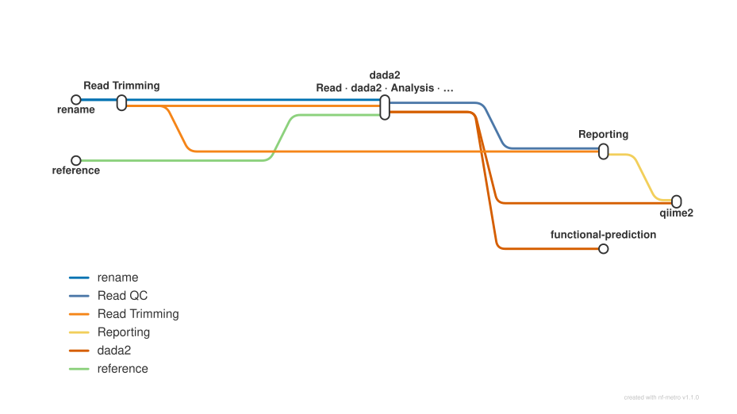

# Amplicon sequencing (16S/ITS): DADA2 denoising, taxonomy assignment, QIIME2 diversity/ANCOM, PICRUSt, SBDI export, phyloseq/TSE objects and QC

<div class="ox-page-badges"><span class="ox-badge ox-badge--live">✔ Live-tested</span> <span class="ox-badge ox-badge--origin">⇄ Official port</span> <span class="ox-badge ox-badge--nf"><span class="dot"></span>nf-core port</span></div>

Amplicon sequencing analysis (16S/ITS) that takes raw paired-end reads through FastQC quality control, cutadapt primer trimming (incl. the illumina_pe_its read-through pass), DADA2 denoising (quality profiles, filterAndTrim, learnErrors, denoise, chimera removal, read tracking, optional multi-run merge), taxonomy assignment against the SBDI-GTDB reference (or the ITS-cut length-filtered branch), a QIIME2 taxa barplot over sample metadata, optional QIIME2 downstream analyses (phylogenetic tree, alpha/beta diversity, abundance table exports, ANCOM/ANCOM-BC/ANCOM-BC2, classifier training/prediction), optional PICRUSt2 functional predictions, an overall summary table and a MultiQC report.

| | |
|---:|---|
| **Rating** | ✔ Live-tested |
| **Origin** | port |
| **Domain** | amplicon |
| **Rules** | 54 |
| **Compute** | up to 10 CPUs / 20 GB per rule (DADA2 rules; qiime2_preptax/qiime2_classify 10c/20G, 24h limits); picrust 10 CPUs / 50 GB / 24h; QIIME2 rules need the qiime2 container (~20GB unpacked) |
| **Tools** | fastqc · cutadapt · python · pandas · r-base · dada2 · bioconductor-digest · bioconductor-biostrings · itsx · itsxrust · curl · biocontainers · qiime2 · picrust2 · multiqc |
| **Ported** | 2026-08-15 |
| **License** | Apache-2.0 |
| **Source** | [nf-core/ampliseq](https://github.com/nf-core/ampliseq) |
| **Pinned version** | `2.18.0` |

## Run it

```bash
oxo-flow run main.oxoflow
```

Default config runs the DADA2 path (denoising, taxonomy against the auto-downloaded SBDI-GTDB reference, read-tracking summary, MultiQC); the QIIME2 (barplot + downstream diversity/ANCOM/classifier), ITS, multi-run and PICRUSt branches are opt-in toggles — see Fidelity. Preview with `oxo-flow dry-run main.oxoflow`.

## Installation

**Engine.** oxo-flow >= 0.12.0

**Toolchain.** containers (Docker/Singularity) — pinned images

**Requirements.**
- raw paired-end FASTQ reads per sample (raw/<sample>_R1.fastq.gz / _R2.fastq.gz) plus a sample groups file (default test/fixtures/groups.tsv)
- sample metadata TSV for the QIIME2 analyses (config metadata_file, default test/fixtures/metadata.tsv); the SBDI-GTDB taxonomy reference database is downloaded automatically
- compute: up to 10 CPUs / 20 GB per rule (dada2_denoising with 48h limit, dada2_taxonomy/dada2_taxonomy_its/qiime2_preptax/qiime2_classify with 24h limits); the QIIME2 rules need the qiime2 container (~20GB unpacked), picrust needs 10 CPUs / 50 GB
- host: Docker or Singularity to run the pinned container images, curl for the taxonomy-database download rule, and network access to figshare / data.qiime2.org
- optional: disk for intermediates/ and results/ plus the auto-downloaded SBDI-GTDB reference database and SILVA classifier inputs

```bash
# 1. install oxo-flow (release binary, recommended)
curl -fL -o oxo-flow.tar.gz https://github.com/Traitome/oxo-flow/releases/latest/download/oxo-flow-latest-x86_64-unknown-linux-gnu.tar.gz
tar xzf oxo-flow.tar.gz && sudo mv oxo-flow /usr/local/bin/
#    or, via conda (may lag behind releases):
#    conda install -c bioconda oxo-flow-cli
#    NOTE: bioconda currently ships 0.10.2, older than the >= 0.12.0
#    minimum of every catalog entry — prefer the release binary.

# 2. get this workflow (clones the repo, auto-discovers the workflow,
#    sanity-parses it with the engine)
oxo-flow pull gh:oxo-flow-community/oxo-flow-ampliseq
#    (alternative: plain git clone)
#    git clone https://github.com/oxo-flow-community/oxo-flow-ampliseq
```

## Parameters

| Parameter | Default | Description | Used by |
|---:|---|---|---|
| `FW_primer` | `` | --- primers (upstream default null renders literal "null" adapters; port uses empty strings — see README fidelity table) --- | `cutadapt`, `qiime2_preptax` |
| `RV_primer` | `` | — | `cutadapt`, `qiime2_preptax` |
| `ancom` | `false` | — | `qiime2_ancom`, `qiime2_metadata_categories` |
| `ancombc` | `false` | — | `qiime2_ancombc`, `qiime2_metadata_categories` |
| `ancombc2` | `false` | — | `qiime2_ancombc2`, `qiime2_metadata_categories` |
| `ancombc2_formula` | `` | — | `qiime2_ancombc2` |
| `ancombc_effect_size` | `1` | — | `qiime2_ancombc` |
| `ancombc_formula` | `` | comma-separated formulas | `qiime2_ancombc` |
| `ancombc_significance` | `0.05` | — | `qiime2_ancombc` |
| `classifier` | `` | — | `qiime2_classify`, `qiime2_intax` |
| `cut_its` | `none` | truncation (truncLen=0) + a second cutadapt read-through pass removing revcomp primers | `dada2_taxonomy`, `dada2_taxonomy_its`, `filter_len_itsx`, `itsx_cutasv`, `itsxrust_cutasv`, `qiime2_inasv`, `qiime2_inasv_its`, `qiime2_inseq`, `qiime2_inseq_its` |
| `cutadapt_max_error_rate` | `0.1` | — | `cutadapt` |
| `cutadapt_min_overlap` | `3` | cutadapt | `cutadapt` |
| `dada_addspecies_allowmultiple` | `false` | — | `dada2_taxonomy`, `dada2_taxonomy_its` |
| `dada_assign_chunksize` | `10000` | — | `dada2_taxonomy`, `dada2_taxonomy_its` |
| `dada_assign_taxlevels` | `Domain,Kingdom,Phylum,Class,Order,Family,Genus,Species` | — | `dada2_taxonomy`, `dada2_taxonomy_its` |
| `dada_min_boot` | `50` | DADA2 taxonomy assignment | `dada2_taxonomy`, `dada2_taxonomy_its` |
| `dada_ref_taxonomy` | `sbdi-gtdb=R11-RS232-1` | — | — |
| `dada_ref_taxonomy_citation` | `Lundin D, Andersson A. SBDI Sativa curated 16S GTDB database. FigShare. doi: 10.17044/scilifelab.14869077.v12` | — | — |
| `dada_ref_taxonomy_dbversion` | `SBDI-GTDB-R11-RS232-1 (https://figshare.scilifelab.se/articles/dataset/SBDI_Sativa_curated_16S_GTDB_database/14869077/10)` | — | — |
| `dada_ref_taxonomy_title` | `SBDI-GTDB - Sativa curated 16S GTDB database - Release R11-RS232-1` | — | — |
| `dada_ref_taxonomy_urls` | `https://ndownloader.figshare.com/files/64711203,https://ndownloader.figshare.com/files/64711218` | — | `download_taxonomy_db` |
| `dada_taxonomy_rc` | `false` | — | `dada2_taxonomy`, `dada2_taxonomy_its` |
| `diversity_rarefaction_depth` | `500` | floor for core-metrics depth | `qiime2_diversity_core` |
| `illumina_pe_its` | `false` | --- ITS branch (upstream params.illumina_pe_its / cut_its / its_partial / its_extractor — all default off -> 16S path) --- | `cutadapt`, `dada2_filtntrim`, `trunclen_fw`, `trunclen_rv` |
| `its_extractor` | `itsx` | "itsx" \| "itsxrust" | `itsx_cutasv`, `itsxrust_cutasv` |
| `its_partial` | `0` | keep partial ITS hits (ITSx --partial N) | `itsx_cutasv`, `itsxrust_cutasv` |
| `max_ee` | `2` | — | `dada2_filtntrim` |
| `max_len` | `Inf` | — | `dada2_filtntrim` |
| `merge_runs` | `false` | --- multi-run merge (upstream DADA2_MERGE globs *.stats.tsv / *.ASVtable.rds when several --run_ids are given) --- | `dada2_merge` |
| `mergepairs_strategy` | `merge` | "merge" \| "consensus" \| "concatenate" | `dada2_denoising` |
| `metadata_file` | `test/fixtures/metadata.tsv` | — | `qiime2_alphararefaction`, `qiime2_ancom`, `qiime2_ancombc`, `qiime2_ancombc2`, `qiime2_barplot`, `qiime2_diversity_adonis`, `qiime2_diversity_alpha`, `qiime2_diversity_beta`, `qiime2_diversity_betaord`, `qiime2_diversity_core`, `qiime2_metadata_categories` |
| `min_len` | `50` | — | `dada2_filtntrim` |
| `picrust` | `false` | picrust (upstream params.picrust, default false) | `picrust` |
| `qiime_adonis_formula` | `` | comma-separated, e.g. "group" | `qiime2_diversity_adonis` |
| `qiime_ref_taxonomy` | `` | --- QIIME2 taxonomy classifier (upstream params.qiime_ref_taxonomy / params.classifier — off by default; DADA2 taxonomy is the default path). qiime_ref_taxonomy trains a Naive-Bayes classifier on the primer-extracted reference below; classifier is a path to a pre-trained .qza (skips training). --- | `qiime2_classify`, `qiime2_intax`, `qiime2_preptax` |
| `qiime_ref_taxonomy_urls` | `https://data.qiime2.org/2023.7/common/silva-138-99-seqs.qza,https://data.qiime2.org/2023.7/common/silva-138-99-tax.qza` | — | `qiime2_preptax` |
| `quality_type` | `Auto` | — | `dada2_denoising`, `dada2_err`, `dada2_filtntrim` |
| `run_id` | `1` | run / metadata | `dada2_denoising`, `dada2_err`, `dada2_merge`, `dada2_rmchimera`, `dada2_stats` |
| `run_qiime2` | `false` | the four qiime2 rules run in the quay.io/qiime2/amplicon container (~20GB unpacked — needs ~25GB free disk for the pull; there is no conda qiime2 on common mirrors). Upstream runs qiime2 always; the port gates it (default false) so a fresh clone completes the DADA2 analysis without the container. Set true (with the disk) to enable. | `qiime2_alphararefaction`, `qiime2_ancom`, `qiime2_ancombc`, `qiime2_ancombc2`, `qiime2_barplot`, `qiime2_classify`, `qiime2_diversity_adonis`, `qiime2_diversity_alpha`, `qiime2_diversity_beta`, `qiime2_diversity_betaord`, `qiime2_diversity_core`, `qiime2_diversity_tree`, `qiime2_export_absolute`, `qiime2_export_relasv`, `qiime2_export_reltax`, `qiime2_inasv`, `qiime2_inasv_its`, `qiime2_inseq`, `qiime2_inseq_its`, `qiime2_intax`, `qiime2_metadata_categories`, `qiime2_preptax` |
| `sample_inference` | `independent` | "independent" \| "pooled" \| "pseudo" | `dada2_denoising` |
| `seed` | `100` | — | `dada2_denoising`, `dada2_err`, `dada2_taxonomy`, `dada2_taxonomy_its` |
| `skip_abundance_tables` | `false` | feature-table exports (abs/rel) | `qiime2_export_absolute`, `qiime2_export_relasv`, `qiime2_export_reltax` |
| `skip_alpha_rarefaction` | `false` | — | `qiime2_alphararefaction`, `qiime2_diversity_tree` |
| `skip_barplot` | `false` | — | `qiime2_barplot` |
| `skip_dada_taxonomy` | `false` | — | `dada2_taxonomy`, `dada2_taxonomy_its`, `download_taxonomy_db`, `format_taxonomy`, `qiime2_barplot`, `qiime2_intax` |
| `skip_diversity_indices` | `false` | — | `qiime2_diversity_adonis`, `qiime2_diversity_alpha`, `qiime2_diversity_beta`, `qiime2_diversity_betaord`, `qiime2_diversity_core`, `qiime2_diversity_tree`, `qiime2_metadata_categories` |
| `skip_fastqc` | `false` | skip flags (upstream params.skip_*, all default false -> full default path) | `fastqc` |
| `skip_multiqc` | `false` | — | `multiqc` |
| `skip_qiime` | `false` | — | `qiime2_barplot`, `qiime2_inasv`, `qiime2_inasv_its`, `qiime2_inseq`, `qiime2_inseq_its`, `qiime2_intax` |
| `skip_qiime_downstream` | `false` | --- QIIME2 downstream analyses beyond the taxa barplot (upstream params.skip_qiime_downstream default false; the port gates all of these on run_qiime2 as well) --- | `qiime2_alphararefaction`, `qiime2_ancom`, `qiime2_ancombc`, `qiime2_ancombc2`, `qiime2_diversity_adonis`, `qiime2_diversity_alpha`, `qiime2_diversity_beta`, `qiime2_diversity_betaord`, `qiime2_diversity_core`, `qiime2_diversity_tree`, `qiime2_export_absolute`, `qiime2_export_relasv`, `qiime2_export_reltax`, `qiime2_metadata_categories` |
| `skip_taxonomy` | `false` | — | `dada2_taxonomy`, `dada2_taxonomy_its`, `download_taxonomy_db`, `format_taxonomy`, `qiime2_ancom`, `qiime2_ancombc`, `qiime2_ancombc2`, `qiime2_barplot`, `qiime2_classify`, `qiime2_export_absolute`, `qiime2_export_relasv`, `qiime2_export_reltax`, `qiime2_intax`, `qiime2_preptax` |
| `tax_agglom_max` | `6` | — | `qiime2_ancom`, `qiime2_ancombc`, `qiime2_ancombc2`, `qiime2_export_absolute`, `qiime2_export_reltax` |
| `tax_agglom_min` | `2` | — | `qiime2_ancom`, `qiime2_ancombc`, `qiime2_ancombc2`, `qiime2_export_absolute`, `qiime2_export_reltax` |
| `trunc_qmin` | `25` | DADA2 filtering / denoising | `trunclen_fw`, `trunclen_rv` |
| `trunc_rmin` | `0.75` | — | `trunclen_fw`, `trunclen_rv` |
| `truncq` | `2` | — | `dada2_filtntrim` |

Descriptions are the workflow's own `#` comments from its `[config]` section, surfaced by `oxo-flow info` — no schema file to maintain.

## Workflow graph

<div class="ox-dag-card" markdown="1">



</div>

The graph is derived at catalog-build time from `oxo-flow graph -f dot` and rendered with Graphviz. It shows the workflow at rule level: wildcard `{sample}` instances expand at run time when sample data is discovered (the runtime view is `oxo-flow graph --expanded`).

## Scope

The default-parameters main path of the source pipeline was ported rule-for-rule; alternate paths are documented as excluded.

**In scope**

- rename_raw_data_files
- fastqc
- cutadapt
- cutadapt_summary
- cutadapt_summary_merge
- dada2_quality_fw
- dada2_quality_rv
- trunclen_fw
- trunclen_rv
- dada2_filtntrim
- dada2_quality_fw_preprocessed
- dada2_quality_rv_preprocessed
- dada2_err
- dada2_denoising
- dada2_rmchimera
- dada2_stats
- dada2_merge
- merge_stats
- itsx_cutasv
- itsxrust_cutasv
- filter_len_itsx
- download_taxonomy_db
- format_taxonomy
- dada2_taxonomy
- dada2_taxonomy_its
- qiime2_inasv
- qiime2_inseq
- qiime2_inasv_its
- qiime2_inseq_its
- qiime2_intax
- qiime2_barplot
- qiime2_metadata_categories
- qiime2_diversity_tree
- qiime2_alphararefaction
- qiime2_diversity_core
- qiime2_diversity_alpha
- qiime2_diversity_beta
- qiime2_diversity_betaord
- qiime2_diversity_adonis
- qiime2_export_absolute
- qiime2_export_relasv
- qiime2_export_reltax
- qiime2_ancom
- qiime2_ancombc
- qiime2_ancombc2
- qiime2_preptax
- qiime2_classify
- multiqc
- picrust

**Excluded**

- nanopore: nanopore sequencing branch (params.nanopore) — absent from the 2.18.0 codebase (grep-verified; only docs/usage.md mentions Nanopore re ITSxRust long reads)
- syncom: synthetic community controls branch (params.syncom) — absent from the 2.18.0 codebase (grep-verified)
- versions.yml: per-module tool version files — the port pins versions in the env files / container tags instead

## Fidelity

| Upstream process/rule | oxo-flow rule | Tool (version) | Notes |
|---|---|---|---|
| RENAME_RAW_DATA_FILES | `rename_raw_data_files` | nf-core/ubuntu 20.04 | identical command (soft links) |
| FASTQC | `fastqc` | fastqc 0.12.1 | identical command; upstream publishes only `*.html` — the port also declares the `*.zip` files because MultiQC consumes them |
| CUTADAPT_BASIC | `cutadapt` | cutadapt 5.2 | identical `ext.args` (`-O 3 -e 0.1 -g/-G --discard-untrimmed`) |
| CUTADAPT_SUMMARY | `cutadapt_summary` | python 3.8.3 | verbatim `bin/cutadapt_summary.py`, `paired_end` mode |
| CUTADAPT_SUMMARY_MERGE | `cutadapt_summary_merge` | — | copy action |
| DADA2_QUALITY1 / DADA2_QUALITY2 | `dada2_quality_fw`, `dada2_quality_rv`, `dada2_quality_fw_preprocessed`, `dada2_quality_rv_preprocessed` | r-base 4.0.3 / dada2 1.26.0 | upstream runs the same process twice per stage with different prefixes; the port splits each into one rule per prefix |
| TRUNCLEN | `trunclen_fw`, `trunclen_rv` | pandas 1.1.5 | verbatim `bin/trunclen.py` |
| DADA2_FILTNTRIM | `dada2_filtntrim` | dada2 1.26.0 | identical `filterAndTrim` args; args file renamed `{sample}.filterAndTrim.args.txt` (all oxo-flow rules share one workdir, upstream name would collide); `ID` column uses the file basename so read-tracking sample names match upstream |
| DADA2_ERR | `dada2_err` | dada2 1.26.0 | identical `learnErrors` args + `checkConvergence`/`plotErrors` outputs |
| DADA2_DENOISING | `dada2_denoising` | dada2 1.26.0 | identical `dada` (incl. `getDadaOpt` defaults) + `mergePairs` + `makeSequenceTable`; `params.sample_inference` wired to `pool =` (upstream only records it in the args file); retries=3 (upstream `error_retry`), 48h limit (`process_long`) |
| DADA2_RMCHIMERA | `dada2_rmchimera` | dada2 1.26.0 | identical `removeBimeraDenovo` args |
| DADA2_STATS | `dada2_stats` | dada2 1.26.0 | identical read-tracking table |
| DADA2_MERGE | `dada2_merge` | dada2 1.26.0 / digest 0.6.27 | both branches: single-run path, and `merge_runs = true` merges all run-level stats/ASV tables (unique rbind + `mergeSequenceTables` `repeats="error", orderBy="abundance", tryRC=FALSE`); the port passes the run-level files as argv (upstream globs `*.stats.tsv`/`*.ASVtable.rds` in its cwd) — see `scripts/dada2_merge.R` |
| ITSX_CUTASV | `itsx_cutasv` | itsx 1.1.3 | identical `ITSx` call (`--save_regions` from `cut_its`, `--partial` from `its_partial`); the config-dependent outfile is copied to the fixed `intermediates/itsx/ASV_ITS_seqs.fasta` so downstream rules have static inputs |
| ITSXRUST_CUTASV | `itsxrust_cutasv` | itsxrust 0.2.2 | identical `itsxrust extract` (HMM from `share/itsxrust/hmm/F.hmm`), same region outputs + `sed` header cleanup |
| FILTER_LEN_ITSX | `filter_len_itsx` | biostrings 2.66.0 (R 4.2 build; upstream 2.58.0 on R 4.0.3) | verbatim `bin/filter_len.R` with the ITSX `ext.args` (min 50 / max 1000000) |
| DADA2_TAXONOMY_WF (ITS) | `dada2_taxonomy_its` | dada2 1.26.0 | same chunked assignTaxonomy/addSpecies machinery as `dada2_taxonomy`, on the ITS-cut length-filtered fasta with the `.ASV_ITS_tax.<ref>` suffix, then `bin/add_full_sequence_to_taxfile.py` maps the taxonomy back onto the full ASV fasta — same published `ASV_tax.<ref>.tsv` / `ASV_tax_species.<ref>.tsv` paths as the default branch (the two rules are mutually exclusive via their gates) |
| QIIME2_INASV / QIIME2_INSEQ (ITS) | `qiime2_inasv_its`, `qiime2_inseq_its` | qiime2 2026.4 | same imports as the default variants but over the ITS-cut length-filtered table/seqs; they share the `intermediates/qiime2/table.qza` / `rep-seqs.qza` output paths with the default rules (mutually exclusive gates) |
| METADATA_ALL / METADATA_PAIRWISE | `qiime2_metadata_categories` | r-base 4.2 | verbatim `bin/metadata_all.r` / `bin/metadata_pairwise.r` in a conda rule (the qiime2 image has no Rscript); runs only when the QIIME2 downstream analyses need categories |
| QIIME2_TREE | `qiime2_diversity_tree` | qiime2 2026.4 | identical mafft → mask → fasttree → midpoint-root chain; rooted tree exported as `tree.nwk` |
| QIIME2_ALPHARAREFACTION | `qiime2_alphararefaction` | qiime2 2026.4 | identical: max-depth = min-read-count of `results/overall_summary.tsv` (via `bin/count_table_minmax_reads.py`, same file format as upstream MERGE_STATS_STD output) capped at 75000, steps 250 or maxdepth/20, 10 iterations |
| QIIME2_DIVERSITY_CORE | `qiime2_diversity_core` | qiime2 2026.4 | identical core-metrics (sampling depth = min-read-count with `diversity_rarefaction_depth` floor, `UNIFRAC_USE_GPU=N`); the qza outputs feed the alpha/beta/betaord/adonis rules, the 4 distance matrices are exported as tsv |
| QIIME2_DIVERSITY_ALPHA / BETA / BETAORD / ADONIS | `qiime2_diversity_alpha`, `qiime2_diversity_beta`, `qiime2_diversity_betaord`, `qiime2_diversity_adonis` | qiime2 2026.4 | identical commands (beta: `--p-pairwise` per distance × metadata category; adonis: `--p-n-jobs 1`, `--p-formula` per comma-separated `qiime_adonis_formula`); upstream fans channels out, the port loops over the category/formula lists in-shell — **data-dependent outputs**: the declared file sets assume the default fixture metadata ("group") / configured formulas |
| QIIME2_EXPORT_ABSOLUTE / RELASV / RELTAX | `qiime2_export_absolute`, `qiime2_export_relasv`, `qiime2_export_reltax` | qiime2 2026.4 | identical export + biom convert + collapse/relative-frequency loops over `tax_agglom_min`..`tax_agglom_max` (default 2..6, so the declared outputs cover that range) |
| QIIME2_ANCOM / ANCOMBC / ANCOMBC2 | `qiime2_ancom`, `qiime2_ancombc`, `qiime2_ancombc2` | qiime2 2026.4 | identical per-category filtering (`--p-where "${cat}<>''"`), ASV + per-level analyses, `<2`-taxa WARNING branch, ANCOMBC `--p-prv-cut 0.1 --p-lib-cut 500 --p-alpha 0.05 --p-conserve` + da-barplot thresholds, ANCOMBC2 `--p-p-adjust-method "holm" --p-prevalence-cutoff 0.1 --p-alpha 0.05` + `bin/ancombc_volcanoplot.r`; `ancombc_formula`/`ancombc2_formula` variants run on the unfiltered table like upstream. Upstream's error-ignore WARNING files become `<...>.WARNING.txt` next to the export dirs |
| QIIME2_PREPTAX (incl. EXTRACT + TRAIN) | `qiime2_preptax` | qiime2 2026.4 | identical: downloads the `qiime_ref_taxonomy_urls` qza pair, `bin/taxref_reformat_qiime_silva138.sh`, imports, `extract-reads` with `FW_primer`/`RV_primer`, `fit-classifier-naive-bayes` → `intermediates/qiime2/classifier.qza` |
| QIIME2_TAXONOMY (classify) | `qiime2_classify` | qiime2 2026.4 | identical `classify-sklearn --p-n-jobs` + tabulate + export to `results/qiime2/taxonomy/`; a user-supplied `classifier` is copied in-shell (skips training); in classifier mode the DADA2-taxonomy import (`qiime2_intax`) is gated off and the classifier taxonomy takes over the same `intermediates/qiime2/taxonomy.qza` path |
| PICRUST | `picrust` | picrust2 2.6.3 | identical `picrust2_pipeline.py -t epa-ng --remove_intermediate --in_traits EC,KO` + `add_descriptions.py` ×3 (EC/KO/METACYC); the upstream source-message file (filename == message text) is written as `picrust_message.txt`; resource hint process_high + process_medium_memory = 10 cpus / 50G |
| — (not ported) | — | — | nanopore branch (`params.nanopore` — absent from the 2.18.0 codebase, docs only), syncom controls (`params.syncom` — absent from the 2.18.0 codebase), `versions.yml` per-module tool version files (the port pins versions in the env files / container tags instead), report generators not ported — SBDI export (`params.sbdiexport` default false, off by default upstream), default-on phyloseq/TSE R objects and the Rmd summary report (`params.skip_phyloseq`/`skip_tse`/`skip_report` all default false) |
| MERGE_STATS_STD | `merge_stats` | r-base 4.0.3 | identical merge by `sample` |
| DB download (launcher) | `download_taxonomy_db` | curl | upstream downloads the reference DB in the Nextflow launcher (`file(url)`); the port makes it an explicit system-backend rule |
| FORMAT_TAXONOMY | `format_taxonomy` | biocontainers 1.2.0 | verbatim `bin/taxref_reformat_sbdi-gtdb.sh`; runs in a scratch dir (the script globs `*`) |
| DADA2_TAXONOMY + DADA2_ADDSPECIES + collectFile | `dada2_taxonomy` | dada2 1.26.0 | **merged**: upstream splits `ASV_seqs.fasta` into 10000-sequence chunks (`splitFasta by: 10000`) and runs assignTaxonomy + addSpecies per chunk, then concatenates chunk tables with header + sorted rows (`collectFile keepHeader, skip 1, sort`). The port replicates chunking with `awk` + per-chunk `Rscript` calls + `head`/`tail -n +2 | sort` concatenation — same chunk files, same args, same outputs. addSpecies resource hint (1 cpu/50G) becomes rule-level 10 cpus/20G, 24h limit |
| QIIME2_INASV | `qiime2_inasv` | qiime2 2026.4 | identical: biom convert + `tools import` `BIOMV210Format` |
| QIIME2_INSEQ | `qiime2_inseq` | qiime2 2026.4 | identical `FeatureData[Sequence]` import |
| QIIME2_INTAX | `qiime2_intax` | qiime2 2026.4 | verbatim `bin/parse_dada2_taxonomy.r` (porting change: output path is argv[2]) + `HeaderlessTSVTaxonomyFormat` import |
| QIIME2_BARPLOT | `qiime2_barplot` | qiime2 2026.4 | identical `taxa barplot` + `tools export` |
| MULTIQC | `multiqc` | multiqc 1.34 | identical command in a scratch dir (`multiqc` scans cwd `.`); verbatim `assets/multiqc_config.yml` |

Other notes:

- `params.FW_primer`/`RV_primer` default to `null` upstream, which renders
  a literal `null` adapter into the cutadapt command; the port defaults
  them to empty strings (`-g ""`/`-G ""` = no 5'/3' adapter trimming), the
  behavior the upstream docs describe.
- All skip flags map 1:1 to `params.skip_*` (default false = full path).
  `skip_fastqc` requires `skip_multiqc` too — the MultiQC rule consumes the
  FastQC zips. `skip_taxonomy`/`skip_dada_taxonomy` additionally gate the
  QIIME2 taxonomy import and barplot, mirroring upstream's empty-taxonomy
  channel handling.
- `metadata_file` is a config key (default `test/fixtures/metadata.tsv`);
  upstream takes it from the samplesheet.
- Deviations: the QIIME2 rules pin the container at
  `quay.io/qiime2/amplicon:2026.1` (upstream modules use `2026.4` — the
  version the port was built and live-tested against); `skip_qiime_downstream`
  scopes to the newly ported downstream rules (diversity, exports, ANCOM,
  classifier) and does not turn off the taxonomy import/barplot;
  data-dependent outputs (metadata categories, `tax_agglom_min`/`max`,
  adonis formulas, `<2`-taxa WARNING branches) declare the file set for the
  default fixture/parameters; PICRUSt always uses the DADA2 source
  (upstream switches to the QIIME2-filtered table when `run_qiime2` +
  abundance tables + a taxonomy are available — the port documents the
  DADA2 basis in `results/picrust/picrust_message.txt`); the rarefaction
  WARNING txt files (upstream `error_ignore` emits) are not declared as
  rule outputs.

## Links

- Repository: [oxo-flow-ampliseq](https://github.com/oxo-flow-community/oxo-flow-ampliseq)
- Upstream: [nf-core/ampliseq](https://github.com/nf-core/ampliseq) @ `2.18.0`
- License: Apache-2.0 (this workflow) · MIT (upstream)

Created on 2026-08-15 — this port may lag behind upstream releases. See the repository's NOTICE for full attribution.
