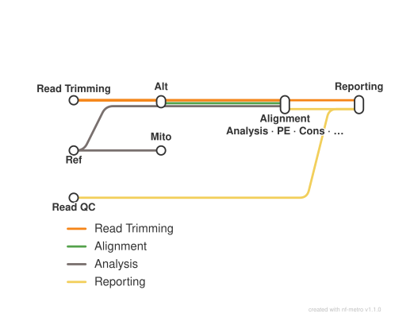

<div class="ox-crumb"><a href="/pipelines/">Pipelines</a> / <span>oxo-flow-atacseq</span></div>
<div class="ox-detail-cols">
<div>
<h1>ATAC-seq: peak calling and QC</h1>
<div class="ox-page-badges"><span class="ox-badge ox-badge--live">✔ Live-tested</span> <span class="ox-badge ox-badge--origin">⇄ Official port</span> <span class="ox-badge ox-badge--nf"><span class="dot"></span>nf-core port</span></div>
<p>ATAC-seq peak calling and QC: FastQC raw-read QC, Trim Galore adapter trimming, BWA-MEM alignment, Picard mark-duplicates, BAMTools filtering, MACS2 broad-peak calling, HOMER peak annotation, FRiP scoring, normalised bigWig tracks, deepTools QC plots and a combined MultiQC report. Default plan is the upstream single-end aligner=bwa main path (15 rules); when-gated branches port the paired-end path, Bowtie2/Chromap/STAR aligners, reference preparation, mitochondrial filtering, consensus peaks/DESeq2, preseq, Picard metrics, ataqv, IGV and R QC plots (27 further rules), and the merged-replicate analysis over <code>_REP\d+</code> sample groups (43 total).</p>
</div>
<div>
<div class="ox-glance">
<div class="ox-glance-title">At a glance</div>
<div class="ox-kv"><span class="k">Rating</span><span class="v live">✔ Live-tested</span></div>
<div class="ox-kv"><span class="k">Rules</span><span class="v">43</span></div>
<div class="ox-kv"><span class="k">Compute</span><span class="v">up to 12 CPUs / 72 GB per rule</span></div>
<div class="ox-kv"><span class="k">Engine</span><span class="v"><span class="ox-badge ox-badge--nf"><span class="dot"></span>nf-core port</span></span></div>
<div class="ox-kv"><span class="k">Origin</span><span class="v">⇄ Official port</span></div>
<div class="ox-kv"><span class="k">Domain</span><span class="v">epigenomics</span></div>
<div class="ox-kv"><span class="k">Source</span><span class="v"><a href="https://github.com/nf-core/atacseq">nf-core/atacseq</a></span></div>
<div class="ox-kv"><span class="k">Pinned version</span><span class="v"><code>2.1.2</code></span></div>
<div class="ox-kv"><span class="k">Ported</span><span class="v">2026-08-15</span></div>
<div class="ox-kv"><span class="k">License</span><span class="v">Apache-2.0</span></div>
<p class="cmd">$ oxo-flow run main.oxoflow</p>
</div>
</div>
</div>

## Run it

```bash
oxo-flow run main.oxoflow
```

Needs reference genome and peak-calling inputs — see Requirements.

## Installation

**Engine.** oxo-flow >= 0.12.0 (the merged-replicate mode — `_REP\d+` sample groups plus config.merged_samples — additionally requires oxo-flow with input_groups support, Traitome/oxo-flow#231; on released engines the gate is inert and the default path is unchanged)

**Toolchain.** containers (Docker/Singularity) — pinned images for 40 of 43 rules, plus one pinned conda env (envs/picard-samtools.yaml) shared by the three picard rules (picard_mergesamfiles, picard_markduplicates, merge_replicates)

**Requirements.**

- reference data: genome FASTA with .fai, BWA index prefix (.amb/.ann/.bwt/.pac/.sa), chrom sizes file, GTF annotation, gene BED, TSS BED (optional blacklist BED); alt-aligner indexes for aligner=bowtie2/chromap/star
- input: single-end <sample>.fastq.gz reads (default) or <sample>_1/2.fastq.gz (paired=true), declared in [[sample_groups]]; replicate groups use the upstream _REP\d+ suffix and feed config.merged_samples (see README)
- compute: up to 12 CPUs / 72 GB per rule
- runtime: Docker or Singularity for the 13 container rules on the default path (40 across all branches); conda/mamba for the two picard rules (picard_mergesamfiles, picard_markduplicates)

```bash
# 1. install oxo-flow (release binary, recommended)
curl -fL -o oxo-flow.tar.gz https://github.com/Traitome/oxo-flow/releases/latest/download/oxo-flow-latest-x86_64-unknown-linux-gnu.tar.gz
tar xzf oxo-flow.tar.gz && sudo mv oxo-flow /usr/local/bin/
#    or, via conda (may lag behind releases):
#    conda install -c bioconda oxo-flow-cli
#    NOTE: bioconda currently ships 0.10.2, older than the >= 0.12.0
#    minimum of every catalog entry — prefer the release binary.

# 2. get this workflow (clones the repo, auto-discovers the workflow,
#    sanity-parses it with the engine)
oxo-flow pull gh:oxo-flow-community/oxo-flow-atacseq
#    (alternative: plain git clone)
#    git clone https://github.com/oxo-flow-community/oxo-flow-atacseq
```

## Parameters

| Parameter | Default | Description | Used by |
|---:|---|---|---|
| `aligner` | `bwa` | params.aligner: "bwa" (default) \| "bowtie2" \| "chromap" \| "star" (SE only) | `alt::bowtie2_align`, `alt::chromap_align`, `alt::star_align`, `bwa_mem`, `pe::bwa_mem_pe`, `ref::bwa_index` |
| `blacklist` | `` | params.blacklist — include-regions BED (complement of ENCODE | `bamtools_filter`, `pe::bamtools_filter_pe` |
| `bowtie2_index` | `` | params.bowtie2 — index prefix (.rev.1.bt2 etc. beside it) for aligner="bowtie2" | `alt::bowtie2_align` |
| `broad_cutoff` | `0.1` | — | `macs2_callpeak` |
| `bwa_index` | `test/fixtures/genome/genome.fa` | params.bwa — index prefix (.amb/.ann/.bwt/.pac/.sa beside it) | `bwa_mem`, `pe::bwa_mem_pe`, `ref::bwa_index` |
| `chrom_sizes` | `test/fixtures/genome/genome.fa.sizes` | CUSTOM_GETCHROMSIZES output | `mito::genome_blacklist_regions`, `ref::custom_getchromsizes`, `ucsc_bedgraphtobigwig` |
| `chromap_index` | `` | params.chromap — index file for aligner="chromap" | `alt::chromap_align` |
| `deseq2_vst` | `true` | params.deseq2_vst | `cons::deseq2_qc` |
| `fingerprint_bins` | `500000` | — | `pe::plotfingerprint_pe`, `plotfingerprint` |
| `fragment_size` | `200` | — | `bedtools_genomecov`, `plotfingerprint` |
| `gene_bed` | `test/fixtures/genome/gene.bed` | params.gene_bed | `deeptools_plots` |
| `gtf` | `test/fixtures/genome/genes.gtf` | params.gtf | `cons::homer_annotatepeaks_consensus`, `homer_annotatepeaks` |
| `keep_dups` | `false` | — | — |
| `keep_mito` | `false` | params.keep_mito — keep mitochondrial reads when mito_name set | `mito::genome_blacklist_regions` |
| `keep_multi_map` | `false` | — | — |
| `macs_gsize` | `2.7e9` | blacklist + chrM when keep_mito=false); empty = no -L filter | `macs2_callpeak` |
| `min_reps_consensus` | `1` | params.min_reps_consensus | `cons::macs2_consensus` |
| `min_trimmed_reads` | `10000` | — | — |
| `mito_name` | `` | params.mito_name, e.g. "chrM" — enables mitochondrial filtering (needs config.chrom_sizes) | `bamtools_filter`, `mito::genome_blacklist_regions`, `pe::bamtools_filter_pe`, `qce::ataqv` |
| `multiqc_custom_peaks` | `false` | port-only switch: emit MULTIQC_CUSTOM_PEAKS peak-count/FRiP TSVs | `qce::multiqc_custom_peaks` |
| `narrow_peak` | `false` | Upstream default params (kept as config so CLI overrides work) | — |
| `out_dir` | `results` | params.outdir | `alt::bowtie2_align`, `alt::chromap_align`, `alt::star_align`, `bamtools_filter`, `bedtools_genomecov`, `bwa_mem`, `cons::deseq2_qc`, `cons::homer_annotatepeaks_consensus`, `cons::macs2_consensus`, `cons::subread_featurecounts`, `deeptools_plots`, `fastqc`, `frip_score`, `homer_annotatepeaks`, `macs2_callpeak`, `mito::genome_blacklist_regions`, `multiqc`, `pe::bamtools_filter_pe`, `pe::bedtools_genomecov_pe`, `pe::bwa_mem_pe`, `pe::fastqc_pe`, `pe::multiqc_pe`, `pe::pe_name_sort_remove_orphans`, `pe::plotfingerprint_pe`, `pe::trimgalore_pe`, `picard_markduplicates`, `picard_mergesamfiles`, `plotfingerprint`, `qce::ataqv`, `qce::get_autosomes`, `qce::igv`, `qce::mkarv`, `qce::multiqc_custom_peaks`, `qce::picard_collectmultiplemetrics`, `qce::plot_homer_annotatepeaks`, `qce::plot_macs2_qc`, `qce::preseq_lcextrap`, `samtools_sort_stats`, `trimgalore`, `ucsc_bedgraphtobigwig` |
| `paired` | `false` | Gated branches (defaults keep the default plan identical to the upstream default main path; toggle one key at a time to activate its branch only) | `alt::bowtie2_align`, `alt::chromap_align`, `alt::star_align`, `bamtools_filter`, `bedtools_genomecov`, `bwa_mem`, `cons::subread_featurecounts`, `fastqc`, `multiqc`, `pe::bamtools_filter_pe`, `pe::bedtools_genomecov_pe`, `pe::bwa_mem_pe`, `pe::fastqc_pe`, `pe::multiqc_pe`, `pe::pe_name_sort_remove_orphans`, `pe::plotfingerprint_pe`, `pe::trimgalore_pe`, `plotfingerprint`, `qce::ataqv`, `qce::get_autosomes`, `qce::mkarv`, `qce::picard_collectmultiplemetrics`, `qce::preseq_lcextrap`, `trimgalore` |
| `picard_xmx_gb` | `8` | GB passed to picard -Xmx. Previously derived from the rule's 36G resource budget (Xmx≈30G), which thrash-killed the JVM on a 3.7 GB machine (live run); the resource budget still drives scheduling. | `picard_markduplicates`, `qce::picard_collectmultiplemetrics` |
| `prepare_reference` | `false` | port switch: build BWA index + chrom sizes from config.reference | `ref::bwa_index`, `ref::custom_getchromsizes` |
| `raw_blacklist` | `` | params.blacklist — raw ENCODE blacklist BED (complemented into include-regions) | `bamtools_filter`, `mito::genome_blacklist_regions`, `pe::bamtools_filter_pe` |
| `raw_dir` | `test/fixtures/raw` | input fastqs (raw/<sample>.fastq.gz for single-end) | `fastqc`, `pe::fastqc_pe`, `pe::trimgalore_pe`, `trimgalore` |
| `reference` | `test/fixtures/genome/genome.fa` | Reference inputs. Upstream obtains these from nf-core iGenomes (--genome); this port expects pre-built files (see README "References"). | `alt::chromap_align`, `bamtools_filter`, `cons::homer_annotatepeaks_consensus`, `homer_annotatepeaks`, `pe::pe_name_sort_remove_orphans`, `picard_markduplicates`, `qce::get_autosomes`, `qce::igv`, `qce::picard_collectmultiplemetrics`, `ref::bwa_index`, `ref::custom_getchromsizes`, `samtools_sort_stats` |
| `save_trimmed` | `false` | — | — |
| `skip_ataqv` | `true` | upstream default false; port ships this branch OFF (set false to enable) | `qce::ataqv`, `qce::get_autosomes`, `qce::mkarv` |
| `skip_consensus_peaks` | `true` | upstream default false; port ships this branch OFF (set false to enable) | `cons::deseq2_qc`, `cons::homer_annotatepeaks_consensus`, `cons::macs2_consensus`, `cons::subread_featurecounts` |
| `skip_deseq2_qc` | `true` | upstream default false; port ships DESeq2 QC OFF (set false to enable) | `cons::deseq2_qc` |
| `skip_fastqc` | `false` | — | `fastqc`, `pe::fastqc_pe` |
| `skip_igv` | `true` | upstream default false; port ships this branch OFF (set false to enable) | `qce::igv` |
| `skip_multiqc` | `false` | — | `multiqc`, `pe::multiqc_pe` |
| `skip_peak_annotation` | `false` | params.skip_peak_annotation (default false — HOMER annotation on by default, as upstream) | `cons::homer_annotatepeaks_consensus`, `homer_annotatepeaks`, `qce::plot_homer_annotatepeaks`, `qce::plot_macs2_qc` |
| `skip_peak_qc` | `true` | upstream default false; port ships the R QC plots OFF (set false to enable) | `qce::plot_homer_annotatepeaks`, `qce::plot_macs2_qc` |
| `skip_picard_metrics` | `true` | upstream default false; port ships this branch OFF (set false to enable) | `qce::picard_collectmultiplemetrics` |
| `skip_plot_fingerprint` | `false` | — | `pe::plotfingerprint_pe`, `plotfingerprint` |
| `skip_plot_profile` | `false` | — | `deeptools_plots` |
| `skip_preseq` | `true` | params.skip_preseq (upstream default true — preseq off by default) | `qce::preseq_lcextrap` |
| `skip_qc` | `false` | — | `fastqc`, `pe::fastqc_pe` |
| `skip_trimming` | `false` | — | `pe::trimgalore_pe`, `trimgalore` |
| `star_index` | `` | params.star — STAR genome dir (built by STAR_GENOMEGENERATE upstream) for aligner="star" | `alt::star_align` |
| `tss_bed` | `test/fixtures/genome/tss.bed` | params.tss_bed | `deeptools_plots`, `qce::ataqv` |

{: .ox-params }

Descriptions are the workflow's own `#` comments from its `[config]` section, surfaced by `oxo-flow info` — no schema file to maintain.

## Workflow graph

<div class="ox-dag-card" markdown="1">



</div>

The graph is derived at catalog-build time from `oxo-flow graph -f dot` and rendered with Graphviz. It shows the workflow at rule level: wildcard `{sample}` instances expand at run time when sample data is discovered (the runtime view is `oxo-flow graph --expanded`).

## Scope

The default-parameters main path of the source pipeline was ported rule-for-rule; alternate paths are documented as excluded.

**In scope**

- fastqc
- trimgalore
- bwa_mem
- samtools_sort_stats
- picard_mergesamfiles
- picard_markduplicates
- bamtools_filter
- macs2_callpeak
- homer_annotatepeaks
- frip_score
- bedtools_genomecov
- ucsc_bedgraphtobigwig
- deeptools_plots
- plotfingerprint
- multiqc
- pe::fastqc_pe, pe::trimgalore_pe, pe::bwa_mem_pe, pe::bamtools_filter_pe, pe::pe_name_sort_remove_orphans, pe::bedtools_genomecov_pe, pe::plotfingerprint_pe, pe::multiqc_pe (paired-end branch, when config.paired)
- alt::bowtie2_align, alt::chromap_align, alt::star_align (alternative aligners, when config.aligner != 'bwa'; SE only)
- ref::bwa_index, ref::custom_getchromsizes (reference preparation, when config.prepare_reference)
- mito::genome_blacklist_regions (mitochondrial filtering, when config.mito_name or config.raw_blacklist set)
- qce::preseq_lcextrap (when skip_preseq=false)
- qce::picard_collectmultiplemetrics (when skip_picard_metrics=false)
- qce::get_autosomes, qce::ataqv, qce::mkarv (when skip_ataqv=false)
- qce::plot_macs2_qc, qce::plot_homer_annotatepeaks (when skip_peak_qc=false)
- qce::multiqc_custom_peaks (when multiqc_custom_peaks=true)
- qce::igv (when skip_igv=false)
- cons::macs2_consensus, cons::homer_annotatepeaks_consensus, cons::subread_featurecounts, cons::deseq2_qc (consensus peaks/DESeq2, when skip_consensus_peaks=false; needs >= 2 samples)
- merge_replicates (merged-replicate analysis, when skip_merge_replicates=false — replicate samples declared with the upstream _REP\d+ suffix; folds per-replicate BAMs by base id via input_groups and feeds the merged BAM through the regular chain; see README 'Merged-replicate analysis')

**Excluded**

- INPUT_CHECK (samplesheet_check) — pipeline plumbing; oxo-flow provides native [[sample_groups]] declaration + validate
- DUMP_SOFTWARE_VERSIONS — pipeline plumbing; oxo-flow has native version/audit mechanisms
- UMITOOLS_EXTRACT (umi branch) — dead code at 2.1.2: the workflow hardcodes with_umi=false so the branch can never fire
- nucleosome_analysis / genrich — not present at tag 2.1.2 (checked workflows/, conf/, subworkflows/)

## Fidelity

## Fidelity

Ported with upstream defaults: `aligner=bwa`, single-end, `narrow_peak=false`
(broad peaks), no control. One row per upstream process; steps not ported are
listed with reasons. `when`-gated rules carry the gate in the Notes column.

| Upstream process | oxo-flow rule | Tool (version) | Notes |
|---|---|---|---|
| FASTQC | `fastqc` / `pe::fastqc_pe` | fastqc 0.11.9 | identical command (`--quiet --threads`); PE variant in the paired branch |
| TRIMGALORE | `trimgalore` / `pe::trimgalore_pe` | trim-galore 0.6.7 | identical command (`--fastqc --cores 8 --gzip`); PE variant uses `--paired` + `_val_1/2` outputs |
| FASTQ_FASTQC_UMITOOLS_TRIMGALORE (UMITOOLS_EXTRACT) | — | — | **not ported** — dead code at 2.1.2: the workflow hardcodes `with_umi=false`, the branch can never fire |
| BWA_MEM | `bwa_mem` / `pe::bwa_mem_pe` | bwa 0.7.17, samtools 1.17 | identical (`-M -R '@RG...'`, secondary-alignment filter `-F 0x0100`), mulled container; PE variant merges read groups |
| BOWTIE2_ALIGN | `alt::bowtie2_align` | bowtie2 2.5.1, samtools 1.17 | identical (end-to-end, `--very-sensitive`, `-k 4`, SAM→BAM filter); when `aligner = "bowtie2"` |
| CHROMAP_CHROMAP | `alt::chromap_align` | chromap 0.2.5, samtools 1.17 | identical (`-l 2000 --Tn5-shift --low-mem`); when `aligner = "chromap"` |
| STAR_ALIGN | `alt::star_align` | star 2.6.1d | identical (EndToEnd, `--alignIntronMax 1`, unsorted BAM); when `aligner = "star"` |
| BAM_SORT_STATS_SAMTOOLS (SAMTOOLS_SORT + SAMTOOLS_INDEX + SAMTOOLS_STATS + SAMTOOLS_FLAGSTAT + SAMTOOLS_IDXSTATS) | `samtools_sort_stats` / `pe::pe_name_sort_remove_orphans` | samtools 1.17 | identical commands, folded into one rule (same env); PE adds name sort → `bampe_rm_orphan.py --only_fr_pairs` → coordinate sort (upstream BAM_SORT_STATS_ORPHANS) |
| PICARD_MERGESAMFILES_LIBRARY | `picard_mergesamfiles` / `pe::bwa_mem_pe` | picard 3.0.0 | upstream symlink branch for single-library samples replicated; multi-library merge (actual MergeSamFiles) not expressible — no library source in oxo-flow |
| BAM_MARKDUPLICATES_PICARD (PICARD_MARKDUPLICATES + SAMTOOLS_INDEX + SAMTOOLS_STATS + SAMTOOLS_FLAGSTAT + SAMTOOLS_IDXSTATS) | `picard_markduplicates` | picard 3.0.0, samtools 1.17 | identical commands (`--ASSUME_SORTED --REMOVE_DUPLICATES false`, `XMX` heap sizing); combined conda env |
| BAMTOOLS_FILTER + SAMTOOLS_INDEX + BAM_STATS_SAMTOOLS (SAMTOOLS_STATS + SAMTOOLS_FLAGSTAT + SAMTOOLS_IDXSTATS) | `bamtools_filter` / `pe::bamtools_filter_pe` | bamtools 2.5.2, samtools 1.17 | identical (`-F 0x004 -F 0x0400 -q 1`, optional `-L blacklist`, `assets/bamtools_filter_{se,pe}.json`); PE adds `-f 0x001 -F 0x0008` |
| MACS2_CALLPEAK | `macs2_callpeak` | macs2 2.2.7.1 | identical (`--keep-dup all --nomodel --broad --broad-cutoff 0.1`, `gsize` from config, `--format BAM`) |
| HOMER_ANNOTATEPEAKS | `homer_annotatepeaks` / `cons::homer_annotatepeaks_consensus` | homer 4.11 | identical (`-gid -gtf`); consensus variant annotates the consensus BED, when `skip_consensus_peaks = false` |
| FRIP_SCORE | `frip_score` | bedtools 2.30.0, samtools 1.17 | identical (intersectBed `-f 0.20`, flagstat `mapped` fraction) |
| BEDTOOLS_GENOMECOV | `bedtools_genomecov` / `pe::bedtools_genomecov_pe` | bedtools 2.30.0 | identical (`-bg -scale 1e6/reads -fs fragment_size`, sort); PE uses `-pc` instead of `-fs` (upstream) |
| UCSC_BEDGRAPHTOBIGWIG | `ucsc_bedgraphtobigwig` | ucsc-bedgraphtobigwig 445 | identical |
| BIGWIG_PLOT_DEEPTOOLS (COMPUTEMATRIX scale-regions + reference-point, PLOTPROFILE, PLOTHEATMAP) | `deeptools_plots` | deeptools 3.5.1 | identical args (regionBodyLength 1000, ±3000, `--missingDataAsZero --skipZeros --smartLabels`) |
| MERGED_LIBRARY_DEEPTOOLS_PLOTFINGERPRINT | `plotfingerprint` / `pe::plotfingerprint_pe` | deeptools 3.5.1 | identical (`--extendReads fragment_size`); PE omits `--extendReads` (upstream) |
| MULTIQC | `multiqc` / `pe::multiqc_pe` | multiqc 1.13 | upstream mechanism replicated: `multiqc_config.yml` staged in cwd, `multiqc -f .`; config `path_filters` adapted to this port's `results/` layout; PE adds the PE fastqc/trimgalore patterns |
| BWA_INDEX | `ref::bwa_index` | bwa 0.7.17 | identical (`bwa index -p`); when `prepare_reference = true` (default false — port takes pre-built indexes) |
| CUSTOM_GETCHROMSIZES / CUSTOM_GENOME_FASTA_INDEX (prepare_genome) | `ref::custom_getchromsizes` | samtools 1.16.1 | `samtools faidx` + `cut -f 1,2` into `config.chrom_sizes`; when `prepare_reference = true` |
| GENOME_BLACKLIST_REGIONS (mitochondrial filtering) | `mito::genome_blacklist_regions` | bedtools 2.30.0 | sortBed/complementBed over `config.raw_blacklist`, then optional chrM drop (`config.mito_name`, `keep_mito`); when `mito_name`/`raw_blacklist` set; consumed via `-L` by `bamtools_filter` |
| PRESEQ_LCEXTRAP | `qce::preseq_lcextrap` | preseq 3.1.2 | identical (`-verbose -bam -seed 1`; `-pe` when paired); when `skip_preseq = false` |
| PICARD_COLLECTMULTIPLEMETRICS | `qce::picard_collectmultiplemetrics` | picard 3.0.0 | identical (5 metrics + PDFs into `picard_metrics/{,pdf}/`); when `skip_picard_metrics = false` |
| GET_AUTOSOMES + ATAQV_ATAQV + ATAQV_MKARV | `qce::get_autosomes`, `qce::ataqv`, `qce::mkarv` | python 3.8.3, ataqv 1.3.1 | identical commands (`--ignore-read-groups`, mitochondrial-reference-name when `mito_name`; mkarv HTML index); when `skip_ataqv = false` |
| PLOT_MACS2_QC / PLOT_HOMER_ANNOTATEPEAKS | `qce::plot_macs2_qc` / `qce::plot_homer_annotatepeaks` | mulled R image | scripts copied verbatim from upstream `bin/`; when `skip_peak_qc = false` |
| MULTIQC_CUSTOM_PEAKS | `qce::multiqc_custom_peaks` | multiqc headers | identical count/FRiP TSVs (`assets/multiqc/` headers copied verbatim); when `multiqc_custom_peaks = true` (port-only switch; upstream always emits) |
| IGV | `qce::igv` | python 3.8.3 | `igv_files_to_session.py` copied verbatim, `--path_prefix '../../'`; when `skip_igv = false`; merged-replicate bigWigs/peaks included when `config.merged_samples` names them |
| MACS2_CONSENSUS_PEAKS | `cons::macs2_consensus` | mulled (macs2 + bedtools + R) | `sort + mergeBed -c 2,3,4,5,6,7,8,9 -o collapse...` → `macs2_merged_expand.py --min_replicates` → BED/SAF/UpSet plot (bin scripts verbatim); when `skip_consensus_peaks = false`, needs ≥ 2 samples |
| SUBREAD_FEATURECOUNTS | `cons::subread_featurecounts` | subread 2.0.1 | identical (`-F SAF -O --fracOverlap 0.2 -s 0`, `-p` when paired); when `skip_consensus_peaks = false` |
| DESEQ2_QC | `cons::deseq2_qc` | mulled (R + DESeq2) | `deseq2_qc.r` verbatim (`--id_col 1 --count_col 7`, `--vst TRUE` when `deseq2_vst`); when `skip_consensus_peaks = false` and `skip_deseq2_qc = false` |
| PICARD_MERGESAMFILES / BAM_MARKDUPLICATES_PICARD / BAM_BEDGRAPH_BIGWIG_BEDTOOLS_UCSC / BAM_PEAKS_CALL_QC_ANNOTATE_MACS2_HOMER / BED_CONSENSUS_QUANTIFY_QC_BEDTOOLS_FEATURECOUNTS_DESEQ2 (aliased `MERGED_REPLICATE_*`) | `merge_replicates` + the same downstream rules | picard 3.0.0, samtools 1.17, macs2 2.2.7.1, homer 4.11, bedtools 2.30.0, deepTools 3.5.1 | **ported** via oxo-flow `input_groups`: `merge_replicates` folds per-replicate BAMs by base id (`_REP\d+$` suffix) and writes the merged BAM to the canonical `{sample}.mLb.clN.sorted.bam` path; the regular chain then runs on merged AND per-replicate inputs (same commands as upstream). when `skip_merge_replicates = false` (default); see the repo README for semantics and deviations |
| INPUT_CHECK (samplesheet_check) | — | — | **not ported** — pipeline plumbing; oxo-flow provides native `[[sample_groups]]` declaration + `validate` |
| DUMP_SOFTWARE_VERSIONS | — | — | **not ported** — pipeline plumbing; oxo-flow has native version/audit mechanisms |

### Known divergences

- **Branches that upstream runs by default ship OFF here**: ataqv,
  Picard metrics, IGV, consensus peaks/DESeq2 and the R QC plots all run on
  the upstream default path; this port gates them behind
  `skip_ataqv`/`skip_picard_metrics`/`skip_igv`/`skip_consensus_peaks`/
  `skip_peak_qc` (default `true` = off) so the default plan stays the
  minimal main path. `skip_preseq = true` matches the upstream default
  (preseq is off there too). Enabling a branch is a single config flag.
- **Reference inputs**: upstream builds/derives the reference from
  `--genome` (iGenomes) at runtime; this port consumes pre-built files
  (`reference`, `bwa_index` prefix, `gtf`, `gene_bed`, `tss_bed`,
  `chrom_sizes`, optional `blacklist`). `prepare_reference = true` instead
  generates the BWA index and chrom sizes from the FASTA (the fixture
  already ships them, so the rules report up-to-date there).
- **Alternative aligners are single-end only** (`when` adds
  `!config.paired`): the paired branch is bwa-only, matching upstream's
  paired alignment options. Misconfigurations (e.g. `paired=true` with
  `aligner="star"`) surface as validation warnings via missing inputs.
- **PE requires `bwa_index` and produces `bwa/library/` outputs**: the
  paired branch's `bwa_mem_pe` merges read groups (`-R '@RG\tID:{sample}\tSM:{sample}'`)
  as upstream does; the default SE path keeps the original `@RG` handling.
- **Broad peaks are hardcoded**: the port's `macs2_callpeak` and all
  consumers use `--broad`; `narrow_peak = true` is honoured by
  `macs2_callpeak` but the downstream rules in this port read
  `*_peaks.broadPeak` only.
- **MultiQC config**: `path_filters`/`module_order` were trimmed to the
  ported steps; preseq/featureCounts/ataqv/DESeq2 sections appear when
  their branches are enabled (the PE MultiQC adds the PE fastqc/trimgalore
  logs). Report comment points at the upstream pipeline.
- **`macs_gsize`**: upstream derives it from the read length keyed genome
  block; the port exposes it as `config.macs_gsize` (default `2.7e9`, the
  upstream GRCh37/38 @ 50 bp value).
- **IGV session lists one merged `mLb_*` track set**: upstream separates
  per-replicate and merged-replicate bigWigs/peaks into two IGV track sets
  (`mLb_*` vs `mLb_clN_*`); this port's `igv` rule scans
  `merged_library/{bigwig,macs2/broad_peak}` once, so merged and
  per-replicate files land in the same set (the merged files are included
  when `config.merged_samples` names them).
- **featureCounts is unstranded**: `-s 0` is passed explicitly (the
  upstream default); a `[SCI-FEATURECOUNTS-STRAND]` preflight hint may
  appear for the gated rule — informational.
- **`size_factors/` stays in the workdir**: upstream DESeq2_QC publishes
  the `size_factors` directory; the port leaves it in the rule workdir
  (not declared as an output) — documented, not lost.
- **Consensus branch needs ≥ 2 samples**: upstream filters the peak
  channel to `size() > 1`; with one sample the consensus rules would
  produce degenerate output.

## Links

- Repository: [oxo-flow-atacseq](https://github.com/oxo-flow-community/oxo-flow-atacseq)
- Upstream: [nf-core/atacseq](https://github.com/nf-core/atacseq) @ `2.1.2`
- License: Apache-2.0 (this workflow) · MIT (upstream)

Created on 2026-08-15 — this port may lag behind upstream releases. See the repository's NOTICE for full attribution.
