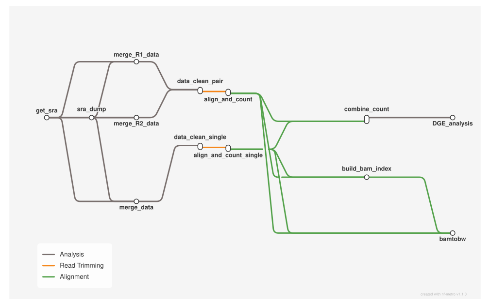

# SRA-powered RNA-seq: .sra archives to differential expression

<div class="ox-page-badges"><span class="ox-badge ox-badge--live">✔ Live-tested</span> <span class="ox-badge ox-badge--origin">⇄ Official port</span> <span class="ox-badge ox-badge--sn"><span class="dot"></span>snakemake port</span></div>

Automated RNA-seq analysis from locally downloaded SRA archives to differential expression results: verify and symlink .sra files, fasterq-dump conversion to FASTQ, read merging across multiple SRR runs per sample, fastp trimming, STAR alignment with gene counts, BAM indexing, BPM-normalized bigWig signal tracks, a merged count matrix, and DESeq2 differential analysis with ashr shrinkage. Single-end and paired-end samples are routed by the metadata `paired` column through wildcard-scoped when-gates; a separate ENCODE entry point (main_encode.oxoflow) consumes pre-downloaded FASTQs. Every tool is pinned to an exact conda version for reproducibility.

| | |
|---:|---|
| **Rating** | ✔ Live-tested |
| **Origin** | port |
| **Domain** | transcriptomics |
| **Rules** | 13 |
| **Compute** | up to 20 threads / 10 GB per rule (align_and_count) |
| **Tools** | sra-tools · fastp · star · samtools · deeptools · pandas · bioconductor-deseq2 · r-ashr · r-data.table |
| **Ported** | 2026-08-15 |
| **License** | Apache-2.0 |
| **Source** | [xuzhougeng/auto_sra_rnaseq_pipeline](https://github.com/xuzhougeng/auto_sra_rnaseq_pipeline) |
| **Pinned version** | `main` |

## Run it

```bash
oxo-flow run main.oxoflow
```

Downloads public data by accessions (network required); `--resume-failed` retries rules after transient download errors.

## Installation

**Engine.** oxo-flow >= 0.15.0 (wildcard-scoped `when` predicates; the failure-email hook [workflow] on_error fires on >= 0.17.0 — older engines ignore the unknown key)

**Toolchain.** conda envs — pinned

**Requirements.**
- Reference data: STAR index dir and GTF (config index / GTF, e.g. GRCh38)
- Pre-downloaded .sra files at <sra_data_path>/<SRR>/<SRR>.sra, one metadata TSV row per sample (GSM) with columns: Dataset GSE GSM gene method celline group group_name type platform SRR paired
- Sample list in [[sample_groups]] and config db_id must match the metadata file (see repo README Usage)
- ENCODE path (main_encode.oxoflow): pre-downloaded FASTQs in 00_raw_data/ and metadata with sample / R1_file_accession / R2_file_accession / runtype columns
- Compute: up to 20 threads / 10 GB per rule (align_and_count); 8 (data_clean_pair); 10 (bamtobw); 4 (build_bam_index)
- Disk: FASTQ, BAM and bigWig intermediates — several tens of GB for a typical cohort

```bash
# 1. install oxo-flow (release binary, recommended)
curl -fL -o oxo-flow.tar.gz https://github.com/Traitome/oxo-flow/releases/latest/download/oxo-flow-latest-x86_64-unknown-linux-gnu.tar.gz
tar xzf oxo-flow.tar.gz && sudo mv oxo-flow /usr/local/bin/
#    or, via conda (may lag behind releases):
#    conda install -c bioconda oxo-flow-cli
#    NOTE: bioconda currently ships 0.10.2, older than the >= 0.12.0
#    minimum of every catalog entry — prefer the release binary.

# 2. get this workflow (clones the repo, auto-discovers the workflow,
#    sanity-parses it with the engine)
oxo-flow pull gh:oxo-flow-community/oxo-flow-auto-sra-rnaseq-pipeline
#    (alternative: plain git clone)
#    git clone https://github.com/oxo-flow-community/oxo-flow-auto-sra-rnaseq-pipeline
```

## Parameters

| Parameter | Default | Description | Used by |
|---:|---|---|---|
| `GTF` | `/data/reference/genome/GRCh38/Homo_sapiens.GRCh38.95.sort.gtf` | — | `align_and_count` |
| `db_id` | `D21122` | DB_ID — upstream: basename(metadata).replace(".txt", ""). | `DGE_analysis`, `combine_count` |
| `index` | `/data/reference/genome/GRCh38/STAR` | STAR index dir and GTF (upstream keys index / GTF). | `align_and_count` |
| `mail` | `false` | Email notification (upstream onsuccess + onerror). Keep off unless SMTP is configured — the [workflow] on_error hook reuses these same keys. | — |
| `mail_to` | `` | — | — |
| `metadata` | `test/fixtures/metadata/D21122.txt` | Metadata TSV (upstream key metadata). Columns: Dataset GSE GSM gene method celline group group_name type platform SRR paired The repo default points at the bundled example dataset (upstream doc/D21122.txt). | `DGE_analysis`, `combine_count`, `data_conversion_pair`, `get_sra`, `merge_R1_data`, `merge_R2_data` |
| `sender` | `` | — | — |
| `sender_password` | `` | — | — |
| `sra_data_path` | `sra` | Directory holding pre-downloaded .sra files, layout <dir>/<SRR>/<SRR>.sra (upstream key sra_data_path). | `get_sra` |
| `srr_separator` | `,` | Separator joining multiple SRR runs per sample in the metadata SRR column. | `data_conversion_pair`, `get_sra`, `merge_R1_data`, `merge_R2_data` |

Descriptions are the workflow's own `#` comments from its `[config]` section, surfaced by `oxo-flow info` — no schema file to maintain.

## Workflow graph

<div class="ox-dag-card" markdown="1">



</div>

The graph is derived at catalog-build time from `oxo-flow graph -f dot` and rendered with Graphviz. It shows the workflow at rule level: wildcard `{sample}` instances expand at run time when sample data is discovered (the runtime view is `oxo-flow graph --expanded`).

## Scope

The default-parameters main path of the source pipeline was ported rule-for-rule; alternate paths are documented as excluded.

**In scope**

- get_sra
- sra_dump (shared pair/single conversion)
- merge_R1_data
- merge_R2_data
- merge_data (single-end)
- data_clean_pair
- data_clean_single
- align_and_count
- align_and_count_single
- build_bam_index
- bamtobw
- combine_count
- DGE_analysis
- main_encode.oxoflow — ENCODE entry point (8 rules, pre-downloaded FASTQ inputs)

**Excluded**

- pigz_threads — upstream pigz pipe is commented out (paired_end_process.smk); plain cat loses nothing

## Fidelity

Scope: the **default-parameters main execution path** (upstream `rule all`) plus the ENCODE entry point and the batch/slurm tooling. Rows cover every upstream rule; "not ported" rows carry a reason.

| Upstream rule | oxo-flow rule | Tool (version) | Notes |
|---|---|---|---|
| get_sra | `get_sra` | python 3.11 + pandas 3.0.5 | run: block ported to `scripts/get_sra.py` (identical symlink logic). Single-instance script rule (oxo-flow fans out over `{sample}`/`{pair_id}` only); iterates the same metadata SRR values. Splits multi-SRR values on `srr_separator` like the upstream merge input functions and run.py `check_sra_files` (upstream get_sra itself does not split — latent bug for multi-SRR rows). No declared outputs (per-SRR paths are dynamic). |
| data_conversion_pair | `sra_dump` | sra-tools 3.1.1 | `fasterq-dump sra/<SRR> -O sra` identical per SRR, one rule instance per sample; `limit_dump` cap preserved: `[resource_groups] limit_dump = { max = 2 }` (upstream run.py `--resources limit_dump=2`). The `when = "wildcard.paired == 'PAIRED'"` gate routes it to paired samples. Script deps (python/pandas) join the download env — oxo-flow runs one environment per rule, upstream split input function (base env) and command (download env). |
| data_conversion_single | `sra_dump` (same rule) | sra-tools 3.1.1 | Ported: fasterq-dump derives the output naming from the archive itself, so the two upstream rules collapse into one script rule (single-end archives produce `sra/{SRR}.fastq`; `scripts/dump_sra.py` verifies either output shape). Upstream needed two rules only because its DAG declared the output names statically. Per-sample routing via sample-group metadata (`paired = "PAIRED"/"SINGLE"`) + `when` gates. |
| merge_R1_data | `merge_R1_data` | coreutils `cat` (via python script) | Input function `get_merged_input_data_R1` ported to `scripts/merge_reads.py --read 1`; identical `cat … > 00_raw_data/{sample}_R1.fq`. Gated to PAIRED samples. `limit_merge` cap preserved: 1 unit per rule + `[resource_groups] limit_merge = { max = 2 }` (upstream run.py `--resources limit_merge=2`). |
| merge_R2_data | `merge_R2_data` | coreutils `cat` (via python script) | Same as above, `--read 2`. |
| merge_data | `merge_data` | coreutils `cat` (via python script) | Ported single-end branch: `scripts/merge_reads.py --read 0` consumes `sra/{SRR}.fastq` and `cat`s to `00_raw_data/{sample}.fq`; gated to SINGLE samples; same `limit_merge` cap. `--read 0` fails fast on a PAIRED sample (metadata `paired` column), matching upstream run.py's validation. |
| data_clean_pair | `data_clean_pair` | fastp 1.3.6 | Command byte-identical (`-w`, `-i/-I`, `-o/-O`, `-j log/{sample}.json`, `-h log/{sample}.html`, `&> log/{sample}_fastp.log`). Gated to PAIRED samples. Upstream does not pin fastp; resolved from bioconda on 2026-08-15. Threads 8 (upstream `fastp_threads` baked into `[rules.resources]`). |
| data_clean_single | `data_clean_single` | fastp 1.3.6 | Ported single-end branch: same fastp flags minus `-I/-O` (`-i 00_raw_data/{sample}.fq -o 01_clean_data/{sample}.fq`), threads 8; gated to SINGLE samples. |
| align_and_count | `align_and_count` | star 2.7.11b | Command byte-identical (flags, `--outFileNamePrefix`, `--limitBAMsortRAM $((10000 * 1000000))`, `--quantMode GeneCounts`, `--outTmpKeep None`, `mv …_Log.final.out` to log). Threads 20 (upstream `star_threads` baked in); gated to PAIRED samples. The attempt-based memory escalation lambda (`10000` first attempt, `60000*(attempt-1)` after) is not expressible — the port pins the first-attempt value (`resources.memory = "10G"`). star bumped 2.7.1a → 2.7.11b: the 2019-era binary stalls on modern hosts (live: 20h spin, zero progress). Single-end STAR is the separate `align_and_count_single` rule (same command, one `--readFilesIn` file, gated to SINGLE). |
| build_bam_index | `build_bam_index` | samtools 1.22 | `samtools index -@ 4 {input}` identical. samtools 1.22 pinned (1.24's htslib conflicts with star 2.7.11b; combo live-verified). |
| bamtobw | `bamtobw` | deeptools 3.5.6 | Command byte-identical (`-p 10 --binSize 50 --effectiveGenomeSize 2913022398 --normalizeUsing BPM -b … -o 04_bigwig/{sample}.bw`). Upstream does not pin deeptools; resolved from bioconda on 2026-08-15. |
| combine_count | `combine_count` | python 3.11 + pandas 3.0.5 | run: block ported verbatim to `scripts/combine_count.py` (same merge order and column renaming); per-sample counts gathered via `expand_inputs` over the sample list. Adds a fail-fast check that `[config] db_id` matches the metadata file name (upstream derives DB_ID at load time). Upstream runs in the snakemake base env (`snakemake==8.16 pandas`); snakemake itself is not needed — oxo-flow is the orchestrator. |
| DGE_analysis | `DGE_analysis` | R 4.3.2, DESeq2 1.42.0, ashr 2.2.63, data.table 1.17.8 | `scripts/DESeq2_diff.R` ported verbatim (design `~group`, contrast `treat`/`control`, `lfcShrink(type="ashr")`, saves exprSet + metadata + diffResults to the .Rds path). Env pins from the upstream Dockerfile (r432 env); r-data.table 1.17.8 pinned (1.18.4 requires r-base >= 4.4 and cannot solve with the pinned r-base 4.3.2); python added for the on_success mail hook. |
| onsuccess | `on_success` (DGE_analysis) | shell + smtplib | Upstream workflow-level `onsuccess` becomes the final rule's hook: `rm -rf 02_read_align` + conditional email via `scripts/send_mail.py` (port of `send_mail()`; the upstream `client.quit()` NameError on SMTP connection failure is fixed and notification failures exit 0 so they never fail a finished workflow). `mail` defaults to false, as upstream. |
| onerror | `[workflow] on_error` | shell + smtplib | Ported: the upstream workflow-level `onerror` email becomes the engine's workflow-level failure hook — shell run once in the workflow root when the run reaches a terminal state with at least one failed rule, guarded by `mail` (default false = no-op, behavior unchanged). It sends subject "snakemake run failed" via the same `scripts/send_mail.py` as on_success, with the run counters (`{succeeded}`/`{failed}`/`{skipped}`), `{config.db_id}` and `{workdir}` in the body (the upstream body is the snakemake log; the engine log lives under `.oxo-flow/logs/`). Best-effort: a failed hook is a warning, never a run-status change, and notification failures exit 0. Fires on engine >= 0.17.0; older engines ignore the unknown `[workflow]` key. |
| Snakefile_ENCODE | `main_encode.oxoflow` (8 rules) | fastp 1.3.6, star 2.7.11b, samtools 1.22, deeptools 3.5.6, R 4.3.2 | Ported entry point: ENCODE metadata columns (`R1_file_accession`/`R2_file_accession`/`runtype`), `scripts/DESeq2_diff_encode.R` copied verbatim, pre-downloaded FASTQ inputs. `get_raw_data` input function → `scripts/clean_encode.py` (byte-identical fastp command; pandas added to envs/preprocess.yaml for it). Two upstream latent bugs fixed (documented deviations): `data_clean_pair` IndexErrors on single-ended samples, and `align_and_count` declares fixed r1/r2 inputs — both split into paired/single rules gated by `runtype`. Upstream `use_download`/`download_path` is dead code (computed, never read) — dropped. |
| run.py | `scripts/run_batch.py` | python 3.11 + pandas 3.0.5 | Batch runner ported: metadata validation and SRA checks verbatim; drives `oxo-flow run … metadata=… db_id=… -j N -r 3` per metadata file (upstream `--restart-times 3`); moves files to `finished/`/`failed/`; bark/feishu via notify.py; summary stats. `--cores` default 79 like upstream; `--profile` maps to upstream `--executor_profile_path`; `--unlock`/`--rerun-incomplete`/`--latency-wait` are native oxo-flow checkpoint semantics — nothing to do. |
| slurm/config.yaml | `profiles/slurm.toml` ([cluster]) | — | Ported: `executor: slurm` → `backend = "slurm"`, `jobs: 100` → `max_submitted = 100`, `runtime=120` → `walltime = "2h"`. Upstream set-threads/set-resources live in the workflow's per-rule resources; the cluster-only align mem bump (64000) is not expressible in a profile, so the pinned 10G applies on the cluster too. Opt-in: `oxo-flow run main.oxoflow --profile slurm`. |
| config.yaml bark/feishu | `scripts/notify.py` | python 3.11 | Notification helpers ported: `feishu_notification` verbatim from upstream `scripts/utilize.py`; `bark_notification` fixed — the upstream function is a silent no-op (assigns `base_url`, never sends), the port implements the intended GET `{api}/oxo-flow/{contents}`. Notification failures exit 1 but never change a run's outcome (run_batch.py). |
| scripts/update_json.py | `scripts/update_json.py` (verbatim) | python 3.11 | Copied byte-identical — external-orchestration `file_dict.json` tracker; no caller in either workflow, same as upstream. |
| pigz_threads config key | dropped | — | The upstream pigz pipe is commented out (merge rules use plain `cat`) — no behavior lost. |

**Port-level conventions** (config-shape deviations, commands unchanged):
upstream derives the sample list (GSM column), the per-sample SRR lists and
DB_ID from the metadata TSV at load time; the port declares the samples in
`[[sample_groups]]` (cohort = PAIRED, single = SINGLE), reads SRR lists in
the ported scripts, and takes DB_ID from `[config] db_id` — all three must
match the metadata file (see the repo README Usage). Upstream
`fastp_threads`/`star_threads` config keys are baked into
`[rules.resources] threads` (oxo-flow resource numbers are literals).
Upstream example metadata `doc/D21122.txt` (16 GSM samples, all PAIRED)
ships as the default fixture at test/fixtures/metadata/D21122.txt.

## Links

- Repository: [oxo-flow-auto-sra-rnaseq-pipeline](https://github.com/oxo-flow-community/oxo-flow-auto-sra-rnaseq-pipeline)
- Upstream: [xuzhougeng/auto_sra_rnaseq_pipeline](https://github.com/xuzhougeng/auto_sra_rnaseq_pipeline) @ `main`
- License: Apache-2.0 (this workflow) · none (upstream)

Created on 2026-08-15 — this port may lag behind upstream releases. See the repository's NOTICE for full attribution.
