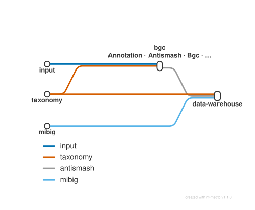

# Biosynthetic gene cluster (BGC) genome mining: annotation, antiSMASH and data warehouse

<div class="ox-page-badges"><span class="ox-badge ox-badge--live">✔ Live-tested</span> <span class="ox-badge ox-badge--origin">⇄ Official port</span> <span class="ox-badge ox-badge--sn"><span class="dot"></span>snakemake port</span></div>

End-to-end biosynthetic gene cluster (BGC) analysis of user-provided bacterial genomes: prokka annotation, antiSMASH 7 secondary-metabolite mining with automated database setup, per-genome BGC counts and overview tables, GTDB taxonomy lookup, MIBiG reference table download, BigSCAPE-compatible comparison preparation (symlinks, taxonomy, dataset registry, visualization mapping), and conversion of all result tables into a parquet data warehouse — ready for downstream comparison and exploration.

| | |
|---:|---|
| **Rating** | ✔ Live-tested |
| **Origin** | port |
| **Domain** | genome-mining |
| **Rules** | 60 |
| **Compute** | up to 4 CPUs per rule (antiSMASH) |
| **Tools** | prokka · antismash · python · pandas · pyarrow · biopython · requests · alive_progress |
| **Ported** | 2026-08-15 |
| **License** | Apache-2.0 |
| **Source** | [NBChub/bgcflow](https://github.com/NBChub/bgcflow) |
| **Pinned version** | `v1.1.2` |

## Run it

```bash
oxo-flow run main.oxoflow
```

Needs input genomes and the antiSMASH database — see Requirements.

## Installation

**Engine.** oxo-flow >= 0.12.0

**Toolchain.** conda envs — pinned versions (declared in main.oxoflow: envs/antismash.yaml, envs/prokka.yaml, envs/bgc_analytics.yaml; a few antiSMASH helper packages use unpinned ranges)

**Requirements.**
- genome FASTA per genome at {config.raw_dir}/fasta/<genome_id>.fna (raw_dir defaults to test/fixtures/raw; .fna/.fasta/.fa accepted)
- sample table config/samples.csv — columns genome_id,source,organism,genus,species,strain
- network access on first run: antiSMASH databases (~several GB, into resources/antismash_db), GTDB bac120_metadata_r220.tsv fallback table, MIBiG JSON 3.1
- optional: GTDB offline taxonomy TSVs via config.gtdb_tax_paths
- compute: up to 4 CPUs per rule (prokka, antiSMASH); no explicit memory limits — antiSMASH dominates
- disk: several GB for downloaded resources (antiSMASH DB, MIBiG) plus the data/ output tree

```bash
# 1. install oxo-flow (release binary, recommended)
curl -fL -o oxo-flow.tar.gz https://github.com/Traitome/oxo-flow/releases/latest/download/oxo-flow-latest-x86_64-unknown-linux-gnu.tar.gz
tar xzf oxo-flow.tar.gz && sudo mv oxo-flow /usr/local/bin/
#    or, via conda (may lag behind releases):
#    conda install -c bioconda oxo-flow-cli
#    NOTE: bioconda currently ships 0.10.2, older than the >= 0.12.0
#    minimum of every catalog entry — prefer the release binary.

# 2. get this workflow (clones the repo, auto-discovers the workflow,
#    sanity-parses it with the engine)
oxo-flow pull gh:oxo-flow-community/oxo-flow-bgcflow
#    (alternative: plain git clone)
#    git clone https://github.com/oxo-flow-community/oxo-flow-bgcflow
```

## Parameters

| Parameter | Default | Description | Used by |
|---:|---|---|---|
| `antismash_db_path` | `resources/antismash_db` | upstream resources_path.antismash_db | `antismash`, `antismash_db_setup` |
| `antismash_major` | `7` | antiSMASH (upstream rule_parameters.antismash + envs/antismash.yaml) | `antismash_v6` |
| `antismash_taxon` | `bacteria` | upstream env var BGCFLOW_ANTISMASH_MODE | `antismash`, `antismash_v6` |
| `antismash_version` | `7.1.0` | derived from envs/antismash.yaml pip pin git@7-1-0-1 | `antismash`, `antismash_overview`, `antismash_overview_gather`, `antismash_summary`, `antismash_v6`, `arts`, `bgc_count`, `bigscape`, `copy_antismash`, `copy_log_changes`, `csv_to_parquet`, `downstream_bgc_prep` |
| `bgc_dataset` | `data/interim/bgcs/datasets.tsv` | — | `downstream_bgc_prep` |
| `bgcflow_version` | `1.1.2` | BGCflow housekeeping | `format_gbk` |
| `gecco_version` | `0.9.10` | — | `gecco` |
| `gtdb_api_base` | `https://gtdb-api.ecogenomic.org` | — | `gtdb_prep` |
| `gtdb_offline` | `False` | upstream: use_gtdb_api False -> offline mode | `gtdb_prep` |
| `gtdb_release` | `220.0` | GTDB taxonomy (upstream rule_parameters.install_gtdbtk + use_gtdb_api) | `gtdb_prep`, `install_gtdbtk` |
| `gtdb_release_major` | `220` | GTDB release major version (upstream: release.split('.')[0]) | `gtdb_prep`, `install_gtdbtk` |
| `gtdb_release_version` | `r220` | GTDB release id (e.g. r214, r220) | `install_gtdbtk` |
| `gtdb_tax_paths` | `[]` | upstream GTDB_PATHS: space-separated user gtdb-tax tsv(s) | `gtdb_prep` |
| `input_type` | `fna` | upstream get_input_location(): fna \| gbk | `copy_custom_fasta`, `copy_custom_genbank`, `format_gbk`, `genbank_to_fna`, `prokka`, `prokka_gbk` |
| `mibig_version` | `3.1` | MIBiG JSON release used by get_mibig_table | `get_mibig_table` |
| `ncbi_genera` | `` | — | `ncbi_genome_download` |
| `project` | `genomes` | Project / input genomes (upstream: config.yaml `projects` + data/raw/fasta) | `amrfinder_gather`, `antismash_overview_gather`, `antismash_summary`, `bigscape`, `cblaster_genome_db`, `checkm`, `copy_log_changes`, `copy_mibig_table`, `csv_to_parquet`, `downstream_bgc_prep`, `fastani`, `fastani_convert`, `fix_gtdb_taxonomy`, `gtdbtk`, `mash`, `mash_convert`, `roary`, `roary_out`, `seqfu_combine`, `write_dependency_versions` |
| `project_source` | `custom` | — | `ncbi_genome_download` |
| `raw_dir` | `test/fixtures/raw` | directory containing fasta/<genome_id>.fna | `copy_custom_fasta`, `copy_custom_genbank`, `genbank_to_fna`, `prokka_gbk` |
| `run_amrfinderplus` | `false` | — | `amrfinder_gather`, `amrfinderplus` |
| `run_arts` | `false` | — | `arts` |
| `run_bigscape` | `false` | — | `bigscape` |
| `run_cblaster` | `false` | — | `cblaster_genome_db` |
| `run_checkm` | `false` | — | `checkm`, `install_checkm` |
| `run_eggnog` | `false` | — | `eggnog`, `install_eggnog` |
| `run_fastani` | `false` | — | `fastani`, `fastani_convert` |
| `run_gecco` | `false` | — | `gecco` |
| `run_gtdbtk` | `false` | — | `gtdbtk`, `install_gtdbtk` |
| `run_mash` | `false` | — | `mash`, `mash_convert` |
| `run_roary` | `false` | — | `roary`, `roary_out` |
| `run_seqfu` | `false` | — | `seqfu_combine`, `seqfu_stats` |
| `write_dependency_versions` | `false` | — | `write_dependency_versions` |

Descriptions are the workflow's own `#` comments from its `[config]` section, surfaced by `oxo-flow info` — no schema file to maintain.

## Workflow graph

<div class="ox-dag-card" markdown="1">



</div>

The graph is derived at catalog-build time from `oxo-flow graph -f dot` and rendered with Graphviz. It shows the workflow at rule level: wildcard `{sample}` instances expand at run time when sample data is discovered (the runtime view is `oxo-flow graph --expanded`).

## Scope

The default-parameters main path of the source pipeline was ported rule-for-rule; alternate paths are documented as excluded.

**In scope**

- copy_custom_fasta
- gtdb_prep
- extract_meta_prokka
- prokka
- format_gbk
- antismash_db_setup
- antismash
- copy_antismash
- bgc_count
- antismash_overview
- downstream_bgc_prep
- antismash_overview_gather
- copy_log_changes
- antismash_summary
- fix_gtdb_taxonomy
- get_mibig_table
- copy_mibig_table
- csv_to_parquet

**Excluded**

- metabase_install / metabase_duckdb_plugin / build_warehouse — metabase.smk + build-database.smk are not included in the main Snakefile and are only reachable outside the pipeline (wrapper CLI / manual); no pipeline gate to mirror; the warehouse branch additionally needs a live Metabase server + credentials (the jar/plugin URLs themselves are alive, but the rules are unreachable from the default Snakefile path)
- patric_genome_download / download_patric_tables / extract_patric_meta — download endpoint ftp.patricbrc.org is dead: PATRIC was decommissioned in 2023 (merged into BV-BRC); verified 550 / connection refused 2026-08
- report rules (copy_readme, copy_template_notebook, mkdocs_py_report, mkdocs_rpy_report, copy_template_rnotebook) — separate 'bgcflow build report' entrypoint (wrapper CLI), not part of the main Snakefile default path

## Fidelity

| Upstream rule | oxo-flow rule | Tool (version) | Notes |
|---|---|---|---|
| copy_custom_fasta | `copy_custom_fasta` | bash/coreutils | identical command |
| gtdb_prep | `gtdb_prep` | python 3.9.18, requests 2.31.0 | identical command + wget/API fallback |
| extract_meta_prokka | `extract_meta_prokka` | python 3.9.18, pandas 2.0.3 | identical command |
| prokka | `prokka` | prokka 1.14.6 | identical command; `--cpus {threads}` (4) |
| format_gbk | `format_gbk` | python 3.9.18, biopython 1.81 | identical command |
| antismash_db_setup | `antismash_db_setup` | antiSMASH 7.1.0 | v7 branch, identical command |
| antismash | `antismash` | antiSMASH 7.1.0 | v7 branch, identical command incl. reuse-result retry |
| copy_antismash | `copy_antismash` | bash/coreutils | symlink loop, identical |
| bgc_count | `bgc_count` | python 3.9.18, biopython 1.81 | identical command |
| antismash_overview | `antismash_overview` | python 3.9.18 | identical command |
| downstream_bgc_prep | `downstream_bgc_prep` | python 3.9.18, pandas 2.0.3 | identical command |
| antismash_overview_gather | `antismash_overview_gather` | python 3.9.18, pandas 2.0.3 | identical command |
| copy_log_changes | `copy_log_changes` | bash/coreutils | identical command |
| antismash_summary | `antismash_summary` | python 3.9.18, pandas 2.0.3 | identical command |
| fix_gtdb_taxonomy | `fix_gtdb_taxonomy` | python 3.9.18, pandas 2.0.3 | identical command |
| get_mibig_table | `get_mibig_table` | python 3.9.18, pandas 2.0.3 | identical command |
| copy_mibig_table | `copy_mibig_table` | bash/coreutils | identical command |
| csv_to_parquet | `csv_to_parquet` | python 3.9.18, pandas 2.0.3, pyarrow 14.0.2 | identical command |
| prokka_gbk | `prokka_gbk` | prokka 1.14.6 | `when = config.input_type == 'gbk'`; default copy_custom_fasta/prokka/format_gbk now gate on `'fna'` (upstream resolves the same producer overlap with input-function branching) |
| antismash (v6 branch) | `antismash_v6` | antiSMASH 6.x | `when = config.antismash_major == '6'`, envs/antismash6.yaml (upstream antismash_v6.yaml verbatim) |
| write_dependency_versions | `write_dependency_versions` | python 3.9.18, pyyaml 6.0.1 | `when = config.write_dependency_versions`; upstream get_dependencies.py ported as scripts/write_dependency_versions.py (metadata/dependency_versions.json, upstream output path) |
| seqfu_stats / seqfu_combine | `seqfu_stats` / `seqfu_combine` | seqfu 1.20.3 | `when = config.run_seqfu`; combine gathers via expand_inputs |
| mash / mash_convert | `mash` / `mash_convert` | mash 2.3 | `when = config.run_mash`; convert_triangular_matrix.py verbatim |
| fastani / fastani_convert | `fastani` / `fastani_convert` | fastani 1.33 | `when = config.run_fastani` |
| install_checkm / checkm / checkm_out | `install_checkm` / `checkm` | checkm-genome 1.2.2 | `when = config.run_checkm`; the 2015 CheckM DB download is the upstream install rule; checkm_out (report-table extraction via get_checkm_data.py) not ported |
| install_gtdbtk / gtdbtk / gtdbtk_fna_fail / evaluate_gtdbtk_input | `install_gtdbtk` / `gtdbtk` | gtdbtk 2.4.0 | `when = config.run_gtdbtk`; the release package download is multi-GB (upstream install rule); the gtdbtk_fna_fail rule + evaluate_gtdbtk_input branching (fna-fail reroute) not ported |
| prokka_db_setup / install_* rules | `install_checkm` / `install_gtdbtk` / `install_eggnog` | various | install rules for the off-by-default pipelines, same downloads as upstream |
| bigscape / bigscape_no_mibig / copy_bigscape_zip / bigscape_to_cytoscape / copy_bigscape | `bigscape` | bigscape (conda) | `when = config.run_bigscape`; needs the pfam + MIBiG databases in resources/ (upstream install_bigscape step); bigscape_no_mibig / copy_bigscape_zip / bigscape_to_cytoscape / copy_bigscape (report-view variants) not ported — documented in the rule header |
| bigslice / bigslice_prep | `bigslice` / `bigslice_prep` | bigslice (NBChub fork) | `when = config.run_bigslice`; models downloaded by install_bigslice (upstream env post-deploy equivalent); env pip-installs the NBChub fork @c0085de (original medema-group/bigslice discontinued) |
| fetch_bigslice_db / query_bigslice / summarize_bigslice_query / annotate_bigfam_hits | `fetch_bigslice_db` / `query_bigslice` / `summarize_bigslice_query` / `annotate_bigfam_hits` | bigslice + python | `when = config.run_query_bigslice`; fetch_bigslice_db downloads the BiG-FAM full-run-result bundle (~18GB, bioinformatics.nl — verified alive 2026-08) |
| automlst_wrapper / automlst_wrapper_out / prep_automlst_gbk / install_automlst_wrapper | `automlst_wrapper` / `automlst_wrapper_out` / `prep_automlst_gbk` / `install_automlst_wrapper` | automlst-simplified-wrapper 0.1.2 (python 2.7 env) | `when = config.run_automlst`; install downloads the release zip (not a git clone); scripts verbatim |
| arts + 6 arts_* rules | `arts` | arts env (upstream pins) | `when = config.run_arts`; needs the ARTS reference bundle in resources/arts; arts_extract + the 5 arts_*_combine/final report rules not ported (arts_extract_all.py is shipped but no rule consumes it) |
| roary / roary_out / roary_reassign_pangene_categories / eggnog_roary / eggnog_roary_result_copy / deeptfactor_roary / diamond_roary | `roary` / `roary_out` | roary 3.13.0 | `when = config.run_roary`; verbatim flags (-i 80 -g 80000 -e -n -r -v); the reassign / eggnog_roary / deeptfactor_roary / diamond_roary report rules not ported |
| install_eggnog / eggnog | `install_eggnog` / `eggnog` | eggnog-mapper 2.1.6 | `when = config.run_eggnog`; DB download + create_dbs.py as upstream |
| deeptfactor / deeptfactor_setup / deeptfactor_to_json / deeptfactor_summary | `deeptfactor` / `deeptfactor_setup` / `deeptfactor_to_json` / `deeptfactor_summary` | deeptfactor (bitbucket, ~23MB) | `when = config.run_deeptfactor`; setup git-clones the unpinned bitbucket repo (model bundle included — verified public 2026-08); env is upstream's python 3.6 + pytorch 1.10.2 pin |
| cblaster_genome_db / cblaster_bgc_db | `cblaster_genome_db` | cblaster 1.3.18 | `when = config.run_cblaster`; verbatim makedb over prokka GBKs; cblaster_bgc_db (MIBiG-BGC database build) not ported |
| gecco / antismash_sideload_gecco / gecco_aggregate | `gecco` | gecco 0.9.10 | `when = config.run_gecco`; verbatim gecco run --antismash-sideload; antismash_sideload_gecco + gecco_aggregate (report tables) not ported |
| amrfinderplus / amrfinder_gather | `amrfinderplus` / `amrfinder_gather` | ncbi-amrfinderplus | `when = config.run_amrfinderplus`; verbatim flags; gather_amrfinder.py verbatim |
| metabase_install / metabase_duckdb_plugin / build_warehouse | not ported | metabase/duckdb | metabase.smk + build-database.smk are not included in the main Snakefile and are only reachable outside the pipeline (wrapper CLI / manual) — no pipeline gate to mirror; the warehouse branch needs a live Metabase server + credentials |
| ncbi_genome_download / extract_ncbi_information (+ patric meta rules) | `ncbi_genome_download` | ncbi-genome-download | `when = config.project_source == 'ncbi'`; deviation: bulk genus download via `--genera` (upstream fetches per-accession with `-A`); extract_ncbi_information / download_patric_tables / extract_patric_meta meta rules not ported |
| patric_genome_download + patric meta rules | not ported | patric | per-sample source=patric; download endpoint ftp.patricbrc.org is dead (PATRIC decommissioned 2023, merged into BV-BRC; verified 550/connection-refused 2026-08) |
| copy_custom_genbank / genbank_to_fna + genbank_to_faa / extract_meta_genbank / genbank_to_gff / copy_converted_gbk / summarize_converted_gbk | `copy_custom_genbank` / `genbank_to_fna` | python | gbk-input path (`input_type = 'gbk'`); genbank_to_fna reads the raw gbk directly (upstream uses input-function branching to avoid the producer overlap); the faa/gff/meta/summary extras not ported |
| report rules (copy_readme, copy_template_notebook, mkdocs_*_report) | not ported | jupyter/mkdocs | separate `bgcflow build report` command, not in the main Snakefile |

**Live-verified on bioinfo-wsx (oxo-flow 0.14.1, conda envs):** default path
(S1/S2 mini fixtures) + tier-1 branches (seqfu/mash/fastani/roary) + tier-2
(checkm/amrfinderplus); resource-gated, not live-run: gtdbtk/eggnog/gecco/
cblaster/arts/bigscape/bigslice/automlst/deeptfactor (multi-GB DBs/downloads).

## Links

- Repository: [oxo-flow-bgcflow](https://github.com/oxo-flow-community/oxo-flow-bgcflow)
- Upstream: [NBChub/bgcflow](https://github.com/NBChub/bgcflow) @ `v1.1.2`
- License: Apache-2.0 (this workflow) · MIT (upstream)

Created on 2026-08-15 — this port may lag behind upstream releases. See the repository's NOTICE for full attribution.
