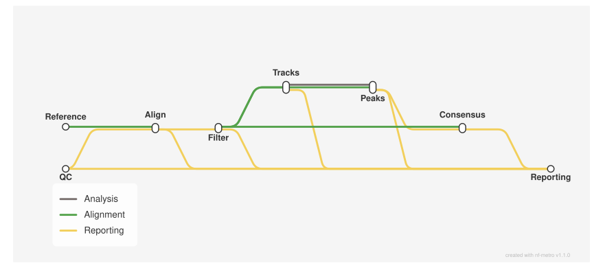

<div class="ox-crumb"><a href="/pipelines/">Pipelines</a> / <span>oxo-flow-chipseq</span></div>
<div class="ox-detail-cols">
<div>
<h1>ChIP-seq: peak calling, QC and differential analysis</h1>
<div class="ox-page-badges"><span class="ox-badge ox-badge--live">✔ Live-tested · default-path</span> <span class="ox-badge ox-badge--origin">⇄ Official port</span> <span class="ox-badge ox-badge--nf"><span class="dot"></span>nf-core port</span></div>
<p>ChIP-seq peak calling, QC and differential analysis for paired-end reads: FastQC and Trim Galore read QC, BWA-MEM (default), Bowtie2, Chromap or STAR alignment, library merge and Picard mark-duplicates, BAMTools filtering against a blacklist with orphan-read removal, preseq and phantompeakqualtools library complexity QC, bigWig tracks and deepTools QC plots, MACS3 peak calling with input controls in broad (default) or narrow mode, HOMER peak annotation, FRiP scoring, consensus peaks across replicates (MACS3 merge, featureCounts quantification, DESeq2 QC), an IGV session and a MultiQC report. Optional multi-antibody mode (metadata_file + input_groups group_by meta.antibody) runs the consensus chain once per distinct antibody. Optional gated rules derive the gene-body BED from the GTF (GTF2BED), the blacklist-complement regions file, the chromosome sizes and FASTA index (CUSTOM_GETCHROMSIZES), and BWA / Bowtie2 / Chromap / STAR indexes from the reference FASTA.</p>
</div>
<div>
<div class="ox-glance">
<div class="ox-glance-title">At a glance</div>
<div class="ox-kv"><span class="k">Rating</span><span class="v live">✔ Live-tested · default-path</span></div>
<div class="ox-kv"><span class="k">Rules</span><span class="v">83</span></div>
<div class="ox-kv"><span class="k">Compute</span><span class="v">up to 12 CPUs / 72 GB per rule (bwa_mem, bowtie2_align, star_align, trimgalore, star_genomegenerate); bowtie2_index_build 12 CPUs / 36 GB; most rules request 6 CPUs / 36 GB (chromap_align, chromap_index_build included)</span></div>
<div class="ox-kv"><span class="k">Engine</span><span class="v"><span class="ox-badge ox-badge--nf"><span class="dot"></span>nf-core port</span></span></div>
<div class="ox-kv"><span class="k">Origin</span><span class="v">⇄ Official port</span></div>
<div class="ox-kv"><span class="k">Domain</span><span class="v">genomics</span></div>
<div class="ox-kv"><span class="k">Source</span><span class="v"><a href="https://github.com/nf-core/chipseq">nf-core/chipseq</a></span></div>
<div class="ox-kv"><span class="k">Pinned version</span><span class="v"><code>2.1.0</code></span></div>
<div class="ox-kv"><span class="k">Ported</span><span class="v">2026-08-15</span></div>
<div class="ox-kv"><span class="k">License</span><span class="v">Apache-2.0</span></div>
<p class="cmd">$ oxo-flow run main.oxoflow</p>
</div>
</div>
</div>

## Run it

```bash
oxo-flow run main.oxoflow
```

Runs the default path on the shipped fixtures — about 153 instances (212-rule DAG; 59 rules gated off). Multi-antibody runs: `oxo-flow run main.oxoflow --profile multi_antibody` (consensus chain once per antibody). Preview with `oxo-flow dry-run main.oxoflow`.

## Installation

**Engine.** oxo-flow >= 0.17.0

**Toolchain.** containers (Docker/Singularity) — pinned images

**Requirements.**

- genome FASTA (fasta; a FASTA index fai is only required with make_star_index)
- annotation GTF (gtf)
- gene-body regions BED, derived upstream via GTF2BED (gene_bed, or derive with make_gene_bed=true)
- chromosome sizes file (chrom_sizes, or derive with make_chrom_sizes=true)
- blacklist regions BED (blacklist)
- aligner index — BWA index directory (bwa_index: *.amb, *.ann, *.bwt, *.pac, *.sa); for aligner='bowtie2' a Bowtie2 index directory (bowtie2_index), for aligner='chromap' a Chromap index file (chromap_index), and for aligner='star' a STAR index directory (star_index). Each can be built from the FASTA with the matching make_bwa_index / make_bowtie2_index / make_chromap_index / make_star_index gated rule
- raw paired-end FASTQ reads named raw/{pair_id}_R{1,2}.fastq.gz with sample metadata in [[pairs]] and ip_ids (multi-antibody runs add a metadata_file TSV with an antibody column; see README)
- compute: up to 12 CPUs / 72 GB per rule (bwa_mem, bowtie2_align, star_align, trimgalore, star_genomegenerate); most rules request 6 CPUs / 36 GB
- disk: several GB of pinned container images pulled by Docker/Singularity

```bash
# 1. install oxo-flow (release binary, recommended)
curl -fL -o oxo-flow.tar.gz https://github.com/Traitome/oxo-flow/releases/latest/download/oxo-flow-latest-x86_64-unknown-linux-gnu.tar.gz
tar xzf oxo-flow.tar.gz && sudo mv oxo-flow /usr/local/bin/
#    or, via conda (may lag behind releases):
#    conda install -c bioconda oxo-flow-cli
#    NOTE: bioconda currently ships 0.10.2, older than the >= 0.12.0
#    minimum of every catalog entry — prefer the release binary.

# 2. get this workflow (clones the repo, auto-discovers the workflow,
#    sanity-parses it with the engine)
oxo-flow pull gh:oxo-flow-community/oxo-flow-chipseq
#    (alternative: plain git clone)
#    git clone https://github.com/oxo-flow-community/oxo-flow-chipseq
```

## Parameters

| Parameter | Default | Description | Used by |
|---:|---|---|---|
| `aligner` | `bwa` | Alignment / filtering. aligner selects the read aligner: 'bwa' (the nf-core default), 'bowtie2', 'chromap' or 'star'. Each mode takes a pre-built index (bwa_index directory / bowtie2_index directory / chromap_index file / star_index directory, e.g. from the upstream iGenomes bundle) — or derives it from the reference FASTA with the gated builders below, mirroring the upstream PREPARE_GENOME index branches (make_bwa_index / make_bowtie2_index / make_chromap_index / make_star_index; point the corresponding index config at the generated results/... path in that case). | `align::bowtie2_align`, `align::bwa_mem`, `align::chromap_align`, `align::star_align`, `reference::bowtie2_index_build`, `reference::bwa_index_build`, `reference::chromap_index_build`, `reference::star_genomegenerate` |
| `antibody` | `H3K4me3` | — | `consensus::annotate_boolean_peaks`, `consensus::annotate_boolean_peaks_narrow`, `consensus::deseq2_qc`, `consensus::deseq2_qc_narrow`, `consensus::homer_annotate_consensus`, `consensus::homer_annotate_consensus_narrow`, `consensus::macs3_consensus`, `consensus::macs3_consensus_narrow`, `consensus::subread_featurecounts`, `consensus::subread_featurecounts_narrow`, `report::igv`, `report::igv_narrow`, `report::multiqc`, `report::multiqc_narrow` |
| `blacklist` | `test/fixtures/references/blacklist.bed` | — | `filter::bamtools_filter`, `reference::blacklist_regions` |
| `bowtie2_index` | `` | — | `align::bowtie2_align` |
| `broad_cutoff` | `0.1` | — | `peaks::macs3_callpeak` |
| `bwa_index` | `test/fixtures/references/bwa_index` | — | `align::bwa_mem` |
| `bwa_min_score` | `0` | — | `align::bwa_mem` |
| `chrom_sizes` | `test/fixtures/references/chrom.sizes` | — | `reference::blacklist_regions`, `tracks::ucsc_bedgraphtobigwig` |
| `chromap_index` | `` | — | `align::chromap_align` |
| `clip_r1` | `0` | — | `qc::trimgalore` |
| `clip_r2` | `0` | — | `qc::trimgalore` |
| `fai` | `test/fixtures/references/genome.fa.fai` | — | `align::markduplicates`, `filter::picard_collectmultiplemetrics`, `reference::star_genomegenerate` |
| `fasta` | `test/fixtures/references/genome.fa` | — | `align::bowtie2_align`, `align::bwa_mem`, `align::chromap_align`, `align::index_align`, `align::index_markdup`, `align::markduplicates`, `align::mergesamfiles`, `align::sort_align`, `align::stats_align`, `align::stats_markdup`, `consensus::homer_annotate_consensus`, `consensus::homer_annotate_consensus_narrow`, `filter::index_filter`, `filter::picard_collectmultiplemetrics`, `filter::sort_filter`, `filter::sort_name`, `filter::stats_filter`, `peaks::homer_annotatepeaks`, `peaks::homer_annotatepeaks_narrow`, `reference::bowtie2_index_build`, `reference::bwa_index_build`, `reference::chromap_index_build`, `reference::getchromsizes`, `reference::star_genomegenerate`, `report::igv`, `report::igv_narrow`, `tracks::khmer` |
| `fingerprint_bins` | `500000` | — | `tracks::deeptools_plotfingerprint` |
| `fragment_size` | `0` | — | — |
| `gene_bed` | `test/fixtures/references/gene.bed` | — | `tracks::deeptools_computematrix` |
| `gtf` | `test/fixtures/references/genome.gtf` | — | `consensus::homer_annotate_consensus`, `consensus::homer_annotate_consensus_narrow`, `peaks::homer_annotatepeaks`, `peaks::homer_annotatepeaks_narrow`, `reference::gtf2bed`, `reference::star_genomegenerate` |
| `ip_ids` | `'S1_REP1', 'S1_REP2'` | — | — |
| `keep_dups` | `false` | — | `filter::bamtools_filter` |
| `keep_multi_map` | `false` | — | `filter::bamtools_filter` |
| `macs_fdr` | `0` | — | `peaks::macs3_callpeak`, `peaks::macs3_callpeak_narrow` |
| `macs_gsize` | `` | MACS3 genome size. Empty string = derive from read length via khmer (faithful to the upstream default). | `peaks::macs3_callpeak`, `peaks::macs3_callpeak_narrow`, `tracks::khmer` |
| `macs_pvalue` | `0` | — | `peaks::macs3_callpeak`, `peaks::macs3_callpeak_narrow` |
| `make_blacklist_regions` | `false` | — | `reference::blacklist_regions` |
| `make_bowtie2_index` | `false` | — | `reference::bowtie2_index_build` |
| `make_bwa_index` | `false` | — | `reference::bwa_index_build` |
| `make_chrom_sizes` | `false` | — | `reference::getchromsizes` |
| `make_chromap_index` | `false` | — | `reference::chromap_index_build` |
| `make_gene_bed` | `false` | Reference preparation — ports of the upstream PREPARE_GENOME steps that can run on the port's plain reference files (all off by default). When enabled, point the corresponding input above at the generated file, e.g. gene_bed = "results/genome/gene.bed" with make_gene_bed = true; chrom_sizes = "results/genome/chrom.sizes" and fai = "results/genome/genome.fa.fai" with make_chrom_sizes = true; bwa_index = "results/bwa/index" with make_bwa_index = true; bowtie2_index = "results/bowtie2/index" with make_bowtie2_index = true; chromap_index = "results/chromap/index/genome.index" with make_chromap_index = true. | `reference::gtf2bed` |
| `make_star_index` | `false` | — | `reference::star_genomegenerate` |
| `min_reps_consensus` | `1` | — | `consensus::macs3_consensus`, `consensus::macs3_consensus_narrow` |
| `multiple_groups` | `false` | — | `consensus::annotate_boolean_peaks`, `consensus::annotate_boolean_peaks_narrow`, `consensus::deseq2_qc`, `consensus::deseq2_qc_narrow`, `consensus::homer_annotate_consensus`, `consensus::homer_annotate_consensus_narrow`, `consensus::macs3_consensus`, `consensus::macs3_consensus_narrow`, `consensus::subread_featurecounts`, `consensus::subread_featurecounts_narrow` |
| `multiqc_title` | `` | — | `report::multiqc`, `report::multiqc_narrow` |
| `narrow_peak` | `false` | Peaks — broad mode is the nf-core default (narrow_peak = false); setting narrow_peak = true switches the whole peak chain (MACS3 narrowPeak calling, FRiP/annotation/QC, consensus, IGV and MultiQC) to the upstream narrow_peak layout. | `consensus::annotate_boolean_peaks`, `consensus::annotate_boolean_peaks_narrow`, `consensus::deseq2_qc`, `consensus::deseq2_qc_narrow`, `consensus::homer_annotate_consensus`, `consensus::homer_annotate_consensus_narrow`, `consensus::macs3_consensus`, `consensus::macs3_consensus_narrow`, `consensus::subread_featurecounts`, `consensus::subread_featurecounts_narrow`, `peaks::frip_score`, `peaks::frip_score_narrow`, `peaks::homer_annotatepeaks`, `peaks::homer_annotatepeaks_narrow`, `peaks::macs3_callpeak`, `peaks::macs3_callpeak_narrow`, `peaks::multiqc_custom_peaks`, `peaks::multiqc_custom_peaks_narrow`, `peaks::plot_homer_annotatepeaks`, `peaks::plot_homer_annotatepeaks_narrow`, `peaks::plot_macs3_qc`, `peaks::plot_macs3_qc_narrow`, `report::igv`, `report::igv_narrow`, `report::multiqc`, `report::multiqc_narrow` |
| `pair_ids` | `'S1_REP1', 'S1_REP2', 'C1_REP1', 'C1_REP2'` | Sample metadata. pair_ids MUST be kept in sync with [[pairs]] (the oxo-flow analogue of the nf-core samplesheet meta.id column). ip_ids lists the samples that get peak calling — upstream only runs MACS3 for samples that have a control; the port mirrors this with per-pair rules whose {control} input is empty for control-only samples and skipped via `optional = true`. | — |
| `raw_dir` | `test/fixtures/raw` | — | `qc::fastqc`, `qc::trimgalore` |
| `read_length` | `75` | — | `tracks::khmer` |
| `replicates_exist` | `true` | — | `consensus::annotate_boolean_peaks`, `consensus::annotate_boolean_peaks_narrow`, `consensus::deseq2_qc`, `consensus::deseq2_qc_narrow`, `consensus::homer_annotate_consensus`, `consensus::homer_annotate_consensus_narrow`, `consensus::macs3_consensus`, `consensus::macs3_consensus_narrow`, `consensus::subread_featurecounts`, `consensus::subread_featurecounts_narrow` |
| `save_macs_pileup` | `false` | — | `peaks::macs3_callpeak`, `peaks::macs3_callpeak_narrow` |
| `seq_center` | `` | Read group / trimming | `align::bowtie2_align`, `align::bwa_mem`, `align::chromap_align`, `align::star_align` |
| `skip_consensus_peaks` | `false` | — | `consensus::annotate_boolean_peaks`, `consensus::annotate_boolean_peaks_narrow`, `consensus::deseq2_qc`, `consensus::deseq2_qc_narrow`, `consensus::homer_annotate_consensus`, `consensus::homer_annotate_consensus_narrow`, `consensus::macs3_consensus`, `consensus::macs3_consensus_narrow`, `consensus::subread_featurecounts`, `consensus::subread_featurecounts_narrow` |
| `skip_deseq2_qc` | `false` | — | `consensus::deseq2_qc`, `consensus::deseq2_qc_narrow` |
| `skip_fastqc` | `false` | Step toggles (mirror the nf-core/chipseq params.skip_* / when gates) | `qc::fastqc` |
| `skip_igv` | `false` | — | `report::igv`, `report::igv_narrow` |
| `skip_multiqc` | `false` | — | `report::multiqc`, `report::multiqc_narrow` |
| `skip_peak_annotation` | `false` | — | `consensus::annotate_boolean_peaks`, `consensus::annotate_boolean_peaks_narrow`, `consensus::homer_annotate_consensus`, `consensus::homer_annotate_consensus_narrow`, `peaks::homer_annotatepeaks`, `peaks::homer_annotatepeaks_narrow`, `peaks::plot_homer_annotatepeaks`, `peaks::plot_homer_annotatepeaks_narrow`, `peaks::plot_macs3_qc`, `peaks::plot_macs3_qc_narrow` |
| `skip_peak_qc` | `false` | — | `peaks::plot_homer_annotatepeaks`, `peaks::plot_homer_annotatepeaks_narrow`, `peaks::plot_macs3_qc`, `peaks::plot_macs3_qc_narrow` |
| `skip_picard_metrics` | `false` | — | `filter::picard_collectmultiplemetrics` |
| `skip_plot_fingerprint` | `false` | — | `tracks::deeptools_plotfingerprint` |
| `skip_plot_profile` | `false` | — | `tracks::deeptools_computematrix`, `tracks::deeptools_plotheatmap`, `tracks::deeptools_plotprofile` |
| `skip_preseq` | `false` | — | `filter::preseq` |
| `skip_qc` | `false` | — | `qc::fastqc` |
| `skip_spp` | `false` | — | `filter::multiqc_custom_phantompeakqualtools`, `filter::phantompeakqualtools` |
| `skip_trimming` | `false` | — | `qc::trimgalore` |
| `star_index` | `` | — | `align::star_align` |
| `three_prime_clip_r1` | `0` | — | `qc::trimgalore` |
| `three_prime_clip_r2` | `0` | — | `qc::trimgalore` |
| `trim_nextseq` | `0` | — | `qc::trimgalore` |

{: .ox-params }

Descriptions are the workflow's own `#` comments from its `[config]` section, surfaced by `oxo-flow info` — no schema file to maintain.

## Workflow graph

<div class="ox-dag-card" markdown="1">



</div>

The graph is derived at catalog-build time from `oxo-flow graph -f dot` and rendered with Graphviz. It shows the workflow at rule level: wildcard `{sample}` instances expand at run time when sample data is discovered (the runtime view is `oxo-flow graph --expanded`).

## Scope

The default-parameters main path of the source pipeline was ported rule-for-rule; alternate paths are documented as excluded.

**In scope**

- annotate_boolean_peaks
- annotate_boolean_peaks_multi
- annotate_boolean_peaks_narrow
- annotate_boolean_peaks_narrow_multi
- bam_remove_orphans
- bamtools_filter
- bedtools_genomecov
- blacklist_regions
- bowtie2_align
- bowtie2_index_build
- bwa_index_build
- bwa_mem
- chromap_align
- chromap_index_build
- deeptools_computematrix
- deeptools_plotfingerprint
- deeptools_plotheatmap
- deeptools_plotprofile
- deseq2_qc
- deseq2_qc_multi
- deseq2_qc_narrow
- deseq2_qc_narrow_multi
- fastqc
- flagstat_align
- flagstat_filter
- flagstat_markdup
- frip_score
- frip_score_narrow
- getchromsizes
- gtf2bed
- homer_annotate_consensus
- homer_annotate_consensus_multi
- homer_annotate_consensus_narrow
- homer_annotate_consensus_narrow_multi
- homer_annotatepeaks
- homer_annotatepeaks_narrow
- idxstats_align
- idxstats_filter
- idxstats_markdup
- igv
- igv_multi
- igv_narrow
- igv_narrow_multi
- index_align
- index_filter
- index_markdup
- khmer
- macs3_callpeak
- macs3_callpeak_narrow
- macs3_consensus
- macs3_consensus_multi
- macs3_consensus_narrow
- macs3_consensus_narrow_multi
- markduplicates
- mergesamfiles
- multiqc
- multiqc_custom_peaks
- multiqc_custom_peaks_narrow
- multiqc_custom_phantompeakqualtools
- multiqc_multi
- multiqc_narrow
- multiqc_narrow_multi
- phantompeakqualtools
- picard_collectmultiplemetrics
- plot_homer_annotatepeaks
- plot_homer_annotatepeaks_narrow
- plot_macs3_qc
- plot_macs3_qc_narrow
- preseq
- sort_align
- sort_filter
- sort_name
- star_align
- star_genomegenerate
- stats_align
- stats_filter
- stats_markdup
- subread_featurecounts
- subread_featurecounts_multi
- subread_featurecounts_narrow
- subread_featurecounts_narrow_multi
- trimgalore
- ucsc_bedgraphtobigwig

**Excluded**

- UMITOOLS_EXTRACT / umi_extract — with_umi is hardcoded to false in chipseq.nf (dead branch at 2.1.0; the parameter does not exist in nextflow.config)
- prepare_genome / samplesheet_check — compressed-reference gunzip/untar convenience, GFFREAD (GFF3 -> GTF) and samplesheet validation/staging (Nextflow plumbing; the port consumes pre-built plain reference files). The index/chrom-sizes generation steps are ported as gated rules: GTF2BED (make_gene_bed), GENOME_BLACKLIST_REGIONS (make_blacklist_regions), CUSTOM_GETCHROMSIZES (make_chrom_sizes), BWA_INDEX (make_bwa_index), BOWTIE2_BUILD (make_bowtie2_index), CHROMAP_INDEX (make_chromap_index) and STAR_GENOMEGENERATE (make_star_index)
- save_reference / save_trimmed / save_unaligned publish branches — the port always keeps intermediates (behaves as save_align_intermeds=true); upstream 2.1.0 has no save_mapped / save_tracks params. save_macs_pileup is ported (conditional pileup .bdg publication in both macs3 rules)
- multiqc pipeline summary / software versions sections — nf-core template paramsSummaryMap/softwareVersionsToYAML from Nextflow metadata; multiqc_data / multiqc_plots directory publication is ported. Note: the software-versions half (DUMP_SOFTWARE_VERSIONS) is since covered by the engine-native export `oxo-flow report --versions-yml` (engine >= 0.17.0); this item now refers only to the MultiQC paramsSummaryMap summary section

## Fidelity

| Upstream process | oxo-flow rule | Tool (version) | Notes |
|---|---|---|---|
| FASTQ_FASTQC_UMITOOLS_TRIMGALORE → FASTQC | `fastqc` | fastqc 0.12.1 | identical command (`--quiet --threads --memory`, 10GB cap); UMITOOLS_EXTRACT branch not ported (`with_umi=false` by default) |
| FASTQ_FASTQC_UMITOOLS_TRIMGALORE → TRIMGALORE | `trimgalore` | trim-galore 0.6.7 | identical (`--fastqc --cores n-4 --paired --gzip`, conditional `--nextseq/--clip_r1/--clip_r2/--three_prime_clip_*`) |
| BWA_MEM | `bwa_mem` | bwa 0.7.17, samtools 1.17 | identical (`-M -R '@RG...'`, secondary filter `-F 0x0100`, `-t` cores, `sort -T`); index lookup via `find` over `config.bwa_index`, same as upstream; gated on `aligner='bwa'` |
| STAR_GENOMEGENERATE (local) | `star_genomegenerate` | star 2.6.1d | gated (`aligner='star' && make_star_index`); identical command (`--genomeSAindexNbases` awk over the `.fai`); index written to `results/star/index/` |
| STAR_ALIGN (local) | `star_align` | star 2.6.1d | gated (`aligner='star'`); identical command (defaults + `--outSAMtype BAM Unsorted`, RG line with ID/SM + conditional CN); `Aligned.out.bam` renamed to `.Lb.bam` so the shared downstream chain is reused; logs published to `results/bwa/library/log/` for MultiQC auto-discovery |
| BOWTIE2_ALIGN | `bowtie2_align` | bowtie2 2.5.2, samtools 1.18 | gated (`aligner='bowtie2'`); identical command (`find`-located index with `.bt2l` fallback, paired-end `-1/-2`, `--threads`, RG flags `--rg-id/--rg` with `SM` minus `_T\d+` + conditional `CN`, `sort_bam=false`/`save_unaligned=false` so `samtools view` emits the BAM directly); stderr teed to `{pair_id}.Lb.bowtie2.log`, published under `results/bwa/library/log/` for MultiQC auto-discovery (upstream drops the log — no MultiQC bowtie2 section there) |
| CHROMAP_CHROMAP | `chromap_align` | chromap 0.2.6, samtools 1.20 | gated (`aligner='chromap'`); identical command (`-l 2000 --low-mem --SAM -t -x -r -1/-2`, then `samtools addreplacerg -r '@RG...'` + `samtools view -bh`); barcodes/whitelist/chr-order inputs are empty upstream (`[]`), so no such flags |
| BAM_SORT_STATS_SAMTOOLS (library, SAMTOOLS_SORT + SAMTOOLS_INDEX + BAM_STATS_SAMTOOLS) | `sort_align` + `index_align` + `stats_align`/`flagstat_align`/`idxstats_align` | samtools 1.17 | identical commands (`samtools cat \| samtools sort` pipeline, `samtools index -@`, stats/flagstat/idxstats) |
| PICARD_MERGESAMFILES_LIBRARY | `mergesamfiles` | picard 3.2.0 | per-library chain via the `library` [[values]] table (`values_from = "config.library_ids"`, default `Lb` = single-library byte-identical); `--arg library_ids=Lb,Lb2` fans aligner/sort/index/QC per library and MergeSamFiles gathers into the per-pair mLb BAM (upstream multi-library branch); the single-library symlink fast-path is subsumed — MergeSamFiles over one input produces the same mLb output |
| BAM_MARKDUPLICATES_PICARD (PICARD_MARKDUPLICATES + SAMTOOLS_INDEX + BAM_STATS_SAMTOOLS) | `markduplicates` + `index_markdup` + `stats_markdup`/`flagstat_markdup`/`idxstats_markdup` | picard 3.2.0, samtools 1.17 | identical (`--ASSUME_SORTED true --REMOVE_DUPLICATES false --VALIDATION_STRINGENCY LENIENT --TMP_DIR tmp`, `XMX = memory*1024*8/10` heap) |
| BAM_FILTER_BAMTOOLS → BAMTOOLS_FILTER | `bamtools_filter` | samtools 1.17, bamtools 2.5.2 | identical (`-F 0x004 -F 0x0008 -f 0x001`, conditional `-F 0x0400`/`-q 1` on `keep_dups`/`keep_multi_map`, `-L blacklist`, `assets/bamtools_filter_pe.json`) |
| BAM_FILTER_BAMTOOLS → SAMTOOLS_SORT (name sort) | `sort_name` | samtools 1.17 | identical (`samtools cat \| samtools sort -n`, prefix `.mLb.flT.name_sorted`) |
| BAM_REMOVE_ORPHANS | `bam_remove_orphans` | python 3.8 | identical (`bampe_rm_orphan.py ... --only_fr_pairs`) |
| BAM_FILTER_BAMTOOLS → BAM_SORT_STATS_SAMTOOLS | `sort_filter` + `index_filter` + `stats_filter`/`flagstat_filter`/`idxstats_filter` | samtools 1.17 | identical commands, prefix `.mLb.clN.sorted` |
| PRESEQ_LCEXTRAP | `preseq` | preseq 3.2.0 | identical (`lc_extrap -verbose -bam -seed 1 -pe`, command log to stderr) |
| PICARD_COLLECTMULTIPLEMETRICS | `picard_collectmultiplemetrics` | picard 3.2.0 | identical (`-Xmx` heap, `--VALIDATION_STRINGENCY LENIENT --TMP_DIR tmp`, reference, `mv *.CollectMultipleMetrics.*`) |
| PHANTOM_PEAK_QUALTOOLS | `phantompeakqualtools` | r-base 3.5.1, phantompeakqualtools 1.2.2 | identical (`RUN_SPP=which run_spp.R`, `Rscript --max-ppsize=500000 -e "library(caTools); source(..)" -c= -savp= -savd= -out= -p=threads`) |
| MULTIQC_CUSTOM_PHANTOM_PEAK_QUALTOOLS | `multiqc_custom_phantompeakqualtools` | r-base 3.5.1 | identical (cross.correlation RData table, `$9`/`$10` NSC/RSC awk, header concat) |
| BEDTOOLS_GENOMECOV | `bedtools_genomecov` | bedtools 2.30.0 | identical (`-bg -scale 1e6/mapped -pc`, sort, scale-factor file) |
| UCSC_BEDGRAPHTOBIGWIG | `ucsc_bedgraphtobigwig` | ucsc-bedgraphtobigwig 445 | identical |
| DEEPTOOLS_COMPUTEMATRIX (scale-regions) | `deeptools_computematrix` | deeptools 3.5.5 | identical (regionBodyLength 1000, ±3000, `--missingDataAsZero --skipZeros --smartLabels`) |
| DEEPTOOLS_PLOTPROFILE / DEEPTOOLS_PLOTHEATMAP | `deeptools_plotprofile` / `deeptools_plotheatmap` | deeptools 3.5.5 | identical |
| DEEPTOOLS_PLOTFINGERPRINT | `deeptools_plotfingerprint` | deeptools 3.5.5 | identical (`--skipZeros --numberOfSamples 500000 --labels ip control`, paired bamfiles); control-only samples skipped like upstream |
| KHMER_UNIQUEKMERS | `khmer` | khmer 3.0.0a3 | identical (`unique-kmers.py -k read_length -R report`, `grep ^number`); gated on `macs_gsize` being empty, same as upstream |
| MACS2_CALLPEAK (nf-core) | `macs3_callpeak` | macs3 3.0.1 | identical flags (`--keep-dup all --broad --broad-cutoff 0.1`, conditional `--bdg --SPMR` on `save_macs_pileup`, gsize from khmer or config); treatment/control pairs map the upstream `ch_ip`/`ch_ip_control_bam` join — control-only samples are skipped via `optional = true`; gated on `narrow_peak=false`; pileup `.bdg` files moved to the macs3 dir when `save_macs_pileup=true` |
| FRIP_SCORE | `frip_score` | bedtools 2.30.0, samtools 1.17 | identical (intersectBed `-c -f 0.20`, flagstat `mapped (` non-primary fraction); gated on `narrow_peak=false` |
| MULTIQC_CUSTOM_PEAKS | `multiqc_custom_peaks` | bash, awk | identical (`wc -l` peak count, FRiP header concat); peak-count for control-only samples skipped like upstream; gated on `narrow_peak=false` |
| HOMER_ANNOTATEPEAKS | `homer_annotatepeaks` | homer 4.11 | identical (`-gid -gtf -cpu`); gated on `narrow_peak=false` |
| PLOT_MACS3_QC | `plot_macs3_qc` | r-base 3.5.1, macs3 3.0.1 | identical (`-i` comma paths, `-s` paths minus `_peaks.broadPeak`, `-o qc -p macs3_peak`); gated on `narrow_peak=false` |
| PLOT_HOMER_ANNOTATEPEAKS | `plot_homer_annotatepeaks` | r-base 3.5.1, homer 4.11 | identical (comma paths, summary + MQC header concat); gated on `narrow_peak=false` |
| BED_CONSENSUS_QUANTIFY_QC_BEDTOOLS_FEATURECOUNTS_DESEQ2 → MACS3_CONSENSUS (local) | `macs3_consensus` | bedtools 2.30.0, macs3 3.0.1 | identical (mergeBed collapse, `macs3_merged_expand.py --min_replicates`, awk BED/SAF conversion, `plot_peak_intersect.r`, antibody.txt); gated on `narrow_peak=false` |
| BED_CONSENSUS_QUANTIFY_QC_BEDTOOLS_FEATURECOUNTS_DESEQ2 → HOMER_ANNOTATEPEAKS (consensus) | `homer_annotate_consensus` | homer 4.11 | identical; gated on `narrow_peak=false` |
| ANNOTATE_BOOLEAN_PEAKS (local) | `annotate_boolean_peaks` | ubuntu 20.04 | identical (`cut -f2-`, sorted paste); gated on `narrow_peak=false` |
| SUBREAD_FEATURECOUNTS | `subread_featurecounts` | subread 2.0.1 | identical (`-F SAF -O --fracOverlap 0.2 -p -s 0`, counts IP-sample BAMs only); gated on `narrow_peak=false` |
| DESEQ2_QC (local) | `deseq2_qc` | mulled DESeq2 1.38.0 | identical (`--id_col 1 --sample_suffix .mLb.clN.sorted.bam --count_col 7 --vst TRUE`, header sed `_1` suffixes, mv to deseq2/); gated on `narrow_peak=false` |
| IGV (local) | `igv` | python 3.8.3 | identical (bigWig/Peak/bed find, consensus guard, antibody.txt, `igv_files_to_session.py ... --path_prefix '../../'`, genome.fa publish); gated on `narrow_peak=false` |
| MULTIQC (local) | `multiqc` | multiqc 1.23 | upstream mechanism replicated: `multiqc_config.yml` staged in cwd, `multiqc -f .`; config `path_filters`/`report_section_order` adapted to this port's `results/` layout; report, `multiqc_data/` and `multiqc_plots/` moved into `results/multiqc/broad_peak/`; gated on `narrow_peak=false` |
| MACS2_CALLPEAK / FRIP_SCORE / MULTIQC_CUSTOM_PEAKS / HOMER_ANNOTATEPEAKS / PLOT_MACS3_QC / PLOT_HOMER_ANNOTATEPEAKS / MACS3_CONSENSUS / HOMER_ANNOTATEPEAKS (consensus) / ANNOTATE_BOOLEAN_PEAKS / SUBREAD_FEATURECOUNTS / DESEQ2_QC / IGV / MULTIQC — narrow_peak mode | `*_narrow` rules (13) | same tools | identical commands with the upstream narrow_peak layout: MACS3 without `--broad/--broad-cutoff` (plus `*_summits.bed`), `narrowPeak` suffixes everywhere, `narrow_peak/` dirs (macs3, consensus, igv, multiqc), consensus merge of columns 2-10 (`collapse` x9) and `--is_narrow_peak`; all gated on `narrow_peak=true` |
| GTF2BED | `gtf2bed` | perl 5.26.2 | gated (`make_gene_bed`); runs the upstream `bin/gtf2bed` script verbatim; output fixed at `results/genome/gene.bed` (upstream names it after the GTF basename) |
| GENOME_BLACKLIST_REGIONS | `blacklist_regions` | bedtools 2.30.0 | gated (`make_blacklist_regions`); identical `sortBed \| complementBed` pipeline producing `chrom.sizes.include_regions.bed` |
| CUSTOM_GETCHROMSIZES | `getchromsizes` | samtools 1.20 | gated (`make_chrom_sizes`); identical script (`samtools faidx` + `cut -f 1,2`); the fasta is symlinked into `results/genome/` so the user's reference files are never touched; outputs fixed at `results/genome/chrom.sizes` + `results/genome/genome.fa.fai` (upstream names them `{fasta}.sizes` / `{fasta}.fai`) |
| BWA_INDEX | `bwa_index_build` | bwa 0.7.18 | gated (`aligner='bwa' && make_bwa_index`); identical command (`bwa index -p {prefix} {fasta}`); prefix fixed at `results/bwa/index/genome` (upstream names the files after the fasta basename — `bwa_mem` locates the index by `find`, so the prefix is transparent) |
| BOWTIE2_BUILD | `bowtie2_index_build` | bowtie2 2.5.2 | gated (`aligner='bowtie2' && make_bowtie2_index`); identical command (`bowtie2-build --threads`); index base fixed at `results/bowtie2/index/genome` (upstream names the files after the fasta basename — `bowtie2_align` locates the index by `find`, so the base is transparent) |
| CHROMAP_INDEX | `chromap_index_build` | chromap 0.2.6 | gated (`aligner='chromap' && make_chromap_index`); identical command (`chromap -i -t -r -o`); output fixed at `results/chromap/index/genome.index` (upstream names it `{fasta.baseName}.index`) |
| prepare_genome (gunzip/untar, GFFREAD) / samplesheet_check | — | — | **not ported** — compressed-reference gunzip/untar convenience, GFFREAD (GFF3 -> GTF) and samplesheet validation/staging (the port consumes pre-built plain reference files; the samplesheet analogue is `[[pairs]]`). The reference-derivation steps that make sense on plain files ARE ported as gated rules — getchromsizes and the BWA/Bowtie2/Chromap/STAR index builders (rows above) |
| UMI handling (UMITOOLS_EXTRACT, umi_extract) | — | — | **not ported** — `with_umi=false` is hardcoded in chipseq.nf at 2.1.0 (dead branch; the parameter does not exist) |
| save_reference / save_trimmed / save_unaligned outputs | — | — | publish branches that are `false` by default upstream; the port always behaves as `save_align_intermeds=true` (intermediates are kept). Upstream 2.1.0 has no `save_mapped` / `save_tracks` params. `save_macs_pileup` IS ported (conditional pileup publication in both macs3 rules) |
| DUMP_SOFTWARE_VERSIONS | engine-native export: `oxo-flow report --versions-yml <file> main.oxoflow` | — | oxo-flow ≥ 0.17.0 exports an nf-core-style `versions.yml` derived statically from the workflow declarations: one entry per rule (83 rules) with the pinned container image (registry + tag). Deviation: it is a standalone CI-diff artifact, not a per-process runtime capture — upstream records each tool's runtime version at execution time; the export reflects the pinned versions in the definition (resolved runtime package versions depend on the execution environment). Per-rule `versions.yml` emission inside every command is deliberately not replicated (it would change every rule's command while the default plan stays byte-identical). |
| pipeline summary + software versions sections of MultiQC | — | — | **not ported** — nf-core template paramsSummaryMap section from Nextflow metadata; `multiqc_data/` and `multiqc_plots/` ARE published. (The software-versions half — DUMP_SOFTWARE_VERSIONS — is covered by the engine-native export above.) |
| Multi-antibody consensus (`consensus_cluster` grouping) | `macs3_consensus_multi` / `homer_annotate_consensus_multi` / `annotate_boolean_peaks_multi` / `subread_featurecounts_multi` / `deseq2_qc_multi` / `igv_multi` / `multiqc_multi` (+ `*_narrow_multi` variants) | same tools | upstream groups the consensus chain by `meta.antibody` (groupTuple `by: antibody`); the port does the same with the engine's metadata binding — `[workflow] metadata_file` (TSV: sample + antibody columns) + `input_groups` `group_by = "meta.antibody"` runs the consensus chain once per distinct antibody with per-antibody inputs, and the IGV/MultiQC rules collect every antibody. Gated on `config.multi_antibody` (default `false` — the single-antibody `config.antibody` path is byte-identical); see [Multi-antibody runs](#known-divergences) |

### Known divergences

- **Sample metadata**: nf-core reads a samplesheet (`--input`); oxo-flow uses
  `[[pairs]]` in `main.oxoflow` (pair_id, experiment, control). `ip_ids`
  (samples that receive peak calling) must be kept in sync with `[[pairs]]`.
  Upstream runs MACS3/FRiP/plotFingerprint only for samples that have a
  control; the port mirrors this exactly: per-pair rules whose `{control}`
  input is empty for control-only samples are skipped at run time
  (`optional = true`).
- **Reference inputs**: upstream derives references from `--genome`/iGenomes
  (GTF2BED for gene body regions, blacklist check); this port consumes
  pre-built files (`fasta`, `gtf`, `gene_bed`, `chrom_sizes`, `blacklist`,
  index prefixes). The derivation steps that make sense on plain reference
  files are ported as gated rules — `make_gene_bed`, `make_blacklist_regions`,
  `make_chrom_sizes`, `make_bwa_index`, `make_bowtie2_index`,
  `make_chromap_index`, `make_star_index` (see the Fidelity table).
- **Fixed output names for derived references**: the gated reference rules
  write fixed names — `results/genome/gene.bed`,
  `results/genome/chrom.sizes`, `results/genome/genome.fa.fai`,
  `results/bwa/index/genome.*`, `results/bowtie2/index/genome.*.bt2`,
  `results/chromap/index/genome.index`, `results/star/index/` — where
  upstream names outputs after the FASTA/GTF basename. The consuming rules
  locate indexes by `find`, so the prefix is transparent; point the config
  keys at the generated paths when the rules are enabled.
- **Multi-library merge not ported**: upstream groups libraries by
  `meta.id` minus `_T\d+` and merges variable-size library sets before
  markduplicates. The merge itself is expressible in oxo-flow
  (`expand_inputs` glob over the libraries), but every downstream rule keys
  on `pair_id`; a second per-sample grouping dimension would restructure the
  whole pipeline, so only the single-library default path (the upstream
  symlink shortcut, replicated exactly) is ported.
- **MultiQC config**: `path_filters` and `report_section_order` were adapted
  to the port's `results/` layout and the `antibody.txt` convention; the
  `multiqc_multi` variant scans the per-antibody `consensus/{antibody}/`
  trees instead of relying on antibody-specific inputs. Module order and
  custom-content sections are otherwise identical.
- **Aligner output tree**: every aligner's results stay under `results/bwa/`
  (bwa_mem/star_align/bowtie2_align/chromap_align all produce
  `results/bwa/library/{pair_id}.Lb.bam`, so the whole downstream chain is
  shared — upstream writes `results/{aligner}/library/` instead). Upstream
  also routes STAR BAMs through the same `results/bwa/` subworkflows — the
  difference is only that upstream STAR alignment writes
  `{id}.Aligned.out.bam`; the port renames it to `.Lb.bam`. STAR logs are
  published to `results/bwa/library/log/` (upstream feeds them to MultiQC
  only, from the workdir); the bowtie2 log (`{pair_id}.Lb.bowtie2.log`) is
  published to the same directory for MultiQC auto-discovery (upstream does
  not feed it to MultiQC at all).
- **STAR index generation**: `star_genomegenerate` computes
  `--genomeSAindexNbases` from the provided `.fai` (upstream re-derives the
  index with `samtools faidx` inside its workdir); this port consumes the
  supplied index so the reference files are never touched. Index outputs go
  to a fixed `results/star/index/` directory — set
  `star_index = "results/star/index"` with `make_star_index = true`.
- **GTF2BED output name**: `gtf2bed` writes `results/genome/gene.bed`
  (upstream names it `{gtf.baseName}.bed`); point `gene_bed` at the generated
  file when using `make_gene_bed = true`.
- **No `--narrow-cutoff` at 2.1.0**: the upstream `narrow_peak` parameter has
  no cutoff argument in this release (it only switches file names, MACS3
  broad args and the consensus merge columns) — the port matches that
  behaviour exactly.
- **known limitation**: with `skip_consensus_peaks = true` the IGV/MultiQC
  consensus inputs (`consensus_peaks.bed`, featureCounts summary) are absent;
  keep the default (`false`) or set `skip_igv`/`skip_multiqc` together.

## Links

- Repository: [oxo-flow-chipseq](https://github.com/oxo-flow-community/oxo-flow-chipseq)
- Upstream: [nf-core/chipseq](https://github.com/nf-core/chipseq) @ `2.1.0`
- License: Apache-2.0 (this workflow) · MIT (upstream)

Created on 2026-08-15 — this port may lag behind upstream releases. See the repository's NOTICE for full attribution.
