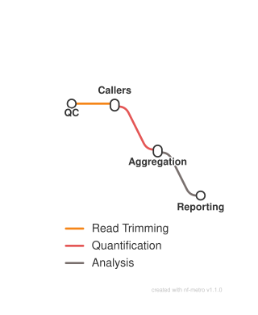

# circRNA detection: four callers with ensemble aggregation

<div class="ox-page-badges"><span class="ox-badge ox-badge--live">✔ Live-tested · full-line</span> <span class="ox-badge ox-badge--origin">✦ Original</span> </div>

Circular RNA detection with four independent callers (CIRIquant, CIRCexplorer2, find_circ, circRNA_finder) and ensemble aggregation of calls supported by at least two methods. Indexes and conda environments are built automatically on first run from a single reference_dir; samples are auto-discovered from raw/ with no CSV.

| | |
|---:|---|
| **Rating** | ✔ Live-tested |
| **Origin** | original |
| **Domain** | transcriptomics (circRNA) |
| **Rules** | 9 |
| **Compute** | up to 8 threads / 32 GB per rule |
| **Tools** | fastp · ciriquant · circexplorer2 · find_circ · circrna_finder · r-base · multiqc |
| **Ported** | 2026-08-15 |
| **License** | Apache-2.0 |
| **Source** | [WangLabCSU/oxo-flow-circrna](https://github.com/WangLabCSU/oxo-flow-circrna) |
| **Pinned version** | `main` |

## Run it

```bash
oxo-flow run circrna.oxoflow -j 16
```

Set `reference_dir` in `circrna.oxoflow` and place FASTQ pairs in `raw/`; indexes and environments build on first run.

## Installation

**Engine.** oxo-flow >= 0.12.0

**Toolchain.** conda envs — pinned (envs/*.yaml, one per tool)

**Requirements.**
- reference_dir with genome.fa, genes.gtf, hg38_ref.txt, CIRIquant.yml
- paired FASTQ per sample in raw/ (<sample>_1.fastq.gz / <sample>_2.fastq.gz)
- compute: up to 8 threads / 32 GB per rule
- conda or mamba to create the pinned per-rule environments on first run

```bash
# 1. install oxo-flow (release binary, recommended)
curl -fL -o oxo-flow.tar.gz https://github.com/Traitome/oxo-flow/releases/latest/download/oxo-flow-latest-x86_64-unknown-linux-gnu.tar.gz
tar xzf oxo-flow.tar.gz && sudo mv oxo-flow /usr/local/bin/
#    or, via conda (may lag behind releases):
#    conda install -c bioconda oxo-flow-cli
#    NOTE: bioconda currently ships 0.10.2, older than the >= 0.12.0
#    minimum of every catalog entry — prefer the release binary.

# 2. get this workflow (clones the repo, auto-discovers the workflow,
#    sanity-parses it with the engine)
oxo-flow pull gh:WangLabCSU/oxo-flow-circrna
#    (alternative: plain git clone)
#    git clone https://github.com/WangLabCSU/oxo-flow-circrna
```

## Parameters

| Parameter | Default | Description | Used by |
|---:|---|---|---|
| `reference_dir` | `./reference` | === The only path you need to set === reference_dir/ layout: genome.fa, genes.gtf, hg38_ref.txt, bwa/genome.fa.{bwt,pac,ann,amb,sa}, hisat2/genome.fa.{1-8}.ht2, bowtie2/genome.fa.*.bt2, star/ | `circexplorer2` |

Descriptions are the workflow's own `#` comments from its `[config]` section, surfaced by `oxo-flow info` — no schema file to maintain.

## Workflow graph

<div class="ox-dag-card" markdown="1">



</div>

The graph is derived at catalog-build time from `oxo-flow graph -f dot` and rendered with Graphviz. It shows the workflow at rule level: wildcard `{sample}` instances expand at run time when sample data is discovered (the runtime view is `oxo-flow graph --expanded`).

## Scope

The default-parameters main path of the source pipeline was ported rule-for-rule; alternate paths are documented as excluded.

**In scope**

- fastp
- ciriquant
- circexplorer2
- find_circ
- circrna_finder
- annotation
- aggregate
- aggregate_dataset
- multiqc

**Excluded**

- none

## Links

- Repository: [oxo-flow-circrna](https://github.com/WangLabCSU/oxo-flow-circrna)
- Upstream: [WangLabCSU/oxo-flow-circrna](https://github.com/WangLabCSU/oxo-flow-circrna) @ `main`
- License: Apache-2.0 (this workflow) · MIT (upstream)

Created on 2026-08-15 — this port may lag behind upstream releases. See the repository's NOTICE for full attribution.
