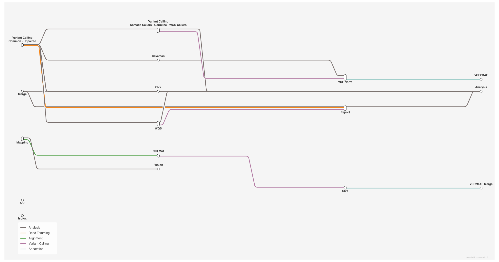

# Cancer genome & transcriptome analysis (WES/WGS/RNA, single entry): somatic+germline+CNV+SV calling, MAF annotation, case report

<div class="ox-page-badges"><span class="ox-badge ox-badge--live">✔ Live-tested</span> <span class="ox-badge ox-badge--origin">⇄ Official port</span> <span class="ox-badge ox-badge--sn"><span class="dot"></span>snakemake port</span></div>

Port of zyllifeworld/clindet in its upstream single-Snakefile form: one entry file, config run_type (wes|wgs|rna) selects the rule tree, and paired vs tumor-only WES is derived PER PAIR from the sample sheet (a pair without a control runs the tumor-only tree — engine wildcard-scoped when predicates). 183 rules: somatic SNV (Mutect2, VarDict, VarScan2, MuSE, HaplotypeCaller) + germline (Strelka2+Manta, CaVEMan); tumor-only callers (Mutect2/HaplotypeCaller/varscan2/Strelka/vardict/lofreq/freebayes); CNV subset (Control-FREEC, Sequenza, ExomeDepth, ASCAT); WGS SV (delly chain incl. germ, svaba, Manta somaticSV); opt-in BQSR; vcf2maf/VEP MAF annotation, region flagging, cancer report, MultiQC; RNA fusion/expression (arriba/TRUST4/isofox). Live-verified per run type on tx-ubuntu.

| | |
|---:|---|
| **Rating** | ✔ Live-tested |
| **Origin** | port |
| **Domain** | cancer genomics (WES/WGS/RNA) |
| **Rules** | 186 |
| **Compute** | up to 30 threads / 10 GB per rule |
| **Tools** | fastp · bwa (>=0.7.18) · samtools · gatk4 4.6.2.0 (container) · bcftools >=1.22 · bgzip · tabix · varscan 2.4.6 · vardict-java 1.8.3 (container) · muse 2.1.2 (container) · strelka2 · manta · caveman 1.15.3 (container) · vcf2maf 1.6.22 · ensembl-vep 114.2 · libboost 1.85.0 · multiqc · R >= 4.4 (knitr, data.table, gpgr via post-deploy) |
| **Ported** | 2026-08-15 |
| **License** | Apache-2.0 |
| **Source** | [zyllifeworld/clindet](https://github.com/zyllifeworld/clindet) |
| **Pinned version** | `582a9131` |

## Run it

```bash
oxo-flow run main.oxoflow
```

Needs clinical sequencing inputs — see Requirements.

## Installation

**Engine.** oxo-flow >= 0.16.0

**Toolchain.** conda envs (envs/*.yaml) + pinned Singularity/Docker containers for GATK, VarDict, MuSE, CaVEMan; VEP cache installed via the clindet_vep env post-deploy

**Requirements.**
- Reference data: genome FASTA + .fai + .dict, target BED, dbSNP / Mills indels / gnomAD VCFs (paths in [config])
- BWA index of the reference FASTA and tabix indexes for the annotation VCFs
- VEP cache (GRCh38, version 110) at the configured vep_data path
- Compute: up to 30 threads / 10 GB per rule

```bash
# 1. install oxo-flow (release binary, recommended)
curl -fL -o oxo-flow.tar.gz https://github.com/Traitome/oxo-flow/releases/latest/download/oxo-flow-latest-x86_64-unknown-linux-gnu.tar.gz
tar xzf oxo-flow.tar.gz && sudo mv oxo-flow /usr/local/bin/
#    or, via conda (may lag behind releases):
#    conda install -c bioconda oxo-flow-cli
#    NOTE: bioconda currently ships 0.10.2, older than the >= 0.12.0
#    minimum of every catalog entry — prefer the release binary.

# 2. get this workflow (clones the repo, auto-discovers the workflow,
#    sanity-parses it with the engine)
oxo-flow pull gh:WangLabCSU/oxo-flow-clindet
#    (alternative: plain git clone)
#    git clone https://github.com/WangLabCSU/oxo-flow-clindet
```

## Parameters

| Parameter | Default | Description | Used by |
|---:|---|---|---|
| `annotate_beds_file` | `` | BED tracks used by mutation_flag — name/path TSV mirroring upstream softwares_params[genome].annotate_beds dict (empty = header-only, no flags) | `make_region_bed_list` |
| `arriba_blacklist` | `test/fixtures/refs/annotations/arriba_blacklist.tsv` | Arriba databases (upstream softwares_params[genome].arriba.database). Mini-test: blacklist + mini known_fusions/protein_domains/cytobands are local files matching the 922 bp fixture reference (the whole-genome DBs in the uhrigs/arriba:2.4.0 image fail to parse against it, observed live). Real hg38 runs keep the container paths; the mini DBs mirror the formats 1:1. | `arriba_fusion` |
| `arriba_cytobands` | `test/fixtures/refs/annotations/arriba_cytobands_mini.tsv` | — | `arriba_draw` |
| `arriba_known_fusions` | `test/fixtures/refs/annotations/arriba_known_fusions_mini.tsv.gz` | — | `arriba_fusion` |
| `arriba_protein_domains` | `test/fixtures/refs/annotations/arriba_protein_domains_mini.gff3` | — | `arriba_draw`, `arriba_fusion` |
| `ascat_alleles_prefix` | `test/fixtures/cnv/ascat_alleles/` | — | `CNA_ASCAT` |
| `ascat_chroms` | `21` | — | `CNA_ASCAT` |
| `ascat_gc_file` | `test/fixtures/cnv/ascat_gc.txt` | — | `CNA_ASCAT` |
| `ascat_loci_prefix` | `test/fixtures/cnv/ascat_loci/` | — | `CNA_ASCAT` |
| `ascat_rt_file` | `` | — | `CNA_ASCAT` |
| `cnv_enabled` | `false` | CNV branch (upstream somatic_cnv_list; mini-test default = [] -> off). Set true to run the ported subset (freec/sequenza/exomedepth/ASCAT — purple/amber/cobalt/facets need the upstream's custom containers, see rules/80_cnv.oxoflow). | `ASCAT_EXTRACT_PURITYPLOIDY`, `CNA_ASCAT`, `CNA_exomedepth`, `all_cnv`, `freec_call_paired`, `freec_config`, `plot_freec`, `sequenza_bam2seqz`, `sequenza_call`, `sequenza_seqz_binning` |
| `dbsnp` | `test/fixtures/refs/annotations/dbsnp_146.hg38_chr21.vcf.gz` | — | — |
| `dbsnp_gz` | `test/fixtures/refs/annotations/dbsnp_146.hg38_chr21.vcf.gz` | MuSE sump needs a gzipped dbSNP | `muse_sump`, `muse_sump_wgs` |
| `dbsnp_indel` | `test/fixtures/refs/annotations/Mills_and_1000G_gold_standard.indels.hg38_chr21.vcf.gz` | — | `SV_svaba` |
| `exomedepth_bed` | `test/fixtures/cnv/exomedepth_regions.bed` | — | `CNA_exomedepth` |
| `exomedepth_use_target_bed` | `true` | — | `CNA_exomedepth` |
| `flag_config_dir` | `test/fixtures/flag` | cgpFlagCaVEMan configs (bed-based flags dropped: no chr21 flag data) | `CM_flag` |
| `freec_chr_files` | `test/fixtures/cnv/freec_chr_fasta` | — | `freec_config` |
| `freec_chr_len_file` | `test/fixtures/cnv/freec_chrlen.txt` | — | `freec_config` |
| `freec_ini_template` | `scripts/config_exome.mini.ini` | — | `freec_config` |
| `freec_sambamba` | `sambamba` | — | `freec_config` |
| `genome_version` | `hg38_chr21` | — | `ASCAT_EXTRACT_PURITYPLOIDY`, `CM_call`, `CM_cnv`, `CM_flag`, `CM_germ_flag`, `CNA_ASCAT`, `CNA_exomedepth`, `M2_SNC`, `M2_SNC_wgs`, `M2_ST`, `M2_ST_wgs`, `M2_contam`, `M2_contam_wgs`, `M2_filter`, `M2_filter_unpaired`, `M2_filter_unpaired_rna`, `M2_filter_wgs`, `RSEM_sort_genome`, `STAR_1_pass`, `STAR_arriba_map`, `STAR_isofox_map`, `STAR_mut_map`, `SV_delly`, `SV_delly_filter_somatic`, `SV_delly_germ`, `SV_delly_sample_tsv`, `SV_delly_to_vcf`, `SV_svaba`, `SplitNCigarReads`, `TRUST4_TBCR`, `all`, `all_cnv`, `all_sv`, `all_unpaired`, `all_unpaired_maf`, `all_vcf`, `apply_base_quality_recalibration_normal`, `apply_base_quality_recalibration_tumor`, `apply_base_quality_recalibration_tumor_unpaired`, `arriba_draw`, `arriba_fusion`, `bam_flagstat_normal`, `bam_flagstat_tumor`, `bed_to_interval_list`, `cal_exp_RSEM`, `call_config_strelka`, `call_config_strelka_wgs`, `call_strelka_manta_germline`, `call_strelka_manta_wgs`, `call_strelka_somatic_manta`, `call_strelka_somatic_manta_wgs`, `call_variants_HaplotypeCaller`, `call_variants_HaplotypeCaller_rna`, `call_variants_HaplotypeCaller_wgs`, `combined_multiqc`, `combined_multiqc_prep_multiqc_data`, `delly2bnd`, `delly_filter`, `fastp_normal_sample`, `fastp_trim`, `fastp_tumor_sample`, `fastp_tumor_sample_unpaired`, `flag_mutation_pairead_maf`, `freec_call_paired`, `freec_config`, `isofox_call`, `kallisto`, `link_bam`, `lofreq_call_up`, `lofreq_norm_filter`, `lofreq_somatic_unpaired`, `make_region_bed_list`, `map_reads_normal`, `map_reads_tumor`, `map_reads_tumor_unpaired`, `mark_duplicates_normal`, `mark_duplicates_tumor`, `mark_duplicates_tumor_unpaired`, `merge_paired_germ_maf`, `merge_paired_maf`, `merge_paired_vcf`, `merge_rna_maf`, `merge_strelka_manta`, `merge_strelka_manta_wgs`, `merge_strelka_somatic_manta`, `merge_strelka_somatic_manta_wgs`, `merge_unpaired_maf`, `merge_unpaired_vcf`, `muse_call`, `muse_call_wgs`, `muse_sump`, `muse_sump_wgs`, `mutect2`, `mutect2_call`, `mutect2_wgs`, `norm_filter_HaplotypeCaller`, `norm_filter_freebayes`, `picard_collect_wes_normal`, `picard_collect_wes_tumor`, `picard_collect_wgs_normal`, `picard_collect_wgs_tumor`, `picard_flength_wgs_normal`, `picard_flength_wgs_tumor`, `plot_freec`, `prep_multiqc_data`, `recal_link_normal`, `recal_link_tumor`, `recal_link_tumor_unpaired`, `recalibrate_base_qualities_normal`, `recalibrate_base_qualities_tumor`, `recalibrate_base_qualities_tumor_unpaired`, `run_cancer_report`, `salmon`, `sequenza_bam2seqz`, `sequenza_call`, `sequenza_seqz_binning`, `unpair_lofreq_filter`, `unpaired_call_config_strelka`, `unpaired_call_config_strelka_rna`, `unpaired_call_strelka_manta`, `unpaired_call_strelka_manta_rna`, `unpaired_call_variants_HaplotypeCaller`, `unpaired_filter_vardict`, `unpaired_filter_vardict_rna`, `unpaired_freebayes`, `unpaired_freebayes_rna`, `unpaired_mutect2_call`, `unpaired_strelka_filter`, `unpaired_strelka_filter_rna`, `unpaired_vardict_single_mode`, `unpaired_vardict_single_mode_rna`, `vardict_filter_somatic`, `vardict_filter_somatic_wgs`, `vardict_paired_mode`, `vardict_paired_mode_wgs`, `vardict_wgs_bed_wgs`, `varscan2_call`, `varscan2_call_unpaired_indel`, `varscan2_call_unpaired_indel_rna`, `varscan2_call_unpaired_snp`, `varscan2_call_unpaired_snp_rna`, `varscan2_call_wgs`, `varscan2_filter_indel`, `varscan2_filter_snp`, `varscan2_merge_somatic`, `varscan2_merge_somatic_wgs`, `varscan2_merge_unpaired`, `varscan2_merge_unpaired_rna`, `varscan2_mpileup`, `varscan2_mpileup_unpaired`, `varscan2_mpileup_unpaired_rna`, `varscan2_mpileup_wgs`, `varscan2_processSomatic`, `varscan2_processSomatic_wgs`, `varscan2_som_filter`, `varscan2_som_filter_wgs`, `vcf2maf_HaplotypeCaller`, `vcf2maf_Mutect2`, `vcf2maf_germ_caveman`, `vcf2maf_germ_strelkamanta`, `vcf2maf_muse`, `vcf2maf_rna_HaplotypeCaller`, `vcf2maf_rna_Mutect2`, `vcf2maf_rna_freebayes`, `vcf2maf_rna_lofreq`, `vcf2maf_rna_vardict`, `vcf2maf_rna_varscan2`, `vcf2maf_unpaired_HaplotypeCaller`, `vcf2maf_unpaired_Mutect2`, `vcf2maf_unpaired_freebayes`, `vcf2maf_unpaired_lofreq`, `vcf2maf_unpaired_strelka`, `vcf2maf_unpaired_vardict`, `vcf2maf_unpaired_varscan2`, `vcf2maf_vardict`, `vcf2maf_varscan2`, `vcf_norm_HaplotypeCaller`, `vcf_norm_Mutect2`, `vcf_norm_germline_caveman`, `vcf_norm_germline_strelkamanta`, `vcf_norm_muse`, `vcf_norm_vardict`, `vcf_norm_varscan2` |
| `germ_caller_list` | `'strelkamanta', 'caveman'` | — | — |
| `hmftools_ensembl_data_dir` | `` | HMF tools (isofox; excluded for hg38_chr21 upstream — needs the multi-GB hmf_pipeline_resources tree, not shipped in the mini-test) | `isofox_call` |
| `isofox_mem_mb` | `30000` | — | `isofox_call` |
| `java_temp_dir` | `/tmp` | Java temp dir (upstream: config['params']['java']['temp_directory']) | `M2_SNC`, `M2_SNC_wgs`, `M2_ST`, `M2_ST_wgs`, `M2_contam`, `M2_contam_wgs`, `M2_filter`, `M2_filter_unpaired`, `M2_filter_unpaired_rna`, `M2_filter_wgs`, `SplitNCigarReads`, `apply_base_quality_recalibration_normal`, `apply_base_quality_recalibration_tumor`, `apply_base_quality_recalibration_tumor_unpaired`, `bed_to_interval_list`, `call_variants_HaplotypeCaller`, `call_variants_HaplotypeCaller_rna`, `call_variants_HaplotypeCaller_wgs`, `mark_duplicates_normal`, `mark_duplicates_tumor`, `mark_duplicates_tumor_unpaired`, `mutect2`, `mutect2_call`, `mutect2_wgs`, `picard_collect_wes_normal`, `picard_collect_wes_tumor`, `picard_collect_wgs_normal`, `picard_collect_wgs_tumor`, `picard_flength_wgs_normal`, `picard_flength_wgs_tumor`, `recalibrate_base_qualities_normal`, `recalibrate_base_qualities_tumor`, `recalibrate_base_qualities_tumor_unpaired`, `unpaired_call_variants_HaplotypeCaller`, `unpaired_mutect2_call` |
| `kallisto_index` | `` | — | `kallisto` |
| `known_sites1` | `test/fixtures/refs/annotations/known_sites1.mini.vcf.gz` | — | `recalibrate_base_qualities_normal`, `recalibrate_base_qualities_tumor`, `recalibrate_base_qualities_tumor_unpaired` |
| `known_sites2` | `test/fixtures/refs/annotations/known_sites2.mini.vcf.gz` | — | `recalibrate_base_qualities_normal`, `recalibrate_base_qualities_tumor`, `recalibrate_base_qualities_tumor_unpaired` |
| `mutect2_germline_vcf` | `test/fixtures/refs/annotations/gnomAD.r2.1.1.GRCh38.PASS.AC.AF.only_chr21.vcf.gz` | — | `mutect2`, `mutect2_call`, `mutect2_wgs`, `unpaired_mutect2_call` |
| `mutect2_vcf` | `test/fixtures/refs/annotations/gnomAD.r2.1.1.GRCh38.PASS.AC.AF.only_chr21.vcf.gz` | Mutect2 GetPileupSummaries sites + germline resource | `M2_SNC`, `M2_SNC_wgs`, `M2_ST`, `M2_ST_wgs` |
| `ncbi_build` | `GRCh38` | vcf2maf / VEP (upstream: config['softwares_params'][genome_version]['vcf2maf']) | `vcf2maf_HaplotypeCaller`, `vcf2maf_Mutect2`, `vcf2maf_germ_caveman`, `vcf2maf_germ_strelkamanta`, `vcf2maf_muse`, `vcf2maf_rna_HaplotypeCaller`, `vcf2maf_rna_Mutect2`, `vcf2maf_rna_freebayes`, `vcf2maf_rna_lofreq`, `vcf2maf_rna_vardict`, `vcf2maf_rna_varscan2`, `vcf2maf_unpaired_HaplotypeCaller`, `vcf2maf_unpaired_Mutect2`, `vcf2maf_unpaired_freebayes`, `vcf2maf_unpaired_lofreq`, `vcf2maf_unpaired_strelka`, `vcf2maf_unpaired_vardict`, `vcf2maf_unpaired_varscan2`, `vcf2maf_vardict`, `vcf2maf_varscan2` |
| `normal_fastq_r1` | `test/fixtures/reads/mini-NC_R1.fq.gz` | — | `fastp_normal_sample` |
| `normal_fastq_r2` | `test/fixtures/reads/mini-NC_R2.fq.gz` | — | `fastp_normal_sample` |
| `output_dir` | `mini_test` | — | `ASCAT_EXTRACT_PURITYPLOIDY`, `CM_call`, `CM_cnv`, `CM_flag`, `CM_germ_flag`, `CNA_ASCAT`, `CNA_exomedepth`, `M2_SNC`, `M2_SNC_wgs`, `M2_ST`, `M2_ST_wgs`, `M2_contam`, `M2_contam_wgs`, `M2_filter`, `M2_filter_unpaired`, `M2_filter_unpaired_rna`, `M2_filter_wgs`, `RSEM_sort_genome`, `STAR_1_pass`, `STAR_arriba_map`, `STAR_isofox_map`, `STAR_mut_map`, `SV_delly`, `SV_delly_filter_somatic`, `SV_delly_germ`, `SV_delly_sample_tsv`, `SV_delly_to_vcf`, `SV_svaba`, `SplitNCigarReads`, `TRUST4_TBCR`, `all`, `all_cnv`, `all_sv`, `all_unpaired`, `all_unpaired_maf`, `all_vcf`, `apply_base_quality_recalibration_normal`, `apply_base_quality_recalibration_tumor`, `apply_base_quality_recalibration_tumor_unpaired`, `arriba_draw`, `arriba_fusion`, `bam_flagstat_normal`, `bam_flagstat_tumor`, `bed_to_interval_list`, `cal_exp_RSEM`, `call_config_strelka`, `call_config_strelka_wgs`, `call_strelka_manta_germline`, `call_strelka_manta_wgs`, `call_strelka_somatic_manta`, `call_strelka_somatic_manta_wgs`, `call_variants_HaplotypeCaller`, `call_variants_HaplotypeCaller_rna`, `call_variants_HaplotypeCaller_wgs`, `combined_multiqc`, `combined_multiqc_prep_multiqc_data`, `delly2bnd`, `delly_filter`, `fastp_normal_sample`, `fastp_trim`, `fastp_tumor_sample`, `fastp_tumor_sample_unpaired`, `flag_mutation_pairead_maf`, `freec_call_paired`, `freec_config`, `isofox_call`, `kallisto`, `link_bam`, `lofreq_call_up`, `lofreq_norm_filter`, `lofreq_somatic_unpaired`, `make_region_bed_list`, `map_reads_normal`, `map_reads_tumor`, `map_reads_tumor_unpaired`, `mark_duplicates_normal`, `mark_duplicates_tumor`, `mark_duplicates_tumor_unpaired`, `merge_paired_germ_maf`, `merge_paired_maf`, `merge_paired_vcf`, `merge_rna_maf`, `merge_strelka_manta`, `merge_strelka_manta_wgs`, `merge_strelka_somatic_manta`, `merge_strelka_somatic_manta_wgs`, `merge_unpaired_maf`, `merge_unpaired_vcf`, `muse_call`, `muse_call_wgs`, `muse_sump`, `muse_sump_wgs`, `mutect2`, `mutect2_call`, `mutect2_wgs`, `norm_filter_HaplotypeCaller`, `norm_filter_freebayes`, `picard_collect_wes_normal`, `picard_collect_wes_tumor`, `picard_collect_wgs_normal`, `picard_collect_wgs_tumor`, `picard_flength_wgs_normal`, `picard_flength_wgs_tumor`, `plot_freec`, `prep_multiqc_data`, `recal_link_normal`, `recal_link_tumor`, `recal_link_tumor_unpaired`, `recalibrate_base_qualities_normal`, `recalibrate_base_qualities_tumor`, `recalibrate_base_qualities_tumor_unpaired`, `run_cancer_report`, `salmon`, `sequenza_bam2seqz`, `sequenza_call`, `sequenza_seqz_binning`, `unpair_lofreq_filter`, `unpaired_call_config_strelka`, `unpaired_call_config_strelka_rna`, `unpaired_call_strelka_manta`, `unpaired_call_strelka_manta_rna`, `unpaired_call_variants_HaplotypeCaller`, `unpaired_filter_vardict`, `unpaired_filter_vardict_rna`, `unpaired_freebayes`, `unpaired_freebayes_rna`, `unpaired_mutect2_call`, `unpaired_strelka_filter`, `unpaired_strelka_filter_rna`, `unpaired_vardict_single_mode`, `unpaired_vardict_single_mode_rna`, `vardict_filter_somatic`, `vardict_filter_somatic_wgs`, `vardict_paired_mode`, `vardict_paired_mode_wgs`, `vardict_wgs_bed_wgs`, `varscan2_call`, `varscan2_call_unpaired_indel`, `varscan2_call_unpaired_indel_rna`, `varscan2_call_unpaired_snp`, `varscan2_call_unpaired_snp_rna`, `varscan2_call_wgs`, `varscan2_filter_indel`, `varscan2_filter_snp`, `varscan2_merge_somatic`, `varscan2_merge_somatic_wgs`, `varscan2_merge_unpaired`, `varscan2_merge_unpaired_rna`, `varscan2_mpileup`, `varscan2_mpileup_unpaired`, `varscan2_mpileup_unpaired_rna`, `varscan2_mpileup_wgs`, `varscan2_processSomatic`, `varscan2_processSomatic_wgs`, `varscan2_som_filter`, `varscan2_som_filter_wgs`, `vcf2maf_HaplotypeCaller`, `vcf2maf_Mutect2`, `vcf2maf_germ_caveman`, `vcf2maf_germ_strelkamanta`, `vcf2maf_muse`, `vcf2maf_rna_HaplotypeCaller`, `vcf2maf_rna_Mutect2`, `vcf2maf_rna_freebayes`, `vcf2maf_rna_lofreq`, `vcf2maf_rna_vardict`, `vcf2maf_rna_varscan2`, `vcf2maf_unpaired_HaplotypeCaller`, `vcf2maf_unpaired_Mutect2`, `vcf2maf_unpaired_freebayes`, `vcf2maf_unpaired_lofreq`, `vcf2maf_unpaired_strelka`, `vcf2maf_unpaired_vardict`, `vcf2maf_unpaired_varscan2`, `vcf2maf_vardict`, `vcf2maf_varscan2`, `vcf_norm_HaplotypeCaller`, `vcf_norm_Mutect2`, `vcf_norm_germline_caveman`, `vcf_norm_germline_strelkamanta`, `vcf_norm_muse`, `vcf_norm_vardict`, `vcf_norm_varscan2` |
| `recal_bqsr` | `false` | BQSR (upstream config['project']['recal_BQSR'] + resources['varanno'][genome]): recal_bqsr = false is the upstream mini-test default (recal_link symlinks the dedup BAM); set true to run BaseRecalibrator + ApplyBQSR instead. | `apply_base_quality_recalibration_normal`, `apply_base_quality_recalibration_tumor`, `apply_base_quality_recalibration_tumor_unpaired`, `recal_link_normal`, `recal_link_tumor`, `recal_link_tumor_unpaired`, `recalibrate_base_qualities_normal`, `recalibrate_base_qualities_tumor`, `recalibrate_base_qualities_tumor_unpaired` |
| `reference` | `test/fixtures/refs/sequence/Homo_sapiens_assembly38_chr21.fasta` | Resources (upstream: config['resources'][genome_version]) | `CM_call`, `CM_flag`, `CNA_exomedepth`, `M2_SNC`, `M2_SNC_wgs`, `M2_ST`, `M2_ST_wgs`, `M2_filter`, `M2_filter_unpaired`, `M2_filter_unpaired_rna`, `M2_filter_wgs`, `STAR_1_pass`, `SV_delly`, `SV_delly_germ`, `SV_svaba`, `SplitNCigarReads`, `apply_base_quality_recalibration_normal`, `apply_base_quality_recalibration_tumor`, `apply_base_quality_recalibration_tumor_unpaired`, `arriba_fusion`, `call_config_strelka`, `call_config_strelka_wgs`, `call_strelka_manta_germline`, `call_strelka_manta_wgs`, `call_strelka_somatic_manta`, `call_strelka_somatic_manta_wgs`, `call_variants_HaplotypeCaller`, `call_variants_HaplotypeCaller_rna`, `call_variants_HaplotypeCaller_wgs`, `delly2bnd`, `freec_config`, `isofox_call`, `lofreq_call_up`, `lofreq_norm_filter`, `lofreq_somatic_unpaired`, `map_reads_normal`, `map_reads_tumor`, `map_reads_tumor_unpaired`, `muse_call`, `muse_call_wgs`, `mutect2`, `mutect2_call`, `mutect2_wgs`, `norm_filter_HaplotypeCaller`, `norm_filter_freebayes`, `picard_collect_wes_normal`, `picard_collect_wes_tumor`, `picard_collect_wgs_normal`, `picard_collect_wgs_tumor`, `picard_flength_wgs_normal`, `picard_flength_wgs_tumor`, `recalibrate_base_qualities_normal`, `recalibrate_base_qualities_tumor`, `recalibrate_base_qualities_tumor_unpaired`, `sequenza_bam2seqz`, `unpair_lofreq_filter`, `unpaired_call_config_strelka`, `unpaired_call_config_strelka_rna`, `unpaired_call_strelka_manta`, `unpaired_call_strelka_manta_rna`, `unpaired_call_variants_HaplotypeCaller`, `unpaired_freebayes`, `unpaired_freebayes_rna`, `unpaired_mutect2_call`, `unpaired_vardict_single_mode`, `unpaired_vardict_single_mode_rna`, `vardict_paired_mode`, `vardict_paired_mode_wgs`, `vardict_wgs_bed_wgs`, `varscan2_call`, `varscan2_call_unpaired_indel_rna`, `varscan2_call_unpaired_snp_rna`, `varscan2_mpileup`, `varscan2_mpileup_unpaired`, `varscan2_mpileup_unpaired_rna`, `varscan2_mpileup_wgs`, `vcf2maf_HaplotypeCaller`, `vcf2maf_Mutect2`, `vcf2maf_germ_caveman`, `vcf2maf_germ_strelkamanta`, `vcf2maf_muse`, `vcf2maf_rna_HaplotypeCaller`, `vcf2maf_rna_Mutect2`, `vcf2maf_rna_freebayes`, `vcf2maf_rna_lofreq`, `vcf2maf_rna_vardict`, `vcf2maf_rna_varscan2`, `vcf2maf_unpaired_HaplotypeCaller`, `vcf2maf_unpaired_Mutect2`, `vcf2maf_unpaired_freebayes`, `vcf2maf_unpaired_lofreq`, `vcf2maf_unpaired_strelka`, `vcf2maf_unpaired_vardict`, `vcf2maf_unpaired_varscan2`, `vcf2maf_vardict`, `vcf2maf_varscan2`, `vcf_norm_HaplotypeCaller`, `vcf_norm_Mutect2`, `vcf_norm_germline_caveman`, `vcf_norm_germline_strelkamanta`, `vcf_norm_muse`, `vcf_norm_vardict`, `vcf_norm_varscan2` |
| `reference_dict` | `test/fixtures/refs/sequence/Homo_sapiens_assembly38_chr21.dict` | — | `bed_to_interval_list` |
| `rna_fastq_r1` | `test/fixtures/reads/mini-T_RNA_R1.fq.gz` | RNA (upstream wrapper/rna.smk; run_type = "rna"). Default stages: [arriba, call_mut]; quant/isofox rules run when explicitly targeted. | `STAR_1_pass`, `STAR_arriba_map`, `STAR_isofox_map`, `STAR_mut_map`, `cal_exp_RSEM`, `fastp_trim`, `kallisto`, `salmon` |
| `rna_fastq_r2` | `test/fixtures/reads/mini-T_RNA_R2.fq.gz` | — | `STAR_1_pass`, `STAR_arriba_map`, `STAR_isofox_map`, `STAR_mut_map`, `cal_exp_RSEM`, `fastp_trim`, `kallisto`, `salmon` |
| `rna_gtf` | `test/fixtures/refs/annotations/mini_chr21.gtf` | — | `STAR_1_pass`, `STAR_arriba_map`, `STAR_isofox_map`, `STAR_mut_map`, `arriba_draw`, `arriba_fusion` |
| `rsem_index` | `` | Quant indexes are empty in the upstream hg38_chr21 test config — the RSEM/kallisto/salmon rules only run when explicitly targeted | `cal_exp_RSEM` |
| `run_report` | `true` | Report stages (upstream `stages`): case_report + multiqc are ON in the port default; set run_report = false to match the upstream mini-test default. | `combined_multiqc`, `combined_multiqc_prep_multiqc_data`, `prep_multiqc_data`, `run_cancer_report` |
| `run_type` | `wes` | Upstream Snakefile dispatch key (VALID_RUN_TYPES): wes \| wgs \| rna | `ASCAT_EXTRACT_PURITYPLOIDY`, `CM_call`, `CM_cnv`, `CM_flag`, `CM_germ_flag`, `CNA_ASCAT`, `CNA_exomedepth`, `M2_SNC`, `M2_SNC_wgs`, `M2_ST`, `M2_ST_wgs`, `M2_contam`, `M2_contam_wgs`, `M2_filter`, `M2_filter_unpaired`, `M2_filter_unpaired_rna`, `M2_filter_wgs`, `RSEM_sort_genome`, `STAR_1_pass`, `STAR_arriba_map`, `STAR_isofox_map`, `STAR_mut_map`, `SV_delly`, `SV_delly_filter_somatic`, `SV_delly_germ`, `SV_delly_sample_tsv`, `SV_delly_to_vcf`, `SV_svaba`, `SplitNCigarReads`, `TRUST4_TBCR`, `all`, `all_cnv`, `all_sv`, `all_unpaired`, `all_unpaired_maf`, `all_vcf`, `apply_base_quality_recalibration_normal`, `apply_base_quality_recalibration_tumor`, `apply_base_quality_recalibration_tumor_unpaired`, `arriba_draw`, `arriba_fusion`, `bam_flagstat_normal`, `bam_flagstat_tumor`, `bed_to_interval_list`, `cal_exp_RSEM`, `call_config_strelka`, `call_config_strelka_wgs`, `call_strelka_manta_germline`, `call_strelka_manta_wgs`, `call_strelka_somatic_manta`, `call_strelka_somatic_manta_wgs`, `call_variants_HaplotypeCaller`, `call_variants_HaplotypeCaller_rna`, `call_variants_HaplotypeCaller_wgs`, `combined_multiqc`, `combined_multiqc_prep_multiqc_data`, `delly2bnd`, `delly_filter`, `fastp_normal_sample`, `fastp_trim`, `fastp_tumor_sample`, `fastp_tumor_sample_unpaired`, `flag_mutation_pairead_maf`, `freec_call_paired`, `freec_config`, `isofox_call`, `kallisto`, `link_bam`, `lofreq_call_up`, `lofreq_norm_filter`, `lofreq_somatic_unpaired`, `make_region_bed_list`, `map_reads_normal`, `map_reads_tumor`, `map_reads_tumor_unpaired`, `mark_duplicates_normal`, `mark_duplicates_tumor`, `mark_duplicates_tumor_unpaired`, `merge_paired_germ_maf`, `merge_paired_maf`, `merge_paired_vcf`, `merge_rna_maf`, `merge_strelka_manta`, `merge_strelka_manta_wgs`, `merge_strelka_somatic_manta`, `merge_strelka_somatic_manta_wgs`, `merge_unpaired_maf`, `merge_unpaired_vcf`, `muse_call`, `muse_call_wgs`, `muse_sump`, `muse_sump_wgs`, `mutect2`, `mutect2_call`, `mutect2_wgs`, `norm_filter_HaplotypeCaller`, `norm_filter_freebayes`, `picard_collect_wes_normal`, `picard_collect_wes_tumor`, `picard_collect_wgs_normal`, `picard_collect_wgs_tumor`, `picard_flength_wgs_normal`, `picard_flength_wgs_tumor`, `plot_freec`, `prep_multiqc_data`, `recal_link_normal`, `recal_link_tumor`, `recal_link_tumor_unpaired`, `recalibrate_base_qualities_normal`, `recalibrate_base_qualities_tumor`, `recalibrate_base_qualities_tumor_unpaired`, `run_cancer_report`, `salmon`, `sequenza_bam2seqz`, `sequenza_call`, `sequenza_seqz_binning`, `unpair_lofreq_filter`, `unpaired_call_config_strelka`, `unpaired_call_config_strelka_rna`, `unpaired_call_strelka_manta`, `unpaired_call_strelka_manta_rna`, `unpaired_call_variants_HaplotypeCaller`, `unpaired_filter_vardict`, `unpaired_filter_vardict_rna`, `unpaired_freebayes`, `unpaired_freebayes_rna`, `unpaired_mutect2_call`, `unpaired_strelka_filter`, `unpaired_strelka_filter_rna`, `unpaired_vardict_single_mode`, `unpaired_vardict_single_mode_rna`, `vardict_filter_somatic`, `vardict_filter_somatic_wgs`, `vardict_paired_mode`, `vardict_paired_mode_wgs`, `vardict_wgs_bed_wgs`, `varscan2_call`, `varscan2_call_unpaired_indel`, `varscan2_call_unpaired_indel_rna`, `varscan2_call_unpaired_snp`, `varscan2_call_unpaired_snp_rna`, `varscan2_call_wgs`, `varscan2_filter_indel`, `varscan2_filter_snp`, `varscan2_merge_somatic`, `varscan2_merge_somatic_wgs`, `varscan2_merge_unpaired`, `varscan2_merge_unpaired_rna`, `varscan2_mpileup`, `varscan2_mpileup_unpaired`, `varscan2_mpileup_unpaired_rna`, `varscan2_mpileup_wgs`, `varscan2_processSomatic`, `varscan2_processSomatic_wgs`, `varscan2_som_filter`, `varscan2_som_filter_wgs`, `vcf2maf_HaplotypeCaller`, `vcf2maf_Mutect2`, `vcf2maf_germ_caveman`, `vcf2maf_germ_strelkamanta`, `vcf2maf_muse`, `vcf2maf_rna_HaplotypeCaller`, `vcf2maf_rna_Mutect2`, `vcf2maf_rna_freebayes`, `vcf2maf_rna_lofreq`, `vcf2maf_rna_vardict`, `vcf2maf_rna_varscan2`, `vcf2maf_unpaired_HaplotypeCaller`, `vcf2maf_unpaired_Mutect2`, `vcf2maf_unpaired_freebayes`, `vcf2maf_unpaired_lofreq`, `vcf2maf_unpaired_strelka`, `vcf2maf_unpaired_vardict`, `vcf2maf_unpaired_varscan2`, `vcf2maf_vardict`, `vcf2maf_varscan2`, `vcf_norm_HaplotypeCaller`, `vcf_norm_Mutect2`, `vcf_norm_germline_caveman`, `vcf_norm_germline_strelkamanta`, `vcf_norm_muse`, `vcf_norm_vardict`, `vcf_norm_varscan2` |
| `sage_ref_genome_version` | `38` | — | `isofox_call` |
| `salmon_index` | `` | — | `salmon` |
| `sequenza_gc_wiggle` | `test/fixtures/cnv/sequenza_gc.wig` | — | `sequenza_bam2seqz` |
| `somatic_caller_list` | `'HaplotypeCaller', 'vardict', 'varscan2', 'muse', 'Mutect2'` | Caller lists (upstream run_params) | — |
| `star_index` | `test/fixtures/refs/star_index` | STAR index built inline by STAR_1_pass when missing (upstream ships a pre-built index; the synthetic fixture reference needs its own) | `STAR_1_pass`, `STAR_arriba_map`, `STAR_isofox_map`, `STAR_mut_map` |
| `target_bed` | `test/fixtures/bed/exome_target_hg38_chr21.bed` | — | `M2_SNC`, `M2_SNC_wgs`, `M2_ST`, `M2_ST_wgs`, `M2_filter`, `bed_to_interval_list`, `call_config_strelka`, `call_strelka_manta_germline`, `call_strelka_somatic_manta`, `call_variants_HaplotypeCaller`, `call_variants_HaplotypeCaller_rna`, `freec_config`, `lofreq_somatic_unpaired`, `muse_call`, `mutect2`, `mutect2_call`, `unpaired_call_config_strelka`, `unpaired_call_config_strelka_rna`, `unpaired_call_strelka_manta`, `unpaired_call_strelka_manta_rna`, `unpaired_call_variants_HaplotypeCaller`, `unpaired_freebayes`, `unpaired_freebayes_rna`, `unpaired_mutect2_call`, `unpaired_vardict_single_mode`, `unpaired_vardict_single_mode_rna`, `vardict_paired_mode`, `varscan2_call`, `varscan2_call_unpaired_indel_rna`, `varscan2_call_unpaired_snp_rna`, `varscan2_mpileup`, `varscan2_mpileup_unpaired`, `varscan2_mpileup_unpaired_rna` |
| `trust4_dir` | `resources/softwares/TRUST4` | TRUST4 (upstream softwares_params[genome].trust4; git-cloned at rule runtime into trust4_dir when trust4_f is missing — not in default stages) | `TRUST4_TBCR` |
| `trust4_f` | `resources/softwares/TRUST4/hg38_bcrtcr.fa` | — | `TRUST4_TBCR` |
| `trust4_ref` | `resources/softwares/TRUST4/human_IMGT+C.fa` | — | `TRUST4_TBCR` |
| `tumor_fastq_r1` | `test/fixtures/reads/mini-T_R1.fq.gz` | Reads (upstream samplesheet columns Tumor_R1_file_path / Normal_R1_file_path ...). The sample-sheet pairs (pairs_file above) drive {pair_id}/{experiment}/ {control} fan-out; these config paths are the fixture FASTQ locations. | `fastp_tumor_sample`, `fastp_tumor_sample_unpaired` |
| `tumor_fastq_r2` | `test/fixtures/reads/mini-T_R2.fq.gz` | — | `fastp_tumor_sample`, `fastp_tumor_sample_unpaired` |
| `unpaired_caller_list` | `'Mutect2', 'HaplotypeCaller', 'varscan2', 'strelka', 'vardict', 'lofreq', 'freebayes'` | Tumor-only callers (upstream run_params.tumor_only_caller; upstream default is [sage] — needs the custom hmftools container, so the port defaults to the seven portable callers, see rules/70_unpaired.oxoflow) | — |
| `vep_cache_ready` | `false` | VEP needs a local cache at {vep_data}/{vep_species} (~10GB download; the fixture kit does not ship it). The vcf2maf rules and the downstream MAF merge/flag/cancer-report tail gate on this flag — set true once the cache is in place (upstream fails hard without it). | `all`, `all_unpaired_maf`, `flag_mutation_pairead_maf`, `merge_paired_germ_maf`, `merge_paired_maf`, `merge_rna_maf`, `merge_unpaired_maf`, `run_cancer_report`, `vcf2maf_HaplotypeCaller`, `vcf2maf_Mutect2`, `vcf2maf_germ_caveman`, `vcf2maf_germ_strelkamanta`, `vcf2maf_muse`, `vcf2maf_rna_HaplotypeCaller`, `vcf2maf_rna_Mutect2`, `vcf2maf_rna_freebayes`, `vcf2maf_rna_lofreq`, `vcf2maf_rna_vardict`, `vcf2maf_rna_varscan2`, `vcf2maf_unpaired_HaplotypeCaller`, `vcf2maf_unpaired_Mutect2`, `vcf2maf_unpaired_freebayes`, `vcf2maf_unpaired_lofreq`, `vcf2maf_unpaired_strelka`, `vcf2maf_unpaired_vardict`, `vcf2maf_unpaired_varscan2`, `vcf2maf_vardict`, `vcf2maf_varscan2` |
| `vep_cache_version` | `110` | — | `vcf2maf_HaplotypeCaller`, `vcf2maf_Mutect2`, `vcf2maf_germ_caveman`, `vcf2maf_germ_strelkamanta`, `vcf2maf_muse`, `vcf2maf_rna_HaplotypeCaller`, `vcf2maf_rna_Mutect2`, `vcf2maf_rna_freebayes`, `vcf2maf_rna_lofreq`, `vcf2maf_rna_vardict`, `vcf2maf_rna_varscan2`, `vcf2maf_unpaired_HaplotypeCaller`, `vcf2maf_unpaired_Mutect2`, `vcf2maf_unpaired_freebayes`, `vcf2maf_unpaired_lofreq`, `vcf2maf_unpaired_strelka`, `vcf2maf_unpaired_vardict`, `vcf2maf_unpaired_varscan2`, `vcf2maf_vardict`, `vcf2maf_varscan2` |
| `vep_data` | `resources/ref_genome/hg38/vep` | — | `vcf2maf_HaplotypeCaller`, `vcf2maf_Mutect2`, `vcf2maf_germ_caveman`, `vcf2maf_germ_strelkamanta`, `vcf2maf_muse`, `vcf2maf_rna_HaplotypeCaller`, `vcf2maf_rna_Mutect2`, `vcf2maf_rna_freebayes`, `vcf2maf_rna_lofreq`, `vcf2maf_rna_vardict`, `vcf2maf_rna_varscan2`, `vcf2maf_unpaired_HaplotypeCaller`, `vcf2maf_unpaired_Mutect2`, `vcf2maf_unpaired_freebayes`, `vcf2maf_unpaired_lofreq`, `vcf2maf_unpaired_strelka`, `vcf2maf_unpaired_vardict`, `vcf2maf_unpaired_varscan2`, `vcf2maf_vardict`, `vcf2maf_varscan2` |
| `vep_species` | `homo_sapiens` | — | `vcf2maf_HaplotypeCaller`, `vcf2maf_Mutect2`, `vcf2maf_germ_caveman`, `vcf2maf_germ_strelkamanta`, `vcf2maf_muse`, `vcf2maf_rna_HaplotypeCaller`, `vcf2maf_rna_Mutect2`, `vcf2maf_rna_freebayes`, `vcf2maf_rna_lofreq`, `vcf2maf_rna_vardict`, `vcf2maf_rna_varscan2`, `vcf2maf_unpaired_HaplotypeCaller`, `vcf2maf_unpaired_Mutect2`, `vcf2maf_unpaired_freebayes`, `vcf2maf_unpaired_lofreq`, `vcf2maf_unpaired_strelka`, `vcf2maf_unpaired_vardict`, `vcf2maf_unpaired_varscan2`, `vcf2maf_vardict`, `vcf2maf_varscan2` |
| `wes_pon` | `` | Upstream hg38_chr21 has no panel of normals (WES_PON: null) — leave empty | `mutect2`, `mutect2_call`, `unpaired_mutect2_call` |
| `wgs_pon` | `` | — | `mutect2_wgs` |

Descriptions are the workflow's own `#` comments from its `[config]` section, surfaced by `oxo-flow info` — no schema file to maintain.

## Workflow graph

<div class="ox-dag-card" markdown="1">



</div>

The graph is derived at catalog-build time from `oxo-flow graph -f dot` and rendered with Graphviz. It shows the workflow at rule level: wildcard `{sample}` instances expand at run time when sample data is discovered (the runtime view is `oxo-flow graph --expanded`).

## Scope

The default-parameters main path of the source pipeline was ported rule-for-rule; alternate paths are documented as excluded.

**In scope**

- wes (run_type=wes, default): paired WES tree for pairs with a control + tumor-only WES tree for pairs without (fastp, bwa+GATK mapping/markdup, opt-in BQSR, 5 somatic SNV callers, Strelka2/Manta/CaVEMan germline, vcf2maf/VEP MAF, region flagging, cancer report, MultiQC)
- wgs (run_type=wgs): WGS metrics, the paired callers with WGS config, delly SV chain (call/filter/to_vcf/germ/delly2bnd), svaba, Manta somaticSV
- rna (run_type=rna): arriba/TRUST4/isofox fusion + expression default stages (quant rules targetable)
- CNV (paired, cnv_enabled gate): freec_config/call/plot (Control-FREEC), sequenza bam2seqz/binning/call, ExomeDepth, ASCAT + purity/ploidy extraction
- Non-human reference parity: GRCh37/38 + non-human config keys

**Excluded**

- CNV: purple/amber/cobalt/FACETS — HMF/Sanger custom containers (hmftools.sif, facets-suite image) + multi-GB hmf_pipeline_resources / snp-pileup PoN trees built via the upstream pull_zenodo run type; unpaired CNV (freec/purple) also not ported — the ported CNV gate is paired-only; the conda-portable subset freec/sequenza/exomedepth/ASCAT IS ported and live-verified
- CNV: SM_check / CNA_ABSOLUTE_GISTIC / CNA_Battenberg — marked 'for future development' upstream (workflow/WES/rules/rtm/paired/CNV.smk comment); ABSOLUTE/GISTIC2 are Broad tools without conda packages, Battenberg needs the cgpbattenberg sif + 1000G impute reference data
- SV: gridss/BRASS/linx/igcaller/jasmine — upstream custom sifs (gridss 2.13.2, brass634, linx, jasminesv) or hardcoded local software paths (/public/ClinicalExam/...) plus Sanger/HMF reference trees; delly/svaba/Manta ARE ported
- sansa-annotation (SV_sansa_*) + svaba svanno — gated on an upstream sansa config absent from the mini test (svanno additionally needs the GTF, empty in the mini test)
- telomerecat — marked 'departed' upstream (workflow/WGS/rules/mapping.smk)
- unpaired-mode callers beyond the seven portable ones (sage/deepvariant/pindel/octopus/UnifiedGeniTyper — custom containers) + WGS Battenberg/ecDNA/VirusScan (custom containers + resource trees)
- conpair contamination check — custom conpair_latest.sif container
- ASCATsc (feeds the BRASS input chain; HMF ASCATsc.R) + multi-lane entry variant (mapping_muliti.smk) — non-default-path variants

## Fidelity

| Upstream process/rule | oxo-flow rule | Tool (version) | Notes |
|---|---|---|---|
| fastp (T/N) | `fastp_tumor_sample` / `fastp_normal_sample` | fastp | identical flags (`-w 8 -Q -c -L`) |
| bam flagstat (T/N) | `bam_flagstat_tumor` / `bam_flagstat_normal` | samtools | identical command |
| map_reads (T/N) | `map_reads_tumor` / `map_reads_normal` | bwa >=0.7.18, samtools | `bwa mem -MR` + `fixmate` + `sort` |
| mark_duplicates (T/N) | `mark_duplicates_tumor` / `mark_duplicates_normal` | gatk4 4.6.2.0 (container) | `MarkDuplicates --CREATE_INDEX true`, `VALIDATION_STRINGENCY SILENT` |
| recal_link (T/N) | `recal_link_tumor` / `recal_link_normal` | ln -s | `when = "!config.recal_bqsr"` (upstream mini-test default `recal_BQSR: False`) |
| recalibrate_base_qualities (T/N) | `recalibrate_base_qualities_tumor` / `recalibrate_base_qualities_normal` | gatk4 (container) | `BaseRecalibrator --use-original-qualities`, known-sites = upstream varanno KNOWN_SITES1/2; `when = "config.recal_bqsr"` |
| apply_base_quality_recalibration (T/N) | `apply_base_quality_recalibration_tumor` / `apply_base_quality_recalibration_normal` | gatk4 (container) | `ApplyBQSR -use-original-qualities` + `samtools index`; `when = "config.recal_bqsr"` |
| bed_to_interval_list | `bed_to_interval_list` | gatk4 (container) | `BedToIntervalList --SORT true` |
| picard_collect_wes (T/N) | `picard_collect_wes_tumor` / `picard_collect_wes_normal` | gatk4 (container) | `CollectHsMetrics` |
| call_variants_HaplotypeCaller | `call_variants_HaplotypeCaller` | gatk4 (container) | identical `-A` annotation flags |
| vardict_paired_mode | `vardict_paired_mode` | vardict-java 1.8.3 (container) | `vardict-java` + `testsomatic.R` + `var2vcf_paired.pl` |
| vardict_filter_somatic | `vardict_filter_somatic` | bcftools >=1.22 | StrongSomatic/LikelySomatic + `SSF <= 0.05` |
| varscan2 mpileup/call/processSomatic/filter | `varscan2_mpileup` … `merge_somatic` | varscan 2.4.6, samtools, bcftools | `--strand-filter 1`, `--output-vcf 1`, concat chain |
| muse_call / muse_sump | `muse_call` / `muse_sump` | muse 2.1.2 (container) | `sump -E -n {threads} -D {dbsnp_gz}` |
| mutect2 chain | `M2_ST`/`M2_SNC`/`M2_contam`/`mutect2`/`M2_filter` | gatk4 (container) | `-pon` only when `wes_pon` set (upstream hg38_chr21 has none) |
| call_config_strelka | `call_config_strelka` | manta | `configManta.py --exome --callRegions` |
| call_strelka_manta_germline | `call_strelka_manta_germline` | strelka2, manta | `configureStrelkaGermlineWorkflow` + `runWorkflow.py` |
| merge_strelka_manta | `merge_strelka_manta` | bcftools | upstream `{params.indel}` bug fixed (single concat+sort) |
| strelka somatic (via manta) | `call_strelka_somatic_manta` + `merge_strelka_somatic_manta` | strelka2, manta, bcftools | same pipeline on somatic config |
| CM_cnv | `CM_cnv` | touch | empty tumour/normal CNV beds (upstream default) |
| CM_call / CM_flag | `CM_call` / `CM_flag` | caveman 1.15.3 (container) | `-td 2 -nd 2 -seqType WGS -no-flagging`, flag with `-umv .`; `-ignore-file` fed a one-region bed on a contig absent from the reference (upstream passes `""`, which caveman 1.15.3 rejects — same "no ignore regions" semantics); flagger gets real `-c`/`-v` configs from `test/fixtures/flag` (GRCh38 params verbatim, bed-based flags dropped — no chr21 flag data) plus empty `-b`/`-ab` dirs and `-t genomic` (upstream's `""`/`""`/`"genome"` are rejected by cgpFlagCaVEMan 1.15.3) |
| CM_germ_flag | `CM_germ_flag` | bcftools | `-e 'DP<=30' -s LowDP --mode x` |
| vcf_norm (per caller) | `vcf_norm_{Mutect2,vardict,varscan2,muse,HaplotypeCaller,germline_strelkamanta,germline_caveman}` | bcftools >=1.22 | verbatim per-caller FILTER rules incl. vardict contig-header branch |
| loop_vcf2maf_paired | `vcf2maf_{Mutect2,vardict,varscan2,muse,HaplotypeCaller}` | vcf2maf 1.6.22, ensembl-vep 114.2 | verbatim tumor/normal IDs per `get_vcf_name`; gated on `vep_cache_ready` |
| loop_vcf2maf_germ_paired | `vcf2maf_germ_strelkamanta` / `vcf2maf_germ_caveman` | vcf2maf 1.6.22 | TUMOUR/NORMAL for CaVEMan; gated on `vep_cache_ready` |
| merge_loop (somatic) | `merge_paired_maf` | merge_maf.R (verbatim) | driven via scripts/smk.R shim |
| merge_paired_vcf | `merge_paired_vcf` | merge_caller_vcfs.py (verbatim) + pysam | driven via scripts/smk.py shim; upstream mini-test default stage `call_mut_vcf` |
| merge_loop_germline | `merge_paired_germ_maf` | merge_maf.R (verbatim) | |
| make_region_bed_list + flag_mutation_pairead_maf | `make_region_bed_list` + `flag_mutation_pairead_maf` | flag_mutation_maf.R (verbatim) | empty bed_list = header-only TSV |
| run_cancer_report | `run_cancer_report` | R >=4.4 (knitr, gpgr via post-deploy) | only MAF/panel/Rmd params; CNV/QC params unset (NULL) as in upstream default path |
| combined_multiqc | `prep_multiqc_data` + `combined_multiqc_prep_multiqc_data` + `combined_multiqc` | multiqc | conpair/purple inputs out of scope |
| freec_config / freec_call_paired / plot_freec | `freec_config` / `freec_call_paired` / `plot_freec` | Control-FREEC >=11.6, sambamba | verbatim `config_freec.py` + `config_exome.ini`; upstream runs freec in the facets-suite container, port uses bioconda control-freec; `when = "config.cnv_enabled"` |
| sequenza bam2seqz/binning/call | `sequenza_bam2seqz` / `sequenza_seqz_binning` / `sequenza_call` | sequenza-utils, r-sequenza | upstream's referenced `scripts/sequenza.R` does not exist in the tree — port ships the standard extract→fit→results chain (`scripts/sequenza_call.R`) |
| CNA_exomedepth | `CNA_exomedepth` | ExomeDepth (Bioc) | verbatim `ExomeDepth.R`; upstream counts over hardcoded exons.hg19 (dead `target.file` read) — port keeps that and adds a documented `use_target_bed` switch for the mini fixture |
| CNA_ASCAT / ASCAT_EXTRACT_PURITYPLOIDY | `CNA_ASCAT` / `ASCAT_EXTRACT_PURITYPLOIDY` | ASCAT >=3.2, alleleCounter | verbatim `ASCAT.R` (+chroms/GC/rt from config — upstream hardcodes c(1:22)); `ascat_pp.R` verbatim |
| WGS mapping/recal/QC | shared `00_common` rules | bwa/gatk4/picard | upstream WGS map_reads/markdup/BQSR/recal_link are identical to WES |
| WGS callers (no exome restrictions) | `rules/91_wgs_callers.oxoflow` | gatk4/muse/varscan/vardict/strelka2/manta | no `--intervals`/`--callRegions`/`--exome`; Manta emits somaticSV; germline Strelka takes BOTH bams (WES: normal only); vardict regions from `vardict_wgs_bed` |
| WGS picard_collect_wgs / picard_flength_wgs | `picard_collect_wgs_{tumor,normal}` / `picard_flength_wgs_{tumor,normal}` | picard | CollectWgsMetrics + CollectInsertSizeMetrics (telomerecat is "departed" upstream — not ported) |
| SV_delly chain | `SV_delly` → `SV_delly_sample_tsv` → `SV_delly_filter_somatic` → `SV_delly_to_vcf` → `delly_filter` → `delly2bnd` | delly 1.7.2 (container), bcftools | verbatim; `delly2bnd.py` verbatim (upstream env lacks cyvcf2 — added to envs/clindet.yaml, upstream bug) |
| SV_svaba | `SV_svaba` | svaba (container) | verbatim run; sansa/svanno annotation gates absent from the mini config — not ported |
| Manta SV | `call_config_strelka` (WGS) | manta | `somaticSV.vcf.gz` from the WGS Manta run (upstream SV list entry 'Manta') |

**Not ported** (upstream branches, verified at 582a9131): CNV purple/amber/cobalt/FACETS (custom hmftools.sif / facets-suite image + multi-GB hmf_pipeline_resources and snp-pileup PoN trees, pull_zenodo-built; unpaired CNV freec/purple likewise — the ported CNV gate is paired-only); CNV SM_check / CNA_ABSOLUTE_GISTIC / CNA_Battenberg (marked "for future development" upstream; ABSOLUTE/GISTIC2 have no conda packages, Battenberg needs the cgpbattenberg sif + 1000G impute data); SV gridss/BRASS/linx/igcaller/jasmine (custom sifs or hardcoded /public/ClinicalExam paths + Sanger/HMF reference trees — delly/svaba/Manta ARE ported); sansa-annotation + svaba svanno (sansa config absent from the mini test; svanno also needs the GTF, empty in the mini test); telomerecat ("departed" upstream); unpaired-mode callers beyond the seven portable ones (sage/deepvariant/pindel/octopus/UnifiedGeniTyper) + WGS Battenberg/ecDNA/VirusScan (custom containers + resource trees); conpair (custom conpair_latest.sif); ASCATsc (feeds the BRASS chain) + multi-lane entry variant (mapping_muliti.smk).

## Links

- Repository: [oxo-flow-clindet](https://github.com/WangLabCSU/oxo-flow-clindet)
- Upstream: [zyllifeworld/clindet](https://github.com/zyllifeworld/clindet) @ `582a9131`
- License: Apache-2.0 (this workflow) · MIT (upstream)

Created on 2026-08-15 — this port may lag behind upstream releases. See the repository's NOTICE for full attribution.
