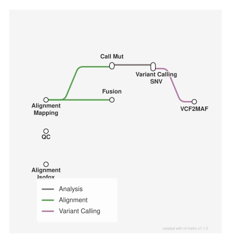

# Cancer genome & transcriptome analysis: WES/WGS/RNA somatic+germline+CNV+SV calling, MAF annotation, case report

<div class="ox-page-badges"><span class="ox-badge ox-badge--live">✔ Live-tested</span> <span class="ox-badge ox-badge--origin">⇄ Official port</span> <span class="ox-badge ox-badge--sn"><span class="dot"></span>snakemake port</span></div>

Port of zyllifeworld/clindet across all four run types: paired WES (default), tumor-only WES (unpaired), WGS, and RNA — 239 rules. Somatic SNV (Mutect2, VarDict, VarScan2, MuSE, HaplotypeCaller) + germline (Strelka2+Manta, CaVEMan); CNV subset (Control-FREEC, Sequenza, ExomeDepth, ASCAT); WGS SV (delly full chain incl. germ, svaba, Manta somaticSV); opt-in BQSR recalibration; vcf2maf/VEP MAF annotation, region flagging, cancer case report, MultiQC; RNA fusion/expression branch (arriba/TRUST4/isofox). Live-verified end to end on tx-ubuntu.

| | |
|---:|---|
| **Rating** | ✔ Live-tested |
| **Origin** | port |
| **Domain** | cancer genomics (WES) |
| **Rules** | 239 |
| **Compute** | up to 30 threads / 10 GB per rule |
| **Tools** | fastp · bwa (>=0.7.18) · samtools · gatk4 4.6.2.0 (container) · bcftools >=1.22 · bgzip · tabix · varscan 2.4.6 · vardict-java 1.8.3 (container) · muse 2.1.2 (container) · strelka2 · manta · caveman 1.15.3 (container) · vcf2maf 1.6.22 · ensembl-vep 114.2 · libboost 1.85.0 · multiqc · R >= 4.4 (knitr, data.table, gpgr via post-deploy) |
| **Ported** | 2026-08-15 |
| **License** | Apache-2.0 |
| **Source** | [zyllifeworld/clindet](https://github.com/zyllifeworld/clindet) |
| **Pinned version** | `582a9131` |

## Run it

```bash
oxo-flow run main.oxoflow
```

Needs clinical sequencing inputs — see Requirements.

## Installation

**Engine.** oxo-flow >= 0.12.0

**Toolchain.** conda envs (envs/*.yaml) + pinned Singularity/Docker containers for GATK, VarDict, MuSE, CaVEMan; VEP cache installed via the clindet_vep env post-deploy

**Requirements.**
- Reference data: genome FASTA + .fai + .dict, target BED, dbSNP / Mills indels / gnomAD VCFs (paths in [config])
- BWA index of the reference FASTA and tabix indexes for the annotation VCFs
- VEP cache (GRCh38, version 110) at the configured vep_data path
- Compute: up to 30 threads / 10 GB per rule

```bash
# 1. install oxo-flow (release binary, recommended)
curl -fL -o oxo-flow.tar.gz https://github.com/Traitome/oxo-flow/releases/latest/download/oxo-flow-latest-x86_64-unknown-linux-gnu.tar.gz
tar xzf oxo-flow.tar.gz && sudo mv oxo-flow /usr/local/bin/
#    or, via conda (may lag behind releases):
#    conda install -c bioconda oxo-flow-cli
#    NOTE: bioconda currently ships 0.10.2, older than the >= 0.12.0
#    minimum of every catalog entry — prefer the release binary.

# 2. get this workflow (clones the repo, auto-discovers the workflow,
#    sanity-parses it with the engine)
oxo-flow pull gh:WangLabCSU/oxo-flow-clindet
#    (alternative: plain git clone)
#    git clone https://github.com/WangLabCSU/oxo-flow-clindet
```

## Parameters

| Parameter | Default | Description | Used by |
|---:|---|---|---|
| `annotate_beds_file` | `` | BED tracks used by mutation_flag — name/path TSV mirroring upstream softwares_params[genome].annotate_beds dict (empty = header-only, no flags) | `make_region_bed_list` |
| `ascat_alleles_prefix` | `test/fixtures/cnv/ascat_alleles/` | — | `CNA_ASCAT` |
| `ascat_chroms` | `21` | — | `CNA_ASCAT` |
| `ascat_gc_file` | `test/fixtures/cnv/ascat_gc.txt` | — | `CNA_ASCAT` |
| `ascat_loci_prefix` | `test/fixtures/cnv/ascat_loci/` | — | `CNA_ASCAT` |
| `ascat_rt_file` | `` | — | `CNA_ASCAT` |
| `cnv_enabled` | `false` | CNV branch (upstream somatic_cnv_list; mini-test default = [] -> off). Set true to run the ported subset (freec/sequenza/exomedepth/ASCAT — purple/amber/cobalt/facets need the upstream's custom containers, see rules/80_cnv.oxoflow). | `ASCAT_EXTRACT_PURITYPLOIDY`, `CNA_ASCAT`, `CNA_exomedepth`, `all_cnv`, `freec_call_paired`, `freec_config`, `plot_freec`, `sequenza_bam2seqz`, `sequenza_call`, `sequenza_seqz_binning` |
| `dbsnp` | `test/fixtures/refs/annotations/dbsnp_146.hg38_chr21.vcf.gz` | — | — |
| `dbsnp_gz` | `test/fixtures/refs/annotations/dbsnp_146.hg38_chr21.vcf.gz` | MuSE sump needs a gzipped dbSNP | `muse_sump` |
| `dbsnp_indel` | `test/fixtures/refs/annotations/Mills_and_1000G_gold_standard.indels.hg38_chr21.vcf.gz` | — | — |
| `exomedepth_bed` | `test/fixtures/cnv/exomedepth_regions.bed` | — | `CNA_exomedepth` |
| `exomedepth_use_target_bed` | `true` | — | `CNA_exomedepth` |
| `flag_config_dir` | `test/fixtures/flag` | cgpFlagCaVEMan configs (bed-based flags dropped: no chr21 flag data) | `CM_flag` |
| `freec_chr_files` | `test/fixtures/cnv/freec_chr_fasta` | — | `freec_config` |
| `freec_chr_len_file` | `test/fixtures/cnv/freec_chrlen.txt` | — | `freec_config` |
| `freec_ini_template` | `scripts/config_exome.mini.ini` | — | `freec_config` |
| `freec_sambamba` | `sambamba` | — | `freec_config` |
| `genome_version` | `hg38_chr21` | — | `ASCAT_EXTRACT_PURITYPLOIDY`, `CM_call`, `CM_cnv`, `CM_flag`, `CM_germ_flag`, `CNA_ASCAT`, `CNA_exomedepth`, `M2_SNC`, `M2_ST`, `M2_contam`, `M2_filter`, `all`, `all_cnv`, `all_vcf`, `apply_base_quality_recalibration_normal`, `apply_base_quality_recalibration_tumor`, `bam_flagstat_normal`, `bam_flagstat_tumor`, `bed_to_interval_list`, `call_config_strelka`, `call_strelka_manta_germline`, `call_strelka_somatic_manta`, `call_variants_HaplotypeCaller`, `combined_multiqc`, `combined_multiqc_prep_multiqc_data`, `fastp_normal_sample`, `fastp_tumor_sample`, `flag_mutation_pairead_maf`, `freec_call_paired`, `freec_config`, `make_region_bed_list`, `map_reads_normal`, `map_reads_tumor`, `mark_duplicates_normal`, `mark_duplicates_tumor`, `merge_paired_germ_maf`, `merge_paired_maf`, `merge_paired_vcf`, `merge_strelka_manta`, `merge_strelka_somatic_manta`, `muse_call`, `muse_sump`, `mutect2`, `picard_collect_wes_normal`, `picard_collect_wes_tumor`, `plot_freec`, `prep_multiqc_data`, `recal_link_normal`, `recal_link_tumor`, `recalibrate_base_qualities_normal`, `recalibrate_base_qualities_tumor`, `run_cancer_report`, `sequenza_bam2seqz`, `sequenza_call`, `sequenza_seqz_binning`, `vardict_filter_somatic`, `vardict_paired_mode`, `varscan2_call`, `varscan2_merge_somatic`, `varscan2_mpileup`, `varscan2_processSomatic`, `varscan2_som_filter`, `vcf2maf_HaplotypeCaller`, `vcf2maf_Mutect2`, `vcf2maf_germ_caveman`, `vcf2maf_germ_strelkamanta`, `vcf2maf_muse`, `vcf2maf_vardict`, `vcf2maf_varscan2`, `vcf_norm_HaplotypeCaller`, `vcf_norm_Mutect2`, `vcf_norm_germline_caveman`, `vcf_norm_germline_strelkamanta`, `vcf_norm_muse`, `vcf_norm_vardict`, `vcf_norm_varscan2` |
| `germ_caller_list` | `'strelkamanta', 'caveman'` | — | — |
| `java_temp_dir` | `/tmp` | Java temp dir (upstream: config['params']['java']['temp_directory']) | `M2_SNC`, `M2_ST`, `M2_contam`, `M2_filter`, `apply_base_quality_recalibration_normal`, `apply_base_quality_recalibration_tumor`, `bed_to_interval_list`, `call_variants_HaplotypeCaller`, `mark_duplicates_normal`, `mark_duplicates_tumor`, `mutect2`, `picard_collect_wes_normal`, `picard_collect_wes_tumor`, `recalibrate_base_qualities_normal`, `recalibrate_base_qualities_tumor` |
| `known_sites1` | `test/fixtures/refs/annotations/known_sites1.mini.vcf.gz` | — | `recalibrate_base_qualities_normal`, `recalibrate_base_qualities_tumor` |
| `known_sites2` | `test/fixtures/refs/annotations/known_sites2.mini.vcf.gz` | — | `recalibrate_base_qualities_normal`, `recalibrate_base_qualities_tumor` |
| `mutect2_germline_vcf` | `test/fixtures/refs/annotations/gnomAD.r2.1.1.GRCh38.PASS.AC.AF.only_chr21.vcf.gz` | — | `mutect2` |
| `mutect2_vcf` | `test/fixtures/refs/annotations/gnomAD.r2.1.1.GRCh38.PASS.AC.AF.only_chr21.vcf.gz` | Mutect2 GetPileupSummaries sites + germline resource | `M2_SNC`, `M2_ST` |
| `ncbi_build` | `GRCh38` | vcf2maf / VEP (upstream: config['softwares_params'][genome_version]['vcf2maf']) | `vcf2maf_HaplotypeCaller`, `vcf2maf_Mutect2`, `vcf2maf_germ_caveman`, `vcf2maf_germ_strelkamanta`, `vcf2maf_muse`, `vcf2maf_vardict`, `vcf2maf_varscan2` |
| `normal_fastq_r1` | `test/fixtures/reads/mini-NC_R1.fq.gz` | — | `fastp_normal_sample` |
| `normal_fastq_r2` | `test/fixtures/reads/mini-NC_R2.fq.gz` | — | `fastp_normal_sample` |
| `output_dir` | `mini_test` | — | `ASCAT_EXTRACT_PURITYPLOIDY`, `CM_call`, `CM_cnv`, `CM_flag`, `CM_germ_flag`, `CNA_ASCAT`, `CNA_exomedepth`, `M2_SNC`, `M2_ST`, `M2_contam`, `M2_filter`, `all`, `all_cnv`, `all_vcf`, `apply_base_quality_recalibration_normal`, `apply_base_quality_recalibration_tumor`, `bam_flagstat_normal`, `bam_flagstat_tumor`, `bed_to_interval_list`, `call_config_strelka`, `call_strelka_manta_germline`, `call_strelka_somatic_manta`, `call_variants_HaplotypeCaller`, `combined_multiqc`, `combined_multiqc_prep_multiqc_data`, `fastp_normal_sample`, `fastp_tumor_sample`, `flag_mutation_pairead_maf`, `freec_call_paired`, `freec_config`, `make_region_bed_list`, `map_reads_normal`, `map_reads_tumor`, `mark_duplicates_normal`, `mark_duplicates_tumor`, `merge_paired_germ_maf`, `merge_paired_maf`, `merge_paired_vcf`, `merge_strelka_manta`, `merge_strelka_somatic_manta`, `muse_call`, `muse_sump`, `mutect2`, `picard_collect_wes_normal`, `picard_collect_wes_tumor`, `plot_freec`, `prep_multiqc_data`, `recal_link_normal`, `recal_link_tumor`, `recalibrate_base_qualities_normal`, `recalibrate_base_qualities_tumor`, `run_cancer_report`, `sequenza_bam2seqz`, `sequenza_call`, `sequenza_seqz_binning`, `vardict_filter_somatic`, `vardict_paired_mode`, `varscan2_call`, `varscan2_merge_somatic`, `varscan2_mpileup`, `varscan2_processSomatic`, `varscan2_som_filter`, `vcf2maf_HaplotypeCaller`, `vcf2maf_Mutect2`, `vcf2maf_germ_caveman`, `vcf2maf_germ_strelkamanta`, `vcf2maf_muse`, `vcf2maf_vardict`, `vcf2maf_varscan2`, `vcf_norm_HaplotypeCaller`, `vcf_norm_Mutect2`, `vcf_norm_germline_caveman`, `vcf_norm_germline_strelkamanta`, `vcf_norm_muse`, `vcf_norm_vardict`, `vcf_norm_varscan2` |
| `pair_ids` | `'mini'` | Engine-injected list of pair ids (used by expand_inputs gather rules) | — |
| `recal_bqsr` | `false` | BQSR (upstream config['project']['recal_BQSR'] + resources['varanno'][genome]): recal_bqsr = false is the upstream mini-test default (recal_link symlinks the dedup BAM); set true to run BaseRecalibrator + ApplyBQSR instead. | `apply_base_quality_recalibration_normal`, `apply_base_quality_recalibration_tumor`, `recal_link_normal`, `recal_link_tumor`, `recalibrate_base_qualities_normal`, `recalibrate_base_qualities_tumor` |
| `reference` | `test/fixtures/refs/sequence/Homo_sapiens_assembly38_chr21.fasta` | Resources (upstream: config['resources'][genome_version]) | `CM_call`, `CM_flag`, `CNA_exomedepth`, `M2_SNC`, `M2_ST`, `M2_filter`, `apply_base_quality_recalibration_normal`, `apply_base_quality_recalibration_tumor`, `call_config_strelka`, `call_strelka_manta_germline`, `call_strelka_somatic_manta`, `call_variants_HaplotypeCaller`, `freec_config`, `map_reads_normal`, `map_reads_tumor`, `muse_call`, `mutect2`, `picard_collect_wes_normal`, `picard_collect_wes_tumor`, `recalibrate_base_qualities_normal`, `recalibrate_base_qualities_tumor`, `sequenza_bam2seqz`, `vardict_paired_mode`, `varscan2_call`, `varscan2_mpileup`, `vcf2maf_HaplotypeCaller`, `vcf2maf_Mutect2`, `vcf2maf_germ_caveman`, `vcf2maf_germ_strelkamanta`, `vcf2maf_muse`, `vcf2maf_vardict`, `vcf2maf_varscan2`, `vcf_norm_HaplotypeCaller`, `vcf_norm_Mutect2`, `vcf_norm_germline_caveman`, `vcf_norm_germline_strelkamanta`, `vcf_norm_muse`, `vcf_norm_vardict`, `vcf_norm_varscan2` |
| `reference_dict` | `test/fixtures/refs/sequence/Homo_sapiens_assembly38_chr21.dict` | — | `bed_to_interval_list` |
| `run_report` | `true` | Report stages (upstream `stages`): case_report + multiqc are ON in the port default; set run_report = false to match the upstream mini-test default. | `combined_multiqc`, `combined_multiqc_prep_multiqc_data`, `prep_multiqc_data`, `run_cancer_report` |
| `sequenza_gc_wiggle` | `test/fixtures/cnv/sequenza_gc.wig` | — | `sequenza_bam2seqz` |
| `somatic_caller_list` | `'HaplotypeCaller', 'vardict', 'varscan2', 'muse', 'Mutect2'` | Caller lists (upstream run_params) | — |
| `target_bed` | `test/fixtures/bed/exome_target_hg38_chr21.bed` | — | `M2_SNC`, `M2_ST`, `M2_filter`, `bed_to_interval_list`, `call_config_strelka`, `call_strelka_manta_germline`, `call_strelka_somatic_manta`, `call_variants_HaplotypeCaller`, `freec_config`, `muse_call`, `mutect2`, `vardict_paired_mode`, `varscan2_call`, `varscan2_mpileup` |
| `tumor_fastq_r1` | `test/fixtures/reads/mini-T_R1.fq.gz` | Reads (upstream samplesheet columns Tumor_R1_file_path / Normal_R1_file_path ...) | `fastp_tumor_sample` |
| `tumor_fastq_r2` | `test/fixtures/reads/mini-T_R2.fq.gz` | — | `fastp_tumor_sample` |
| `vep_cache_ready` | `false` | VEP needs a local cache at {vep_data}/{vep_species} (~10GB download; the fixture kit does not ship it). The vcf2maf rules and the downstream MAF merge/flag/cancer-report tail gate on this flag — set true once the cache is in place (upstream fails hard without it). | `all`, `flag_mutation_pairead_maf`, `merge_paired_germ_maf`, `merge_paired_maf`, `run_cancer_report`, `vcf2maf_HaplotypeCaller`, `vcf2maf_Mutect2`, `vcf2maf_germ_caveman`, `vcf2maf_germ_strelkamanta`, `vcf2maf_muse`, `vcf2maf_vardict`, `vcf2maf_varscan2` |
| `vep_cache_version` | `110` | — | `vcf2maf_HaplotypeCaller`, `vcf2maf_Mutect2`, `vcf2maf_germ_caveman`, `vcf2maf_germ_strelkamanta`, `vcf2maf_muse`, `vcf2maf_vardict`, `vcf2maf_varscan2` |
| `vep_data` | `resources/ref_genome/hg38/vep` | — | `vcf2maf_HaplotypeCaller`, `vcf2maf_Mutect2`, `vcf2maf_germ_caveman`, `vcf2maf_germ_strelkamanta`, `vcf2maf_muse`, `vcf2maf_vardict`, `vcf2maf_varscan2` |
| `vep_species` | `homo_sapiens` | — | `vcf2maf_HaplotypeCaller`, `vcf2maf_Mutect2`, `vcf2maf_germ_caveman`, `vcf2maf_germ_strelkamanta`, `vcf2maf_muse`, `vcf2maf_vardict`, `vcf2maf_varscan2` |
| `wes_pon` | `` | Upstream hg38_chr21 has no panel of normals (WES_PON: null) — leave empty | `mutect2` |
| `wgs_mode` | `false` | run-type switch: WES rules (CollectHsMetrics etc.) gate on !wgs_mode; the WGS workflow sets true and runs CollectWgsMetrics instead | `bed_to_interval_list`, `picard_collect_wes_normal`, `picard_collect_wes_tumor` |

Descriptions are the workflow's own `#` comments from its `[config]` section, surfaced by `oxo-flow info` — no schema file to maintain.

## Workflow graph

<div class="ox-dag-card" markdown="1">


</div>
<div class="ox-dag-card" markdown="1">



</div>
<div class="ox-dag-card" markdown="1">


</div>
<div class="ox-dag-card" markdown="1">


</div>

The graph is derived at catalog-build time from `oxo-flow graph -f dot` and rendered with Graphviz. It shows the workflow at rule level: wildcard `{sample}` instances expand at run time when sample data is discovered (the runtime view is `oxo-flow graph --expanded`).

## Scope

The default-parameters main path of the source pipeline was ported rule-for-rule; alternate paths are documented as excluded.

**In scope**

- paired WES (main.oxoflow, 76 rules): fastp QC, bwa+GATK mapping/markdup, opt-in BQSR, 5 somatic SNV callers + Strelka2/Manta/CaVEMan germline, vcf2maf/VEP MAF, region flagging, cancer report, MultiQC
- tumor-only WES (main_unpaired.oxoflow, 32 rules): 7 tumor-only callers (Mutect2/VarDict/VarScan2/MuSE/HaplotypeCaller/Strelka+Manta/freebayes), merge + MAF
- WGS (main_wgs.oxoflow, 90 rules): WGS metrics, the paired WES callers with WGS config, delly SV chain (call/filter/to_vcf/germ/delly2bnd), svaba, Manta somaticSV
- RNA (main_rna.oxoflow, 41 rules): arriba/TRUST4/isofox fusion + expression (live-verified previously)
- CNV (paired WES, cnv_enabled gate): freec_config/call/plot (Control-FREEC), sequenza bam2seqz/binning/call, ExomeDepth, ASCAT + purity/ploidy extraction
- Non-human reference parity: GRCh37/38 + non-human config keys

**Excluded**

- CNV: purple/amber/cobalt/FACETS — Broad/Illumina licensed pipelines + heavy Sanger reference trees (the conda-portable subset freec/sequenza/exomedepth/ASCAT IS ported and live-verified)
- SV: gridss/BRASS/linx/igcaller/jasmine — upstream custom containers (dellytools/delly, brass, linx) or hardcoded local software paths (/public/ClinicalExam/...); delly/svaba/Manta ARE ported
- sansa-annotation (SV_sansa_*) + svaba svanno — gated on an upstream sansa config absent from the mini test
- telomerecat — marked 'departed' upstream
- ASCATsc (BRASS input chain) + multi-lane/multi-sample cohort merges — WES-default-path-specific

## Fidelity

| Upstream process/rule | oxo-flow rule | Tool (version) | Notes |
|---|---|---|---|
| fastp (T/N) | `fastp_tumor_sample` / `fastp_normal_sample` | fastp | identical flags (`-w 8 -Q -c -L`) |
| bam flagstat (T/N) | `bam_flagstat_tumor` / `bam_flagstat_normal` | samtools | identical command |
| map_reads (T/N) | `map_reads_tumor` / `map_reads_normal` | bwa >=0.7.18, samtools | `bwa mem -MR` + `fixmate` + `sort` |
| mark_duplicates (T/N) | `mark_duplicates_tumor` / `mark_duplicates_normal` | gatk4 4.6.2.0 (container) | `MarkDuplicates --CREATE_INDEX true`, `VALIDATION_STRINGENCY SILENT` |
| recal_link (T/N) | `recal_link_tumor` / `recal_link_normal` | ln -s | BQSR off (upstream mini-test default) |
| bed_to_interval_list | `bed_to_interval_list` | gatk4 (container) | `BedToIntervalList --SORT true` |
| picard_collect_wes (T/N) | `picard_collect_wes_tumor` / `picard_collect_wes_normal` | gatk4 (container) | `CollectHsMetrics` |
| call_variants_HaplotypeCaller | `call_variants_HaplotypeCaller` | gatk4 (container) | identical `-A` annotation flags |
| vardict_paired_mode | `vardict_paired_mode` | vardict-java 1.8.3 (container) | `vardict-java` + `testsomatic.R` + `var2vcf_paired.pl` |
| vardict_filter_somatic | `vardict_filter_somatic` | bcftools >=1.22 | StrongSomatic/LikelySomatic + `SSF <= 0.05` |
| varscan2 mpileup/call/processSomatic/filter | `varscan2_mpileup` … `merge_somatic` | varscan 2.4.6, samtools, bcftools | `--strand-filter 1`, `--output-vcf 1`, concat chain |
| muse_call / muse_sump | `muse_call` / `muse_sump` | muse 2.1.2 (container) | `sump -E -n {threads} -D {dbsnp_gz}` |
| mutect2 chain | `M2_ST`/`M2_SNC`/`M2_contam`/`mutect2`/`M2_filter` | gatk4 (container) | `-pon` only when `wes_pon` set (upstream hg38_chr21 has none) |
| call_config_strelka | `call_config_strelka` | manta | `configManta.py --exome --callRegions` |
| call_strelka_manta_germline | `call_strelka_manta_germline` | strelka2, manta | `configureStrelkaGermlineWorkflow` + `runWorkflow.py` |
| merge_strelka_manta | `merge_strelka_manta` | bcftools | upstream `{params.indel}` bug fixed (single concat+sort) |
| strelka somatic (via manta) | `call_strelka_somatic_manta` + `merge_strelka_somatic_manta` | strelka2, manta, bcftools | same pipeline on somatic config |
| CM_cnv | `CM_cnv` | touch | empty tumour/normal CNV beds (upstream default) |
| CM_call / CM_flag | `CM_call` / `CM_flag` | caveman 1.15.3 (container) | `-td 2 -nd 2 -seqType WGS -no-flagging`, flag with `-umv .` |
| CM_germ_flag | `CM_germ_flag` | bcftools | `-e 'DP<=30' -s LowDP --mode x` |
| vcf_norm (per caller) | `vcf_norm_{Mutect2,vardict,varscan2,muse,HaplotypeCaller,germline_strelkamanta,germline_caveman}` | bcftools >=1.22 | verbatim per-caller FILTER rules incl. vardict contig-header branch |
| loop_vcf2maf_paired | `vcf2maf_{Mutect2,vardict,varscan2,muse,HaplotypeCaller}` | vcf2maf 1.6.22, ensembl-vep 114.2 | verbatim tumor/normal IDs per `get_vcf_name` |
| loop_vcf2maf_germ_paired | `vcf2maf_germ_strelkamanta` / `vcf2maf_germ_caveman` | vcf2maf 1.6.22 | TUMOUR/NORMAL for CaVEMan |
| merge_loop (somatic) | `merge_paired_maf` | merge_maf.R (verbatim) | driven via scripts/smk.R shim |
| merge_loop_germline | `merge_paired_germ_maf` | merge_maf.R (verbatim) | |
| make_region_bed_list + flag_mutation_pairead_maf | `make_region_bed_list` + `flag_mutation_pairead_maf` | flag_mutation_maf.R (verbatim) | empty bed_list = header-only TSV |
| run_cancer_report | `run_cancer_report` | R >=4.4 (knitr, gpgr via post-deploy) | only MAF/panel/Rmd params; CNV/QC params unset (NULL) as in upstream default path |
| combined_multiqc | `prep_multiqc_data` + `combined_multiqc_prep_multiqc_data` + `combined_multiqc` | multiqc | conpair/purple inputs out of scope |

**Not ported** (upstream branches, with reasons): CNV purple/amber/cobalt/FACETS (Broad/Illumina licensed); SV gridss/BRASS/linx/igcaller/jasmine (custom containers or hardcoded local software paths); sansa-annotation + svaba svanno (sansa config absent); telomerecat (departed upstream). Everything else is ported: CNV portable subset (freec/sequenza/exomedepth/ASCAT), WGS SV subset (delly/svaba/Manta), unpaired mode, RNA branch, BQSR stage — see the main_unpaired/main_wgs/main_rna workflows and rules/{70_unpaired,80_cnv,90_wgs,91_wgs_callers}.

## Links

- Repository: [oxo-flow-clindet](https://github.com/WangLabCSU/oxo-flow-clindet)
- Upstream: [zyllifeworld/clindet](https://github.com/zyllifeworld/clindet) @ `582a9131`
- License: Apache-2.0 (this workflow) · MIT (upstream)

Created on 2026-08-15 — this port may lag behind upstream releases. See the repository's NOTICE for full attribution.
