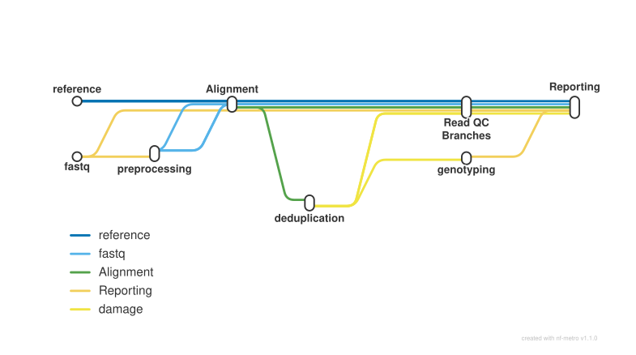

<div class="ox-crumb"><a href="/pipelines/">Pipelines</a> / <span>oxo-flow-eager</span></div>
<div class="ox-detail-cols">
<div>
<h1>Ancient DNA (aDNA): QC, mapping, damage estimation and genotyping</h1>
<div class="ox-page-badges"><span class="ox-badge ox-badge--live">✔ Live-tested</span> <span class="ox-badge ox-badge--origin">⇄ Official port</span> <span class="ox-badge ox-badge--nf"><span class="dot"></span>nf-core port</span></div>
<p>Ancient DNA (aDNA) analysis in one run: FastQC raw QC, optional fastp poly-G filtering (2-colour chemistry), AdapterRemoval adapter clipping and paired-end read merging, BWA aln mapping with ancient-DNA parameters, picard MarkDuplicates (or DeDup) deduplication, preseq library-complexity curves, DamageProfiler damage estimation, Qualimap BAM QC, optional pileupCaller genotyping with eigenstrat SNP coverage, optional metagenomic screening of the unmapped reads (bbduk entropy complexity filter, MALT or kraken2 classification with kraken_parse/kraken_merge tables, MaltExtract aDNA evaluation), and a final MultiQC report — every rule pinned to the nf-core/eager 2.5.3 tool versions in the upstream container (MALT 0.61 and HOPs 0.35 ship in the pinned nfcore/eager:2.5.3 image).</p>
</div>
<div>
<div class="ox-glance">
<div class="ox-glance-title">At a glance</div>
<div class="ox-kv"><span class="k">Rating</span><span class="v live">✔ Live-tested</span></div>
<div class="ox-kv"><span class="k">Rules</span><span class="v">57</span></div>
<div class="ox-kv"><span class="k">Compute</span><span class="v">up to 4 CPUs / 8 GB per rule (bwa_aln)</span></div>
<div class="ox-kv"><span class="k">Engine</span><span class="v"><span class="ox-badge ox-badge--nf"><span class="dot"></span>nf-core port</span></span></div>
<div class="ox-kv"><span class="k">Origin</span><span class="v">⇄ Official port</span></div>
<div class="ox-kv"><span class="k">Domain</span><span class="v">genomics</span></div>
<div class="ox-kv"><span class="k">Source</span><span class="v"><a href="https://github.com/nf-core/eager">nf-core/eager</a></span></div>
<div class="ox-kv"><span class="k">Pinned version</span><span class="v"><code>2.5.3</code></span></div>
<div class="ox-kv"><span class="k">Ported</span><span class="v">2026-08-15</span></div>
<div class="ox-kv"><span class="k">License</span><span class="v">Apache-2.0</span></div>
<p class="cmd">$ oxo-flow run main.oxoflow</p>
</div>
</div>
</div>

## Run it

```bash
oxo-flow run main.oxoflow
```

Needs reference genome and reads — see Requirements.

## Installation

**Engine.** oxo-flow >= 0.12.0 (the gated multi-lane mode — run_lanemerge=true — additionally requires oxo-flow >= 0.16.0 with input_groups support, Traitome/oxo-flow#231; on older engines the gate is inert and the default single-pair path is unchanged)

**Toolchain.** containers (Docker/Singularity) — pinned image nfcore/eager:2.5.3 for all rules (bundles the pinned conda env from envs/eager.yaml)

**Requirements.**

- reference genome FASTA, plain and uncompressed (.gz references are not supported — upstream's unzip_reference step is not ported); the workflow builds the .fai / .dict / BWA indices itself
- paired-end FASTQ pairs named <sample>_R1.fastq.gz / <sample>_R2.fastq.gz in a directory (directory input mode; sample = text before the _R1/_R2 suffix); single-end is not supported
- optional — multi-lane input: name the pairs <sample>_L<lane>_R1.fastq.gz / _R2.fastq.gz (lane-tagged, as in upstream's TSV mode) and set run_lanemerge=true: the lanemerge rules concatenate the per-lane pairs of each sample into one merged pair (results/lanemerging/) that feeds AdapterRemoval and hostremoval_input_fastq; samples without lane-tagged files keep using the default-named pair. Requires oxo-flow >= 0.16.0 (input_groups, Traitome/oxo-flow#231)
- optional — pileupCaller genotyping (run_genotyping=true genotyping_tool='pileupcaller') requires pileupcaller_snpfile and pileupcaller_bedfile; the rule fails fast without them
- optional — metagenomic screening (run_metagenomic_screening=true, bam_unmapped_type='fastq') requires metagenomic_tool='kraken' with a kraken2_db (kraken2 database directory or .tar.gz bundle, unpacked by the kraken rule) or metagenomic_tool='malt' with a malt_db (MALT database directory); maltextract additionally requires maltextract_taxon_list and maltextract_ncbifiles. The chain is validate/dry-run-tested but not yet live-verified
- compute: up to 4 CPUs / 8 GB RAM per rule (bwa_aln: 4 threads / 8G; kraken: 4 threads / 8G — upstream's mc_huge label is 32 cpus / 256 GB, tune via CLI overrides; reference-index and MultiQC rules up to 8 GB; base default 1 CPU / 7 GB / 24 h)
- Docker or Singularity to run the pinned container nfcore/eager:2.5.3 (not needed for validate / lint / dry-run)
- disk: results/ holds reference indices, mapped BAMs and reports — size grows with the reference genome and number of samples

```bash
# 1. install oxo-flow (release binary, recommended)
curl -fL -o oxo-flow.tar.gz https://github.com/Traitome/oxo-flow/releases/latest/download/oxo-flow-latest-x86_64-unknown-linux-gnu.tar.gz
tar xzf oxo-flow.tar.gz && sudo mv oxo-flow /usr/local/bin/
#    or, via conda (may lag behind releases):
#    conda install -c bioconda oxo-flow-cli
#    NOTE: bioconda currently ships 0.10.2, older than the >= 0.12.0
#    minimum of every catalog entry — prefer the release binary.

# 2. get this workflow (clones the repo, auto-discovers the workflow,
#    sanity-parses it with the engine)
oxo-flow pull gh:oxo-flow-community/oxo-flow-eager
#    (alternative: plain git clone)
#    git clone https://github.com/oxo-flow-community/oxo-flow-eager
```

## Parameters

<div class="ox-params">
<div class="ox-param">
<div class="ox-param-head"><code>angsd_fasta_arg</code><span class="ox-param-default"></span></div>
<p class="ox-param-desc">—</p>
<details class="ox-param-usedby"><summary>used by 1 rules</summary>
<div class="ox-param-rules"><code>genotyping_angsd</code></div>
</details>
</div>
<div class="ox-param">
<div class="ox-param-head"><code>angsd_glformat</code><span class="ox-param-default">4</span></div>
<p class="ox-param-desc">—</p>
<details class="ox-param-usedby"><summary>used by 1 rules</summary>
<div class="ox-param-rules"><code>genotyping_angsd</code></div>
</details>
</div>
<div class="ox-param">
<div class="ox-param-head"><code>angsd_glmodel</code><span class="ox-param-default">1</span></div>
<p class="ox-param-desc">—</p>
<details class="ox-param-usedby"><summary>used by 1 rules</summary>
<div class="ox-param-rules"><code>genotyping_angsd</code></div>
</details>
</div>
<div class="ox-param">
<div class="ox-param-head"><code>angsd_majorminor_arg</code><span class="ox-param-default"></span></div>
<p class="ox-param-desc">—</p>
<details class="ox-param-usedby"><summary>used by 1 rules</summary>
<div class="ox-param-rules"><code>genotyping_angsd</code></div>
</details>
</div>
<div class="ox-param">
<div class="ox-param-head"><code>anno_file</code><span class="ox-param-default"></span></div>
<p class="ox-param-desc">—</p>
<details class="ox-param-usedby"><summary>used by 1 rules</summary>
<div class="ox-param-rules"><code>bedtools_coverage</code></div>
</details>
</div>
<div class="ox-param">
<div class="ox-param-head"><code>anno_file_is_unsorted_neg</code><span class="ox-param-default">-sorted</span></div>
<p class="ox-param-desc">—</p>
<details class="ox-param-usedby"><summary>used by 1 rules</summary>
<div class="ox-param-rules"><code>bedtools_coverage</code></div>
</details>
</div>
<div class="ox-param">
<div class="ox-param-head"><code>bam_input</code><span class="ox-param-default">false</span></div>
<p class="ox-param-desc">—</p>
<details class="ox-param-usedby"><summary>used by 1 rules</summary>
<div class="ox-param-rules"><code>convert_bam</code></div>
</details>
</div>
<div class="ox-param">
<div class="ox-param-head"><code>bam_mapping_quality_threshold</code><span class="ox-param-default">0</span></div>
<p class="ox-param-desc">—</p>
<details class="ox-param-usedby"><summary>used by 4 rules</summary>
<div class="ox-param-rules"><code>samtools_filter_bowtie2</code> <code>samtools_filter_bwaaln</code> <code>samtools_filter_bwamem</code> <code>samtools_filter_circularmapper</code></div>
</details>
</div>
<div class="ox-param">
<div class="ox-param-head"><code>bam_unmapped_type</code><span class="ox-param-default">discard</span></div>
<p class="ox-param-desc">—</p>
<details class="ox-param-usedby"><summary>used by 9 rules</summary>
<div class="ox-param-rules"><code>kraken</code> <code>kraken_merge</code> <code>kraken_parse</code> <code>malt</code> <code>metagenomic_complexity_filter</code> <code>samtools_filter_bowtie2</code> <code>samtools_filter_bwaaln</code> <code>samtools_filter_bwamem</code> <code>samtools_filter_circularmapper</code></div>
</details>
</div>
<div class="ox-param">
<div class="ox-param-head"><code>bamutils_clip_double_stranded_none_udg_left</code><span class="ox-param-default">1</span></div>
<p class="ox-param-desc">—</p>
<details class="ox-param-usedby"><summary>used by 1 rules</summary>
<div class="ox-param-rules"><code>bam_trim</code></div>
</details>
</div>
<div class="ox-param">
<div class="ox-param-head"><code>bamutils_clip_double_stranded_none_udg_right</code><span class="ox-param-default">1</span></div>
<p class="ox-param-desc">—</p>
<details class="ox-param-usedby"><summary>used by 1 rules</summary>
<div class="ox-param-rules"><code>bam_trim</code></div>
</details>
</div>
<div class="ox-param">
<div class="ox-param-head"><code>bamutils_softclip_arg</code><span class="ox-param-default"></span></div>
<p class="ox-param-desc">—</p>
<details class="ox-param-usedby"><summary>used by 1 rules</summary>
<div class="ox-param-rules"><code>bam_trim</code></div>
</details>
</div>
<div class="ox-param">
<div class="ox-param-head"><code>bcftools_stats_source</code><span class="ox-param-default">haplotypecaller</span></div>
<p class="ox-param-desc">—</p>
<details class="ox-param-usedby"><summary>used by 1 rules</summary>
<div class="ox-param-rules"><code>bcftools_stats</code></div>
</details>
</div>
<div class="ox-param">
<div class="ox-param-head"><code>bt2_preset</code><span class="ox-param-default"></span></div>
<p class="ox-param-desc">—</p>
<details class="ox-param-usedby"><summary>used by 1 rules</summary>
<div class="ox-param-rules"><code>bowtie2</code></div>
</details>
</div>
<div class="ox-param">
<div class="ox-param-head"><code>bwaalnk</code><span class="ox-param-default">2</span></div>
<p class="ox-param-desc">—</p>
<details class="ox-param-usedby"><summary>used by 2 rules</summary>
<div class="ox-param-rules"><code>bwa_aln</code> <code>circularmapper</code></div>
</details>
</div>
<div class="ox-param">
<div class="ox-param-head"><code>bwaalnl</code><span class="ox-param-default">1024</span></div>
<p class="ox-param-desc">—</p>
<details class="ox-param-usedby"><summary>used by 2 rules</summary>
<div class="ox-param-rules"><code>bwa_aln</code> <code>circularmapper</code></div>
</details>
</div>
<div class="ox-param">
<div class="ox-param-head"><code>bwaalnn</code><span class="ox-param-default">0.01</span></div>
<p class="ox-param-desc">—</p>
<details class="ox-param-usedby"><summary>used by 2 rules</summary>
<div class="ox-param-rules"><code>bwa_aln</code> <code>circularmapper</code></div>
</details>
</div>
<div class="ox-param">
<div class="ox-param-head"><code>bwaalno</code><span class="ox-param-default">2</span></div>
<p class="ox-param-desc">—</p>
<details class="ox-param-usedby"><summary>used by 1 rules</summary>
<div class="ox-param-rules"><code>bwa_aln</code></div>
</details>
</div>
<div class="ox-param">
<div class="ox-param-head"><code>circularextension</code><span class="ox-param-default">100</span></div>
<p class="ox-param-desc">—</p>
<details class="ox-param-usedby"><summary>used by 2 rules</summary>
<div class="ox-param-rules"><code>circulargenerator</code> <code>circularmapper</code></div>
</details>
</div>
<div class="ox-param">
<div class="ox-param-head"><code>circularfilter_arg</code><span class="ox-param-default"></span></div>
<p class="ox-param-desc">—</p>
<details class="ox-param-usedby"><summary>used by 1 rules</summary>
<div class="ox-param-rules"><code>circularmapper</code></div>
</details>
</div>
<div class="ox-param">
<div class="ox-param-head"><code>circulartarget</code><span class="ox-param-default">chrMT</span></div>
<p class="ox-param-desc">—</p>
<details class="ox-param-usedby"><summary>used by 1 rules</summary>
<div class="ox-param-rules"><code>circulargenerator</code></div>
</details>
</div>
<div class="ox-param">
<div class="ox-param-head"><code>clip_forward_adaptor</code><span class="ox-param-default">AGATCGGAAGAGCACACGTCTGAACTCCAGTCAC</span></div>
<p class="ox-param-desc">read clipping / merging</p>
<details class="ox-param-usedby"><summary>used by 1 rules</summary>
<div class="ox-param-rules"><code>adapter_removal</code></div>
</details>
</div>
<div class="ox-param">
<div class="ox-param-head"><code>clip_min_read_quality</code><span class="ox-param-default">20</span></div>
<p class="ox-param-desc">—</p>
<details class="ox-param-usedby"><summary>used by 1 rules</summary>
<div class="ox-param-rules"><code>adapter_removal</code></div>
</details>
</div>
<div class="ox-param">
<div class="ox-param-head"><code>clip_readlength</code><span class="ox-param-default">30</span></div>
<p class="ox-param-desc">—</p>
<details class="ox-param-usedby"><summary>used by 1 rules</summary>
<div class="ox-param-rules"><code>adapter_removal</code></div>
</details>
</div>
<div class="ox-param">
<div class="ox-param-head"><code>clip_reverse_adaptor</code><span class="ox-param-default">AGATCGGAAGAGCGTCGTGTAGGGAAAGAGTGTA</span></div>
<p class="ox-param-desc">—</p>
<details class="ox-param-usedby"><summary>used by 1 rules</summary>
<div class="ox-param-rules"><code>adapter_removal</code></div>
</details>
</div>
<div class="ox-param">
<div class="ox-param-head"><code>colour_chemistry</code><span class="ox-param-default">4</span></div>
<p class="ox-param-desc">—</p>
<details class="ox-param-usedby"><summary>used by 1 rules</summary>
<div class="ox-param-rules"><code>fastp</code></div>
</details>
</div>
<div class="ox-param">
<div class="ox-param-head"><code>complexity_filter_poly_g</code><span class="ox-param-default">false</span></div>
<p class="ox-param-desc">complexity (poly-G) filter</p>
<details class="ox-param-usedby"><summary>used by 1 rules</summary>
<div class="ox-param-rules"><code>fastp</code></div>
</details>
</div>
<div class="ox-param">
<div class="ox-param-head"><code>complexity_filter_poly_g_min</code><span class="ox-param-default">10</span></div>
<p class="ox-param-desc">—</p>
<details class="ox-param-usedby"><summary>used by 1 rules</summary>
<div class="ox-param-rules"><code>fastp</code></div>
</details>
</div>
<div class="ox-param">
<div class="ox-param-head"><code>damage_calculation_tool</code><span class="ox-param-default">damageprofiler</span></div>
<p class="ox-param-desc">damage estimation</p>
<details class="ox-param-usedby"><summary>used by 2 rules</summary>
<div class="ox-param-rules"><code>damageprofiler</code> <code>mapdamage_calculation</code></div>
</details>
</div>
<div class="ox-param">
<div class="ox-param-head"><code>damageprofiler_length</code><span class="ox-param-default">100</span></div>
<p class="ox-param-desc">—</p>
<details class="ox-param-usedby"><summary>used by 1 rules</summary>
<div class="ox-param-rules"><code>damageprofiler</code></div>
</details>
</div>
<div class="ox-param">
<div class="ox-param-head"><code>damageprofiler_threshold</code><span class="ox-param-default">15</span></div>
<p class="ox-param-desc">—</p>
<details class="ox-param-usedby"><summary>used by 1 rules</summary>
<div class="ox-param-rules"><code>damageprofiler</code></div>
</details>
</div>
<div class="ox-param">
<div class="ox-param-head"><code>damageprofiler_yaxis</code><span class="ox-param-default">0.30</span></div>
<p class="ox-param-desc">—</p>
<details class="ox-param-usedby"><summary>used by 1 rules</summary>
<div class="ox-param-rules"><code>damageprofiler</code></div>
</details>
</div>
<div class="ox-param">
<div class="ox-param-head"><code>dedup_all_merged</code><span class="ox-param-default">false</span></div>
<p class="ox-param-desc">—</p>
<details class="ox-param-usedby"><summary>not referenced by any rule</summary>
<div class="ox-param-rules">—</div>
</details>
</div>
<div class="ox-param">
<div class="ox-param-head"><code>dedupper</code><span class="ox-param-default">markduplicates</span></div>
<p class="ox-param-desc">deduplication</p>
<details class="ox-param-usedby"><summary>used by 2 rules</summary>
<div class="ox-param-rules"><code>dedup</code> <code>markduplicates</code></div>
</details>
</div>
<div class="ox-param">
<div class="ox-param-head"><code>fasta</code><span class="ox-param-default">test/fixtures/reference/genome.fa</span></div>
<p class="ox-param-desc">input / library metadata (directory-input mode defaults)</p>
<details class="ox-param-usedby"><summary>used by 4 rules</summary>
<div class="ox-param-rules"><code>make_bwa_index</code> <code>make_fasta_index</code> <code>make_seq_dict</code> <code>unzip_reference</code></div>
</details>
</div>
<div class="ox-param">
<div class="ox-param-head"><code>freebayes_C</code><span class="ox-param-default">2</span></div>
<p class="ox-param-desc">—</p>
<details class="ox-param-usedby"><summary>used by 1 rules</summary>
<div class="ox-param-rules"><code>genotyping_freebayes</code></div>
</details>
</div>
<div class="ox-param">
<div class="ox-param-head"><code>freebayes_g_arg</code><span class="ox-param-default"></span></div>
<p class="ox-param-desc">—</p>
<details class="ox-param-usedby"><summary>used by 1 rules</summary>
<div class="ox-param-rules"><code>genotyping_freebayes</code></div>
</details>
</div>
<div class="ox-param">
<div class="ox-param-head"><code>freebayes_p</code><span class="ox-param-default">1</span></div>
<p class="ox-param-desc">—</p>
<details class="ox-param-usedby"><summary>used by 1 rules</summary>
<div class="ox-param-rules"><code>genotyping_freebayes</code></div>
</details>
</div>
<div class="ox-param">
<div class="ox-param-head"><code>gatk_call_conf</code><span class="ox-param-default">30</span></div>
<p class="ox-param-desc">—</p>
<details class="ox-param-usedby"><summary>used by 2 rules</summary>
<div class="ox-param-rules"><code>genotyping_hc</code> <code>genotyping_ug</code></div>
</details>
</div>
<div class="ox-param">
<div class="ox-param-head"><code>gatk_downsample</code><span class="ox-param-default">250</span></div>
<p class="ox-param-desc">—</p>
<details class="ox-param-usedby"><summary>used by 1 rules</summary>
<div class="ox-param-rules"><code>genotyping_ug</code></div>
</details>
</div>
<div class="ox-param">
<div class="ox-param-head"><code>gatk_hc_emitrefconf</code><span class="ox-param-default">NONE</span></div>
<p class="ox-param-desc">—</p>
<details class="ox-param-usedby"><summary>used by 1 rules</summary>
<div class="ox-param-rules"><code>genotyping_hc</code></div>
</details>
</div>
<div class="ox-param">
<div class="ox-param-head"><code>gatk_hc_out_mode</code><span class="ox-param-default">EMIT_VARIANTS_ONLY</span></div>
<p class="ox-param-desc">—</p>
<details class="ox-param-usedby"><summary>used by 1 rules</summary>
<div class="ox-param-rules"><code>genotyping_hc</code></div>
</details>
</div>
<div class="ox-param">
<div class="ox-param-head"><code>gatk_ploidy</code><span class="ox-param-default">2</span></div>
<p class="ox-param-desc">—</p>
<details class="ox-param-usedby"><summary>used by 2 rules</summary>
<div class="ox-param-rules"><code>genotyping_hc</code> <code>genotyping_ug</code></div>
</details>
</div>
<div class="ox-param">
<div class="ox-param-head"><code>gatk_ug_defaultbasequalities_arg</code><span class="ox-param-default"></span></div>
<p class="ox-param-desc">—</p>
<details class="ox-param-usedby"><summary>used by 1 rules</summary>
<div class="ox-param-rules"><code>genotyping_ug</code></div>
</details>
</div>
<div class="ox-param">
<div class="ox-param-head"><code>gatk_ug_genotype_model</code><span class="ox-param-default">SNP</span></div>
<p class="ox-param-desc">—</p>
<details class="ox-param-usedby"><summary>used by 1 rules</summary>
<div class="ox-param-rules"><code>genotyping_ug</code></div>
</details>
</div>
<div class="ox-param">
<div class="ox-param-head"><code>gatk_ug_out_mode</code><span class="ox-param-default">EMIT_VARIANTS_ONLY</span></div>
<p class="ox-param-desc">—</p>
<details class="ox-param-usedby"><summary>used by 1 rules</summary>
<div class="ox-param-rules"><code>genotyping_ug</code></div>
</details>
</div>
<div class="ox-param">
<div class="ox-param-head"><code>genotyping_source</code><span class="ox-param-default">raw</span></div>
<p class="ox-param-desc">—</p>
<details class="ox-param-usedby"><summary>not referenced by any rule</summary>
<div class="ox-param-rules">—</div>
</details>
</div>
<div class="ox-param">
<div class="ox-param-head"><code>genotyping_tool</code><span class="ox-param-default"></span></div>
<p class="ox-param-desc">—</p>
<details class="ox-param-usedby"><summary>used by 8 rules</summary>
<div class="ox-param-rules"><code>eigenstrat_snp_coverage</code> <code>genotyping_angsd</code> <code>genotyping_freebayes</code> <code>genotyping_hc</code> <code>genotyping_pileupcaller</code> <code>genotyping_ug</code> <code>multivcfanalyzer</code> <code>picard_addorreplacereadgroups</code></div>
</details>
</div>
<div class="ox-param">
<div class="ox-param-head"><code>hostremoval_input_fastq</code><span class="ox-param-default">false</span></div>
<p class="ox-param-desc">—</p>
<details class="ox-param-usedby"><summary>used by 1 rules</summary>
<div class="ox-param-rules"><code>hostremoval_input_fastq</code></div>
</details>
</div>
<div class="ox-param">
<div class="ox-param-head"><code>hostremoval_mode</code><span class="ox-param-default">mapped</span></div>
<p class="ox-param-desc">—</p>
<details class="ox-param-usedby"><summary>used by 1 rules</summary>
<div class="ox-param-rules"><code>hostremoval_input_fastq</code></div>
</details>
</div>
<div class="ox-param">
<div class="ox-param-head"><code>input_bam</code><span class="ox-param-default"></span></div>
<p class="ox-param-desc">—</p>
<details class="ox-param-usedby"><summary>used by 1 rules</summary>
<div class="ox-param-rules"><code>convert_bam</code></div>
</details>
</div>
<div class="ox-param">
<div class="ox-param-head"><code>kraken2_db</code><span class="ox-param-default"></span></div>
<p class="ox-param-desc">—</p>
<details class="ox-param-usedby"><summary>used by 1 rules</summary>
<div class="ox-param-rules"><code>kraken</code></div>
</details>
</div>
<div class="ox-param">
<div class="ox-param-head"><code>lane</code><span class="ox-param-default">0</span></div>
<p class="ox-param-desc">—</p>
<details class="ox-param-usedby"><summary>used by 5 rules</summary>
<div class="ox-param-rules"><code>adapter_removal</code> <code>bwa_aln</code> <code>fastp</code> <code>fastqc_after_clipping</code> <code>post_ar_fastq_trimming</code></div>
</details>
</div>
<div class="ox-param">
<div class="ox-param-head"><code>large_ref</code><span class="ox-param-default">false</span></div>
<p class="ox-param-desc">—</p>
<details class="ox-param-usedby"><summary>not referenced by any rule</summary>
<div class="ox-param-rules">—</div>
</details>
</div>
<div class="ox-param">
<div class="ox-param-head"><code>malt_alignment_mode</code><span class="ox-param-default">SemiGlobal</span></div>
<p class="ox-param-desc">—</p>
<details class="ox-param-usedby"><summary>used by 1 rules</summary>
<div class="ox-param-rules"><code>malt</code></div>
</details>
</div>
<div class="ox-param">
<div class="ox-param-head"><code>malt_db</code><span class="ox-param-default"></span></div>
<p class="ox-param-desc">—</p>
<details class="ox-param-usedby"><summary>used by 1 rules</summary>
<div class="ox-param-rules"><code>malt</code></div>
</details>
</div>
<div class="ox-param">
<div class="ox-param-head"><code>malt_max_queries</code><span class="ox-param-default">100</span></div>
<p class="ox-param-desc">—</p>
<details class="ox-param-usedby"><summary>used by 1 rules</summary>
<div class="ox-param-rules"><code>malt</code></div>
</details>
</div>
<div class="ox-param">
<div class="ox-param-head"><code>malt_memory_mode</code><span class="ox-param-default">load</span></div>
<p class="ox-param-desc">—</p>
<details class="ox-param-usedby"><summary>used by 1 rules</summary>
<div class="ox-param-rules"><code>malt</code></div>
</details>
</div>
<div class="ox-param">
<div class="ox-param-head"><code>malt_min_support_mode</code><span class="ox-param-default">percent</span></div>
<p class="ox-param-desc">—</p>
<details class="ox-param-usedby"><summary>used by 1 rules</summary>
<div class="ox-param-rules"><code>malt</code></div>
</details>
</div>
<div class="ox-param">
<div class="ox-param-head"><code>malt_min_support_percent</code><span class="ox-param-default">0.01</span></div>
<p class="ox-param-desc">—</p>
<details class="ox-param-usedby"><summary>used by 1 rules</summary>
<div class="ox-param-rules"><code>malt</code></div>
</details>
</div>
<div class="ox-param">
<div class="ox-param-head"><code>malt_mode</code><span class="ox-param-default">BlastN</span></div>
<p class="ox-param-desc">—</p>
<details class="ox-param-usedby"><summary>used by 1 rules</summary>
<div class="ox-param-rules"><code>malt</code></div>
</details>
</div>
<div class="ox-param">
<div class="ox-param-head"><code>malt_sam_output</code><span class="ox-param-default">false</span></div>
<p class="ox-param-desc">—</p>
<details class="ox-param-usedby"><summary>used by 1 rules</summary>
<div class="ox-param-rules"><code>malt</code></div>
</details>
</div>
<div class="ox-param">
<div class="ox-param-head"><code>malt_top_percent</code><span class="ox-param-default">1</span></div>
<p class="ox-param-desc">—</p>
<details class="ox-param-usedby"><summary>used by 1 rules</summary>
<div class="ox-param-rules"><code>malt</code></div>
</details>
</div>
<div class="ox-param">
<div class="ox-param-head"><code>maltextract_destackingoff</code><span class="ox-param-default">false</span></div>
<p class="ox-param-desc">—</p>
<details class="ox-param-usedby"><summary>used by 1 rules</summary>
<div class="ox-param-rules"><code>maltextract</code></div>
</details>
</div>
<div class="ox-param">
<div class="ox-param-head"><code>maltextract_downsamplingoff</code><span class="ox-param-default">false</span></div>
<p class="ox-param-desc">—</p>
<details class="ox-param-usedby"><summary>used by 1 rules</summary>
<div class="ox-param-rules"><code>maltextract</code></div>
</details>
</div>
<div class="ox-param">
<div class="ox-param-head"><code>maltextract_duplicateremovaloff</code><span class="ox-param-default">false</span></div>
<p class="ox-param-desc">—</p>
<details class="ox-param-usedby"><summary>used by 1 rules</summary>
<div class="ox-param-rules"><code>maltextract</code></div>
</details>
</div>
<div class="ox-param">
<div class="ox-param-head"><code>maltextract_filter</code><span class="ox-param-default">def_anc</span></div>
<p class="ox-param-desc">—</p>
<details class="ox-param-usedby"><summary>used by 1 rules</summary>
<div class="ox-param-rules"><code>maltextract</code></div>
</details>
</div>
<div class="ox-param">
<div class="ox-param-head"><code>maltextract_matches</code><span class="ox-param-default">false</span></div>
<p class="ox-param-desc">—</p>
<details class="ox-param-usedby"><summary>used by 1 rules</summary>
<div class="ox-param-rules"><code>maltextract</code></div>
</details>
</div>
<div class="ox-param">
<div class="ox-param-head"><code>maltextract_megansummary</code><span class="ox-param-default">false</span></div>
<p class="ox-param-desc">—</p>
<details class="ox-param-usedby"><summary>used by 1 rules</summary>
<div class="ox-param-rules"><code>maltextract</code></div>
</details>
</div>
<div class="ox-param">
<div class="ox-param-head"><code>maltextract_ncbifiles</code><span class="ox-param-default"></span></div>
<p class="ox-param-desc">—</p>
<details class="ox-param-usedby"><summary>used by 1 rules</summary>
<div class="ox-param-rules"><code>maltextract</code></div>
</details>
</div>
<div class="ox-param">
<div class="ox-param-head"><code>maltextract_percentidentity</code><span class="ox-param-default">85.0</span></div>
<p class="ox-param-desc">—</p>
<details class="ox-param-usedby"><summary>used by 1 rules</summary>
<div class="ox-param-rules"><code>maltextract</code></div>
</details>
</div>
<div class="ox-param">
<div class="ox-param-head"><code>maltextract_taxon_list</code><span class="ox-param-default"></span></div>
<p class="ox-param-desc">—</p>
<details class="ox-param-usedby"><summary>used by 1 rules</summary>
<div class="ox-param-rules"><code>maltextract</code></div>
</details>
</div>
<div class="ox-param">
<div class="ox-param-head"><code>maltextract_topalignment</code><span class="ox-param-default">false</span></div>
<p class="ox-param-desc">—</p>
<details class="ox-param-usedby"><summary>used by 1 rules</summary>
<div class="ox-param-rules"><code>maltextract</code></div>
</details>
</div>
<div class="ox-param">
<div class="ox-param-head"><code>maltextract_toppercent</code><span class="ox-param-default">0.01</span></div>
<p class="ox-param-desc">—</p>
<details class="ox-param-usedby"><summary>used by 1 rules</summary>
<div class="ox-param-rules"><code>maltextract</code></div>
</details>
</div>
<div class="ox-param">
<div class="ox-param-head"><code>mapdamage_downsample_arg</code><span class="ox-param-default"></span></div>
<p class="ox-param-desc">—</p>
<details class="ox-param-usedby"><summary>used by 1 rules</summary>
<div class="ox-param-rules"><code>mapdamage_calculation</code></div>
</details>
</div>
<div class="ox-param">
<div class="ox-param-head"><code>mapdamage_singlestranded_arg</code><span class="ox-param-default"></span></div>
<p class="ox-param-desc">—</p>
<details class="ox-param-usedby"><summary>used by 2 rules</summary>
<div class="ox-param-rules"><code>mapdamage_calculation</code> <code>mapdamage_rescaling</code></div>
</details>
</div>
<div class="ox-param">
<div class="ox-param-head"><code>mapdamage_yaxis</code><span class="ox-param-default">0.25</span></div>
<p class="ox-param-desc">—</p>
<details class="ox-param-usedby"><summary>used by 1 rules</summary>
<div class="ox-param-rules"><code>mapdamage_calculation</code></div>
</details>
</div>
<div class="ox-param">
<div class="ox-param-head"><code>mapper</code><span class="ox-param-default">bwaaln</span></div>
<p class="ox-param-desc">mapping</p>
<details class="ox-param-usedby"><summary>used by 10 rules</summary>
<div class="ox-param-rules"><code>bowtie2</code> <code>bwa_aln</code> <code>bwamem</code> <code>circulargenerator</code> <code>circularmapper</code> <code>make_bt2_index</code> <code>samtools_filter_bowtie2</code> <code>samtools_filter_bwaaln</code> <code>samtools_filter_bwamem</code> <code>samtools_filter_circularmapper</code></div>
</details>
</div>
<div class="ox-param">
<div class="ox-param-head"><code>mergedonly</code><span class="ox-param-default">false</span></div>
<p class="ox-param-desc">—</p>
<details class="ox-param-usedby"><summary>not referenced by any rule</summary>
<div class="ox-param-rules">—</div>
</details>
</div>
<div class="ox-param">
<div class="ox-param-head"><code>metagenomic_complexity_entropy</code><span class="ox-param-default">0.3</span></div>
<p class="ox-param-desc">—</p>
<details class="ox-param-usedby"><summary>used by 1 rules</summary>
<div class="ox-param-rules"><code>metagenomic_complexity_filter</code></div>
</details>
</div>
<div class="ox-param">
<div class="ox-param-head"><code>metagenomic_complexity_filter</code><span class="ox-param-default">false</span></div>
<p class="ox-param-desc">—</p>
<details class="ox-param-usedby"><summary>used by 3 rules</summary>
<div class="ox-param-rules"><code>kraken</code> <code>malt</code> <code>metagenomic_complexity_filter</code></div>
</details>
</div>
<div class="ox-param">
<div class="ox-param-head"><code>metagenomic_min_support_reads</code><span class="ox-param-default">1</span></div>
<p class="ox-param-desc">—</p>
<details class="ox-param-usedby"><summary>used by 2 rules</summary>
<div class="ox-param-rules"><code>kraken_parse</code> <code>malt</code></div>
</details>
</div>
<div class="ox-param">
<div class="ox-param-head"><code>metagenomic_tool</code><span class="ox-param-default"></span></div>
<p class="ox-param-desc">—</p>
<details class="ox-param-usedby"><summary>used by 5 rules</summary>
<div class="ox-param-rules"><code>kraken</code> <code>kraken_merge</code> <code>kraken_parse</code> <code>malt</code> <code>maltextract</code></div>
</details>
</div>
<div class="ox-param">
<div class="ox-param-head"><code>min_adap_overlap</code><span class="ox-param-default">1</span></div>
<p class="ox-param-desc">—</p>
<details class="ox-param-usedby"><summary>used by 1 rules</summary>
<div class="ox-param-rules"><code>adapter_removal</code></div>
</details>
</div>
<div class="ox-param">
<div class="ox-param-head"><code>min_allele_freq_het</code><span class="ox-param-default">0.2</span></div>
<p class="ox-param-desc">—</p>
<details class="ox-param-usedby"><summary>used by 1 rules</summary>
<div class="ox-param-rules"><code>multivcfanalyzer</code></div>
</details>
</div>
<div class="ox-param">
<div class="ox-param-head"><code>min_allele_freq_hom</code><span class="ox-param-default">0.8</span></div>
<p class="ox-param-desc">—</p>
<details class="ox-param-usedby"><summary>used by 1 rules</summary>
<div class="ox-param-rules"><code>multivcfanalyzer</code></div>
</details>
</div>
<div class="ox-param">
<div class="ox-param-head"><code>min_base_coverage</code><span class="ox-param-default">0</span></div>
<p class="ox-param-desc">—</p>
<details class="ox-param-usedby"><summary>used by 1 rules</summary>
<div class="ox-param-rules"><code>multivcfanalyzer</code></div>
</details>
</div>
<div class="ox-param">
<div class="ox-param-head"><code>min_genotype_quality</code><span class="ox-param-default">0</span></div>
<p class="ox-param-desc">—</p>
<details class="ox-param-usedby"><summary>used by 1 rules</summary>
<div class="ox-param-rules"><code>multivcfanalyzer</code></div>
</details>
</div>
<div class="ox-param">
<div class="ox-param-head"><code>mtnucratio_header</code><span class="ox-param-default">MT</span></div>
<p class="ox-param-desc">—</p>
<details class="ox-param-usedby"><summary>used by 1 rules</summary>
<div class="ox-param-rules"><code>mtnucratio</code></div>
</details>
</div>
<div class="ox-param">
<div class="ox-param-head"><code>multivcf_samples</code><span class="ox-param-default">S1, S2</span></div>
<p class="ox-param-desc">—</p>
<details class="ox-param-usedby"><summary>not referenced by any rule</summary>
<div class="ox-param-rules">—</div>
</details>
</div>
<div class="ox-param">
<div class="ox-param-head"><code>nuclear_contamination_header</code><span class="ox-param-default"></span></div>
<p class="ox-param-desc">—</p>
<details class="ox-param-usedby"><summary>used by 1 rules</summary>
<div class="ox-param-rules"><code>nuclear_contamination</code></div>
</details>
</div>
<div class="ox-param">
<div class="ox-param-head"><code>out_dir</code><span class="ox-param-default">results</span></div>
<p class="ox-param-desc">—</p>
<details class="ox-param-usedby"><summary>not referenced by any rule</summary>
<div class="ox-param-rules">—</div>
</details>
</div>
<div class="ox-param">
<div class="ox-param-head"><code>percent_identity</code><span class="ox-param-default">85</span></div>
<p class="ox-param-desc">—</p>
<details class="ox-param-usedby"><summary>used by 1 rules</summary>
<div class="ox-param-rules"><code>malt</code></div>
</details>
</div>
<div class="ox-param">
<div class="ox-param-head"><code>pileupcaller_bedfile</code><span class="ox-param-default"></span></div>
<p class="ox-param-desc">—</p>
<details class="ox-param-usedby"><summary>used by 1 rules</summary>
<div class="ox-param-rules"><code>genotyping_pileupcaller</code></div>
</details>
</div>
<div class="ox-param">
<div class="ox-param-head"><code>pileupcaller_method</code><span class="ox-param-default">randomHaploid</span></div>
<p class="ox-param-desc">—</p>
<details class="ox-param-usedby"><summary>not referenced by any rule</summary>
<div class="ox-param-rules">—</div>
</details>
</div>
<div class="ox-param">
<div class="ox-param-head"><code>pileupcaller_min_base_quality</code><span class="ox-param-default">30</span></div>
<p class="ox-param-desc">—</p>
<details class="ox-param-usedby"><summary>used by 1 rules</summary>
<div class="ox-param-rules"><code>genotyping_pileupcaller</code></div>
</details>
</div>
<div class="ox-param">
<div class="ox-param-head"><code>pileupcaller_min_map_quality</code><span class="ox-param-default">30</span></div>
<p class="ox-param-desc">—</p>
<details class="ox-param-usedby"><summary>used by 1 rules</summary>
<div class="ox-param-rules"><code>genotyping_pileupcaller</code></div>
</details>
</div>
<div class="ox-param">
<div class="ox-param-head"><code>pileupcaller_snpfile</code><span class="ox-param-default"></span></div>
<p class="ox-param-desc">—</p>
<details class="ox-param-usedby"><summary>used by 1 rules</summary>
<div class="ox-param-rules"><code>genotyping_pileupcaller</code></div>
</details>
</div>
<div class="ox-param">
<div class="ox-param-head"><code>pileupcaller_transitions_mode</code><span class="ox-param-default">AllSites</span></div>
<p class="ox-param-desc">—</p>
<details class="ox-param-usedby"><summary>not referenced by any rule</summary>
<div class="ox-param-rules">—</div>
</details>
</div>
<div class="ox-param">
<div class="ox-param-head"><code>pmdtools_mask_bed</code><span class="ox-param-default"></span></div>
<p class="ox-param-desc">—</p>
<details class="ox-param-usedby"><summary>used by 1 rules</summary>
<div class="ox-param-rules"><code>mask_reference_for_pmdtools</code></div>
</details>
</div>
<div class="ox-param">
<div class="ox-param-head"><code>pmdtools_max_reads</code><span class="ox-param-default">1000000</span></div>
<p class="ox-param-desc">—</p>
<details class="ox-param-usedby"><summary>used by 1 rules</summary>
<div class="ox-param-rules"><code>pmdtools</code></div>
</details>
</div>
<div class="ox-param">
<div class="ox-param-head"><code>pmdtools_platypus_arg</code><span class="ox-param-default"></span></div>
<p class="ox-param-desc">—</p>
<details class="ox-param-usedby"><summary>used by 1 rules</summary>
<div class="ox-param-rules"><code>pmdtools</code></div>
</details>
</div>
<div class="ox-param">
<div class="ox-param-head"><code>pmdtools_range</code><span class="ox-param-default">10</span></div>
<p class="ox-param-desc">—</p>
<details class="ox-param-usedby"><summary>used by 1 rules</summary>
<div class="ox-param-rules"><code>pmdtools</code></div>
</details>
</div>
<div class="ox-param">
<div class="ox-param-head"><code>pmdtools_reference_mask</code><span class="ox-param-default">false</span></div>
<p class="ox-param-desc">—</p>
<details class="ox-param-usedby"><summary>used by 1 rules</summary>
<div class="ox-param-rules"><code>mask_reference_for_pmdtools</code></div>
</details>
</div>
<div class="ox-param">
<div class="ox-param-head"><code>pmdtools_threshold</code><span class="ox-param-default">3</span></div>
<p class="ox-param-desc">—</p>
<details class="ox-param-usedby"><summary>used by 1 rules</summary>
<div class="ox-param-rules"><code>pmdtools</code></div>
</details>
</div>
<div class="ox-param">
<div class="ox-param-head"><code>pmdtools_treatment_arg</code><span class="ox-param-default">--UDGminus</span></div>
<p class="ox-param-desc">—</p>
<details class="ox-param-usedby"><summary>used by 1 rules</summary>
<div class="ox-param-rules"><code>pmdtools</code></div>
</details>
</div>
<div class="ox-param">
<div class="ox-param-head"><code>post_ar_trim_front</code><span class="ox-param-default">0</span></div>
<p class="ox-param-desc">—</p>
<details class="ox-param-usedby"><summary>used by 1 rules</summary>
<div class="ox-param-rules"><code>post_ar_fastq_trimming</code></div>
</details>
</div>
<div class="ox-param">
<div class="ox-param-head"><code>post_ar_trim_front2</code><span class="ox-param-default">0</span></div>
<p class="ox-param-desc">—</p>
<details class="ox-param-usedby"><summary>not referenced by any rule</summary>
<div class="ox-param-rules">—</div>
</details>
</div>
<div class="ox-param">
<div class="ox-param-head"><code>post_ar_trim_tail</code><span class="ox-param-default">0</span></div>
<p class="ox-param-desc">—</p>
<details class="ox-param-usedby"><summary>used by 1 rules</summary>
<div class="ox-param-rules"><code>post_ar_fastq_trimming</code></div>
</details>
</div>
<div class="ox-param">
<div class="ox-param-head"><code>post_ar_trim_tail2</code><span class="ox-param-default">0</span></div>
<p class="ox-param-desc">—</p>
<details class="ox-param-usedby"><summary>not referenced by any rule</summary>
<div class="ox-param-rules">—</div>
</details>
</div>
<div class="ox-param">
<div class="ox-param-head"><code>preseq_bootstrap</code><span class="ox-param-default">100</span></div>
<p class="ox-param-desc">—</p>
<details class="ox-param-usedby"><summary>not referenced by any rule</summary>
<div class="ox-param-rules">—</div>
</details>
</div>
<div class="ox-param">
<div class="ox-param-head"><code>preseq_cval</code><span class="ox-param-default">0.95</span></div>
<p class="ox-param-desc">—</p>
<details class="ox-param-usedby"><summary>not referenced by any rule</summary>
<div class="ox-param-rules">—</div>
</details>
</div>
<div class="ox-param">
<div class="ox-param-head"><code>preseq_maxextrap</code><span class="ox-param-default">10000000000</span></div>
<p class="ox-param-desc">—</p>
<details class="ox-param-usedby"><summary>not referenced by any rule</summary>
<div class="ox-param-rules">—</div>
</details>
</div>
<div class="ox-param">
<div class="ox-param-head"><code>preseq_mode</code><span class="ox-param-default">c_curve</span></div>
<p class="ox-param-desc">—</p>
<details class="ox-param-usedby"><summary>not referenced by any rule</summary>
<div class="ox-param-rules">—</div>
</details>
</div>
<div class="ox-param">
<div class="ox-param-head"><code>preseq_step_size</code><span class="ox-param-default">1000</span></div>
<p class="ox-param-desc">preseq</p>
<details class="ox-param-usedby"><summary>used by 1 rules</summary>
<div class="ox-param-rules"><code>preseq</code></div>
</details>
</div>
<div class="ox-param">
<div class="ox-param-head"><code>preseq_terms</code><span class="ox-param-default">100</span></div>
<p class="ox-param-desc">—</p>
<details class="ox-param-usedby"><summary>not referenced by any rule</summary>
<div class="ox-param-rules">—</div>
</details>
</div>
<div class="ox-param">
<div class="ox-param-head"><code>preserve5p</code><span class="ox-param-default">false</span></div>
<p class="ox-param-desc">—</p>
<details class="ox-param-usedby"><summary>not referenced by any rule</summary>
<div class="ox-param-rules">—</div>
</details>
</div>
<div class="ox-param">
<div class="ox-param-head"><code>qualitymax</code><span class="ox-param-default">41</span></div>
<p class="ox-param-desc">—</p>
<details class="ox-param-usedby"><summary>used by 1 rules</summary>
<div class="ox-param-rules"><code>adapter_removal</code></div>
</details>
</div>
<div class="ox-param">
<div class="ox-param-head"><code>reference_gff_annotations</code><span class="ox-param-default"></span></div>
<p class="ox-param-desc">—</p>
<details class="ox-param-usedby"><summary>used by 1 rules</summary>
<div class="ox-param-rules"><code>multivcfanalyzer</code></div>
</details>
</div>
<div class="ox-param">
<div class="ox-param-head"><code>reference_gff_exclude</code><span class="ox-param-default"></span></div>
<p class="ox-param-desc">—</p>
<details class="ox-param-usedby"><summary>used by 1 rules</summary>
<div class="ox-param-rules"><code>multivcfanalyzer</code></div>
</details>
</div>
<div class="ox-param">
<div class="ox-param-head"><code>rescale_length_3p_arg</code><span class="ox-param-default"></span></div>
<p class="ox-param-desc">—</p>
<details class="ox-param-usedby"><summary>used by 1 rules</summary>
<div class="ox-param-rules"><code>mapdamage_rescaling</code></div>
</details>
</div>
<div class="ox-param">
<div class="ox-param-head"><code>rescale_length_5p_arg</code><span class="ox-param-default"></span></div>
<p class="ox-param-desc">—</p>
<details class="ox-param-usedby"><summary>used by 1 rules</summary>
<div class="ox-param-rules"><code>mapdamage_rescaling</code></div>
</details>
</div>
<div class="ox-param">
<div class="ox-param-head"><code>rescale_seqlength</code><span class="ox-param-default">12</span></div>
<p class="ox-param-desc">—</p>
<details class="ox-param-usedby"><summary>used by 1 rules</summary>
<div class="ox-param-rules"><code>mapdamage_rescaling</code></div>
</details>
</div>
<div class="ox-param">
<div class="ox-param-head"><code>run_bam_filtering</code><span class="ox-param-default">false</span></div>
<p class="ox-param-desc">—</p>
<details class="ox-param-usedby"><summary>used by 10 rules</summary>
<div class="ox-param-rules"><code>kraken</code> <code>kraken_merge</code> <code>kraken_parse</code> <code>malt</code> <code>metagenomic_complexity_filter</code> <code>samtools_filter_bowtie2</code> <code>samtools_filter_bwaaln</code> <code>samtools_filter_bwamem</code> <code>samtools_filter_circularmapper</code> <code>samtools_flagstat_after_filter</code></div>
</details>
</div>
<div class="ox-param">
<div class="ox-param-head"><code>run_bcftools_stats</code><span class="ox-param-default">false</span></div>
<p class="ox-param-desc">—</p>
<details class="ox-param-usedby"><summary>used by 1 rules</summary>
<div class="ox-param-rules"><code>bcftools_stats</code></div>
</details>
</div>
<div class="ox-param">
<div class="ox-param-head"><code>run_bedtools_coverage</code><span class="ox-param-default">false</span></div>
<p class="ox-param-desc">—</p>
<details class="ox-param-usedby"><summary>used by 1 rules</summary>
<div class="ox-param-rules"><code>bedtools_coverage</code></div>
</details>
</div>
<div class="ox-param">
<div class="ox-param-head"><code>run_endor_spy</code><span class="ox-param-default">false</span></div>
<p class="ox-param-desc">—</p>
<details class="ox-param-usedby"><summary>used by 1 rules</summary>
<div class="ox-param-rules"><code>endor_spy</code></div>
</details>
</div>
<div class="ox-param">
<div class="ox-param-head"><code>run_genotyping</code><span class="ox-param-default">false</span></div>
<p class="ox-param-desc">genotyping (pileupCaller branch)</p>
<details class="ox-param-usedby"><summary>used by 8 rules</summary>
<div class="ox-param-rules"><code>eigenstrat_snp_coverage</code> <code>genotyping_angsd</code> <code>genotyping_freebayes</code> <code>genotyping_hc</code> <code>genotyping_pileupcaller</code> <code>genotyping_ug</code> <code>multivcfanalyzer</code> <code>picard_addorreplacereadgroups</code></div>
</details>
</div>
<div class="ox-param">
<div class="ox-param-head"><code>run_maltextract</code><span class="ox-param-default">false</span></div>
<p class="ox-param-desc">—</p>
<details class="ox-param-usedby"><summary>used by 1 rules</summary>
<div class="ox-param-rules"><code>maltextract</code></div>
</details>
</div>
<div class="ox-param">
<div class="ox-param-head"><code>run_mapdamage_rescaling</code><span class="ox-param-default">false</span></div>
<p class="ox-param-desc">—</p>
<details class="ox-param-usedby"><summary>used by 1 rules</summary>
<div class="ox-param-rules"><code>mapdamage_rescaling</code></div>
</details>
</div>
<div class="ox-param">
<div class="ox-param-head"><code>run_metagenomic_screening</code><span class="ox-param-default">false</span></div>
<p class="ox-param-desc">—</p>
<details class="ox-param-usedby"><summary>used by 4 rules</summary>
<div class="ox-param-rules"><code>kraken</code> <code>kraken_merge</code> <code>kraken_parse</code> <code>malt</code></div>
</details>
</div>
<div class="ox-param">
<div class="ox-param-head"><code>run_mtnucratio</code><span class="ox-param-default">false</span></div>
<p class="ox-param-desc">—</p>
<details class="ox-param-usedby"><summary>used by 1 rules</summary>
<div class="ox-param-rules"><code>mtnucratio</code></div>
</details>
</div>
<div class="ox-param">
<div class="ox-param-head"><code>run_multivcfanalyzer</code><span class="ox-param-default">false</span></div>
<p class="ox-param-desc">—</p>
<details class="ox-param-usedby"><summary>used by 2 rules</summary>
<div class="ox-param-rules"><code>multivcfanalyzer</code> <code>picard_addorreplacereadgroups</code></div>
</details>
</div>
<div class="ox-param">
<div class="ox-param-head"><code>run_nuclear_contamination</code><span class="ox-param-default">false</span></div>
<p class="ox-param-desc">—</p>
<details class="ox-param-usedby"><summary>used by 2 rules</summary>
<div class="ox-param-rules"><code>nuclear_contamination</code> <code>print_nuclear_contamination</code></div>
</details>
</div>
<div class="ox-param">
<div class="ox-param-head"><code>run_pmdtools</code><span class="ox-param-default">false</span></div>
<p class="ox-param-desc">—</p>
<details class="ox-param-usedby"><summary>used by 2 rules</summary>
<div class="ox-param-rules"><code>mask_reference_for_pmdtools</code> <code>pmdtools</code></div>
</details>
</div>
<div class="ox-param">
<div class="ox-param-head"><code>run_post_ar_trimming</code><span class="ox-param-default">false</span></div>
<p class="ox-param-desc">—</p>
<details class="ox-param-usedby"><summary>used by 1 rules</summary>
<div class="ox-param-rules"><code>post_ar_fastq_trimming</code></div>
</details>
</div>
<div class="ox-param">
<div class="ox-param-head"><code>run_sexdeterrmine</code><span class="ox-param-default">false</span></div>
<p class="ox-param-desc">—</p>
<details class="ox-param-usedby"><summary>used by 2 rules</summary>
<div class="ox-param-rules"><code>sexdeterrmine</code> <code>sexdeterrmine_prep</code></div>
</details>
</div>
<div class="ox-param">
<div class="ox-param-head"><code>run_trim_bam</code><span class="ox-param-default">false</span></div>
<p class="ox-param-desc">—</p>
<details class="ox-param-usedby"><summary>used by 1 rules</summary>
<div class="ox-param-rules"><code>bam_trim</code></div>
</details>
</div>
<div class="ox-param">
<div class="ox-param-head"><code>run_vcf2genome</code><span class="ox-param-default">false</span></div>
<p class="ox-param-desc">—</p>
<details class="ox-param-usedby"><summary>used by 1 rules</summary>
<div class="ox-param-rules"><code>vcf2genome</code></div>
</details>
</div>
<div class="ox-param">
<div class="ox-param-head"><code>save_reference</code><span class="ox-param-default">false</span></div>
<p class="ox-param-desc">—</p>
<details class="ox-param-usedby"><summary>not referenced by any rule</summary>
<div class="ox-param-rules">—</div>
</details>
</div>
<div class="ox-param">
<div class="ox-param-head"><code>seqtype</code><span class="ox-param-default">PE</span></div>
<p class="ox-param-desc">—</p>
<details class="ox-param-usedby"><summary>used by 1 rules</summary>
<div class="ox-param-rules"><code>bwa_aln</code></div>
</details>
</div>
<div class="ox-param">
<div class="ox-param-head"><code>sexdeterrmine_prep_s</code><span class="ox-param-default">1000000</span></div>
<p class="ox-param-desc">—</p>
<details class="ox-param-usedby"><summary>used by 1 rules</summary>
<div class="ox-param-rules"><code>sexdeterrmine_prep</code></div>
</details>
</div>
<div class="ox-param">
<div class="ox-param-head"><code>sexdeterrmine_s</code><span class="ox-param-default">1000000</span></div>
<p class="ox-param-desc">—</p>
<details class="ox-param-usedby"><summary>used by 1 rules</summary>
<div class="ox-param-rules"><code>sexdeterrmine</code></div>
</details>
</div>
<div class="ox-param">
<div class="ox-param-head"><code>single_end</code><span class="ox-param-default">false</span></div>
<p class="ox-param-desc">—</p>
<details class="ox-param-usedby"><summary>not referenced by any rule</summary>
<div class="ox-param-rules">—</div>
</details>
</div>
<div class="ox-param">
<div class="ox-param-head"><code>single_stranded</code><span class="ox-param-default">false</span></div>
<p class="ox-param-desc">—</p>
<details class="ox-param-usedby"><summary>used by 1 rules</summary>
<div class="ox-param-rules"><code>maltextract</code></div>
</details>
</div>
<div class="ox-param">
<div class="ox-param-head"><code>skip_adapterremoval</code><span class="ox-param-default">false</span></div>
<p class="ox-param-desc">—</p>
<details class="ox-param-usedby"><summary>used by 2 rules</summary>
<div class="ox-param-rules"><code>adapter_removal</code> <code>fastqc_after_clipping</code></div>
</details>
</div>
<div class="ox-param">
<div class="ox-param-head"><code>skip_collapse</code><span class="ox-param-default">false</span></div>
<p class="ox-param-desc">—</p>
<details class="ox-param-usedby"><summary>not referenced by any rule</summary>
<div class="ox-param-rules">—</div>
</details>
</div>
<div class="ox-param">
<div class="ox-param-head"><code>skip_damage_calculation</code><span class="ox-param-default">false</span></div>
<p class="ox-param-desc">—</p>
<details class="ox-param-usedby"><summary>used by 2 rules</summary>
<div class="ox-param-rules"><code>damageprofiler</code> <code>mapdamage_calculation</code></div>
</details>
</div>
<div class="ox-param">
<div class="ox-param-head"><code>skip_deduplication</code><span class="ox-param-default">false</span></div>
<p class="ox-param-desc">—</p>
<details class="ox-param-usedby"><summary>used by 2 rules</summary>
<div class="ox-param-rules"><code>dedup</code> <code>markduplicates</code></div>
</details>
</div>
<div class="ox-param">
<div class="ox-param-head"><code>skip_fastqc</code><span class="ox-param-default">false</span></div>
<p class="ox-param-desc">skipping (upstream defaults: run everything except optional branches)</p>
<details class="ox-param-usedby"><summary>used by 2 rules</summary>
<div class="ox-param-rules"><code>fastqc</code> <code>fastqc_after_clipping</code></div>
</details>
</div>
<div class="ox-param">
<div class="ox-param-head"><code>skip_preseq</code><span class="ox-param-default">false</span></div>
<p class="ox-param-desc">—</p>
<details class="ox-param-usedby"><summary>used by 1 rules</summary>
<div class="ox-param-rules"><code>preseq</code></div>
</details>
</div>
<div class="ox-param">
<div class="ox-param-head"><code>skip_qualimap</code><span class="ox-param-default">false</span></div>
<p class="ox-param-desc">—</p>
<details class="ox-param-usedby"><summary>used by 1 rules</summary>
<div class="ox-param-rules"><code>qualimap</code></div>
</details>
</div>
<div class="ox-param">
<div class="ox-param-head"><code>skip_trim</code><span class="ox-param-default">false</span></div>
<p class="ox-param-desc">—</p>
<details class="ox-param-usedby"><summary>not referenced by any rule</summary>
<div class="ox-param-rules">—</div>
</details>
</div>
<div class="ox-param">
<div class="ox-param-head"><code>snp_eff_results</code><span class="ox-param-default"></span></div>
<p class="ox-param-desc">—</p>
<details class="ox-param-usedby"><summary>used by 1 rules</summary>
<div class="ox-param-rules"><code>multivcfanalyzer</code></div>
</details>
</div>
<div class="ox-param">
<div class="ox-param-head"><code>udg_type</code><span class="ox-param-default">none</span></div>
<p class="ox-param-desc">—</p>
<details class="ox-param-usedby"><summary>not referenced by any rule</summary>
<div class="ox-param-rules">—</div>
</details>
</div>
<div class="ox-param">
<div class="ox-param-head"><code>unzip_reference</code><span class="ox-param-default">false</span></div>
<p class="ox-param-desc">see rules/branches.oxoflow for the ported rules + the structural exclusions (lane/library merging, nf-core boilerplate).</p>
<details class="ox-param-usedby"><summary>used by 1 rules</summary>
<div class="ox-param-rules"><code>unzip_reference</code></div>
</details>
</div>
<div class="ox-param">
<div class="ox-param-head"><code>vcf2genome_minc</code><span class="ox-param-default">5</span></div>
<p class="ox-param-desc">—</p>
<details class="ox-param-usedby"><summary>used by 1 rules</summary>
<div class="ox-param-rules"><code>vcf2genome</code></div>
</details>
</div>
<div class="ox-param">
<div class="ox-param-head"><code>vcf2genome_minfreq</code><span class="ox-param-default">0.5</span></div>
<p class="ox-param-desc">—</p>
<details class="ox-param-usedby"><summary>used by 1 rules</summary>
<div class="ox-param-rules"><code>vcf2genome</code></div>
</details>
</div>
<div class="ox-param">
<div class="ox-param-head"><code>vcf2genome_minq</code><span class="ox-param-default">30</span></div>
<p class="ox-param-desc">—</p>
<details class="ox-param-usedby"><summary>used by 1 rules</summary>
<div class="ox-param-rules"><code>vcf2genome</code></div>
</details>
</div>
<div class="ox-param">
<div class="ox-param-head"><code>write_allele_frequencies_arg</code><span class="ox-param-default">F</span></div>
<p class="ox-param-desc">—</p>
<details class="ox-param-usedby"><summary>used by 1 rules</summary>
<div class="ox-param-rules"><code>multivcfanalyzer</code></div>
</details>
</div>
</div>

Descriptions are the workflow's own `#` comments from its `[config]` section, surfaced by `oxo-flow info` — no schema file to maintain.

## Workflow graph

<div class="ox-dag-card" markdown="1">



<p class="ox-dag-caption">figure · oxo-flow-eager — rule-level transit map (nf-metro)</p>

</div>

The graph is derived at catalog-build time from `oxo-flow graph -f metro` and rendered with [nf-metro](https://github.com/seqeralabs/nf-metro) — rules are grouped into colored transit lines by analysis stage. It shows the workflow at rule level: wildcard `{sample}` instances expand at run time when sample data is discovered (the runtime view is `oxo-flow graph --expanded`).

## Scope

The default-parameters main path of the source pipeline was ported rule-for-rule; alternate paths are documented as excluded.

**In scope**

- make_fasta_index
- make_seq_dict
- make_bwa_index
- fastqc
- fastqc_lanemerged
- fastp
- lanemerge
- lanemerge_r2
- adapter_removal
- fastqc_after_clipping
- bwa_aln
- samtools_flagstat
- markduplicates
- dedup
- preseq
- damageprofiler
- qualimap
- genotyping_pileupcaller
- eigenstrat_snp_coverage
- multiqc
- unzip_reference
- bwamem
- make_bt2_index
- bowtie2
- circulargenerator
- circularmapper
- convert_bam
- hostremoval_input_fastq
- samtools_filter
- samtools_flagstat_after_filter
- endor_spy
- bedtools_coverage
- post_ar_fastq_trimming
- bam_trim
- picard_addorreplacereadgroups
- genotyping_ug
- genotyping_hc
- genotyping_freebayes
- genotyping_angsd
- bcftools_stats
- vcf2genome
- multivcfanalyzer
- sexdeterrmine_prep
- sexdeterrmine
- mtnucratio
- nuclear_contamination
- print_nuclear_contamination
- mapdamage_calculation
- mapdamage_rescaling
- mask_reference_for_pmdtools
- pmdtools
- metagenomic_complexity_filter
- kraken
- kraken_parse
- kraken_merge
- malt
- maltextract

**Excluded**

- library_merge / additional_library_merge: structural — upstream merges the per-LIBRARY BAMs of a sample (samtools merge of the per-library dedup / bam_trim BAMs, main.nf 1967 / 2320). The port's directory-input model has ONE library per sample (library = sample, lane = 0) and one BAM per sample at every stage, so there are no multi-library BAMs to merge; declaring each library as its own sample (or pre-merging) remains the workaround. lanemerge-style input_groups cannot express this either: it groups FILES of a pattern, and the port has no per-library file dimension
- seqtype_merge: structural — upstream merges the per-seqtype mapped BAMs of mixed PE/SE libraries into one BAM per library (samtools merge, main.nf 1597); the port is pure-PE (directory input, sample = text before _R1/_R2) with one mapped BAM per sample, so there are no mixed-PE/SE BAMs to merge. Convert SE samples to PE or run SE-only samples separately

**Not applicable** (upstream-absent features, boilerplate, dead code, deliberate non-goals — see the excluded-key taxonomy in [Traitome/oxo-flow#267](https://github.com/Traitome/oxo-flow/issues/267))

- output_documentation: nf-core boilerplate docs process (markdown_to_html.py of static run docs); upstream runs it unconditionally, so porting it would change the default plan for zero analytical value
- get_software_versions: nf-core boilerplate versions process (scrapes $workflow/$nextflow native variables into a versions.yml, which has no oxo-flow equivalent)

## Fidelity

Every upstream process of nf-core/eager 2.5.3 (63 total: 56 top-level
processes plus 7 conditional/indented ones — `makeBWAIndex`,
`makeBT2Index`, `unzip_reference`, `seqtype_merge`, `mtnucratio`,
`nuclear_contamination`, `decomp_kraken`) is listed below.
The 17 processes on the default-parameters main path (directory input,
paired-end, `mapper=bwaaln`, `dedupper=markduplicates`) are ported
byte-faithfully. The non-default branches are ported as `rules/branches.oxoflow`
(each gated on its upstream param, off by default) — including the full
metagenomic screening chain (bbduk complexity filter, kraken, kraken_parse,
kraken_merge, malt, maltextract; note the old "needs the upstream's bundled
MALT install (no conda package)" exclusion reason was wrong — the upstream
`environment.yml` pins `bioconda::malt=0.61` and `bioconda::hops=0.35`, so
MALT and MaltExtract ship inside the pinned `nfcore/eager:2.5.3` container).
The multi-lane raw-level merges (`lanemerge`, `lanemerge_hostremoval_fastq`)
are ported as a gated mode (`run_lanemerge`, off by default) built on the
`input_groups` engine primitive (Traitome/oxo-flow#231, oxo-flow >= 0.16.0) —
see the rows below. The remaining `not ported` rows are the BAM-level
library/seqtype channel merges (the port's model has one library per sample),
the unported BAM pass-through mode (`indexinputbam`), or nf-core boilerplate
(`output_documentation`, `get_software_versions`).

| Upstream process | oxo-flow rule | Tool (version) | Notes |
|---|---|---|---|
| unzip_reference | `unzip_reference` | pigz 2.6 | `gunzip -c` into the canonical reference path; `when = config.unzip_reference` (default false — pass a plain FASTA as before) |
| makeFastaIndex | `make_fasta_index` | samtools 1.12 | `samtools faidx` verbatim. Port copies the input to `results/reference_genome/fasta_index/reference.fa` (canonical name; upstream publishes `<fasta-base>.fai` only when `--save_reference`) |
| makeSeqDict | `make_seq_dict` | picard 2.26.0 | `picard -Xmx8192M CreateSequenceDictionary` verbatim; output named `reference.dict` (upstream `<fasta-base>.dict`) |
| makeBWAIndex | `make_bwa_index` | bwa 0.7.17 | `cp` into `BWAIndex/` + `bwa index` verbatim; canonical file name `reference.fa` |
| fastqc | `fastqc` | fastqc 0.11.9 | `fastqc -t N -q r1 r2` + rename `*_fastqc.zip` → `*_raw_fastqc.zip` verbatim (per-instance scoped rename; zips moved to `zips/` like the upstream publishDir saveAs) |
| fastp | `fastp` | fastp 0.20.1 | Off by default, same as upstream (`complexity_filter_poly_g=false`). PE branch flags verbatim. **Upstream feeds fastp only the 2-colour-chemistry branch** (`ch_input_for_fastp.twocol`, main.nf lines 723-746): with the default `colour_chemistry=4` fastp runs on zero samples even when the flag is on. The port mirrors this gate (`when = complexity_filter_poly_g && colour_chemistry == 2`); use `colour_chemistry=2` to actually filter poly-G |
| adapter_removal | `adapter_removal` | adapterremoval 2.3.2, adapterremovalfixprefix 0.0.5, pigz 2.6 | Default PE collapse branch verbatim: `--collapse --trimns --trimqualities`, cat of the 5 gz parts (`<base>.pe.collapsed.gz` etc. — the `.pe` basename AR writes, as upstream), `AdapterRemovalFixPrefix \| pigz -p <cpus-1>`. The `cat` operands are explicit per-sample names (shared results dir; upstream globs the workdir). When fastp is enabled the input switches to the fastp outputs (upstream channel mix); the AR basename stays the default-path one (`{r1.baseName}_L0` with the `_R1` suffix as upstream derives it) |
| fastqc_after_clipping | `fastqc_after_clipping` | fastqc 0.11.9 | Verbatim; zips to `zips/` |
| bwa | `bwa_aln` | bwa 0.7.17, samtools 1.12 | Verbatim PE branch: `bwa aln -n/-l/-k/-o` (Oliva 2021 defaults), `bwa samse` with the eager `@RG` string, `samtools sort -@ <cpus-1>`, `samtools index`. `.sai` written into the mapping dir (upstream workdir-local) |
| bwamem | `bwamem` | bwa 0.7.17, samtools 1.12 | `bwa mem -t N` + sort + index with the eager @RG string; `when = config.mapper == 'bwamem'` |
| bowtie2 | `bowtie2` | bowtie2 2.4.4, samtools 1.12 | `bowtie2 -x reference -1/-2` + sort + index; `when = config.mapper == 'bowtie2'` |
| makeBT2Index | `make_bt2_index` | bowtie2 2.4.4 | `bowtie2-build` into `results/reference_genome/bt2_index/`; `when = config.mapper == 'bowtie2'` |
| circulargenerator | `circulargenerator` | circularmapper 1.93.5, bwa | `circulargenerator -e -i -s` + `bwa index` on the elongated fasta; `when = config.mapper == 'circularmapper'` |
| circularmapper | `circularmapper` | bwa + circularmapper 1.93.5 | `bwa aln` on the elongated reference + `realignsamfile` + sort/index; `when = config.mapper == 'circularmapper'` |
| convertBam | `convert_bam` | samtools 1.12, pigz | `samtools bam2fq | pigz`; `when = config.bam_input` (default false — the fixture is FASTQ) |
| indexinputbam | — | samtools 1.12 | not ported — indexes the input BAM for upstream's BAM pass-through mode (`bam != 'NA' && !run_convertinputbam`, main.nf 657); the port's BAM-input mode routes through `convert_bam` (bam2fq) instead and nothing downstream consumes the input BAM directly, so no index is needed |
| hostremoval_input_fastq | `hostremoval_input_fastq` | extract_map_reads.py (bundled) | PE branch verbatim (`-m`, `-of`/`-or`, `-t`); `when = config.hostremoval_input_fastq` |
| samtools_flagstat | `samtools_flagstat` | samtools 1.12 | Verbatim: `samtools flagstat > {libraryid}_flagstat.stats` |
| samtools_filter | `samtools_filter_{bwaaln,bwamem,bowtie2,circularmapper}` | samtools 1.12, pigz 2.6 | Four per-mapper rules sharing ONE output set; each is gated `when = config.run_bam_filtering && config.mapper == '<mapper>'` (mutually exclusive, so the released engine needs no any-mode semantics) and takes its mapper's mapped BAM as `BAM="{input[0]}"` (`results/mapping/bwa/{sample}_PE.mapped.bam` / `results/mapping/bwa/{sample}.mapped.bam` / `results/mapping/bt2/{sample}.mapped.bam` / `results/mapping/circularmapper/{sample}.mapped.bam`). The shared body carries the minreadlength-0 branches selected by `bam_unmapped_type`: `discard` (`-F4 -q <thr>`, default) and `fastq` (upstream `-f4` / `-F4 -q` + `samtools fastq -tN \| pigz -p <cpus-1>` + `rm`, the metagenomic-chain producer), both verbatim. The discard branch additionally writes an EMPTY `{sample}.unmapped.fastq.gz` placeholder — the engine requires every declared output to exist, and it is never consumed (the metagenomic rules are gated on `bam_unmapped_type == 'fastq'`). The `keep`/`bam`/`both` branches fail fast with a clear error; bwaaln variant live-verified on tx-ubuntu 2026-08-27 (run_bam_filtering=true, 15 succeeded / 0 failed) |
| samtools_flagstat_after_filter | `samtools_flagstat_after_filter` | samtools 1.12 | `samtools flagstat` on the filtered BAM; `when = config.run_bam_filtering` |
| picard_addorreplacereadgroups | `picard_addorreplacereadgroups` | picard 2.26.0, samtools | verbatim RG replacement for MultiVCFAnalyzer; `when = run_genotyping && genotyping_tool == 'ug' && run_multivcfanalyzer` |
| markduplicates | `markduplicates` | picard 2.26.0, samtools 1.12 | Default dedupper. picard MarkDuplicates verbatim (`-Xmx4096M`, `REMOVE_DUPLICATES=TRUE AS=TRUE`, `VALIDATION_STRINGENCY=SILENT`) + `samtools index`. INPUT points at the mapped BAM directly instead of upstream's workdir-local `mv {bam} {libraryid}.bam` rename (the shared results dir must keep the mapped BAM for preseq/flagstat) |
| dedup | `dedup` | dedup 0.12.8, samtools 1.12 | Alternative dedupper (off by default, `dedupper='dedup'`). Verbatim: `dedup -Xmx4g -i ... -o . -u`, `mv *.log dedup.log`, in-place `samtools sort`, index. Upstream's `mv {bam} {libraryid}.bam` becomes a `cp` (shared-results-dir equivalent, same effect) |
| preseq | `preseq` | preseq 3.1.2 | Verbatim default branch: `preseq c_curve -s 1000 -o <base>.preseq -B <mapped bam>`. The `-H` (dedup mode) and `lc_extrap` branches are the alternate `preseq_mode`/`dedupper` combinations |
| bedtools | `bedtools_coverage` | bedtools 2.30.0, pigz | verbatim genome.txt + `bedtools coverage` breadth/depth; `when = config.run_bedtools_coverage` |
| damageprofiler | `damageprofiler` | damageprofiler 0.4.9 | Verbatim: `-Xmx4g -i <rmdup bam> -r <fasta> -l 100 -t 15 -o . -yaxis_damageplot 0.30`; output lands in `results/damageprofiler/<bam-basename>/` as upstream |
| mapdamage_calculation | `mapdamage_calculation` | mapdamage2 2.2.1 | verbatim `mapDamage -i -r --ymax --no-stats`; `when = !skip_damage_calculation && damage_calculation_tool == 'mapdamage'` |
| mapdamage_rescaling | `mapdamage_rescaling` | mapdamage2 2.2.1, samtools | verbatim `--rescale --rescale-out --seq-length` + index; `when = config.run_mapdamage_rescaling` |
| mask_reference_for_pmdtools | `mask_reference_for_pmdtools` | bedtools 2.30.0 | `bedtools maskfasta`; `when = pmdtools_reference_mask && run_pmdtools` |
| pmdtools | `pmdtools` | pmdtools 0.60, samtools | verbatim calmd|pmdtools filter + range chain incl. the 141 trap; `when = config.run_pmdtools` |
| bam_trim | `bam_trim` | bamutil 1.0.15, samtools | `bam trimBam -L -R` (double-stranded none-UDG clip values) + sort/index; `when = config.run_trim_bam` |
| post_ar_fastq_trimming | `post_ar_fastq_trimming` | fastp 0.20.1 | PE branch verbatim (`--trim_front1/2 --trim_tail1/2`); `when = config.run_post_ar_trimming` |
| lanemerge | `lanemerge` + `lanemerge_r2` | cat (pigz 2.6) | ported as a gated mode (`run_lanemerge=true`, off by default): the two rules group each sample's lane-tagged pairs (`{sample}_L{lane}_R{1,2}.fastq.gz`) via `input_groups` (group_by = sample, keep = lane; Traitome/oxo-flow#231, oxo-flow >= 0.16.0) and `cat` the pair into one merged fastq (`results/lanemerging/{sample}_R{1,2}_lanemerged.fq.gz`) consumed by fastp / adapter_removal / hostremoval_input_fastq. Deviations: upstream merges the per-library collapsed fastqs AFTER AdapterRemoval (main.nf 1125) and only merges R2 when `single_end=false`; the port merges the raw per-lane pairs pre-clipping (the raw-level `lanemerge_hostremoval_fastq` semantics) and always merges R2 (the port is pure-PE). Samples without lane-tagged files are untouched; with the gate off (or on a released engine without `input_groups`) the default single-pair path is byte-identical, and a fail-fast `{input}` guard prevents silently empty merges. Merged-content E2E passed locally 2026-08-27 (byte-identical to the single-pair inputs); full container run queued for tx-ubuntu |
| lanemerge_hostremoval_fastq | `hostremoval_input_fastq` (shell switch) | extract_map_reads.py (bundled) | ported as part of the gated mode: when `run_lanemerge=true` the rule feeds the merged pair from `results/lanemerging/` instead of the raw one — upstream's raw-level merge-into-hostremoval semantics (main.nf 1197). Without lane-tagged files the raw pair is used, exactly as before |
| library_merge | — | samtools 1.12 | not ported — structural: upstream merges the per-LIBRARY dedup BAMs of a sample (`samtools merge`, main.nf 1967); the port's directory-input model has ONE library per sample (library = sample, lane = 0) and one BAM per sample at every stage, so there are no multi-library BAMs to merge. `input_groups` cannot express it either — it groups FILES of a pattern, and the port has no per-library file dimension. Declare each library as its own sample (or pre-merge) before running |
| additional_library_merge | — | samtools 1.12 | not ported — structural: same constraint as `library_merge` (merges the per-library bam_trim BAMs, main.nf 2320); the port has one BAM per sample per stage |
| seqtype_merge | — | samtools 1.12 | not ported — structural: upstream merges the per-seqtype mapped BAMs of mixed PE/SE libraries into one BAM per library (`samtools merge`, main.nf 1597); the port is pure-PE (sample = text before `_R1`/`_R2`) with one mapped BAM per sample, so there are no mixed-PE/SE BAMs to merge. Convert SE samples to PE or run SE-only samples separately |
| qualimap | `qualimap` | qualimap 2.2.2d | Default path, ported: `qualimap bamqc -bam <rmdup bam> -nt 2 -outdir . -outformat "HTML" --java-mem-size=4G` verbatim; output lands in `results/qualimap/<bam-base>_bamqc/` as upstream |
| genotyping_pileupcaller | `genotyping_pileupcaller` | samtools 1.12, sequencetools 1.5.2 | Off by default, same as upstream (`run_genotyping=false`). Verbatim: `samtools mpileup -B --ignore-RG -q 30 -Q 30 [-l <bed>] -f <fasta> <bams> \| pileupCaller --randomHaploid --sampleNames <csv> [-f <snp>] -e pileupcaller.double` (single-instance fan-in; `-e` prefix `pileupcaller.double` = PE strandedness). `-l`/`-f` render only when `pileupcaller_bedfile`/`pileupcaller_snpfile` are set, exactly as upstream's dummy-file check (main.nf lines 2608-2609); without them the rule fails fast with upstream's error message — upstream exits 1 at workflow start (main.nf lines 74-78), the port's guard lives in the rule shell because oxo-flow has no params-validation stage |
| genotyping_ug | `genotyping_ug` | gatk3 3.5, bgzip | verbatim RealignerTargetCreator → IndelRealigner → UnifiedGenotyper → bgzip; `when = run_genotyping && genotyping_tool == 'ug'` |
| genotyping_hc | `genotyping_hc` | gatk4 4.2.0.0, bgzip | verbatim HaplotypeCaller flags + bgzip; `when = run_genotyping && genotyping_tool == 'hc'` |
| genotyping_freebayes | `genotyping_freebayes` | freebayes 1.3.5, bgzip | verbatim `freebayes -f -p -C [-g]` + bgzip; `when = run_genotyping && genotyping_tool == 'freebayes'` |
| genotyping_angsd | `genotyping_angsd` | angsd 0.935 | verbatim bam.filelist + `angsd -GL -doGlF`; `when = run_genotyping && genotyping_tool == 'angsd'` |
| bcftools_stats | `bcftools_stats` | bcftools 1.12 | `bcftools stats <vcf.gz> -F <fasta>`; `when = config.run_bcftools_stats` (source VCF via `bcftools_stats_source`) |
| eigenstrat_snp_coverage | `eigenstrat_snp_coverage` | eigenstratdatabasetools 1.0.2, python 3.9.4 | Off by default, same as upstream. Verbatim: `eigenstrat_snp_coverage -i pileupcaller.double >double_eigenstrat_coverage.txt` + `parse_snp_cov.py` (bundled upstream script, called via `python3 scripts/parse_snp_cov.py` — oxo-flow does not auto-add `bin/` to PATH) |
| metagenomic_complexity_filter | `metagenomic_complexity_filter` | bbduk 38.92 | verbatim `bbduk.sh -Xmx<g>g in=... threads=N entropymask=f entropy=<entropy> out=<in>_lowcomplexityremoved.fq.gz 2> <in>_bbduk.stats` — the output keeps upstream's `${input}_lowcomplexityremoved.fq.gz` naming; `when = metagenomic_complexity_filter && run_bam_filtering && bam_unmapped_type == 'fastq'` (upstream validates the same combination at workflow start, main.nf 115-122) |
| malt | `malt` | malt 0.61 | verbatim `malt-run -J-Xmx<g>g -t N -v -o . -d <db> [-a . -f SAM] -id -m -at -top <min-supp> -mq --memoryMode -i <all fastqs>` — one instance over ALL samples' unmapped reads (upstream `collect()`); reads the entropy-filtered fastqs when the complexity filter is on (upstream channel switch); `--database` is split into `malt_db` + `kraken2_db`; the percent/reads min-support exclusivity check (main.nf 129-134) is a shell guard; the per-input `.rma6` outputs are undeclared (no fixed template) — only `malt.log` is declared; NOT yet live-verified; `when = run_metagenomic_screening && run_bam_filtering && bam_unmapped_type == 'fastq' && metagenomic_tool == 'malt'` |
| maltextract | `maltextract` | hops 0.35 | verbatim `MaltExtract -Xmx<g>g -t <taxon_list> -i <rma6s> -o results/ -r <ncbifiles> -p N -f -a --minPI <flags>` + `postprocessing.AMPS.r -r results/ -m -t N -n <taxon_list> -j`; requires `maltextract_taxon_list` + `maltextract_ncbifiles` (fail-fast guard); consumes the rma6s via glob with a DAG edge through `malt.log`; NOT yet live-verified; `when = run_maltextract && metagenomic_tool == 'malt'` (upstream verbatim) |
| kraken | `kraken` | kraken2 2.1.2 | verbatim `kraken2 --db <db> --threads N --output <prefix>.kraken.out --report-minimizer-data --report <prefix>.kraken2_report <fastq>` + `cut -f1-3,6-8 > <prefix>.kreport`; reads the entropy-filtered fastq when the complexity filter is on (upstream channel switch); the output prefix is normalized to `{sample}.unmapped.fastq` in both branches (upstream prefixes by the input basename — see deviations); live-verified on tx-ubuntu 2026-08-27 (synthetic 2-taxon kraken2 DB built in-container via `kraken2-build --add-to-library` with `kraken:taxid|` headers; 14/14 injected alien reads classified as *Alienus syntheticus*, 18 succeeded / 0 failed); `when = run_metagenomic_screening && run_bam_filtering && bam_unmapped_type == 'fastq' && metagenomic_tool == 'kraken'` |
| kraken_parse | `kraken_parse` | python 3.9.4 | verbatim `kraken_parse.py -c <min_support_reads> -or <read csv> -ok <kmer csv> <kreport>` (upstream script bundled in `scripts/`, called via `python3 scripts/kraken_parse.py` — oxo-flow does not auto-add `bin/` to PATH); gated on the same `when` as kraken (upstream no-ops the process via an empty channel); live-verified on tx-ubuntu 2026-08-27 (same run as kraken) |
| kraken_merge | `kraken_merge` | python 3.9.4 | verbatim `merge_kraken_res.py -or kraken_read_count.csv -ok kraken_kmer_duplication.csv` (upstream script bundled in `scripts/`; it scans the working dir for the per-sample CSVs, which the fan-in gathers into one instance); gated on the same `when` as kraken; live-verified on tx-ubuntu 2026-08-27 (same run as kraken) |
| decomp_kraken | `kraken` (folded in) | kraken2 2.1.2 | folded into the kraken shell: a `.tar.gz` `kraken2_db` is unpacked in place (`tar xzf`, `mkdir -p <db>`, `mv *.k2d <db>/`) — no when-expression can test a filename suffix (deviation, documented below) |
| sexdeterrmine | `sexdeterrmine` | sexdeterrmine 1.1.2 | verbatim sexdeterrmine.py run; `when = config.run_sexdeterrmine` |
| sexdeterrmine_prep | `sexdeterrmine_prep` | sexdeterrmine 1.1.2 | verbatim sexdeterrmine_prep.py; `when = config.run_sexdeterrmine` |
| mtnucratio | `mtnucratio` | sequencetools 1.5.2 | verbatim `mtnucratio -Xmx`; `when = config.run_mtnucratio` |
| nuclear_contamination | `nuclear_contamination` | angsd 0.935 (contaminationX) | verbatim contaminationX invocation; `when = config.run_nuclear_contamination` |
| endorSpy | `endor_spy` | endorSpy | `endorS.py -o json -n <sample> <flagstat>`; `when = config.run_endor_spy` (upstream runs it unconditionally; the port gates it to keep the default path unchanged) |
| print_nuclear_contamination | `print_nuclear_contamination` | grep | report row extraction; `when = config.run_nuclear_contamination` |
| multivcfanalyzer | `multivcfanalyzer` | multivcfanalyzer 0.85.2, pigz | verbatim cohort run over all UG VCFs (expand_inputs over `multivcf_samples`); `when = run_genotyping && genotyping_tool == 'ug' && run_multivcfanalyzer` |
| vcf2genome | `vcf2genome` | vcf2genome 0.91, pigz | verbatim consensus call incl. refMod/uncertainty fastas; `when = config.run_vcf2genome` |
| multiqc | `multiqc` | multiqc 1.16 | `multiqc -f --config assets/multiqc_config.yaml .` (the upstream `--title/--filename` run-name flags are nf-core boilerplate and are dropped). Module files are staged into per-module subdirs mirroring the upstream multiqc process inputs; staging is guarded so skipped modules are simply absent. Report at `results/multiqc/multiqc_report.html` |
| output_documentation | — | — | not ported — nf-core boilerplate docs process (markdown_to_html.py of static run docs); upstream runs it unconditionally, so porting it would change the default plan for zero analytical value |
| get_software_versions | — | — | not ported — nf-core boilerplate versions process (scrapes `$workflow`/`$nextflow` native variables into a versions.yml; a versions.yml has no oxo-flow equivalent, and `scrape_software_versions.py` targets Nextflow env vars) |

Additional deviations from upstream (all on the default path):

- The `publishDir` mechanism has no oxo-flow equivalent: outputs are written
  directly at the `results/...` paths upstream publishes to (see
  `output = [...]` in `main.oxoflow`); `publish_dir_mode`/`saveAs` are
  folded into the shells where they rename files.
- Reference files use the canonical name `reference.fa` (and
  `reference.dict`) in `results/reference_genome/` instead of the input
  fasta basename; all reference-consuming rules point at those copies.
- Upstream labels are baked into per-rule `[rules.resources]`:
  `sc_tiny` 1 cpu/1G/4h, `sc_small` 1/4G, `sc_medium` 1/8G, `mc_small`
  2/4G, `mc_medium` 4/8G, plus the base-process default (1 cpu/7G/24h)
  used by the undefined `mc_tiny` label (eigenstrat_snp_coverage).
  JVM heaps are byte-identical (`-Xmx8192M`, `-Xmx4096M`, `-Xmx4g`,
  `--java-mem-size=4G`).
- Gated-mode deviations (`run_lanemerge=true`, off by default):
  - upstream runs `lanemerge` on the per-library collapsed fastqs AFTER
    AdapterRemoval (main.nf 1125, a small post-collapse cat of the `.pe`
    pair); the port merges the raw per-lane pairs BEFORE clipping (the
    `lanemerge_hostremoval_fastq` raw-level semantics, main.nf 1197) so
    that clipping, mapping, dedup, damage and QC all run on the merged
    pair exactly once. The lane-tagged naming (`{sample}_L{lane}_R{1,2}`)
    is upstream's TSV input-mode style; upstream detects multi-lane from
    the sample sheet, the port gates on `run_lanemerge` (auto-detection
    from filenames is impossible for a when-expression). Only R1 was
    upstream's documented lanemerge concern; the port merges R2 as well
    (pure-PE, both ends must exist).
  - `fastqc` runs on the merged pair in gated mode (twin rule
    `fastqc_lanemerged` with an exclusive when-gate); upstream runs
    FastQC on the per-lane input fastqs.
  - samples with lane-tagged files mixed with default-named files in one
    directory: lane-tagged samples flow through the merged path, the
    others through the default path (shell existence-check switch in
    fastp / adapter_removal / hostremoval_input_fastq).
  - local E2E 2026-08-27 (dev engine, no container): merged pairs
    byte-identical to the single-pair inputs (S1: 3635 reads, S2: 3602
    reads, R1/R2 counts equal). Full container run queued for tx-ubuntu
    (docker daemon unavailable on the authoring machine).
- Metagenomic-chain deviations (`rules/branches.oxoflow` B32-B37, all off by
  default):
  - upstream's run-level validation (main.nf 115-137) becomes rule gates +
    fail-fast shell guards (oxo-flow has no params-validation stage).
  - `kraken_parse`/`kraken_merge` carry the same `when` as `kraken`
    (upstream no-ops them via empty channels).
  - `decomp_kraken` (`.tar.gz` kraken2 DB unpack) is folded into the
    `kraken` shell — no when-expression can test a filename suffix.
  - the kraken output prefix is normalized to `{sample}.unmapped.fastq`
    in both filter branches (upstream prefixes by the input basename,
    which differs when the complexity filter is on).
  - MALT `.rma6` outputs are undeclared (per-input names, no fixed
    template; `.sai` precedent); only `malt.log` is declared and
    `maltextract` consumes the rma6s via glob with a DAG edge through
    `malt.log`.
  - upstream's single `--database` param is split into `malt_db` and
    `kraken2_db`.
  - each `samtools_filter_<mapper>` variant writes an empty `{sample}.unmapped.fastq.gz`
    placeholder in discard mode (engine output-existence contract; never
    consumed — the metagenomic rules are gated on `bam_unmapped_type == 'fastq'`).
  - the kraken metagenomic chain (kraken/kraken_parse/kraken_merge) is
    live-verified on tx-ubuntu 2026-08-27 with a synthetic 2-taxon
    kraken2 DB (build recipe: `kraken2-build --add-to-library` with
    `kraken:taxid|N|` sequence headers — a manual `seqid2taxid.map`
    alone builds an EMPTY table, and the map must be sorted);
    `bam_unmapped_type=fastq` + `run_bam_filtering` + 
    `run_metagenomic_screening` + `metagenomic_tool=kraken`, 18
    succeeded / 0 failed. The MALT half (malt/maltextract) remains NOT
    live-verified (needs a MALT index DB, not yet available on the test
    server).
- A `.gz`-compressed reference FASTA is not supported (upstream's
  `unzip_reference` pigz pre-step is not ported): pass a plain FASTA.
- Upstream's startup parameter validation (e.g. the pileupCaller
  bed/snp exit-1 check, main.nf lines 74-78) has no oxo-flow
  equivalent: the checks live as fail-fast guards at the top of the
  affected rule shells (`genotyping_pileupcaller`), so an invalid
  invocation fails when the rule runs rather than at workflow start.
- Upstream `errorStrategy retry` (signals 143/137/104/134/139/140, max 3)
  and the exit-1 retry on dedup/markduplicates/damageprofiler/qualimap are
  not ported (oxo-flow has no signal-based retry); `preseq`'s
  `errorStrategy 'ignore'` is likewise not ported.
- The conditional `preserve5p`/`mergedonly` AR branches (both off by
  default) are not ported; their config keys are kept with upstream
  defaults.
- `run_pmdtools`, `run_trim_bam`, `run_post_ar_trimming`,
  `run_mapdamage_rescaling`, `run_bedtools_coverage`, `run_vcf2genome`,
  `run_multivcfanalyzer`, `run_sexdeterrmine`, `run_mtnucratio`,
  `run_nuclear_contamination`, `run_endorSpy`, `run_convertinputbam`,
  `run_hostremoval` and the non-default mapper/dedupper/damage-tool/
  genotyping-tool choices are all ported as the gated branch rules above
  (the port's keys are `run_endor_spy`, `bam_input` and
  `hostremoval_input_fastq` where the upstream names `run_endorSpy`,
  `run_convertinputbam` and `hostremoval_input_fastq` differ);
  `run_bam_filtering` (incl. the metagenomic screening chain under
  `run_metagenomic_screening` with `metagenomic_tool` = `kraken`/`malt`) IS
  ported. Default values are kept in `[config]` where a config key exists.

## Links

- Repository: [oxo-flow-eager](https://github.com/oxo-flow-community/oxo-flow-eager)
- Upstream: [nf-core/eager](https://github.com/nf-core/eager) @ `2.5.3`
- License: Apache-2.0 (this workflow) · MIT (upstream)

Created on 2026-08-15 — this port may lag behind upstream releases. See the repository's NOTICE for full attribution.
