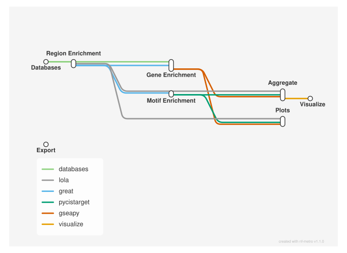

# Region set and gene set enrichment: LOLA, GREAT, pycisTarget and GSEA

<div class="ox-page-badges"><span class="ox-badge ox-badge--live">✔ Live-tested · default-path</span> <span class="ox-badge ox-badge--origin">⇄ Official port</span> <span class="ox-badge ox-badge--sn"><span class="dot"></span>snakemake port</span></div>

Run a complete region set and gene set enrichment analysis on your own data: region overlap enrichment (LOLA), genomic region enrichment of annotated terms (rGREAT), region TFBS motif enrichment (pycisTarget), gene TFBS motif enrichment (RcisTarget), and gene over-representation analysis (ORA) and preranked GSEA (GSEApy). Every tool applies its own multiple-test correction; the workflow produces per-set enrichment plots, per-group summary plots, and reproducibility exports (configs/ and envs/). Official port of epigen/enrichment_analysis v3.0.1 with tool versions and commands pinned to the source.

| | |
|---:|---|
| **Rating** | ✔ Live-tested |
| **Origin** | port |
| **Domain** | genomics |
| **Rules** | 48 |
| **Compute** | up to 10 CPUs / 32 GB per rule |
| **Tools** | gseapy · pandas · pycistarget · bioconductor-rcistarget · bioconductor-lola · bioconductor-rgreat · r-base · r-ggplot2 · r-pheatmap · r-svglite · r-reshape2 · r-data.table · bioconductor-rtracklayer · bioconductor-org.hs.eg.db |
| **Ported** | 2026-08-15 |
| **License** | Apache-2.0 |
| **Source** | [epigen/enrichment_analysis](https://github.com/epigen/enrichment_analysis) |
| **Pinned version** | `v3.0.1` |

## Run it

```bash
oxo-flow run main.oxoflow
```

Needs ATAC peak / BAM inputs — see Requirements.

## Installation

**Engine.** oxo-flow >= 0.12.0

**Toolchain.** conda envs — pinned (conda/mamba at runtime; five environments declared in main.oxoflow, exact pins from upstream)

**Requirements.**
- annotation.csv declaring each feature set (region set or ranked gene set), its path, background, and group
- region BED files, one per region set, plus a background BED (hg38)
- ranked gene list CSVs, one per gene set (gene, score columns)
- gene-set databases for GSEApy ORA: Azimuth_2023.json and ReactomePathways.gmt
- LOLA region database for the genome of interest (e.g. LOLACore hg38)
- pycisTarget cisTarget rankings (.feather) and motif annotation table
- RcisTarget gene-motif rankings (.feather) and motif-to-TF annotation table (optional; both empty by default)
- compute: up to 10 CPUs and 32 GB RAM per rule (defaults: 1 thread / 32 GB per rule; pycisTarget uses 10 threads as upstream)
- disk: modest — enrichment tables, per-set plots, and pycisTarget HDF5 outputs (a few GB)

```bash
# 1. install oxo-flow (release binary, recommended)
curl -fL -o oxo-flow.tar.gz https://github.com/Traitome/oxo-flow/releases/latest/download/oxo-flow-latest-x86_64-unknown-linux-gnu.tar.gz
tar xzf oxo-flow.tar.gz && sudo mv oxo-flow /usr/local/bin/
#    or, via conda (may lag behind releases):
#    conda install -c bioconda oxo-flow-cli
#    NOTE: bioconda currently ships 0.10.2, older than the >= 0.12.0
#    minimum of every catalog entry — prefer the release binary.

# 2. get this workflow (clones the repo, auto-discovers the workflow,
#    sanity-parses it with the engine)
oxo-flow pull gh:oxo-flow-community/oxo-flow-enrichment
#    (alternative: plain git clone)
#    git clone https://github.com/oxo-flow-community/oxo-flow-enrichment
```

## Parameters

| Parameter | Default | Description | Used by |
|---:|---|---|---|
| `adjp_cap` | `4` | — | `visualize_GREAT_Azimuth_2023_ATAC`, `visualize_GREAT_Reactome_ATAC`, `visualize_LOLA_LOLACore_ATAC`, `visualize_ORA_GSEApy_Azimuth_2023_ATAC`, `visualize_ORA_GSEApy_Reactome_ATAC`, `visualize_RcisTarget_hg38_500bp_up_100bp_down_v10clust_ATAC`, `visualize_preranked_GSEApy_Azimuth_2023_RNA`, `visualize_preranked_GSEApy_Reactome_RNA`, `visualize_pycisTarget_hg38_screen_v10clust_ATAC` |
| `adjp_th_GREAT` | `0.01` | — | `region_enrichment_analysis_GREAT_Azimuth_2023`, `region_enrichment_analysis_GREAT_Reactome`, `visualize_GREAT_Azimuth_2023_ATAC`, `visualize_GREAT_Reactome_ATAC` |
| `adjp_th_LOLA` | `0.01` | — | `visualize_LOLA_LOLACore_ATAC` |
| `adjp_th_ORA_GSEApy` | `0.05` | significance thresholds (upstream adjp_th) | `visualize_ORA_GSEApy_Azimuth_2023_ATAC`, `visualize_ORA_GSEApy_Reactome_ATAC` |
| `adjp_th_RcisTarget` | `5` | — | `visualize_RcisTarget_hg38_500bp_up_100bp_down_v10clust_ATAC` |
| `adjp_th_preranked_GSEApy` | `0.05` | — | `visualize_preranked_GSEApy_Azimuth_2023_RNA`, `visualize_preranked_GSEApy_Reactome_RNA` |
| `adjp_th_pycisTarget` | `5` | — | `visualize_pycisTarget_hg38_screen_v10clust_ATAC` |
| `all_region_sets` | `'Bcell_open_regions', 'Ery_open_regions', 'all_regions'` | — | — |
| `annotation` | `config/annotation.csv` | general | — |
| `background_name` | `all_regions` | upstream annotation background_name (all region sets) | `gene_ORA_GSEApy_Azimuth_2023`, `gene_ORA_GSEApy_Reactome`, `gene_motif_enrichment_analysis_RcisTarget`, `region_enrichment_analysis_GREAT_Azimuth_2023`, `region_enrichment_analysis_GREAT_Reactome`, `region_enrichment_analysis_LOLA` |
| `cluster_summary` | `1` | — | `visualize_GREAT_Azimuth_2023_ATAC`, `visualize_GREAT_Reactome_ATAC`, `visualize_LOLA_LOLACore_ATAC`, `visualize_ORA_GSEApy_Azimuth_2023_ATAC`, `visualize_ORA_GSEApy_Reactome_ATAC`, `visualize_RcisTarget_hg38_500bp_up_100bp_down_v10clust_ATAC`, `visualize_preranked_GSEApy_Azimuth_2023_RNA`, `visualize_preranked_GSEApy_Reactome_RNA`, `visualize_pycisTarget_hg38_screen_v10clust_ATAC` |
| `cn_GREAT_adj_pvalue` | `p_adjust_hyper` | — | `plot_enrichment_result_GREAT_Azimuth_2023`, `plot_enrichment_result_GREAT_Reactome`, `region_enrichment_analysis_GREAT_Azimuth_2023`, `region_enrichment_analysis_GREAT_Reactome`, `visualize_GREAT_Azimuth_2023_ATAC`, `visualize_GREAT_Reactome_ATAC` |
| `cn_GREAT_effect_size` | `fold_enrichment_hyper` | — | `plot_enrichment_result_GREAT_Azimuth_2023`, `plot_enrichment_result_GREAT_Reactome`, `visualize_GREAT_Azimuth_2023_ATAC`, `visualize_GREAT_Reactome_ATAC` |
| `cn_GREAT_overlap` | `observed_region_hits` | — | `plot_enrichment_result_GREAT_Azimuth_2023`, `plot_enrichment_result_GREAT_Reactome` |
| `cn_GREAT_p_value` | `p_value_hyper` | — | `plot_enrichment_result_GREAT_Azimuth_2023`, `plot_enrichment_result_GREAT_Reactome` |
| `cn_GREAT_term` | `description` | — | `plot_enrichment_result_GREAT_Azimuth_2023`, `plot_enrichment_result_GREAT_Reactome`, `visualize_GREAT_Azimuth_2023_ATAC`, `visualize_GREAT_Reactome_ATAC` |
| `cn_GREAT_top_n` | `25` | — | `plot_enrichment_result_GREAT_Azimuth_2023`, `plot_enrichment_result_GREAT_Reactome` |
| `cn_LOLA_adj_pvalue` | `qValue` | — | `plot_enrichment_result_LOLA_LOLACore`, `visualize_LOLA_LOLACore_ATAC` |
| `cn_LOLA_effect_size` | `oddsRatio` | — | `plot_enrichment_result_LOLA_LOLACore`, `visualize_LOLA_LOLACore_ATAC` |
| `cn_LOLA_overlap` | `support` | — | `plot_enrichment_result_LOLA_LOLACore` |
| `cn_LOLA_p_value` | `pValue` | — | `plot_enrichment_result_LOLA_LOLACore` |
| `cn_LOLA_term` | `description` | — | `plot_enrichment_result_LOLA_LOLACore`, `visualize_LOLA_LOLACore_ATAC` |
| `cn_LOLA_top_n` | `25` | — | `plot_enrichment_result_LOLA_LOLACore` |
| `cn_ORA_GSEApy_adj_pvalue` | `Adjusted_P_value` | — | `plot_enrichment_result_ORA_GSEApy_Azimuth_2023`, `plot_enrichment_result_ORA_GSEApy_Reactome`, `visualize_ORA_GSEApy_Azimuth_2023_ATAC`, `visualize_ORA_GSEApy_Reactome_ATAC` |
| `cn_ORA_GSEApy_effect_size` | `Odds_Ratio` | — | `plot_enrichment_result_ORA_GSEApy_Azimuth_2023`, `plot_enrichment_result_ORA_GSEApy_Reactome`, `visualize_ORA_GSEApy_Azimuth_2023_ATAC`, `visualize_ORA_GSEApy_Reactome_ATAC` |
| `cn_ORA_GSEApy_overlap` | `Overlap` | — | `plot_enrichment_result_ORA_GSEApy_Azimuth_2023`, `plot_enrichment_result_ORA_GSEApy_Reactome` |
| `cn_ORA_GSEApy_p_value` | `P_value` | — | `plot_enrichment_result_ORA_GSEApy_Azimuth_2023`, `plot_enrichment_result_ORA_GSEApy_Reactome` |
| `cn_ORA_GSEApy_term` | `Term` | — | `plot_enrichment_result_ORA_GSEApy_Azimuth_2023`, `plot_enrichment_result_ORA_GSEApy_Reactome`, `visualize_ORA_GSEApy_Azimuth_2023_ATAC`, `visualize_ORA_GSEApy_Reactome_ATAC` |
| `cn_ORA_GSEApy_top_n` | `25` | tool-specific column names (upstream column_names) | `plot_enrichment_result_ORA_GSEApy_Azimuth_2023`, `plot_enrichment_result_ORA_GSEApy_Reactome` |
| `cn_RcisTarget_adj_pvalue` | `NES` | — | `plot_enrichment_result_RcisTarget_hg38_500bp_up_100bp_down_v10clust`, `visualize_RcisTarget_hg38_500bp_up_100bp_down_v10clust_ATAC` |
| `cn_RcisTarget_effect_size` | `NES` | NES combines significance and effect size | `plot_enrichment_result_RcisTarget_hg38_500bp_up_100bp_down_v10clust`, `visualize_RcisTarget_hg38_500bp_up_100bp_down_v10clust_ATAC` |
| `cn_RcisTarget_overlap` | `nEnrGenes` | — | `plot_enrichment_result_RcisTarget_hg38_500bp_up_100bp_down_v10clust` |
| `cn_RcisTarget_p_value` | `AUC` | — | `plot_enrichment_result_RcisTarget_hg38_500bp_up_100bp_down_v10clust` |
| `cn_RcisTarget_term` | `description` | motif name + highConfCat TFs | `plot_enrichment_result_RcisTarget_hg38_500bp_up_100bp_down_v10clust`, `visualize_RcisTarget_hg38_500bp_up_100bp_down_v10clust_ATAC` |
| `cn_RcisTarget_top_n` | `25` | — | `plot_enrichment_result_RcisTarget_hg38_500bp_up_100bp_down_v10clust` |
| `cn_preranked_GSEApy_adj_pvalue` | `FDR_q_val` | — | `plot_enrichment_result_preranked_GSEApy_Azimuth_2023`, `plot_enrichment_result_preranked_GSEApy_Reactome`, `visualize_preranked_GSEApy_Azimuth_2023_RNA`, `visualize_preranked_GSEApy_Reactome_RNA` |
| `cn_preranked_GSEApy_effect_size` | `NES` | — | `plot_enrichment_result_preranked_GSEApy_Azimuth_2023`, `plot_enrichment_result_preranked_GSEApy_Reactome`, `visualize_preranked_GSEApy_Azimuth_2023_RNA`, `visualize_preranked_GSEApy_Reactome_RNA` |
| `cn_preranked_GSEApy_overlap` | `Tag` | — | `plot_enrichment_result_preranked_GSEApy_Azimuth_2023`, `plot_enrichment_result_preranked_GSEApy_Reactome` |
| `cn_preranked_GSEApy_p_value` | `NOM_p_val` | — | `plot_enrichment_result_preranked_GSEApy_Azimuth_2023`, `plot_enrichment_result_preranked_GSEApy_Reactome` |
| `cn_preranked_GSEApy_term` | `Term` | — | `plot_enrichment_result_preranked_GSEApy_Azimuth_2023`, `plot_enrichment_result_preranked_GSEApy_Reactome`, `visualize_preranked_GSEApy_Azimuth_2023_RNA`, `visualize_preranked_GSEApy_Reactome_RNA` |
| `cn_preranked_GSEApy_top_n` | `25` | — | `plot_enrichment_result_preranked_GSEApy_Azimuth_2023`, `plot_enrichment_result_preranked_GSEApy_Reactome` |
| `cn_pycisTarget_adj_pvalue` | `NES` | — | `plot_enrichment_result_pycisTarget_hg38_screen_v10clust`, `visualize_pycisTarget_hg38_screen_v10clust_ATAC` |
| `cn_pycisTarget_effect_size` | `NES` | — | `plot_enrichment_result_pycisTarget_hg38_screen_v10clust`, `visualize_pycisTarget_hg38_screen_v10clust_ATAC` |
| `cn_pycisTarget_overlap` | `Motif_hits` | — | `plot_enrichment_result_pycisTarget_hg38_screen_v10clust` |
| `cn_pycisTarget_p_value` | `AUC` | — | `plot_enrichment_result_pycisTarget_hg38_screen_v10clust` |
| `cn_pycisTarget_term` | `description` | — | `plot_enrichment_result_pycisTarget_hg38_screen_v10clust`, `visualize_pycisTarget_hg38_screen_v10clust_ATAC` |
| `cn_pycisTarget_top_n` | `25` | — | `plot_enrichment_result_pycisTarget_hg38_screen_v10clust` |
| `db_Azimuth_2023` | `test/resources/enrichment_analysis/Azimuth_2023.json` | databases (upstream local_databases / lola_databases) | `prepare_databases_Azimuth_2023` |
| `db_Reactome` | `test/resources/enrichment_analysis/ReactomePathways.gmt` | — | `prepare_databases_Reactome` |
| `genome` | `hg38` | — | `region_enrichment_analysis_GREAT_Azimuth_2023`, `region_enrichment_analysis_GREAT_Reactome`, `region_enrichment_analysis_LOLA`, `region_gene_association_GREAT` |
| `great_basal_downstream` | `1000` | — | `region_enrichment_analysis_GREAT_Azimuth_2023`, `region_enrichment_analysis_GREAT_Reactome`, `region_gene_association_GREAT` |
| `great_basal_upstream` | `5000` | — | `region_enrichment_analysis_GREAT_Azimuth_2023`, `region_enrichment_analysis_GREAT_Reactome`, `region_gene_association_GREAT` |
| `great_extension` | `1000000` | — | `region_enrichment_analysis_GREAT_Azimuth_2023`, `region_enrichment_analysis_GREAT_Reactome`, `region_gene_association_GREAT` |
| `great_map_associated_regions` | `1` | — | `region_enrichment_analysis_GREAT_Azimuth_2023`, `region_enrichment_analysis_GREAT_Reactome` |
| `great_min_gene_set_size` | `0` | GREAT parameters (upstream great_parameters) | `region_enrichment_analysis_GREAT_Azimuth_2023`, `region_enrichment_analysis_GREAT_Reactome`, `region_gene_association_GREAT` |
| `great_mode` | `basalPlusExt` | — | `region_enrichment_analysis_GREAT_Azimuth_2023`, `region_enrichment_analysis_GREAT_Reactome`, `region_gene_association_GREAT` |
| `lola_db_LOLACore` | `test/resources/LOLACore/hg38` | — | `region_enrichment_analysis_LOLA` |
| `nes_cap` | `5` | — | `visualize_preranked_GSEApy_Azimuth_2023_RNA`, `visualize_preranked_GSEApy_Reactome_RNA` |
| `or_cap` | `5` | — | `visualize_GREAT_Azimuth_2023_ATAC`, `visualize_GREAT_Reactome_ATAC`, `visualize_LOLA_LOLACore_ATAC`, `visualize_ORA_GSEApy_Azimuth_2023_ATAC`, `visualize_ORA_GSEApy_Reactome_ATAC`, `visualize_RcisTarget_hg38_500bp_up_100bp_down_v10clust_ATAC`, `visualize_pycisTarget_hg38_screen_v10clust_ATAC` |
| `path_to_motif_annotations` | `` | user-provided motif annotation tbl; "" disables motif enrichment | `aggregate_pycisTarget_hg38_screen_v10clust_ATAC`, `plot_enrichment_result_pycisTarget_hg38_screen_v10clust`, `process_results_pycisTarget`, `region_motif_enrichment_analysis_pycisTarget`, `visualize_pycisTarget_hg38_screen_v10clust_ATAC` |
| `project_name` | `Corces_CellTypes` | — | `annot_export`, `config_export`, `gene_ORA_GSEApy_Azimuth_2023`, `gene_ORA_GSEApy_Reactome`, `gene_preranked_GSEApy_Azimuth_2023`, `gene_preranked_GSEApy_Reactome`, `prepare_databases_Azimuth_2023`, `prepare_databases_Reactome`, `region_enrichment_analysis_GREAT_Azimuth_2023`, `region_enrichment_analysis_GREAT_Reactome`, `region_gene_association_GREAT` |
| `pycistarget_annotation_version` | `v10nr_clust` | — | `region_motif_enrichment_analysis_pycisTarget` |
| `pycistarget_annotations_to_use` | `['Direct_annot', 'Motif_similarity_annot', 'Orthology_annot', 'Motif_similarity_and_Orthology_annot']` | upstream passes the python list literal; kept as a string so the rendered command is byte-identical to upstream's | `region_motif_enrichment_analysis_pycisTarget` |
| `pycistarget_auc_threshold` | `0.005` | — | `region_motif_enrichment_analysis_pycisTarget` |
| `pycistarget_db_hg38_screen_v10clust` | `` | user-provided pycisTarget rankings DB; "" disables motif enrichment | `aggregate_pycisTarget_hg38_screen_v10clust_ATAC`, `plot_enrichment_result_pycisTarget_hg38_screen_v10clust`, `process_results_pycisTarget`, `region_motif_enrichment_analysis_pycisTarget`, `visualize_pycisTarget_hg38_screen_v10clust_ATAC` |
| `pycistarget_fraction_overlap_w_cistarget_database` | `0.4` | pycisTarget parameters (upstream pycistarget_parameters) | `region_motif_enrichment_analysis_pycisTarget` |
| `pycistarget_motif_similarity_fdr` | `0.001` | — | `region_motif_enrichment_analysis_pycisTarget` |
| `pycistarget_nes_threshold` | `3` | — | `region_motif_enrichment_analysis_pycisTarget` |
| `pycistarget_orthologous_identity_threshold` | `0` | — | `region_motif_enrichment_analysis_pycisTarget` |
| `pycistarget_rank_threshold` | `0.05` | — | `region_motif_enrichment_analysis_pycisTarget` |
| `pycistarget_term_col` | `Direct_annot` | first entry of annotations_to_use | `process_results_pycisTarget` |
| `rcistarget_aucMaxRank_factor` | `0.05` | aucMaxRank = factor * ncol(motifRankings) | `gene_motif_enrichment_analysis_RcisTarget` |
| `rcistarget_db_hg38_500bp_up_100bp_down_v10clust` | `` | gene-based TFBS motif enrichment (RcisTarget); "" disables both rules, matching upstream's "to skip you have to leave one database entry with an empty path" convention | `aggregate_RcisTarget_hg38_500bp_up_100bp_down_v10clust_ATAC`, `gene_motif_enrichment_analysis_RcisTarget`, `plot_enrichment_result_RcisTarget_hg38_500bp_up_100bp_down_v10clust`, `visualize_RcisTarget_hg38_500bp_up_100bp_down_v10clust_ATAC` |
| `rcistarget_geneErnMaxRank` | `5000` | — | `gene_motif_enrichment_analysis_RcisTarget` |
| `rcistarget_geneErnMethod` | `aprox` | alternatively exact but more intense: "icistarget" | `gene_motif_enrichment_analysis_RcisTarget` |
| `rcistarget_motifAnnot_highConfCat` | `directAnnotation,inferredBy_Orthology` | upstream python lists; comma-joined so the rendered command stays a single token (values contain no commas) | `gene_motif_enrichment_analysis_RcisTarget` |
| `rcistarget_motifAnnot_lowConfCat` | `inferredBy_MotifSimilarity,inferredBy_MotifSimilarity_n_Orthology` | — | `gene_motif_enrichment_analysis_RcisTarget` |
| `rcistarget_motif_annot` | `` | user-provided motif-to-TF annotation tbl; "" disables | `aggregate_RcisTarget_hg38_500bp_up_100bp_down_v10clust_ATAC`, `gene_motif_enrichment_analysis_RcisTarget`, `plot_enrichment_result_RcisTarget_hg38_500bp_up_100bp_down_v10clust`, `visualize_RcisTarget_hg38_500bp_up_100bp_down_v10clust_ATAC` |
| `rcistarget_nesThreshold` | `3` | — | `gene_motif_enrichment_analysis_RcisTarget` |
| `region_beds` | `test/data/CorcesATAC` | feature sets (derived from config/annotation.csv at port time) | `region_enrichment_analysis_GREAT_Azimuth_2023`, `region_enrichment_analysis_GREAT_Reactome`, `region_enrichment_analysis_LOLA`, `region_gene_association_GREAT`, `region_motif_enrichment_analysis_pycisTarget` |
| `region_sets` | `'Bcell_open_regions', 'Ery_open_regions'` | — | — |
| `result_path` | `test/results/enrichment_analysis` | — | `aggregate_GREAT_Azimuth_2023_ATAC`, `aggregate_GREAT_Reactome_ATAC`, `aggregate_LOLA_LOLACore_ATAC`, `aggregate_ORA_GSEApy_Azimuth_2023_ATAC`, `aggregate_ORA_GSEApy_Reactome_ATAC`, `aggregate_RcisTarget_hg38_500bp_up_100bp_down_v10clust_ATAC`, `aggregate_preranked_GSEApy_Azimuth_2023_RNA`, `aggregate_preranked_GSEApy_Reactome_RNA`, `aggregate_pycisTarget_hg38_screen_v10clust_ATAC`, `annot_export`, `config_export`, `gene_ORA_GSEApy_Azimuth_2023`, `gene_ORA_GSEApy_Reactome`, `gene_motif_enrichment_analysis_RcisTarget`, `gene_preranked_GSEApy_Azimuth_2023`, `gene_preranked_GSEApy_Reactome`, `plot_enrichment_result_GREAT_Azimuth_2023`, `plot_enrichment_result_GREAT_Reactome`, `plot_enrichment_result_LOLA_LOLACore`, `plot_enrichment_result_ORA_GSEApy_Azimuth_2023`, `plot_enrichment_result_ORA_GSEApy_Reactome`, `plot_enrichment_result_RcisTarget_hg38_500bp_up_100bp_down_v10clust`, `plot_enrichment_result_preranked_GSEApy_Azimuth_2023`, `plot_enrichment_result_preranked_GSEApy_Reactome`, `plot_enrichment_result_pycisTarget_hg38_screen_v10clust`, `process_results_pycisTarget`, `region_enrichment_analysis_GREAT_Azimuth_2023`, `region_enrichment_analysis_GREAT_Reactome`, `region_enrichment_analysis_LOLA`, `region_gene_association_GREAT`, `region_motif_enrichment_analysis_pycisTarget`, `visualize_GREAT_Azimuth_2023_ATAC`, `visualize_GREAT_Reactome_ATAC`, `visualize_LOLA_LOLACore_ATAC`, `visualize_ORA_GSEApy_Azimuth_2023_ATAC`, `visualize_ORA_GSEApy_Reactome_ATAC`, `visualize_RcisTarget_hg38_500bp_up_100bp_down_v10clust_ATAC`, `visualize_preranked_GSEApy_Azimuth_2023_RNA`, `visualize_preranked_GSEApy_Reactome_RNA`, `visualize_pycisTarget_hg38_screen_v10clust_ATAC` |
| `rnk_dir` | `test/data/CorcesRNA` | {gene_set}.csv per entry of rnk_sets | `gene_preranked_GSEApy_Azimuth_2023`, `gene_preranked_GSEApy_Reactome` |
| `rnk_sets` | `'Bcell_ranked', 'Ery_ranked'` | — | — |
| `species` | `homo_sapiens` | upstream derives species from genome (hg19/hg38 -> homo_sapiens); ported as config key | `region_motif_enrichment_analysis_pycisTarget` |
| `top_terms_n` | `5` | aggregate & summarize (upstream top_terms_n / adjp_cap / or_cap / nes_cap / cluster_summary) | `visualize_GREAT_Azimuth_2023_ATAC`, `visualize_GREAT_Reactome_ATAC`, `visualize_LOLA_LOLACore_ATAC`, `visualize_ORA_GSEApy_Azimuth_2023_ATAC`, `visualize_ORA_GSEApy_Reactome_ATAC`, `visualize_RcisTarget_hg38_500bp_up_100bp_down_v10clust_ATAC`, `visualize_preranked_GSEApy_Azimuth_2023_RNA`, `visualize_preranked_GSEApy_Reactome_RNA`, `visualize_pycisTarget_hg38_screen_v10clust_ATAC` |

Descriptions are the workflow's own `#` comments from its `[config]` section, surfaced by `oxo-flow info` — no schema file to maintain.

## Workflow graph

<div class="ox-dag-card" markdown="1">



</div>

The graph is derived at catalog-build time from `oxo-flow graph -f dot` and rendered with Graphviz. It shows the workflow at rule level: wildcard `{sample}` instances expand at run time when sample data is discovered (the runtime view is `oxo-flow graph --expanded`).

## Scope

The default-parameters main path of the source pipeline was ported rule-for-rule; alternate paths are documented as excluded.

**In scope**

- aggregate_GREAT_Azimuth_2023_ATAC
- aggregate_GREAT_Reactome_ATAC
- aggregate_LOLA_LOLACore_ATAC
- aggregate_ORA_GSEApy_Azimuth_2023_ATAC
- aggregate_ORA_GSEApy_Reactome_ATAC
- aggregate_RcisTarget_hg38_500bp_up_100bp_down_v10clust_ATAC
- aggregate_preranked_GSEApy_Azimuth_2023_RNA
- aggregate_preranked_GSEApy_Reactome_RNA
- aggregate_pycisTarget_hg38_screen_v10clust_ATAC
- annot_export
- config_export
- gene_ORA_GSEApy_Azimuth_2023
- gene_ORA_GSEApy_Reactome
- gene_motif_enrichment_analysis_RcisTarget
- gene_motif_enrichment_analysis_RcisTarget_txt
- gene_preranked_GSEApy_Azimuth_2023
- gene_preranked_GSEApy_Reactome
- plot_enrichment_result_GREAT_Azimuth_2023
- plot_enrichment_result_GREAT_Reactome
- plot_enrichment_result_LOLA_LOLACore
- plot_enrichment_result_ORA_GSEApy_Azimuth_2023
- plot_enrichment_result_ORA_GSEApy_Reactome
- plot_enrichment_result_RcisTarget_hg38_500bp_up_100bp_down_v10clust
- plot_enrichment_result_RcisTarget_hg38_500bp_up_100bp_down_v10clust_txt
- plot_enrichment_result_preranked_GSEApy_Azimuth_2023
- plot_enrichment_result_preranked_GSEApy_Reactome
- plot_enrichment_result_pycisTarget_hg38_screen_v10clust
- prepare_databases_Azimuth_2023
- prepare_databases_Reactome
- process_results_pycisTarget
- region_enrichment_analysis_GREAT_Azimuth_2023
- region_enrichment_analysis_GREAT_Reactome
- region_enrichment_analysis_LOLA
- region_gene_association_GREAT
- region_motif_enrichment_analysis_pycisTarget
- visualize_GREAT_Azimuth_2023_ATAC
- visualize_GREAT_Reactome_ATAC
- visualize_LOLA_LOLACore_ATAC
- visualize_ORA_GSEApy_Azimuth_2023_ATAC
- visualize_ORA_GSEApy_Reactome_ATAC
- visualize_RcisTarget_hg38_500bp_up_100bp_down_v10clust_ATAC
- visualize_preranked_GSEApy_Azimuth_2023_RNA
- visualize_preranked_GSEApy_Reactome_RNA
- visualize_pycisTarget_hg38_screen_v10clust_ATAC

**Excluded**

- env_export — conda env export requires the conda CLI inside the runtime environment and dumps the runtime env state, not the declared pins; exact pins are already declared in envs/*.yaml
- report rendering — upstream wraps outputs in snakemake's report() (HTML report with .rst captions); oxo-flow has no report module, so config_export and annot_export are ported as plain rules (env_export is excluded separately above)
- note: the anticipated names liftover/enrichr/gost/single_region_mode do not exist in v3.0.1 (Enrichr appears only as a commented-out reference in gene_ORA_GSEApy.py and a database-source comment in config.yaml)

## Fidelity

| Upstream process/rule | oxo-flow rule | Tool (version) | Notes |
|---|---|---|---|
| prepare_databases | `prepare_databases_Azimuth_2023`, `prepare_databases_Reactome` | gseapy 1.1.3 | identical command; database fan-out baked as static blocks (2 default-path databases) |
| region_enrichment_analysis_LOLA | `region_enrichment_analysis_LOLA` | bioconductor-lola 1.32.0 | identical command; database fan-out baked as static block (1 default-path database) |
| region_enrichment_analysis_GREAT | `region_enrichment_analysis_GREAT_Azimuth_2023`, `region_enrichment_analysis_GREAT_Reactome` | bioconductor-rgreat 2.4.0 | identical command; upstream `great_parameters` nested dict flattened into `great_*` config keys |
| region_gene_association_GREAT | `region_gene_association_GREAT` | bioconductor-rgreat 2.4.0 | identical command; uses the first database (Azimuth_2023) as upstream |
| region_motif_enrichment_analysis_pycisTarget | `region_motif_enrichment_analysis_pycisTarget` | pycistarget 1.1 | command text verbatim (incl. upstream error-tolerance wrapper); threads=10 as upstream |
| process_results_pycisTarget | `process_results_pycisTarget` | pycistarget 1.1 | identical command |
| gene_motif_enrichment_analysis_RcisTarget | `gene_motif_enrichment_analysis_RcisTarget` (+ `_txt`) + plot/aggregate/visualize `*_RcisTarget_*` blocks | bioconductor-rcistarget 1.20.0 | identical command/logic; when-gated on the user-provided rankings feather + motif annotation (both `""` by default); fans over region sets (via GREAT `genes.txt`) and `.txt` gene sets (`config.txt_gene_sets`; zero instances when the default-empty list is unset, so the default plan is unchanged); upstream also folds the `.txt`-set results into the group aggregate/visualize — the port's static per-group blocks cannot enumerate user-defined gene sets, so txt-set results stop at per-set plots |
| gene_ORA_GSEApy | `gene_ORA_GSEApy_Azimuth_2023`, `gene_ORA_GSEApy_Reactome` | gseapy 1.1.3 | identical command; upstream genes_dict fan-out has zero default-path members, region-set fan-out kept |
| gene_preranked_GSEApy | `gene_preranked_GSEApy_Azimuth_2023`, `gene_preranked_GSEApy_Reactome` | gseapy 1.1.3 | identical command |
| plot_enrichment_result | `plot_enrichment_result_*` (9 blocks) | r-ggplot2 3.5.0, r-svglite 2.1.0 | identical command; upstream wildcard fan-out (tool × db × feature_set) baked as per-(tool,db) scatter blocks |
| aggregate | `aggregate_*` (9 blocks) | pandas 1.1.4 / 1.5.3 | identical logic; upstream wildcards group/tool/db passed as CLI args |
| visualize | `visualize_*` (9 blocks) | r-ggplot2 3.5.0, r-pheatmap 1.0.12 | identical command/logic; `cluster_summary` config key kept as upstream numeric flag |
| config_export | `config_export` | — | upstream dumps the in-memory config dict; the port copies `config/config.yaml` (effective-config mirror) |
| annot_export | `annot_export` | — | identical command |
| env_export | not ported | — | `conda env export` needs the conda CLI inside the runtime env; exact pins are already declared in `envs/*.yaml` |
| report rendering | not ported | — | oxo-flow has no report module; `config_export` / `annot_export` are ported as plain rules (`env_export` is excluded separately — see the row above) |

Script ports: upstream scripts run inside snakemake's `snakemake@input/...`
namespace; the port passes the same values as positional CLI arguments
(`scripts/*`), keeping every analysis step and output byte-identical.
`utils.R` is copied verbatim. Fidelity conventions: `{config.a.b}` nested
access does not exist in oxo-flow — all upstream nested config dicts
(`great_parameters`, `pycistarget_parameters`, `rcistarget_parameters`,
`column_names`, `adjp_th`, caps) are flattened into prefixed top-level
keys; the pycisTarget `annotations_to_use` list is carried as a python-list
literal string, and the RcisTarget `motifAnnot_highConfCat` /
`motifAnnot_lowConfCat` lists are comma-joined strings (values contain no
commas; split back to vectors inside the R script), so the rendered
commands are byte-identical to upstream.


## Links

- Repository: [oxo-flow-enrichment](https://github.com/oxo-flow-community/oxo-flow-enrichment)
- Upstream: [epigen/enrichment_analysis](https://github.com/epigen/enrichment_analysis) @ `v3.0.1`
- License: Apache-2.0 (this workflow) · MIT (upstream)

Created on 2026-08-15 — this port may lag behind upstream releases. See the repository's NOTICE for full attribution.
