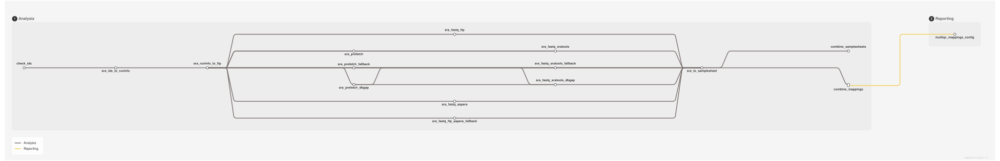

<div class="ox-crumb"><a href="/pipelines/">Pipelines</a> / <span>oxo-flow-fetchngs</span></div>
<div class="ox-detail-cols" markdown="1">
<div markdown="1">

# Fetching public sequencing data: FastQ download, metadata and samplesheets

<div class="ox-page-badges"><span class="ox-badge ox-badge--live">✔ Live-tested · default-path</span> <span class="ox-badge ox-badge--origin">⇄ Official port</span> <span class="ox-badge ox-badge--nf"><span class="dot"></span>nf-core port</span></div>

Fetch metadata and raw FastQ files from public sequence databases (SRA/ENA/DDBJ/GEO). Given a list of database identifiers — run accessions (SRR/ERR/DRR), experiments, studies, biosamples or GEO series — the pipeline retrieves the ENA run metadata, downloads the FastQ files over FTP, validates every download against its ENA md5 sum, and auto-creates a samplesheet plus sample id-mappings and a MultiQC mappings config, ready for downstream nf-core pipelines such as rnaseq, atacseq or taxprofiler.

</div>
<div>

<div class="ox-glance">
<div class="ox-glance-title">At a glance</div>
<div class="ox-kv"><span class="k">Rating</span><span class="v live">✔ Live-tested · default-path</span></div>
<div class="ox-kv"><span class="k">Rules</span><span class="v">16</span></div>
<div class="ox-kv"><span class="k">Compute</span><span class="v">up to 2 CPUs / 12 GB per rule (download)</span></div>
<div class="ox-kv"><span class="k">Engine</span><span class="v"><span class="ox-badge ox-badge--nf"><span class="dot"></span>nf-core port</span></span></div>
<div class="ox-kv"><span class="k">Origin</span><span class="v">⇄ Official port</span></div>
<div class="ox-kv"><span class="k">Domain</span><span class="v">genomics</span></div>
<div class="ox-kv"><span class="k">Source</span><span class="v"><a href="https://github.com/nf-core/fetchngs">nf-core/fetchngs</a></span></div>
<div class="ox-kv"><span class="k">Pinned version</span><span class="v"><code>1.12.0</code></span></div>
<div class="ox-kv"><span class="k">Ported</span><span class="v">2026-08-15</span></div>
<div class="ox-kv"><span class="k">License</span><span class="v">Apache-2.0</span></div>
<p class="cmd">$ oxo-flow run main.oxoflow</p>
</div>

</div>
</div>

## Run it

```bash
oxo-flow run main.oxoflow
```

Downloads public data by SRA/ENA accessions (network required) — configure your IDs first.

## Installation

**Engine.** oxo-flow >= 0.17.0

**Toolchain.** containers (Docker) — pinned images (quay.io/biocontainers, identical to upstream)

**Requirements.**
- ids file: one SRA/ENA/DDBJ/GEO accession per line (config.input, default test/fixtures/ids.txt), kept in sync with the [[sample_groups]] sample source
- reference data: none — the workflow downloads data from public archives; no genome FASTA, annotation or indices required
- network: outbound access to ENA over FTP (wget -t 5 -c -T 60, 2 retries); the sratools branch needs NCBI SRA outbound access (prefetch/fasterq-dump), the aspera branch ENA fasp on port 33001
- compute: up to 2 CPUs / 12 GB per rule (FastQ download 2 threads/12G; metadata fetch 1 thread/6G; 4 h time limits on twelve rules)
- disk: results/fastq/ grows with downloaded FastQ files plus md5/ checksums (depends on input size); metadata/ and samplesheet/ stay small

```bash
# 1. install oxo-flow (release binary, recommended)
curl -fL -o oxo-flow.tar.gz https://github.com/Traitome/oxo-flow/releases/latest/download/oxo-flow-latest-x86_64-unknown-linux-gnu.tar.gz
tar xzf oxo-flow.tar.gz && sudo mv oxo-flow /usr/local/bin/
#    or, via conda (may lag behind releases):
#    conda install -c bioconda oxo-flow-cli
#    NOTE: bioconda currently ships 0.10.2, older than the >= 0.12.0
#    minimum of every catalog entry — prefer the release binary.

# 2. get this workflow (clones the repo, auto-discovers the workflow,
#    sanity-parses it with the engine)
oxo-flow pull gh:oxo-flow-community/oxo-flow-fetchngs
#    (alternative: plain git clone)
#    git clone https://github.com/oxo-flow-community/oxo-flow-fetchngs
```

## Parameters

| Parameter | Default | Description | Used by |
|---:|---|---|---|
| `download_method` | `ftp` | — | `sra_fastq_ftp` |
| `ena_metadata_fields` | `` | Comma-separated ENA metadata fields; empty = upstream default field list. | `sra_ids_to_runinfo` |
| `input` | `test/fixtures/ids.txt` | File containing SRA/ENA/GEO/DDBJ identifiers, one per line (upstream --input). Keep in sync with the [[sample_groups]] list below: check_ids validates this file, the sample source drives the per-id expansion. Add extra ids on the CLI with `oxo-flow run main.oxoflow --sample <ID>`. | `check_ids` |
| `nf_core_pipeline` | `` | nf-core pipeline to tailor the samplesheet for (rnaseq/atacseq/taxprofiler); empty = none. | `sra_to_samplesheet` |
| `nf_core_rnaseq_strandedness` | `auto` | — | `sra_to_samplesheet` |
| `out_dir` | `results` | — | `check_ids`, `combine_mappings`, `combine_samplesheets`, `multiqc_mappings_config`, `sra_fastq_ftp`, `sra_ids_to_runinfo`, `sra_runinfo_to_ftp`, `sra_to_samplesheet` |
| `sample_mapping_fields` | `experiment_accession,run_accession,sample_accession,experiment_alias,run_alias,sample_alias,experiment_title,sample_title,sample_description` | — | `multiqc_mappings_config`, `sra_to_samplesheet` |
| `skip_fastq_download` | `false` | — | `combine_mappings`, `combine_samplesheets`, `sra_fastq_ftp`, `sra_to_samplesheet` |

Descriptions are the workflow's own `#` comments from its `[config]` section, surfaced by `oxo-flow info` — no schema file to maintain.

## Workflow graph

<div class="ox-dag-card" markdown="1">



</div>

The graph is derived at catalog-build time from `oxo-flow graph -f dot` and rendered with Graphviz. It shows the workflow at rule level: wildcard `{sample}` instances expand at run time when sample data is discovered (the runtime view is `oxo-flow graph --expanded`).

## Scope

The default-parameters main path of the source pipeline was ported rule-for-rule; alternate paths are documented as excluded.

**In scope**

- check_ids
- sra_ids_to_runinfo
- sra_runinfo_to_ftp
- sra_fastq_ftp
- sra_prefetch
- sra_fastq_sratools
- sra_fastq_aspera
- sra_fastq_ftp_aspera_fallback
- sra_prefetch_fallback
- sra_fastq_sratools_fallback
- sra_prefetch_dbgap
- sra_fastq_sratools_dbgap
- sra_to_samplesheet
- combine_samplesheets
- combine_mappings
- multiqc_mappings_config

**Excluded**

- none

## Fidelity

| Upstream process/rule | oxo-flow rule | Tool (version) | Notes |
|---|---|---|---|
| PIPELINE_INITIALISATION (`isSraId` + id channel) | `check_ids` | python 3.9.5 | Validation regex, mixture/empty errors and deduplication ported 1:1 into `scripts/check_ids.py`; outputs `results/pipeline_info/input_ids.txt`. The ids channel itself is expanded from the workflow sample source (`[[sample_groups]]`, add ids via `--sample`); keep `[config] input` in sync. |
| SRA_IDS_TO_RUNINFO | `sra_ids_to_runinfo` | python 3.9.5 (`quay.io/biocontainers/python:3.9--1`) | Upstream `echo $id > id.txt; sra_ids_to_runinfo.py id.txt <id>.runinfo.tsv` verbatim; `--ena_metadata_fields` flag emitted only when set (same conditional). One instance per input id (upstream: one process per id). The intermediate `.runinfo.tsv` lands in `results/metadata/` (upstream leaves it unpublished in the workdir; oxo-flow requires declared outputs for the DAG contract). |
| SRA_RUNINFO_TO_FTP | `sra_runinfo_to_ftp` | python 3.9.5 | `sra_runinfo_to_ftp.py` verbatim; output `<id>.runinfo_ftp.tsv` → `results/metadata/` (published upstream). |
| SRA_FASTQ_FTP | `sra_fastq_ftp` | wget 1.20.1 (`quay.io/biocontainers/wget:1.20.1`), md5sum (coreutils, in the same image) | wget flags `-t 5 -nv -c -T 60`, `-O <exp>_<run>[_1|_2].fastq.gz` naming and `echo md5 … | md5sum -c` verification byte-identical; fastq → `results/fastq/`, md5 → `results/fastq/md5/` (upstream publishDir patterns). Per-run row parsing replaces the Groovy channel `branch`; **no outputs declared** because the produced file set (single- vs paired-end, per-run names) is data-dependent — md5 verification in the command is the correctness gate (same as upstream). Runs without FTP links are skipped with a warning in the default config; with `sra_tools_fallback = true` they are handled by the per-run sratools fallback rules below (the upstream `branch` triage, ported as a when-gated branch — off by default so the default plan is unchanged). |
| SRA_TO_SAMPLESHEET | `sra_to_samplesheet` | python 3.9.5 | Groovy `exec` block ported 1:1 into `scripts/sra_to_samplesheet.py` (removed keys, `sample` = experiment accession, `fastq_1/2` = `<outdir>/fastq/<file>`, ENA columns appended, `--sample_mapping_fields` validation with upstream error text). `localrule`, 100 MB memory, `executor 'local'` mapped to `localrule = true`. Runs only when `skip_fastq_download` is false (upstream: channel empty when skipped). |
| `collectFile('samplesheet.csv')` | `combine_samplesheets` | system (bash + coreutils) | Gather via `expand_inputs` over `config.samples_list`; header kept once, sorted by basename (upstream `keepHeader: true, sort: { it.baseName }`); `results/samplesheet/samplesheet.csv`. |
| `collectFile('id_mappings.csv')` | `combine_mappings` | system (bash + coreutils) | Same gather semantics; `results/samplesheet/id_mappings.csv`. |
| MULTIQC_MAPPINGS_CONFIG | `multiqc_mappings_config` | python 3.9.5 | `multiqc_mappings_config.py` verbatim; output `results/samplesheet/multiqc_config.yml` (upstream publishDir). Gated on `sample_mapping_fields` being set — on by default, same as upstream. |
| softwareVersionsToYAML + `versions.yml` | engine-native export: `oxo-flow report --versions-yml <file> main.oxoflow` | — | oxo-flow ≥ 0.17.0 exports an nf-core-style `versions.yml` derived statically from the workflow declarations: one entry per rule (16 rules) with the pinned container image (registry + tag), or a `system` entry with an explicit "no software versions declared" note for the host-tool gather rules. Deviation: it is a standalone CI-diff artifact, not a per-process runtime capture — upstream records each tool's runtime version at execution time and collects the per-process files into `pipeline_info/nf_core_fetchngs_software_mqc_versions.yml`; the export reflects the pinned versions in the definition (resolved runtime package versions depend on the execution environment). Per-rule `versions.yml` emission inside every command is deliberately not replicated (it would change every rule's command while the default plan stays byte-identical). The collected file has no consumer in fetchngs itself (no MultiQC process; the mappings config targets downstream pipelines) — upstream ships it as boilerplate, here the export serves the same CI-diff purpose. |
| PIPELINE_COMPLETION (`workflow.onComplete`: completionEmail / completionSummary / imNotification / sraCurateSamplesheetWarn) | `[workflow] on_complete` + `on_error` hooks (`scripts/pipeline_completion.sh`) | sendmail / mail / curl (host tools) | Ported onto the engine's workflow-level terminal hooks (engine >= 0.17.0): `email` mails the run-summary on completion, `email_on_fail` after a failed run (falling back to `email`, like upstream), `hook_url` POSTs a JSON notification with the run counters on both (upstream `imNotification` posts an Adaptive-Card/Slack JSON; here the payload is a `{"text": ...}` summary). All three default empty (upstream's null params), so the hooks no-op; older engines ignore the `[workflow]` keys entirely, keeping the default plan unchanged. `completionSummary`'s stdout line is covered by the engine's own "Done: N succeeded..." line, and `sraCurateSamplesheetWarn` is a static log note (see Known limitations). Hooks are best-effort: a missing mail tool or failing webhook only warns and never changes the run status. |
| CUSTOM_SRATOOLSNCBISETTINGS + SRATOOLS_PREFETCH | `sra_prefetch` | sra-tools 3.0.8 (`quay.io/biocontainers/sra-tools:3.0.8--h9f5acd7_0`) | When-gated branch, off by default (`download_method = "sratools"` + `dbgap_key` empty): per-run `prefetch` under the upstream `retry_with_backoff` policy (5 attempts / 1 s base / 100 s max, `scripts/retry_with_backoff.sh` verbatim) + `vdb-validate` incl. the `.sralite` variant; fresh NCBI settings file per id (upstream CUSTOM_SRATOOLSNCBISETTINGS GUID config). SRA records land in `results/sra/<id>/` (upstream publishDir `results/sra`, `enabled: false` — intermediates). Applies to **all** runs, matching upstream's explicit `--download_method sratools` mode; with `dbgap_key` set, the dbGaP variant below takes over. |
| SRATOOLS_FASTERQDUMP | `sra_fastq_sratools` | sra-tools 2.11.0 + pigz 2.6 (`quay.io/biocontainers/mulled-v2-5f89fe0cd045cb1d615630b9261a1d17943a9b6a:6a9ff0e76ec016c3d0d27e0c0d362339f2d787e6-0`, fetchngs' patched image) | When-gated on `download_method = "sratools"` (+ `dbgap_key` empty); depends on `sra_prefetch`. `fasterq-dump --split-files --include-technical --threads` + `pigz --no-name --processes` translated from the fetchngs module (env pinned to upstream environment.yml: sra-tools 2.11.0 + pigz 2.6); files land in `results/fastq/` with the same names as the FTP branch so the samplesheet is method-agnostic. |
| Per-run sratools fallback (upstream SRA workflow `branch`, runs without FTP/fasp links with `download_method = "ftp"` or `"aspera"`) | `sra_prefetch_fallback` + `sra_fastq_sratools_fallback` | sra-tools 3.0.8 / 2.11.0 + pigz 2.6 (same images as above) | When-gated on `sra_tools_fallback = true` + `download_method = "ftp"` or `"aspera"` (off by default — the default plan is unchanged). Mirrors the sratools-method rules but processes only the runs upstream's `branch` sends to sra-tools: rows whose metadata has neither `fastq_1` nor `fastq_aspera` (branch condition `!meta.fastq_aspera && !meta.fastq_1`, re-derived from the runinfo tsv by `scripts/sra_prefetch_runs.sh` / `scripts/sra_fastq_sratools_runs.sh`). Prefetch + `vdb-validate` incl. the `.sralite` variant, then fasterq-dump + pigz into `results/fastq/` with the FTP-branch naming so the samplesheet is method-agnostic; the FTP rule keeps downloading the runs that do have links. |
| dbGaP (`--dbgap_key`) | `sra_prefetch_dbgap` + `sra_fastq_sratools_dbgap` | sra-tools 3.0.8 / 2.11.0 (same images) | When-gated on `download_method = "sratools"` + `dbgap_key` set (off by default: `dbgap_key = ""`; the plain sratools rules are gated off in that case). The certificate is passed through verbatim like upstream: `.ngc` → `prefetch --ngc` / `fasterq-dump --ngc`, `.jwt` → `--perm` (SRATOOLS_PREFETCH shell and SRATOOLS_FASTERQDUMP script logic, same rules for both tools). Still requires the user's own NIH authorized-access credentials at runtime — the port itself needs nothing, and the public path (empty `dbgap_key`) is unchanged. |
| ASPERA_CLI (Aspera CLI 4.14.0, `fasp` links) | `sra_fastq_aspera` | aspera-cli 4.14.0 (`quay.io/biocontainers/aspera-cli:4.14.0--hdfd78af_1`, the upstream image — verified to ship `/usr/local/bin/ascp` + the anonymous ENA bypass key `/usr/local/etc/aspera/aspera_bypass_dsa.pem`) | When-gated on `download_method = "aspera"`: `ascp -QT -l 300m -P33001` (upstream ext.args) against the `fastq_aspera` fasp links with user `era-fasp`, md5-verified like the FTP branch. No credentials needed — the anonymous ENA fasp endpoint is what upstream uses. Deviation: upstream also sends runs without fasp links to the ftp/sra-tools branches per run; that triage is ported as when-gated branches (`sra_fastq_ftp_aspera_fallback` + `sra_prefetch_fallback` / `sra_fastq_sratools_fallback`, all on `sra_tools_fallback = true`), so with the fallback off such runs are skipped with a warning. |
| Per-run FTP fallback for the aspera method (upstream SRA workflow `branch`: with `download_method = "aspera"`, runs with an FTP link but no fasp link go to the FTP process) | `sra_fastq_ftp_aspera_fallback` | wget 1.20.1 (same image as `sra_fastq_ftp`) | When-gated on `download_method = "aspera"` + `sra_tools_fallback = true` (off by default — the default plan is unchanged). `scripts/sra_fastq_ftp_aspera_runs.sh` carries the same wget `-t 5 -nv -c -T 60` download + md5 verification loop as the frozen `sra_fastq_ftp` command, applied to exactly the rows upstream's `branch` sends to the FTP arm: `fastq_1` set, `fastq_aspera` empty (branch condition `meta.fastq_1 && !meta.fastq_aspera`, re-derived from the runinfo tsv). Together with `sra_prefetch_fallback` / `sra_fastq_sratools_fallback` (same toggle) the runinfo tsv is fully partitioned — every run is downloaded exactly once by whichever branch upstream's `branch` would pick, with the FTP-branch naming so the samplesheet is method-agnostic. |
| `params.nf_core_pipeline` (rnaseq/atacseq/taxprofiler columns) | `sra_to_samplesheet` | — | Off by default (empty), same as upstream; the column logic is ported and activates when `nf_core_pipeline` is set. |
| publishDir / `--publish_dir_mode` | n/a | — | oxo-flow has no publishDir; outputs are declared directly at their `results/…` paths. |

Known limitations: the ids used for per-id expansion must be declared in the
sample source (`[[sample_groups]]`, or `--sample` on the CLI) and should match
`[config] input` validated by `check_ids`. The sra-tools and Aspera download
methods are ported as when-gated branches (`download_method = "sratools"` /
`"aspera"`); the upstream **per-run** triage is ported as when-gated branches
too, off by default so the default plan is byte-identical: `sra_tools_fallback
= true` restores upstream's per-run routing — with `ftp`, runs without
FTP/fasp links go to prefetch/fasterq-dump; with `aspera`, runs without a
fasp link go to the FTP branch when they have an FTP link
(`sra_fastq_ftp_aspera_fallback`) and to prefetch/fasterq-dump otherwise —
and `dbgap_key` enables the dbGaP certificate path of the sratools branch
(the certificate is passed through verbatim; the port itself needs no
credentials). Remaining deviation: with `ftp` or `aspera` and the fallback
off, runs whose metadata lacks the matching download links are skipped with
a warning (upstream would route them per run; enable `sra_tools_fallback` to
restore the triage). The auto-created samplesheet should be double-checked
before downstream use (the upstream `sraCurateSamplesheetWarn` end-of-run
note): public databases don't reliably hold information such as strandedness
or controls, and all sample metadata from the ENA is appended as additional
columns to help manual curation. The nf-core boilerplate (`versions.yml`
collection) is covered by the engine-native export
(`oxo-flow report --versions-yml <file> main.oxoflow`, see table).

## Links

- Repository: [oxo-flow-fetchngs](https://github.com/oxo-flow-community/oxo-flow-fetchngs)
- Upstream: [nf-core/fetchngs](https://github.com/nf-core/fetchngs) @ `1.12.0`
- License: Apache-2.0 (this workflow) · MIT (upstream)

Created on 2026-08-15 — this port may lag behind upstream releases. See the repository's NOTICE for full attribution.
