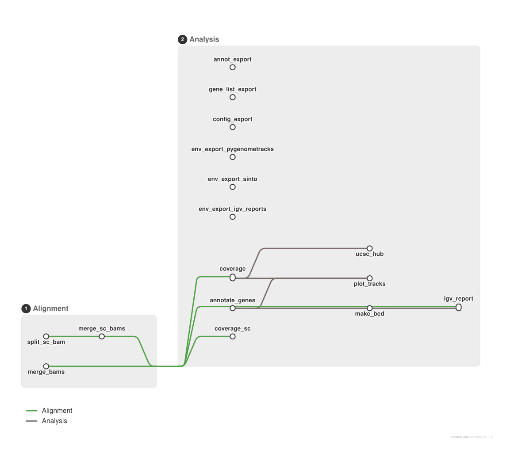

<div class="ox-crumb"><a href="/pipelines/">Pipelines</a> / <span>oxo-flow-genome-tracks</span></div>
<div class="ox-detail-cols">
<div>
<h1>Genome browser tracks: coverage, gene plots and UCSC hub</h1>
<div class="ox-page-badges"><span class="ox-badge ox-badge--live">✔ Live-tested · default-path</span> <span class="ox-badge ox-badge--origin">⇄ Official port</span> <span class="ox-badge ox-badge--sn"><span class="dot"></span>snakemake port</span></div>
<p>Merge BAM files per experimental group with samtools, compute normalized bigWig coverage with deepTools bamCoverage (RPGC by default), plot isoform-aware per-gene and per-region genome tracks with gtracks/pyGenomeTracks, and publish a UCSC genome browser track hub — end-to-end track generation for RNA-seq, ATAC-seq and other aligned BAM data, plus the single-cell branch (sinto per-cell-barcode splitting of sc BAMs into per-group BAMs), an opt-in IGV report of all merged BAMs over the annotated gene regions, and opt-in conda environment export rules (env_export_*, conda env export).</p>
</div>
<div>
<div class="ox-glance">
<div class="ox-glance-title">At a glance</div>
<div class="ox-kv"><span class="k">Rating</span><span class="v live">✔ Live-tested · default-path</span></div>
<div class="ox-kv"><span class="k">Rules</span><span class="v">16</span></div>
<div class="ox-kv"><span class="k">Compute</span><span class="v">up to 4 CPUs / 4 GB per rule (opt-in igv_report: 8 GB)</span></div>
<div class="ox-kv"><span class="k">Engine</span><span class="v"><span class="ox-badge ox-badge--sn"><span class="dot"></span>snakemake port</span></span></div>
<div class="ox-kv"><span class="k">Origin</span><span class="v">⇄ Official port</span></div>
<div class="ox-kv"><span class="k">Domain</span><span class="v">genomics</span></div>
<div class="ox-kv"><span class="k">Source</span><span class="v"><a href="https://github.com/epigen/genome_tracks">epigen/genome_tracks</a></span></div>
<div class="ox-kv"><span class="k">Pinned version</span><span class="v"><code>v2.0.5</code></span></div>
<div class="ox-kv"><span class="k">Ported</span><span class="v">2026-08-15</span></div>
<div class="ox-kv"><span class="k">License</span><span class="v">Apache-2.0</span></div>
<p class="cmd">$ oxo-flow run main.oxoflow --samples first:1</p>
</div>
</div>
</div>

## Run it

```bash
oxo-flow run main.oxoflow --samples first:1
```

Lightweight; `--samples first:1` keeps the first run small.

## Installation

**Engine.** oxo-flow >= 0.12.0

**Toolchain.** conda envs — pinned

**Requirements.**

- BAM files per group at <bam_dir>/<group>/*.bam (aligned/mapped data, e.g. RNA-seq or ATAC-seq; input BAMs need no index — merge_bams produces merged, indexed BAMs)
- sample annotation CSV with a group column (sample_annotation; group values drive merge/coverage/hub fan-out)
- gene list CSV with gene_region,ymax columns (gene_list; gene symbols or chr:start-end regions)
- 12-column genome BED for gene annotation (genome_bed, e.g. ref.bed.gz); no genome FASTA or annotation GTF required
- single-cell samples (optional): one CB-tagged BAM per sc sample at <sc_bam_dir>/<sc_id>.bam + a 2-column barcode TSV (barcode<TAB>group, no header) at <sc_metadata>/<sc_id>.tsv; group values of TSV col 2 must be declared in config.sc_groups and [[values]] sc_group
- compute: up to 4 CPUs / 4 GB per rule (samtools merge, bamCoverage and sinto filterbarcodes at threads=4/4000M); helper rules need 1 CPU / 1 GB; igv_report is fixed at the upstream 8000 MB minimum
- conda/mamba to build the pinned environments (samtools 1.19.2, deepTools 3.5.5, pyGenomeTracks 3.8, python 3.10.13, gtracks 1.12.6, sinto 0.10.0; igv-reports 1.14.1 / python 3.8 / pysam 0.22.0 for the opt-in IGV report); helper rules need only a system python3
- disk: results/ for merged BAMs, bigWigs, track plots, the UCSC hub and the IGV report

```bash
# 1. install oxo-flow (release binary, recommended)
curl -fL -o oxo-flow.tar.gz https://github.com/Traitome/oxo-flow/releases/latest/download/oxo-flow-latest-x86_64-unknown-linux-gnu.tar.gz
tar xzf oxo-flow.tar.gz && sudo mv oxo-flow /usr/local/bin/
#    or, via conda (may lag behind releases):
#    conda install -c bioconda oxo-flow-cli
#    NOTE: bioconda currently ships 0.10.2, older than the >= 0.12.0
#    minimum of every catalog entry — prefer the release binary.

# 2. get this workflow (clones the repo, auto-discovers the workflow,
#    sanity-parses it with the engine)
oxo-flow pull gh:oxo-flow-community/oxo-flow-genome-tracks
#    (alternative: plain git clone)
#    git clone https://github.com/oxo-flow-community/oxo-flow-genome-tracks
```

## Parameters

<p class="ox-param-usage">At run time override any parameter with <code>oxo-flow run -e key=value workflow.oxoflow</code> — repeat <code>-e</code> for multiple keys.</p>
<div class="ox-params">
<div class="ox-param">
<div class="ox-param-head"><code>bamCoverage_parameters</code><span class="ox-param-default">-p max --binSize 10  --normalizeUsing RPGC --effectiveGenomeSize 2407883318</span></div>
<p class="ox-param-desc">upstream config/config.yaml defaults, adapted paths</p>
<details class="ox-param-usedby"><summary>used by 2 rules</summary>
<div class="ox-param-rules"><code>coverage</code> <code>coverage_sc</code></div>
</details>
</div>
<div class="ox-param">
<div class="ox-param-head"><code>bam_dir</code><span class="ox-param-default">test/fixtures/bams</span></div>
<p class="ox-param-desc">upstream config/config.yaml defaults, adapted paths</p>
<details class="ox-param-usedby"><summary>used by 1 rules</summary>
<div class="ox-param-rules"><code>merge_bams</code></div>
</details>
</div>
<div class="ox-param">
<div class="ox-param-head"><code>base_buffer</code><span class="ox-param-default">2000</span></div>
<p class="ox-param-desc">upstream config/config.yaml defaults, adapted paths</p>
<details class="ox-param-usedby"><summary>used by 1 rules</summary>
<div class="ox-param-rules"><code>annotate_genes</code></div>
</details>
</div>
<div class="ox-param">
<div class="ox-param-head"><code>email</code><span class="ox-param-default">sreichl@cemm.at</span></div>
<p class="ox-param-desc">upstream config/config.yaml defaults, adapted paths</p>
<details class="ox-param-usedby"><summary>used by 1 rules</summary>
<div class="ox-param-rules"><code>ucsc_hub</code></div>
</details>
</div>
<div class="ox-param">
<div class="ox-param-head"><code>env_export_enabled</code><span class="ox-param-default">false</span></div>
<p class="ox-param-desc">export the built conda environments as results/genome_tracks/envs/*.yaml (upstream &#x27;env_export&#x27; runs in rule all; the port keeps it opt-in so the default graph is unchanged — the checked-in envs/*.yaml already document the pinned versions; see README &quot;Fidelity&quot;)</p>
<details class="ox-param-usedby"><summary>used by 3 rules</summary>
<div class="ox-param-rules"><code>env_export_igv_reports</code> <code>env_export_pygenometracks</code> <code>env_export_sinto</code></div>
</details>
</div>
<div class="ox-param">
<div class="ox-param-head"><code>file_type</code><span class="ox-param-default">pdf</span></div>
<p class="ox-param-desc">upstream config/config.yaml defaults, adapted paths</p>
<details class="ox-param-usedby"><summary>used by 1 rules</summary>
<div class="ox-param-rules"><code>plot_tracks</code></div>
</details>
</div>
<div class="ox-param">
<div class="ox-param-head"><code>gene_list</code><span class="ox-param-default">test/fixtures/genes.csv</span></div>
<p class="ox-param-desc">upstream config/config.yaml defaults, adapted paths</p>
<details class="ox-param-usedby"><summary>used by 3 rules</summary>
<div class="ox-param-rules"><code>annotate_genes</code> <code>gene_list_export</code> <code>plot_tracks</code></div>
</details>
</div>
<div class="ox-param">
<div class="ox-param-head"><code>genome</code><span class="ox-param-default">mm10</span></div>
<p class="ox-param-desc">upstream config/config.yaml defaults, adapted paths</p>
<details class="ox-param-usedby"><summary>used by 2 rules</summary>
<div class="ox-param-rules"><code>igv_report</code> <code>ucsc_hub</code></div>
</details>
</div>
<div class="ox-param">
<div class="ox-param-head"><code>genome_bed</code><span class="ox-param-default">test/fixtures/genome_bed/ref.bed.gz</span></div>
<p class="ox-param-desc">upstream config/config.yaml defaults, adapted paths</p>
<details class="ox-param-usedby"><summary>used by 2 rules</summary>
<div class="ox-param-rules"><code>annotate_genes</code> <code>plot_tracks</code></div>
</details>
</div>
<div class="ox-param">
<div class="ox-param-head"><code>igv_report_enabled</code><span class="ox-param-default">false</span></div>
<p class="ox-param-desc">IGV report (igv-reports), deactivated upstream (commented out of rule all) — opt-in: set igv_report_enabled = true, then <code>-t igv_report</code>.</p>
<details class="ox-param-usedby"><summary>used by 2 rules</summary>
<div class="ox-param-rules"><code>igv_report</code> <code>make_bed</code></div>
</details>
</div>
<div class="ox-param ox-param-unused">
<div class="ox-param-head"><code>igv_report_memory</code><span class="ox-param-default">8000M</span></div>
<p class="ox-param-desc">upstream&#x27;s dynamic <code>max(2 * input.size_mb, 8000)</code> memory is not expressible statically in oxo-flow — fixed at the upstream 8000 MB minimum</p>
<details class="ox-param-usedby"><summary>not referenced by any rule</summary>
<div class="ox-param-rules">—</div>
</details>
</div>
<div class="ox-param">
<div class="ox-param-head"><code>plot_enabled</code><span class="ox-param-default">true</span></div>
<p class="ox-param-desc">pair-level gtracks plots: needs gene-named bigWigs (upstream&#x27;s data layout); set false for the generic-named mini fixtures.</p>
<details class="ox-param-usedby"><summary>used by 1 rules</summary>
<div class="ox-param-rules"><code>plot_tracks</code></div>
</details>
</div>
<div class="ox-param">
<div class="ox-param-head"><code>project_name</code><span class="ox-param-default">myData</span></div>
<p class="ox-param-desc">upstream config/config.yaml defaults, adapted paths</p>
<details class="ox-param-usedby"><summary>used by 3 rules</summary>
<div class="ox-param-rules"><code>annot_export</code> <code>config_export</code> <code>ucsc_hub</code></div>
</details>
</div>
<div class="ox-param">
<div class="ox-param-head"><code>result_path</code><span class="ox-param-default">results</span></div>
<p class="ox-param-desc">upstream config/config.yaml defaults, adapted paths</p>
<details class="ox-param-usedby"><summary>used by 16 rules</summary>
<div class="ox-param-rules"><code>annot_export</code> <code>annotate_genes</code> <code>config_export</code> <code>coverage</code> <code>coverage_sc</code> <code>env_export_igv_reports</code> <code>env_export_pygenometracks</code> <code>env_export_sinto</code> <code>gene_list_export</code> <code>igv_report</code> <code>make_bed</code> <code>merge_bams</code> <code>merge_sc_bams</code> <code>plot_tracks</code> <code>split_sc_bam</code> <code>ucsc_hub</code></div>
</details>
</div>
<div class="ox-param">
<div class="ox-param-head"><code>sample_annotation</code><span class="ox-param-default">test/fixtures/annotation.csv</span></div>
<p class="ox-param-desc">upstream config/config.yaml defaults, adapted paths</p>
<details class="ox-param-usedby"><summary>used by 1 rules</summary>
<div class="ox-param-rules"><code>annot_export</code></div>
</details>
</div>
<div class="ox-param">
<div class="ox-param-head"><code>sc_bam_dir</code><span class="ox-param-default">test/fixtures/sc_bams</span></div>
<p class="ox-param-desc">one aligned BAM per sc sample: {sc_bam_dir}/{sc_id}.bam (BAMs need a CB cell-barcode tag per read, see test/fixtures/make_sc_fixtures.py)</p>
<details class="ox-param-usedby"><summary>used by 1 rules</summary>
<div class="ox-param-rules"><code>split_sc_bam</code></div>
</details>
</div>
<div class="ox-param">
<div class="ox-param-head"><code>sc_enabled</code><span class="ox-param-default">true</span></div>
<p class="ox-param-desc">Single-cell mode (upstream: any annotation &#x27;group&#x27; value ending in .tsv switches that sample to sinto barcode splitting). oxo-flow cannot discover groups from TSV contents at load time, so the sc samples, their BAM/metadata paths and the sc groups are declared explicitly. Set sc_enabled = false if you have no single-cell samples.</p>
<details class="ox-param-usedby"><summary>used by 3 rules</summary>
<div class="ox-param-rules"><code>coverage_sc</code> <code>merge_sc_bams</code> <code>split_sc_bam</code></div>
</details>
</div>
<div class="ox-param ox-param-unused">
<div class="ox-param-head"><code>sc_groups</code><span class="ox-param-default">g1,g2</span></div>
<p class="ox-param-desc">unique group values of the sc metadata TSV col-2 (merged + sorted into samples_list above)</p>
<details class="ox-param-usedby"><summary>not referenced by any rule</summary>
<div class="ox-param-rules">—</div>
</details>
</div>
<div class="ox-param">
<div class="ox-param-head"><code>sc_metadata</code><span class="ox-param-default">test/fixtures/sc_metadata</span></div>
<p class="ox-param-desc">one 2-column barcode TSV (barcode&lt;TAB&gt;group, no header) per sc sample: {sc_metadata}/{sc_id}.tsv — the group values of col 2 become the sc groups</p>
<details class="ox-param-usedby"><summary>used by 1 rules</summary>
<div class="ox-param-rules"><code>split_sc_bam</code></div>
</details>
</div>
<div class="ox-param">
<div class="ox-param-head"><code>track_colors</code><span class="ox-param-default">untreated=#800080,treated=#00FFFF</span></div>
<p class="ox-param-desc">upstream config/config.yaml defaults, adapted paths</p>
<details class="ox-param-usedby"><summary>used by 2 rules</summary>
<div class="ox-param-rules"><code>plot_tracks</code> <code>ucsc_hub</code></div>
</details>
</div>
<div class="ox-param">
<div class="ox-param-head"><code>width</code><span class="ox-param-default">20</span></div>
<p class="ox-param-desc">upstream config/config.yaml defaults, adapted paths</p>
<details class="ox-param-usedby"><summary>used by 1 rules</summary>
<div class="ox-param-rules"><code>plot_tracks</code></div>
</details>
</div>
<div class="ox-param">
<div class="ox-param-head"><code>x_axis</code><span class="ox-param-default">bottom</span></div>
<p class="ox-param-desc">upstream config/config.yaml defaults, adapted paths</p>
<details class="ox-param-usedby"><summary>used by 1 rules</summary>
<div class="ox-param-rules"><code>plot_tracks</code></div>
</details>
</div>
</div>

Descriptions are the workflow's own `#` comments from its `[config]` section (and the `[config]` sections of its included modules), surfaced by `oxo-flow info` — no schema file to maintain.

## Workflow graph

<div class="ox-dag-card" markdown="1">



<p class="ox-dag-caption">figure · oxo-flow-genome-tracks — rule-level transit map (nf-metro)</p>

</div>

The graph is derived at catalog-build time from `oxo-flow graph -f metro` and rendered with [nf-metro](https://github.com/seqeralabs/nf-metro) — rules are grouped into colored transit lines by analysis stage. It shows the workflow at rule level: wildcard `{sample}` instances expand at run time when sample data is discovered (the runtime view is `oxo-flow graph --expanded`).

## Scope

The default-parameters main path of the source pipeline was ported rule-for-rule; alternate paths are documented as excluded.

**In scope**

- merge_bams
- coverage
- annotate_genes
- plot_tracks
- ucsc_hub
- split_sc_bam
- merge_sc_bams
- coverage_sc
- make_bed
- igv_report
- annot_export
- gene_list_export
- config_export
- env_export_pygenometracks
- env_export_sinto
- env_export_igv_reports

**Excluded**

- none

## Fidelity

| Upstream rule | oxo-flow rule | Tool (version) | Notes |
|---|---|---|---|
| `merge_bams` | `merge_bams` | samtools 1.19.2 | identical command (`samtools merge -@ N` + `samtools index -@ N -b`); the per-group BAM list comes from `{config.bam_dir}/{group}/*.bam` glob instead of the annotation CSV's `bam` column (which is still copied verbatim by `annot_export`); `threads: 4 × config.threads` baked in as `threads = 4` |
| `coverage` | `coverage` | deepTools 3.5.5 | identical command incl. `-p max --binSize 10 --normalizeUsing RPGC --effectiveGenomeSize 2407883318` default and `> {bw}.log 2>&1` redirect |
| Snakefile load-time gene annotation (`parse_gene`/`parse_region`, `gene_annot_df`) | `annotate_genes` | python3 (stdlib) | new single-instance rule; same algorithm (BED scan, min start / max end across isoforms, `base_buffer` extension for genes, no buffer for `chr:start-end` regions, `genes_not_found.csv`, `:`→`-` name replacement); upstream computes it in the Snakemake base env (numpy/pandas) — the port script uses only stdlib, so the upstream `global.yaml` env is not needed |
| `plot_tracks` | `plot_tracks` | gtracks 1.12.6, pyGenomeTracks 3.8 | identical `gtracks` invocation (coordinates, `--genes`, optional `--max ymax`, `--gene-rows`/`--genes-height` = isoform count, `--x-axis`, `--width`, `--color-palette` with `#000000` default); per-gene fan-out uses `[[pairs]]` `pair_id` (oxo-flow has no gene wildcard source); `depends_on = ["coverage"]` added because `expand_inputs` input lists do not form DAG edges in oxo-flow 0.12.0 |
| `ucsc_hub` | `ucsc_hub` | python3 (stdlib) | identical hub content (hub.txt, genomes.txt, trackDb.txt with hex→RGB colors, `../{group}.bw` relative symlinks) ported from the Python run block to `scripts/ucsc_hub.py`; the per-group symlinks are side effects (outputs declared only for the three text files) |
| `env_export` | `env_export_pygenometracks` / `env_export_sinto` / `env_export_igv_reports` | conda | upstream fans `{env}` over the three envs; oxo-flow cannot wildcard `[rules.environment]`, so one rule per env — identical `conda env export` shell, each rule exports its own activated env (the engine's `conda run -n <env>` wrapper + `conda env export` = the upstream semantics, verified live with conda 26.1.1). Upstream runs it in `rule all`; the port gates it on `env_export_enabled` (default off) so the default graph is unchanged — the checked-in `envs/*.yaml` serve the same reproducibility role. DRAFT (mechanics live-verified; the three real env builds not yet run) |
| `config_export` | `config_export` | python3 (stdlib) | `json.dump(config)` equivalent: `scripts/export_config.py` dumps the workflow's `[config]` table |
| `annot_export` | `annot_export` | cp | identical (`cp` of the annotation CSV) |
| `gene_list_export` | `gene_list_export` | cp | identical (`cp` of the gene list CSV) |
| `split_sc_bam` | `split_sc_bam` | sinto 0.10.0 | live-verified 2026-08-23 (tx-ubuntu, exit 0 — see the site audit): same `sinto filterbarcodes -b -c --outdir -p` command + upstream's touch-empty-bam fallback for groups absent in a sample (replaced by a header-only-BAM fallback for modern samtools); fan-out via `[[values]]` `sc_sample` × `sc_group` (upstream derives them from the metadata TSVs at load time; oxo-flow declares them — keep `[[values]] sc_sample`/`sc_group` in sync with `sc_bam_dir`/`sc_metadata`/`sc_groups`); upstream's `{sample}` = BAM-path md5 is replaced by readable sc ids |
| `merge_bams` (sc variant) | `merge_sc_bams` | samtools 1.19.2 | live-verified 2026-08-23: upstream switches `merge_bams` inputs per wildcard (sc groups read `sc_bams/`, bulk groups the annotation BAM column); oxo-flow cannot switch inputs per wildcard, so the sc variant is a separate rule writing the same `merged_bams/` namespace, gated on `sc_enabled` |
| `coverage` (sc variant) | `coverage_sc` | deepTools 3.5.5 | live-verified 2026-08-23: same `bamCoverage` command as bulk `coverage`; sc groups' bigWigs join `plot_tracks`/`ucsc_hub` via `config.samples_list` |
| `make_bed` | `make_bed` | awk | DRAFT: upstream projects `gene_annot_df` to `chr,start,end,name` in Python; the port uses an awk projection of `genes_annotated.tsv` (name,chr,start,end → BED4); gated on `igv_report_enabled` like the rule it feeds |
| `igv_report` | `igv_report` | igv-reports 1.14.1 | DRAFT: **temporarily deactivated upstream** (commented out of `rule all` at v2.0.5), ported as opt-in (`igv_report_enabled = true` + `-t igv_report`); same `create_report --genome --tracks --output` + the upstream `Variants`→`Genes and genomic regions` sed; track list = `config.samples_list` BAMs; memory fixed at the upstream 8000 MB minimum (oxo-flow resources are static) |
| Snakemake `report()` wrappers | — | — | no equivalent in oxo-flow; the report artifacts are written as plain files |

Configuration mapping: upstream `config/config.yaml` keys became `[config]`
keys with upstream defaults, except `result_path` (placeholder path →
`results`), `mem`/`threads` (→ per-rule `[rules.resources]`; upstream's
`4 × threads` for merge/coverage baked in as `threads = 4`), and
`track_colors` (YAML dict → comma-joined `group=#hex` string with the same
`#000000` default). New keys for the ported sc/IGV branches: `sc_enabled`,
`sc_bam_dir`, `sc_metadata` (directory keys — oxo-flow rule inputs cannot
index comma-joined config lists), `sc_groups` (merged + sorted into
`samples_list`), `igv_report_enabled`, `igv_report_memory` (documented mirror;
the rule's `memory` is the fixed upstream minimum), `env_export_enabled`
(opt-in, default off — upstream runs `env_export` in `rule all`; the checked-in
`envs/*.yaml` serve the same reproducibility role, so the port keeps the
default graph unchanged). Group fan-out uses
`[[sample_groups]]` (one `{sample}` per annotation group) + `[[values]]`
`sc_sample` × `sc_group`, gene fan-out uses `[[pairs]]`. Sample annotation,
gene list, genome BED, metadata TSVs and BAM files must be kept in sync with
those tables and `config.bam_dir`; the annotation CSV itself remains the
documentation record (`annot_export`).

## Links

- Repository: [oxo-flow-genome-tracks](https://github.com/oxo-flow-community/oxo-flow-genome-tracks)
- Upstream: [epigen/genome_tracks](https://github.com/epigen/genome_tracks) @ `v2.0.5`
- License: Apache-2.0 (this workflow) · MIT (upstream)

Created on 2026-08-15 — this port may lag behind upstream releases. See the repository's NOTICE for full attribution.
