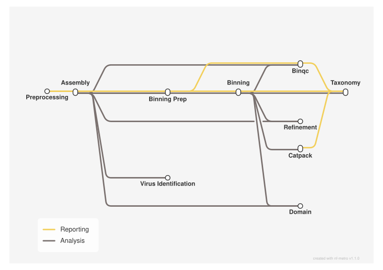

<div class="ox-crumb"><a href="/pipelines/">Pipelines</a> / <span>oxo-flow-mag</span></div>
<div class="ox-detail-cols">
<div>
<h1>Metagenome assembly, binning and taxonomic classification</h1>
<div class="ox-page-badges"><span class="ox-badge ox-badge--live">✔ Live-tested · default-path</span> <span class="ox-badge ox-badge--origin">⇄ Official port</span> <span class="ox-badge ox-badge--nf"><span class="dot"></span>nf-core port</span></div>
<p>Turn paired-end metagenomic reads into quality-checked, taxonomically classified draft genomes: FastQC and fastp QC with phiX removal, SPAdes and MEGAHIT assembly, QUAST and Prodigal assessment, bowtie2 mapping, binning with six binners (MetaBAT2, MaxBin2, CONCOCT, COMEBin, MetaBinner, SemiBin2), BUSCO bin QC, GTDB-Tk classification with a combined summary, PROKKA annotation, ALE evaluation and a final MultiQC report. The default short-read path of nf-core/mag, faithfully ported with the same tool versions and commands. Optional upstream branches are ported as when-gated rules, all off by default: host read removal (config.host_fasta), read normalization (config.bbnorm), adapterremoval/trimmomatic clipping (config.clip_tool), DAS Tool bin refinement (config.refine_bins_dastool), CheckM bin QC (config.run_checkm), CheckM2 bin QC (config.run_checkm2), GUNC contamination QC (config.run_gunc), Tiara domain classification (config.bin_domain_classification), CAT/BAT bin classification (config.cat_db) and virus identification with geNomad (config.run_virus_identification).</p>
</div>
<div>
<div class="ox-glance">
<div class="ox-glance-title">At a glance</div>
<div class="ox-kv"><span class="k">Rating</span><span class="v live">✔ Live-tested · default-path</span></div>
<div class="ox-kv"><span class="k">Rules</span><span class="v">352</span></div>
<div class="ox-kv"><span class="k">Compute</span><span class="v">up to 12 CPUs / 140 GB per rule (defaults 1 thread / 6 GB)</span></div>
<div class="ox-kv"><span class="k">Engine</span><span class="v"><span class="ox-badge ox-badge--nf"><span class="dot"></span>nf-core port</span></span></div>
<div class="ox-kv"><span class="k">Origin</span><span class="v">⇄ Official port</span></div>
<div class="ox-kv"><span class="k">Domain</span><span class="v">metagenomics</span></div>
<div class="ox-kv"><span class="k">Source</span><span class="v"><a href="https://github.com/nf-core/mag">nf-core/mag</a></span></div>
<div class="ox-kv"><span class="k">Pinned version</span><span class="v"><code>5.5.0</code></span></div>
<div class="ox-kv"><span class="k">Ported</span><span class="v">2026-08-15</span></div>
<div class="ox-kv"><span class="k">License</span><span class="v">Apache-2.0</span></div>
<div class="ox-kv"><span class="k">Cite</span><span class="v"><a href="https://doi.org/10.48546/workflowhub.workflow.2281.1"><code>10.48546/workflowhub.workflow.2281.1</code></a></span></div>
<p class="cmd">$ oxo-flow run main.oxoflow</p>
</div>
</div>
</div>

## Run it

```bash
oxo-flow run main.oxoflow
```

Download the GTDB-Tk database (~100 GB), set `config.gtdb_db`, then run — the default config otherwise points at committed test fixtures.

## Installation

**Engine.** oxo-flow >= 0.17.0

**Toolchain.** conda envs — pinned

**Requirements.**

- input: paired-end reads as {sample}_R1.fastq.gz / {sample}_R2.fastq.gz in config.input_dir (default test/fixtures/raw); uniform single-end libraries runnable via config.sample_pattern override; interleaved and mixed-library samplesheets not ported
- compute: up to 12 CPUs / 140 GB RAM per rule (SPAdes 10 CPUs/72 GB/24 h; GTDB-Tk classifywf 2 CPUs/140 GB/12 h; defaults 1 thread/6 GB)
- reference: GTDB-Tk database — download gtdbtk_data.tar.gz (~100 GB) or unpacked directory and set config.gtdb_db (oxo-flow cannot download it mid-run)
- reference: phiX genome FASTA bundled in the repo (assets/data/GCA_002596845.1_ASM259684v1_genomic.fna.gz) — no download needed
- reference (optional): host genome FASTA for config.host_fasta (host read removal branch); CheckM lineage database comes with the conda env (config.run_checkm branch, ~1.1 GB unpacked); Tiara downloads its model on first run (config.bin_domain_classification branch)
- reference (optional, per gated branch): CheckM2 database — checkm2 database --download (~8 GB, config.run_checkm2); GUNC reference database — gunc download_db (~21 GB, config.run_gunc); CAT-nr database — CAT_pack download + prepare, archive or unpacked directory with db/ and tax/ subdirectories (config.cat_db); geNomad database — genomad download-database (~10 GB, config.run_virus_identification); each branch fails fast with a clear message when its database is not set
- software: conda or mamba with the pinned envs/*.yaml environments (one per tool, no container layer)
- optional: disk — hundreds of GB for real datasets (GTDB-Tk database plus per-sample assemblies and bins)

```bash
# 1. install oxo-flow (release binary, recommended)
curl -fL -o oxo-flow.tar.gz https://github.com/Traitome/oxo-flow/releases/latest/download/oxo-flow-latest-x86_64-unknown-linux-gnu.tar.gz
tar xzf oxo-flow.tar.gz && sudo mv oxo-flow /usr/local/bin/
#    or, via conda (may lag behind releases):
#    conda install -c bioconda oxo-flow-cli
#    NOTE: bioconda currently ships 0.10.2, older than the >= 0.12.0
#    minimum of every catalog entry — prefer the release binary.

# 2. get this workflow (clones the repo, auto-discovers the workflow,
#    sanity-parses it with the engine)
oxo-flow pull gh:oxo-flow-community/oxo-flow-mag
#    (alternative: plain git clone)
#    git clone https://github.com/oxo-flow-community/oxo-flow-mag
```

## Parameters

<p class="ox-param-usage">Parameters are consumed by rules through <code>{config.key}</code> placeholders in inputs, outputs, and shells. Set a value in the workflow's <code>[config]</code> section (edit the file), or override at run time with <code>oxo-flow run -e key=value workflow.oxoflow</code> — repeat <code>-e</code> for multiple keys. The list below names the rules that read each key.</p>
<div class="ox-params">
<div class="ox-param">
<div class="ox-param-head"><code>adapterremoval_adapter1</code><span class="ox-param-default">AGATCGGAAGAGCACACGTCTGAACTCCAGTCACNNNNNNATCTCGTATGCCGTCTTCTGCTTG</span></div>
<p class="ox-param-desc">Clipping (upstream params with the same defaults; --clip_tool selects the<br>adapter trimmer, fastp is the upstream default)</p>
<details class="ox-param-usedby"><summary>used by 1 rules</summary>
<div class="ox-param-rules"><code>adapterremoval_pe</code></div>
</details>
</div>
<div class="ox-param">
<div class="ox-param-head"><code>adapterremoval_adapter2</code><span class="ox-param-default">AGATCGGAAGAGCGTCGTGTAGGGAAAGAGTGTAGATCTCGGTGGTCGCCGTATCATT</span></div>
<p class="ox-param-desc">Clipping (upstream params with the same defaults; --clip_tool selects the<br>adapter trimmer, fastp is the upstream default)</p>
<details class="ox-param-usedby"><summary>used by 1 rules</summary>
<div class="ox-param-rules"><code>adapterremoval_pe</code></div>
</details>
</div>
<div class="ox-param">
<div class="ox-param-head"><code>adapterremoval_minquality</code><span class="ox-param-default">2</span></div>
<p class="ox-param-desc">Clipping (upstream params with the same defaults; --clip_tool selects the<br>adapter trimmer, fastp is the upstream default)</p>
<details class="ox-param-usedby"><summary>used by 1 rules</summary>
<div class="ox-param-rules"><code>adapterremoval_pe</code></div>
</details>
</div>
<div class="ox-param">
<div class="ox-param-head"><code>adapterremoval_trim_quality_stretch</code><span class="ox-param-default">false</span></div>
<p class="ox-param-desc">Clipping (upstream params with the same defaults; --clip_tool selects the<br>adapter trimmer, fastp is the upstream default)</p>
<details class="ox-param-usedby"><summary>used by 1 rules</summary>
<div class="ox-param-rules"><code>adapterremoval_pe</code></div>
</details>
</div>
<div class="ox-param ox-param-unused">
<div class="ox-param-head"><code>ale_per_base_output</code><span class="ox-param-default">false</span></div>
<p class="ox-param-desc">ALE (upstream --ale_per_base_output default false -&gt; --metagenome --nout)</p>
<details class="ox-param-usedby"><summary>not referenced by any rule</summary>
<div class="ox-param-rules">A ported upstream parameter kept for compatibility: no rule reads this key (no <code>{config.*}</code> placeholder in any input, output, or shell), so overriding it has no effect on this workflow.</div>
</details>
</div>
<div class="ox-param">
<div class="ox-param-head"><code>bbnorm</code><span class="ox-param-default">false</span></div>
<p class="ox-param-desc">Read normalization (upstream --bbnorm; runs between phiX removal and assembly)</p>
<details class="ox-param-usedby"><summary>used by 1 rules</summary>
<div class="ox-param-rules"><code>bbnorm</code></div>
</details>
</div>
<div class="ox-param">
<div class="ox-param-head"><code>bbnorm_min</code><span class="ox-param-default">5</span></div>
<p class="ox-param-desc">Read normalization (upstream --bbnorm; runs between phiX removal and assembly)</p>
<details class="ox-param-usedby"><summary>used by 1 rules</summary>
<div class="ox-param-rules"><code>bbnorm</code></div>
</details>
</div>
<div class="ox-param">
<div class="ox-param-head"><code>bbnorm_target</code><span class="ox-param-default">100</span></div>
<p class="ox-param-desc">Read normalization (upstream --bbnorm; runs between phiX removal and assembly)</p>
<details class="ox-param-usedby"><summary>used by 1 rules</summary>
<div class="ox-param-rules"><code>bbnorm</code></div>
</details>
</div>
<div class="ox-param">
<div class="ox-param-head"><code>bin_concoct_chunksize</code><span class="ox-param-default">10000</span></div>
<p class="ox-param-desc">Binning options (upstream params with the same defaults)</p>
<details class="ox-param-usedby"><summary>used by 2 rules</summary>
<div class="ox-param-rules"><code>concoct_cutup_megahit</code> <code>concoct_cutup_spades</code></div>
</details>
</div>
<div class="ox-param ox-param-unused">
<div class="ox-param-head"><code>bin_concoct_donotconcatlast</code><span class="ox-param-default">false</span></div>
<p class="ox-param-desc">Binning options (upstream params with the same defaults)</p>
<details class="ox-param-usedby"><summary>not referenced by any rule</summary>
<div class="ox-param-rules">A ported upstream parameter kept for compatibility: no rule reads this key (no <code>{config.*}</code> placeholder in any input, output, or shell), so overriding it has no effect on this workflow.</div>
</details>
</div>
<div class="ox-param">
<div class="ox-param-head"><code>bin_concoct_overlap</code><span class="ox-param-default">0</span></div>
<p class="ox-param-desc">Binning options (upstream params with the same defaults)</p>
<details class="ox-param-usedby"><summary>used by 2 rules</summary>
<div class="ox-param-rules"><code>concoct_cutup_megahit</code> <code>concoct_cutup_spades</code></div>
</details>
</div>
<div class="ox-param">
<div class="ox-param-head"><code>bin_domain_classification</code><span class="ox-param-default">false</span></div>
<p class="ox-param-desc">Domain classification with Tiara (upstream --bin_domain_classification / --tiara_min_length)</p>
<details class="ox-param-usedby"><summary>used by 39 rules</summary>
<div class="ox-param-rules"><code>concat_tiara_tsv</code> <code>fastatocontig2bin_tiara_megahit_comebin_bins</code> <code>fastatocontig2bin_tiara_megahit_concoct_bins</code> <code>fastatocontig2bin_tiara_megahit_maxbin2_bins</code> <code>fastatocontig2bin_tiara_megahit_maxbin2_unbins</code> <code>fastatocontig2bin_tiara_megahit_metabat2_bins</code> <code>fastatocontig2bin_tiara_megahit_metabat2_unbins</code> <code>fastatocontig2bin_tiara_megahit_metabinner_bins</code> <code>fastatocontig2bin_tiara_megahit_metabinner_unbins</code> <code>fastatocontig2bin_tiara_megahit_semibin2_bins</code> <code>fastatocontig2bin_tiara_spades_comebin_bins</code> <code>fastatocontig2bin_tiara_spades_concoct_bins</code> <code>fastatocontig2bin_tiara_spades_maxbin2_bins</code> <code>fastatocontig2bin_tiara_spades_maxbin2_unbins</code> <code>fastatocontig2bin_tiara_spades_metabat2_bins</code> <code>fastatocontig2bin_tiara_spades_metabat2_unbins</code> <code>fastatocontig2bin_tiara_spades_metabinner_bins</code> <code>fastatocontig2bin_tiara_spades_metabinner_unbins</code> <code>fastatocontig2bin_tiara_spades_semibin2_bins</code> <code>tiara_classify_megahit_comebin_bins</code> <code>tiara_classify_megahit_concoct_bins</code> <code>tiara_classify_megahit_maxbin2_bins</code> <code>tiara_classify_megahit_maxbin2_unbins</code> <code>tiara_classify_megahit_metabat2_bins</code> <code>tiara_classify_megahit_metabat2_unbins</code> <code>tiara_classify_megahit_metabinner_bins</code> <code>tiara_classify_megahit_metabinner_unbins</code> <code>tiara_classify_megahit_semibin2_bins</code> <code>tiara_classify_spades_comebin_bins</code> <code>tiara_classify_spades_concoct_bins</code> <code>tiara_classify_spades_maxbin2_bins</code> <code>tiara_classify_spades_maxbin2_unbins</code> <code>tiara_classify_spades_metabat2_bins</code> <code>tiara_classify_spades_metabat2_unbins</code> <code>tiara_classify_spades_metabinner_bins</code> <code>tiara_classify_spades_metabinner_unbins</code> <code>tiara_classify_spades_semibin2_bins</code> <code>tiara_tiara_megahit</code> <code>tiara_tiara_spades</code></div>
</details>
</div>
<div class="ox-param ox-param-unused">
<div class="ox-param-head"><code>bin_max_size</code><span class="ox-param-default"></span></div>
<p class="ox-param-desc">Bin size filtering (upstream --bin_min_size / --bin_max_size; defaults<br>0/null make the seqkit-based filter a no-op)</p>
<details class="ox-param-usedby"><summary>not referenced by any rule</summary>
<div class="ox-param-rules">A ported upstream parameter kept for compatibility: no rule reads this key (no <code>{config.*}</code> placeholder in any input, output, or shell), so overriding it has no effect on this workflow.</div>
</details>
</div>
<div class="ox-param">
<div class="ox-param-head"><code>bin_metabinner_scale</code><span class="ox-param-default">large</span></div>
<p class="ox-param-desc">Binning options (upstream params with the same defaults)</p>
<details class="ox-param-usedby"><summary>used by 2 rules</summary>
<div class="ox-param-rules"><code>metabinner_run_megahit</code> <code>metabinner_run_spades</code></div>
</details>
</div>
<div class="ox-param ox-param-unused">
<div class="ox-param-head"><code>bin_min_size</code><span class="ox-param-default">0</span></div>
<p class="ox-param-desc">Bin size filtering (upstream --bin_min_size / --bin_max_size; defaults<br>0/null make the seqkit-based filter a no-op)</p>
<details class="ox-param-usedby"><summary>not referenced by any rule</summary>
<div class="ox-param-rules">A ported upstream parameter kept for compatibility: no rule reads this key (no <code>{config.*}</code> placeholder in any input, output, or shell), so overriding it has no effect on this workflow.</div>
</details>
</div>
<div class="ox-param">
<div class="ox-param-head"><code>cat_allow_unofficial_lineages</code><span class="ox-param-default">false</span></div>
<p class="ox-param-desc">CAT/BAT bin classification (upstream --cat_db; the CAT_prepare database<br>is user-provided — CAT_pack download + prepare, or the archive/directory<br>itself; db/ and tax/ directories are discovered inside it)</p>
<details class="ox-param-usedby"><summary>used by 24 rules</summary>
<div class="ox-param-rules"><code>catpack_addnames_megahit_comebin</code> <code>catpack_addnames_megahit_concoct</code> <code>catpack_addnames_megahit_maxbin2</code> <code>catpack_addnames_megahit_metabat2</code> <code>catpack_addnames_megahit_metabinner</code> <code>catpack_addnames_megahit_semibin2</code> <code>catpack_addnames_spades_comebin</code> <code>catpack_addnames_spades_concoct</code> <code>catpack_addnames_spades_maxbin2</code> <code>catpack_addnames_spades_metabat2</code> <code>catpack_addnames_spades_metabinner</code> <code>catpack_addnames_spades_semibin2</code> <code>catpack_summarise_megahit_comebin</code> <code>catpack_summarise_megahit_concoct</code> <code>catpack_summarise_megahit_maxbin2</code> <code>catpack_summarise_megahit_metabat2</code> <code>catpack_summarise_megahit_metabinner</code> <code>catpack_summarise_megahit_semibin2</code> <code>catpack_summarise_spades_comebin</code> <code>catpack_summarise_spades_concoct</code> <code>catpack_summarise_spades_maxbin2</code> <code>catpack_summarise_spades_metabat2</code> <code>catpack_summarise_spades_metabinner</code> <code>catpack_summarise_spades_semibin2</code></div>
</details>
</div>
<div class="ox-param">
<div class="ox-param-head"><code>cat_db</code><span class="ox-param-default"></span></div>
<p class="ox-param-desc">CAT/BAT bin classification (upstream --cat_db; the CAT_prepare database<br>is user-provided — CAT_pack download + prepare, or the archive/directory<br>itself; db/ and tax/ directories are discovered inside it)</p>
<details class="ox-param-usedby"><summary>used by 38 rules</summary>
<div class="ox-param-rules"><code>cat_db_preparation</code> <code>catpack_addnames_megahit_comebin</code> <code>catpack_addnames_megahit_concoct</code> <code>catpack_addnames_megahit_maxbin2</code> <code>catpack_addnames_megahit_metabat2</code> <code>catpack_addnames_megahit_metabinner</code> <code>catpack_addnames_megahit_semibin2</code> <code>catpack_addnames_spades_comebin</code> <code>catpack_addnames_spades_concoct</code> <code>catpack_addnames_spades_maxbin2</code> <code>catpack_addnames_spades_metabat2</code> <code>catpack_addnames_spades_metabinner</code> <code>catpack_addnames_spades_semibin2</code> <code>catpack_bat_summary</code> <code>catpack_bins_megahit_comebin</code> <code>catpack_bins_megahit_concoct</code> <code>catpack_bins_megahit_maxbin2</code> <code>catpack_bins_megahit_metabat2</code> <code>catpack_bins_megahit_metabinner</code> <code>catpack_bins_megahit_semibin2</code> <code>catpack_bins_spades_comebin</code> <code>catpack_bins_spades_concoct</code> <code>catpack_bins_spades_maxbin2</code> <code>catpack_bins_spades_metabat2</code> <code>catpack_bins_spades_metabinner</code> <code>catpack_bins_spades_semibin2</code> <code>catpack_summarise_megahit_comebin</code> <code>catpack_summarise_megahit_concoct</code> <code>catpack_summarise_megahit_maxbin2</code> <code>catpack_summarise_megahit_metabat2</code> <code>catpack_summarise_megahit_metabinner</code> <code>catpack_summarise_megahit_semibin2</code> <code>catpack_summarise_spades_comebin</code> <code>catpack_summarise_spades_concoct</code> <code>catpack_summarise_spades_maxbin2</code> <code>catpack_summarise_spades_metabat2</code> <code>catpack_summarise_spades_metabinner</code> <code>catpack_summarise_spades_semibin2</code></div>
</details>
</div>
<div class="ox-param">
<div class="ox-param-head"><code>checkm2_db</code><span class="ox-param-default"></span></div>
<p class="ox-param-desc">CheckM2 bin QC (upstream --run_checkm2; the ~10GB .dmnd database is<br>user-provided — checkm2 database --download; fails fast when empty)</p>
<details class="ox-param-usedby"><summary>used by 12 rules</summary>
<div class="ox-param-rules"><code>checkm2_megahit_comebin</code> <code>checkm2_megahit_concoct</code> <code>checkm2_megahit_maxbin2</code> <code>checkm2_megahit_metabat2</code> <code>checkm2_megahit_metabinner</code> <code>checkm2_megahit_semibin2</code> <code>checkm2_spades_comebin</code> <code>checkm2_spades_concoct</code> <code>checkm2_spades_maxbin2</code> <code>checkm2_spades_metabat2</code> <code>checkm2_spades_metabinner</code> <code>checkm2_spades_semibin2</code></div>
</details>
</div>
<div class="ox-param">
<div class="ox-param-head"><code>checkm_db</code><span class="ox-param-default"></span></div>
<p class="ox-param-desc">CheckM bin QC (upstream --run_checkm; the 1.1GB lineage database is<br>downloaded at env creation and unpacked at run time — see README)</p>
<details class="ox-param-usedby"><summary>used by 24 rules</summary>
<div class="ox-param-rules"><code>checkm_lineagewf_megahit_comebin</code> <code>checkm_lineagewf_megahit_concoct</code> <code>checkm_lineagewf_megahit_maxbin2</code> <code>checkm_lineagewf_megahit_metabat2</code> <code>checkm_lineagewf_megahit_metabinner</code> <code>checkm_lineagewf_megahit_semibin2</code> <code>checkm_lineagewf_spades_comebin</code> <code>checkm_lineagewf_spades_concoct</code> <code>checkm_lineagewf_spades_maxbin2</code> <code>checkm_lineagewf_spades_metabat2</code> <code>checkm_lineagewf_spades_metabinner</code> <code>checkm_lineagewf_spades_semibin2</code> <code>checkm_qa_megahit_comebin</code> <code>checkm_qa_megahit_concoct</code> <code>checkm_qa_megahit_maxbin2</code> <code>checkm_qa_megahit_metabat2</code> <code>checkm_qa_megahit_metabinner</code> <code>checkm_qa_megahit_semibin2</code> <code>checkm_qa_spades_comebin</code> <code>checkm_qa_spades_concoct</code> <code>checkm_qa_spades_maxbin2</code> <code>checkm_qa_spades_metabat2</code> <code>checkm_qa_spades_metabinner</code> <code>checkm_qa_spades_semibin2</code></div>
</details>
</div>
<div class="ox-param">
<div class="ox-param-head"><code>clip_tool</code><span class="ox-param-default">fastp</span></div>
<p class="ox-param-desc">Clipping (upstream params with the same defaults; --clip_tool selects the<br>adapter trimmer, fastp is the upstream default)</p>
<details class="ox-param-usedby"><summary>used by 3 rules</summary>
<div class="ox-param-rules"><code>adapterremoval_pe</code> <code>fastp</code> <code>trimmomatic</code></div>
</details>
</div>
<div class="ox-param">
<div class="ox-param-head"><code>cohort_samples</code><span class="ox-param-default">S1 S2</span></div>
<p class="ox-param-desc">Space-separated list of sample ids used by the binning-preparation<br>bowtie2 alignment rules (binning_map_mode=&#x27;group&#x27;: every assembly is<br>aligned against every sample&#x27;s reads). Keep in sync with the sample<br>group below.</p>
<details class="ox-param-usedby"><summary>used by 4 rules</summary>
<div class="ox-param-rules"><code>bowtie2_align_megahit</code> <code>bowtie2_align_spades</code> <code>semibin_megahit</code> <code>semibin_spades</code></div>
</details>
</div>
<div class="ox-param">
<div class="ox-param-head"><code>fastp_cut_mean_quality</code><span class="ox-param-default">15</span></div>
<p class="ox-param-desc">Clipping (upstream params with the same defaults; --clip_tool selects the<br>adapter trimmer, fastp is the upstream default)</p>
<details class="ox-param-usedby"><summary>used by 1 rules</summary>
<div class="ox-param-rules"><code>fastp</code></div>
</details>
</div>
<div class="ox-param">
<div class="ox-param-head"><code>fastp_qualified_quality</code><span class="ox-param-default">15</span></div>
<p class="ox-param-desc">Clipping (upstream params with the same defaults; --clip_tool selects the<br>adapter trimmer, fastp is the upstream default)</p>
<details class="ox-param-usedby"><summary>used by 1 rules</summary>
<div class="ox-param-rules"><code>fastp</code></div>
</details>
</div>
<div class="ox-param">
<div class="ox-param-head"><code>fastp_trim_polyg</code><span class="ox-param-default">false</span></div>
<p class="ox-param-desc">Clipping (upstream params with the same defaults; --clip_tool selects the<br>adapter trimmer, fastp is the upstream default)</p>
<details class="ox-param-usedby"><summary>used by 1 rules</summary>
<div class="ox-param-rules"><code>fastp</code></div>
</details>
</div>
<div class="ox-param">
<div class="ox-param-head"><code>genomad_db</code><span class="ox-param-default"></span></div>
<p class="ox-param-desc">Virus identification (upstream --run_virus_identification; the geNomad<br>database is user-provided — genomad download-database; fails fast when empty)</p>
<details class="ox-param-usedby"><summary>used by 3 rules</summary>
<div class="ox-param-rules"><code>genomad_db_preparation</code> <code>genomad_megahit</code> <code>genomad_spades</code></div>
</details>
</div>
<div class="ox-param">
<div class="ox-param-head"><code>gtdb_db</code><span class="ox-param-default"></span></div>
<p class="ox-param-desc">GTDB-Tk database: local path to the release .tar.gz or an unpacked<br>directory (upstream --gtdb_db, ~100GB). oxo-flow cannot download it<br>mid-run (the prep rule only unpacks), so the default is empty and<br>run_gtdbtk=true fails fast until a local path is set.</p>
<details class="ox-param-usedby"><summary>used by 1 rules</summary>
<div class="ox-param-rules"><code>gtdbtk_db_preparation</code></div>
</details>
</div>
<div class="ox-param">
<div class="ox-param-head"><code>gtdbtk_max_contamination</code><span class="ox-param-default">10.0</span></div>
<p class="ox-param-desc">GTDB-Tk (upstream params with the same defaults)</p>
<details class="ox-param-usedby"><summary>used by 12 rules</summary>
<div class="ox-param-rules"><code>gtdbtk_megahit_comebin</code> <code>gtdbtk_megahit_concoct</code> <code>gtdbtk_megahit_maxbin2</code> <code>gtdbtk_megahit_metabat2</code> <code>gtdbtk_megahit_metabinner</code> <code>gtdbtk_megahit_semibin2</code> <code>gtdbtk_spades_comebin</code> <code>gtdbtk_spades_concoct</code> <code>gtdbtk_spades_maxbin2</code> <code>gtdbtk_spades_metabat2</code> <code>gtdbtk_spades_metabinner</code> <code>gtdbtk_spades_semibin2</code></div>
</details>
</div>
<div class="ox-param">
<div class="ox-param-head"><code>gtdbtk_min_af</code><span class="ox-param-default">0.65</span></div>
<p class="ox-param-desc">GTDB-Tk (upstream params with the same defaults)</p>
<details class="ox-param-usedby"><summary>used by 12 rules</summary>
<div class="ox-param-rules"><code>gtdbtk_megahit_comebin</code> <code>gtdbtk_megahit_concoct</code> <code>gtdbtk_megahit_maxbin2</code> <code>gtdbtk_megahit_metabat2</code> <code>gtdbtk_megahit_metabinner</code> <code>gtdbtk_megahit_semibin2</code> <code>gtdbtk_spades_comebin</code> <code>gtdbtk_spades_concoct</code> <code>gtdbtk_spades_maxbin2</code> <code>gtdbtk_spades_metabat2</code> <code>gtdbtk_spades_metabinner</code> <code>gtdbtk_spades_semibin2</code></div>
</details>
</div>
<div class="ox-param">
<div class="ox-param-head"><code>gtdbtk_min_completeness</code><span class="ox-param-default">50.0</span></div>
<p class="ox-param-desc">GTDB-Tk (upstream params with the same defaults)</p>
<details class="ox-param-usedby"><summary>used by 12 rules</summary>
<div class="ox-param-rules"><code>gtdbtk_megahit_comebin</code> <code>gtdbtk_megahit_concoct</code> <code>gtdbtk_megahit_maxbin2</code> <code>gtdbtk_megahit_metabat2</code> <code>gtdbtk_megahit_metabinner</code> <code>gtdbtk_megahit_semibin2</code> <code>gtdbtk_spades_comebin</code> <code>gtdbtk_spades_concoct</code> <code>gtdbtk_spades_maxbin2</code> <code>gtdbtk_spades_metabat2</code> <code>gtdbtk_spades_metabinner</code> <code>gtdbtk_spades_semibin2</code></div>
</details>
</div>
<div class="ox-param">
<div class="ox-param-head"><code>gtdbtk_min_perc_aa</code><span class="ox-param-default">10</span></div>
<p class="ox-param-desc">GTDB-Tk (upstream params with the same defaults)</p>
<details class="ox-param-usedby"><summary>used by 12 rules</summary>
<div class="ox-param-rules"><code>gtdbtk_megahit_comebin</code> <code>gtdbtk_megahit_concoct</code> <code>gtdbtk_megahit_maxbin2</code> <code>gtdbtk_megahit_metabat2</code> <code>gtdbtk_megahit_metabinner</code> <code>gtdbtk_megahit_semibin2</code> <code>gtdbtk_spades_comebin</code> <code>gtdbtk_spades_concoct</code> <code>gtdbtk_spades_maxbin2</code> <code>gtdbtk_spades_metabat2</code> <code>gtdbtk_spades_metabinner</code> <code>gtdbtk_spades_semibin2</code></div>
</details>
</div>
<div class="ox-param ox-param-unused">
<div class="ox-param-head"><code>gtdbtk_place_species</code><span class="ox-param-default">false</span></div>
<p class="ox-param-desc">GTDB-Tk (upstream params with the same defaults)</p>
<details class="ox-param-usedby"><summary>not referenced by any rule</summary>
<div class="ox-param-rules">A ported upstream parameter kept for compatibility: no rule reads this key (no <code>{config.*}</code> placeholder in any input, output, or shell), so overriding it has no effect on this workflow.</div>
</details>
</div>
<div class="ox-param">
<div class="ox-param-head"><code>gtdbtk_pplacer_cpus</code><span class="ox-param-default">1</span></div>
<p class="ox-param-desc">GTDB-Tk (upstream params with the same defaults)</p>
<details class="ox-param-usedby"><summary>used by 12 rules</summary>
<div class="ox-param-rules"><code>gtdbtk_megahit_comebin</code> <code>gtdbtk_megahit_concoct</code> <code>gtdbtk_megahit_maxbin2</code> <code>gtdbtk_megahit_metabat2</code> <code>gtdbtk_megahit_metabinner</code> <code>gtdbtk_megahit_semibin2</code> <code>gtdbtk_spades_comebin</code> <code>gtdbtk_spades_concoct</code> <code>gtdbtk_spades_maxbin2</code> <code>gtdbtk_spades_metabat2</code> <code>gtdbtk_spades_metabinner</code> <code>gtdbtk_spades_semibin2</code></div>
</details>
</div>
<div class="ox-param ox-param-unused">
<div class="ox-param-head"><code>gtdbtk_use_full_tree</code><span class="ox-param-default">false</span></div>
<p class="ox-param-desc">GTDB-Tk (upstream params with the same defaults)</p>
<details class="ox-param-usedby"><summary>not referenced by any rule</summary>
<div class="ox-param-rules">A ported upstream parameter kept for compatibility: no rule reads this key (no <code>{config.*}</code> placeholder in any input, output, or shell), so overriding it has no effect on this workflow.</div>
</details>
</div>
<div class="ox-param">
<div class="ox-param-head"><code>gunc_db</code><span class="ox-param-default"></span></div>
<p class="ox-param-desc">GUNC contamination QC (upstream --run_gunc; the reference database is<br>user-provided — gunc download_db; fails fast when empty)</p>
<details class="ox-param-usedby"><summary>used by 12 rules</summary>
<div class="ox-param-rules"><code>gunc_megahit_comebin</code> <code>gunc_megahit_concoct</code> <code>gunc_megahit_maxbin2</code> <code>gunc_megahit_metabat2</code> <code>gunc_megahit_metabinner</code> <code>gunc_megahit_semibin2</code> <code>gunc_spades_comebin</code> <code>gunc_spades_concoct</code> <code>gunc_spades_maxbin2</code> <code>gunc_spades_metabat2</code> <code>gunc_spades_metabinner</code> <code>gunc_spades_semibin2</code></div>
</details>
</div>
<div class="ox-param">
<div class="ox-param-head"><code>host_fasta</code><span class="ox-param-default"></span></div>
<p class="ox-param-desc">Host read removal (upstream --host_fasta / --host_fasta_bowtie2index; the<br>reference fasta is required, the prebuilt bowtie2 index is optional and<br>skips the build rule)</p>
<details class="ox-param-usedby"><summary>used by 2 rules</summary>
<div class="ox-param-rules"><code>host_removal_align</code> <code>host_removal_build</code></div>
</details>
</div>
<div class="ox-param">
<div class="ox-param-head"><code>host_fasta_bowtie2index</code><span class="ox-param-default"></span></div>
<p class="ox-param-desc">Host read removal (upstream --host_fasta / --host_fasta_bowtie2index; the<br>reference fasta is required, the prebuilt bowtie2 index is optional and<br>skips the build rule)</p>
<details class="ox-param-usedby"><summary>used by 2 rules</summary>
<div class="ox-param-rules"><code>host_removal_align</code> <code>host_removal_build</code></div>
</details>
</div>
<div class="ox-param">
<div class="ox-param-head"><code>host_removal_verysensitive</code><span class="ox-param-default">false</span></div>
<p class="ox-param-desc">Host read removal (upstream --host_fasta / --host_fasta_bowtie2index; the<br>reference fasta is required, the prebuilt bowtie2 index is optional and<br>skips the build rule)</p>
<details class="ox-param-usedby"><summary>used by 1 rules</summary>
<div class="ox-param-rules"><code>host_removal_align</code></div>
</details>
</div>
<div class="ox-param">
<div class="ox-param-head"><code>input_dir</code><span class="ox-param-default">test/fixtures/raw</span></div>
<p class="ox-param-desc">Input directory containing {sample}_R1.fastq.gz / {sample}_R2.fastq.gz<br>paired-end read files (upstream --input samplesheet; single-end and<br>multi-library lanes are not ported). The repo default ships tiny test<br>fixtures; point this at your data.</p>
<details class="ox-param-usedby"><summary>used by 4 rules</summary>
<div class="ox-param-rules"><code>adapterremoval_pe</code> <code>fastp</code> <code>fastqc_raw</code> <code>trimmomatic</code></div>
</details>
</div>
<div class="ox-param">
<div class="ox-param-head"><code>max_unbinned_contigs</code><span class="ox-param-default">100</span></div>
<p class="ox-param-desc">Bin size filtering (upstream --bin_min_size / --bin_max_size; defaults<br>0/null make the seqkit-based filter a no-op)</p>
<details class="ox-param-usedby"><summary>used by 6 rules</summary>
<div class="ox-param-rules"><code>split_fasta_maxbin2_megahit</code> <code>split_fasta_maxbin2_spades</code> <code>split_fasta_metabat2_megahit</code> <code>split_fasta_metabat2_spades</code> <code>split_fasta_metabinner_megahit</code> <code>split_fasta_metabinner_spades</code></div>
</details>
</div>
<div class="ox-param">
<div class="ox-param-head"><code>metabat_rng_seed</code><span class="ox-param-default">1</span></div>
<p class="ox-param-desc">Binning options (upstream params with the same defaults)</p>
<details class="ox-param-usedby"><summary>used by 2 rules</summary>
<div class="ox-param-rules"><code>metabat2_megahit</code> <code>metabat2_spades</code></div>
</details>
</div>
<div class="ox-param">
<div class="ox-param-head"><code>min_contig_size</code><span class="ox-param-default">1500</span></div>
<p class="ox-param-desc">Bin size filtering (upstream --bin_min_size / --bin_max_size; defaults<br>0/null make the seqkit-based filter a no-op)</p>
<details class="ox-param-usedby"><summary>used by 18 rules</summary>
<div class="ox-param-rules"><code>metabat2_megahit</code> <code>metabat2_spades</code> <code>metabinner_bins_megahit</code> <code>metabinner_bins_spades</code> <code>metabinner_kmer_megahit</code> <code>metabinner_kmer_spades</code> <code>metabinner_run_megahit</code> <code>metabinner_run_spades</code> <code>metabinner_tooshort_megahit</code> <code>metabinner_tooshort_spades</code> <code>semibin_megahit</code> <code>semibin_spades</code> <code>split_fasta_maxbin2_megahit</code> <code>split_fasta_maxbin2_spades</code> <code>split_fasta_metabat2_megahit</code> <code>split_fasta_metabat2_spades</code> <code>split_fasta_metabinner_megahit</code> <code>split_fasta_metabinner_spades</code></div>
</details>
</div>
<div class="ox-param">
<div class="ox-param-head"><code>min_length_unbinned_contigs</code><span class="ox-param-default">1000000</span></div>
<p class="ox-param-desc">Bin size filtering (upstream --bin_min_size / --bin_max_size; defaults<br>0/null make the seqkit-based filter a no-op)</p>
<details class="ox-param-usedby"><summary>used by 6 rules</summary>
<div class="ox-param-rules"><code>split_fasta_maxbin2_megahit</code> <code>split_fasta_maxbin2_spades</code> <code>split_fasta_metabat2_megahit</code> <code>split_fasta_metabat2_spades</code> <code>split_fasta_metabinner_megahit</code> <code>split_fasta_metabinner_spades</code></div>
</details>
</div>
<div class="ox-param">
<div class="ox-param-head"><code>out_dir</code><span class="ox-param-default">results</span></div>
<p class="ox-param-desc">Input directory containing {sample}_R1.fastq.gz / {sample}_R2.fastq.gz<br>paired-end read files (upstream --input samplesheet; single-end and<br>multi-library lanes are not ported). The repo default ships tiny test<br>fixtures; point this at your data.</p>
<details class="ox-param-usedby"><summary>used by 276 rules</summary>
<div class="ox-param-rules"><code>adapterremoval_pe</code> <code>ale_megahit</code> <code>ale_spades</code> <code>bbnorm</code> <code>bin_summary</code> <code>bowtie2_align_megahit</code> <code>bowtie2_align_spades</code> <code>busco_megahit_comebin</code> <code>busco_megahit_concoct</code> <code>busco_megahit_maxbin2</code> <code>busco_megahit_metabat2</code> <code>busco_megahit_metabinner</code> <code>busco_megahit_semibin2</code> <code>busco_spades_comebin</code> <code>busco_spades_concoct</code> <code>busco_spades_maxbin2</code> <code>busco_spades_metabat2</code> <code>busco_spades_metabinner</code> <code>busco_spades_semibin2</code> <code>catpack_addnames_megahit_comebin</code> <code>catpack_addnames_megahit_concoct</code> <code>catpack_addnames_megahit_maxbin2</code> <code>catpack_addnames_megahit_metabat2</code> <code>catpack_addnames_megahit_metabinner</code> <code>catpack_addnames_megahit_semibin2</code> <code>catpack_addnames_spades_comebin</code> <code>catpack_addnames_spades_concoct</code> <code>catpack_addnames_spades_maxbin2</code> <code>catpack_addnames_spades_metabat2</code> <code>catpack_addnames_spades_metabinner</code> <code>catpack_addnames_spades_semibin2</code> <code>catpack_bat_summary</code> <code>catpack_bins_megahit_comebin</code> <code>catpack_bins_megahit_concoct</code> <code>catpack_bins_megahit_maxbin2</code> <code>catpack_bins_megahit_metabat2</code> <code>catpack_bins_megahit_metabinner</code> <code>catpack_bins_megahit_semibin2</code> <code>catpack_bins_spades_comebin</code> <code>catpack_bins_spades_concoct</code> <code>catpack_bins_spades_maxbin2</code> <code>catpack_bins_spades_metabat2</code> <code>catpack_bins_spades_metabinner</code> <code>catpack_bins_spades_semibin2</code> <code>catpack_summarise_megahit_comebin</code> <code>catpack_summarise_megahit_concoct</code> <code>catpack_summarise_megahit_maxbin2</code> <code>catpack_summarise_megahit_metabat2</code> <code>catpack_summarise_megahit_metabinner</code> <code>catpack_summarise_megahit_semibin2</code> <code>catpack_summarise_spades_comebin</code> <code>catpack_summarise_spades_concoct</code> <code>catpack_summarise_spades_maxbin2</code> <code>catpack_summarise_spades_metabat2</code> <code>catpack_summarise_spades_metabinner</code> <code>catpack_summarise_spades_semibin2</code> <code>checkm2_megahit_comebin</code> <code>checkm2_megahit_concoct</code> <code>checkm2_megahit_maxbin2</code> <code>checkm2_megahit_metabat2</code> <code>checkm2_megahit_metabinner</code> <code>checkm2_megahit_semibin2</code> <code>checkm2_spades_comebin</code> <code>checkm2_spades_concoct</code> <code>checkm2_spades_maxbin2</code> <code>checkm2_spades_metabat2</code> <code>checkm2_spades_metabinner</code> <code>checkm2_spades_semibin2</code> <code>checkm_lineagewf_megahit_comebin</code> <code>checkm_lineagewf_megahit_concoct</code> <code>checkm_lineagewf_megahit_maxbin2</code> <code>checkm_lineagewf_megahit_metabat2</code> <code>checkm_lineagewf_megahit_metabinner</code> <code>checkm_lineagewf_megahit_semibin2</code> <code>checkm_lineagewf_spades_comebin</code> <code>checkm_lineagewf_spades_concoct</code> <code>checkm_lineagewf_spades_maxbin2</code> <code>checkm_lineagewf_spades_metabat2</code> <code>checkm_lineagewf_spades_metabinner</code> <code>checkm_lineagewf_spades_semibin2</code> <code>checkm_qa_megahit_comebin</code> <code>checkm_qa_megahit_concoct</code> <code>checkm_qa_megahit_maxbin2</code> <code>checkm_qa_megahit_metabat2</code> <code>checkm_qa_megahit_metabinner</code> <code>checkm_qa_megahit_semibin2</code> <code>checkm_qa_spades_comebin</code> <code>checkm_qa_spades_concoct</code> <code>checkm_qa_spades_maxbin2</code> <code>checkm_qa_spades_metabat2</code> <code>checkm_qa_spades_metabinner</code> <code>checkm_qa_spades_semibin2</code> <code>comebin_megahit</code> <code>comebin_spades</code> <code>concat_busco</code> <code>concat_checkm2_tsv</code> <code>concat_checkm_tsv</code> <code>concat_gunc_checkm_tsv</code> <code>concat_gunc_tsv</code> <code>concat_quast</code> <code>concat_tiara_tsv</code> <code>concoct_extract_megahit</code> <code>concoct_extract_spades</code> <code>concoct_merge_megahit</code> <code>concoct_merge_spades</code> <code>dastool_dastool_megahit</code> <code>dastool_dastool_spades</code> <code>dastool_rename_post_megahit</code> <code>dastool_rename_post_spades</code> <code>dastool_rename_pre_megahit_comebin</code> <code>dastool_rename_pre_megahit_concoct</code> <code>dastool_rename_pre_megahit_maxbin2</code> <code>dastool_rename_pre_megahit_metabat2</code> <code>dastool_rename_pre_megahit_metabinner</code> <code>dastool_rename_pre_megahit_semibin2</code> <code>dastool_rename_pre_spades_comebin</code> <code>dastool_rename_pre_spades_concoct</code> <code>dastool_rename_pre_spades_maxbin2</code> <code>dastool_rename_pre_spades_metabat2</code> <code>dastool_rename_pre_spades_metabinner</code> <code>dastool_rename_pre_spades_semibin2</code> <code>depths_megahit</code> <code>depths_spades</code> <code>fastatocontig2bin_tiara_megahit_comebin_bins</code> <code>fastatocontig2bin_tiara_megahit_concoct_bins</code> <code>fastatocontig2bin_tiara_megahit_maxbin2_bins</code> <code>fastatocontig2bin_tiara_megahit_maxbin2_unbins</code> <code>fastatocontig2bin_tiara_megahit_metabat2_bins</code> <code>fastatocontig2bin_tiara_megahit_metabat2_unbins</code> <code>fastatocontig2bin_tiara_megahit_metabinner_bins</code> <code>fastatocontig2bin_tiara_megahit_metabinner_unbins</code> <code>fastatocontig2bin_tiara_megahit_semibin2_bins</code> <code>fastatocontig2bin_tiara_spades_comebin_bins</code> <code>fastatocontig2bin_tiara_spades_concoct_bins</code> <code>fastatocontig2bin_tiara_spades_maxbin2_bins</code> <code>fastatocontig2bin_tiara_spades_maxbin2_unbins</code> <code>fastatocontig2bin_tiara_spades_metabat2_bins</code> <code>fastatocontig2bin_tiara_spades_metabat2_unbins</code> <code>fastatocontig2bin_tiara_spades_metabinner_bins</code> <code>fastatocontig2bin_tiara_spades_metabinner_unbins</code> <code>fastatocontig2bin_tiara_spades_semibin2_bins</code> <code>fastp</code> <code>fastqc_raw</code> <code>fastqc_trimmed</code> <code>genomad_megahit</code> <code>genomad_spades</code> <code>gtdbtk_megahit_comebin</code> <code>gtdbtk_megahit_concoct</code> <code>gtdbtk_megahit_maxbin2</code> <code>gtdbtk_megahit_metabat2</code> <code>gtdbtk_megahit_metabinner</code> <code>gtdbtk_megahit_semibin2</code> <code>gtdbtk_spades_comebin</code> <code>gtdbtk_spades_concoct</code> <code>gtdbtk_spades_maxbin2</code> <code>gtdbtk_spades_metabat2</code> <code>gtdbtk_spades_metabinner</code> <code>gtdbtk_spades_semibin2</code> <code>gtdbtk_summary</code> <code>gunc_megahit_comebin</code> <code>gunc_megahit_concoct</code> <code>gunc_megahit_maxbin2</code> <code>gunc_megahit_metabat2</code> <code>gunc_megahit_metabinner</code> <code>gunc_megahit_semibin2</code> <code>gunc_mergecheckm_megahit_comebin</code> <code>gunc_mergecheckm_megahit_concoct</code> <code>gunc_mergecheckm_megahit_maxbin2</code> <code>gunc_mergecheckm_megahit_metabat2</code> <code>gunc_mergecheckm_megahit_metabinner</code> <code>gunc_mergecheckm_megahit_semibin2</code> <code>gunc_mergecheckm_spades_comebin</code> <code>gunc_mergecheckm_spades_concoct</code> <code>gunc_mergecheckm_spades_maxbin2</code> <code>gunc_mergecheckm_spades_metabat2</code> <code>gunc_mergecheckm_spades_metabinner</code> <code>gunc_mergecheckm_spades_semibin2</code> <code>gunc_spades_comebin</code> <code>gunc_spades_concoct</code> <code>gunc_spades_maxbin2</code> <code>gunc_spades_metabat2</code> <code>gunc_spades_metabinner</code> <code>gunc_spades_semibin2</code> <code>host_removal_align</code> <code>mag_depths_megahit_comebin</code> <code>mag_depths_megahit_concoct</code> <code>mag_depths_megahit_maxbin2</code> <code>mag_depths_megahit_metabat2</code> <code>mag_depths_megahit_metabinner</code> <code>mag_depths_megahit_semibin2</code> <code>mag_depths_spades_comebin</code> <code>mag_depths_spades_concoct</code> <code>mag_depths_spades_maxbin2</code> <code>mag_depths_spades_metabat2</code> <code>mag_depths_spades_metabinner</code> <code>mag_depths_spades_semibin2</code> <code>mag_depths_summary</code> <code>maxbin2_megahit</code> <code>maxbin2_spades</code> <code>megahit</code> <code>metabat2_megahit</code> <code>metabat2_spades</code> <code>metabinner_bins_megahit</code> <code>metabinner_bins_spades</code> <code>multiqc</code> <code>phix_align</code> <code>prodigal_megahit</code> <code>prodigal_spades</code> <code>prokka_megahit_comebin</code> <code>prokka_megahit_concoct</code> <code>prokka_megahit_maxbin2</code> <code>prokka_megahit_metabat2</code> <code>prokka_megahit_metabinner</code> <code>prokka_megahit_semibin2</code> <code>prokka_spades_comebin</code> <code>prokka_spades_concoct</code> <code>prokka_spades_maxbin2</code> <code>prokka_spades_metabat2</code> <code>prokka_spades_metabinner</code> <code>prokka_spades_semibin2</code> <code>quast_bins_megahit_comebin</code> <code>quast_bins_megahit_concoct</code> <code>quast_bins_megahit_maxbin2</code> <code>quast_bins_megahit_metabat2</code> <code>quast_bins_megahit_metabinner</code> <code>quast_bins_megahit_semibin2</code> <code>quast_bins_spades_comebin</code> <code>quast_bins_spades_concoct</code> <code>quast_bins_spades_maxbin2</code> <code>quast_bins_spades_metabat2</code> <code>quast_bins_spades_metabinner</code> <code>quast_bins_spades_semibin2</code> <code>quast_megahit</code> <code>quast_spades</code> <code>semibin_megahit</code> <code>semibin_spades</code> <code>seqkit_megahit_comebin</code> <code>seqkit_megahit_concoct</code> <code>seqkit_megahit_maxbin2</code> <code>seqkit_megahit_metabat2</code> <code>seqkit_megahit_metabinner</code> <code>seqkit_megahit_semibin</code> <code>seqkit_spades_comebin</code> <code>seqkit_spades_concoct</code> <code>seqkit_spades_maxbin2</code> <code>seqkit_spades_metabat2</code> <code>seqkit_spades_metabinner</code> <code>seqkit_spades_semibin</code> <code>spades</code> <code>split_fasta_maxbin2_megahit</code> <code>split_fasta_maxbin2_spades</code> <code>split_fasta_metabat2_megahit</code> <code>split_fasta_metabat2_spades</code> <code>split_fasta_metabinner_megahit</code> <code>split_fasta_metabinner_spades</code> <code>tiara_classify_megahit_comebin_bins</code> <code>tiara_classify_megahit_concoct_bins</code> <code>tiara_classify_megahit_maxbin2_bins</code> <code>tiara_classify_megahit_maxbin2_unbins</code> <code>tiara_classify_megahit_metabat2_bins</code> <code>tiara_classify_megahit_metabat2_unbins</code> <code>tiara_classify_megahit_metabinner_bins</code> <code>tiara_classify_megahit_metabinner_unbins</code> <code>tiara_classify_megahit_semibin2_bins</code> <code>tiara_classify_spades_comebin_bins</code> <code>tiara_classify_spades_concoct_bins</code> <code>tiara_classify_spades_maxbin2_bins</code> <code>tiara_classify_spades_maxbin2_unbins</code> <code>tiara_classify_spades_metabat2_bins</code> <code>tiara_classify_spades_metabat2_unbins</code> <code>tiara_classify_spades_metabinner_bins</code> <code>tiara_classify_spades_metabinner_unbins</code> <code>tiara_classify_spades_semibin2_bins</code> <code>tiara_tiara_megahit</code> <code>tiara_tiara_spades</code> <code>trimmomatic</code></div>
</details>
</div>
<div class="ox-param">
<div class="ox-param-head"><code>phix_reference</code><span class="ox-param-default">assets/data/GCA_002596845.1_ASM259684v1_genomic.fna.gz</span></div>
<p class="ox-param-desc">phiX reference (upstream --phix_reference default =<br>projectDir/assets/data/GCA_002596845.1_ASM259684v1_genomic.fna.gz)</p>
<details class="ox-param-usedby"><summary>used by 1 rules</summary>
<div class="ox-param-rules"><code>phix_build</code></div>
</details>
</div>
<div class="ox-param ox-param-unused">
<div class="ox-param-head"><code>prokka_fast_mode</code><span class="ox-param-default">false</span></div>
<p class="ox-param-desc">PROKKA (upstream params with the same defaults)</p>
<details class="ox-param-usedby"><summary>not referenced by any rule</summary>
<div class="ox-param-rules">A ported upstream parameter kept for compatibility: no rule reads this key (no <code>{config.*}</code> placeholder in any input, output, or shell), so overriding it has no effect on this workflow.</div>
</details>
</div>
<div class="ox-param ox-param-unused">
<div class="ox-param-head"><code>prokka_with_compliance</code><span class="ox-param-default">false</span></div>
<p class="ox-param-desc">PROKKA (upstream params with the same defaults)</p>
<details class="ox-param-usedby"><summary>not referenced by any rule</summary>
<div class="ox-param-rules">A ported upstream parameter kept for compatibility: no rule reads this key (no <code>{config.*}</code> placeholder in any input, output, or shell), so overriding it has no effect on this workflow.</div>
</details>
</div>
<div class="ox-param">
<div class="ox-param-head"><code>reads_minlength</code><span class="ox-param-default">15</span></div>
<p class="ox-param-desc">Clipping (upstream params with the same defaults; --clip_tool selects the<br>adapter trimmer, fastp is the upstream default)</p>
<details class="ox-param-usedby"><summary>used by 2 rules</summary>
<div class="ox-param-rules"><code>adapterremoval_pe</code> <code>fastp</code></div>
</details>
</div>
<div class="ox-param">
<div class="ox-param-head"><code>refine_bins_dastool</code><span class="ox-param-default">false</span></div>
<p class="ox-param-desc">DAS Tool bin refinement (upstream --refine_bins_dastool / --refine_bins_dastool_threshold)</p>
<details class="ox-param-usedby"><summary>used by 28 rules</summary>
<div class="ox-param-rules"><code>dastool_dastool_megahit</code> <code>dastool_dastool_spades</code> <code>dastool_fastatocontig2bin_megahit_comebin</code> <code>dastool_fastatocontig2bin_megahit_concoct</code> <code>dastool_fastatocontig2bin_megahit_maxbin2</code> <code>dastool_fastatocontig2bin_megahit_metabat2</code> <code>dastool_fastatocontig2bin_megahit_metabinner</code> <code>dastool_fastatocontig2bin_megahit_semibin2</code> <code>dastool_fastatocontig2bin_spades_comebin</code> <code>dastool_fastatocontig2bin_spades_concoct</code> <code>dastool_fastatocontig2bin_spades_maxbin2</code> <code>dastool_fastatocontig2bin_spades_metabat2</code> <code>dastool_fastatocontig2bin_spades_metabinner</code> <code>dastool_fastatocontig2bin_spades_semibin2</code> <code>dastool_rename_post_megahit</code> <code>dastool_rename_post_spades</code> <code>dastool_rename_pre_megahit_comebin</code> <code>dastool_rename_pre_megahit_concoct</code> <code>dastool_rename_pre_megahit_maxbin2</code> <code>dastool_rename_pre_megahit_metabat2</code> <code>dastool_rename_pre_megahit_metabinner</code> <code>dastool_rename_pre_megahit_semibin2</code> <code>dastool_rename_pre_spades_comebin</code> <code>dastool_rename_pre_spades_concoct</code> <code>dastool_rename_pre_spades_maxbin2</code> <code>dastool_rename_pre_spades_metabat2</code> <code>dastool_rename_pre_spades_metabinner</code> <code>dastool_rename_pre_spades_semibin2</code></div>
</details>
</div>
<div class="ox-param">
<div class="ox-param-head"><code>refine_bins_dastool_threshold</code><span class="ox-param-default">0.5</span></div>
<p class="ox-param-desc">DAS Tool bin refinement (upstream --refine_bins_dastool / --refine_bins_dastool_threshold)</p>
<details class="ox-param-usedby"><summary>used by 2 rules</summary>
<div class="ox-param-rules"><code>dastool_dastool_megahit</code> <code>dastool_dastool_spades</code></div>
</details>
</div>
<div class="ox-param">
<div class="ox-param-head"><code>run_checkm</code><span class="ox-param-default">false</span></div>
<p class="ox-param-desc">CheckM bin QC (upstream --run_checkm; the 1.1GB lineage database is<br>downloaded at env creation and unpacked at run time — see README)</p>
<details class="ox-param-usedby"><summary>used by 38 rules</summary>
<div class="ox-param-rules"><code>checkm_lineagewf_megahit_comebin</code> <code>checkm_lineagewf_megahit_concoct</code> <code>checkm_lineagewf_megahit_maxbin2</code> <code>checkm_lineagewf_megahit_metabat2</code> <code>checkm_lineagewf_megahit_metabinner</code> <code>checkm_lineagewf_megahit_semibin2</code> <code>checkm_lineagewf_spades_comebin</code> <code>checkm_lineagewf_spades_concoct</code> <code>checkm_lineagewf_spades_maxbin2</code> <code>checkm_lineagewf_spades_metabat2</code> <code>checkm_lineagewf_spades_metabinner</code> <code>checkm_lineagewf_spades_semibin2</code> <code>checkm_qa_megahit_comebin</code> <code>checkm_qa_megahit_concoct</code> <code>checkm_qa_megahit_maxbin2</code> <code>checkm_qa_megahit_metabat2</code> <code>checkm_qa_megahit_metabinner</code> <code>checkm_qa_megahit_semibin2</code> <code>checkm_qa_spades_comebin</code> <code>checkm_qa_spades_concoct</code> <code>checkm_qa_spades_maxbin2</code> <code>checkm_qa_spades_metabat2</code> <code>checkm_qa_spades_metabinner</code> <code>checkm_qa_spades_semibin2</code> <code>concat_checkm_tsv</code> <code>concat_gunc_checkm_tsv</code> <code>gunc_mergecheckm_megahit_comebin</code> <code>gunc_mergecheckm_megahit_concoct</code> <code>gunc_mergecheckm_megahit_maxbin2</code> <code>gunc_mergecheckm_megahit_metabat2</code> <code>gunc_mergecheckm_megahit_metabinner</code> <code>gunc_mergecheckm_megahit_semibin2</code> <code>gunc_mergecheckm_spades_comebin</code> <code>gunc_mergecheckm_spades_concoct</code> <code>gunc_mergecheckm_spades_maxbin2</code> <code>gunc_mergecheckm_spades_metabat2</code> <code>gunc_mergecheckm_spades_metabinner</code> <code>gunc_mergecheckm_spades_semibin2</code></div>
</details>
</div>
<div class="ox-param">
<div class="ox-param-head"><code>run_checkm2</code><span class="ox-param-default">false</span></div>
<p class="ox-param-desc">CheckM2 bin QC (upstream --run_checkm2; the ~10GB .dmnd database is<br>user-provided — checkm2 database --download; fails fast when empty)</p>
<details class="ox-param-usedby"><summary>used by 13 rules</summary>
<div class="ox-param-rules"><code>checkm2_megahit_comebin</code> <code>checkm2_megahit_concoct</code> <code>checkm2_megahit_maxbin2</code> <code>checkm2_megahit_metabat2</code> <code>checkm2_megahit_metabinner</code> <code>checkm2_megahit_semibin2</code> <code>checkm2_spades_comebin</code> <code>checkm2_spades_concoct</code> <code>checkm2_spades_maxbin2</code> <code>checkm2_spades_metabat2</code> <code>checkm2_spades_metabinner</code> <code>checkm2_spades_semibin2</code> <code>concat_checkm2_tsv</code></div>
</details>
</div>
<div class="ox-param">
<div class="ox-param-head"><code>run_gtdbtk</code><span class="ox-param-default">true</span></div>
<p class="ox-param-desc">GTDB-Tk gate: the ~100GB reference database is user-provided (see the<br>README requirements); run_gtdbtk=false runs the full pipeline minus the<br>GTDB-Tk classification (the documented live-test contract).</p>
<details class="ox-param-usedby"><summary>used by 14 rules</summary>
<div class="ox-param-rules"><code>gtdbtk_db_preparation</code> <code>gtdbtk_megahit_comebin</code> <code>gtdbtk_megahit_concoct</code> <code>gtdbtk_megahit_maxbin2</code> <code>gtdbtk_megahit_metabat2</code> <code>gtdbtk_megahit_metabinner</code> <code>gtdbtk_megahit_semibin2</code> <code>gtdbtk_spades_comebin</code> <code>gtdbtk_spades_concoct</code> <code>gtdbtk_spades_maxbin2</code> <code>gtdbtk_spades_metabat2</code> <code>gtdbtk_spades_metabinner</code> <code>gtdbtk_spades_semibin2</code> <code>gtdbtk_summary</code></div>
</details>
</div>
<div class="ox-param">
<div class="ox-param-head"><code>run_gunc</code><span class="ox-param-default">false</span></div>
<p class="ox-param-desc">GUNC contamination QC (upstream --run_gunc; the reference database is<br>user-provided — gunc download_db; fails fast when empty)</p>
<details class="ox-param-usedby"><summary>used by 26 rules</summary>
<div class="ox-param-rules"><code>concat_gunc_checkm_tsv</code> <code>concat_gunc_tsv</code> <code>gunc_megahit_comebin</code> <code>gunc_megahit_concoct</code> <code>gunc_megahit_maxbin2</code> <code>gunc_megahit_metabat2</code> <code>gunc_megahit_metabinner</code> <code>gunc_megahit_semibin2</code> <code>gunc_mergecheckm_megahit_comebin</code> <code>gunc_mergecheckm_megahit_concoct</code> <code>gunc_mergecheckm_megahit_maxbin2</code> <code>gunc_mergecheckm_megahit_metabat2</code> <code>gunc_mergecheckm_megahit_metabinner</code> <code>gunc_mergecheckm_megahit_semibin2</code> <code>gunc_mergecheckm_spades_comebin</code> <code>gunc_mergecheckm_spades_concoct</code> <code>gunc_mergecheckm_spades_maxbin2</code> <code>gunc_mergecheckm_spades_metabat2</code> <code>gunc_mergecheckm_spades_metabinner</code> <code>gunc_mergecheckm_spades_semibin2</code> <code>gunc_spades_comebin</code> <code>gunc_spades_concoct</code> <code>gunc_spades_maxbin2</code> <code>gunc_spades_metabat2</code> <code>gunc_spades_metabinner</code> <code>gunc_spades_semibin2</code></div>
</details>
</div>
<div class="ox-param">
<div class="ox-param-head"><code>run_virus_identification</code><span class="ox-param-default">false</span></div>
<p class="ox-param-desc">Virus identification (upstream --run_virus_identification; the geNomad<br>database is user-provided — genomad download-database; fails fast when empty)</p>
<details class="ox-param-usedby"><summary>used by 3 rules</summary>
<div class="ox-param-rules"><code>genomad_db_preparation</code> <code>genomad_megahit</code> <code>genomad_spades</code></div>
</details>
</div>
<div class="ox-param">
<div class="ox-param-head"><code>semibin_environment</code><span class="ox-param-default">global</span></div>
<p class="ox-param-desc">Binning options (upstream params with the same defaults)</p>
<details class="ox-param-usedby"><summary>used by 2 rules</summary>
<div class="ox-param-rules"><code>semibin_megahit</code> <code>semibin_spades</code></div>
</details>
</div>
<div class="ox-param">
<div class="ox-param-head"><code>semibin_rng_seed</code><span class="ox-param-default">1</span></div>
<p class="ox-param-desc">Binning options (upstream params with the same defaults)</p>
<details class="ox-param-usedby"><summary>used by 2 rules</summary>
<div class="ox-param-rules"><code>semibin_megahit</code> <code>semibin_spades</code></div>
</details>
</div>
<div class="ox-param ox-param-unused">
<div class="ox-param-head"><code>shortread_percentidentity</code><span class="ox-param-default"></span></div>
<p class="ox-param-desc">Binning options (upstream params with the same defaults)</p>
<details class="ox-param-usedby"><summary>not referenced by any rule</summary>
<div class="ox-param-rules">A ported upstream parameter kept for compatibility: no rule reads this key (no <code>{config.*}</code> placeholder in any input, output, or shell), so overriding it has no effect on this workflow.</div>
</details>
</div>
<div class="ox-param">
<div class="ox-param-head"><code>tiara_min_length</code><span class="ox-param-default">3000</span></div>
<p class="ox-param-desc">Domain classification with Tiara (upstream --bin_domain_classification / --tiara_min_length)</p>
<details class="ox-param-usedby"><summary>used by 2 rules</summary>
<div class="ox-param-rules"><code>tiara_tiara_megahit</code> <code>tiara_tiara_spades</code></div>
</details>
</div>
</div>

Descriptions are the workflow's own `#` comments from its `[config]` section (and the `[config]` sections of its included modules), surfaced by `oxo-flow info` — no schema file to maintain.

## Workflow graph

<div class="ox-dag-card" markdown="1">



<p class="ox-dag-caption">figure · oxo-flow-mag — pipeline overview (nf-metro transit map)</p>

</div>

The graph is derived at catalog-build time from `oxo-flow graph -f metro` through the adaptive render ladder (`scripts/metro_tiers.py`): each workflow gets the finest metro tier that nf-metro renders while staying readable at site width — rule-level stations for smaller workflows, module-stage or module overview stations for dense ones. Colored transit lines group stations by analysis stage. Wildcard `{sample}` instances expand at run time when sample data is discovered (the runtime view is `oxo-flow graph --expanded`).

## Scope

The default-parameters main path of the source pipeline was ported rule-for-rule; alternate paths are documented as excluded.

**In scope**

- adapterremoval_pe
- ale_megahit
- ale_spades
- bbnorm
- bin_summary
- bowtie2_align_megahit
- bowtie2_align_spades
- bowtie2_build_megahit
- bowtie2_build_spades
- busco_megahit_comebin
- busco_megahit_concoct
- busco_megahit_maxbin2
- busco_megahit_metabat2
- busco_megahit_metabinner
- busco_megahit_semibin2
- busco_spades_comebin
- busco_spades_concoct
- busco_spades_maxbin2
- busco_spades_metabat2
- busco_spades_metabinner
- busco_spades_semibin2
- cat_db_preparation
- catpack_addnames_megahit_comebin
- catpack_addnames_megahit_concoct
- catpack_addnames_megahit_maxbin2
- catpack_addnames_megahit_metabat2
- catpack_addnames_megahit_metabinner
- catpack_addnames_megahit_semibin2
- catpack_addnames_spades_comebin
- catpack_addnames_spades_concoct
- catpack_addnames_spades_maxbin2
- catpack_addnames_spades_metabat2
- catpack_addnames_spades_metabinner
- catpack_addnames_spades_semibin2
- catpack_bat_summary
- catpack_bins_megahit_comebin
- catpack_bins_megahit_concoct
- catpack_bins_megahit_maxbin2
- catpack_bins_megahit_metabat2
- catpack_bins_megahit_metabinner
- catpack_bins_megahit_semibin2
- catpack_bins_spades_comebin
- catpack_bins_spades_concoct
- catpack_bins_spades_maxbin2
- catpack_bins_spades_metabat2
- catpack_bins_spades_metabinner
- catpack_bins_spades_semibin2
- catpack_summarise_megahit_comebin
- catpack_summarise_megahit_concoct
- catpack_summarise_megahit_maxbin2
- catpack_summarise_megahit_metabat2
- catpack_summarise_megahit_metabinner
- catpack_summarise_megahit_semibin2
- catpack_summarise_spades_comebin
- catpack_summarise_spades_concoct
- catpack_summarise_spades_maxbin2
- catpack_summarise_spades_metabat2
- catpack_summarise_spades_metabinner
- catpack_summarise_spades_semibin2
- checkm2_megahit_comebin
- checkm2_megahit_concoct
- checkm2_megahit_maxbin2
- checkm2_megahit_metabat2
- checkm2_megahit_metabinner
- checkm2_megahit_semibin2
- checkm2_spades_comebin
- checkm2_spades_concoct
- checkm2_spades_maxbin2
- checkm2_spades_metabat2
- checkm2_spades_metabinner
- checkm2_spades_semibin2
- checkm_lineagewf_megahit_comebin
- checkm_lineagewf_megahit_concoct
- checkm_lineagewf_megahit_maxbin2
- checkm_lineagewf_megahit_metabat2
- checkm_lineagewf_megahit_metabinner
- checkm_lineagewf_megahit_semibin2
- checkm_lineagewf_spades_comebin
- checkm_lineagewf_spades_concoct
- checkm_lineagewf_spades_maxbin2
- checkm_lineagewf_spades_metabat2
- checkm_lineagewf_spades_metabinner
- checkm_lineagewf_spades_semibin2
- checkm_qa_megahit_comebin
- checkm_qa_megahit_concoct
- checkm_qa_megahit_maxbin2
- checkm_qa_megahit_metabat2
- checkm_qa_megahit_metabinner
- checkm_qa_megahit_semibin2
- checkm_qa_spades_comebin
- checkm_qa_spades_concoct
- checkm_qa_spades_maxbin2
- checkm_qa_spades_metabat2
- checkm_qa_spades_metabinner
- checkm_qa_spades_semibin2
- comebin_megahit
- comebin_spades
- concat_busco
- concat_checkm2_tsv
- concat_checkm_tsv
- concat_gunc_checkm_tsv
- concat_gunc_tsv
- concat_quast
- concat_tiara_tsv
- concoct_cutup_megahit
- concoct_cutup_spades
- concoct_extract_megahit
- concoct_extract_spades
- concoct_megahit
- concoct_merge_megahit
- concoct_merge_spades
- concoct_spades
- concoct_table_megahit
- concoct_table_spades
- convert_depths_megahit
- convert_depths_spades
- dastool_dastool_megahit
- dastool_dastool_spades
- dastool_fastatocontig2bin_megahit_comebin
- dastool_fastatocontig2bin_megahit_concoct
- dastool_fastatocontig2bin_megahit_maxbin2
- dastool_fastatocontig2bin_megahit_metabat2
- dastool_fastatocontig2bin_megahit_metabinner
- dastool_fastatocontig2bin_megahit_semibin2
- dastool_fastatocontig2bin_spades_comebin
- dastool_fastatocontig2bin_spades_concoct
- dastool_fastatocontig2bin_spades_maxbin2
- dastool_fastatocontig2bin_spades_metabat2
- dastool_fastatocontig2bin_spades_metabinner
- dastool_fastatocontig2bin_spades_semibin2
- dastool_rename_post_megahit
- dastool_rename_post_spades
- dastool_rename_pre_megahit_comebin
- dastool_rename_pre_megahit_concoct
- dastool_rename_pre_megahit_maxbin2
- dastool_rename_pre_megahit_metabat2
- dastool_rename_pre_megahit_metabinner
- dastool_rename_pre_megahit_semibin2
- dastool_rename_pre_spades_comebin
- dastool_rename_pre_spades_concoct
- dastool_rename_pre_spades_maxbin2
- dastool_rename_pre_spades_metabat2
- dastool_rename_pre_spades_metabinner
- dastool_rename_pre_spades_semibin2
- depths_megahit
- depths_spades
- fastatocontig2bin_tiara_megahit_comebin_bins
- fastatocontig2bin_tiara_megahit_concoct_bins
- fastatocontig2bin_tiara_megahit_maxbin2_bins
- fastatocontig2bin_tiara_megahit_maxbin2_unbins
- fastatocontig2bin_tiara_megahit_metabat2_bins
- fastatocontig2bin_tiara_megahit_metabat2_unbins
- fastatocontig2bin_tiara_megahit_metabinner_bins
- fastatocontig2bin_tiara_megahit_metabinner_unbins
- fastatocontig2bin_tiara_megahit_semibin2_bins
- fastatocontig2bin_tiara_spades_comebin_bins
- fastatocontig2bin_tiara_spades_concoct_bins
- fastatocontig2bin_tiara_spades_maxbin2_bins
- fastatocontig2bin_tiara_spades_maxbin2_unbins
- fastatocontig2bin_tiara_spades_metabat2_bins
- fastatocontig2bin_tiara_spades_metabat2_unbins
- fastatocontig2bin_tiara_spades_metabinner_bins
- fastatocontig2bin_tiara_spades_metabinner_unbins
- fastatocontig2bin_tiara_spades_semibin2_bins
- fastp
- fastqc_raw
- fastqc_trimmed
- genomad_db_preparation
- genomad_megahit
- genomad_spades
- gtdbtk_db_preparation
- gtdbtk_megahit_comebin
- gtdbtk_megahit_concoct
- gtdbtk_megahit_maxbin2
- gtdbtk_megahit_metabat2
- gtdbtk_megahit_metabinner
- gtdbtk_megahit_semibin2
- gtdbtk_spades_comebin
- gtdbtk_spades_concoct
- gtdbtk_spades_maxbin2
- gtdbtk_spades_metabat2
- gtdbtk_spades_metabinner
- gtdbtk_spades_semibin2
- gtdbtk_summary
- gunc_megahit_comebin
- gunc_megahit_concoct
- gunc_megahit_maxbin2
- gunc_megahit_metabat2
- gunc_megahit_metabinner
- gunc_megahit_semibin2
- gunc_mergecheckm_megahit_comebin
- gunc_mergecheckm_megahit_concoct
- gunc_mergecheckm_megahit_maxbin2
- gunc_mergecheckm_megahit_metabat2
- gunc_mergecheckm_megahit_metabinner
- gunc_mergecheckm_megahit_semibin2
- gunc_mergecheckm_spades_comebin
- gunc_mergecheckm_spades_concoct
- gunc_mergecheckm_spades_maxbin2
- gunc_mergecheckm_spades_metabat2
- gunc_mergecheckm_spades_metabinner
- gunc_mergecheckm_spades_semibin2
- gunc_spades_comebin
- gunc_spades_concoct
- gunc_spades_maxbin2
- gunc_spades_metabat2
- gunc_spades_metabinner
- gunc_spades_semibin2
- gunzip_megahit
- gunzip_spades
- host_removal_align
- host_removal_build
- mag_depths_megahit_comebin
- mag_depths_megahit_concoct
- mag_depths_megahit_maxbin2
- mag_depths_megahit_metabat2
- mag_depths_megahit_metabinner
- mag_depths_megahit_semibin2
- mag_depths_spades_comebin
- mag_depths_spades_concoct
- mag_depths_spades_maxbin2
- mag_depths_spades_metabat2
- mag_depths_spades_metabinner
- mag_depths_spades_semibin2
- mag_depths_summary
- maxbin2_megahit
- maxbin2_spades
- megahit
- metabat2_megahit
- metabat2_spades
- metabinner_bins_megahit
- metabinner_bins_spades
- metabinner_kmer_megahit
- metabinner_kmer_spades
- metabinner_run_megahit
- metabinner_run_spades
- metabinner_tooshort_megahit
- metabinner_tooshort_spades
- multiqc
- phix_align
- phix_build
- prodigal_megahit
- prodigal_spades
- prokka_megahit_comebin
- prokka_megahit_concoct
- prokka_megahit_maxbin2
- prokka_megahit_metabat2
- prokka_megahit_metabinner
- prokka_megahit_semibin2
- prokka_spades_comebin
- prokka_spades_concoct
- prokka_spades_maxbin2
- prokka_spades_metabat2
- prokka_spades_metabinner
- prokka_spades_semibin2
- quast_bins_megahit_comebin
- quast_bins_megahit_concoct
- quast_bins_megahit_maxbin2
- quast_bins_megahit_metabat2
- quast_bins_megahit_metabinner
- quast_bins_megahit_semibin2
- quast_bins_spades_comebin
- quast_bins_spades_concoct
- quast_bins_spades_maxbin2
- quast_bins_spades_metabat2
- quast_bins_spades_metabinner
- quast_bins_spades_semibin2
- quast_megahit
- quast_spades
- semibin_megahit
- semibin_spades
- seqkit_megahit_comebin
- seqkit_megahit_concoct
- seqkit_megahit_maxbin2
- seqkit_megahit_metabat2
- seqkit_megahit_metabinner
- seqkit_megahit_semibin
- seqkit_spades_comebin
- seqkit_spades_concoct
- seqkit_spades_maxbin2
- seqkit_spades_metabat2
- seqkit_spades_metabinner
- seqkit_spades_semibin
- spades
- split_fasta_maxbin2_megahit
- split_fasta_maxbin2_spades
- split_fasta_metabat2_megahit
- split_fasta_metabat2_spades
- split_fasta_metabinner_megahit
- split_fasta_metabinner_spades
- tiara_classify_megahit_comebin_bins
- tiara_classify_megahit_concoct_bins
- tiara_classify_megahit_maxbin2_bins
- tiara_classify_megahit_maxbin2_unbins
- tiara_classify_megahit_metabat2_bins
- tiara_classify_megahit_metabat2_unbins
- tiara_classify_megahit_metabinner_bins
- tiara_classify_megahit_metabinner_unbins
- tiara_classify_megahit_semibin2_bins
- tiara_classify_spades_comebin_bins
- tiara_classify_spades_concoct_bins
- tiara_classify_spades_maxbin2_bins
- tiara_classify_spades_maxbin2_unbins
- tiara_classify_spades_metabat2_bins
- tiara_classify_spades_metabat2_unbins
- tiara_classify_spades_metabinner_bins
- tiara_classify_spades_metabinner_unbins
- tiara_classify_spades_semibin2_bins
- tiara_tiara_megahit
- tiara_tiara_spades
- trimmomatic

**Excluded**

- none

**Not applicable** (upstream-absent features, boilerplate, dead code, deliberate non-goals — see the excluded-key taxonomy in [Traitome/oxo-flow#267](https://github.com/Traitome/oxo-flow/issues/267))

- kaiju — taxonomic profiling with kaiju; not portable: the process is absent from upstream nf-core/mag 5.5.0 entirely (removed upstream), so there is no module script to translate
- diamond — taxonomic profiling with diamond; same as kaiju: absent from upstream 5.5.0, no module script to translate
- nf-core boilerplate files (pipeline_summary/methods_description) — not part of the analysis. Note: the versions.yml half is since covered by the engine-native export `oxo-flow report --versions-yml` (engine >= 0.17.0)

## Fidelity

| Upstream | Port | Notes |
|----------|------|-------|
| Process-per-(assembler, binner) with `meta` tuples | One rule per (assembler, binner, ...) combination, names hard-coded | oxo-flow has no assembler/binner wildcard; `04_binning` has 48 rules, `05_binqc` 66, `06_taxonomy` 28, `07_refinement` 28, `08_domain` 39 (231 rules total) |
| Nextflow task workdir per process | Shared workflow dir + per-rule `.tmp/` scratch dirs | Tools that write generic-named files (spades, megahit, busco, quast, prokka, gtdbtk) run inside a scratch subdir and move outputs out |
| bash task scripts | `sh -c` executor | Process substitution (`2> >(tee ...)` in fastp) replaced with a plain redirect; brace expansion (`short_summary.*.{txt,json}`) split into two `mv` commands |
| Two BUSCO/GTDB-Tk/QUAST_BINS/MAG_DEPTHS runs per group (bins + chunks) | One rule per group that runs the tool twice in separate scratch subdirs | The two upstream runs share output names (`S1-auto-busco.*`); they are kept apart by the publish dirs `...-unclassified-unrefined-{sample}/` and `...-unclassified-unrefined_unbinned-{sample}/` |
| GTDB-Tk QC filter (Groovy) | `scripts/filter_bins_by_qc.py` | Same semantics: negative readings dropped, bins without metrics dropped, pass iff any reading clears both thresholds; BUSCO `Duplicated` is the contamination column |
| `gtdbtk_single_job` option | Not ported | Off by default upstream |
| `gtdbtk_use_full_tree` / `gtdbtk_place_species` | Config keys not exposed | Off by default upstream |
| Empty bin groups crash upstream (BUSCO on no input) | Empty groups produce empty/touched outputs and skip downstream classification | The pipeline never fails on empty groups |
| nf-core boilerplate (`versions.yml`) | engine-native export: `oxo-flow report --versions-yml <file> main.oxoflow` | oxo-flow ≥ 0.17.0 exports an nf-core-style `versions.yml` derived statically from the workflow declarations: one entry per rule (311 rules) with the pinned conda environment, or a `system` entry with an explicit "no software versions declared" note where no env is declared. Deviation: it is a standalone CI-diff artifact, not a per-process runtime capture — per-rule `versions.yml` emission inside every command is deliberately not replicated (it would change every rule's command while the default plan stays byte-identical). |
| nf-core boilerplate (pipeline_summary, methods_description) | Not ported | Not analysis output |
| `*-busco.batch_summary.failed.txt` | Not produced | Only exists upstream when a BUSCO run failed |
| `results/GenomeBinning/QC/BUSCO/` flat short_summaries | Published into the same per-group dir as upstream | Same publish pattern `*{.txt,.json,.log}` |
| Conda environments | `envs/*.yaml` with the same pins | `tar` added to `gunzip`/`gtdbtk_db_preparation` because there is no container layer; `split_fasta` and `mag_depths` pin `conda-forge::pandas=1.1.5` exactly like upstream (the other pins use the `bioconda::` channel prefix instead of `conda-forge::` — same package, same version) |
| QUAST_BINS / BUSCO / GTDB-Tk file names | `{assembler}-{binner}-unclassified-unrefined-{sample}[-unbinned]-...` in summary names, QC dirs and input globs | Matches upstream meta naming (`domain=unclassified`, `refinement=unrefined`/`unrefined_unbinned`); the port previously omitted `{sample}` from QUAST summary names and used `-unclassified-unrefined-` in bin input globs, where the files are actually named `{assembler}-{binner}-{sample}*` — the globs matched nothing (fixed) |
| METABAT2 `-m` clamp | `<1500` is clamped to `1500` in the rule shell | Upstream clamps in `conf/modules.config` (`ext.args`); port replicates it with a shell guard |
| METABAT2 / METABINNER_BINS discarded bins | tooShort/lowDepth moved to `GenomeBinning/{binner}/discarded/`; METABINNER unbinned also copied to `GenomeBinning/MetaBinner/unbinned/` | Matches the upstream `publishDir` patterns; the lowDepth move is guarded because `create_metabinner_bins.py` never emits that file |
| CONCOCT stats | clustering/merged CSV and coverage TSV copied to `GenomeBinning/CONCOCT/stats/` | Matches the upstream `*.{txt,csv,tsv}` publish pattern |
| COMEBin | no `-s large` argument | Upstream `COMEBIN_RUNCOMEBIN` passes no `ext.args` (the `-s` scale flag belongs to MetaBinner, which does pass it) |
| SemiBin2 `--environment` | passed only for single-sample cohorts | Matches upstream `meta.sample_count == 1` in `ext.args2` |
| METABINNER coverage profile | contig length filter uses `{config.min_contig_size}` (was hardcoded 1500) | Upstream passes `val_min_contig_size` to the awk filter |
| SPAdes (METASPADES) resources | 10 cpu / 72 GB / 24 h (was 12 cpu / 16 h) | Matches upstream `base.config` (`cpus = 10 * attempt`, `time = 24.h * attempt`); the `--memory 72` flag matches `memory = 72.GB` |
| MultiQC | report published to `multiqc/` (lowercase) with `--force` | Matches upstream publishDir and the nf-core multiqc module script |
| Convert-depths / split_fasta scratch | per-sample scratch dirs and guarded sample-scoped globs | oxo-flow executes rules in one shared working directory (upstream gives every task its own); the generic `mv *.abund` / `mv *.pooled.fa.gz *.remaining.fa.gz` would otherwise race or fail when a sample produces no such files |
| BINNING_REFINEMENT (DAS Tool) | `07_refinement.oxoflow`, 28 rules gated on `config.refine_bins_dastool` | RENAME_PREDASTOOL -> FASTATOCONTIG2BIN -> DASTOOL_DASTOOL -> RENAME_POSTDASTOOL mirror the upstream wiring; empty binner groups are dropped before DAS Tool exactly like upstream (`binners with no bins never reach DAS Tool`); the `_DASTool_bins`, log/summary/eval/seqlength aux files and `_DASToolUnbinned` gz are published to `GenomeBinning/DASTool/` |
| DAS Tool contig2bin join (upstream bash quirk) | `IFS=\t'` (ANSI-C) instead of upstream `IFS=$"\t"` | Verified empirically: `IFS=$"\t"` splits on the letter `t`, not tabs, so the upstream tiara_classify while-loop is broken for bin names containing `t` (e.g. MetaBAT2); the port uses the ANSI-C form |
| CHECKM_LINEAGEWF / CHECKM_QA (--run_checkm) | `05_binqc.oxoflow` + 25 rules, gated on `config.run_checkm` | `run_checkm()` shell function (gunzip-to-scratch with `-x fa`, `--pplacer_threads`, empty-group touched artifacts), then `checkm qa` with `-o 2 --tab_table`; both per-(assembler, binner) runs cover bins and unbinned chunks; outputs land in `GenomeBinning/QC/CheckM/` with the `-unclassified-unrefined[-_unbinned]` naming; a qsv rowskey concat produces `checkm_summary.tsv` |
| CheckM metrics into the GTDB-Tk filter | `filter_bins_by_qc.py --checkm-qa-file` on both gtdbtk rules; `bin_summary` passes `--checkm_summary` | Matches upstream: with `--run_checkm` the GTDB-Tk filter uses CheckM completeness/contamination instead of BUSCO; without it (the default) the BUSCO-only filter matches the upstream default config |
| CHECKM2_PREDICT / CONCAT_CHECKM2_TSV (--run_checkm2) | `05_binqc.oxoflow` + 13 rules gated on `config.run_checkm2` | `checkm2 predict --input input_bins/*` per (assembler, binner) group (gunzip-to-scratch like the CheckM branch), report copied to `QC/CheckM2/{prefix}_checkm2_report.tsv`, qsv rowskey concat into `checkm2_summary.tsv`; `config.checkm2_db` points at the local `.dmnd` database (the upstream module environment, `checkm2=1.1.0` + keras/numpy/pandas/scikit-learn/scipy/tensorflow pins, is in `envs/checkm2.yaml`); fails fast when unset |
| CheckM2 metrics into the GTDB-Tk filter | `filter_bins_by_qc.py --checkm2-qa-file` on both gtdbtk rules; `bin_summary` passes `--checkm2_summary` | Matches upstream: CheckM2 'Name' column is matched to the bin files with '.fa' appended (upstream appends the extension after CheckM2 strips `.gz`/`.fa`); with `--run_checkm2` the filter uses CheckM2 completeness/contamination (BUSCO/CheckM readings are still merged in exactly like upstream's `[busco, checkm2, checkm]` column list) |
| GUNC_RUN / CONCAT_GUNC_TSV (--run_gunc) | `05_binqc.oxoflow` + 13 rules gated on `config.run_gunc` | `gunc run --input_file` per (assembler, binner) group (bins + unbinned chunks, gunzip-to-scratch), per-database outputs renamed to `{prefix}_maxCSS_level.tsv` and moved under `QC/GUNC/raw/{prefix}/` like the upstream publishDir, qsv rowskey concat into `gunc_summary.tsv`; `config.gunc_db` points at the local reference database (`gunc=1.1.0` in `envs/gunc.yaml`); fails fast when unset |
| GUNC_MERGECHECKM (--run_gunc + --run_checkm) | `05_binqc.oxoflow` + 13 rules gated on `config.run_gunc && config.run_checkm` | `gunc merge_checkm -g <gunc> -c <checkm> -o .` per group, guarded on both inputs being non-empty (upstream `if (params.run_gunc)` requires CheckM output); `gunc_merge_checkm.tsv` moved to `QC/GUNC/checkmmerged/{prefix}/` like the upstream publishDir, qsv rowskey concat into `gunc_checkm_summary.tsv` |
| CATPACK_BINS / ADDNAMES / SUMMARISE (--cat_db) | `09_catpack.oxoflow`, 38 rules gated on `config.cat_db` | `cat_db_preparation` unpacks the archive/directory and locates the `db/` + `tax/` directories; `CAT_pack bins` per (assembler, binner) group with the upstream `-d -t -s .fa` args (input bins decompressed to a scratch `input_bins/`), results published to `Taxonomy/CAT/{assembler}/{binner}/{sample}/bins/`; `CAT_pack add_names` (with `--only_official` unless `cat_allow_unofficial_lineages=true`) and `CAT_pack summarise` (only with the official-lineage default, as upstream) per group; a header-keeping sorted `bat_summary.tsv` replicates upstream `collectFile keepHeader + sort 'deep'`; `cat=6.0.1` + `gzip=1.14` in `envs/catpack.yaml` |
| GENOMAD_ENDTOEND (--run_virus_identification) | `10_virus_identification.oxoflow`, 3 rules gated on `config.run_virus_identification` | `genomad_db_preparation` unpacks the archive/directory; `genomad end-to-end` per assembly (SPAdes scaffolds + MEGAHIT contigs) with the upstream default args `--cleanup --min-score 0.7 --splits 1`, output `.fna`/`.faa` gzipped and the whole per-sample dir moved to `VirusIdentification/geNomad/{sample}/` like the upstream publishDir; degenerate empty results touch the declared outputs instead of crashing; `genomad=1.11.2` in `envs/genomad.yaml` |
| TIARA_TIARA / TIARA_CLASSIFY (--bin_domain_classification) | `08_domain.oxoflow`, 39 rules gated on `config.bin_domain_classification` | `tiara --probabilities` per assembly, FASTATOCONTIG2BIN per (assembler, binner, bins/unbins) group, `domain_classification.R --join_prokaryotes` per group, one qsv-concatenated `tiara_summary.tsv`; unbins groups exist only for the three binners upstream splits (MetaBAT2, MaxBin2, MetaBinner); only the classification tables are published (as upstream) |

### Gated branches (all off by default, one config key each)

| Branch | Config key | Rules | Upstream process |
|--------|-----------|-------|------------------|
| AdapterRemoval clipping | `clip_tool = "adapterremoval"` | 1 | `ADAPTERREMOVAL` (nf-core/adapterremoval 2.3.2) |
| Trimmomatic clipping | `clip_tool = "trimmomatic"` | 1 | `TRIMMOMATIC` (nf-core/trimmomatic 0.39) |
| Host read removal | `host_fasta = "path/to/host.fna"` | 2 | `HOST_REMOVAL_BUILD`, `HOST_REMOVAL_ALIGN` (bowtie2; `host_fasta_bowtie2index` skips the build, `host_removal_verysensitive` toggles `--very-sensitive`) |
| Read normalization | `bbnorm = true` | 1 | `BBNORM` (bbmap 39.18, params `bbnorm_target`/`bbnorm_min`) |
| DAS Tool bin refinement | `refine_bins_dastool = true` | 28 | `BINNING_REFINEMENT` subworkflow (`refine_bins_dastool_threshold`) |
| CheckM bin QC | `run_checkm = true` | 25 | `CHECKM_LINEAGEWF` + `CHECKM_QA` (checkm-genome 1.2.5); feeds the GTDB-Tk filter (`checkm_db` optional local lineage DB) |
| CheckM2 bin QC | `run_checkm2 = true` | 13 | `CHECKM2_PREDICT` + `CONCAT_CHECKM2_TSV` (checkm2 1.1.0, `checkm2_db`); feeds the GTDB-Tk filter |
| GUNC contamination QC | `run_gunc = true` | 13 | `GUNC_RUN` + `CONCAT_GUNC_TSV` (gunc 1.1.0, `gunc_db`); with `run_checkm` also 13 `GUNC_MERGECHECKM` rules + `CONCAT_GUNC_CHECKM_TSV` |
| Tiara domain classification | `bin_domain_classification = true` | 39 | `TIARA` subworkflow (tiara 1.0.3, `tiara_min_length`) |
| CAT/BAT bin classification | `cat_db = "path/to/db.tar.gz"` | 38 | `CAT/BAT` subworkflow bins column (cat 6.0.1; `cat_allow_unofficial_lineages` toggles `--only_official`) |
| Virus identification | `run_virus_identification = true` | 3 | `GENOMAD_ENDTOEND` (genomad 1.11.2, `genomad_db`) |

Each gate activates exactly its own branch: with the default config the executed plan (134 rules of 311 total) is identical to the pre-branch port, and toggling one key adds only that branch's rules (verified by `dry-run` per key).

## Links

- Repository: [oxo-flow-mag](https://github.com/oxo-flow-community/oxo-flow-mag)
- Upstream: [nf-core/mag](https://github.com/nf-core/mag) @ `5.5.0`
- License: Apache-2.0 (this workflow) · MIT (upstream)

Created on 2026-08-15 — this port may lag behind upstream releases. See the repository's NOTICE for full attribution.
