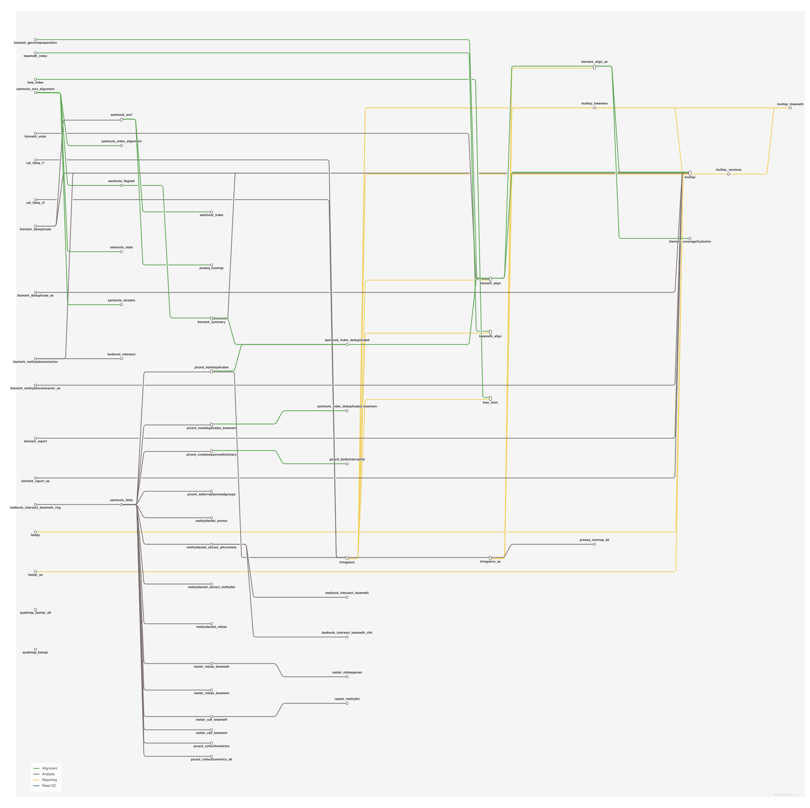

# Bisulfite methylation analysis: alignment, methylation calls and QC

<div class="ox-page-badges"><span class="ox-badge ox-badge--live">✔ Live-tested · default-path</span> <span class="ox-badge ox-badge--origin">⇄ Official port</span> <span class="ox-badge ox-badge--nf"><span class="dot"></span>nf-core port</span></div>

Run end-to-end bisulfite methylation analysis (WGBS, and RRBS-compatible) of paired-end reads: FastQC quality control, TrimGalore adapter trimming, alignment to the bisulfite-converted reference genome with Bismark (bowtie2), PCR-deduplication, samtools sort/index, methylation extraction with per-context (CpG/CHG/CHH) calls plus bedGraph and coverage output, per-sample and project-wide Bismark HTML reports, and a final MultiQC report.

| | |
|---:|---|
| **Rating** | ✔ Live-tested |
| **Origin** | port |
| **Domain** | genomics |
| **Rules** | 13 |
| **Compute** | up to 12 CPUs / 72 GB per rule (bismark) |
| **Tools** | fastqc · trim-galore · cutadapt · pigz · bismark · samtools · htslib · multiqc |
| **Ported** | 2026-08-15 |
| **License** | Apache-2.0 |
| **Source** | [nf-core/methylseq](https://github.com/nf-core/methylseq) |
| **Pinned version** | `4.2.0` |

## Run it

```bash
oxo-flow run main.oxoflow
```

Needs reference genome and reads — see Requirements.

## Installation

**Engine.** oxo-flow >= 0.12.0

**Toolchain.** conda envs — pinned versions (conda-forge/bioconda)

**Requirements.**
- reference genome FASTA (uncompressed) — the Bismark bowtie2 index is built automatically on first run; no prebuilt index required
- paired-end raw reads: <dir>/<sample>_R1.fastq.gz and <dir>/<sample>_R2.fastq.gz
- compute: up to 12 CPUs / 72 GB RAM per rule (bismark_genomepreparation, trimgalore, bismark_align, bismark_deduplicate, bismark_methylationextractor)
- conda or mamba to create the pinned per-rule environments
- disk: space in config.out_dir (default results/) for aligned BAMs, methylation calls and reports

```bash
# 1. install oxo-flow (release binary, recommended)
curl -fL -o oxo-flow.tar.gz https://github.com/Traitome/oxo-flow/releases/latest/download/oxo-flow-latest-x86_64-unknown-linux-gnu.tar.gz
tar xzf oxo-flow.tar.gz && sudo mv oxo-flow /usr/local/bin/
#    or, via conda (may lag behind releases):
#    conda install -c bioconda oxo-flow-cli
#    NOTE: bioconda currently ships 0.10.2, older than the >= 0.12.0
#    minimum of every catalog entry — prefer the release binary.

# 2. get this workflow (clones the repo, auto-discovers the workflow,
#    sanity-parses it with the engine)
oxo-flow pull gh:oxo-flow-community/oxo-flow-methylseq
#    (alternative: plain git clone)
#    git clone https://github.com/oxo-flow-community/oxo-flow-methylseq
```

## Parameters

| Parameter | Default | Description | Used by |
|---:|---|---|---|
| `accel` | `false` | — | `trimgalore` |
| `aligner` | `bismark` | Only the 'bismark' (bowtie2) aligner is ported. 'bismark_hisat', 'bwameth', 'bwamem' are NOT ported (see README fidelity table). | — |
| `clip_r1` | `0` | Trimming options (upstream params with the same defaults) | `trimgalore` |
| `clip_r2` | `0` | — | `trimgalore` |
| `comprehensive` | `true` | The port's DAG consumes the merged (--comprehensive) methylation-call outputs, so the default differs from upstream (false): the per-strand split files would leave the declared outputs unmoved. | `bismark_methylationextractor` |
| `cytosine_report` | `false` | Bismark options | `bismark_coverage2cytosine` |
| `em_seq` | `false` | — | `bismark_align`, `trimgalore` |
| `fasta` | `test/fixtures/refs/genome.fa` | Reference genome (upstream: --fasta). Uncompressed FASTA; the port always builds the Bismark index from it (upstream default when --bismark_index is not supplied). Point this at your genome; the repo default ships the tiny test fixture. | `bismark_genomepreparation` |
| `ignore_3prime_r1` | `0` | — | `bismark_methylationextractor` |
| `ignore_3prime_r2` | `2` | — | `bismark_methylationextractor` |
| `ignore_r1` | `0` | — | `bismark_methylationextractor` |
| `ignore_r2` | `2` | — | `bismark_methylationextractor` |
| `length_trim` | `0` | — | `trimgalore` |
| `local_alignment` | `false` | — | `bismark_align` |
| `maxins` | `` | — | `bismark_align` |
| `meth_cutoff` | `` | — | `bismark_methylationextractor` |
| `minins` | `` | — | `bismark_align` |
| `multiqc_title` | `` | MultiQC | `multiqc` |
| `nextseq_trim` | `0` | — | `trimgalore` |
| `no_overlap` | `true` | — | `bismark_methylationextractor` |
| `nomeseq` | `false` | — | `bismark_coverage2cytosine`, `bismark_methylationextractor` |
| `non_directional` | `false` | — | `bismark_align` |
| `num_mismatches` | `0.6` | — | `bismark_align` |
| `out_dir` | `results` | — | `bismark_align`, `bismark_coverage2cytosine`, `bismark_deduplicate`, `bismark_methylationextractor`, `bismark_report`, `bismark_summary`, `fastqc`, `multiqc`, `multiqc_versions`, `samtools_index`, `samtools_sort`, `trimgalore` |
| `pbat` | `false` | — | `bismark_align`, `trimgalore` |
| `raw_dir` | `test/fixtures/raw` | Input reads directory: raw/<sample>_R1.fastq.gz + _R2.fastq.gz (paired-end). The repo default ships the tiny test fixtures; point this at your data. | `fastqc`, `trimgalore` |
| `relax_mismatches` | `false` | — | `bismark_align` |
| `rrbs` | `false` | Library presets (upstream params with the same defaults). | `bismark_deduplicate`, `trimgalore` |
| `single_cell` | `false` | — | `bismark_align`, `trimgalore` |
| `skip_deduplication` | `false` | — | `bismark_deduplicate` |
| `skip_fastqc` | `false` | Skip options (upstream: --skip_fastqc / --skip_trimming / --skip_deduplication / --skip_multiqc). Same defaults as upstream. | `fastqc` |
| `skip_multiqc` | `false` | — | `multiqc` |
| `skip_trimming` | `false` | — | `trimgalore` |
| `skip_trimming_presets` | `false` | — | `trimgalore` |
| `slamseq` | `false` | — | — |
| `three_prime_clip_r1` | `0` | — | `trimgalore` |
| `three_prime_clip_r2` | `0` | — | `trimgalore` |
| `unmapped` | `false` | — | `bismark_align` |
| `zymo` | `false` | — | `bismark_align`, `trimgalore` |

Descriptions are the workflow's own `#` comments from its `[config]` section, surfaced by `oxo-flow info` — no schema file to maintain.

## Workflow graph

<div class="ox-dag-card" markdown="1">



</div>

The graph is derived at catalog-build time from `oxo-flow graph -f dot` and rendered with Graphviz. It shows the workflow at rule level: wildcard `{sample}` instances expand at run time when sample data is discovered (the runtime view is `oxo-flow graph --expanded`).

## Scope

The default-parameters main path of the source pipeline was ported rule-for-rule; alternate paths are documented as excluded.

**In scope**

- bismark_genomepreparation
- fastqc
- trimgalore
- bismark_align
- bismark_deduplicate
- samtools_sort
- samtools_index
- bismark_methylationextractor
- bismark_coverage2cytosine
- bismark_report
- bismark_summary
- multiqc_versions
- multiqc

**Excluded**

- single_end — paired-end only; the upstream samplesheet 'single_end' column is not ported
- bwameth (bwa-meth) aligner — non-default aligner branch, not ported
- bwamem aligner — non-default aligner branch, not ported
- bismark_hisat aligner — non-default aligner branch, not ported
- BAM_TAPS_CONVERSION (rastair) — taps/bwamem branch, off by default
- BAM_METHYLDACKEL — bwameth branch, off by default
- QUALIMAP_BAMQC — --run_qualimap branch, off by default
- PRESEQ_LCEXTRAP — --run_preseq branch, off by default
- TARGETED_SEQUENCING (+ PICARD_MARKDUPLICATES, PICARD_ADDORREPLACEREADGROUPS) — --run_targeted_sequencing branch, off by default
- CAT_FASTQ — only active for samples with more than one fastq pair; fixture samplesheets have one pair per sample
- GUNZIP / UNTAR — only active when a prebuilt --bismark_index is supplied; the port always builds the index from the reference FASTA (upstream default)

## Fidelity

| Upstream process/rule | oxo-flow rule | Tool (version) | Notes |
|---|---|---|---|
| FASTQC | `fastqc` | fastqc 0.12.1 | identical command; `--memory` derived from task resources |
| TRIMGALORE | `trimgalore` | trim-galore 0.6.10, cutadapt 4.9, pigz 2.8 | identical command incl. library-preset clipping and `--cores` clamp |
| BISMARK_GENOMEPREPARATION | `bismark_genomepreparation` | bismark 0.25.1 | `--bowtie2`; runs when no prebuilt index is supplied (upstream default) |
| BISMARK_ALIGN | `bismark_align` | bismark 0.25.1 | identical flag order (pbat/non_directional/unmapped/score_min/local/minins/maxins/multicore) |
| BISMARK_DEDUPLICATE | `bismark_deduplicate` | bismark 0.25.1 | identical command; skipped with `skip_deduplication`/`rrbs` like upstream |
| SAMTOOLS_SORT | `samtools_sort` | samtools 1.22.1, htslib 1.22.1 | upstream prefix `${sample}.deduplicated.sorted` |
| SAMTOOLS_INDEX | `samtools_index` | samtools 1.22.1 | identical command |
| BISMARK_METHYLATIONEXTRACTOR | `bismark_methylationextractor` | bismark 0.25.1 | identical flag order on the **deduplicated** BAM; `--multicore`/`--buffer_size` derived from resources |
| BISMARK_COVERAGE2CYTOSINE | `bismark_coverage2cytosine` | bismark 0.25.1 | off by default; runs with `cytosine_report`/`nomeseq` |
| BISMARK_REPORT | `bismark_report` | bismark 0.25.1 | bismark2report run with the four reports co-located, as in the upstream workdir |
| BISMARK_SUMMARY | `bismark_summary` | bismark 0.25.1 | bismark2summary with upstream BAM-name arguments |
| MULTIQC | `multiqc` | multiqc 1.32 | same search space + `assets/multiqc_config.yml`; versions pinned statically |
| softwareVersionsToYAML + collectFile | `multiqc_versions` | — | upstream extracts versions at runtime; port pins the module versions statically |
| CAT_FASTQ | not ported | — | only active when a sample has >1 fastq pair; single-pair samplesheets cover the default path |
| GUNZIP / UNTAR | not ported | — | only active when a prebuilt `--bismark_index` is supplied; the port always builds the index |
| QUALIMAP_BAMQC | not ported | — | `--run_qualimap` branch, off by default |
| PRESEQ_LCEXTRAP | not ported | — | `--run_preseq` branch, off by default |
| TARGETED_SEQUENCING (+ PICARD_MARKDUPLICATES / ADDORREPLACEREADGROUPS) | not ported | — | `--run_targeted_sequencing` branch, off by default |
| BAM_TAPS_CONVERSION (rastair) | not ported | — | `--taps` / bwamem branch, off by default |
| BAM_METHYLDACKEL | not ported | — | bwameth branch, off by default |
| aligners bismark_hisat / bwameth / bwamem | not ported | — | `aligner` config accepts only `bismark` (the default) |

Additional notes: paired-end only (`single_end` samplesheet column is not
ported); `--save_*` / `publish_dir_mode` params are N/A (oxo-flow publishes
every declared output); per-process `withName:` resource overrides are baked
into `[rules.resources]` (upstream labels process_single/low/medium/high +
BISMARK_ALIGN 8d / DEDUPLICATE 2d / METHYLATIONEXTRACTOR 1d time limits).

## Links

- Repository: [oxo-flow-methylseq](https://github.com/oxo-flow-community/oxo-flow-methylseq)
- Upstream: [nf-core/methylseq](https://github.com/nf-core/methylseq) @ `4.2.0`
- License: Apache-2.0 (this workflow) · MIT (upstream)

Created on 2026-08-15 — this port may lag behind upstream releases. See the repository's NOTICE for full attribution.
