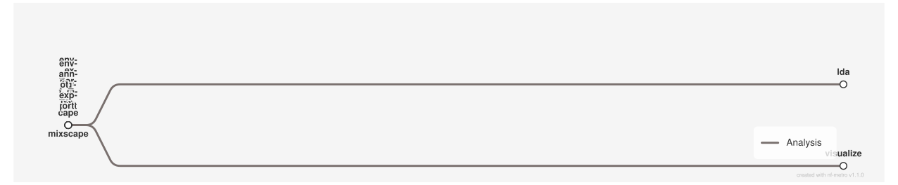

<div class="ox-crumb"><a href="/pipelines/">Pipelines</a> / <span>oxo-flow-mixscape</span></div>
<div class="ox-detail-cols">
<div>
<h1>Pooled CRISPR perturbation analysis with Seurat Mixscape</h1>
<div class="ox-page-badges"><span class="ox-badge ox-badge--live">✔ Live-tested · full-line</span> <span class="ox-badge ox-badge--origin">⇄ Official port</span> <span class="ox-badge ox-badge--sn"><span class="dot"></span>snakemake port</span></div>
<p>Pooled CRISPR perturbation analysis (scCRISPR-seq / CROP-seq / Perturb-seq) with Seurat Mixscape: per-cell perturbation signatures (CalcPerturbSig), perturbed vs. non-perturbed classification (RunMixscape), LDA + UMAP projection of the perturbed subset, the full visualization suite (classification statistics, perturbation-score density, posterior-probability and optional antibody-expression violin plots), and reproducibility exports (exact conda envs, runtime config, annotation file). Input is one processed Seurat object per sample.</p>
</div>
<div>
<div class="ox-glance">
<div class="ox-glance-title">At a glance</div>
<div class="ox-kv"><span class="k">Rating</span><span class="v live">✔ Live-tested · full-line</span></div>
<div class="ox-kv"><span class="k">Rules</span><span class="v">7</span></div>
<div class="ox-kv"><span class="k">Compute</span><span class="v">mixscape 8 CPUs / 32 GB; lda, visualize 1 CPU / 32 GB each; export rules 1 CPU / 1 GB</span></div>
<div class="ox-kv"><span class="k">Engine</span><span class="v"><span class="ox-badge ox-badge--sn"><span class="dot"></span>snakemake port</span></span></div>
<div class="ox-kv"><span class="k">Origin</span><span class="v">⇄ Official port</span></div>
<div class="ox-kv"><span class="k">Domain</span><span class="v">single-cell</span></div>
<div class="ox-kv"><span class="k">Source</span><span class="v"><a href="https://github.com/epigen/mixscape_seurat">epigen/mixscape_seurat</a></span></div>
<div class="ox-kv"><span class="k">Pinned version</span><span class="v"><code>v2.0.3</code></span></div>
<div class="ox-kv"><span class="k">Ported</span><span class="v">2026-08-15</span></div>
<div class="ox-kv"><span class="k">License</span><span class="v">Apache-2.0</span></div>
<p class="cmd">$ oxo-flow run main.oxoflow</p>
</div>
</div>
</div>

## Run it

```bash
oxo-flow run main.oxoflow
```

Point `data_dir=` and `annotation=` at your inputs (see README); the shipped fixtures preview the plan.

## Installation

**Engine.** oxo-flow >= 0.12.0

**Toolchain.** conda envs — pinned (r-seurat 4.4.0, r-seuratobject 4.1.4, r-irlba 2.3.5.1, r-matrix, r-mixtools 2.0.0, r-ggplot2 3.5.2, r-scales 1.3.0, r-patchwork 1.2.0, r-data.table 1.14.10, pyyaml 6.0.1); conda/mamba required at runtime, conda binary on PATH for env export

**Requirements.**

- One processed Seurat object per sample, as {data_dir}/{sample}.rds (already normalized/integrated — QC/normalization run upstream)
- Annotation CSV (name, data columns) mapping sample names to object paths
- Optional: 10X Antibody_Capture assay 'AB' for antibody-expression violin plots
- Compute: mixscape up to 8 CPUs / 32000 MB (32 GB); lda, visualize 1 CPU / 32 GB each; export rules 1 CPU / 1 GB; -j controls parallelism

```bash
# 1. install oxo-flow (release binary, recommended)
curl -fL -o oxo-flow.tar.gz https://github.com/Traitome/oxo-flow/releases/latest/download/oxo-flow-latest-x86_64-unknown-linux-gnu.tar.gz
tar xzf oxo-flow.tar.gz && sudo mv oxo-flow /usr/local/bin/
#    or, via conda (may lag behind releases):
#    conda install -c bioconda oxo-flow-cli
#    NOTE: bioconda currently ships 0.10.2, older than the >= 0.12.0
#    minimum of every catalog entry — prefer the release binary.

# 2. get this workflow (clones the repo, auto-discovers the workflow,
#    sanity-parses it with the engine)
oxo-flow pull gh:oxo-flow-community/oxo-flow-mixscape
#    (alternative: plain git clone)
#    git clone https://github.com/oxo-flow-community/oxo-flow-mixscape
```

## Parameters

| Parameter | Default | Description | Used by |
|---:|---|---|---|
| `annotation` | `test/fixtures/annotation.csv` | GENERAL | `annot_export`, `config_export` |
| `antibody_capture` | `` | VISUALIZATION | `config_export`, `visualize` |
| `assay` | `SCT` | assay to analyse ("SCT" or "RNA") — upstream default "SCT" | `config_export`, `lda`, `mixscape` |
| `cps_split_by_col` | `` | — | `config_export`, `mixscape`, `visualize` |
| `data_dir` | `test/fixtures/data` | per-sample Seurat .rds inputs: {data_dir}/{sample}.rds | `mixscape` |
| `fine_mode` | `FALSE` | RunMixscape (flattened) | `config_export`, `mixscape` |
| `gene_col` | `KOcall` | — | `config_export`, `lda`, `mixscape`, `visualize` |
| `grna_col` | `gRNAcall` | CalcPerturbSig (upstream nested keys flattened; values identical) | `config_export`, `mixscape` |
| `grna_split_symbol` | `-` | MIXSCAPE | `config_export`, `mixscape` |
| `lda_npcs` | `10` | LDA | `config_export`, `lda`, `mixscape` |
| `lfc_th` | `0.1` | — | `config_export`, `lda`, `mixscape` |
| `mem` | `32000` | RESOURCES (upstream config/config.yaml) | `config_export` |
| `min_cells` | `5` | — | `config_export`, `mixscape` |
| `min_de_genes` | `5` | — | `config_export`, `mixscape` |
| `mixscape_split_by_col` | `` | — | `config_export`, `mixscape`, `visualize` |
| `n_neighbors` | `30` | — | `config_export`, `mixscape` |
| `ndims` | `40` | — | `config_export`, `mixscape` |
| `nt_term` | `NonTargeting` | — | `config_export`, `lda`, `mixscape`, `visualize` |
| `project_name` | `myCROPseq` | — | `annot_export`, `config_export` |
| `prtb_type` | `KO` | — | `config_export`, `lda`, `mixscape`, `visualize` |
| `result_path` | `results` | upstream result_path; results land under result_path/mixscape_seurat | `annot_export`, `config_export`, `env_export_lda`, `env_export_mixscape`, `lda`, `mixscape`, `visualize` |
| `threads` | `1` | upstream threads; mixscape rule runs 8x | `config_export` |
| `variable_features_only` | `0` | (objects carry SCTransform normalization; the bundled fixtures are generated that way via make_fixtures.R) | `config_export`, `mixscape` |

{: .ox-params }

Descriptions are the workflow's own `#` comments from its `[config]` section, surfaced by `oxo-flow info` — no schema file to maintain.

## Workflow graph

<div class="ox-dag-card" markdown="1">



</div>

The graph is derived at catalog-build time from `oxo-flow graph -f dot` and rendered with Graphviz. It shows the workflow at rule level: wildcard `{sample}` instances expand at run time when sample data is discovered (the runtime view is `oxo-flow graph --expanded`).

## Scope

The default-parameters main path of the source pipeline was ported rule-for-rule; alternate paths are documented as excluded.

**In scope**

- mixscape
- lda
- visualize
- env_export_mixscape
- env_export_lda
- config_export
- annot_export

**Excluded**

- demultiplexing — verified at v2.0.3 (sha bcf72d5): no demultiplexing rule in the repo — the Snakefile includes only common/mixscape/visualize/envs_export (DAG rulegraph: 7 rules); upstream README §Resources delegates pre-processing to the separate epigen/scrnaseq_processing_seurat module
- scdna — verified at v2.0.3 (sha bcf72d5): zero references anywhere in the repo; single-cell DNA is a different MrBiomics recipe domain, not a mixscape_seurat module
- normalization — verified at v2.0.3 (sha bcf72d5): no QC/normalization/integration rule; the input contract is a processed Seurat object (upstream delegates processing to epigen/scrnaseq_processing_seurat). The in-script NormalizeData fallbacks inside mixscape.R/visualize.R ARE ported
- differential_test — verified at v2.0.3 (sha bcf72d5): no DE rule; per-gene DE runs inside Seurat::RunMixscape (config min_de_genes/lfc_th, both ported); separate downstream DE module is epigen/dea_seurat

## Fidelity


Default-parameters main execution path only. The upstream annotation CSV maps
each sample name to the path of its processed Seurat object; the port reads
the same per-sample `.rds` inputs from `{config.data_dir}/{sample}.rds` and
writes all results under `{config.result_path}/mixscape_seurat/` with the
upstream file names.

| Upstream process/rule | oxo-flow rule | Tool (version) | Notes |
|---|---|---|---|
| `mixscape` | `mixscape` | Seurat 4.4.0 (r-seurat) | identical R script logic (CalcPerturbSig, RunMixscape, stats plots, ALL_* outputs); `snakemake@` I/O/config access replaced with CLI args. Threads 8 = upstream `8 * threads` (threads=1), mem 32000 MB. |
| `lda` | `lda` | Seurat 4.4.0 (r-seurat) | identical R script logic (MixscapeLDA, RunUMAP, FILTERED_*/LDA_data outputs). |
| `visualize` | `visualize` | Seurat 4.4.0 (r-seurat) | identical R script logic (PerturbScore, PosteriorProbability, optional `{Antibody_Capture}_expression` violin plots). The antibody-expression plot dir is produced by the script (same guard as upstream) but is not a declared rule output — oxo-flow cannot declare conditionally-enabled outputs. |
| `env_export` | `env_export_mixscape`, `env_export_lda` | conda (user's install) | upstream's single rule with an `{env}` wildcard split into two explicit rules (environments cannot be wildcarded); `conda env export > {output}` verbatim. `conda` itself is unpinned, exactly as upstream. |
| `config_export` | `config_export` | pyyaml 6.0.1 | upstream `run:` block (`yaml.dump(config)`) ported to `scripts/export_config.py`; runtime config values passed as CLI args. pyyaml pinned at port time (2026-08-15) — upstream relied on the unpinned Snakemake runtime env. |
| `annot_export` | `annot_export` | — | `cp {input} {output}` verbatim. |
| `all` (target) | — | — | not ported: oxo-flow's target is implicit (all rules are targets). |
| demultiplexing | — | — | not ported: not present at v2.0.3 — the Snakefile includes only `common`/`mixscape`/`visualize`/`envs_export` (DAG: 7 rules); pre-processing lives in the separate [epigen/scrnaseq_processing_seurat](https://github.com/epigen/scrnaseq_processing_seurat) module (upstream README §Resources). |
| scdna | — | — | not ported: not present at v2.0.3 (zero references in the repo); single-cell DNA is a separate MrBiomics recipe domain, not a mixscape_seurat module. |
| normalization (QC/normalization/integration) | — | — | not ported: no QC/normalization/integration rule at v2.0.3; the input is a processed Seurat object (upstream delegates processing to `scrnaseq_processing_seurat`). The in-script `NormalizeData` fallbacks (`mixscape.R`, `visualize.R`) are ported. |
| differential_test (perturbation DE) | — | — | not ported: no DE rule at v2.0.3; the per-gene DE runs inside `Seurat::RunMixscape` (`min_de_genes` / `lfc_th` config, both ported); the separate downstream DE module is [epigen/dea_seurat](https://github.com/epigen/dea_seurat). |

Other deviations: (1) sample input paths come from the `{config.data_dir}`
convention instead of per-row CSV paths — the annotation CSV is retained as
the reproducibility artifact (copied by `annot_export`); (2) the upstream
nested config keys (`CalcPerturbSig.*`, `RunMixscape.*`, `MixscapeLDA.npcs`,
`Antibody_Capture`) are flattened in `[config]` — values identical; defaults
identical except `antibody_capture` (port default `""` = disabled, because the
bundled fixtures carry no CITE-seq assay; upstream default `"AB"` — set
`antibody_capture = "AB"` for the upstream behavior); (3) `test/fixtures/*.rds` are tiny genuine Seurat objects generated
with Seurat 5.4.0 (local toolchain) for dry-run validation only — upstream
pins r-seurat 4.4.0; (4) the `snakemake@` object access in the R scripts is
replaced with positional CLI args (the ported scripts document the arg
order); (5) a commented-out draft plotting block in upstream `mixscape.R`
was dropped.

## Links

- Repository: [oxo-flow-mixscape](https://github.com/oxo-flow-community/oxo-flow-mixscape)
- Upstream: [epigen/mixscape_seurat](https://github.com/epigen/mixscape_seurat) @ `v2.0.3`
- License: Apache-2.0 (this workflow) · MIT (upstream)

Created on 2026-08-15 — this port may lag behind upstream releases. See the repository's NOTICE for full attribution.
