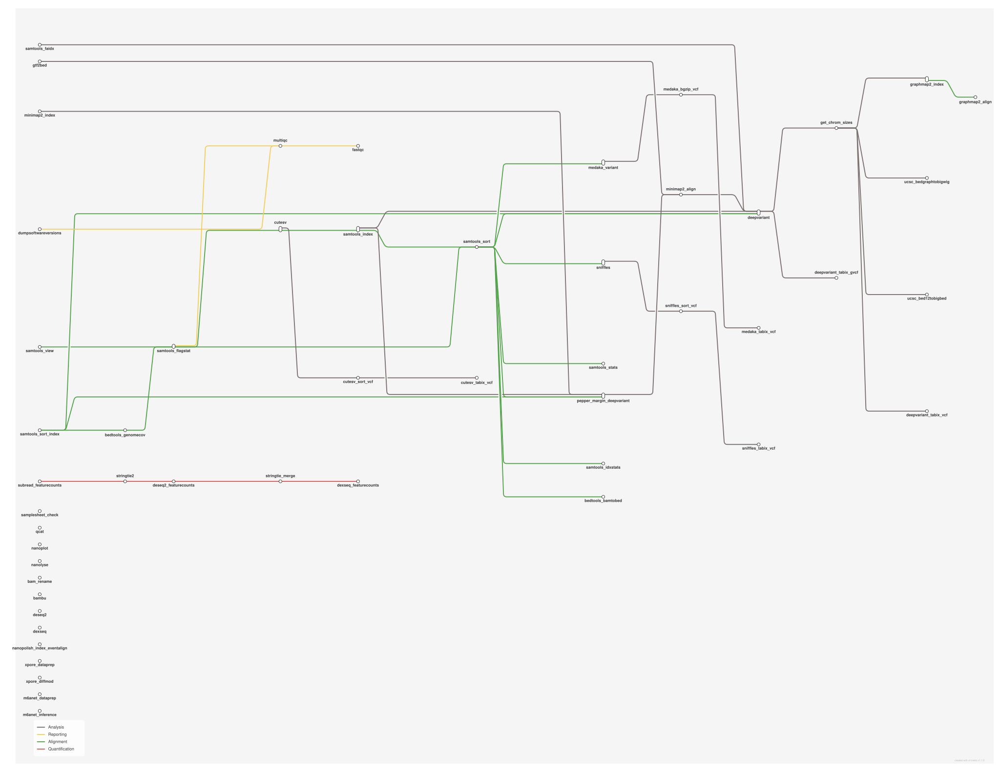

# Nanopore long-read: demultiplexing, QC and alignment

<div class="ox-page-badges"><span class="ox-badge ox-badge--live">✔ Live-tested · default-path</span> <span class="ox-badge ox-badge--origin">⇄ Official port</span> <span class="ox-badge ox-badge--nf"><span class="dot"></span>nf-core port</span></div>

A nanopore long-read pipeline for the DNA default path: samplesheet check, qcat barcode demultiplexing, NanoPlot + FastQC QC, minimap2 alignment, samtools view/sort/index, samtools stats/flagstat/idxstats, BigWig coverage tracks and a MultiQC report. The protocol config key switches to the cDNA/directRNA transcriptome paths. Every rule runs the upstream module's exact pinned container image.

| | |
|---:|---|
| **Rating** | ✔ Live-tested |
| **Origin** | port |
| **Domain** | genomics |
| **Rules** | 19 |
| **Compute** | up to 12 CPUs / 84 GB per rule (minimap2 index) |
| **Tools** | python · qcat · nanoplot · fastqc · samtools · perl · minimap2 · bedtools · ucsc-bedgraphtobigwig · multiqc |
| **Ported** | 2026-08-15 |
| **License** | Apache-2.0 |
| **Source** | [nf-core/nanoseq](https://github.com/nf-core/nanoseq) |
| **Pinned version** | `3.1.0` |

## Run it

```bash
oxo-flow run main.oxoflow
```

Defaults to cDNA mode on the shipped fixtures; options like `protocol=cDNA skip_bigwig=true` adjust the path (see README).

## Installation

**Engine.** oxo-flow >= 0.12.0

**Toolchain.** containers (Docker/Singularity) — pinned images

**Requirements.**
- genome FASTA reference (config.reference; defaults to test fixtures — override for real data)
- samplesheet CSV (config.input) plus raw nanopore FASTQ for demultiplexing (config.input_path; skip with skip_demultiplexing=true)
- optional GTF annotation (config.gtf + config.gtf_base) — only needed for the cDNA/directRNA junction-bed path
- compute: up to 12 CPUs / 84 GB RAM per rule (minimap2 index; most medium rules request 6 CPUs / 42 GB)
- container runtime (Docker or Singularity) — every rule pins its quay.io/biocontainers image

```bash
# 1. install oxo-flow (release binary, recommended)
curl -fL -o oxo-flow.tar.gz https://github.com/Traitome/oxo-flow/releases/latest/download/oxo-flow-latest-x86_64-unknown-linux-gnu.tar.gz
tar xzf oxo-flow.tar.gz && sudo mv oxo-flow /usr/local/bin/
#    or, via conda (may lag behind releases):
#    conda install -c bioconda oxo-flow-cli
#    NOTE: bioconda currently ships 0.10.2, older than the >= 0.12.0
#    minimum of every catalog entry — prefer the release binary.

# 2. get this workflow (clones the repo, auto-discovers the workflow,
#    sanity-parses it with the engine)
oxo-flow pull gh:oxo-flow-community/oxo-flow-nanoseq
#    (alternative: plain git clone)
#    git clone https://github.com/oxo-flow-community/oxo-flow-nanoseq
```

## Parameters

| Parameter | Default | Description | Used by |
|---:|---|---|---|
| `aligner` | `minimap2` | -- Alignment | — |
| `barcode_kit` | `Auto` | -- Demultiplexing (upstream defaults) | `qcat` |
| `call_variants` | `false` | -- Variant calling (upstream default: off) | `minimap2_align` |
| `gtf` | `` | -- GTF annotation (upstream samplesheet gtf column; empty on the default path) | `gtf2bed` |
| `gtf_base` | `` | — | `gtf2bed`, `minimap2_align`, `minimap2_index` |
| `input` | `test/fixtures/samplesheet.csv` | -- Samplesheet and demultiplexing input (upstream: --input / --input_path) | `samplesheet_check` |
| `input_path` | `test/fixtures/raw/sample.fastq.gz` | — | `qcat` |
| `multiqc_config` | `` | — | `multiqc` |
| `multiqc_title` | `` | -- MultiQC options | `multiqc` |
| `out_dir` | `results` | -- Output directory (upstream: --outdir, default ./results) | `bedtools_genomecov`, `dumpsoftwareversions`, `fastqc`, `get_chrom_sizes`, `gtf2bed`, `minimap2_align`, `minimap2_index`, `multiqc`, `nanoplot`, `qcat`, `samplesheet_check`, `samtools_faidx`, `samtools_flagstat`, `samtools_idxstats`, `samtools_index`, `samtools_sort`, `samtools_stats`, `samtools_view`, `ucsc_bedgraphtobigwig` |
| `protocol` | `DNA` | -- Protocol (upstream: --protocol; mandatory upstream, one of DNA/cDNA/directRNA) | `minimap2_align`, `minimap2_index` |
| `qcat_detect_middle` | `false` | — | `qcat` |
| `qcat_min_score` | `60` | — | `qcat` |
| `reference` | `test/fixtures/refs/genome.fa` | -- Reference genome (collapses the samplesheet fasta column; the default path uses a single reference for all samples, as in the upstream test data) | `get_chrom_sizes`, `minimap2_index`, `samtools_faidx`, `samtools_stats` |
| `reference_name` | `genome.fa` | Basename of the reference; mirrors the upstream staged-file name so that indexes keep the upstream naming (genome.fa.mmi / genome.fa.sizes / genome.fa.fai) | `get_chrom_sizes`, `minimap2_align`, `minimap2_index`, `samtools_faidx`, `ucsc_bedgraphtobigwig` |
| `run_nanolyse` | `false` | -- Raw read cleaning (upstream default: off) | — |
| `skip_alignment` | `false` | — | `bedtools_genomecov`, `get_chrom_sizes`, `minimap2_align`, `minimap2_index`, `samtools_faidx`, `samtools_flagstat`, `samtools_idxstats`, `samtools_index`, `samtools_sort`, `samtools_stats`, `samtools_view`, `ucsc_bedgraphtobigwig` |
| `skip_bigbed` | `false` | — | — |
| `skip_bigwig` | `false` | -- Visualisation (upstream defaults: bigwig/bigbed ON; bigbed is protocol-gated upstream to cDNA/directRNA and so never runs on the default DNA path) | `bedtools_genomecov`, `ucsc_bedgraphtobigwig` |
| `skip_demultiplexing` | `false` | — | `qcat` |
| `skip_fastqc` | `false` | — | `fastqc` |
| `skip_multiqc` | `false` | — | `multiqc` |
| `skip_nanoplot` | `false` | — | `nanoplot` |
| `skip_qc` | `false` | -- QC (upstream defaults: all QC on) | `fastqc`, `nanoplot` |
| `stranded` | `false` | — | `minimap2_align`, `minimap2_index` |

Descriptions are the workflow's own `#` comments from its `[config]` section, surfaced by `oxo-flow info` — no schema file to maintain.

## Workflow graph

<div class="ox-dag-card" markdown="1">



</div>

The graph is derived at catalog-build time from `oxo-flow graph -f dot` and rendered with Graphviz. It shows the workflow at rule level: wildcard `{sample}` instances expand at run time when sample data is discovered (the runtime view is `oxo-flow graph --expanded`).

## Scope

The default-parameters main path of the source pipeline was ported rule-for-rule; alternate paths are documented as excluded.

**In scope**

- samplesheet_check
- qcat
- nanoplot
- fastqc
- get_chrom_sizes
- samtools_faidx
- gtf2bed
- minimap2_index
- minimap2_align
- samtools_view
- samtools_sort
- samtools_index
- samtools_stats
- samtools_idxstats
- samtools_flagstat
- bedtools_genomecov
- ucsc_bedgraphtobigwig
- dumpsoftwareversions
- multiqc

**Excluded**

- graphmap2 index/align (aligner off by default; committee exclusion longread_map)
- nanolyse (off by default: run_nanolyse=false)
- medaka/deepvariant/pepper_margin_deepvariant variant calling (off by default: call_variants=false)
- sniffles/cutesv structural variant calling (off by default: call_variants=false)
- bambu/stringtie2/featurecounts/deseq2/dexseq quantification (protocol-gated to cDNA/directRNA; committee exclusion transcriptome)
- bedtools bamtobed + ucsc bed12tobigbed (protocol-gated to cDNA/directRNA; committee exclusion transcriptome)
- nanopolish/xpore/m6anet RNA modification analysis (protocol-gated to directRNA; committee exclusion plotly)
- jaffal RNA fusion analysis (protocol-gated to cDNA/directRNA)
- bam_rename (skip_alignment branch only)
- get_test_data / get_nanolyse_fasta test-profile downloads
- samtools_sort_index combined (call_variants branch only)
- note: committee scope mentions Dorado demultiplex + pycoQC QC; nanoseq 3.1.0 actually uses qcat + NanoPlot/FastQC — port follows the real source

## Fidelity

Port scope: the **default-parameters main execution path** with
`protocol = DNA`, demultiplexing on (`barcode_kit = Auto`, qcat), minimap2
aligner, and default skip flags (all QC/bigwig/bigbed/reporting on). Rules
are listed in execution order; commands mirror the upstream modules
byte-for-byte under default params (upstream Groovy `params.*` conditionals
are reproduced as bash conditionals over the same config keys).

| Upstream process/rule | oxo-flow rule | Tool (version) | Notes |
|---|---|---|---|
| SAMPLESHEET_CHECK | `samplesheet_check` | python 3.8.3 | identical command (`check_samplesheet.py`, `not_changed` path arg) |
| QCAT | `qcat` | qcat 1.1.0 | identical command (`-f`, `-b`, `--kit`, `--min-score`, zcat preamble, gzip); runs once on `input_path`. Declared outputs are the ported barcode set `barcode01/02` (upstream emits `fastq/*.fastq.gz` dynamically) |
| NANOPLOT | `nanoplot` | NanoPlot 1.41.0 | identical command (`-t N --fastq`); upstream publishes all samples' fixed-named `NanoPlot-report.html` into one dir (silently clobbering) — the port isolates each sample in `nanoplot/<barcode>/` |
| FASTQC | `fastqc` | fastqc 0.11.9 | identical command incl. the symlink-rename preamble; per-sample `<barcode>_fastqc.{html,zip}` |
| GET_CHROM_SIZES | `get_chrom_sizes` | samtools 1.13 | identical (`samtools faidx` + `cut -f 1,2`); upstream conda pin says samtools=1.10, container is 1.13 — port pins the container tag |
| SAMTOOLS_FAIDX | `samtools_faidx` | samtools 1.16.1 | identical (`samtools faidx`); runs on a local copy of the reference like the upstream workdir staging |
| GTF2BED | `gtf2bed` | perl 5.26.2 | identical (`gtf2bed <gtf> > <name>.bed`); **off on the default path** — upstream only runs it when the samplesheet carries a gtf column (`when = config.gtf != ""`) |
| MINIMAP2_INDEX | `minimap2_index` | minimap2 2.17 | identical flags for default params (`-ax map-ont -t 12 -d <fasta>.mmi`); protocol/stranded/junction conditionals preserved |
| MINIMAP2_ALIGN | `minimap2_align` | minimap2 2.17 | identical flags + `> <sample>.sam`; `--MD` conditional preserved (off by default) |
| SAMTOOLS_VIEW_BAM | `samtools_view` | samtools 1.15.1 | identical (`view -b -h -O BAM -@ N -o`) |
| SAMTOOLS_SORT | `samtools_sort` | samtools 1.16.1 | identical (`sort -@ N -o <s>.sorted.bam -T <s>.sorted`; upstream `ext.prefix = <meta.id>.sorted`) |
| SAMTOOLS_INDEX | `samtools_index` | samtools 1.16.1 | identical (`index -@ N-1`) |
| SAMTOOLS_STATS | `samtools_stats` | samtools 1.16.1 | identical (`stats --threads N --reference <fasta>`) |
| SAMTOOLS_IDXSTATS | `samtools_idxstats` | samtools 1.16.1 | identical (`idxstats --threads N-1`) |
| SAMTOOLS_FLAGSTAT | `samtools_flagstat` | samtools 1.16.1 | identical (`flagstat --threads N`) |
| BEDTOOLS_GENOMECOV | `bedtools_genomecov` | bedtools 2.29.2 | identical (`genomecov -split -ibam -bg \| bedtools sort`; upstream hardcodes `-split`) |
| UCSC_BEDGRAPHTOBIGWIG | `ucsc_bedgraphtobigwig` | ucsc-bedgraphtobigwig 377 | identical (`bedGraphToBigWig <bedgraph> <sizes>`) |
| CUSTOM_DUMPSOFTWAREVERSIONS | `dumpsoftwareversions` | python (multiqc 1.13 image) | upstream merges per-process `versions.yml` collected at run time; the port pins the same versions statically in `assets/versions.yml` (values = container tags) and runs the upstream merge script verbatim |
| MULTIQC | `multiqc` | multiqc 1.11 | identical (`multiqc -f .` on a dir with config + report inputs); `--title`/`--config` conditionals preserved; output at `results/multiqc/minimap2/` matching the upstream publishDir path |

Deviation (identity model, see also `main.oxoflow` header): upstream
demultiplexes the raw fastq into **barcode-named** files and then joins them
onto samplesheet rows by barcode, so downstream artifacts are named
`<group>_R<replicate>.bam` etc. oxo-flow has no channel join, so the port
keys all per-sample rules by the barcode itself — outputs are named
`barcode01.sam`, `barcode01.bam`, `barcode01.bigWig`, ... while keeping every
command and intermediate filename upstream-identical. The samplesheet
fixture maps barcodes `01`/`02` exactly like the upstream test data.

Not ported (all off by default upstream, so absent from the default path):

| Upstream step | Reason |
|---|---|
| GRAPHMAP2_INDEX / GRAPHMAP2_ALIGN (aligner `graphmap2`) | off by default (`aligner = minimap2`); committee exclusion `longread_map` |
| NANOLYSE (+ GET_NANOLYSE_FASTA) | off by default (`run_nanolyse = false`) |
| MEDAKA_VARIANT / DEEPVARIANT / PEPPER_MARGIN_DEEPVARIANT (+ bgzip/tabix) | off by default (`call_variants = false`) |
| SNIFFLES / CUTESV (+ sort/tabix) | off by default (`call_variants = false`) |
| BEDTOOLS_BAMBED / UCSC_BED12TOBIGBED | protocol-gated upstream to `cDNA`/`directRNA` (`when: protocol == directRNA \|\| cDNA`) — never runs on the DNA default path; committee exclusion `transcriptome` |
| BAMBU / STRINGTIE2 / SUBREAD_FEATURECOUNTS / DESEQ2 / DEXSEQ | gated on `protocol == cDNA/directRNA` + `skip_quantification = false` — not on the DNA default path; committee exclusion `transcriptome` |
| NANOPOLISH_INDEX_EVENTALIGN / XPORE_DATAPREP / XPORE_DIFFMOD / M6ANET_DATAPREP / M6ANET_INFERENCE (RNA modification) | gated on `protocol == directRNA` — not on the DNA default path; committee exclusion `plotly` (m6anet plots) |
| JAFFAL / GET_JAFFAL_REF / UNTAR (RNA fusion) | gated on `protocol == cDNA/directRNA` — not on the DNA default path |
| BAM_RENAME | only when `skip_alignment = true` |
| GET_TEST_DATA / GET_NANOLYSE_FASTA (test-profile downloads) | `-profile test` only, replaced by checked-in fixtures |
| SAMTOOLS_SORT_INDEX (combined sort+index) | `call_variants` branch only |
| `-profile test*` configs, cluster/container profiles, Tower reporting, completion email | nf-core infrastructure, out of port scope |

## Links

- Repository: [oxo-flow-nanoseq](https://github.com/oxo-flow-community/oxo-flow-nanoseq)
- Upstream: [nf-core/nanoseq](https://github.com/nf-core/nanoseq) @ `3.1.0`
- License: Apache-2.0 (this workflow) · MIT (upstream)

Created on 2026-08-15 — this port may lag behind upstream releases. See the repository's NOTICE for full attribution.
