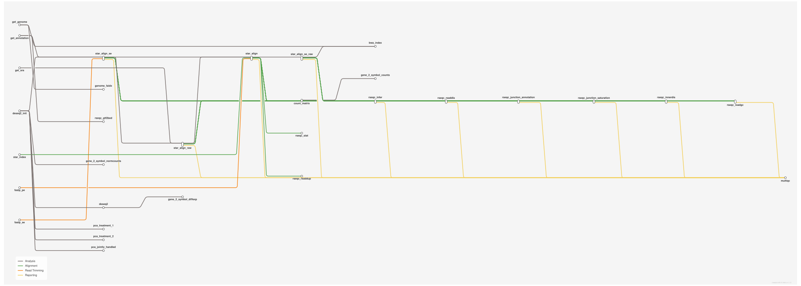

<div class="ox-crumb"><a href="/pipelines/">Pipelines</a> / <span>oxo-flow-rnaseq-star-deseq2</span></div>
<div class="ox-detail-cols">
<div>
<h1>RNA-seq: STAR alignment, DESeq2 differential expression and QC</h1>
<div class="ox-page-badges"><span class="ox-badge ox-badge--live">✔ Live-tested · default-path</span> <span class="ox-badge ox-badge--origin">⇄ Official port</span> <span class="ox-badge ox-badge--sn"><span class="dot"></span>snakemake port</span></div>
<p>End-to-end RNA-seq differential-expression analysis with STAR and DESeq2: Ensembl reference download, fastp trimming, STAR alignment with gene counts, RSeQC QC + MultiQC, count matrix with technical-replicate collapse, Ensembl biomaRt gene-symbol annotation, and DESeq2 (normalized counts, PCA plots, per-contrast results with ashr shrinkage and MA plots). Every tool is pinned to an exact conda version for reproducibility. Per-unit upstream semantics are ported via the engine metadata binding: the units sheet doubles as the metadata table, so per-unit fastp_adapters/fastp_extra overrides and per-unit SRA accessions (the get_sra auto-feed) resolve per unit with the global config as fallback. Non-default upstream branches are config-gated and off by default: SRA download (get_sra), single-end mode (fastp_se + star_align_se), raw-read alignment (trimming_activate = false), bwa index and samtools faidx.</p>
</div>
<div>
<div class="ox-glance">
<div class="ox-glance-title">At a glance</div>
<div class="ox-kv"><span class="k">Rating</span><span class="v live">✔ Live-tested · default-path</span></div>
<div class="ox-kv"><span class="k">Rules</span><span class="v">31</span></div>
<div class="ox-kv"><span class="k">Compute</span><span class="v">up to 24 CPUs per rule (star_align)</span></div>
<div class="ox-kv"><span class="k">Engine</span><span class="v"><span class="ox-badge ox-badge--sn"><span class="dot"></span>snakemake port</span></span></div>
<div class="ox-kv"><span class="k">Origin</span><span class="v">⇄ Official port</span></div>
<div class="ox-kv"><span class="k">Domain</span><span class="v">transcriptomics</span></div>
<div class="ox-kv"><span class="k">Source</span><span class="v"><a href="https://github.com/snakemake-workflows/rna-seq-star-deseq2">snakemake-workflows/rna-seq-star-deseq2</a></span></div>
<div class="ox-kv"><span class="k">Pinned version</span><span class="v"><code>v3.1.1</code></span></div>
<div class="ox-kv"><span class="k">Ported</span><span class="v">2026-08-15</span></div>
<div class="ox-kv"><span class="k">License</span><span class="v">Apache-2.0</span></div>
<div class="ox-kv"><span class="k">Cite</span><span class="v"><a href="https://doi.org/10.48546/workflowhub.workflow.2290.1"><code>10.48546/workflowhub.workflow.2290.1</code></a></span></div>
<p class="cmd">$ oxo-flow run main.oxoflow</p>
</div>
</div>
</div>

## Run it

```bash
oxo-flow run main.oxoflow
```

Needs reference genome, annotation and reads — see Requirements.

## Installation

**Engine.** oxo-flow >= 0.12.0 (per-unit metadata features — per-unit fastp_adapters/fastp_extra lookup and the SRA auto-feed — require >= 0.17.0; on older engines the global config defaults apply)

**Toolchain.** conda envs — pinned

**Requirements.**

- paired-end FASTQ reads per config/units.tsv (raw/<unit-key>_R1.fastq.gz / _R2.fastq.gz) and sample conditions in config/samples.tsv
- reference genome + annotation downloaded automatically from Ensembl release 115 (GRCh38) — network access required (also for biomaRt gene-symbol annotation)
- compute: up to 24 CPUs per rule (star_align); 8 (fastp_pe); 4 (fastp_se, star_index); no per-rule memory limits configured in the workflow
- disk: several tens of GB — ~30 GB GRCh38 STAR index, plus BAMs and trimmed reads

```bash
# 1. install oxo-flow (release binary, recommended)
curl -fL -o oxo-flow.tar.gz https://github.com/Traitome/oxo-flow/releases/latest/download/oxo-flow-latest-x86_64-unknown-linux-gnu.tar.gz
tar xzf oxo-flow.tar.gz && sudo mv oxo-flow /usr/local/bin/
#    or, via conda (may lag behind releases):
#    conda install -c bioconda oxo-flow-cli
#    NOTE: bioconda currently ships 0.10.2, older than the >= 0.12.0
#    minimum of every catalog entry — prefer the release binary.

# 2. get this workflow (clones the repo, auto-discovers the workflow,
#    sanity-parses it with the engine)
oxo-flow pull gh:oxo-flow-community/oxo-flow-rnaseq-star-deseq2
#    (alternative: plain git clone)
#    git clone https://github.com/oxo-flow-community/oxo-flow-rnaseq-star-deseq2
```

## Parameters

<p class="ox-param-usage">Parameters are consumed by rules through <code>{config.key}</code> placeholders in inputs, outputs, and shells. Set a value in the workflow's <code>[config]</code> section (edit the file), or override at run time with <code>oxo-flow run -e key=value workflow.oxoflow</code> — repeat <code>-e</code> for multiple keys. The list below names the rules that read each key.</p>
<div class="ox-params">
<div class="ox-param">
<div class="ox-param-head"><code>annotation_gtf</code><span class="ox-param-default"></span></div>
<p class="ox-param-desc">Local reference overrides: set to a local FASTA/GTF to skip the Ensembl<br>download entirely (offline machines, tiny test runs). Empty = download<br>(the upstream-faithful default). A tiny synthetic kit ships at<br>test/fixtures/reference/ with matching reads in raw-synthetic/.</p>
<details class="ox-param-usedby"><summary>used by 1 rules</summary>
<div class="ox-param-rules"><code>get_annotation</code></div>
</details>
</div>
<div class="ox-param">
<div class="ox-param-head"><code>annotation_url</code><span class="ox-param-default">ftp://ftp.ensembl.org/pub/release-115/gtf/homo_sapiens/Homo_sapiens.GRCh38.115.gtf.gz</span></div>
<p class="ox-param-desc">Local reference overrides: set to a local FASTA/GTF to skip the Ensembl<br>download entirely (offline machines, tiny test runs). Empty = download<br>(the upstream-faithful default). A tiny synthetic kit ships at<br>test/fixtures/reference/ with matching reads in raw-synthetic/.</p>
<details class="ox-param-usedby"><summary>used by 1 rules</summary>
<div class="ox-param-rules"><code>get_annotation</code></div>
</details>
</div>
<div class="ox-param">
<div class="ox-param-head"><code>biomart_species</code><span class="ox-param-default">hsapiens</span></div>
<p class="ox-param-desc">biomaRt species dataset suffix (upstream get_bioc_species_name()).</p>
<details class="ox-param-usedby"><summary>used by 3 rules</summary>
<div class="ox-param-rules"><code>gene_2_symbol_counts</code> <code>gene_2_symbol_diffexp</code> <code>gene_2_symbol_normcounts</code></div>
</details>
</div>
<div class="ox-param">
<div class="ox-param-head"><code>bwa_index_activate</code><span class="ox-param-default">false</span></div>
<p class="ox-param-desc">Activate the BWA index / samtools faidx rules. Upstream declares both but<br>its default path never requests them (snakemake lazy evaluation); oxo-flow<br>runs every rule in the file, so both are gated off unless activated.</p>
<details class="ox-param-usedby"><summary>used by 1 rules</summary>
<div class="ox-param-rules"><code>bwa_index</code></div>
</details>
</div>
<div class="ox-param">
<div class="ox-param-head"><code>contrast_exprs</code><span class="ox-param-default"></span></div>
<p class="ox-param-desc">String-form DESeq2 contrasts (upstream diffexp.contrasts string entries,<br>e.g. &#x27;list(c(&quot;treatment_1_treated_vs_untreated&quot;, ...))&#x27;). Semicolon-joined<br>list parallel to <code>contrasts</code>; an empty entry = list-form for that<br>contrast. Entries are R expressions evaluated by DESeq2: use single<br>quotes for R strings (the value is double-quoted on the shell command<br>line) and no semicolons inside an entry.</p>
<details class="ox-param-usedby"><summary>used by 1 rules</summary>
<div class="ox-param-rules"><code>deseq2</code></div>
</details>
</div>
<div class="ox-param">
<div class="ox-param-head"><code>contrast_levels</code><span class="ox-param-default">treated</span></div>
<p class="ox-param-desc">Contrasts (upstream: diffexp.contrasts). One comma-joined entry per<br>contrast: contrast id, its variable_of_interest, its level_of_interest.<br>The base level comes from diffexp_base_levels.</p>
<details class="ox-param-usedby"><summary>used by 1 rules</summary>
<div class="ox-param-rules"><code>deseq2</code></div>
</details>
</div>
<div class="ox-param">
<div class="ox-param-head"><code>contrast_variables</code><span class="ox-param-default">treatment_1</span></div>
<p class="ox-param-desc">Contrasts (upstream: diffexp.contrasts). One comma-joined entry per<br>contrast: contrast id, its variable_of_interest, its level_of_interest.<br>The base level comes from diffexp_base_levels.</p>
<details class="ox-param-usedby"><summary>used by 1 rules</summary>
<div class="ox-param-rules"><code>deseq2</code></div>
</details>
</div>
<div class="ox-param">
<div class="ox-param-head"><code>contrasts</code><span class="ox-param-default">treatment_1</span></div>
<p class="ox-param-desc">Contrasts (upstream: diffexp.contrasts). One comma-joined entry per<br>contrast: contrast id, its variable_of_interest, its level_of_interest.<br>The base level comes from diffexp_base_levels.</p>
<details class="ox-param-usedby"><summary>used by 1 rules</summary>
<div class="ox-param-rules"><code>deseq2</code></div>
</details>
</div>
<div class="ox-param">
<div class="ox-param-head"><code>diffexp_base_levels</code><span class="ox-param-default">untreated,untreated</span></div>
<p class="ox-param-desc">Differential expression (upstream: diffexp.*). Comma-joined lists mirror<br>the upstream nested tables; positions pair up (treatment_1 -&gt; untreated,<br>treatment_2 -&gt; untreated).</p>
<details class="ox-param-usedby"><summary>used by 2 rules</summary>
<div class="ox-param-rules"><code>deseq2</code> <code>deseq2_init</code></div>
</details>
</div>
<div class="ox-param">
<div class="ox-param-head"><code>diffexp_batch_effects</code><span class="ox-param-default">jointly_handled</span></div>
<p class="ox-param-desc">Differential expression (upstream: diffexp.*). Comma-joined lists mirror<br>the upstream nested tables; positions pair up (treatment_1 -&gt; untreated,<br>treatment_2 -&gt; untreated).</p>
<details class="ox-param-usedby"><summary>used by 1 rules</summary>
<div class="ox-param-rules"><code>deseq2_init</code></div>
</details>
</div>
<div class="ox-param ox-param-unused">
<div class="ox-param-head"><code>diffexp_model</code><span class="ox-param-default"></span></div>
<p class="ox-param-desc">Differential expression (upstream: diffexp.*). Comma-joined lists mirror<br>the upstream nested tables; positions pair up (treatment_1 -&gt; untreated,<br>treatment_2 -&gt; untreated).</p>
<details class="ox-param-usedby"><summary>not referenced by any rule</summary>
<div class="ox-param-rules">A ported upstream parameter kept for compatibility: no rule reads this key (no <code>{config.*}</code> placeholder in any input, output, or shell), so overriding it has no effect on this workflow.</div>
</details>
</div>
<div class="ox-param">
<div class="ox-param-head"><code>diffexp_variables</code><span class="ox-param-default">treatment_1,treatment_2</span></div>
<p class="ox-param-desc">Differential expression (upstream: diffexp.*). Comma-joined lists mirror<br>the upstream nested tables; positions pair up (treatment_1 -&gt; untreated,<br>treatment_2 -&gt; untreated).</p>
<details class="ox-param-usedby"><summary>used by 2 rules</summary>
<div class="ox-param-rules"><code>deseq2</code> <code>deseq2_init</code></div>
</details>
</div>
<div class="ox-param">
<div class="ox-param-head"><code>fastp_adapters</code><span class="ox-param-default">--detect_adapter_for_pe</span></div>
<p class="ox-param-desc">fastp adapter args and extra args (upstream: per-unit columns<br>fastp_adapters / fastp_extra in config/units.tsv, looked up per unit via<br>the metadata binding — {meta.fastp_adapters} / {meta.fastp_extra} render<br>per unit and these global keys are the per-unit defaults when a unit&#x27;s<br>column is empty; equal the upstream defaults). fastp_adapters_se matches<br>the upstream single-end default (&quot;&quot;).</p>
<details class="ox-param-usedby"><summary>used by 1 rules</summary>
<div class="ox-param-rules"><code>fastp_pe</code></div>
</details>
</div>
<div class="ox-param">
<div class="ox-param-head"><code>fastp_adapters_se</code><span class="ox-param-default"></span></div>
<p class="ox-param-desc">fastp adapter args and extra args (upstream: per-unit columns<br>fastp_adapters / fastp_extra in config/units.tsv, looked up per unit via<br>the metadata binding — {meta.fastp_adapters} / {meta.fastp_extra} render<br>per unit and these global keys are the per-unit defaults when a unit&#x27;s<br>column is empty; equal the upstream defaults). fastp_adapters_se matches<br>the upstream single-end default (&quot;&quot;).</p>
<details class="ox-param-usedby"><summary>used by 1 rules</summary>
<div class="ox-param-rules"><code>fastp_se</code></div>
</details>
</div>
<div class="ox-param">
<div class="ox-param-head"><code>fastp_extra</code><span class="ox-param-default">--trim_poly_x --poly_x_min_len 7 --trim_poly_g --poly_g_min_len 7</span></div>
<p class="ox-param-desc">fastp adapter args and extra args (upstream: per-unit columns<br>fastp_adapters / fastp_extra in config/units.tsv, looked up per unit via<br>the metadata binding — {meta.fastp_adapters} / {meta.fastp_extra} render<br>per unit and these global keys are the per-unit defaults when a unit&#x27;s<br>column is empty; equal the upstream defaults). fastp_adapters_se matches<br>the upstream single-end default (&quot;&quot;).</p>
<details class="ox-param-usedby"><summary>used by 2 rules</summary>
<div class="ox-param-rules"><code>fastp_pe</code> <code>fastp_se</code></div>
</details>
</div>
<div class="ox-param">
<div class="ox-param-head"><code>genome_faidx_activate</code><span class="ox-param-default">false</span></div>
<p class="ox-param-desc">Activate the BWA index / samtools faidx rules. Upstream declares both but<br>its default path never requests them (snakemake lazy evaluation); oxo-flow<br>runs every rule in the file, so both are gated off unless activated.</p>
<details class="ox-param-usedby"><summary>used by 1 rules</summary>
<div class="ox-param-rules"><code>genome_faidx</code></div>
</details>
</div>
<div class="ox-param">
<div class="ox-param-head"><code>genome_fasta</code><span class="ox-param-default"></span></div>
<p class="ox-param-desc">Local reference overrides: set to a local FASTA/GTF to skip the Ensembl<br>download entirely (offline machines, tiny test runs). Empty = download<br>(the upstream-faithful default). A tiny synthetic kit ships at<br>test/fixtures/reference/ with matching reads in raw-synthetic/.</p>
<details class="ox-param-usedby"><summary>used by 1 rules</summary>
<div class="ox-param-rules"><code>get_genome</code></div>
</details>
</div>
<div class="ox-param">
<div class="ox-param-head"><code>genome_url</code><span class="ox-param-default">https://ftp.ensembl.org/pub/release-115/fasta/homo_sapiens/dna/Homo_sapiens.GRCh38.dna.primary_assembly.fa.gz</span></div>
<p class="ox-param-desc">Local reference overrides: set to a local FASTA/GTF to skip the Ensembl<br>download entirely (offline machines, tiny test runs). Empty = download<br>(the upstream-faithful default). A tiny synthetic kit ships at<br>test/fixtures/reference/ with matching reads in raw-synthetic/.</p>
<details class="ox-param-usedby"><summary>used by 1 rules</summary>
<div class="ox-param-rules"><code>get_genome</code></div>
</details>
</div>
<div class="ox-param">
<div class="ox-param-head"><code>genome_url_toplevel</code><span class="ox-param-default">https://ftp.ensembl.org/pub/release-115/fasta/homo_sapiens/dna/Homo_sapiens.GRCh38.dna.toplevel.fa.gz</span></div>
<p class="ox-param-desc">Local reference overrides: set to a local FASTA/GTF to skip the Ensembl<br>download entirely (offline machines, tiny test runs). Empty = download<br>(the upstream-faithful default). A tiny synthetic kit ships at<br>test/fixtures/reference/ with matching reads in raw-synthetic/.</p>
<details class="ox-param-usedby"><summary>used by 1 rules</summary>
<div class="ox-param-rules"><code>get_genome</code></div>
</details>
</div>
<div class="ox-param">
<div class="ox-param-head"><code>pca_activate</code><span class="ox-param-default">true</span></div>
<p class="ox-param-desc">PCA (upstream: pca.activate / pca.labels). pca_variables is the derived<br>upstream list (variables_of_interest + batch_effects + labels), kept<br>explicit here — keep it in sync with the diffexp keys below.</p>
<details class="ox-param-usedby"><summary>used by 3 rules</summary>
<div class="ox-param-rules"><code>pca_jointly_handled</code> <code>pca_treatment_1</code> <code>pca_treatment_2</code></div>
</details>
</div>
<div class="ox-param ox-param-unused">
<div class="ox-param-head"><code>pca_labels</code><span class="ox-param-default"></span></div>
<p class="ox-param-desc">PCA (upstream: pca.activate / pca.labels). pca_variables is the derived<br>upstream list (variables_of_interest + batch_effects + labels), kept<br>explicit here — keep it in sync with the diffexp keys below.</p>
<details class="ox-param-usedby"><summary>not referenced by any rule</summary>
<div class="ox-param-rules">A ported upstream parameter kept for compatibility: no rule reads this key (no <code>{config.*}</code> placeholder in any input, output, or shell), so overriding it has no effect on this workflow.</div>
</details>
</div>
<div class="ox-param ox-param-unused">
<div class="ox-param-head"><code>pca_variables</code><span class="ox-param-default">treatment_1,treatment_2,jointly_handled</span></div>
<p class="ox-param-desc">PCA (upstream: pca.activate / pca.labels). pca_variables is the derived<br>upstream list (variables_of_interest + batch_effects + labels), kept<br>explicit here — keep it in sync with the diffexp keys below.</p>
<details class="ox-param-usedby"><summary>not referenced by any rule</summary>
<div class="ox-param-rules">A ported upstream parameter kept for compatibility: no rule reads this key (no <code>{config.*}</code> placeholder in any input, output, or shell), so overriding it has no effect on this workflow.</div>
</details>
</div>
<div class="ox-param">
<div class="ox-param-head"><code>raw_dir</code><span class="ox-param-default">test/fixtures/raw</span></div>
<p class="ox-param-desc">Directory holding &lt;unit-key&gt;_R1.fastq.gz / _R2.fastq.gz per config/units.tsv.<br>The repo default ships the tiny test fixtures; point this at your data<br>(e.g. &quot;raw&quot;).</p>
<details class="ox-param-usedby"><summary>used by 5 rules</summary>
<div class="ox-param-rules"><code>fastp_pe</code> <code>fastp_se</code> <code>get_sra</code> <code>star_align_raw</code> <code>star_align_se_raw</code></div>
</details>
</div>
<div class="ox-param ox-param-unused">
<div class="ox-param-head"><code>ref_build</code><span class="ox-param-default">GRCh38</span></div>
<p class="ox-param-desc">Reference (upstream: ref.species / ref.release / ref.build). The download<br>URLs below are the Ensembl URLs the wrappers resolve for these values.</p>
<details class="ox-param-usedby"><summary>not referenced by any rule</summary>
<div class="ox-param-rules">A ported upstream parameter kept for compatibility: no rule reads this key (no <code>{config.*}</code> placeholder in any input, output, or shell), so overriding it has no effect on this workflow.</div>
</details>
</div>
<div class="ox-param ox-param-unused">
<div class="ox-param-head"><code>ref_release</code><span class="ox-param-default">115</span></div>
<p class="ox-param-desc">Reference (upstream: ref.species / ref.release / ref.build). The download<br>URLs below are the Ensembl URLs the wrappers resolve for these values.</p>
<details class="ox-param-usedby"><summary>not referenced by any rule</summary>
<div class="ox-param-rules">A ported upstream parameter kept for compatibility: no rule reads this key (no <code>{config.*}</code> placeholder in any input, output, or shell), so overriding it has no effect on this workflow.</div>
</details>
</div>
<div class="ox-param ox-param-unused">
<div class="ox-param-head"><code>ref_species</code><span class="ox-param-default">homo_sapiens</span></div>
<p class="ox-param-desc">Reference (upstream: ref.species / ref.release / ref.build). The download<br>URLs below are the Ensembl URLs the wrappers resolve for these values.</p>
<details class="ox-param-usedby"><summary>not referenced by any rule</summary>
<div class="ox-param-rules">A ported upstream parameter kept for compatibility: no rule reads this key (no <code>{config.*}</code> placeholder in any input, output, or shell), so overriding it has no effect on this workflow.</div>
</details>
</div>
<div class="ox-param">
<div class="ox-param-head"><code>single_end</code><span class="ox-param-default">false</span></div>
<p class="ox-param-desc">Single-end mode (upstream decides per sample from the units.tsv fq2/sra<br>columns; the port applies it globally — engine rules have fixed input<br>arities). Single-end units provide only &lt;unit-key&gt;_R1.fastq.gz. Default<br>false = the paired-end path.</p>
<details class="ox-param-usedby"><summary>used by 6 rules</summary>
<div class="ox-param-rules"><code>fastp_pe</code> <code>fastp_se</code> <code>star_align</code> <code>star_align_raw</code> <code>star_align_se</code> <code>star_align_se_raw</code></div>
</details>
</div>
<div class="ox-param">
<div class="ox-param-head"><code>sra_accessions</code><span class="ox-param-default"></span></div>
<p class="ox-param-desc">SRA auto-feed master switch (upstream get_sra branch: units whose fq1/fq2<br>are empty carry an sra accession in config/units.tsv). Any non-empty value<br>enables the per-unit download; each unit&#x27;s accession comes from its units<br>sheet sra column (the {meta.sra} lookup), and reads land at<br>&lt;raw_dir&gt;/&lt;unit-key&gt;_R{1,2}.fastq.gz (the raw_dir convention) so the<br>trimming/alignment rules consume them automatically (upstream<br>get_units_fastqs). Default empty = no SRA download. Requires oxo-flow &gt;=<br>0.17.0 — on older engines keep this empty (the per-unit sra column is not<br>read, and the gate then stays closed).</p>
<details class="ox-param-usedby"><summary>used by 1 rules</summary>
<div class="ox-param-rules"><code>get_sra</code></div>
</details>
</div>
<div class="ox-param">
<div class="ox-param-head"><code>star_align_extra</code><span class="ox-param-default"></span></div>
<p class="ox-param-desc">STAR extra params (upstream: params.star.index / params.star.align).</p>
<details class="ox-param-usedby"><summary>used by 4 rules</summary>
<div class="ox-param-rules"><code>star_align</code> <code>star_align_raw</code> <code>star_align_se</code> <code>star_align_se_raw</code></div>
</details>
</div>
<div class="ox-param">
<div class="ox-param-head"><code>star_index_extra</code><span class="ox-param-default"></span></div>
<p class="ox-param-desc">STAR extra params (upstream: params.star.index / params.star.align).</p>
<details class="ox-param-usedby"><summary>used by 1 rules</summary>
<div class="ox-param-rules"><code>star_index</code></div>
</details>
</div>
<div class="ox-param">
<div class="ox-param-head"><code>trimming_activate</code><span class="ox-param-default">true</span></div>
<p class="ox-param-desc">Trimming (upstream: trimming.activate). With trimming off, the port&#x27;s<br>star_align_raw / star_align_se_raw variants feed the raw reads to STAR,<br>mirroring the upstream rewiring (get_fq with trimming.activate = False).</p>
<details class="ox-param-usedby"><summary>used by 6 rules</summary>
<div class="ox-param-rules"><code>fastp_pe</code> <code>fastp_se</code> <code>star_align</code> <code>star_align_raw</code> <code>star_align_se</code> <code>star_align_se_raw</code></div>
</details>
</div>
<div class="ox-param">
<div class="ox-param-head"><code>units_file</code><span class="ox-param-default">config/units.tsv</span></div>
<p class="ox-param-desc">Sample sheet (TSV: sample_name, condition, ...) and unit sheet<br>(TSV: sample_name, unit_name, fq1, fq2, sra, fastp_adapters, fastp_extra,<br>strandedness). Upstream: config[&quot;samples&quot;] / config[&quot;units&quot;]. The unit<br>sheet&#x27;s first column is the composite unit key (&lt;sample&gt;-&lt;unit&gt;, the<br>{sample} wildcard) and doubles as the [workflow] metadata_file table<br>above; scripts/count-matrix.py reads the sample/unit/strandedness columns.</p>
<details class="ox-param-usedby"><summary>used by 1 rules</summary>
<div class="ox-param-rules"><code>count_matrix</code></div>
</details>
</div>
</div>

Descriptions are the workflow's own `#` comments from its `[config]` section (and the `[config]` sections of its included modules), surfaced by `oxo-flow info` — no schema file to maintain.

## Workflow graph

<div class="ox-dag-card" markdown="1">



<p class="ox-dag-caption">figure · oxo-flow-rnaseq-star-deseq2 — End-to-end RNA-seq differential-expression analysis with STAR and DESeq2: Ensembl reference download, fastp trimming, STAR alignment with gene counts, RSeQC QC + MultiQC, count matrix with technical-replicate collapse, Ensembl biomaRt gene-symbol annotation, and DESeq2 (normalized counts, PCA plots, per-contrast results with ashr shrinkage and MA plots).</p>

</div>

The graph is derived at catalog-build time from `oxo-flow graph -f metro` through the adaptive render ladder (`scripts/metro_tiers.py`): each workflow gets the finest metro tier that nf-metro renders while staying readable at site width — rule-level stations for smaller workflows, module-stage or module overview stations for dense ones. Colored transit lines group stations by analysis stage. Wildcard `{sample}` instances expand at run time when sample data is discovered (the runtime view is `oxo-flow graph --expanded`).

## Scope

The default-parameters main path of the source pipeline was ported rule-for-rule; alternate paths are documented as excluded.

**In scope**

- bwa_index
- count_matrix
- deseq2
- deseq2_init
- fastp_pe
- fastp_se
- gene_2_symbol_counts
- gene_2_symbol_diffexp
- gene_2_symbol_normcounts
- genome_faidx
- get_annotation
- get_genome
- get_sra
- multiqc
- pca_jointly_handled
- pca_treatment_1
- pca_treatment_2
- rseqc_gtf2bed
- rseqc_infer
- rseqc_innerdis
- rseqc_junction_annotation
- rseqc_junction_saturation
- rseqc_readdis
- rseqc_readdup
- rseqc_readgc
- rseqc_stat
- star_align
- star_align_raw
- star_align_se
- star_align_se_raw
- star_index

**Excluded**

- Snakemake report artifacts — per-rule .rst captions (workflow/report/fastp.rst, pca.rst, diffexp.rst, ma.rst) ported as report = "…" annotations on the 6 report()-wrapped rules (fastp_pe, fastp_se, 3x pca, deseq2), rendered by the engine rule-captions report section (needs oxo-flow >= 0.17.0; older engines ignore the key); the workflow-level report: directive (workflow/report/workflow.rst) and the sphinx-based snakemake --report HTML book (self-contained, figures embedded, categories/subcategories/labels) have no oxo-flow equivalent

## Fidelity

Scope: the **default-parameters main execution path** (upstream `rule all`).
Rows cover every upstream rule; "not ported" rows carry a reason. Upstream
rules use snakemake wrappers v7.2.0 (`bio/fastp`, `bio/star/*`,
`bio/multiqc`, `bio/reference/ensembl-*`, `bio/samtools/faidx`,
`bio/bwa/index`, `bio/sra-tools/fasterq-dump`) whose conda pins were carried
over verbatim. Rules that upstream declares but never runs in the default
path (get_sra, fastp_se, bwa_index, genome_faidx) and the alternate
trimming/SE wiring are ported as config-gated rules (see the `when`/flag
notes per row); they appear as `skip` in the default dry-run plan.

| Upstream rule | oxo-flow rule | Tool (version) | Notes |
|---|---|---|---|
| get_genome | `get_genome` | curl (system) + Ensembl FTP/HTTPS | ensembl-sequence wrapper: primary_assembly URL with toplevel fallback; probe/fallback restructured into shell, HTTPS branch only (upstream also probes FTP) |
| get_annotation | `get_annotation` | curl (system) + Ensembl FTP/HTTPS | ensembl-annotation wrapper, identical URL + `gzip -d` logic |
| star_index | `star_index` | STAR 2.7.11b | star/index wrapper verbatim; tmpdir moved to `.oxo-flow/tmp/star_index` |
| fastp_pe | `fastp_pe` | fastp 1.0.1 | fastp wrapper verbatim (extra + adapters + reads + trimmed + json + html ordering); upstream per-unit `fastp_adapters`/`fastp_extra` lookup() columns → per-unit `{meta.fastp_adapters}`/`{meta.fastp_extra}` from the units sheet (`config/units.tsv`), with the global `[config] fastp_adapters`/`fastp_extra` as per-unit defaults (empty column → global value, both equal upstream defaults) |
| star_align | `star_align` (+ `star_align_raw`, `star_align_se`, `star_align_se_raw`) | STAR 2.7.11b | star/align wrapper verbatim: `--outSAMtype BAM SortedByCoordinate --quantMode GeneCounts --sjdbGTFfile "<gtf>"` in the upstream extra-string order, `--readFilesCommand gunzip -c`, `--outStd BAM_SortedByCoordinate` to the BAM, `cat` of ReadsPerGene/SJ/Logs out of the tmp prefix. Upstream's one rule takes trimmed or raw, one or two reads per sample (get_fq + units.tsv); engine rules have fixed input patterns, so the port makes the 2×2 matrix explicit: PE-trimmed (default), PE-raw (`trimming_activate = false`), SE-trimmed, SE-raw — each gated so exactly one variant is active |
| get_sra | `get_sra` | sra-tools 3.2.1 | fasterq-dump wrapper verbatim (`-x`, tmpdir via `mktemp -d`, log `logs/get-sra/{sample}.log`); per-unit auto-feed ported via the units sheet `sra` column: `{meta.sra}` routes each unit to its own accession, gated on `config.sra_accessions != ''` as the master switch (default empty → skip; upstream triggers per unit from the same column). Deviation: upstream writes uncompressed `sra/{accession}_1.fastq` and get_units_fastqs binds them as inputs; the port gzips into `<raw_dir>/<unit-key>_R{1,2}.fastq.gz` (the raw_dir naming convention) so the trimming/alignment rules consume the reads without per-unit input binding. On engines < 0.17.0 keep the default empty `sra_accessions` — the per-unit auto-feed requires the `{meta.*}` binding (oxo-flow >= 0.17.0) |
| fastp_se | `fastp_se` | fastp 1.0.1 | fastp wrapper verbatim (single-end arg set: `--in1 --out1 --failed_out --json --html`); gated on `single_end && trimming_activate` (default off). Deviation: upstream writes the shared `{sample}-{unit}.json` for both SE and PE; the port names the SE report `{sample}_single.json` because two rules must not share an output file here |
| rseqc_gtf2bed | `rseqc_gtf2bed` | gffutils 0.13 | gtf2bed.py ported to CLI args; `annotation.db` is `temp_output` (= upstream `temp()`) |
| rseqc_junction_annotation | `rseqc_junction_annotation` | RSeQC 5.0.4 | `junction_annotation.py -q 255 -i <bam> -r <bed> -o <prefix>` verbatim |
| rseqc_junction_saturation | `rseqc_junction_saturation` | RSeQC 5.0.4 | `junction_saturation.py -q 255 ...` verbatim |
| rseqc_stat | `rseqc_stat` | RSeQC 5.0.4 | `bam_stat.py -i <bam> > <out> 2> <log>` verbatim |
| rseqc_infer | `rseqc_infer` | RSeQC 5.0.4 | `infer_experiment.py -r <bed> -i <bam> > <out> 2> <log>` verbatim |
| rseqc_innerdis | `rseqc_innerdis` | RSeQC 5.0.4 | `inner_distance.py -r <bed> -i <bam> -o <prefix>` verbatim |
| rseqc_readdis | `rseqc_readdis` | RSeQC 5.0.4 | `read_distribution.py -r <bed> -i <bam>` verbatim |
| rseqc_readdup | `rseqc_readdup` | RSeQC 5.0.4 | `read_duplication.py -i <bam> -o <prefix>` verbatim |
| rseqc_readgc | `rseqc_readgc` | RSeQC 5.0.4 | `read_GC.py -i <bam> -o <prefix>` verbatim |
| multiqc | `multiqc` | MultiQC 1.29 | multiqc wrapper verbatim: parent dirs of all inputs (incl. the junction-annotation log dir), `--no-data-dir --outdir results/qc --filename multiqc_report`. (In upstream's `rule all` — ported, not excluded.) |
| count_matrix | `count_matrix` | pandas 2.3.2 | count-matrix.py logic identical (strandedness column pick 1/2/3, sample naming, `groupby(...).sum()` collapse of technical replicates); unit→(sample, strandedness) mapping read from `config/units.tsv` instead of snakemake params |
| gene_2_symbol | `gene_2_symbol_counts` / `gene_2_symbol_normcounts` / `gene_2_symbol_diffexp` | biomaRt 2.62.0, r-tidyverse 2.0.0 | upstream is one wildcard-generic rule over `{prefix}`; the port makes the three call sites explicit (oxo-flow has no arbitrary `{prefix}` wildcard). `{contrast}` variant scatters per contrast |
| deseq2_init | `deseq2_init` | DESeq2 1.46.0 | deseq2-init.R logic identical (relevel base levels, batch-effect factors, default interaction model, `rowSums>1` filter, normalized counts); config values passed as CLI args |
| pca | `pca_treatment_1` / `pca_treatment_2` / `pca_jointly_handled` | DESeq2 1.46.0 | plot-pca.R verbatim (`rlog(blind=FALSE)`, `plotPCA(intgroup=variable)`); one explicit rule per `pca_variables` entry (the engine's scatter does not substitute `{variable}` inside the script field), gated by `pca_activate` |
| deseq2 | `deseq2` | DESeq2 1.46.0, r-ashr 2.2_63 | deseq2.R logic identical (list-form contrast = vof + level + base_level, ashr `lfcShrink`, `order(padj)`, MA plot); string-form contrasts ported via `contrast_exprs` (semicolon-joined R expressions parallel to `contrasts`, e.g. `list(c('a_vs_b', ...))`, evaluated `eval(parse(text = ...))` verbatim like upstream; entries must use single-quoted R strings and no semicolons); one instance per `contrasts` entry |
| bwa_index | `bwa_index` | bwa 0.7.19 | bwa/index wrapper verbatim: `-b <size/10 MB, clamped to [10, 51200]>M -p resources/genome.fasta` (the wrapper's block-size formula, replicated with `wc -c` + shell arithmetic), outputs `resources/genome.fasta.{amb,ann,bwt,pac,sa}`; gated on `bwa_index_activate` (default off — upstream `rule all` never requests it; snakemake lazy evaluation vs oxo-flow runs every rule) |
| genome_faidx | `genome_faidx` | samtools 1.22 | `samtools faidx` wrapper verbatim → `resources/genome.fasta.fai`; gated on `genome_faidx_activate` (same reasoning as bwa_index) |
| report/ (`report/*.rst`) | not ported | — | Snakemake report artifacts: the `.rst` captions are jinja templates rendered by the sphinx-based `snakemake --report` machinery (`report:` directive + `report()` output annotations); no oxo-flow equivalent |
| trimming.activate = False rewiring | `star_align_raw` / `star_align_se_raw` | STAR 2.7.11b | upstream then feeds raw reads to star_align; ported as explicit variants gated on `!trimming_activate` |
| edger / kallisto / trimgalore | n/a | — | not present in upstream v3.1.1 (fastp is the trimmer, DESeq2 the DE tool) |

**Port-level conventions** (config-shape deviations, commands unchanged):
upstream wildcards are `(sample, unit)`; the port fans out over one composite
`{sample}` = `<sample>-<unit>` (e.g. `A-lane1`), so output paths are
byte-identical to upstream (`results/trimmed/A-lane1/A-lane1_R1.fastq.gz`,
`results/star/A-lane1/...`). Nested upstream config (`diffexp.*`, `ref.*`,
`trimming.activate`, `pca.*`) is flattened into flat `[config]` keys with the
same defaults (see `main.oxoflow` header). The upstream `config/samples.tsv`
demo sheet ships with the port, extended with replicate units F/G/H so every
treatment combination has ≥2 samples (a DESeq2 run requirement): 8 samples
(A–H), 9 units (A-lane1, A-lane2, B–H lane1). Raw reads live at
`<raw_dir>/<unit-key>_R1.fastq.gz` / `_R2.fastq.gz` (`[config] raw_dir`
defaults to `test/fixtures/raw/`, which contains tiny real reads so the
dry-run resolves every input; point it at your data, e.g. `raw_dir = "raw"`).
Upstream demo-data FASTQ paths (`A.1.fq.gz` etc.) were renamed to this
convention — data-path substitution only. `config/units.tsv` keeps the
upstream columns (`sample_name`, `unit_name`, `fq1`, `fq2`, `sra`,
`strandedness`, `fastp_adapters`, `fastp_extra`) and adds a leading
`unit_key` column holding the composite `{sample}` wildcard values
(`A-lane1`, …) — the sheet doubles as the workflow's metadata table
(`[workflow] metadata_file`): `{meta.sra}`, `{meta.fastp_adapters}` and
`{meta.fastp_extra}` resolve per unit, and an empty per-unit cell falls back
to the global config defaults (upstream `lookup()` semantics).


## Links

- Repository: [oxo-flow-rnaseq-star-deseq2](https://github.com/oxo-flow-community/oxo-flow-rnaseq-star-deseq2)
- Upstream: [snakemake-workflows/rna-seq-star-deseq2](https://github.com/snakemake-workflows/rna-seq-star-deseq2) @ `v3.1.1`
- License: Apache-2.0 (this workflow) · MIT (upstream)

Created on 2026-08-15 — this port may lag behind upstream releases. See the repository's NOTICE for full attribution.
