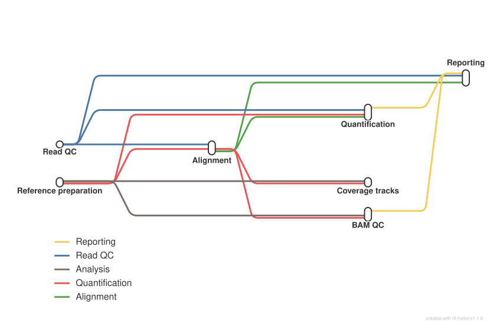

<div class="ox-crumb"><a href="/pipelines/">Pipelines</a> / <span>oxo-flow-rnaseq</span></div>
<div class="ox-detail-cols">
<div>
<h1>RNA-seq: alignment, quantification and QC</h1>
<div class="ox-page-badges"><span class="ox-badge ox-badge--live">✔ Live-tested</span> <span class="ox-badge ox-badge--origin">⇄ Official port</span> <span class="ox-badge ox-badge--nf"><span class="dot"></span>nf-core port</span></div>
<p>End-to-end bulk RNA-seq analysis for paired-end reads: fq lint and FastQC raw-read QC, TrimGalore adapter/quality trimming (including the UMI-extraction path), STAR, HISAT2 and Bowtie2-transcriptome (bowtie2_salmon) alignment with the BBSplit / SortMeRNA / Bowtie2 rRNA-filtered read variants, Picard MarkDuplicates or UMI-tools / UMICollapse dedup (genome and transcriptome chains), Salmon quantification in alignment mode (STAR and Bowtie2 orig_bams, raw and UMI-prepared) and pseudo-alignment mode (Salmon or Kallisto), RSEM alignment-mode quantification with per-sample results and merged count tables, tximport-merged gene/transcript count tables with SummarizedExperiment R objects, StringTie reference-guided assembly and quantification, featureCounts gene counts with biotype tables, RSeQC / dupRadar / Qualimap QC, DESeq2 sample-level QC (PCA, sample distances, size factors) per quantification branch, strand-specific bigWig tracks, and one final MultiQC report with the nf-core/rnaseq custom content (fail_trimmed / fail_mapped tables, strandedness checks, software versions). A faithful port of the nf-core/rnaseq 3.26.0 default star_salmon path plus the star_rsem, hisat2, bowtie2_salmon, with_umi, salmon-pseudo and kallisto-pseudo branches — same tools, same versions, same commands.</p>
</div>
<div>
<div class="ox-glance">
<div class="ox-glance-title">At a glance</div>
<div class="ox-kv"><span class="k">Rating</span><span class="v live">✔ Live-tested</span></div>
<div class="ox-kv"><span class="k">Rules</span><span class="v">145</span></div>
<div class="ox-kv"><span class="k">Compute</span><span class="v">up to 12 CPUs / 72 GB per rule (STAR align)</span></div>
<div class="ox-kv"><span class="k">Engine</span><span class="v"><span class="ox-badge ox-badge--nf"><span class="dot"></span>nf-core port</span></span></div>
<div class="ox-kv"><span class="k">Origin</span><span class="v">⇄ Official port</span></div>
<div class="ox-kv"><span class="k">Domain</span><span class="v">transcriptomics</span></div>
<div class="ox-kv"><span class="k">Source</span><span class="v"><a href="https://github.com/nf-core/rnaseq">nf-core/rnaseq</a></span></div>
<div class="ox-kv"><span class="k">Pinned version</span><span class="v"><code>3.26.0</code></span></div>
<div class="ox-kv"><span class="k">Ported</span><span class="v">2026-08-15</span></div>
<div class="ox-kv"><span class="k">License</span><span class="v">Apache-2.0</span></div>
<div class="ox-kv"><span class="k">Cite</span><span class="v"><a href="https://doi.org/10.48546/workflowhub.workflow.2278.1"><code>10.48546/workflowhub.workflow.2278.1</code></a></span></div>
<p class="cmd">$ oxo-flow run main.oxoflow</p>
</div>
</div>
</div>

## Run it

```bash
oxo-flow run main.oxoflow
```

The default config ships with `test/fixtures/` so the plan previews with no data; a real run needs your reads plus the reference artifacts under Requirements (STAR index, GTF, transcriptome, gene BED, chrom.sizes). Preview first: `oxo-flow dry-run main.oxoflow --samples first:1`.

## Installation

**Engine.** oxo-flow >= 0.17.0

**Toolchain.** conda envs — pinned (envs/*.yaml, versions pinned to the upstream nf-core/rnaseq 3.26.0 module environments; requires conda or mamba)

**Requirements.**

- paired-end FASTQ reads: reads_dir/<sample>_R1.fastq.gz + _R2.fastq.gz, cohort declared in [[sample_groups]]
- reference genome FASTA (uncompressed)
- gene annotation GTF
- transcriptome FASTA (Salmon alignment-mode quant + the bowtie2/salmon/kallisto index builders); empty config key = derived from fasta + gtf by prepare_genome::transcript_fasta (RSEM)
- 12-column gene BED (RSeQC input); empty config key = derived from the GTF by prepare_genome::gene_bed (ea-utils gtf2bed)
- UCSC chrom.sizes file; empty config key = derived from the fasta by prepare_genome::chrom_sizes (samtools faidx)
- branch indexes (STAR / HISAT2 / RSEM / Salmon / Bowtie2 / Kallisto) are auto-built by when-gated builder rules from the shipped fixtures when the config key is empty; for real data set config.star_index / hisat2_index / rsem_index / salmon_index / bowtie2_index / kallisto_index to your own index directories
- compute: up to 12 CPUs / 200 GB per rule (UMI dedup); STAR align 12 CPUs / 72 GB; most rules run on 6 CPUs / 36 GB or 1 CPU / 6 GB
- conda or mamba to create the pinned per-rule environments (envs/)

```bash
# 1. install oxo-flow (release binary, recommended)
curl -fL -o oxo-flow.tar.gz https://github.com/Traitome/oxo-flow/releases/latest/download/oxo-flow-latest-x86_64-unknown-linux-gnu.tar.gz
tar xzf oxo-flow.tar.gz && sudo mv oxo-flow /usr/local/bin/
#    or, via conda (may lag behind releases):
#    conda install -c bioconda oxo-flow-cli
#    NOTE: bioconda currently ships 0.10.2, older than the >= 0.12.0
#    minimum of every catalog entry — prefer the release binary.

# 2. get this workflow (clones the repo, auto-discovers the workflow,
#    sanity-parses it with the engine)
oxo-flow pull gh:oxo-flow-community/oxo-flow-rnaseq
#    (alternative: plain git clone)
#    git clone https://github.com/oxo-flow-community/oxo-flow-rnaseq
```

## Parameters

<p class="ox-param-usage">Parameters are consumed by rules through <code>{config.key}</code> placeholders in inputs, outputs, and shells. Set a value in the workflow's <code>[config]</code> section (edit the file), or override at run time with <code>oxo-flow run -e key=value workflow.oxoflow</code> — repeat <code>-e</code> for multiple keys. The list below names the rules that read each key.</p>
<div class="ox-params">
<div class="ox-param">
<div class="ox-param-head"><code>aligner</code><span class="ox-param-default">star_salmon</span></div>
<p class="ox-param-desc">Aligner selector (upstream: --aligner). The port supports the upstream<br>default &#x27;star_salmon&#x27; plus the non-default branches (star_rsem, hisat2,<br>bowtie2_salmon); all downstream results paths follow<br>{config.out_dir}/{config.aligner}/... exactly like upstream&#x27;s<br>params.aligner-based publishDirs. bowtie2_salmon maps reads to the<br>transcriptome with Bowtie2 and quantifies the orig_bam with Salmon<br>(upstream ALIGN_BOWTIE2 -&gt; QUANTIFY_BAM_SALMON).</p>
<details class="ox-param-usedby"><summary>used by 96 rules</summary>
<div class="ox-param-rules"><code>alignment::bam_dedup_genome_umicollapse</code> <code>alignment::bam_dedup_genome_umitools</code> <code>alignment::bam_dedup_genome_umitools_primary</code> <code>alignment::bam_dedup_genome_umitools_primary_stats</code> <code>alignment::bam_dedup_genome_umitools_stats</code> <code>alignment::bowtie2_align</code> <code>alignment::bowtie2_align_bbsplit</code> <code>alignment::bowtie2_align_bowtie2</code> <code>alignment::bowtie2_align_sortmerna</code> <code>alignment::bowtie2_index</code> <code>alignment::hisat2_align</code> <code>alignment::hisat2_align_bbsplit</code> <code>alignment::hisat2_align_bowtie2</code> <code>alignment::hisat2_align_sortmerna</code> <code>alignment::hisat2_index</code> <code>alignment::hisat2_splicesites</code> <code>alignment::picard_markduplicates</code> <code>alignment::samtools_flagstat_dedup</code> <code>alignment::samtools_flagstat_markdup</code> <code>alignment::samtools_flagstat_sorted</code> <code>alignment::samtools_idxstats_dedup</code> <code>alignment::samtools_idxstats_markdup</code> <code>alignment::samtools_idxstats_sorted</code> <code>alignment::samtools_index_dedup</code> <code>alignment::samtools_index_markdup</code> <code>alignment::samtools_index_primary</code> <code>alignment::samtools_index_sorted</code> <code>alignment::samtools_sort</code> <code>alignment::samtools_sort_bowtie2</code> <code>alignment::samtools_sort_hisat2</code> <code>alignment::samtools_stats_dedup</code> <code>alignment::samtools_stats_markdup</code> <code>alignment::samtools_stats_sorted</code> <code>alignment::samtools_view_primary</code> <code>alignment::star_align</code> <code>alignment::star_align_bbsplit</code> <code>alignment::star_align_bowtie2</code> <code>alignment::star_align_rsem</code> <code>alignment::star_align_rsem_bbsplit</code> <code>alignment::star_align_rsem_bowtie2</code> <code>alignment::star_align_rsem_sortmerna</code> <code>alignment::star_align_sortmerna</code> <code>bam_qc::biotype_multiqc</code> <code>bam_qc::dupradar</code> <code>bam_qc::featurecounts</code> <code>bam_qc::qualimap_rnaseq</code> <code>bam_qc::rseqc_bam_stat</code> <code>bam_qc::rseqc_infer_experiment</code> <code>bam_qc::rseqc_inner_distance</code> <code>bam_qc::rseqc_junction_annotation</code> <code>bam_qc::rseqc_junction_saturation</code> <code>bam_qc::rseqc_read_distribution</code> <code>bam_qc::rseqc_read_duplication</code> <code>bam_qc::samtools_sort_qualimap</code> <code>bigwig::bedclip_combined</code> <code>bigwig::bedclip_fw</code> <code>bigwig::bedclip_rev</code> <code>bigwig::bigwig_combined</code> <code>bigwig::bigwig_fw</code> <code>bigwig::bigwig_rev</code> <code>bigwig::genomecov_combined</code> <code>bigwig::genomecov_fw</code> <code>bigwig::genomecov_rev</code> <code>multiqc</code> <code>multiqc_custom_content</code> <code>prepare_genome::transcript_fasta</code> <code>quantification::bam_dedup_transcriptome_umicollapse</code> <code>quantification::bam_dedup_transcriptome_umitools</code> <code>quantification::bam_dedup_transcriptome_umitools_primary</code> <code>quantification::bam_dedup_transcriptome_umitools_primary_stats</code> <code>quantification::bam_dedup_transcriptome_umitools_stats</code> <code>quantification::bam_sort_transcriptome</code> <code>quantification::bam_sort_transcriptome_bowtie2</code> <code>quantification::deseq2_qc</code> <code>quantification::deseq2_qc_rsem</code> <code>quantification::rsem_calculateexpression</code> <code>quantification::rsem_calculateexpression_umi</code> <code>quantification::rsem_index</code> <code>quantification::rsem_merge_counts</code> <code>quantification::salmon_quant</code> <code>quantification::salmon_quant_bowtie2</code> <code>quantification::salmon_quant_umi</code> <code>quantification::samtools_flagstat_transcriptome_dedup</code> <code>quantification::samtools_idxstats_transcriptome_dedup</code> <code>quantification::samtools_index_primary_transcriptome</code> <code>quantification::samtools_sort_name_transcriptome</code> <code>quantification::samtools_stats_transcriptome_dedup</code> <code>quantification::samtools_view_primary_transcriptome</code> <code>quantification::stringtie</code> <code>quantification::summarizedexperiment</code> <code>quantification::summarizedexperiment_rsem</code> <code>quantification::tx2gene</code> <code>quantification::tx2gene_rsem</code> <code>quantification::tximport</code> <code>quantification::tximport_rsem</code> <code>quantification::umitools_prepareforrsem</code></div>
</details>
</div>
<div class="ox-param">
<div class="ox-param-head"><code>bbsplit_fasta_list</code><span class="ox-param-default"></span></div>
<p class="ox-param-desc">BBSplit genome filtering (upstream: --skip_bbsplit / --bbsplit_fasta_list /<br>--save_bbsplit_reads; same defaults). bbsplit_fasta_list is a 2-column CSV<br>(short_name,path_to_fasta) plus the primary genome in config.fasta.</p>
<details class="ox-param-usedby"><summary>used by 1 rules</summary>
<div class="ox-param-rules"><code>fastq_qc::bbsplit_index</code></div>
</details>
</div>
<div class="ox-param">
<div class="ox-param-head"><code>bbsplit_index</code><span class="ox-param-default"></span></div>
<p class="ox-param-desc">Non-default alignment branches (upstream: --aligner / --skip_alignment /<br>--rsem_index / --hisat2_index / --salmon_index / --bbsplit_index /<br>--sortmerna_index). Empty index keys are auto-built by when-gated builder<br>rules in modules/alignment.oxoflow / quantification.oxoflow from the<br>shipped fixtures when the branch is enabled (like star_index); a<br>user-supplied path is symlinked in instead.</p>
<details class="ox-param-usedby"><summary>used by 1 rules</summary>
<div class="ox-param-rules"><code>fastq_qc::bbsplit_index</code></div>
</details>
</div>
<div class="ox-param">
<div class="ox-param-head"><code>bowtie2_index</code><span class="ox-param-default"></span></div>
<p class="ox-param-desc">Non-default alignment branches (upstream: --aligner / --skip_alignment /<br>--rsem_index / --hisat2_index / --salmon_index / --bbsplit_index /<br>--sortmerna_index). Empty index keys are auto-built by when-gated builder<br>rules in modules/alignment.oxoflow / quantification.oxoflow from the<br>shipped fixtures when the branch is enabled (like star_index); a<br>user-supplied path is symlinked in instead.</p>
<details class="ox-param-usedby"><summary>used by 1 rules</summary>
<div class="ox-param-rules"><code>alignment::bowtie2_index</code></div>
</details>
</div>
<div class="ox-param">
<div class="ox-param-head"><code>chrom_sizes</code><span class="ox-param-default">test/fixtures/reference/chrom_sizes.txt</span></div>
<p class="ox-param-desc">Reference artifacts (upstream: --fasta / --gtf / --gene_bed / --chrom_sizes<br>/ --transcript_fasta / STAR index). fasta and gtf are always inputs; the<br>other three are inputs by default but are DERIVED from fasta+gtf when the<br>key is empty (modules/prepare_genome.oxoflow mirrors upstream PREPARE_GENOME:<br>gene_bed via ea-utils gtf2bed, chrom_sizes via samtools faidx, transcript_fasta<br>via RSEM). The STAR index is an input (auto-built from the shipped fixture<br>genome by the [[references]] builder below when SAindex is missing).</p>
<details class="ox-param-usedby"><summary>used by 1 rules</summary>
<div class="ox-param-rules"><code>prepare_genome::chrom_sizes</code></div>
</details>
</div>
<div class="ox-param">
<div class="ox-param-head"><code>deseq2_vst</code><span class="ox-param-default">true</span></div>
<p class="ox-param-desc">DESeq2 QC transform: variance stabilizing transformation (upstream<br>--deseq2_vst default true).</p>
<details class="ox-param-usedby"><summary>used by 3 rules</summary>
<div class="ox-param-rules"><code>quantification::deseq2_qc</code> <code>quantification::deseq2_qc_pseudo</code> <code>quantification::deseq2_qc_rsem</code></div>
</details>
</div>
<div class="ox-param">
<div class="ox-param-head"><code>extra_fqlint_args</code><span class="ox-param-default">--disable-validator P001</span></div>
<p class="ox-param-desc">fq lint extra args (upstream: --extra_fqlint_args).</p>
<details class="ox-param-usedby"><summary>used by 5 rules</summary>
<div class="ox-param-rules"><code>fastq_qc::fq_lint_bbsplit</code> <code>fastq_qc::fq_lint_raw</code> <code>fastq_qc::fq_lint_rrna_bowtie2</code> <code>fastq_qc::fq_lint_rrna_sortmerna</code> <code>fastq_qc::fq_lint_trimmed</code></div>
</details>
</div>
<div class="ox-param">
<div class="ox-param-head"><code>fasta</code><span class="ox-param-default">test/fixtures/reference/genome.fa</span></div>
<p class="ox-param-desc">Reference artifacts (upstream: --fasta / --gtf / --gene_bed / --chrom_sizes<br>/ --transcript_fasta / STAR index). fasta and gtf are always inputs; the<br>other three are inputs by default but are DERIVED from fasta+gtf when the<br>key is empty (modules/prepare_genome.oxoflow mirrors upstream PREPARE_GENOME:<br>gene_bed via ea-utils gtf2bed, chrom_sizes via samtools faidx, transcript_fasta<br>via RSEM). The STAR index is an input (auto-built from the shipped fixture<br>genome by the [[references]] builder below when SAindex is missing).</p>
<details class="ox-param-usedby"><summary>used by 18 rules</summary>
<div class="ox-param-rules"><code>alignment::hisat2_index</code> <code>alignment::picard_markduplicates</code> <code>alignment::samtools_sort</code> <code>alignment::samtools_sort_bowtie2</code> <code>alignment::samtools_sort_hisat2</code> <code>alignment::samtools_stats_dedup</code> <code>alignment::samtools_stats_markdup</code> <code>alignment::samtools_stats_sorted</code> <code>bam_qc::samtools_sort_qualimap</code> <code>fastq_qc::bbsplit_index</code> <code>prepare_genome::chrom_sizes</code> <code>prepare_genome::transcript_fasta</code> <code>quantification::bam_sort_transcriptome</code> <code>quantification::bam_sort_transcriptome_bowtie2</code> <code>quantification::rsem_index</code> <code>quantification::salmon_index</code> <code>quantification::samtools_sort_name_transcriptome</code> <code>quantification::samtools_stats_transcriptome_dedup</code></div>
</details>
</div>
<div class="ox-param">
<div class="ox-param-head"><code>featurecounts_feature_type</code><span class="ox-param-default">exon</span></div>
<p class="ox-param-desc">featureCounts settings (upstream params with the same defaults).</p>
<details class="ox-param-usedby"><summary>used by 1 rules</summary>
<div class="ox-param-rules"><code>bam_qc::featurecounts</code></div>
</details>
</div>
<div class="ox-param">
<div class="ox-param-head"><code>featurecounts_group_type</code><span class="ox-param-default">gene_biotype</span></div>
<p class="ox-param-desc">featureCounts settings (upstream params with the same defaults).</p>
<details class="ox-param-usedby"><summary>used by 1 rules</summary>
<div class="ox-param-rules"><code>bam_qc::featurecounts</code></div>
</details>
</div>
<div class="ox-param">
<div class="ox-param-head"><code>gene_bed</code><span class="ox-param-default">test/fixtures/reference/gene.bed</span></div>
<p class="ox-param-desc">Reference artifacts (upstream: --fasta / --gtf / --gene_bed / --chrom_sizes<br>/ --transcript_fasta / STAR index). fasta and gtf are always inputs; the<br>other three are inputs by default but are DERIVED from fasta+gtf when the<br>key is empty (modules/prepare_genome.oxoflow mirrors upstream PREPARE_GENOME:<br>gene_bed via ea-utils gtf2bed, chrom_sizes via samtools faidx, transcript_fasta<br>via RSEM). The STAR index is an input (auto-built from the shipped fixture<br>genome by the [[references]] builder below when SAindex is missing).</p>
<details class="ox-param-usedby"><summary>used by 1 rules</summary>
<div class="ox-param-rules"><code>prepare_genome::gene_bed</code></div>
</details>
</div>
<div class="ox-param">
<div class="ox-param-head"><code>gtf</code><span class="ox-param-default">test/fixtures/reference/genes.gtf</span></div>
<p class="ox-param-desc">Reference artifacts (upstream: --fasta / --gtf / --gene_bed / --chrom_sizes<br>/ --transcript_fasta / STAR index). fasta and gtf are always inputs; the<br>other three are inputs by default but are DERIVED from fasta+gtf when the<br>key is empty (modules/prepare_genome.oxoflow mirrors upstream PREPARE_GENOME:<br>gene_bed via ea-utils gtf2bed, chrom_sizes via samtools faidx, transcript_fasta<br>via RSEM). The STAR index is an input (auto-built from the shipped fixture<br>genome by the [[references]] builder below when SAindex is missing).</p>
<details class="ox-param-usedby"><summary>used by 31 rules</summary>
<div class="ox-param-rules"><code>alignment::hisat2_index</code> <code>alignment::hisat2_splicesites</code> <code>alignment::star_align</code> <code>alignment::star_align_bbsplit</code> <code>alignment::star_align_bowtie2</code> <code>alignment::star_align_rsem</code> <code>alignment::star_align_rsem_bbsplit</code> <code>alignment::star_align_rsem_bowtie2</code> <code>alignment::star_align_rsem_sortmerna</code> <code>alignment::star_align_sortmerna</code> <code>bam_qc::dupradar</code> <code>bam_qc::featurecounts</code> <code>bam_qc::qualimap_rnaseq</code> <code>prepare_genome::gene_bed</code> <code>prepare_genome::transcript_fasta</code> <code>quantification::kallisto_quant_pseudo</code> <code>quantification::kallisto_quant_pseudo_bbsplit</code> <code>quantification::kallisto_quant_pseudo_bowtie2</code> <code>quantification::kallisto_quant_pseudo_sortmerna</code> <code>quantification::rsem_index</code> <code>quantification::salmon_quant</code> <code>quantification::salmon_quant_bowtie2</code> <code>quantification::salmon_quant_pseudo</code> <code>quantification::salmon_quant_pseudo_bbsplit</code> <code>quantification::salmon_quant_pseudo_bowtie2</code> <code>quantification::salmon_quant_pseudo_sortmerna</code> <code>quantification::salmon_quant_umi</code> <code>quantification::stringtie</code> <code>quantification::tx2gene</code> <code>quantification::tx2gene_pseudo</code> <code>quantification::tx2gene_rsem</code></div>
</details>
</div>
<div class="ox-param ox-param-unused">
<div class="ox-param-head"><code>gtf_extra_attributes</code><span class="ox-param-default">gene_name</span></div>
<p class="ox-param-desc">tximport gene attributes (upstream: --gtf_group_features /<br>--gtf_extra_attributes; same defaults).</p>
<details class="ox-param-usedby"><summary>not referenced by any rule</summary>
<div class="ox-param-rules">A ported upstream parameter kept for compatibility: no rule reads this key (no <code>{config.*}</code> placeholder in any input, output, or shell), so overriding it has no effect on this workflow.</div>
</details>
</div>
<div class="ox-param ox-param-unused">
<div class="ox-param-head"><code>gtf_group_features</code><span class="ox-param-default">gene_id</span></div>
<p class="ox-param-desc">tximport gene attributes (upstream: --gtf_group_features /<br>--gtf_extra_attributes; same defaults).</p>
<details class="ox-param-usedby"><summary>not referenced by any rule</summary>
<div class="ox-param-rules">A ported upstream parameter kept for compatibility: no rule reads this key (no <code>{config.*}</code> placeholder in any input, output, or shell), so overriding it has no effect on this workflow.</div>
</details>
</div>
<div class="ox-param">
<div class="ox-param-head"><code>hisat2_index</code><span class="ox-param-default"></span></div>
<p class="ox-param-desc">Non-default alignment branches (upstream: --aligner / --skip_alignment /<br>--rsem_index / --hisat2_index / --salmon_index / --bbsplit_index /<br>--sortmerna_index). Empty index keys are auto-built by when-gated builder<br>rules in modules/alignment.oxoflow / quantification.oxoflow from the<br>shipped fixtures when the branch is enabled (like star_index); a<br>user-supplied path is symlinked in instead.</p>
<details class="ox-param-usedby"><summary>used by 1 rules</summary>
<div class="ox-param-rules"><code>alignment::hisat2_index</code></div>
</details>
</div>
<div class="ox-param">
<div class="ox-param-head"><code>kallisto_index</code><span class="ox-param-default"></span></div>
<p class="ox-param-desc">Pseudo-alignment (upstream: --pseudo_aligner, &#x27;salmon&#x27; or &#x27;kallisto&#x27;;<br>default null = alignment-mode Salmon only). Both aligners are ported; the<br>index builders are when-gated on this key (salmon_index / kallisto_index<br>short-circuit with a user-supplied path). pseudo_aligner_kmer_size is the<br>upstream KALLISTO_INDEX -k default (31).</p>
<details class="ox-param-usedby"><summary>used by 1 rules</summary>
<div class="ox-param-rules"><code>quantification::kallisto_index</code></div>
</details>
</div>
<div class="ox-param">
<div class="ox-param-head"><code>min_mapped_reads</code><span class="ox-param-default">5</span></div>
<p class="ox-param-desc">Thresholds (upstream params with the same defaults).</p>
<details class="ox-param-usedby"><summary>used by 1 rules</summary>
<div class="ox-param-rules"><code>multiqc_custom_content</code></div>
</details>
</div>
<div class="ox-param">
<div class="ox-param-head"><code>min_trimmed_reads</code><span class="ox-param-default">10000</span></div>
<p class="ox-param-desc">Thresholds (upstream params with the same defaults).</p>
<details class="ox-param-usedby"><summary>used by 1 rules</summary>
<div class="ox-param-rules"><code>multiqc_custom_content</code></div>
</details>
</div>
<div class="ox-param">
<div class="ox-param-head"><code>out_dir</code><span class="ox-param-default">results</span></div>
<p class="ox-param-desc">Output directory (upstream: --outdir).</p>
<details class="ox-param-usedby"><summary>used by 135 rules</summary>
<div class="ox-param-rules"><code>alignment::bam_dedup_genome_umicollapse</code> <code>alignment::bam_dedup_genome_umitools</code> <code>alignment::bam_dedup_genome_umitools_primary</code> <code>alignment::bam_dedup_genome_umitools_primary_stats</code> <code>alignment::bam_dedup_genome_umitools_stats</code> <code>alignment::bowtie2_align</code> <code>alignment::bowtie2_align_bbsplit</code> <code>alignment::bowtie2_align_bowtie2</code> <code>alignment::bowtie2_align_sortmerna</code> <code>alignment::bowtie2_index</code> <code>alignment::hisat2_align</code> <code>alignment::hisat2_align_bbsplit</code> <code>alignment::hisat2_align_bowtie2</code> <code>alignment::hisat2_align_sortmerna</code> <code>alignment::hisat2_index</code> <code>alignment::hisat2_splicesites</code> <code>alignment::picard_markduplicates</code> <code>alignment::samtools_flagstat_dedup</code> <code>alignment::samtools_flagstat_markdup</code> <code>alignment::samtools_flagstat_sorted</code> <code>alignment::samtools_idxstats_dedup</code> <code>alignment::samtools_idxstats_markdup</code> <code>alignment::samtools_idxstats_sorted</code> <code>alignment::samtools_index_dedup</code> <code>alignment::samtools_index_markdup</code> <code>alignment::samtools_index_primary</code> <code>alignment::samtools_index_sorted</code> <code>alignment::samtools_sort</code> <code>alignment::samtools_sort_bowtie2</code> <code>alignment::samtools_sort_hisat2</code> <code>alignment::samtools_stats_dedup</code> <code>alignment::samtools_stats_markdup</code> <code>alignment::samtools_stats_sorted</code> <code>alignment::samtools_view_primary</code> <code>alignment::star_align</code> <code>alignment::star_align_bbsplit</code> <code>alignment::star_align_bowtie2</code> <code>alignment::star_align_rsem</code> <code>alignment::star_align_rsem_bbsplit</code> <code>alignment::star_align_rsem_bowtie2</code> <code>alignment::star_align_rsem_sortmerna</code> <code>alignment::star_align_sortmerna</code> <code>bam_qc::biotype_multiqc</code> <code>bam_qc::dupradar</code> <code>bam_qc::featurecounts</code> <code>bam_qc::qualimap_rnaseq</code> <code>bam_qc::rseqc_bam_stat</code> <code>bam_qc::rseqc_infer_experiment</code> <code>bam_qc::rseqc_inner_distance</code> <code>bam_qc::rseqc_junction_annotation</code> <code>bam_qc::rseqc_junction_saturation</code> <code>bam_qc::rseqc_read_distribution</code> <code>bam_qc::rseqc_read_duplication</code> <code>bam_qc::samtools_sort_qualimap</code> <code>bigwig::bedclip_combined</code> <code>bigwig::bedclip_fw</code> <code>bigwig::bedclip_rev</code> <code>bigwig::bigwig_combined</code> <code>bigwig::bigwig_fw</code> <code>bigwig::bigwig_rev</code> <code>bigwig::genomecov_combined</code> <code>bigwig::genomecov_fw</code> <code>bigwig::genomecov_rev</code> <code>fastq_qc::bbsplit</code> <code>fastq_qc::bbsplit_index</code> <code>fastq_qc::bowtie2_align_rrna</code> <code>fastq_qc::bowtie2_align_rrna_bbsplit</code> <code>fastq_qc::bowtie2_rrna_index</code> <code>fastq_qc::fastqc_filtered_bbsplit</code> <code>fastq_qc::fastqc_filtered_bowtie2</code> <code>fastq_qc::fastqc_filtered_sortmerna</code> <code>fastq_qc::fastqc_raw</code> <code>fastq_qc::fq_lint_bbsplit</code> <code>fastq_qc::fq_lint_raw</code> <code>fastq_qc::fq_lint_rrna_bowtie2</code> <code>fastq_qc::fq_lint_rrna_sortmerna</code> <code>fastq_qc::fq_lint_trimmed</code> <code>fastq_qc::rrna_fastas_prepare</code> <code>fastq_qc::samtools_fastq_rrna</code> <code>fastq_qc::samtools_view_rrna</code> <code>fastq_qc::sortmerna</code> <code>fastq_qc::sortmerna_bbsplit</code> <code>fastq_qc::sortmerna_index</code> <code>fastq_qc::trimgalore</code> <code>fastq_qc::trimgalore_umi</code> <code>fastq_qc::umitools_extract_umis</code> <code>multiqc</code> <code>multiqc_custom_content</code> <code>prepare_genome::chrom_sizes</code> <code>prepare_genome::gene_bed</code> <code>prepare_genome::transcript_fasta</code> <code>quantification::bam_dedup_transcriptome_umicollapse</code> <code>quantification::bam_dedup_transcriptome_umitools</code> <code>quantification::bam_dedup_transcriptome_umitools_primary</code> <code>quantification::bam_dedup_transcriptome_umitools_primary_stats</code> <code>quantification::bam_dedup_transcriptome_umitools_stats</code> <code>quantification::bam_sort_transcriptome</code> <code>quantification::bam_sort_transcriptome_bowtie2</code> <code>quantification::deseq2_qc</code> <code>quantification::deseq2_qc_pseudo</code> <code>quantification::deseq2_qc_rsem</code> <code>quantification::kallisto_index</code> <code>quantification::kallisto_quant_pseudo</code> <code>quantification::kallisto_quant_pseudo_bbsplit</code> <code>quantification::kallisto_quant_pseudo_bowtie2</code> <code>quantification::kallisto_quant_pseudo_sortmerna</code> <code>quantification::rsem_calculateexpression</code> <code>quantification::rsem_calculateexpression_umi</code> <code>quantification::rsem_index</code> <code>quantification::rsem_merge_counts</code> <code>quantification::salmon_index</code> <code>quantification::salmon_quant</code> <code>quantification::salmon_quant_bowtie2</code> <code>quantification::salmon_quant_pseudo</code> <code>quantification::salmon_quant_pseudo_bbsplit</code> <code>quantification::salmon_quant_pseudo_bowtie2</code> <code>quantification::salmon_quant_pseudo_sortmerna</code> <code>quantification::salmon_quant_umi</code> <code>quantification::samtools_flagstat_transcriptome_dedup</code> <code>quantification::samtools_idxstats_transcriptome_dedup</code> <code>quantification::samtools_index_primary_transcriptome</code> <code>quantification::samtools_sort_name_transcriptome</code> <code>quantification::samtools_stats_transcriptome_dedup</code> <code>quantification::samtools_view_primary_transcriptome</code> <code>quantification::stringtie</code> <code>quantification::summarizedexperiment</code> <code>quantification::summarizedexperiment_pseudo</code> <code>quantification::summarizedexperiment_rsem</code> <code>quantification::tx2gene</code> <code>quantification::tx2gene_pseudo</code> <code>quantification::tx2gene_rsem</code> <code>quantification::tximport</code> <code>quantification::tximport_pseudo</code> <code>quantification::tximport_rsem</code> <code>quantification::umitools_prepareforrsem</code></div>
</details>
</div>
<div class="ox-param">
<div class="ox-param-head"><code>pseudo_aligner</code><span class="ox-param-default"></span></div>
<p class="ox-param-desc">Pseudo-alignment (upstream: --pseudo_aligner, &#x27;salmon&#x27; or &#x27;kallisto&#x27;;<br>default null = alignment-mode Salmon only). Both aligners are ported; the<br>index builders are when-gated on this key (salmon_index / kallisto_index<br>short-circuit with a user-supplied path). pseudo_aligner_kmer_size is the<br>upstream KALLISTO_INDEX -k default (31).</p>
<details class="ox-param-usedby"><summary>used by 16 rules</summary>
<div class="ox-param-rules"><code>multiqc</code> <code>prepare_genome::transcript_fasta</code> <code>quantification::deseq2_qc_pseudo</code> <code>quantification::kallisto_index</code> <code>quantification::kallisto_quant_pseudo</code> <code>quantification::kallisto_quant_pseudo_bbsplit</code> <code>quantification::kallisto_quant_pseudo_bowtie2</code> <code>quantification::kallisto_quant_pseudo_sortmerna</code> <code>quantification::salmon_index</code> <code>quantification::salmon_quant_pseudo</code> <code>quantification::salmon_quant_pseudo_bbsplit</code> <code>quantification::salmon_quant_pseudo_bowtie2</code> <code>quantification::salmon_quant_pseudo_sortmerna</code> <code>quantification::summarizedexperiment_pseudo</code> <code>quantification::tx2gene_pseudo</code> <code>quantification::tximport_pseudo</code></div>
</details>
</div>
<div class="ox-param">
<div class="ox-param-head"><code>pseudo_aligner_kmer_size</code><span class="ox-param-default">31</span></div>
<p class="ox-param-desc">Pseudo-alignment (upstream: --pseudo_aligner, &#x27;salmon&#x27; or &#x27;kallisto&#x27;;<br>default null = alignment-mode Salmon only). Both aligners are ported; the<br>index builders are when-gated on this key (salmon_index / kallisto_index<br>short-circuit with a user-supplied path). pseudo_aligner_kmer_size is the<br>upstream KALLISTO_INDEX -k default (31).</p>
<details class="ox-param-usedby"><summary>used by 1 rules</summary>
<div class="ox-param-rules"><code>quantification::kallisto_index</code></div>
</details>
</div>
<div class="ox-param">
<div class="ox-param-head"><code>reads_dir</code><span class="ox-param-default">test/fixtures/raw</span></div>
<p class="ox-param-desc">Input reads directory: reads_dir/&lt;sample&gt;_R1.fastq.gz + _R2.fastq.gz<br>(paired-end). The repo default ships the tiny committed fixtures; point<br>this at your data.</p>
<details class="ox-param-usedby"><summary>used by 5 rules</summary>
<div class="ox-param-rules"><code>fastq_qc::fastqc_raw</code> <code>fastq_qc::fq_lint_raw</code> <code>fastq_qc::trimgalore</code> <code>fastq_qc::umitools_extract_umis</code> <code>multiqc_custom_content</code></div>
</details>
</div>
<div class="ox-param">
<div class="ox-param-head"><code>remove_ribo_rna</code><span class="ox-param-default">false</span></div>
<p class="ox-param-desc">Ribosomal RNA removal (upstream: --remove_ribo_rna / --ribo_removal_tool /<br>--ribo_database_manifest / --save_non_ribo_reads; same defaults). The<br>manifest is one fasta path per line; .gz entries are gunzipped before use.</p>
<details class="ox-param-usedby"><summary>used by 38 rules</summary>
<div class="ox-param-rules"><code>alignment::bowtie2_align</code> <code>alignment::bowtie2_align_bbsplit</code> <code>alignment::bowtie2_align_bowtie2</code> <code>alignment::bowtie2_align_sortmerna</code> <code>alignment::hisat2_align</code> <code>alignment::hisat2_align_bbsplit</code> <code>alignment::hisat2_align_bowtie2</code> <code>alignment::hisat2_align_sortmerna</code> <code>alignment::star_align</code> <code>alignment::star_align_bbsplit</code> <code>alignment::star_align_bowtie2</code> <code>alignment::star_align_rsem</code> <code>alignment::star_align_rsem_bbsplit</code> <code>alignment::star_align_rsem_bowtie2</code> <code>alignment::star_align_rsem_sortmerna</code> <code>alignment::star_align_sortmerna</code> <code>fastq_qc::bowtie2_align_rrna</code> <code>fastq_qc::bowtie2_align_rrna_bbsplit</code> <code>fastq_qc::bowtie2_rrna_index</code> <code>fastq_qc::fastqc_filtered_bbsplit</code> <code>fastq_qc::fastqc_filtered_bowtie2</code> <code>fastq_qc::fastqc_filtered_sortmerna</code> <code>fastq_qc::fq_lint_rrna_bowtie2</code> <code>fastq_qc::fq_lint_rrna_sortmerna</code> <code>fastq_qc::rrna_fastas_prepare</code> <code>fastq_qc::samtools_fastq_rrna</code> <code>fastq_qc::samtools_view_rrna</code> <code>fastq_qc::sortmerna</code> <code>fastq_qc::sortmerna_bbsplit</code> <code>fastq_qc::sortmerna_index</code> <code>quantification::kallisto_quant_pseudo</code> <code>quantification::kallisto_quant_pseudo_bbsplit</code> <code>quantification::kallisto_quant_pseudo_bowtie2</code> <code>quantification::kallisto_quant_pseudo_sortmerna</code> <code>quantification::salmon_quant_pseudo</code> <code>quantification::salmon_quant_pseudo_bbsplit</code> <code>quantification::salmon_quant_pseudo_bowtie2</code> <code>quantification::salmon_quant_pseudo_sortmerna</code></div>
</details>
</div>
<div class="ox-param">
<div class="ox-param-head"><code>ribo_database_manifest</code><span class="ox-param-default">assets/rrna-db-defaults.txt</span></div>
<p class="ox-param-desc">Ribosomal RNA removal (upstream: --remove_ribo_rna / --ribo_removal_tool /<br>--ribo_database_manifest / --save_non_ribo_reads; same defaults). The<br>manifest is one fasta path per line; .gz entries are gunzipped before use.</p>
<details class="ox-param-usedby"><summary>used by 1 rules</summary>
<div class="ox-param-rules"><code>fastq_qc::rrna_fastas_prepare</code></div>
</details>
</div>
<div class="ox-param">
<div class="ox-param-head"><code>ribo_removal_tool</code><span class="ox-param-default">sortmerna</span></div>
<p class="ox-param-desc">Ribosomal RNA removal (upstream: --remove_ribo_rna / --ribo_removal_tool /<br>--ribo_database_manifest / --save_non_ribo_reads; same defaults). The<br>manifest is one fasta path per line; .gz entries are gunzipped before use.</p>
<details class="ox-param-usedby"><summary>used by 25 rules</summary>
<div class="ox-param-rules"><code>alignment::bowtie2_align_bowtie2</code> <code>alignment::bowtie2_align_sortmerna</code> <code>alignment::hisat2_align_bowtie2</code> <code>alignment::hisat2_align_sortmerna</code> <code>alignment::star_align_bowtie2</code> <code>alignment::star_align_rsem_bowtie2</code> <code>alignment::star_align_rsem_sortmerna</code> <code>alignment::star_align_sortmerna</code> <code>fastq_qc::bowtie2_align_rrna</code> <code>fastq_qc::bowtie2_align_rrna_bbsplit</code> <code>fastq_qc::bowtie2_rrna_index</code> <code>fastq_qc::fastqc_filtered_bowtie2</code> <code>fastq_qc::fastqc_filtered_sortmerna</code> <code>fastq_qc::fq_lint_rrna_bowtie2</code> <code>fastq_qc::fq_lint_rrna_sortmerna</code> <code>fastq_qc::rrna_fastas_prepare</code> <code>fastq_qc::samtools_fastq_rrna</code> <code>fastq_qc::samtools_view_rrna</code> <code>fastq_qc::sortmerna</code> <code>fastq_qc::sortmerna_bbsplit</code> <code>fastq_qc::sortmerna_index</code> <code>quantification::kallisto_quant_pseudo_bowtie2</code> <code>quantification::kallisto_quant_pseudo_sortmerna</code> <code>quantification::salmon_quant_pseudo_bowtie2</code> <code>quantification::salmon_quant_pseudo_sortmerna</code></div>
</details>
</div>
<div class="ox-param">
<div class="ox-param-head"><code>rsem_index</code><span class="ox-param-default"></span></div>
<p class="ox-param-desc">Non-default alignment branches (upstream: --aligner / --skip_alignment /<br>--rsem_index / --hisat2_index / --salmon_index / --bbsplit_index /<br>--sortmerna_index). Empty index keys are auto-built by when-gated builder<br>rules in modules/alignment.oxoflow / quantification.oxoflow from the<br>shipped fixtures when the branch is enabled (like star_index); a<br>user-supplied path is symlinked in instead.</p>
<details class="ox-param-usedby"><summary>used by 1 rules</summary>
<div class="ox-param-rules"><code>quantification::rsem_index</code></div>
</details>
</div>
<div class="ox-param">
<div class="ox-param-head"><code>salmon_index</code><span class="ox-param-default"></span></div>
<p class="ox-param-desc">Non-default alignment branches (upstream: --aligner / --skip_alignment /<br>--rsem_index / --hisat2_index / --salmon_index / --bbsplit_index /<br>--sortmerna_index). Empty index keys are auto-built by when-gated builder<br>rules in modules/alignment.oxoflow / quantification.oxoflow from the<br>shipped fixtures when the branch is enabled (like star_index); a<br>user-supplied path is symlinked in instead.</p>
<details class="ox-param-usedby"><summary>used by 1 rules</summary>
<div class="ox-param-rules"><code>quantification::salmon_index</code></div>
</details>
</div>
<div class="ox-param">
<div class="ox-param-head"><code>salmon_quant_libtype</code><span class="ox-param-default"></span></div>
<p class="ox-param-desc">Salmon quantification (upstream default path, alignment mode on the STAR<br>toTranscriptome BAM). --libType is derived from config.strandedness<br>(forward -&gt; ISF, reverse -&gt; ISR, unstranded -&gt; IU); set<br>salmon_quant_libtype to override (e.g. &quot;A&quot; for auto-detection).</p>
<details class="ox-param-usedby"><summary>used by 7 rules</summary>
<div class="ox-param-rules"><code>quantification::salmon_quant</code> <code>quantification::salmon_quant_bowtie2</code> <code>quantification::salmon_quant_pseudo</code> <code>quantification::salmon_quant_pseudo_bbsplit</code> <code>quantification::salmon_quant_pseudo_bowtie2</code> <code>quantification::salmon_quant_pseudo_sortmerna</code> <code>quantification::salmon_quant_umi</code></div>
</details>
</div>
<div class="ox-param ox-param-unused">
<div class="ox-param-head"><code>save_align_intermeds</code><span class="ox-param-default">false</span></div>
<p class="ox-param-desc">Publication controls (upstream: --save_trimmed / --save_align_intermeds).<br>The port keeps trimmed FASTQs and intermediate BAMs at results/ paths<br>regardless (they double as checkpoints); these keys are accepted for<br>upstream parity and reserved for future use.</p>
<details class="ox-param-usedby"><summary>not referenced by any rule</summary>
<div class="ox-param-rules">A ported upstream parameter kept for compatibility: no rule reads this key (no <code>{config.*}</code> placeholder in any input, output, or shell), so overriding it has no effect on this workflow.</div>
</details>
</div>
<div class="ox-param ox-param-unused">
<div class="ox-param-head"><code>save_bbsplit_reads</code><span class="ox-param-default">false</span></div>
<p class="ox-param-desc">BBSplit genome filtering (upstream: --skip_bbsplit / --bbsplit_fasta_list /<br>--save_bbsplit_reads; same defaults). bbsplit_fasta_list is a 2-column CSV<br>(short_name,path_to_fasta) plus the primary genome in config.fasta.</p>
<details class="ox-param-usedby"><summary>not referenced by any rule</summary>
<div class="ox-param-rules">A ported upstream parameter kept for compatibility: no rule reads this key (no <code>{config.*}</code> placeholder in any input, output, or shell), so overriding it has no effect on this workflow.</div>
</details>
</div>
<div class="ox-param ox-param-unused">
<div class="ox-param-head"><code>save_non_ribo_reads</code><span class="ox-param-default">false</span></div>
<p class="ox-param-desc">Ribosomal RNA removal (upstream: --remove_ribo_rna / --ribo_removal_tool /<br>--ribo_database_manifest / --save_non_ribo_reads; same defaults). The<br>manifest is one fasta path per line; .gz entries are gunzipped before use.</p>
<details class="ox-param-usedby"><summary>not referenced by any rule</summary>
<div class="ox-param-rules">A ported upstream parameter kept for compatibility: no rule reads this key (no <code>{config.*}</code> placeholder in any input, output, or shell), so overriding it has no effect on this workflow.</div>
</details>
</div>
<div class="ox-param ox-param-unused">
<div class="ox-param-head"><code>save_trimmed</code><span class="ox-param-default">false</span></div>
<p class="ox-param-desc">Publication controls (upstream: --save_trimmed / --save_align_intermeds).<br>The port keeps trimmed FASTQs and intermediate BAMs at results/ paths<br>regardless (they double as checkpoints); these keys are accepted for<br>upstream parity and reserved for future use.</p>
<details class="ox-param-usedby"><summary>not referenced by any rule</summary>
<div class="ox-param-rules">A ported upstream parameter kept for compatibility: no rule reads this key (no <code>{config.*}</code> placeholder in any input, output, or shell), so overriding it has no effect on this workflow.</div>
</details>
</div>
<div class="ox-param ox-param-unused">
<div class="ox-param-head"><code>save_umi_intermeds</code><span class="ox-param-default">false</span></div>
<p class="ox-param-desc">Empty = no --umi-separator flag (upstream default null).</p>
<details class="ox-param-usedby"><summary>not referenced by any rule</summary>
<div class="ox-param-rules">A ported upstream parameter kept for compatibility: no rule reads this key (no <code>{config.*}</code> placeholder in any input, output, or shell), so overriding it has no effect on this workflow.</div>
</details>
</div>
<div class="ox-param">
<div class="ox-param-head"><code>skip_alignment</code><span class="ox-param-default">false</span></div>
<p class="ox-param-desc">Non-default alignment branches (upstream: --aligner / --skip_alignment /<br>--rsem_index / --hisat2_index / --salmon_index / --bbsplit_index /<br>--sortmerna_index). Empty index keys are auto-built by when-gated builder<br>rules in modules/alignment.oxoflow / quantification.oxoflow from the<br>shipped fixtures when the branch is enabled (like star_index); a<br>user-supplied path is symlinked in instead.</p>
<details class="ox-param-usedby"><summary>used by 61 rules</summary>
<div class="ox-param-rules"><code>alignment::bam_dedup_genome_umicollapse</code> <code>alignment::bam_dedup_genome_umitools</code> <code>alignment::bam_dedup_genome_umitools_primary</code> <code>alignment::bam_dedup_genome_umitools_primary_stats</code> <code>alignment::bam_dedup_genome_umitools_stats</code> <code>alignment::bowtie2_align</code> <code>alignment::bowtie2_align_bbsplit</code> <code>alignment::bowtie2_align_bowtie2</code> <code>alignment::bowtie2_align_sortmerna</code> <code>alignment::bowtie2_index</code> <code>alignment::hisat2_align</code> <code>alignment::hisat2_align_bbsplit</code> <code>alignment::hisat2_align_bowtie2</code> <code>alignment::hisat2_align_sortmerna</code> <code>alignment::hisat2_index</code> <code>alignment::hisat2_splicesites</code> <code>alignment::samtools_flagstat_dedup</code> <code>alignment::samtools_idxstats_dedup</code> <code>alignment::samtools_index_dedup</code> <code>alignment::samtools_index_primary</code> <code>alignment::samtools_sort_bowtie2</code> <code>alignment::samtools_sort_hisat2</code> <code>alignment::samtools_stats_dedup</code> <code>alignment::samtools_view_primary</code> <code>alignment::star_align</code> <code>alignment::star_align_bbsplit</code> <code>alignment::star_align_bowtie2</code> <code>alignment::star_align_rsem</code> <code>alignment::star_align_rsem_bbsplit</code> <code>alignment::star_align_rsem_bowtie2</code> <code>alignment::star_align_rsem_sortmerna</code> <code>alignment::star_align_sortmerna</code> <code>prepare_genome::transcript_fasta</code> <code>quantification::bam_dedup_transcriptome_umicollapse</code> <code>quantification::bam_dedup_transcriptome_umitools</code> <code>quantification::bam_dedup_transcriptome_umitools_primary</code> <code>quantification::bam_dedup_transcriptome_umitools_primary_stats</code> <code>quantification::bam_dedup_transcriptome_umitools_stats</code> <code>quantification::bam_sort_transcriptome</code> <code>quantification::bam_sort_transcriptome_bowtie2</code> <code>quantification::deseq2_qc</code> <code>quantification::deseq2_qc_rsem</code> <code>quantification::rsem_calculateexpression</code> <code>quantification::rsem_calculateexpression_umi</code> <code>quantification::rsem_merge_counts</code> <code>quantification::salmon_quant</code> <code>quantification::salmon_quant_bowtie2</code> <code>quantification::salmon_quant_umi</code> <code>quantification::samtools_flagstat_transcriptome_dedup</code> <code>quantification::samtools_idxstats_transcriptome_dedup</code> <code>quantification::samtools_index_primary_transcriptome</code> <code>quantification::samtools_sort_name_transcriptome</code> <code>quantification::samtools_stats_transcriptome_dedup</code> <code>quantification::samtools_view_primary_transcriptome</code> <code>quantification::summarizedexperiment</code> <code>quantification::summarizedexperiment_rsem</code> <code>quantification::tx2gene</code> <code>quantification::tx2gene_rsem</code> <code>quantification::tximport</code> <code>quantification::tximport_rsem</code> <code>quantification::umitools_prepareforrsem</code></div>
</details>
</div>
<div class="ox-param">
<div class="ox-param-head"><code>skip_bbsplit</code><span class="ox-param-default">true</span></div>
<p class="ox-param-desc">BBSplit genome filtering (upstream: --skip_bbsplit / --bbsplit_fasta_list /<br>--save_bbsplit_reads; same defaults). bbsplit_fasta_list is a 2-column CSV<br>(short_name,path_to_fasta) plus the primary genome in config.fasta.</p>
<details class="ox-param-usedby"><summary>used by 20 rules</summary>
<div class="ox-param-rules"><code>alignment::bowtie2_align</code> <code>alignment::bowtie2_align_bbsplit</code> <code>alignment::hisat2_align</code> <code>alignment::hisat2_align_bbsplit</code> <code>alignment::star_align</code> <code>alignment::star_align_bbsplit</code> <code>alignment::star_align_rsem</code> <code>alignment::star_align_rsem_bbsplit</code> <code>fastq_qc::bbsplit</code> <code>fastq_qc::bbsplit_index</code> <code>fastq_qc::bowtie2_align_rrna</code> <code>fastq_qc::bowtie2_align_rrna_bbsplit</code> <code>fastq_qc::fastqc_filtered_bbsplit</code> <code>fastq_qc::fq_lint_bbsplit</code> <code>fastq_qc::sortmerna</code> <code>fastq_qc::sortmerna_bbsplit</code> <code>quantification::kallisto_quant_pseudo</code> <code>quantification::kallisto_quant_pseudo_bbsplit</code> <code>quantification::salmon_quant_pseudo</code> <code>quantification::salmon_quant_pseudo_bbsplit</code></div>
</details>
</div>
<div class="ox-param">
<div class="ox-param-head"><code>skip_bigwig</code><span class="ox-param-default">false</span></div>
<p class="ox-param-desc">Skip options (upstream: --skip_fastqc / --skip_linting / --skip_trimming /<br>--skip_markduplicates / --skip_qc / --skip_bigwig). Same defaults as<br>upstream. NOTE: skip_trimming=true and skip_markduplicates=true break the<br>downstream chain (trimmed reads / markdup BAM are inputs of later rules);<br>unlike upstream there is no per-branch rewire, see README fidelity table.</p>
<details class="ox-param-usedby"><summary>used by 10 rules</summary>
<div class="ox-param-rules"><code>bigwig::bedclip_combined</code> <code>bigwig::bedclip_fw</code> <code>bigwig::bedclip_rev</code> <code>bigwig::bigwig_combined</code> <code>bigwig::bigwig_fw</code> <code>bigwig::bigwig_rev</code> <code>bigwig::genomecov_combined</code> <code>bigwig::genomecov_fw</code> <code>bigwig::genomecov_rev</code> <code>prepare_genome::chrom_sizes</code></div>
</details>
</div>
<div class="ox-param">
<div class="ox-param-head"><code>skip_deseq2_qc</code><span class="ox-param-default">false</span></div>
<p class="ox-param-desc">DESeq2 sample-level QC (PCA / sample distances / size factors; upstream<br>default path, runs on salmon.merged.gene_counts_length_scaled.tsv).</p>
<details class="ox-param-usedby"><summary>used by 3 rules</summary>
<div class="ox-param-rules"><code>quantification::deseq2_qc</code> <code>quantification::deseq2_qc_pseudo</code> <code>quantification::deseq2_qc_rsem</code></div>
</details>
</div>
<div class="ox-param">
<div class="ox-param-head"><code>skip_fastqc</code><span class="ox-param-default">false</span></div>
<p class="ox-param-desc">Skip options (upstream: --skip_fastqc / --skip_linting / --skip_trimming /<br>--skip_markduplicates / --skip_qc / --skip_bigwig). Same defaults as<br>upstream. NOTE: skip_trimming=true and skip_markduplicates=true break the<br>downstream chain (trimmed reads / markdup BAM are inputs of later rules);<br>unlike upstream there is no per-branch rewire, see README fidelity table.</p>
<details class="ox-param-usedby"><summary>used by 4 rules</summary>
<div class="ox-param-rules"><code>fastq_qc::fastqc_filtered_bbsplit</code> <code>fastq_qc::fastqc_filtered_bowtie2</code> <code>fastq_qc::fastqc_filtered_sortmerna</code> <code>fastq_qc::fastqc_raw</code></div>
</details>
</div>
<div class="ox-param">
<div class="ox-param-head"><code>skip_linting</code><span class="ox-param-default">false</span></div>
<p class="ox-param-desc">Skip options (upstream: --skip_fastqc / --skip_linting / --skip_trimming /<br>--skip_markduplicates / --skip_qc / --skip_bigwig). Same defaults as<br>upstream. NOTE: skip_trimming=true and skip_markduplicates=true break the<br>downstream chain (trimmed reads / markdup BAM are inputs of later rules);<br>unlike upstream there is no per-branch rewire, see README fidelity table.</p>
<details class="ox-param-usedby"><summary>used by 5 rules</summary>
<div class="ox-param-rules"><code>fastq_qc::fq_lint_bbsplit</code> <code>fastq_qc::fq_lint_raw</code> <code>fastq_qc::fq_lint_rrna_bowtie2</code> <code>fastq_qc::fq_lint_rrna_sortmerna</code> <code>fastq_qc::fq_lint_trimmed</code></div>
</details>
</div>
<div class="ox-param">
<div class="ox-param-head"><code>skip_markduplicates</code><span class="ox-param-default">false</span></div>
<p class="ox-param-desc">Skip options (upstream: --skip_fastqc / --skip_linting / --skip_trimming /<br>--skip_markduplicates / --skip_qc / --skip_bigwig). Same defaults as<br>upstream. NOTE: skip_trimming=true and skip_markduplicates=true break the<br>downstream chain (trimmed reads / markdup BAM are inputs of later rules);<br>unlike upstream there is no per-branch rewire, see README fidelity table.</p>
<details class="ox-param-usedby"><summary>used by 5 rules</summary>
<div class="ox-param-rules"><code>alignment::picard_markduplicates</code> <code>alignment::samtools_flagstat_markdup</code> <code>alignment::samtools_idxstats_markdup</code> <code>alignment::samtools_index_markdup</code> <code>alignment::samtools_stats_markdup</code></div>
</details>
</div>
<div class="ox-param">
<div class="ox-param-head"><code>skip_pseudo_alignment</code><span class="ox-param-default">false</span></div>
<p class="ox-param-desc">Pseudo-alignment (upstream: --pseudo_aligner, &#x27;salmon&#x27; or &#x27;kallisto&#x27;;<br>default null = alignment-mode Salmon only). Both aligners are ported; the<br>index builders are when-gated on this key (salmon_index / kallisto_index<br>short-circuit with a user-supplied path). pseudo_aligner_kmer_size is the<br>upstream KALLISTO_INDEX -k default (31).</p>
<details class="ox-param-usedby"><summary>used by 15 rules</summary>
<div class="ox-param-rules"><code>prepare_genome::transcript_fasta</code> <code>quantification::deseq2_qc_pseudo</code> <code>quantification::kallisto_index</code> <code>quantification::kallisto_quant_pseudo</code> <code>quantification::kallisto_quant_pseudo_bbsplit</code> <code>quantification::kallisto_quant_pseudo_bowtie2</code> <code>quantification::kallisto_quant_pseudo_sortmerna</code> <code>quantification::salmon_index</code> <code>quantification::salmon_quant_pseudo</code> <code>quantification::salmon_quant_pseudo_bbsplit</code> <code>quantification::salmon_quant_pseudo_bowtie2</code> <code>quantification::salmon_quant_pseudo_sortmerna</code> <code>quantification::summarizedexperiment_pseudo</code> <code>quantification::tx2gene_pseudo</code> <code>quantification::tximport_pseudo</code></div>
</details>
</div>
<div class="ox-param">
<div class="ox-param-head"><code>skip_qc</code><span class="ox-param-default">false</span></div>
<p class="ox-param-desc">Skip options (upstream: --skip_fastqc / --skip_linting / --skip_trimming /<br>--skip_markduplicates / --skip_qc / --skip_bigwig). Same defaults as<br>upstream. NOTE: skip_trimming=true and skip_markduplicates=true break the<br>downstream chain (trimmed reads / markdup BAM are inputs of later rules);<br>unlike upstream there is no per-branch rewire, see README fidelity table.</p>
<details class="ox-param-usedby"><summary>used by 16 rules</summary>
<div class="ox-param-rules"><code>bam_qc::biotype_multiqc</code> <code>bam_qc::dupradar</code> <code>bam_qc::featurecounts</code> <code>bam_qc::qualimap_rnaseq</code> <code>bam_qc::rseqc_bam_stat</code> <code>bam_qc::rseqc_infer_experiment</code> <code>bam_qc::rseqc_inner_distance</code> <code>bam_qc::rseqc_junction_annotation</code> <code>bam_qc::rseqc_junction_saturation</code> <code>bam_qc::rseqc_read_distribution</code> <code>bam_qc::rseqc_read_duplication</code> <code>bam_qc::samtools_sort_qualimap</code> <code>prepare_genome::gene_bed</code> <code>quantification::deseq2_qc</code> <code>quantification::deseq2_qc_pseudo</code> <code>quantification::deseq2_qc_rsem</code></div>
</details>
</div>
<div class="ox-param">
<div class="ox-param-head"><code>skip_quantification_merge</code><span class="ox-param-default">false</span></div>
<p class="ox-param-desc">Cross-sample tximport merge + SummarizedExperiment RDS objects.</p>
<details class="ox-param-usedby"><summary>used by 10 rules</summary>
<div class="ox-param-rules"><code>quantification::deseq2_qc</code> <code>quantification::deseq2_qc_pseudo</code> <code>quantification::deseq2_qc_rsem</code> <code>quantification::rsem_merge_counts</code> <code>quantification::summarizedexperiment</code> <code>quantification::summarizedexperiment_pseudo</code> <code>quantification::summarizedexperiment_rsem</code> <code>quantification::tximport</code> <code>quantification::tximport_pseudo</code> <code>quantification::tximport_rsem</code></div>
</details>
</div>
<div class="ox-param">
<div class="ox-param-head"><code>skip_stringtie</code><span class="ox-param-default">false</span></div>
<p class="ox-param-desc">StringTie reference-guided assembly/quantification (-G gtf, -e, ballgown).</p>
<details class="ox-param-usedby"><summary>used by 1 rules</summary>
<div class="ox-param-rules"><code>quantification::stringtie</code></div>
</details>
</div>
<div class="ox-param">
<div class="ox-param-head"><code>skip_trimming</code><span class="ox-param-default">false</span></div>
<p class="ox-param-desc">Skip options (upstream: --skip_fastqc / --skip_linting / --skip_trimming /<br>--skip_markduplicates / --skip_qc / --skip_bigwig). Same defaults as<br>upstream. NOTE: skip_trimming=true and skip_markduplicates=true break the<br>downstream chain (trimmed reads / markdup BAM are inputs of later rules);<br>unlike upstream there is no per-branch rewire, see README fidelity table.</p>
<details class="ox-param-usedby"><summary>used by 2 rules</summary>
<div class="ox-param-rules"><code>fastq_qc::trimgalore</code> <code>fastq_qc::trimgalore_umi</code></div>
</details>
</div>
<div class="ox-param">
<div class="ox-param-head"><code>skip_umi_extract</code><span class="ox-param-default">false</span></div>
<p class="ox-param-desc">UMI handling (upstream: --with_umi / --skip_umi_extract / --umi_dedup_tool /<br>--umitools_* / --umi_discard_read / --save_umi_intermeds; same defaults).</p>
<details class="ox-param-usedby"><summary>used by 3 rules</summary>
<div class="ox-param-rules"><code>fastq_qc::trimgalore</code> <code>fastq_qc::trimgalore_umi</code> <code>fastq_qc::umitools_extract_umis</code></div>
</details>
</div>
<div class="ox-param">
<div class="ox-param-head"><code>sortmerna_index</code><span class="ox-param-default"></span></div>
<p class="ox-param-desc">Non-default alignment branches (upstream: --aligner / --skip_alignment /<br>--rsem_index / --hisat2_index / --salmon_index / --bbsplit_index /<br>--sortmerna_index). Empty index keys are auto-built by when-gated builder<br>rules in modules/alignment.oxoflow / quantification.oxoflow from the<br>shipped fixtures when the branch is enabled (like star_index); a<br>user-supplied path is symlinked in instead.</p>
<details class="ox-param-usedby"><summary>used by 1 rules</summary>
<div class="ox-param-rules"><code>fastq_qc::sortmerna_index</code></div>
</details>
</div>
<div class="ox-param">
<div class="ox-param-head"><code>star_index</code><span class="ox-param-default">test/fixtures/reference/star_index</span></div>
<p class="ox-param-desc">Reference artifacts (upstream: --fasta / --gtf / --gene_bed / --chrom_sizes<br>/ --transcript_fasta / STAR index). fasta and gtf are always inputs; the<br>other three are inputs by default but are DERIVED from fasta+gtf when the<br>key is empty (modules/prepare_genome.oxoflow mirrors upstream PREPARE_GENOME:<br>gene_bed via ea-utils gtf2bed, chrom_sizes via samtools faidx, transcript_fasta<br>via RSEM). The STAR index is an input (auto-built from the shipped fixture<br>genome by the [[references]] builder below when SAindex is missing).</p>
<details class="ox-param-usedby"><summary>used by 8 rules</summary>
<div class="ox-param-rules"><code>alignment::star_align</code> <code>alignment::star_align_bbsplit</code> <code>alignment::star_align_bowtie2</code> <code>alignment::star_align_rsem</code> <code>alignment::star_align_rsem_bbsplit</code> <code>alignment::star_align_rsem_bowtie2</code> <code>alignment::star_align_rsem_sortmerna</code> <code>alignment::star_align_sortmerna</code></div>
</details>
</div>
<div class="ox-param">
<div class="ox-param-head"><code>stranded_threshold</code><span class="ox-param-default">0.8</span></div>
<p class="ox-param-desc">Thresholds (upstream params with the same defaults).</p>
<details class="ox-param-usedby"><summary>used by 1 rules</summary>
<div class="ox-param-rules"><code>multiqc_custom_content</code></div>
</details>
</div>
<div class="ox-param">
<div class="ox-param-head"><code>strandedness</code><span class="ox-param-default">unstranded</span></div>
<p class="ox-param-desc">Library strandedness. Upstream reads this per-sample from the samplesheet<br>(&#x27;auto&#x27; supported); the port is pipeline-level and supports the three<br>explicit values only. Used by featureCounts (-s), Qualimap (-p), dupRadar<br>and the forward/reverse bigWig gates.</p>
<details class="ox-param-usedby"><summary>used by 28 rules</summary>
<div class="ox-param-rules"><code>alignment::hisat2_align</code> <code>alignment::hisat2_align_bbsplit</code> <code>alignment::hisat2_align_bowtie2</code> <code>alignment::hisat2_align_sortmerna</code> <code>bam_qc::dupradar</code> <code>bam_qc::featurecounts</code> <code>bam_qc::qualimap_rnaseq</code> <code>bigwig::bedclip_fw</code> <code>bigwig::bedclip_rev</code> <code>bigwig::bigwig_fw</code> <code>bigwig::bigwig_rev</code> <code>bigwig::genomecov_fw</code> <code>bigwig::genomecov_rev</code> <code>multiqc_custom_content</code> <code>quantification::kallisto_quant_pseudo</code> <code>quantification::kallisto_quant_pseudo_bbsplit</code> <code>quantification::kallisto_quant_pseudo_bowtie2</code> <code>quantification::kallisto_quant_pseudo_sortmerna</code> <code>quantification::rsem_calculateexpression</code> <code>quantification::rsem_calculateexpression_umi</code> <code>quantification::salmon_quant</code> <code>quantification::salmon_quant_bowtie2</code> <code>quantification::salmon_quant_pseudo</code> <code>quantification::salmon_quant_pseudo_bbsplit</code> <code>quantification::salmon_quant_pseudo_bowtie2</code> <code>quantification::salmon_quant_pseudo_sortmerna</code> <code>quantification::salmon_quant_umi</code> <code>quantification::stringtie</code></div>
</details>
</div>
<div class="ox-param">
<div class="ox-param-head"><code>transcript_fasta</code><span class="ox-param-default">test/fixtures/reference/transcripts.fa</span></div>
<p class="ox-param-desc">Reference artifacts (upstream: --fasta / --gtf / --gene_bed / --chrom_sizes<br>/ --transcript_fasta / STAR index). fasta and gtf are always inputs; the<br>other three are inputs by default but are DERIVED from fasta+gtf when the<br>key is empty (modules/prepare_genome.oxoflow mirrors upstream PREPARE_GENOME:<br>gene_bed via ea-utils gtf2bed, chrom_sizes via samtools faidx, transcript_fasta<br>via RSEM). The STAR index is an input (auto-built from the shipped fixture<br>genome by the [[references]] builder below when SAindex is missing).</p>
<details class="ox-param-usedby"><summary>used by 1 rules</summary>
<div class="ox-param-rules"><code>prepare_genome::transcript_fasta</code></div>
</details>
</div>
<div class="ox-param">
<div class="ox-param-head"><code>umi_dedup_tool</code><span class="ox-param-default">umitools</span></div>
<p class="ox-param-desc">UMI handling (upstream: --with_umi / --skip_umi_extract / --umi_dedup_tool /<br>--umitools_* / --umi_discard_read / --save_umi_intermeds; same defaults).</p>
<details class="ox-param-usedby"><summary>used by 14 rules</summary>
<div class="ox-param-rules"><code>alignment::bam_dedup_genome_umicollapse</code> <code>alignment::bam_dedup_genome_umitools</code> <code>alignment::bam_dedup_genome_umitools_primary</code> <code>alignment::bam_dedup_genome_umitools_primary_stats</code> <code>alignment::bam_dedup_genome_umitools_stats</code> <code>alignment::samtools_index_primary</code> <code>alignment::samtools_view_primary</code> <code>quantification::bam_dedup_transcriptome_umicollapse</code> <code>quantification::bam_dedup_transcriptome_umitools</code> <code>quantification::bam_dedup_transcriptome_umitools_primary</code> <code>quantification::bam_dedup_transcriptome_umitools_primary_stats</code> <code>quantification::bam_dedup_transcriptome_umitools_stats</code> <code>quantification::samtools_index_primary_transcriptome</code> <code>quantification::samtools_view_primary_transcriptome</code></div>
</details>
</div>
<div class="ox-param ox-param-unused">
<div class="ox-param-head"><code>umi_discard_read</code><span class="ox-param-default">0</span></div>
<p class="ox-param-desc">Empty = no --umi-separator flag (upstream default null).</p>
<details class="ox-param-usedby"><summary>not referenced by any rule</summary>
<div class="ox-param-rules">A ported upstream parameter kept for compatibility: no rule reads this key (no <code>{config.*}</code> placeholder in any input, output, or shell), so overriding it has no effect on this workflow.</div>
</details>
</div>
<div class="ox-param">
<div class="ox-param-head"><code>umitools_dedup_primary_only</code><span class="ox-param-default">false</span></div>
<p class="ox-param-desc">UMI handling (upstream: --with_umi / --skip_umi_extract / --umi_dedup_tool /<br>--umitools_* / --umi_discard_read / --save_umi_intermeds; same defaults).</p>
<details class="ox-param-usedby"><summary>used by 12 rules</summary>
<div class="ox-param-rules"><code>alignment::bam_dedup_genome_umitools</code> <code>alignment::bam_dedup_genome_umitools_primary</code> <code>alignment::bam_dedup_genome_umitools_primary_stats</code> <code>alignment::bam_dedup_genome_umitools_stats</code> <code>alignment::samtools_index_primary</code> <code>alignment::samtools_view_primary</code> <code>quantification::bam_dedup_transcriptome_umitools</code> <code>quantification::bam_dedup_transcriptome_umitools_primary</code> <code>quantification::bam_dedup_transcriptome_umitools_primary_stats</code> <code>quantification::bam_dedup_transcriptome_umitools_stats</code> <code>quantification::samtools_index_primary_transcriptome</code> <code>quantification::samtools_view_primary_transcriptome</code></div>
</details>
</div>
<div class="ox-param">
<div class="ox-param-head"><code>umitools_dedup_stats</code><span class="ox-param-default">false</span></div>
<p class="ox-param-desc">UMI handling (upstream: --with_umi / --skip_umi_extract / --umi_dedup_tool /<br>--umitools_* / --umi_discard_read / --save_umi_intermeds; same defaults).</p>
<details class="ox-param-usedby"><summary>used by 8 rules</summary>
<div class="ox-param-rules"><code>alignment::bam_dedup_genome_umitools</code> <code>alignment::bam_dedup_genome_umitools_primary</code> <code>alignment::bam_dedup_genome_umitools_primary_stats</code> <code>alignment::bam_dedup_genome_umitools_stats</code> <code>quantification::bam_dedup_transcriptome_umitools</code> <code>quantification::bam_dedup_transcriptome_umitools_primary</code> <code>quantification::bam_dedup_transcriptome_umitools_primary_stats</code> <code>quantification::bam_dedup_transcriptome_umitools_stats</code></div>
</details>
</div>
<div class="ox-param ox-param-unused">
<div class="ox-param-head"><code>umitools_grouping_method</code><span class="ox-param-default">directional</span></div>
<p class="ox-param-desc">UMI handling (upstream: --with_umi / --skip_umi_extract / --umi_dedup_tool /<br>--umitools_* / --umi_discard_read / --save_umi_intermeds; same defaults).</p>
<details class="ox-param-usedby"><summary>not referenced by any rule</summary>
<div class="ox-param-rules">A ported upstream parameter kept for compatibility: no rule reads this key (no <code>{config.*}</code> placeholder in any input, output, or shell), so overriding it has no effect on this workflow.</div>
</details>
</div>
<div class="ox-param ox-param-unused">
<div class="ox-param-head"><code>umitools_umi_separator</code><span class="ox-param-default"></span></div>
<p class="ox-param-desc">Empty = no --umi-separator flag (upstream default null).</p>
<details class="ox-param-usedby"><summary>not referenced by any rule</summary>
<div class="ox-param-rules">A ported upstream parameter kept for compatibility: no rule reads this key (no <code>{config.*}</code> placeholder in any input, output, or shell), so overriding it has no effect on this workflow.</div>
</details>
</div>
<div class="ox-param">
<div class="ox-param-head"><code>unstranded_threshold</code><span class="ox-param-default">0.1</span></div>
<p class="ox-param-desc">Thresholds (upstream params with the same defaults).</p>
<details class="ox-param-usedby"><summary>used by 1 rules</summary>
<div class="ox-param-rules"><code>multiqc_custom_content</code></div>
</details>
</div>
<div class="ox-param">
<div class="ox-param-head"><code>with_umi</code><span class="ox-param-default">false</span></div>
<p class="ox-param-desc">UMI handling (upstream: --with_umi / --skip_umi_extract / --umi_dedup_tool /<br>--umitools_* / --umi_discard_read / --save_umi_intermeds; same defaults).</p>
<details class="ox-param-usedby"><summary>used by 38 rules</summary>
<div class="ox-param-rules"><code>alignment::bam_dedup_genome_umicollapse</code> <code>alignment::bam_dedup_genome_umitools</code> <code>alignment::bam_dedup_genome_umitools_primary</code> <code>alignment::bam_dedup_genome_umitools_primary_stats</code> <code>alignment::bam_dedup_genome_umitools_stats</code> <code>alignment::picard_markduplicates</code> <code>alignment::samtools_flagstat_dedup</code> <code>alignment::samtools_flagstat_markdup</code> <code>alignment::samtools_idxstats_dedup</code> <code>alignment::samtools_idxstats_markdup</code> <code>alignment::samtools_index_dedup</code> <code>alignment::samtools_index_markdup</code> <code>alignment::samtools_index_primary</code> <code>alignment::samtools_stats_dedup</code> <code>alignment::samtools_stats_markdup</code> <code>alignment::samtools_view_primary</code> <code>fastq_qc::trimgalore</code> <code>fastq_qc::trimgalore_umi</code> <code>fastq_qc::umitools_extract_umis</code> <code>quantification::bam_dedup_transcriptome_umicollapse</code> <code>quantification::bam_dedup_transcriptome_umitools</code> <code>quantification::bam_dedup_transcriptome_umitools_primary</code> <code>quantification::bam_dedup_transcriptome_umitools_primary_stats</code> <code>quantification::bam_dedup_transcriptome_umitools_stats</code> <code>quantification::bam_sort_transcriptome</code> <code>quantification::bam_sort_transcriptome_bowtie2</code> <code>quantification::rsem_calculateexpression</code> <code>quantification::rsem_calculateexpression_umi</code> <code>quantification::salmon_quant</code> <code>quantification::salmon_quant_bowtie2</code> <code>quantification::salmon_quant_umi</code> <code>quantification::samtools_flagstat_transcriptome_dedup</code> <code>quantification::samtools_idxstats_transcriptome_dedup</code> <code>quantification::samtools_index_primary_transcriptome</code> <code>quantification::samtools_sort_name_transcriptome</code> <code>quantification::samtools_stats_transcriptome_dedup</code> <code>quantification::samtools_view_primary_transcriptome</code> <code>quantification::umitools_prepareforrsem</code></div>
</details>
</div>
</div>

Descriptions are the workflow's own `#` comments from its `[config]` section (and the `[config]` sections of its included modules), surfaced by `oxo-flow info` — no schema file to maintain.

## Workflow graph

<div class="ox-dag-card" markdown="1">



<p class="ox-dag-caption">figure · oxo-flow-rnaseq — End-to-end bulk RNA-seq analysis for paired-end reads: fq lint and FastQC raw-read QC, TrimGalore adapter/quality trimming (including the UMI-extraction path), STAR, HISAT2 and Bowtie2-transcriptome (bowtie2_salmon) alignment with the BBSplit / SortMeRNA / Bowtie2 rRNA-filtered read variants, Picard MarkDuplicates or UMI-tools / UMICollapse dedup (genome and transcriptome chains), Salmon quantification in alignment mode (STAR and Bowtie2 orig_bams, raw and UMI-prepared) and pseudo-alignment mode (Salmon or Kallisto), RSEM alignment-mode quantification with per-sample results and merged count tables, tximport-merged gene/transcript count tables with SummarizedExperiment R objects, StringTie reference-guided assembly and quantification, featureCounts gene counts with biotype tables, RSeQC / dupRadar / Qualimap QC, DESeq2 sample-level QC (PCA, sample distances, size factors) per quantification branch, strand-specific bigWig tracks, and one final MultiQC report with the nf-core/rnaseq custom content (fail_trimmed / fail_mapped tables, strandedness checks, software versions).</p>

</div>

The graph is derived at catalog-build time from `oxo-flow graph -f metro` through the adaptive render ladder (`scripts/metro_tiers.py`): each workflow gets the finest metro tier that nf-metro renders while staying readable at site width — rule-level stations for smaller workflows, module-stage or module overview stations for dense ones. Colored transit lines group stations by analysis stage. Wildcard `{sample}` instances expand at run time when sample data is discovered (the runtime view is `oxo-flow graph --expanded`).

## Scope

The default-parameters main path of the source pipeline was ported rule-for-rule; alternate paths are documented as excluded.

**In scope**

- bam_dedup_genome_umicollapse
- bam_dedup_genome_umitools
- bam_dedup_genome_umitools_primary
- bam_dedup_genome_umitools_primary_stats
- bam_dedup_genome_umitools_stats
- bam_dedup_transcriptome_umicollapse
- bam_dedup_transcriptome_umitools
- bam_dedup_transcriptome_umitools_primary
- bam_dedup_transcriptome_umitools_primary_stats
- bam_dedup_transcriptome_umitools_stats
- bam_sort_transcriptome
- bam_sort_transcriptome_bowtie2
- bbsplit
- bbsplit_index
- bedclip_combined
- bedclip_fw
- bedclip_rev
- bigwig_combined
- bigwig_fw
- bigwig_rev
- biotype_multiqc
- bowtie2_align
- bowtie2_align_bbsplit
- bowtie2_align_bowtie2
- bowtie2_align_rrna
- bowtie2_align_rrna_bbsplit
- bowtie2_align_sortmerna
- bowtie2_index
- bowtie2_rrna_index
- chrom_sizes
- deseq2_qc
- deseq2_qc_pseudo
- deseq2_qc_rsem
- dupradar
- fastqc_filtered_bbsplit
- fastqc_filtered_bowtie2
- fastqc_filtered_sortmerna
- fastqc_raw
- featurecounts
- fq_lint_bbsplit
- fq_lint_raw
- fq_lint_rrna_bowtie2
- fq_lint_rrna_sortmerna
- fq_lint_trimmed
- gene_bed
- genomecov_combined
- genomecov_fw
- genomecov_rev
- hisat2_align
- hisat2_align_bbsplit
- hisat2_align_bowtie2
- hisat2_align_sortmerna
- hisat2_index
- hisat2_splicesites
- kallisto_index
- kallisto_quant_pseudo
- kallisto_quant_pseudo_bbsplit
- kallisto_quant_pseudo_bowtie2
- kallisto_quant_pseudo_sortmerna
- multiqc
- multiqc_custom_content
- multiqc_pseudo
- picard_markduplicates
- qualimap_rnaseq
- rrna_fastas_prepare
- rsem_calculateexpression
- rsem_calculateexpression_umi
- rsem_index
- rsem_merge_counts
- rseqc_bam_stat
- rseqc_infer_experiment
- rseqc_inner_distance
- rseqc_junction_annotation
- rseqc_junction_saturation
- rseqc_read_distribution
- rseqc_read_duplication
- salmon_index
- salmon_quant
- salmon_quant_bowtie2
- salmon_quant_pseudo
- salmon_quant_pseudo_bbsplit
- salmon_quant_pseudo_bowtie2
- salmon_quant_pseudo_sortmerna
- salmon_quant_umi
- samtools_fastq_rrna
- samtools_flagstat_dedup
- samtools_flagstat_markdup
- samtools_flagstat_sorted
- samtools_flagstat_transcriptome_dedup
- samtools_idxstats_dedup
- samtools_idxstats_markdup
- samtools_idxstats_sorted
- samtools_idxstats_transcriptome_dedup
- samtools_index_dedup
- samtools_index_markdup
- samtools_index_primary
- samtools_index_primary_transcriptome
- samtools_index_sorted
- samtools_sort
- samtools_sort_bowtie2
- samtools_sort_hisat2
- samtools_sort_name_transcriptome
- samtools_sort_qualimap
- samtools_stats_dedup
- samtools_stats_markdup
- samtools_stats_sorted
- samtools_stats_transcriptome_dedup
- samtools_view_primary
- samtools_view_primary_transcriptome
- samtools_view_rrna
- sortmerna
- sortmerna_bbsplit
- sortmerna_index
- star_align
- star_align_bbsplit
- star_align_bowtie2
- star_align_rsem
- star_align_rsem_bbsplit
- star_align_rsem_bowtie2
- star_align_rsem_sortmerna
- star_align_sortmerna
- stringtie
- summarizedexperiment
- summarizedexperiment_pseudo
- summarizedexperiment_rsem
- transcript_fasta
- trimgalore
- trimgalore_umi
- tx2gene
- tx2gene_pseudo
- tx2gene_rsem
- tximport
- tximport_pseudo
- tximport_rsem
- umitools_extract_umis
- umitools_prepareforrsem

**Excluded**

- PREPARE_GENOME `.tar.gz` reference bundles — bbsplit / sortmerna index archives (user-supplied `bbsplit_index` / `sortmerna_index` .tar.gz/.tgz/.tar archives are untarred into the canonical results/reference/ dir like upstream UNTAR_BBSPLIT_INDEX / UNTAR_SORTMERNA_INDEX; plain directories are symlinked; the GTF preprocessing chain itself (CUSTOM_GTFFILTER with the upstream filter_gtf_needed gate, gffread GFF->GTF, additional_fasta transgenes with biotype featurecounts_group_type / gene_type, GENCODE preprocessing, .gz references) is ported as gated prepare_genome::* builder rules with canonical results/reference/ artifacts)

## Fidelity

Commands mirror the upstream modules byte-for-byte under default parameters
(flag-for-flag, including upstream quirks such as `samtools stats` receiving
the `.bai` as a positional argument and RSeQC's stdout redirections). Upstream
process labels are reproduced as `[rules.resources]`. Every tool is pinned to
the exact upstream conda version (see `envs/`).

Known, documented deviations:

| # | upstream (3.26.0) | port | reason |
|---|---|---|---|
| 1 | Per-sample strandedness from the samplesheet (`auto` supported) | Ported via a `metadata_file` `strandedness` column: `forward` / `reverse` / `unstranded` resolve per sample, empty / `auto` / missing cells fall back to `config.strandedness`, bigWig FW/REV rules prune per sample at plan time | `auto` resolves to the pipeline-level value instead of a Salmon `--libType A` inference run; runs without a `metadata_file` keep the previous single-config behavior |
| 2 | `PREPARE_GENOME` derives the reference artifacts (gene_bed via EAUTILS_GTF2BED, chrom_sizes via SAMTOOLS_FAIDX, transcript_fasta via RSEM_PREPAREREFERENCE) and builds the branch indexes (STAR / HISAT2 / RSEM / Salmon) | The artifact derivations are ported as `prepare_genome::gene_bed` / `chrom_sizes` / `transcript_fasta` builder rules (empty config key = derive from fasta + gtf like upstream; non-empty key = the user path is symlinked in); the index builders: STAR via the `[[references]]` builder, HISAT2 / RSEM / Salmon / Bowtie2 / Kallisto via when-gated builder rules | The GTF preprocessing chain is ported (CUSTOM_GTFFILTER with the upstream `filter_gtf_needed` gate, gffread GFF→GTF, additional_fasta transgenes, GENCODE preprocessing, `.gz` references — see `modules/prepare_genome.oxoflow`); fasta and gtf remain required inputs; user-supplied `bbsplit_index` / `sortmerna_index` paths are staged into the canonical dir like upstream `UNTAR_BBSPLIT_INDEX` / `UNTAR_SORTMERNA_INDEX` (`.tar.gz`/`.tgz`/`.tar` archives untarred, directories symlinked) |
| 3 | Non-default branches: `star_rsem`, `hisat2`, `bowtie2_salmon`, `--with_umi`, `--pseudo_aligner salmon`, `--pseudo_aligner kallisto` | Ported — see rows 16-27 for their deviations | RSEM runs in `--alignments` mode in every RSEM path, exactly like upstream (the nf-core `as_quantification` mode never existed in the rnaseq pipeline) |
| 4 | SALMON_QUANT (alignment mode) + CUSTOM_TX2GENE + TXIMETA_TXIMPORT + SUMMARIZEDEXPERIMENT_* — the default-path quantification chain | Ported as `quantification::salmon_quant` / `tx2gene` / `tximport` / `summarizedexperiment` | The upstream 4-process chain is mirrored as 4 rules; tx2gene runs on the first sample's quant dir (upstream `.first()`); the SE process runs twice (gene + transcript) inside one rule with the upstream `--assay_names` values |
| 5 | `min_trimmed_reads` gate drops failing samples from the downstream chain | The `fastqc_filtered_*` QC rules gate on the R2 trimmed-read count via `reads_count('{config.out_dir}/trimgalore/{sample}_trimmed_2_val_2.fq.gz') >= config.min_trimmed_reads` (matching the upstream drop filter `>=`); failing samples get their filtered-read QC skipped and the MultiQC fail_trimmed table is still produced | Requires oxo-flow >= 0.17.0. The port gates only the filtered-read QC steps — the upstream chain-wide per-sample drop (alignment, quantification and every other downstream step also excluded for failing samples) is data-dependent channel state and remains not ported; the fail_trimmed TSV keeps the upstream `n <= threshold` listing quirk (a sample exactly at the threshold passes the drop but is still listed) |
| 6 | `skip_trimming` / `skip_markduplicates` rewire the downstream inputs (QC runs on raw / sorted BAM) | `skip_trimming=true` / `skip_markduplicates=true` break the downstream chain (trimmed reads / markdup BAM are rule inputs) | oxo-flow inputs are static paths; use the defaults |
| 7 | `save_trimmed` / `save_align_intermeds` control publication; intermediates live in workdir | Trimmed FASTQs and intermediate BAMs are always kept at `results/` paths (they double as run checkpoints) | oxo-flow re-executes from declared outputs |
| 8 | RSeQC PDFs are published upstream: `*.pdf` outputs of RSEQC_JUNCTIONANNOTATION (`splicing_events_pie.pdf`, `splicing_junction_pie.pdf`), RSEQC_JUNCTIONSATURATION (`junctionSaturation_plot.pdf`), read_duplication and inner_distance — plus two zero-byte touch placeholders (`junction.pdf`, `events.pdf`) | The same PDFs are kept under `junction_annotation/pdf/`, `junction_saturation/pdf/`, `read_duplication/pdf/`, `inner_distance/pdf/` with `<id>.`-prefixed names (e.g. `<id>.junction_events.pdf`); the zero-byte `junction.pdf` / `events.pdf` touch placeholders are not produced | Layout only — the published artifact set is the same; the touch placeholders are upstream artifacts MultiQC ignores |
| 9 | `BEDTOOLS_GENOMECOV_FW/REV` swap their prefixes between forward and reverse libraries | `genomecov_fw` always emits `<id>.forward` (strand `+`), `genomecov_rev` always `<id>.reverse` (strand `-`) | With pipeline-level strandedness both rules never run together; the published artifact set is identical |
| 10 | `workflow_summary_mqc.yaml` and `methods_description_mqc.yaml` MultiQC sections (Nextflow-param rendered) | Generated by `scripts/multiqc_custom_content.py` (`workflow_summary_mqc.yaml`, `methods_description_mqc.yaml`) | `paramsSummaryMap` runs only over params passed as `--config` CLI flags plus hardcoded port options (`strandedness`, `reads_dir`); Core group shows the engine version / command instead of Nextflow runtime info |
| 11 | Merged-mode software versions are runtime-collated from per-process `versions.yml` | Static `nf_core_rnaseq_software_mqc_versions.yml` pinned to the env versions | Tools are pinned in `envs/*.yaml`; there are no per-process version captures in oxo-flow |
| 12 | `CUSTOM_MULTIQCCUSTOMBIOTYPE` supports `--max_biotypes` via `ext.args` | Fixed at the upstream default `100` | The upstream pipeline never sets it |
| 13 | STRINGTIE_STRINGTIE (default path, runs on the markdup BAM with `-G gtf -e`) | Ported as `quantification::stringtie` (`--fr`/`--rf` from strandedness like upstream) | The `<id>.ballgown/` directory is moved into `results/` but is not declared as a rule output (upstream emits it) |
| 14 | DESEQ2_QC (default path, runs on `salmon.merged.gene_counts_length_scaled.tsv` with `--id_col 1 --sample_suffix '' --count_col 3`, `--vst TRUE` by default) | Ported as `quantification::deseq2_qc` with the upstream header sed (label `star_salmon`); the port script is byte-identical to upstream `bin/deseq2_qc.r` and the three args equal the script's defaults (upstream `conf/modules/deseq2_qc.config` passes them explicitly) | Blind design (`design=~1`, as upstream), with the upstream sample-name group decomposition (Group1/Group2 coldata columns split on `_` when the sample names decompose consistently) live in the byte-identical script; the `star_salmon.*_mqc.tsv` tables are kept in `results/` (upstream feeds them to MultiQC without publishing). Like `skip_qc` for the other QC files, `skip_deseq2_qc=true` / `skip_quantification_merge=true` leave the MultiQC rule's DESeq2 inputs missing — use the defaults |
| 15 | UMI extraction (`umitools`), BBSplit, SortMeRNA/Bowtie2 rRNA removal | Ported as when-gated rules (off by default, same gates as upstream: `with_umi` / `!skip_bbsplit` / `remove_ribo_rna` + `ribo_removal_tool`) | The four trimmed-read variants each feed the aligners, quantification and MultiQC exactly like upstream; `cat_fastq` multi-pair read merging is ported as `fastq_qc::cat_reads` (input_groups, single-pair samples pass through byte-identically) |
| 16 | UMI transcriptome intermediates are unpublished Nextflow work-dir files (`{id}.bam`, `{id}.sorted.bam`, `{id}.filtered.bam` from `bam_dedup_umi`'s SAMTOOLS_SORT / UMITOOLS_PREPAREFORRSEM) | Stable canonical names: `{sample}.transcriptome.sorted.bam` → `{sample}.umi_dedup.transcriptome.sorted.bam` → `{sample}.umi_dedup.transcriptome.bam` → `{sample}.umi_dedup.transcriptome.filtered.bam` | oxo-flow has no work dirs; every intermediate is a declared output. Published names are unchanged upstream (logs, stats, prepared BAM) |
| 17 | UMI dedup outputs are tool-specific upstream (`{prefix}.dedup.bam` from UMITOOLS_DEDUP, `{prefix}.UMICollapse.bam` from UMICOLLAPSE) | All four umitools variants and the umicollapse variant write the shared path `{sample}.markdup.sorted.bam` (exclusive when-gates; downstream rules resolve one path) | Duplicate-output exclusive-gate idiom — same published artifact set per config; the `.log` / `_UMICollapse.log` logs keep their tool-specific names |
| 18 | Transcriptome-side BAM stats (`samtools_stats` for `{prefix}.umi_dedup.transcriptome.sorted.bam`) | Only the dedup-side stats are ported (`{aligner}/samtools_stats/{sample}.umi_dedup.transcriptome.sorted.bam.{stats,flagstat,idxstats}`); the coordinate-sorted index + sort-side stats are not | Sort-side stats and the index are unpublished upstream unless `--save_umi_intermeds`; dedup-side stats publish unconditionally. MultiQC excludes the transcriptome stats upstream too (`bam_dedup_umi` never mixes them into `multiqc_files`) — the port mirrors that |
| 19 | `RSEM_PREPAREREFERENCE` emits `transcripts.fa` next to the index | The `rsem_index` builder does not emit it; the separate `prepare_genome::transcript_fasta` builder derives `reference/transcripts.fa` for the Salmon / bowtie2 / pseudo-alignment consumers (gated off the star_rsem branch) | Nothing in the RSEM chain consumes `transcripts.fa`; the align-mode RSEM input is the toTranscriptome BAM |
| 20 | `STAR_ALIGN` passes no `--limitBAMsortRAM` | The port adds `--limitBAMsortRAM $(( effective_memory_mb * 1000000 ))` | Without it STAR's 50 GB default sort-RAM cap can fail on small hosts; the value is derived from the rule's memory like every other engine resource |
| 21 | `HISAT2_EXTRACTSPLICESITES` names the splice-site file after the GTF (`{gtf.baseName}.splice_sites.txt`) | Fixed canonical path `reference/genes.splice_sites.txt` | The port's hisat2 index builder and align rules consume it; the align command's `--rna-strandness` is rendered via a shell branch (FR forward / RF reverse / omitted unstranded — same values as the upstream `meta.strandedness` branch) |
| 22 | `SALMON_QUANT` (alignment mode) runs without `--no-version-check` | The port adds `--no-version-check` | Pre-existing port-wide deviation kept for consistency across all salmon quant rules (bam / umi / pseudo) |
| 23 | RSEM tximport reads the flat per-sample `*.isoforms.results` files; `DESEQ2_QC_RSEM` passes `--id_col 1 --sample_suffix '' --count_col 3` via the rsem deseq2 config | `tx2gene_rsem` stages the first sample's `isoforms.results` into a flat dir (same first-sample semantics as the salmon tx2gene); `deseq2_qc_rsem` passes the three args explicitly | The args equal the port script defaults but are passed explicitly for parity; the flat staging preserves the upstream first-sample `.first()` semantics |
| 24 | `bowtie2_salmon` aligner: `BOWTIE2_ALIGN` (sort_bam=false → `samtools view` keeps the query-grouped orig_bam) → `BAM_SORT_STATS_SAMTOOLS` → `QUANTIFY_BAM_SALMON` on the orig_bam; the BAM-chain prefix is hardcoded `salmon.merged` | Ported as `alignment::bowtie2_index` + `bowtie2_align` (+3 read-source variants) + `samtools_sort_bowtie2`; `quantification::salmon_quant_bowtie2` quantifies the orig_bam (`-t transcript_fasta -a orig_bam`); tx2gene/tximport/SE/DESeq2 share the star_salmon rules via widened when-gates | The upstream `salmon.merged` prefix quirk is preserved (quantify_bam_salmon.config hardcodes it for both aligners); the UMI transcriptome chain (`bam_sort_transcriptome_bowtie2` → dedup → `salmon_quant_umi`) mirrors the STAR chain; the MultiQC fail_mapped table keeps the hardcoded `STAR uniquely mapped reads (%)` header with the percent parsed from `{id}.bowtie2.log` ("N% overall alignment rate") — an upstream quirk of multiqc_rnaseq |
| 25 | `kallisto` pseudo-aligner: `KALLISTO_INDEX` (`kallisto index -k 31 -i kallisto tx.fa`, process_medium) + `KALLISTO_QUANT` (process_high, `--gtf`, `--fr/--rf-stranded` from strandedness, `2> >(tee log)`) | Ported as `quantification::kallisto_index` + `kallisto_quant_pseudo` (+3 read-source variants) reusing the salmon pseudo branch's when gates; tx2gene/tximport/SE/DESeq2 pseudo rules are shared via widened when-gates with the tool label (`--quant-type`, MultiQC `KALLISTO DESeq2 ...` labels) | The port scripts (tx2gene.py / tximport.r) already handle kallisto (`abundance.tsv`, `dropInfReps=TRUE`); `-k` comes from `config.pseudo_aligner_kmer_size` (upstream default 31); extra_kallisto_quant_args stays at the upstream default (null) |
| 26 | `KALLISTO_QUANT` logs: upstream publishes the work-dir `{prefix}.log` (the `.run_info.json` and `.log` copies are unpublished, saveAs null) and feeds MultiQC from the work dir | The port declares `{pseudo_aligner}/<id>/kallisto_quant.log` as a rule output and stages it into MultiQC as `<id>.kallisto_quant.log` | oxo-flow has no work dirs, so the log must be a declared output to reach MultiQC; the MultiQC kallisto module matches by content ("[quant] finding pseudoalignments for the reads"), so the per-sample rename is safe |
| 27 | `DESEQ2_QC_PSEUDO` MultiQC labels come from `params.pseudo_aligner` (SALMON / KALLISTO) | The port derives the label from `config.pseudo_aligner` at render time (`tr [:lower:] [:upper:]`) | Config-derived label — same value as upstream's param-derived label |

## Not ported (metadata `excluded`)

The chain-wide per-sample `min_trimmed_reads` drop (alignment, quantification
and all other downstream steps of failing samples remain scheduled; only the
`fastqc_filtered_*` QC rules gate on the trimmed-read count via
`reads_count(...) >= config.min_trimmed_reads`, requires oxo-flow >= 0.17.0);
`auto` strandedness inference without a metadata_file column (with the column,
`auto` / empty values fall back to `config.strandedness` — no Salmon
`--libType A` inference run). User-supplied
`bbsplit_index` / `sortmerna_index` bundles are staged like upstream
(`.tar.gz`/`.tgz`/`.tar` archives untarred into the canonical dir, plain
directories symlinked; gtf, gff, fasta, additional_fasta and
transcript_fasta accept plain or `.gz` paths).

## Links

- Repository: [oxo-flow-rnaseq](https://github.com/oxo-flow-community/oxo-flow-rnaseq)
- Upstream: [nf-core/rnaseq](https://github.com/nf-core/rnaseq) @ `3.26.0`
- License: Apache-2.0 (this workflow) · MIT (upstream)

Created on 2026-08-15 — this port may lag behind upstream releases. See the repository's NOTICE for full attribution.
