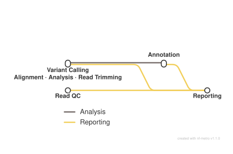

<div class="ox-crumb"><a href="/pipelines/">Pipelines</a> / <span>oxo-flow-sarek</span></div>
<div class="ox-detail-cols">
<div>
<h1>WGS/WES germline and somatic variant calling</h1>
<div class="ox-page-badges"><span class="ox-badge ox-badge--live">✔ Live-tested · default-path</span> <span class="ox-badge ox-badge--origin">⇄ Official port</span> <span class="ox-badge ox-badge--nf"><span class="dot"></span>nf-core port</span></div>
<p>GATK best-practice variant calling for whole-genome and whole-exome sequencing (WGS/WES), germline by default: FastQC quality control, fastp trimming and splitting, BWA-MEM (or BWA-MEM2) alignment, MarkDuplicates with CRAM or BAM output, base quality score recalibration (BQSR), single-sample HaplotypeCaller variant calling with CNN 1D scoring and tranche filtering, VEP annotation, per-sample VCF QC and a final MultiQC report. Optional ported branches (all gated off by default): reference preparation (BWA/BWAmem2 index, .dict, .fai), UMI-aware consensus calling (fgbio chain + fastp), fastp split-parts fan-out (split_parts=true: runtime-discovered per-part BWA-MEM/BWA-MEM2 alignment + BAM merge + index, no input cap), FreeBayes, Strelka2 germline, Manta germline, bcftools mpileup, TIDDIT SV, goleft indexcov, DeepVariant, NGSCheckMate sample-identity QC, and the joint-germline path (GVCF mode + GenomicsDBImport + GenotypeGVCFs + VQSR).</p>
</div>
<div>
<div class="ox-glance">
<div class="ox-glance-title">At a glance</div>
<div class="ox-kv"><span class="k">Rating</span><span class="v live">✔ Live-tested · default-path</span></div>
<div class="ox-kv"><span class="k">Rules</span><span class="v">117</span></div>
<div class="ox-kv"><span class="k">Compute</span><span class="v">up to 24 CPUs / 36 GB per rule (BWA-MEM)</span></div>
<div class="ox-kv"><span class="k">Engine</span><span class="v"><span class="ox-badge ox-badge--nf"><span class="dot"></span>nf-core port</span></span></div>
<div class="ox-kv"><span class="k">Origin</span><span class="v">⇄ Official port</span></div>
<div class="ox-kv"><span class="k">Domain</span><span class="v">genomics</span></div>
<div class="ox-kv"><span class="k">Source</span><span class="v"><a href="https://github.com/nf-core/sarek">nf-core/sarek</a></span></div>
<div class="ox-kv"><span class="k">Pinned version</span><span class="v"><code>3.10.0</code></span></div>
<div class="ox-kv"><span class="k">Ported</span><span class="v">2026-08-15</span></div>
<div class="ox-kv"><span class="k">License</span><span class="v">Apache-2.0</span></div>
<p class="cmd">$ oxo-flow run main.oxoflow</p>
</div>
</div>
</div>

## Run it

```bash
oxo-flow run main.oxoflow
```

Point the `[config]` fasta / bwa_index / dbsnp / known_indels paths at your GRCh38 bundle and place reads as `raw/<sample>_R1.fastq.gz` / `_R2.fastq.gz`; `oxo-flow dry-run main.oxoflow` previews the plan.

## Installation

**Engine.** oxo-flow >= 0.12.0

**Toolchain.** containers (Docker) — pinned images

**Requirements.**

- paired-end FASTQ reads at raw/{sample}_R1.fastq.gz / raw/{sample}_R2.fastq.gz
- GRCh38 genome FASTA plus .fai and .dict
- GRCh38 BWA index directory (bwa_index_dir); bwa_mem2_index_dir when aligner = "bwa-mem2"
- GATK bundle known-sites VCFs with .tbi: dbsnp_146.hg38.vcf.gz, Mills_and_1000G_gold_standard.indels.hg38.vcf.gz, Homo_sapiens_assembly38.known_indels.vcf.gz; known_snps + known_snps_tbi for joint VQSR
- VEP cache (GRCh38, homo_sapiens, cache version 112) mounted at /.vep in the container
- NGSCheckMate SNP bed (ngscheckmate_bed) when tools_ngscheckmate = true
- compute: up to 24 CPUs / 36 GB per rule (BWA-MEM 24 threads/30G; VEP 6 threads/36G)
- input cap: ~50M read pairs per sample when split_parts = false (fastp single-part mode); no cap with split_parts = true (runtime-discovered fan-out, requires mapped_bam = "sorted")
- disk: results/ for per-sample CRAMs/VCFs/reports, plus the reference bundle and VEP cache

```bash
# 1. install oxo-flow (release binary, recommended)
curl -fL -o oxo-flow.tar.gz https://github.com/Traitome/oxo-flow/releases/latest/download/oxo-flow-latest-x86_64-unknown-linux-gnu.tar.gz
tar xzf oxo-flow.tar.gz && sudo mv oxo-flow /usr/local/bin/
#    or, via conda (may lag behind releases):
#    conda install -c bioconda oxo-flow-cli
#    NOTE: bioconda currently ships 0.10.2, older than the >= 0.12.0
#    minimum of every catalog entry — prefer the release binary.

# 2. get this workflow (clones the repo, auto-discovers the workflow,
#    sanity-parses it with the engine)
oxo-flow pull gh:oxo-flow-community/oxo-flow-sarek
#    (alternative: plain git clone)
#    git clone https://github.com/oxo-flow-community/oxo-flow-sarek
```

## Parameters

<div class="ox-params">
<div class="ox-param">
<div class="ox-param-head"><code>aligner</code><span class="ox-param-default">bwa-mem</span></div>
<p class="ox-param-desc">—</p>
<details class="ox-param-usedby"><summary>used by 4 rules</summary>
<div class="ox-param-rules"><code>bwa_mem</code> <code>bwa_mem2</code> <code>bwa_mem2_split</code> <code>bwa_mem_split</code></div>
</details>
</div>
<div class="ox-param">
<div class="ox-param-head"><code>alignment_ext</code><span class="ox-param-default">cram</span></div>
<p class="ox-param-desc">Alignment-file mode: &#x27;cram&#x27; (default) or &#x27;bam&#x27; (when save_output_as_bam=true). recal_index_ext must match the mode (&#x27;cram.crai&#x27; vs &#x27;bam.bai&#x27;).</p>
<details class="ox-param-usedby"><summary>used by 22 rules</summary>
<div class="ox-param-rules"><code>bcftools_mpileup_call</code> <code>bcftools_mpileup_ngscheckmate</code> <code>deepvariant</code> <code>freebayes</code> <code>gatk_applybqsr</code> <code>gatk_applybqsr_scatter</code> <code>gatk_baserecalibrator</code> <code>gatk_baserecalibrator_scatter</code> <code>gatk_haplotypecaller</code> <code>gatk_haplotypecaller_gvcf</code> <code>gatk_haplotypecaller_gvcf_scatter</code> <code>gatk_haplotypecaller_scatter</code> <code>manta_germline</code> <code>merge_index_samtools</code> <code>mosdepth_md</code> <code>mosdepth_recal</code> <code>samtools_index_recal</code> <code>samtools_reindex_bam</code> <code>samtools_stats_md</code> <code>samtools_stats_recal</code> <code>strelka_germline</code> <code>tiddit_sv</code></div>
</details>
</div>
<div class="ox-param">
<div class="ox-param-head"><code>annotate_vep</code><span class="ox-param-default">true</span></div>
<p class="ox-param-desc">—</p>
<details class="ox-param-usedby"><summary>used by 8 rules</summary>
<div class="ox-param-rules"><code>ensemblvep_vep</code> <code>ensemblvep_vep_deepvariant</code> <code>ensemblvep_vep_freebayes</code> <code>ensemblvep_vep_joint</code> <code>ensemblvep_vep_manta</code> <code>ensemblvep_vep_mpileup</code> <code>ensemblvep_vep_strelka</code> <code>ensemblvep_vep_tiddit</code></div>
</details>
</div>
<div class="ox-param">
<div class="ox-param-head"><code>bwa_index_dir</code><span class="ox-param-default">/data/references/GRCh38/Sequence/BWAIndex/</span></div>
<p class="ox-param-desc">—</p>
<details class="ox-param-usedby"><summary>used by 3 rules</summary>
<div class="ox-param-rules"><code>bwa_mem</code> <code>bwa_mem_split</code> <code>bwa_mem_umi</code></div>
</details>
</div>
<div class="ox-param">
<div class="ox-param-head"><code>bwa_mem2_index_dir</code><span class="ox-param-default">/data/references/GRCh38/Sequence/BWAmem2Index/</span></div>
<p class="ox-param-desc">—</p>
<details class="ox-param-usedby"><summary>used by 2 rules</summary>
<div class="ox-param-rules"><code>bwa_mem2</code> <code>bwa_mem2_split</code></div>
</details>
</div>
<div class="ox-param">
<div class="ox-param-head"><code>call_deepvariant</code><span class="ox-param-default">false</span></div>
<p class="ox-param-desc">—</p>
<details class="ox-param-usedby"><summary>used by 6 rules</summary>
<div class="ox-param-rules"><code>bcftools_stats_deepvariant</code> <code>deepvariant</code> <code>ensemblvep_vep_deepvariant</code> <code>vcftools_filter_summary_deepvariant</code> <code>vcftools_tstv_count_deepvariant</code> <code>vcftools_tstv_qual_deepvariant</code></div>
</details>
</div>
<div class="ox-param">
<div class="ox-param-head"><code>call_freebayes</code><span class="ox-param-default">false</span></div>
<p class="ox-param-desc">Optional callers (upstream --tools list, one boolean per tool)</p>
<details class="ox-param-usedby"><summary>used by 10 rules</summary>
<div class="ox-param-rules"><code>bcftools_sort_freebayes</code> <code>bcftools_stats_freebayes</code> <code>ensemblvep_vep_freebayes</code> <code>freebayes</code> <code>tabix_freebayes</code> <code>tabix_freebayes_filt</code> <code>vcffilter_freebayes</code> <code>vcftools_filter_summary_freebayes</code> <code>vcftools_tstv_count_freebayes</code> <code>vcftools_tstv_qual_freebayes</code></div>
</details>
</div>
<div class="ox-param">
<div class="ox-param-head"><code>call_haplotypecaller</code><span class="ox-param-default">true</span></div>
<p class="ox-param-desc">tools / skip_tools equivalents (upstream comma-list params expressed as booleans)</p>
<details class="ox-param-usedby"><summary>used by 22 rules</summary>
<div class="ox-param-rules"><code>bcftools_sort_joint</code> <code>bcftools_stats</code> <code>bcftools_stats_joint</code> <code>ensemblvep_vep</code> <code>ensemblvep_vep_joint</code> <code>gatk_applyvqsr_indel</code> <code>gatk_applyvqsr_snp</code> <code>gatk_cnnscorevariants</code> <code>gatk_filtervarianttranches</code> <code>gatk_genomicsdbimport</code> <code>gatk_genotypegvcfs</code> <code>gatk_haplotypecaller</code> <code>gatk_haplotypecaller_gvcf</code> <code>gatk_mergevcfs_joint</code> <code>gatk_variantrecalibrator_indel</code> <code>gatk_variantrecalibrator_snp</code> <code>vcftools_filter_summary</code> <code>vcftools_filter_summary_joint</code> <code>vcftools_tstv_count</code> <code>vcftools_tstv_count_joint</code> <code>vcftools_tstv_qual</code> <code>vcftools_tstv_qual_joint</code></div>
</details>
</div>
<div class="ox-param">
<div class="ox-param-head"><code>call_indexcov</code><span class="ox-param-default">false</span></div>
<p class="ox-param-desc">upstream runs indexcov on WGS only (germline)</p>
<details class="ox-param-usedby"><summary>used by 2 rules</summary>
<div class="ox-param-rules"><code>goleft_indexcov</code> <code>samtools_reindex_bam</code></div>
</details>
</div>
<div class="ox-param">
<div class="ox-param-head"><code>call_manta</code><span class="ox-param-default">false</span></div>
<p class="ox-param-desc">—</p>
<details class="ox-param-usedby"><summary>used by 6 rules</summary>
<div class="ox-param-rules"><code>bcftools_stats_manta</code> <code>ensemblvep_vep_manta</code> <code>manta_germline</code> <code>vcftools_filter_summary_manta</code> <code>vcftools_tstv_count_manta</code> <code>vcftools_tstv_qual_manta</code></div>
</details>
</div>
<div class="ox-param">
<div class="ox-param-head"><code>call_mpileup</code><span class="ox-param-default">false</span></div>
<p class="ox-param-desc">—</p>
<details class="ox-param-usedby"><summary>used by 6 rules</summary>
<div class="ox-param-rules"><code>bcftools_mpileup_call</code> <code>bcftools_stats_mpileup</code> <code>ensemblvep_vep_mpileup</code> <code>vcftools_filter_summary_mpileup</code> <code>vcftools_tstv_count_mpileup</code> <code>vcftools_tstv_qual_mpileup</code></div>
</details>
</div>
<div class="ox-param">
<div class="ox-param-head"><code>call_strelka</code><span class="ox-param-default">false</span></div>
<p class="ox-param-desc">—</p>
<details class="ox-param-usedby"><summary>used by 6 rules</summary>
<div class="ox-param-rules"><code>bcftools_stats_strelka</code> <code>ensemblvep_vep_strelka</code> <code>strelka_germline</code> <code>vcftools_filter_summary_strelka</code> <code>vcftools_tstv_count_strelka</code> <code>vcftools_tstv_qual_strelka</code></div>
</details>
</div>
<div class="ox-param">
<div class="ox-param-head"><code>call_tiddit</code><span class="ox-param-default">false</span></div>
<p class="ox-param-desc">—</p>
<details class="ox-param-usedby"><summary>used by 7 rules</summary>
<div class="ox-param-rules"><code>bcftools_stats_tiddit</code> <code>ensemblvep_vep_tiddit</code> <code>tabix_tiddit</code> <code>tiddit_sv</code> <code>vcftools_filter_summary_tiddit</code> <code>vcftools_tstv_count_tiddit</code> <code>vcftools_tstv_qual_tiddit</code></div>
</details>
</div>
<div class="ox-param">
<div class="ox-param-head"><code>chromosomes</code><span class="ox-param-default">chr1, chr2, chr3, chr4, chr5, chr6, chr7, chr8, chr9, chr10, chr11, chr12, chr13, chr14, chr15, chr16, chr17, chr18, chr19, chr20, chr21, chr22, chrX, chrY, chrM</span></div>
<p class="ox-param-desc">—</p>
<details class="ox-param-usedby"><summary>not referenced by any rule</summary>
<div class="ox-param-rules">—</div>
</details>
</div>
<div class="ox-param">
<div class="ox-param-head"><code>dbsnp</code><span class="ox-param-default">/data/references/GRCh38/Annotation/GATKBundle/dbsnp_146.hg38.vcf.gz</span></div>
<p class="ox-param-desc">—</p>
<details class="ox-param-usedby"><summary>used by 11 rules</summary>
<div class="ox-param-rules"><code>gatk_baserecalibrator</code> <code>gatk_baserecalibrator_scatter</code> <code>gatk_filtervarianttranches</code> <code>gatk_genotypegvcfs</code> <code>gatk_genotypegvcfs_scatter</code> <code>gatk_haplotypecaller</code> <code>gatk_haplotypecaller_gvcf</code> <code>gatk_haplotypecaller_gvcf_scatter</code> <code>gatk_haplotypecaller_scatter</code> <code>gatk_variantrecalibrator_indel</code> <code>gatk_variantrecalibrator_snp</code></div>
</details>
</div>
<div class="ox-param">
<div class="ox-param-head"><code>dbsnp_tbi</code><span class="ox-param-default">/data/references/GRCh38/Annotation/GATKBundle/dbsnp_146.hg38.vcf.gz.tbi</span></div>
<p class="ox-param-desc">—</p>
<details class="ox-param-usedby"><summary>used by 11 rules</summary>
<div class="ox-param-rules"><code>gatk_baserecalibrator</code> <code>gatk_baserecalibrator_scatter</code> <code>gatk_filtervarianttranches</code> <code>gatk_genotypegvcfs</code> <code>gatk_genotypegvcfs_scatter</code> <code>gatk_haplotypecaller</code> <code>gatk_haplotypecaller_gvcf</code> <code>gatk_haplotypecaller_gvcf_scatter</code> <code>gatk_haplotypecaller_scatter</code> <code>gatk_variantrecalibrator_indel</code> <code>gatk_variantrecalibrator_snp</code></div>
</details>
</div>
<div class="ox-param">
<div class="ox-param-head"><code>dict</code><span class="ox-param-default">/data/references/GRCh38/Sequence/WholeGenomeFasta/Homo_sapiens_assembly38.dict</span></div>
<p class="ox-param-desc">—</p>
<details class="ox-param-usedby"><summary>used by 19 rules</summary>
<div class="ox-param-rules"><code>gatk_applybqsr</code> <code>gatk_applybqsr_scatter</code> <code>gatk_applyvqsr_indel</code> <code>gatk_applyvqsr_snp</code> <code>gatk_baserecalibrator</code> <code>gatk_baserecalibrator_scatter</code> <code>gatk_cnnscorevariants</code> <code>gatk_filtervarianttranches</code> <code>gatk_genotypegvcfs</code> <code>gatk_genotypegvcfs_scatter</code> <code>gatk_haplotypecaller</code> <code>gatk_haplotypecaller_gvcf</code> <code>gatk_haplotypecaller_gvcf_scatter</code> <code>gatk_haplotypecaller_scatter</code> <code>gatk_markduplicates</code> <code>gatk_markduplicates_bam</code> <code>gatk_variantrecalibrator_indel</code> <code>gatk_variantrecalibrator_snp</code> <code>manta_germline</code></div>
</details>
</div>
<div class="ox-param">
<div class="ox-param-head"><code>fasta</code><span class="ox-param-default">/data/references/GRCh38/Sequence/WholeGenomeFasta/Homo_sapiens_assembly38.fasta</span></div>
<p class="ox-param-desc">Reference data (user-provided; GRCh38 GATK bundle layout from upstream conf/igenomes.config, substituted at port time)</p>
<details class="ox-param-usedby"><summary>used by 41 rules</summary>
<div class="ox-param-rules"><code>bcftools_mpileup_call</code> <code>bcftools_mpileup_ngscheckmate</code> <code>bwa_index</code> <code>bwa_mem</code> <code>bwa_mem2</code> <code>bwa_mem2_split</code> <code>bwa_mem_split</code> <code>bwa_mem_umi</code> <code>bwamem2_index</code> <code>deepvariant</code> <code>freebayes</code> <code>gatk_applybqsr</code> <code>gatk_applybqsr_scatter</code> <code>gatk_applyvqsr_indel</code> <code>gatk_applyvqsr_snp</code> <code>gatk_baserecalibrator</code> <code>gatk_baserecalibrator_scatter</code> <code>gatk_cnnscorevariants</code> <code>gatk_createsequencedictionary</code> <code>gatk_filtervarianttranches</code> <code>gatk_genotypegvcfs</code> <code>gatk_genotypegvcfs_scatter</code> <code>gatk_haplotypecaller</code> <code>gatk_haplotypecaller_gvcf</code> <code>gatk_haplotypecaller_gvcf_scatter</code> <code>gatk_haplotypecaller_scatter</code> <code>gatk_markduplicates</code> <code>gatk_markduplicates_bam</code> <code>gatk_variantrecalibrator_indel</code> <code>gatk_variantrecalibrator_snp</code> <code>manta_germline</code> <code>merge_index_samtools</code> <code>mosdepth_md</code> <code>mosdepth_recal</code> <code>ngscheckmate_ncm</code> <code>samtools_faidx</code> <code>samtools_reindex_bam</code> <code>samtools_stats_md</code> <code>samtools_stats_recal</code> <code>strelka_germline</code> <code>tiddit_sv</code></div>
</details>
</div>
<div class="ox-param">
<div class="ox-param-head"><code>fasta_fai</code><span class="ox-param-default">/data/references/GRCh38/Sequence/WholeGenomeFasta/Homo_sapiens_assembly38.fasta.fai</span></div>
<p class="ox-param-desc">—</p>
<details class="ox-param-usedby"><summary>used by 26 rules</summary>
<div class="ox-param-rules"><code>create_intervals_bed</code> <code>deepvariant</code> <code>freebayes</code> <code>gatk_applybqsr</code> <code>gatk_applybqsr_scatter</code> <code>gatk_applyvqsr_indel</code> <code>gatk_applyvqsr_snp</code> <code>gatk_baserecalibrator</code> <code>gatk_baserecalibrator_scatter</code> <code>gatk_cnnscorevariants</code> <code>gatk_filtervarianttranches</code> <code>gatk_genomicsdbimport</code> <code>gatk_genotypegvcfs</code> <code>gatk_genotypegvcfs_scatter</code> <code>gatk_haplotypecaller</code> <code>gatk_haplotypecaller_gvcf</code> <code>gatk_haplotypecaller_gvcf_scatter</code> <code>gatk_haplotypecaller_scatter</code> <code>gatk_markduplicates</code> <code>gatk_markduplicates_bam</code> <code>gatk_variantrecalibrator_indel</code> <code>gatk_variantrecalibrator_snp</code> <code>goleft_indexcov</code> <code>manta_germline</code> <code>strelka_germline</code> <code>tiddit_sv</code></div>
</details>
</div>
<div class="ox-param">
<div class="ox-param-head"><code>freebayes_filter</code><span class="ox-param-default">30</span></div>
<p class="ox-param-desc">upstream params.freebayes_filter</p>
<details class="ox-param-usedby"><summary>used by 1 rules</summary>
<div class="ox-param-rules"><code>vcffilter_freebayes</code></div>
</details>
</div>
<div class="ox-param">
<div class="ox-param-head"><code>gatk_pcr_indel_model</code><span class="ox-param-default">CONSERVATIVE</span></div>
<p class="ox-param-desc">—</p>
<details class="ox-param-usedby"><summary>used by 4 rules</summary>
<div class="ox-param-rules"><code>gatk_haplotypecaller</code> <code>gatk_haplotypecaller_gvcf</code> <code>gatk_haplotypecaller_gvcf_scatter</code> <code>gatk_haplotypecaller_scatter</code></div>
</details>
</div>
<div class="ox-param">
<div class="ox-param-head"><code>genome</code><span class="ox-param-default">GRCh38</span></div>
<p class="ox-param-desc">—</p>
<details class="ox-param-usedby"><summary>not referenced by any rule</summary>
<div class="ox-param-rules">—</div>
</details>
</div>
<div class="ox-param">
<div class="ox-param-head"><code>group_by_umi_strategy</code><span class="ox-param-default">Adjacency</span></div>
<p class="ox-param-desc">upstream params.group_by_umi_strategy</p>
<details class="ox-param-usedby"><summary>used by 1 rules</summary>
<div class="ox-param-rules"><code>fgbio_groupreadsbyumi</code></div>
</details>
</div>
<div class="ox-param">
<div class="ox-param-head"><code>joint_germline</code><span class="ox-param-default">false</span></div>
<p class="ox-param-desc">—</p>
<details class="ox-param-usedby"><summary>used by 29 rules</summary>
<div class="ox-param-rules"><code>bcftools_sort_joint</code> <code>bcftools_sort_joint_scatter</code> <code>bcftools_stats</code> <code>bcftools_stats_joint</code> <code>ensemblvep_vep</code> <code>ensemblvep_vep_joint</code> <code>gatk_applyvqsr_indel</code> <code>gatk_applyvqsr_snp</code> <code>gatk_cnnscorevariants</code> <code>gatk_filtervarianttranches</code> <code>gatk_genomicsdbimport</code> <code>gatk_genomicsdbimport_scatter</code> <code>gatk_genotypegvcfs</code> <code>gatk_genotypegvcfs_scatter</code> <code>gatk_haplotypecaller</code> <code>gatk_haplotypecaller_gvcf</code> <code>gatk_haplotypecaller_gvcf_scatter</code> <code>gatk_haplotypecaller_scatter</code> <code>gatk_mergevcfs_joint</code> <code>gatk_mergevcfs_joint_scatter</code> <code>gatk_mergevcfs_scatter</code> <code>gatk_variantrecalibrator_indel</code> <code>gatk_variantrecalibrator_snp</code> <code>vcftools_filter_summary</code> <code>vcftools_filter_summary_joint</code> <code>vcftools_tstv_count</code> <code>vcftools_tstv_count_joint</code> <code>vcftools_tstv_qual</code> <code>vcftools_tstv_qual_joint</code></div>
</details>
</div>
<div class="ox-param">
<div class="ox-param-head"><code>joint_interval_name</code><span class="ox-param-default">whole_genome</span></div>
<p class="ox-param-desc">Joint germline: the port runs without interval scatter; a single whole-genome interval is built from the fasta .fai (upstream: per-contig BED_PREPARE_INTERVALS)</p>
<details class="ox-param-usedby"><summary>used by 4 rules</summary>
<div class="ox-param-rules"><code>bcftools_sort_joint</code> <code>gatk_genomicsdbimport</code> <code>gatk_genotypegvcfs</code> <code>gatk_mergevcfs_joint</code></div>
</details>
</div>
<div class="ox-param">
<div class="ox-param-head"><code>known_indels</code><span class="ox-param-default">/data/references/GRCh38/Annotation/GATKBundle/Mills_and_1000G_gold_standard.indels.hg38.vcf.gz, /data/references/GRCh38/Annotation/GATKBundle/Homo_sapiens_assembly38.known_indels.vcf.gz</span></div>
<p class="ox-param-desc">—</p>
<details class="ox-param-usedby"><summary>used by 4 rules</summary>
<div class="ox-param-rules"><code>gatk_baserecalibrator</code> <code>gatk_baserecalibrator_scatter</code> <code>gatk_filtervarianttranches</code> <code>gatk_variantrecalibrator_indel</code></div>
</details>
</div>
<div class="ox-param">
<div class="ox-param-head"><code>known_indels_tbi</code><span class="ox-param-default">/data/references/GRCh38/Annotation/GATKBundle/Mills_and_1000G_gold_standard.indels.hg38.vcf.gz.tbi, /data/references/GRCh38/Annotation/GATKBundle/Homo_sapiens_assembly38.known_indels.vcf.gz.tbi</span></div>
<p class="ox-param-desc">—</p>
<details class="ox-param-usedby"><summary>used by 4 rules</summary>
<div class="ox-param-rules"><code>gatk_baserecalibrator</code> <code>gatk_baserecalibrator_scatter</code> <code>gatk_filtervarianttranches</code> <code>gatk_variantrecalibrator_indel</code></div>
</details>
</div>
<div class="ox-param">
<div class="ox-param-head"><code>known_snps</code><span class="ox-param-default">/data/references/GRCh38/Annotation/GATKBundle/1000G_omni2.5.hg38.vcf.gz</span></div>
<p class="ox-param-desc">VQSR resources for joint germline (upstream conf/igenomes.config known_snps)</p>
<details class="ox-param-usedby"><summary>used by 1 rules</summary>
<div class="ox-param-rules"><code>gatk_variantrecalibrator_snp</code></div>
</details>
</div>
<div class="ox-param">
<div class="ox-param-head"><code>known_snps_tbi</code><span class="ox-param-default">/data/references/GRCh38/Annotation/GATKBundle/1000G_omni2.5.hg38.vcf.gz.tbi</span></div>
<p class="ox-param-desc">—</p>
<details class="ox-param-usedby"><summary>used by 1 rules</summary>
<div class="ox-param-rules"><code>gatk_variantrecalibrator_snp</code></div>
</details>
</div>
<div class="ox-param">
<div class="ox-param-head"><code>lane</code><span class="ox-param-default">L1</span></div>
<p class="ox-param-desc">—</p>
<details class="ox-param-usedby"><summary>used by 15 rules</summary>
<div class="ox-param-rules"><code>bcftools_mpileup_ngscheckmate</code> <code>bwa_mem</code> <code>bwa_mem2</code> <code>bwa_mem2_split</code> <code>bwa_mem_split</code> <code>bwa_mem_umi</code> <code>fastp</code> <code>fastp_split</code> <code>fastp_umi</code> <code>fastqc</code> <code>fgbio_callmolecularconsensusreads</code> <code>fgbio_fastqtobam</code> <code>fgbio_groupreadsbyumi</code> <code>samtools_bam2fq_consensus</code> <code>samtools_bam2fq_umi</code></div>
</details>
</div>
<div class="ox-param">
<div class="ox-param-head"><code>length_required</code><span class="ox-param-default">15</span></div>
<p class="ox-param-desc">—</p>
<details class="ox-param-usedby"><summary>used by 3 rules</summary>
<div class="ox-param-rules"><code>fastp</code> <code>fastp_split</code> <code>fastp_umi</code></div>
</details>
</div>
<div class="ox-param">
<div class="ox-param-head"><code>mapped_bam</code><span class="ox-param-default">0001</span></div>
<p class="ox-param-desc">mapped bam stem fed to markduplicates: {sample}.{mapped_bam}.bam (&quot;sorted&quot; with split_parts = true)</p>
<details class="ox-param-usedby"><summary>used by 2 rules</summary>
<div class="ox-param-rules"><code>gatk_markduplicates</code> <code>gatk_markduplicates_bam</code></div>
</details>
</div>
<div class="ox-param">
<div class="ox-param-head"><code>ngscheckmate_bed</code><span class="ox-param-default">/data/references/GRCh38/Annotation/NGSCheckMate/SNP_GRCh38_hg38_wChr.bed</span></div>
<p class="ox-param-desc">—</p>
<details class="ox-param-usedby"><summary>used by 2 rules</summary>
<div class="ox-param-rules"><code>bcftools_mpileup_ngscheckmate</code> <code>ngscheckmate_ncm</code></div>
</details>
</div>
<div class="ox-param">
<div class="ox-param-head"><code>out_dir</code><span class="ox-param-default">results</span></div>
<p class="ox-param-desc">—</p>
<details class="ox-param-usedby"><summary>used by 109 rules</summary>
<div class="ox-param-rules"><code>bam_merge_index_samtools</code> <code>bcftools_mpileup_call</code> <code>bcftools_mpileup_ngscheckmate</code> <code>bcftools_sort_freebayes</code> <code>bcftools_sort_joint</code> <code>bcftools_sort_joint_scatter</code> <code>bcftools_stats</code> <code>bcftools_stats_deepvariant</code> <code>bcftools_stats_freebayes</code> <code>bcftools_stats_joint</code> <code>bcftools_stats_manta</code> <code>bcftools_stats_mpileup</code> <code>bcftools_stats_strelka</code> <code>bcftools_stats_tiddit</code> <code>bwa_index</code> <code>bwa_mem</code> <code>bwa_mem2</code> <code>bwa_mem2_split</code> <code>bwa_mem_split</code> <code>bwa_mem_umi</code> <code>bwamem2_index</code> <code>create_intervals_bed</code> <code>deepvariant</code> <code>ensemblvep_vep</code> <code>ensemblvep_vep_deepvariant</code> <code>ensemblvep_vep_freebayes</code> <code>ensemblvep_vep_joint</code> <code>ensemblvep_vep_manta</code> <code>ensemblvep_vep_mpileup</code> <code>ensemblvep_vep_strelka</code> <code>ensemblvep_vep_tiddit</code> <code>fastp</code> <code>fastp_split</code> <code>fastp_umi</code> <code>fastqc</code> <code>fgbio_callmolecularconsensusreads</code> <code>fgbio_fastqtobam</code> <code>fgbio_groupreadsbyumi</code> <code>freebayes</code> <code>gatk_applybqsr</code> <code>gatk_applybqsr_scatter</code> <code>gatk_applyvqsr_indel</code> <code>gatk_applyvqsr_snp</code> <code>gatk_baserecalibrator</code> <code>gatk_baserecalibrator_scatter</code> <code>gatk_cnnscorevariants</code> <code>gatk_createsequencedictionary</code> <code>gatk_filtervarianttranches</code> <code>gatk_gatherbqsrreports</code> <code>gatk_genomicsdbimport</code> <code>gatk_genomicsdbimport_scatter</code> <code>gatk_genotypegvcfs</code> <code>gatk_genotypegvcfs_scatter</code> <code>gatk_haplotypecaller</code> <code>gatk_haplotypecaller_gvcf</code> <code>gatk_haplotypecaller_gvcf_scatter</code> <code>gatk_haplotypecaller_scatter</code> <code>gatk_markduplicates</code> <code>gatk_markduplicates_bam</code> <code>gatk_mergevcfs_joint</code> <code>gatk_mergevcfs_joint_scatter</code> <code>gatk_mergevcfs_scatter</code> <code>gatk_variantrecalibrator_indel</code> <code>gatk_variantrecalibrator_snp</code> <code>goleft_indexcov</code> <code>manta_germline</code> <code>merge_index_samtools</code> <code>mosdepth_md</code> <code>mosdepth_recal</code> <code>multiqc</code> <code>ngscheckmate_ncm</code> <code>samtools_bam2fq_consensus</code> <code>samtools_bam2fq_umi</code> <code>samtools_faidx</code> <code>samtools_index_recal</code> <code>samtools_reindex_bam</code> <code>samtools_stats_md</code> <code>samtools_stats_recal</code> <code>strelka_germline</code> <code>tabix_freebayes</code> <code>tabix_freebayes_filt</code> <code>tabix_interval</code> <code>tabix_tiddit</code> <code>tiddit_sv</code> <code>vcffilter_freebayes</code> <code>vcftools_filter_summary</code> <code>vcftools_filter_summary_deepvariant</code> <code>vcftools_filter_summary_freebayes</code> <code>vcftools_filter_summary_joint</code> <code>vcftools_filter_summary_manta</code> <code>vcftools_filter_summary_mpileup</code> <code>vcftools_filter_summary_strelka</code> <code>vcftools_filter_summary_tiddit</code> <code>vcftools_tstv_count</code> <code>vcftools_tstv_count_deepvariant</code> <code>vcftools_tstv_count_freebayes</code> <code>vcftools_tstv_count_joint</code> <code>vcftools_tstv_count_manta</code> <code>vcftools_tstv_count_mpileup</code> <code>vcftools_tstv_count_strelka</code> <code>vcftools_tstv_count_tiddit</code> <code>vcftools_tstv_qual</code> <code>vcftools_tstv_qual_deepvariant</code> <code>vcftools_tstv_qual_freebayes</code> <code>vcftools_tstv_qual_joint</code> <code>vcftools_tstv_qual_manta</code> <code>vcftools_tstv_qual_mpileup</code> <code>vcftools_tstv_qual_strelka</code> <code>vcftools_tstv_qual_tiddit</code></div>
</details>
</div>
<div class="ox-param">
<div class="ox-param-head"><code>patient</code><span class="ox-param-default">test</span></div>
<p class="ox-param-desc">Sample metadata — mirrors tests/csv/3.0/fastq_single.csv (single-lane model: nf-core/sarek meta.id = &quot;{sample}-{lane}&quot;, read-group ID = &quot;{sample}.{lane}&quot;)</p>
<details class="ox-param-usedby"><summary>used by 5 rules</summary>
<div class="ox-param-rules"><code>bwa_mem</code> <code>bwa_mem2</code> <code>bwa_mem2_split</code> <code>bwa_mem_split</code> <code>bwa_mem_umi</code></div>
</details>
</div>
<div class="ox-param">
<div class="ox-param-head"><code>prepare_reference</code><span class="ox-param-default">false</span></div>
<p class="ox-param-desc">Optional branches (all default-off; upstream equivalents in parentheses) Reference preparation — upstream PREPARE_GENOME builds the BWA/BWAmem2 indexes + .dict + .fai when the reference lacks them; the port gates this on prepare_reference and writes into results/reference/. Point bwa_index_dir / bwa_mem2_index_dir / fasta_fai / dict at the built files to use them.</p>
<details class="ox-param-usedby"><summary>used by 4 rules</summary>
<div class="ox-param-rules"><code>bwa_index</code> <code>bwamem2_index</code> <code>gatk_createsequencedictionary</code> <code>samtools_faidx</code></div>
</details>
</div>
<div class="ox-param">
<div class="ox-param-head"><code>recal_index_ext</code><span class="ox-param-default">cram.crai</span></div>
<p class="ox-param-desc">—</p>
<details class="ox-param-usedby"><summary>used by 3 rules</summary>
<div class="ox-param-rules"><code>merge_index_samtools</code> <code>mosdepth_recal</code> <code>samtools_index_recal</code></div>
</details>
</div>
<div class="ox-param">
<div class="ox-param-head"><code>save_output_as_bam</code><span class="ox-param-default">false</span></div>
<p class="ox-param-desc">CRAM output mode (upstream default)</p>
<details class="ox-param-usedby"><summary>used by 2 rules</summary>
<div class="ox-param-rules"><code>gatk_markduplicates</code> <code>gatk_markduplicates_bam</code></div>
</details>
</div>
<div class="ox-param">
<div class="ox-param-head"><code>scatter_gatk</code><span class="ox-param-default">false</span></div>
<p class="ox-param-desc">Optional per-chromosome scatter/gather branch (default off). When scatter_gatk = true, BQSR / ApplyBQSR / HaplotypeCaller (and the joint GenotypeGVCFs) run one job per chromosome and the per-chromosome outputs are gathered (GatherBQSRReports / samtools merge+index / MergeVcfs) — results identical to the single whole-genome job (gathers are exact), with per-chromosome parallelism. Upstream scatters over dynamic duration-binned interval files; the engine&#x27;s scatter takes a static value list, so the port uses one interval per chromosome. Keep <code>chromosomes</code> in sync with the contigs of your fasta .fai (each entry must exist in the .fai).</p>
<details class="ox-param-usedby"><summary>used by 22 rules</summary>
<div class="ox-param-rules"><code>bcftools_sort_joint</code> <code>bcftools_sort_joint_scatter</code> <code>create_intervals_bed</code> <code>gatk_applybqsr</code> <code>gatk_applybqsr_scatter</code> <code>gatk_baserecalibrator</code> <code>gatk_baserecalibrator_scatter</code> <code>gatk_gatherbqsrreports</code> <code>gatk_genomicsdbimport</code> <code>gatk_genomicsdbimport_scatter</code> <code>gatk_genotypegvcfs</code> <code>gatk_genotypegvcfs_scatter</code> <code>gatk_haplotypecaller</code> <code>gatk_haplotypecaller_gvcf</code> <code>gatk_haplotypecaller_gvcf_scatter</code> <code>gatk_haplotypecaller_scatter</code> <code>gatk_mergevcfs_joint</code> <code>gatk_mergevcfs_joint_scatter</code> <code>gatk_mergevcfs_scatter</code> <code>merge_index_samtools</code> <code>samtools_index_recal</code> <code>tabix_interval</code></div>
</details>
</div>
<div class="ox-param">
<div class="ox-param-head"><code>seq_platform</code><span class="ox-param-default">ILLUMINA</span></div>
<p class="ox-param-desc">—</p>
<details class="ox-param-usedby"><summary>used by 5 rules</summary>
<div class="ox-param-rules"><code>bwa_mem</code> <code>bwa_mem2</code> <code>bwa_mem2_split</code> <code>bwa_mem_split</code> <code>bwa_mem_umi</code></div>
</details>
</div>
<div class="ox-param">
<div class="ox-param-head"><code>sex</code><span class="ox-param-default">XX</span></div>
<p class="ox-param-desc">—</p>
<details class="ox-param-usedby"><summary>not referenced by any rule</summary>
<div class="ox-param-rules">—</div>
</details>
</div>
<div class="ox-param">
<div class="ox-param-head"><code>skip_bcftools</code><span class="ox-param-default">false</span></div>
<p class="ox-param-desc">—</p>
<details class="ox-param-usedby"><summary>used by 8 rules</summary>
<div class="ox-param-rules"><code>bcftools_stats</code> <code>bcftools_stats_deepvariant</code> <code>bcftools_stats_freebayes</code> <code>bcftools_stats_joint</code> <code>bcftools_stats_manta</code> <code>bcftools_stats_mpileup</code> <code>bcftools_stats_strelka</code> <code>bcftools_stats_tiddit</code></div>
</details>
</div>
<div class="ox-param">
<div class="ox-param-head"><code>skip_fastqc</code><span class="ox-param-default">false</span></div>
<p class="ox-param-desc">—</p>
<details class="ox-param-usedby"><summary>used by 1 rules</summary>
<div class="ox-param-rules"><code>fastqc</code></div>
</details>
</div>
<div class="ox-param">
<div class="ox-param-head"><code>skip_mosdepth</code><span class="ox-param-default">false</span></div>
<p class="ox-param-desc">—</p>
<details class="ox-param-usedby"><summary>used by 2 rules</summary>
<div class="ox-param-rules"><code>mosdepth_md</code> <code>mosdepth_recal</code></div>
</details>
</div>
<div class="ox-param">
<div class="ox-param-head"><code>skip_multiqc</code><span class="ox-param-default">false</span></div>
<p class="ox-param-desc">—</p>
<details class="ox-param-usedby"><summary>used by 1 rules</summary>
<div class="ox-param-rules"><code>multiqc</code></div>
</details>
</div>
<div class="ox-param">
<div class="ox-param-head"><code>skip_samtools</code><span class="ox-param-default">false</span></div>
<p class="ox-param-desc">—</p>
<details class="ox-param-usedby"><summary>used by 2 rules</summary>
<div class="ox-param-rules"><code>samtools_stats_md</code> <code>samtools_stats_recal</code></div>
</details>
</div>
<div class="ox-param">
<div class="ox-param-head"><code>skip_vcftools</code><span class="ox-param-default">false</span></div>
<p class="ox-param-desc">—</p>
<details class="ox-param-usedby"><summary>used by 24 rules</summary>
<div class="ox-param-rules"><code>vcftools_filter_summary</code> <code>vcftools_filter_summary_deepvariant</code> <code>vcftools_filter_summary_freebayes</code> <code>vcftools_filter_summary_joint</code> <code>vcftools_filter_summary_manta</code> <code>vcftools_filter_summary_mpileup</code> <code>vcftools_filter_summary_strelka</code> <code>vcftools_filter_summary_tiddit</code> <code>vcftools_tstv_count</code> <code>vcftools_tstv_count_deepvariant</code> <code>vcftools_tstv_count_freebayes</code> <code>vcftools_tstv_count_joint</code> <code>vcftools_tstv_count_manta</code> <code>vcftools_tstv_count_mpileup</code> <code>vcftools_tstv_count_strelka</code> <code>vcftools_tstv_count_tiddit</code> <code>vcftools_tstv_qual</code> <code>vcftools_tstv_qual_deepvariant</code> <code>vcftools_tstv_qual_freebayes</code> <code>vcftools_tstv_qual_joint</code> <code>vcftools_tstv_qual_manta</code> <code>vcftools_tstv_qual_mpileup</code> <code>vcftools_tstv_qual_strelka</code> <code>vcftools_tstv_qual_tiddit</code></div>
</details>
</div>
<div class="ox-param">
<div class="ox-param-head"><code>split_fastq</code><span class="ox-param-default">50000000</span></div>
<p class="ox-param-desc">fastp --split_by_lines = split_fastq * 4</p>
<details class="ox-param-usedby"><summary>used by 3 rules</summary>
<div class="ox-param-rules"><code>fastp</code> <code>fastp_split</code> <code>fastp_umi</code></div>
</details>
</div>
<div class="ox-param">
<div class="ox-param-head"><code>split_parts</code><span class="ox-param-default">false</span></div>
<p class="ox-param-desc">Runtime-discovered split parts: when true, fastp&#x27;s --split_by_lines parts are discovered by filesystem scan (engine output_pattern primitive) and the BWA_MEM + BAM_MERGE_INDEX_SAMTOOLS stages fan out per part — no 0001-only cap. Requires mapped_bam = &quot;sorted&quot; (the merge output name). Not supported with umi_read_structure. Off by default (upstream single-part behavior).</p>
<details class="ox-param-usedby"><summary>used by 8 rules</summary>
<div class="ox-param-rules"><code>bam_merge_index_samtools</code> <code>bwa_mem</code> <code>bwa_mem2</code> <code>bwa_mem2_split</code> <code>bwa_mem_split</code> <code>fastp</code> <code>fastp_split</code> <code>fastp_umi</code></div>
</details>
</div>
<div class="ox-param">
<div class="ox-param-head"><code>status</code><span class="ox-param-default">0</span></div>
<p class="ox-param-desc">—</p>
<details class="ox-param-usedby"><summary>not referenced by any rule</summary>
<div class="ox-param-rules">—</div>
</details>
</div>
<div class="ox-param">
<div class="ox-param-head"><code>tools_ngscheckmate</code><span class="ox-param-default">false</span></div>
<p class="ox-param-desc">—</p>
<details class="ox-param-usedby"><summary>used by 2 rules</summary>
<div class="ox-param-rules"><code>bcftools_mpileup_ngscheckmate</code> <code>ngscheckmate_ncm</code></div>
</details>
</div>
<div class="ox-param">
<div class="ox-param-head"><code>trim_fastq</code><span class="ox-param-default">false</span></div>
<p class="ox-param-desc">—</p>
<details class="ox-param-usedby"><summary>used by 3 rules</summary>
<div class="ox-param-rules"><code>fastp</code> <code>fastp_split</code> <code>fastp_umi</code></div>
</details>
</div>
<div class="ox-param">
<div class="ox-param-head"><code>umi_read_structure</code><span class="ox-param-default"></span></div>
<p class="ox-param-desc">UMI consensus preprocessing (upstream params.umi_read_structure, e.g. &#x27;3M2S+T&#x27; or &#x27;5M2S+T&#x27;; empty string disables the whole UMI chain)</p>
<details class="ox-param-usedby"><summary>used by 9 rules</summary>
<div class="ox-param-rules"><code>bwa_mem_umi</code> <code>fastp</code> <code>fastp_split</code> <code>fastp_umi</code> <code>fgbio_callmolecularconsensusreads</code> <code>fgbio_fastqtobam</code> <code>fgbio_groupreadsbyumi</code> <code>samtools_bam2fq_consensus</code> <code>samtools_bam2fq_umi</code></div>
</details>
</div>
<div class="ox-param">
<div class="ox-param-head"><code>vep_cache_ready</code><span class="ox-param-default">false</span></div>
<p class="ox-param-desc">—</p>
<details class="ox-param-usedby"><summary>used by 8 rules</summary>
<div class="ox-param-rules"><code>ensemblvep_vep</code> <code>ensemblvep_vep_deepvariant</code> <code>ensemblvep_vep_freebayes</code> <code>ensemblvep_vep_joint</code> <code>ensemblvep_vep_manta</code> <code>ensemblvep_vep_mpileup</code> <code>ensemblvep_vep_strelka</code> <code>ensemblvep_vep_tiddit</code></div>
</details>
</div>
<div class="ox-param">
<div class="ox-param-head"><code>vep_cache_version</code><span class="ox-param-default">112</span></div>
<p class="ox-param-desc">The VEP cache version must match the VEP binary in envs/vep.yaml (upstream&#x27;s image pins 116; this env ships ensembl-vep 112, whose cache format is version-locked — a 116 cache is unreadable). The cache itself is user data (upstream bundles it in the container at /.vep; ~30GB for whole-genome GRCh38, or a gtf2vep subset) — the VEP rule gates on vep_cache_ready. Upstream fails hard without the cache; set the flag after placing it at vep_dir_cache (see README fidelity table).</p>
<details class="ox-param-usedby"><summary>used by 8 rules</summary>
<div class="ox-param-rules"><code>ensemblvep_vep</code> <code>ensemblvep_vep_deepvariant</code> <code>ensemblvep_vep_freebayes</code> <code>ensemblvep_vep_joint</code> <code>ensemblvep_vep_manta</code> <code>ensemblvep_vep_mpileup</code> <code>ensemblvep_vep_strelka</code> <code>ensemblvep_vep_tiddit</code></div>
</details>
</div>
<div class="ox-param">
<div class="ox-param-head"><code>vep_dir_cache</code><span class="ox-param-default">/.vep</span></div>
<p class="ox-param-desc">—</p>
<details class="ox-param-usedby"><summary>used by 8 rules</summary>
<div class="ox-param-rules"><code>ensemblvep_vep</code> <code>ensemblvep_vep_deepvariant</code> <code>ensemblvep_vep_freebayes</code> <code>ensemblvep_vep_joint</code> <code>ensemblvep_vep_manta</code> <code>ensemblvep_vep_mpileup</code> <code>ensemblvep_vep_strelka</code> <code>ensemblvep_vep_tiddit</code></div>
</details>
</div>
<div class="ox-param">
<div class="ox-param-head"><code>vep_genome</code><span class="ox-param-default">GRCh38</span></div>
<p class="ox-param-desc">—</p>
<details class="ox-param-usedby"><summary>used by 8 rules</summary>
<div class="ox-param-rules"><code>ensemblvep_vep</code> <code>ensemblvep_vep_deepvariant</code> <code>ensemblvep_vep_freebayes</code> <code>ensemblvep_vep_joint</code> <code>ensemblvep_vep_manta</code> <code>ensemblvep_vep_mpileup</code> <code>ensemblvep_vep_strelka</code> <code>ensemblvep_vep_tiddit</code></div>
</details>
</div>
<div class="ox-param">
<div class="ox-param-head"><code>vep_species</code><span class="ox-param-default">homo_sapiens</span></div>
<p class="ox-param-desc">—</p>
<details class="ox-param-usedby"><summary>used by 8 rules</summary>
<div class="ox-param-rules"><code>ensemblvep_vep</code> <code>ensemblvep_vep_deepvariant</code> <code>ensemblvep_vep_freebayes</code> <code>ensemblvep_vep_joint</code> <code>ensemblvep_vep_manta</code> <code>ensemblvep_vep_mpileup</code> <code>ensemblvep_vep_strelka</code> <code>ensemblvep_vep_tiddit</code></div>
</details>
</div>
<div class="ox-param">
<div class="ox-param-head"><code>wes</code><span class="ox-param-default">false</span></div>
<p class="ox-param-desc">—</p>
<details class="ox-param-usedby"><summary>used by 2 rules</summary>
<div class="ox-param-rules"><code>goleft_indexcov</code> <code>samtools_reindex_bam</code></div>
</details>
</div>
</div>

Descriptions are the workflow's own `#` comments from its `[config]` section, surfaced by `oxo-flow info` — no schema file to maintain.

## Workflow graph

<div class="ox-dag-card" markdown="1">



<p class="ox-dag-caption">figure · oxo-flow-sarek — rule-level transit map (nf-metro)</p>

</div>

The graph is derived at catalog-build time from `oxo-flow graph -f metro` and rendered with [nf-metro](https://github.com/seqeralabs/nf-metro) — rules are grouped into colored transit lines by analysis stage. It shows the workflow at rule level: wildcard `{sample}` instances expand at run time when sample data is discovered (the runtime view is `oxo-flow graph --expanded`).

## Scope

The default-parameters main path of the source pipeline was ported rule-for-rule; alternate paths are documented as excluded.

**In scope**

- bwa_index
- bwamem2_index
- gatk_createsequencedictionary
- samtools_faidx
- fastqc
- fastp
- fastp_split
- fgbio_fastqtobam
- samtools_bam2fq_umi
- bwa_mem_umi
- fgbio_groupreadsbyumi
- fgbio_callmolecularconsensusreads
- samtools_bam2fq_consensus
- fastp_umi
- bwa_mem
- bwa_mem2
- bwa_mem_split
- bwa_mem2_split
- bam_merge_index_samtools
- gatk_markduplicates
- gatk_markduplicates_bam
- mosdepth_md
- samtools_stats_md
- gatk_baserecalibrator
- gatk_applybqsr
- samtools_index_recal
- mosdepth_recal
- samtools_stats_recal
- gatk_haplotypecaller
- gatk_cnnscorevariants
- gatk_filtervarianttranches
- freebayes
- bcftools_sort_freebayes
- tabix_freebayes
- vcffilter_freebayes
- tabix_freebayes_filt
- strelka_germline
- manta_germline
- bcftools_mpileup_call
- tiddit_sv
- tabix_tiddit
- samtools_reindex_bam
- goleft_indexcov
- deepvariant
- bcftools_mpileup_ngscheckmate
- ngscheckmate_ncm
- bcftools_stats
- vcftools_tstv_count
- vcftools_tstv_qual
- vcftools_filter_summary
- ensemblvep_vep
- gatk_haplotypecaller_gvcf
- gatk_genomicsdbimport
- gatk_genotypegvcfs
- bcftools_sort_joint
- gatk_mergevcfs_joint
- gatk_variantrecalibrator_snp
- gatk_variantrecalibrator_indel
- gatk_applyvqsr_snp
- gatk_applyvqsr_indel
- bcftools_stats_joint
- vcftools_tstv_count_joint
- vcftools_tstv_qual_joint
- vcftools_filter_summary_joint
- ensemblvep_vep_joint
- multiqc

**Excluded**

- Sentieon / Parabricks / DRAGMAP — commercial accelerators (licensed binaries), out of scope
- CNVkit / ASCAT / MSIsensor2 / SomaticSniper / VarDict / Control-FREEC / LoFreq / Varlociraptor — remaining somatic callers; Mutect2/Strelka2-somatic/Manta-somatic are ported (call_mutect2 / call_strelka_somatic / call_manta_somatic, pair-fanned via config/somatic_pairs.tsv); the rest need their own envs/fixtures

## Fidelity


Rows cover every upstream process/rule on the default main execution path plus
every ported optional branch (gated by config flags — all default-off).
"not ported" rows carry a reason + evidence.

| Upstream process/rule | oxo-flow rule | Tool (version) | Notes |
|---|---|---|---|
| FASTQC | `fastqc` | fastqc 0.12.1 | identical command |
| FASTP | `fastp` | fastp 1.1.0 | upstream default trimming/splitting module (TrimGalore does not exist in 3.10.0 — `grep -ri trimgalore` over the upstream tree is empty; the `--trim_fastq_trimgalore` param was dropped in 3.10.0) |
| BWA_MEM | `bwa_mem` | bwa 0.7.19 | upstream default aligner is `bwa-mem`, not `bwa-mem2`; read-group flags from sarek.nf; prefix `{meta.id}.{reads[0] token}` = `test.0001` under split_fastq; the same image also carries samtools 1.22.1 (used for `samtools sort`) |
| BWA_MEM2 | `bwa_mem2` | bwa-mem2 2.2.1 | `aligner = "bwa-mem2"` (upstream `params.aligner`); same `-K 100000000 -Y -R` args as BWA_MEM; shares bwa_mem's output path — the two rules are mutually exclusive via `when`, all downstream rules are unchanged; index from `bwa_mem2_index_dir` |
| GATK4_MARKDUPLICATES | `gatk_markduplicates` | gatk4 4.5.0.0 | default CRAM branch (`save_output_as_bam=false`) |
| GATK4_MARKDUPLICATES (BAM branch) | `gatk_markduplicates_bam` | gatk4 4.5.0.0 | `save_output_as_bam = true`; `--CREATE_INDEX true`, no CRAM conversion; `.md.bai` renamed to `.md.bam.bai` (upstream BAM_MERGE_INDEX_SAMTOOLS); downstream rules read `{config.alignment_ext}` / `{config.recal_index_ext}` (set `"bam"` / `"bam.bai"` together) |
| MOSDEPTH (post-MD) | `mosdepth_md` | mosdepth 0.3.14 | ext.prefix `{meta.id}.md`; WGS `--by 500` mode |
| SAMTOOLS_STATS (post-MD) | `samtools_stats_md` | samtools 1.24 | ext.prefix `{meta.id}.md.{alignment_ext}`; 1.24 is the version in the `htslib_samtools` stats/index images (the BWA image carries 1.22.1) |
| GATK4_BASERECALIBRATOR | `gatk_baserecalibrator` | gatk4 4.5.0.0 | known-sites = dbsnp + Mills gold standard + known indels (GRCh38); single whole-genome job by default; per-chromosome jobs under `scatter_gatk = true` (see the scatter/gather row) |
| GATK4_APPLYBQSR | `gatk_applybqsr` | gatk4 4.5.0.0 | output CRAM per default (BAM in the `save_output_as_bam` branch); single whole-genome job by default; per-chromosome jobs under `scatter_gatk = true` (see the scatter/gather row) |
| SAMTOOLS_INDEX (recal) | `samtools_index_recal` | samtools 1.24 | indexes the recalibrated alignment (`.crai` or `.bam.bai`) |
| MOSDEPTH (recal) | `mosdepth_recal` | mosdepth 0.3.14 | ext.prefix `{meta.id}.recal` |
| SAMTOOLS_STATS (recal) | `samtools_stats_recal` | samtools 1.24 | ext.prefix `{meta.id}.recal.{alignment_ext}` |
| GATK4_HAPLOTYPECALLER | `gatk_haplotypecaller` | gatk4 4.5.0.0 | default `tools=haplotypecaller,vep` → `call_haplotypecaller=true`; single-sample mode (no `-ERC GVCF`), `--pcr-indel-model CONSERVATIVE`; gated off when `joint_germline = true` (upstream picks the GVCF branch); single whole-genome job by default; per-chromosome jobs under `scatter_gatk = true` (see the scatter/gather row) |
| GATK4_CNNSCOREVARIANTS | `gatk_cnnscorevariants` | gatk4 4.5.0.0 | VCF_VARIANT_FILTERING_GATK part 1; CNN 1D scoring (module default `--tensor-type 1D`); upstream keeps the `{sample}.cnn.vcf.gz` intermediate unpublished — the port stores it under `results/variant_calling/cnnscorevariants/` for DAG handoff; skipped in joint mode (upstream: no filtering of the joint VCF) |
| GATK4_FILTERVARIANTTRANCHES | `gatk_filtervarianttranches` | gatk4 4.5.0.0 | VCF_VARIANT_FILTERING_GATK part 2; ext.args `--info-key CNN_1D`, ext.prefix `{meta.id}.haplotypecaller`, known sites (dbsnp + 2 GRCh38 indel sets) passed as `--resource`; produces `{sample}.haplotypecaller.filtered.vcf.gz` |
| BCFTOOLS_STATS | `bcftools_stats` | bcftools 1.23.1 | VCF_QC_BCFTOOLS_VCFTOOLS part 1; runs on the filtered VCF (prefix `{meta.id}.haplotypecaller.filtered`) |
| VCFTOOLS_TSTV_COUNT | `vcftools_tstv_count` | vcftools 0.1.17 | VCF_QC_BCFTOOLS_VCFTOOLS part 2; runs on the filtered VCF |
| VCFTOOLS_TSTV_QUAL | `vcftools_tstv_qual` | vcftools 0.1.17 | VCF_QC_BCFTOOLS_VCFTOOLS part 3; runs on the filtered VCF |
| VCFTOOLS_SUMMARY | `vcftools_filter_summary` | vcftools 0.1.17 | VCF_QC_BCFTOOLS_VCFTOOLS part 4; runs on the filtered VCF |
| ENSEMBLVEP_VEP | `ensemblvep_vep` | ensembl-vep 112.0 | annotates the filtered VCF (`{sample}.haplotypecaller.filtered_VEP.ann.vcf.gz`); **gated on `vep_cache_ready`** — upstream fails hard without the cache (bundled at `/.vep` via `--vep_cache`); set the flag after placing a cache at `vep_dir_cache`; `--cache_version 112` (matches the env binary — VEP caches are version-locked), GRCh38 |
| PREPARE_GENOME (BWA_INDEX) | `bwa_index` | bwa 0.7.19 | `prepare_reference = true`; builds `results/reference/bwa/index.{amb,ann,bwt,pac,sa}` — fixed `index` prefix (upstream: fasta basename; irrelevant downstream, the BWA rules find the index by extension). Deviation: upstream does not publish the index unless `save_reference`; the port publishes it because oxo-flow outputs must be tracked |
| PREPARE_GENOME (BWAMEM2_INDEX) | `bwamem2_index` | bwa-mem2 2.2.1 | same gating/prefix note; `results/reference/bwamem2/index.{0123,amb,ann,bwt.2bit.64,pac}` |
| PREPARE_GENOME (GATK4_CREATESEQUENCEDICTIONARY) | `gatk_createsequencedictionary` | gatk4 4.5.0.0 | `--URI` is the fasta basename as upstream; GATK writes `<fasta-basename>.dict`, the port renames it to `reference.dict` for a fixed output path |
| PREPARE_GENOME (SAMTOOLS_FAIDX) | `samtools_faidx` | samtools 1.24 | indexes a workdir copy of the fasta (the `{config.fasta}` path is treated as read-only); output `results/reference/fai/reference.fasta.fai` |
| SAREK_UMI (FGBIO_FASTQTOBAM → SAMTOOLS_BAM2FQ → BWA_MEM → FGBIO_GROUPREADSBYUMI → FGBIO_CALLMOLECULARCONSENSUSREADS → BAM_CONVERT_SAMTOOLS → FASTP) | `fgbio_fastqtobam`, `samtools_bam2fq_umi`, `bwa_mem_umi`, `fgbio_groupreadsbyumi`, `fgbio_callmolecularconsensusreads`, `samtools_bam2fq_consensus`, `fastp_umi` | fgbio 3.1.2, bwa 0.7.19, samtools 1.24, fastp 1.1.0 | `umi_read_structure` set (e.g. `"3M2S+T"`); `fastp_umi` shares the fastp output paths so BWA-MEM downstream is untouched; GroupReadsByUmi histogram/metrics go to `reports/umi/`; see deviations for the BAM_CONVERT_SAMTOOLS collapse |
| BAM_VARIANT_CALLING_FREEBAYES (FREEBAYES_GERMLINE, BCFTOOLS_SORT, TABIX_VC, VCFLIB_VCF_FILTER, TABIX_FILT) | `freebayes`, `bcftools_sort_freebayes`, `tabix_freebayes`, `vcffilter_freebayes`, `tabix_freebayes_filt` | freebayes 1.3.10, bcftools 1.23.1, vcflib 1.0.14 | `call_freebayes = true`; `--min-alternate-fraction 0.1 --min-mapping-quality 1`; QUAL filter threshold from `freebayes_filter` (30, upstream `params.freebayes_filter`); all four VCFs/TBI published to `variant_calling/freebayes/{sample}/` as upstream |
| STRELKA_GERMLINE | `strelka_germline` | strelka 2.9.10 | `call_strelka = true`; ext.prefix `{meta.id}.strelka`; email-check disabled via the upstream `sed`; all six outputs (SNP/INDEL/variants × vcf+tbi) published as upstream |
| MANTA_GERMLINE | `manta_germline` | manta 1.6.0 | `call_manta = true`; ext.prefix `{meta.id}.manta`; only the `diploid_sv` pair is published — candidateSmallIndels/candidateSV stay in the workdir exactly as upstream |
| BCFTOOLS_MPILEUP (germline) | `bcftools_mpileup_call` | bcftools 1.23.1 | `call_mpileup = true`; args `--output-type v --multiallelic-caller`, filter `count(GT=="RR")==0`; the module's own bcftools_stats file stays unpublished (as upstream) |
| TIDDIT_SV + TABIX_BGZIP_TIDDIT_SV | `tiddit_sv`, `tabix_tiddit` | tiddit 3.9.5 | `call_tiddit = true`; `--skip_assembly` (upstream passes an empty bwa index channel for germline); `.ploidies.tab` published as upstream |
| BAM_VARIANT_CALLING_INDEXCOV (SAMTOOLS_REINDEX_BAM + GOLEFT_INDEXCOV) | `samtools_reindex_bam`, `goleft_indexcov` | samtools 1.24, goleft 0.2.4 | WGS only (`!wes && call_indexcov`); per-sample header-only reindex with `-F 3844 -q 30` + `--write-index` over `/dev/null##idx##`; cohort run `--fai --directory indexcov` (no `--extranormalize` — inputs are BAMs, matching upstream's reindex path); bed.gz+tbi published to `variant_calling/indexcov/` |
| RUNDEEPVARIANT | `deepvariant` | deepvariant 1.10.0 | `call_deepvariant = true`; `--model_type=WGS --sample_name {sample}`; vcf + g.vcf pairs published to `variant_calling/deepvariant/{sample}/` |
| BAM_NGSCHECKMATE (BCFTOOLS_MPILEUP + NGSCHECKMATE_NCM) | `bcftools_mpileup_ngscheckmate`, `ngscheckmate_ncm` | bcftools 1.23.1, ngscheckmate 1.0.1 | `tools_ngscheckmate = true`; per-sample mpileup `--no-version --ploidy 1 -c` with `-T` SNP bed, reheader to `{sample}-{lane}`; cohort `NCM_REF=./reference.fasta ncm.py -d . -bed <bed> -O . -N ngscheckmate -V`; outputs published to `reports/ngscheckmate/` (live-verify: ncm.py's exact output filenames, see Test) |
| Joint germline (GATK4_HAPLOTYPECALLER GVCF, GATK4_GENOMICSDBIMPORT, GATK4_GENOTYPEGVCFS, BCFTOOLS_SORT, GATK4_MERGEVCFS, GATK4_VARIANTRECALIBRATOR SNP+INDEL, GATK4_APPLYVQSR SNP+INDEL) | `gatk_haplotypecaller_gvcf`, `gatk_genomicsdbimport`, `gatk_genotypegvcfs`, `bcftools_sort_joint`, `gatk_mergevcfs_joint`, `gatk_variantrecalibrator_snp`, `gatk_variantrecalibrator_indel`, `gatk_applyvqsr_snp`, `gatk_applyvqsr_indel` | gatk4 4.5.0.0, bcftools 1.23.1 | `joint_germline = true`; VQSR resource labels from `conf/igenomes.config` GRCh38 (1000G omni2.5 SNP → `known_snps`, dbsnp; gatk+mills indels); upstream prefixes `joint_variant_calling_SNP/INDEL` (VQSR intermediates unpublished upstream — the port keeps them under `results/` for DAG handoff); final `joint_germline_recalibrated.vcf.gz`; one whole-genome interval from the fasta `.fai` by default, per-chromosome under `scatter_gatk = true` (see the scatter/gather row) |
| Joint VCF QC + VEP | `bcftools_stats_joint`, `vcftools_tstv_count_joint`, `vcftools_tstv_qual_joint`, `vcftools_filter_summary_joint`, `ensemblvep_vep_joint` | bcftools 1.23.1, vcftools 0.1.17, ensembl-vep 112.0 | upstream runs VCF_QC + VEP on the joint VCF (`vcf_all`); the per-sample QC/VEP rules are gated off in joint mode and these cohort rules take over (prefix `joint_germline_recalibrated`) |
| MULTIQC | `multiqc` | multiqc 1.35 | fan-in over all report producers (depends_on covers the gated branches — skipped rules auto-satisfy); scans the results dir with the upstream `assets/multiqc_config.yml` |
| PREPARE_INTERVALS (BUILD_INTERVALS, CREATE_INTERVALS_BED, TABIX_BGZIPTABIX) + per-interval scatter/gather of BQSR / ApplyBQSR / HaplotypeCaller / joint GenotypeGVCFs (GATK4_GATHERBQSRREPORTS, CRAM/BAM_MERGE_INDEX_SAMTOOLS, GATK4_MERGEVCFS) | `create_intervals_bed`, `tabix_interval`, `gatk_baserecalibrator_scatter`, `gatk_gatherbqsrreports`, `gatk_applybqsr_scatter`, `merge_index_samtools`, `gatk_haplotypecaller_scatter`, `gatk_mergevcfs_scatter`, `gatk_haplotypecaller_gvcf_scatter`, `gatk_genomicsdbimport_scatter`, `gatk_genotypegvcfs_scatter`, `bcftools_sort_joint_scatter`, `gatk_mergevcfs_joint_scatter` | gawk 5.3.0, samtools 1.24, gatk4 4.5.0.0 | `scatter_gatk = true` (default off). Deviation: the engine's scatter fan-out takes a **static** value list, so intervals are one per chromosome (`config.chromosomes` — keep it in sync with the fasta `.fai`) instead of upstream's duration-binned windows (`nucleotides_per_second`); every downstream gather is exact and writes the same paths as the single-job branch, so results are identical — the branch adds per-contig parallelism, it does not change outputs. Needs live verification (see Test) |
| fastp split parts (multi-part BWA_MEM + BAM_MERGE_INDEX_SAMTOOLS) | `fastp_split`, `bwa_mem_split`, `bwa_mem2_split`, `bam_merge_index_samtools` | fastp 1.1.0, bwa 0.7.19 / bwa-mem2, samtools 1.24 | `split_parts = true` (default off) — fastp's `--split_by_lines` parts are enumerated at runtime via the engine's `output_pattern` primitive (data-dependent part count, exactly like upstream's channel scan) and the per-part BWA_MEM/BWA_MEM2 + BAM_MERGE_INDEX_SAMTOOLS fan-out is reproduced: every part is aligned (`{sample}.NNNN.bam`, upstream prefix `{meta.id}.{token}`) and merged + indexed into `{sample}.sorted.bam` (upstream MERGE_BAM prefix `{meta.id}.sorted`) before MarkDuplicates — no input cap. Requires `mapped_bam = "sorted"`; not supported with `umi_read_structure`. See the deviation note below for the merge gating design. Requires the engine's `output_pattern` primitive (Traitome/oxo-flow#235) — unreleased as of v0.16.0, ships in the next engine release |
| Somatic callers (Mutect2, somatic Strelka2/Manta, CNVkit, ASCAT, MSIsensor2/pro, SomaticSniper, VarDict, Control-FREEC, LoFreq, Varlociraptor) | — not ported | — | tumor/normal **pairs required**; the port's samplesheet is single-sample germline (`[[sample_groups]]`; the engine's `[[pairs]]` mechanism is a possible follow-up) |
| Sentieon / Parabricks / DRAGMAP | — not ported | — | commercial accelerators (licensed binaries); out of scope |
| VCF_QC + ENSEMBLVEP_VEP fan-out over the optional callers | `bcftools_stats_{freebayes,strelka,mpileup,deepvariant,manta,tiddit}`, `vcftools_tstv_count_{...}`, `vcftools_tstv_qual_{...}`, `vcftools_filter_summary_{...}`, `ensemblvep_vep_{...}` | bcftools 1.23.1, vcftools 0.1.17, ensembl-vep 112.0 | upstream runs VCF_QC + VEP on every caller VCF (`vcf_all`); the port now mirrors that: when `call_freebayes`/`call_strelka`/`call_mpileup`/`call_deepvariant`/`call_manta`/`call_tiddit` enables a caller, its VCF is QC'd (`reports/bcftools/<caller>/`, `reports/vcftools/<caller>/`) and annotated (`annotation/<caller>/`) with the same prefix conventions as the haplotypecaller rules; tiddit's uncompressed `.vcf` uses `--vcf` instead of `--gzvcf` (as upstream). All 30 rules are gated on their caller's flag (+ `skip_bcftools`/`skip_vcftools`/`annotate_vep`/`vep_cache_ready`) and feed the multiqc `depends_on`. Needs live verification (see Test) |

Deviations (all documented, nothing silently dropped):

- **fastp split parts — runtime-discovered fan-out (`split_parts = true`)**: the
  engine has no fan-in/collection over runtime-discovered values (output_pattern
  v1), so the per-sample merge is a plan-time rule whose shell waits for the
  deterministic part count — fastp's parts are 1:1 with the part BAMs and
  `fastp_split`'s final `mv` lands all parts at once — then runs
  BAM_MERGE_INDEX_SAMTOOLS exactly once. A failed per-part alignment fails the
  run (fail-fast cancels the waiting merge), so the wait cannot hang on a
  healthy pipeline. `split_parts` is off by default and the default path is
  unchanged: single part `0001.` -> `{sample}.0001.bam` (the upstream
  `tokenize('.')[0]` behavior), so small/medium inputs never see the new
  machinery. UMI consensus mode (`umi_read_structure`) is not supported with
  `split_parts` — the two gates are mutually exclusive.
- **scatter/gather is opt-in and uses per-chromosome intervals**: the
  upstream per-interval fan-out (duration-binned windows) becomes
  `scatter_gatk = true` in the port — one interval per chromosome (the
  engine's scatter needs a static value list, so `config.chromosomes`
  replaces upstream's `nucleotides_per_second` binning; both split a
  whole-genome interval set, but per-chromosome granularity is coarser).
  Off by default: BQSR, ApplyBQSR, HaplotypeCaller (and joint
  GenotypeGVCFs) run as single whole-genome jobs (one interval from the
  fasta `.fai` for the joint path). Every gather (GatherBQSRReports,
  samtools merge+index, MergeVcfs) writes the same output paths in both
  branches, so the branches are exchangeable without touching downstream
  rules.
- **BAM_CONVERT_SAMTOOLS collapse (UMI path)**: at this upstream commit the
  four `samtools view` calls in `bam_convert_samtools` have no distinguishing
  `-f/-F` flags anywhere in `conf/` (grep-verified), so the view → merge →
  collate → cat machinery emits four identical BAMs and **doubles the reads**
  in the merged output. The port reproduces the functional intent with a
  single `samtools collate -O | samtools fastq` instead.
- **CNN-scored intermediate location**: upstream disables the
  CNNSCOREVARIANTS publishDir (the `{sample}.cnn.vcf.gz` stays in the task
  workdir); oxo-flow hands files between rules through `results/`, so the
  port keeps it under `results/variant_calling/cnnscorevariants/` (same for
  the joint VQSR intermediates, unpublished upstream).
- **reference-prep outputs are published**: upstream leaves built
  BWA/BWAmem2 indexes, `.dict` and `.fai` in the task workdir unless
  `save_reference`; oxo-flow requires tracked outputs, so the port publishes
  them under `results/reference/` — point `bwa_index_dir` /
  `bwa_mem2_index_dir` / `fasta_fai` / `dict` at those paths to use them.
- **single-lane model**: `meta.id` = `{sample}` from BWA-MEM onward
  (upstream: `{sample}-{lane}`); preprocessing stage files keep the upstream
  `{sample}-{lane}` prefix. Read-group IDs are `{sample}.{lane}` as upstream.
- **Docker staging**: only the rule workdir is mounted, so reference files are
  copied into the workdir under fixed local names (`reference.fasta`,
  `reference.fasta.fai`, `reference.dict`) — same effect as Nextflow's
  staging of the reference into the task directory.
- **`known_indels`** is a TOML array (2 GRCh38 files); both it and
  `known_indels_tbi` must be updated together when changing references.


## Links

- Repository: [oxo-flow-sarek](https://github.com/oxo-flow-community/oxo-flow-sarek)
- Upstream: [nf-core/sarek](https://github.com/nf-core/sarek) @ `3.10.0`
- License: Apache-2.0 (this workflow) · MIT (upstream)

Created on 2026-08-15 — this port may lag behind upstream releases. See the repository's NOTICE for full attribution.
