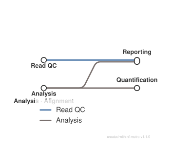

# Single-cell RNA-seq: alignment, quantification and QC

<div class="ox-page-badges"><span class="ox-badge ox-badge--live">✔ Live-tested</span> <span class="ox-badge ox-badge--origin">⇄ Official port</span> <span class="ox-badge ox-badge--nf"><span class="dot"></span>nf-core port</span></div>

Single-cell RNA-seq analysis from raw FASTQ reads to a final MultiQC report, on all five upstream aligner branches of nf-core/scrnaseq 4.2.0: cellranger (default), simpleaf (upstream default; index + quant + optional QCatch), kallisto/bustools (standard/lamanno/nac), STARsolo (incl. legacy iGenomes index upgrade), and cellrangerarc multiome ATAC+GEX. Shared downstream path: FastQC, mtx→h5ad conversion per aligner, CellBender ambient-RNA background removal (skipped for cellrangerarc, like upstream), sample-wise h5ad concatenation, optional Seurat/SingleCellExperiment export, workflow summary + methods description, MultiQC.

| | |
|---:|---|
| **Rating** | ✔ Live-tested |
| **Origin** | port |
| **Domain** | single-cell |
| **Rules** | 42 |
| **Compute** | up to 12 CPUs / 72 GB per rule (Cell Ranger) |
| **Tools** | cellranger · cellranger-arc · simpleaf · alevin-fry · piscem · salmon · qcatch · kallisto-bustools · star · samtools · fastqc · multiqc · scanpy · anndata · cellbender · anndataR · SeuratObject · SingleCellExperiment · rhdf5 · gzip · gawk · python |
| **Ported** | 2026-08-15 |
| **License** | Apache-2.0 |
| **Source** | [nf-core/scrnaseq](https://github.com/nf-core/scrnaseq) |
| **Pinned version** | `4.2.0` |

## Run it

```bash
oxo-flow run main.oxoflow
```

Needs Cell Ranger reference data and reads — see Requirements; preview with `oxo-flow dry-run main.oxoflow`.

## Installation

**Engine.** oxo-flow >= 0.12.0

**Toolchain.** containers (Docker/Singularity) — pinned images; conda alternatives in envs/ for non-Cell-Ranger rules (Cell Ranger rules are docker-only)

**Requirements.**
- reference genome FASTA, optionally gzipped (config.fasta, default refs/refdata.fa.gz)
- gene-annotation GTF, optionally gzipped (config.gtf, default refs/refdata.gtf.gz)
- raw FASTQ pair per sample: raw/<sample>_R1.fastq.gz and raw/<sample>_R2.fastq.gz (one pair per sample); for aligner=cellrangerarc five pre-named files per sample: raw/<sample>_{gex,atac}_S1_L001_R{1,2,3}_001.fastq.gz
- barcode whitelist per protocol for simpleaf/star (config.whitelist; the four upstream whitelists ship under assets/whitelist/)
- samplesheet.csv with columns sample,fastq_1,fastq_2,protocol,expected_cells (used by the combined-h5ad step)
- compute: up to 12 CPUs / 72 GB per rule (index builds and alignments); 6 CPUs / 36 GB for h5ad conversion, CellBender and concat rules; concurrent per-sample rules scale with -j
- optional pre-built indexes to skip building: cellranger (build_cellranger_index=false + transcriptome), simpleaf_index, kallisto_index (+ txp2gene), star_index, cellrangerarc_reference

```bash
# 1. install oxo-flow (release binary, recommended)
curl -fL -o oxo-flow.tar.gz https://github.com/Traitome/oxo-flow/releases/latest/download/oxo-flow-latest-x86_64-unknown-linux-gnu.tar.gz
tar xzf oxo-flow.tar.gz && sudo mv oxo-flow /usr/local/bin/
#    or, via conda (may lag behind releases):
#    conda install -c bioconda oxo-flow-cli
#    NOTE: bioconda currently ships 0.10.2, older than the >= 0.12.0
#    minimum of every catalog entry — prefer the release binary.

# 2. get this workflow (clones the repo, auto-discovers the workflow,
#    sanity-parses it with the engine)
oxo-flow pull gh:oxo-flow-community/oxo-flow-scrnaseq
#    (alternative: plain git clone)
#    git clone https://github.com/oxo-flow-community/oxo-flow-scrnaseq
```

## Parameters

| Parameter | Default | Description | Used by |
|---:|---|---|---|
| `aligner` | `cellranger` | --aligner / --protocol (port implements the cellranger branch; see README fidelity table) | — |
| `build_cellranger_index` | `true` | cellranger reference: build from fasta/gtf, or point transcriptome at an existing index | `cellranger_mkgtf`, `cellranger_mkref` |
| `cellranger_localmem` | `0` | GB passed to cellranger's --localmem (mkref/count). 0 = auto: 2/3 of the actually-free physical memory (/proc/meminfo MemAvailable, 1 GB floor) — never the engine's effective memory, which counts swap: cellranger's jobmngr waits forever when --localmem exceeds the free RAM (live: 'Need 6 GB ... (2.6 GB available)' looped for hours on a 3.7GB box). Set a positive number to force a value. | `cellranger_count`, `cellranger_mkref` |
| `expected_cells` | `` | samplesheet `expected_cells` column -> `--expect-cells` when set | `cellranger_count` |
| `fasta` | `refs/refdata.fa.gz` | reference genome (upstream --fasta / --gtf; may be .gz) | `gunzip_fasta` |
| `fasta_gz` | `true` | — | `gunzip_fasta` |
| `fasta_prepared` | `refs/refdata.fa` | derived reference files (README "Reference genome" explains the chain) | `cellranger_mkref`, `gtf_gene_filter`, `gunzip_fasta` |
| `gtf` | `refs/refdata.gtf.gz` | — | `gunzip_gtf` |
| `gtf_filtered` | `refs/refdata_genes.gtf` | — | `gtf_gene_filter`, `gtf_source_fix` |
| `gtf_gz` | `true` | — | `gunzip_gtf` |
| `gtf_mkgtf` | `refs/refdata_genes.filtered.gtf` | — | `cellranger_mkgtf`, `cellranger_mkref` |
| `gtf_mkgtf_input` | `refs/refdata_genes.gtf` | set to the source-fixed file when gtf_source_fix=true | `cellranger_mkgtf` |
| `gtf_prepared` | `refs/refdata.gtf` | — | `gtf_gene_filter`, `gunzip_gtf` |
| `gtf_source_fix` | `false` | iGenomes GTF source-field rewrite (opt-in, upstream gtf_source_has_spaces) | `gtf_source_fix` |
| `gtf_source_fixed` | `refs/refdata_genes.source_fixed.gtf` | — | `gtf_source_fix` |
| `multiqc_config` | `assets/multiqc_config.yml` | — | `multiqc` |
| `multiqc_title` | `` | -> `--title` when set | `multiqc` |
| `out_dir` | `results` | — | — |
| `protocol` | `auto` | passed verbatim as `--chemistry` (10x auto-detection) | `cellranger_count` |
| `samplesheet` | `test/fixtures/samplesheet.csv` | consumed by CONCAT_H5AD (same columns as upstream) | `concat_h5ad_cellbender_filter`, `concat_h5ad_filtered`, `concat_h5ad_raw` |
| `save_align_intermeds` | `true` | -> `--create-bam true` | `cellranger_count` |
| `skip_cellbender` | `false` | — | `anndata_barcodes`, `anndatar_convert_cellbender_filter`, `anndatar_convert_combined_cellbender_filter`, `anndatar_convert_combined_raw`, `anndatar_convert_raw`, `cellbender_removebackground`, `concat_h5ad_cellbender_filter`, `concat_h5ad_raw` |
| `skip_fastqc` | `false` | QC / reporting knobs | `fastqc` |
| `skip_multiqc` | `false` | — | `multiqc` |
| `transcriptome` | `refs/cellranger_reference` | — | `cellranger_count`, `cellranger_mkref` |

Descriptions are the workflow's own `#` comments from its `[config]` section, surfaced by `oxo-flow info` — no schema file to maintain.

## Workflow graph

<div class="ox-dag-card" markdown="1">



</div>

The graph is derived at catalog-build time from `oxo-flow graph -f dot` and rendered with Graphviz. It shows the workflow at rule level: wildcard `{sample}` instances expand at run time when sample data is discovered (the runtime view is `oxo-flow graph --expanded`).

## Scope

The default-parameters main path of the source pipeline was ported rule-for-rule; alternate paths are documented as excluded.

**In scope**

- anndata_barcodes
- anndatar_convert_cellbender_filter
- anndatar_convert_combined_cellbender_filter
- anndatar_convert_combined_filtered
- anndatar_convert_combined_raw
- anndatar_convert_filtered
- anndatar_convert_raw
- cellbender_removebackground
- cellranger_count
- cellranger_mkgtf
- cellranger_mkref
- cellrangerarc_count
- cellrangerarc_mkgtf
- cellrangerarc_mkref
- collect_versions
- concat_h5ad_cellbender_filter
- concat_h5ad_filtered
- concat_h5ad_raw
- fastqc
- gtf_gene_filter
- gtf_source_fix
- gunzip_fasta
- gunzip_gtf
- kallistobustools_count
- kallistobustools_ref_standard
- kallistobustools_ref_velocity
- methods_description
- mtx_to_h5ad_filtered
- mtx_to_h5ad_kallisto_filtered
- mtx_to_h5ad_kallisto_raw
- mtx_to_h5ad_raw
- mtx_to_h5ad_simpleaf
- mtx_to_h5ad_star_filtered
- mtx_to_h5ad_star_raw
- multiqc
- qcatch
- simpleaf_index
- simpleaf_quant
- star_align
- star_genomegenerate
- star_genomeparams_upgrade
- workflow_summary

**Excluded**

- cellrangermulti: aligner=cellrangermulti branch (multiome VDJ/Ab-seq/CRO) — structural: upstream feeds per-sample per-modality fastq groups into cellranger multi via channel branching (groupTuple + EMPTY-file injection for missing modalities) and three index channels (GEX/VDJ/cellranger_multi_barcodes); a fixed rule input signature cannot express variable modality input sets per sample — no oxo-flow analogue
- PIPELINE_COMPLETION: email/notification completion subworkflow — structural: workflow.onComplete/onError hooks do not exist in the oxo-flow engine; failure email must be sent by an external wrapper

## Fidelity

Rows cover every upstream process/subworkflow of nf-core/scrnaseq 4.2.0, on all
five aligner branches. Container image strings and conda pins are copied
verbatim from the upstream modules (all pinned, no `latest`). Deviations from
upstream mechanics are called out per row; two structural exclusions and one
multi-lane data limitation remain and are listed at the bottom with evidence.

**Live verification** (2026-08-26/27, tx-ubuntu, engine 0.15.0 + apptainer):
five configurations passed end-to-end — `aligner = cellranger`, `simpleaf`,
`kallisto`, `star` (10X) and `star` with `protocol = dropseq`. The
`cellrangerarc` branch is ported and validate/lint-clean but was not live-run
in this wave.

| Upstream process/rule | oxo-flow rule | Tool (version) | Notes |
|---|---|---|---|
| `PIPELINE_INITIALISATION` (samplesheet check) | sample source + `config.samplesheet` | — | Samplesheet (`sample, fastq_1, fastq_2, protocol, expected_cells`) maps to `[[sample_groups]]`; `expected_cells` column → `config.expected_cells`; per-sample `protocol` column is informational (chemistry comes from `--protocol`). Schema checks are enforced by the port's fixtures + README contract. |
| `FASTQC` | `fastqc` | fastqc 0.12.1 | Identical command: `printf … \| while read; ln -s` staging loop, `fastqc --quiet --threads N --memory <12G/N clamped 100-10000>`. Published under `results/fastqc/` (upstream default publishDir). `--memory` computed in-shell from the process_low 12G/2 cpus. |
| `GUNZIP` (as `GUNZIP_FASTA`) | `gunzip_fasta` | gzip 1.13 | Identical command (`gzip -cd <fasta> > <out>`). Runs only when `config.fasta_gz` (upstream decides by `.endsWith('.gz')` at runtime — port uses an explicit flag, see Gotchas). |
| `GUNZIP` (as `GUNZIP_GTF`) | `gunzip_gtf` | gzip 1.13 | Same as above for the GTF. |
| `GTF_GENE_FILTER` | `gtf_gene_filter` | python 3.9 | Same bundled script `filter_gtf_for_genes_in_genome.py`, same flags (`--gtf --fasta -o`); output name `<fasta_stem>_genes.gtf` is `config.gtf_filtered`. |
| `GAWK` (as `GTF_SOURCE_FIX`) | `gtf_source_fix` | gawk 5.3.1 | Same awk program (`FS=OFS="\t"`, source-field spaces→underscores, output suffix `gtf`). Off by default, exactly like upstream (only fires for iGenomes entries flagged `gtf_source_has_spaces`). |
| `CELLRANGER_MKGTF` | `cellranger_mkgtf` | cellranger 10.0.0 | Same command incl. the three `--attribute=gene_biotype:` filters. Runs only when `build_cellranger_index=true` (mirrors upstream `if (!cellranger_index)`). |
| `CELLRANGER_MKREF` | `cellranger_mkref` | cellranger 10.0.0 | Same command (`--genome=… --fasta=… --genes=… --localcores --localmem --nthreads`). `--genome` is `config.transcriptome` (default `refs/cellranger_reference`) instead of a bare workdir name — same reference name, path relocated to the workflow tree. |
| `CELLRANGER_COUNT` | `cellranger_count` | cellranger 10.0.0 | Same command: reads staged under Cell Ranger naming (`<sample>_S1_L001_R1/R2_001.fastq.gz`), `cellranger count --id <sample> --fastqs fastq_all --transcriptome … --localcores … --localmem … --chemistry <protocol> --create-bam <bool>` + `--expect-cells` when set. The outs tree is then relocated to `results/<aligner>/count/<sample>/outs/` (upstream publishDir `outdir/cellranger/count`). Multi-lane samples (several fastq pairs per sample) are not represented — one pair per sample. |
| `SIMPLEAF_INDEX` | `simpleaf_index` | simpleaf 0.19.5, piscem 0.12.2, alevin-fry 0.11.2, salmon 1.10.3 | Same command (`simpleaf set-paths` + `simpleaf index --threads … [--ref-seq <transcript_fasta> | --fasta … --gtf …] -o simpleaf_index`; `ulimit -n 2048` and `ALEVIN_FRY_HOME` exported). Transcript-fasta mode requires `txp2gene`, mirroring upstream's assert. Output under `refs/simpleaf_index/`. |
| `SIMPLEAF_QUANT` | `simpleaf_quant` | simpleaf 0.19.5, alevin-fry 0.11.2, piscem 0.12.2, salmon 1.10.3 | Same command (`simpleaf quant [--t2g-map …] --chemistry <protocol-mapped> --index … --reads1/2 … --resolution cr-like --output simpleaf_quant --threads … --anndata-out --unfiltered-pl <whitelist>`; cell filtering hardcoded to `unfiltered-pl` upstream → input_type is always raw). Protocol→chemistry mapping and per-protocol whitelist mirror `assets/protocols.json`. Output `results/<aligner>/<sample>/simpleaf_quant/af_quant/`. |
| `QCATCH` | `qcatch` | qcatch 0.2.12 | Same command (`qcatch --input <af_quant dir> --output qcatch [--chemistry 10X_3p_v2/v3/v4] --save_filtered_h5ad --export_summary_table [--n_partitions] [--remove_doublets --visualize_doublets]`), same output renames (`QCatch_report.html` → `<sample>_qcatch_report.html`, `filtered_quants.h5ad` → `<sample>_filtered_quants.h5ad`, `summary_table.csv` → `<sample>_metrics_summary.csv`). Chemistry mapping for 10XV2-4 only, exactly like upstream. |
| `KALLISTOBUSTOOLS_REF` | `kallistobustools_ref_standard`, `kallistobustools_ref_velocity` | kb-python 0.28.2 | Same commands: standard `kb ref -i … -g … -f1 cdna.fa --workflow standard`; non-standard workflows (`lamanno`/`nac`) add `-f2 intron.fa -c1 cdna_t2c.txt -c2 intron_t2c.txt --workflow <mode>`. Mutual exclusion is a `when` on `kb_workflow` (upstream picks the command by the same variable). Outputs under `refs/kallisto/`. |
| `KALLISTOBUSTOOLS_COUNT` | `kallistobustools_count` | kb-python 0.28.2 | Same command (`kb count -t … -i … -g … [-c1 …] [-c2 …] -x <technology> --workflow <kb_workflow> --filter -o <sample>.count -m <memory.toGiga()-1>G reads`); technology mapping for 10XV1-4/DROPSEQ/SMARTSEQ mirrors upstream. Ext.args `--workflow … --filter` applied. Output `results/<aligner>/<sample>.count/`. |
| `STAR_GENOMEGENERATE` | `star_genomegenerate` | star 2.7.11b, samtools 1.21, gawk 5.1.0 | Same command: `samtools faidx` + gawk SAindexNbases heuristic from the `.fai` (14 cap), `--runMode genomeGenerate --genomeDir … --genomeFastaFiles … --sjdbGTFfile … --runThreadN … --genomeSAindexNbases … --limitGenomeGenerateRAM <memory-100000000>`. Output under `refs/star_index/`. |
| `STAR_GENOMEPARAMS_UPGRADE` | `star_genomeparams_upgrade` | gawk 5.3.1 | Same script: symlink the legacy index files, awk-rewrite `genomeParameters.txt` (versionGenome 20201 → 2.7.4a, append genomeType/Full + genomeTransformType/None + genomeTransformVCF/-), move to `refs/star_index_upgraded/`. Fires only when `star_index` is set and `star_index_legacy=true` (upstream `isStarIndexLegacy`). |
| `STAR_ALIGN` | `star_align` | star 2.7.10b | Same command: reads passed REVERSE first, `--readFilesCommand zcat --runDirPerm All_RWX --outWigType bedGraph --twopassMode Basic --outSAMtype BAM SortedByCoordinate --limitBAMsortRAM <memory bytes>`, `--soloCBwhitelist` with the same `.gz`→uncompress handling (protocols without an upstream whitelist — dropseq/smartseq — get the literal `--soloCBwhitelist None`, STAR's required spelling for no whitelist; live-found: omitting the flag aborts with "--soloCBwhitelist is not defined"), `--soloType`/`--soloUMIlen` per protocol (10XV1/2→10, 10XV3/4→12, dropseq/smartseq→none), `--soloCellFilter CellRanger2.2 <expected_cells> 0.99 10` when set, `--soloFeatures <star_feature>` (+Velocyto publish rename). Solo.out tsv/mtx files gzipped in-place before publish, exactly like upstream. Index selection: upgraded legacy > user `star_index` > built. |
| `CELLRANGERARC_MKGTF` | `cellrangerarc_mkgtf` | cellranger-arc 2.0.2 | Same command as upstream (`cellranger-arc mkgtf` with the three biotype filters). Runs only when `build_cellranger_index=true`. |
| `CELLRANGERARC_MKREF` | `cellrangerarc_mkref` | cellranger-arc 2.0.2 | Same flow: auto-generated mkref config json (`organism: "refdata"`, `genome: ["<prefix>_reference"]`, `input_fasta`, `input_gtf`) or user `cellrangerarc_config`, then `cellranger-arc mkref --config=config --nthreads …`. Output at `refs/cellrangerarc_reference/` (the config's `genome` name; `cellrangerarc_reference` can point at an existing reference to skip building). |
| `CELLRANGERARC_COUNT` | `cellrangerarc_count` | cellranger-arc 2.0.2 | Same flow: fastqs staged under `fastqs/`, 2-row `lib.csv` (Gene Expression / Chromatin Accessibility), `cellranger-arc count --id=<sample> --libraries=… --reference=… --localcores … --localmem … [--expect-cells]`, outs tree relocated to `results/<aligner>/count/<sample>/outs/`. Deviation: the upstream samplesheet's `sample_type`/`fastq_barcode` columns are replaced by a fixed file-naming contract — see the sample-data requirements. |
| `MTX_TO_H5AD` | `mtx_to_h5ad_{raw,filtered,simpleaf,kallisto_raw,kallisto_filtered,star_raw,star_filtered}` | scanpy 1.10.2 / pandas / anndata | Same template scripts per aligner (`mtx_to_h5ad_cellranger.py` — read_10x_h5, also used for cellrangerarc exactly like upstream's `(input_aligner in ['cellranger','cellrangerarc','cellrangermulti']) ? 'cellranger' : input_aligner`; `mtx_to_h5ad_simpleaf.py`; `mtx_to_h5ad_kallisto.py` with standard/lamanno/nac branches; `mtx_to_h5ad_star.py` incl. the Velocyto layer code, dead upstream, kept verbatim), one rule per aligner×input_type. Raw/filtered gating mirrors the upstream channels: simpleaf emits only raw (upstream hardcodes `unfiltered-pl`); star/kallisto filtered conversions skip for protocols without a whitelist (dropseq/smartseq) — the upstream filtered dirs don't exist there. |
| `CELLBENDER_REMOVEBACKGROUND` | `cellbender_removebackground` | cellbender 0.3.2 | Same command `TMPDIR=. cellbender remove-background --cpu-threads … --estimator-multiple-cpu --input … --output <sample>.h5` (no `--cuda`: GPU profile is out of scope). Full output file set moved to `results/<aligner>/<sample>/cellbender_removebackground/`. Skipped for `cellrangerarc`, exactly like upstream. |
| `ANNDATA_BARCODES` | `anndata_barcodes` | anndata 0.11.4 / pandas | Same template script (barcode CSV → subset → write), same output name `<sample>_cellbender_filter_matrix.h5ad`. Skipped for `cellrangerarc` with the upstream subworkflow. |
| `CONCAT_H5AD` | `concat_h5ad_filtered`, `concat_h5ad_cellbender_filter`, `concat_h5ad_raw` | scanpy 1.10.2 | Same template script (`ad.concat(label="sample", merge="unique", index_unique="_")` + samplesheet join on `sample`). Upstream runs one process per input_type; the port has one rule per input_type. Gating mirrors the upstream channels: `filtered` skips for simpleaf (no filtered h5ads), star+dropseq and kallisto+dropseq (no filtered dirs), and smartseq (no whitelist); `raw` runs only when `skip_cellbender=true` or aligner=cellrangerarc (raw superseded by the CellBender-filtered h5ad otherwise). |
| `ANNDATAR_CONVERT` | `anndatar_convert_{filtered,cellbender_filter,raw}` + `anndatar_convert_combined_{…}` | anndataR 1.0.2, SeuratObject 5.5.0, SingleCellExperiment 1.32.0 | Same R template (read_h5ad → `as_Seurat()`/`as_SingleCellExperiment()` → saveRDS). Six rules: per sample and per combined h5ad, per input_type; type gating mirrors the concat rules. Upstream `dir.create(<sample>)` calls and versions.yml writing dropped (output dirs are pre-created by the engine; versions are recorded in `collect_versions`). |
| `softwareVersionsToYAML` + `collectFile` | `collect_versions` | — | Writes the same file `results/pipeline_info/nf_core_scrnaseq_software_mqc_versions.yml` consumed by MultiQC. Content is the port's pinned versions (upstream collates live tool versions from a channel topic, which has no oxo-flow equivalent); since containers are pinned, the recorded versions equal the executed ones. Only the active aligner's block is emitted, like the upstream channel topic. |
| `paramsSummaryMultiqc` + methods description | `workflow_summary`, `methods_description` | — | New default-ON rules producing the summary/methods MultiQC YAMLs from the copied-verbatim `assets/methods_description_template.yml` (the `${…}` placeholders are filled at render time; upstream fills them from the Nextflow workflow object, which has no oxo-flow equivalent). They run in the default config, so a single-sample default dry-run plan (`oxo-flow dry-run main.oxoflow --samples first:1`, as exercised by test/run.sh) shows 21 rules executing (19 baseline + these 2); with the two bundled samples the plan shows 29 running instances — documented new default behavior. |
| `MULTIQC` | `multiqc` | multiqc 1.34 | Same command (`multiqc --force [--title] --config <assets/multiqc_config.yml> .`) with inputs staged flat like the module's `stageAs '?/*'`; the input union covers the active aligner's web summaries/logs (FastQC + cellranger web_summary + simpleaf quants.h5ad + STAR Log.final.out). Default `assets/multiqc_config.yml` copied verbatim from upstream. |

**Not ported (with reasons):**

| Upstream branch | Reason |
|---|---|
| `aligner = cellrangermulti` (multiome VDJ/Ab-seq/CRO) | Structural: upstream feeds per-sample, per-modality fastq groups into `cellranger multi` via channel branching (`groupTuple` + EMPTY-file injection for missing modalities) and three index channels (GEX/VDJ/cellranger_multi_barcodes). A fixed rule input signature cannot express a variable number of modality input sets per sample — no oxo-flow analogue exists. |
| `PIPELINE_COMPLETION` (email/notification) | Structural: `workflow.onComplete`/`onError` hooks do not exist in the oxo-flow engine; the failure email would have to be sent by an external wrapper. |
| `skip_cellranger_renaming` (multi-lane samples) | One fastq pair per sample is supported; the staging rename hard-codes lane `L001`. |

**Other deliberate deviations** (documented per row above): FastQC is skipped
for `cellrangerarc` (five reads per sample cannot fit one static input
pattern; upstream runs it on all of them); the arc samplesheet columns are a
file-naming contract; `workflow_summary`/`methods_description` are new
default-ON rules; simpleaf/star/kallisto accept one explicit `whitelist` path
instead of upstream's automatic per-protocol mapping.

**Live-root-caused fixes** (engine 0.15.0, tx-ubuntu): tool-facing
threads/cores use `{effective_threads}` (rules declare 12/6 CPUs; a 4-core box
would oversubscribe); every container spec is quay.io-qualified (bare
`biocontainers/...` resolves to Docker Hub, not the pinned quay.io registry);
directory-moving rules `rm -rf` the engine-precreated output parent before
`mv` (the parent exists, so `mv` would nest the tree inside itself); the STAR
index nbases heuristic truncates with `int()` and a 14 cap (the 52kb fixture
genome rounded up to 7 where STAR requires 6 — "may cause seg-fault"); the
fixture GTF gives every gene two exons with an intron (single-exon
transcripts crash simpleaf's grangers intron pass: polars "invalid series
dtype: expected List, got null"); the fixture genome is padded to ~52kb (STAR
double-frees on the original 1.9 kb genome).


## Links

- Repository: [oxo-flow-scrnaseq](https://github.com/oxo-flow-community/oxo-flow-scrnaseq)
- Upstream: [nf-core/scrnaseq](https://github.com/nf-core/scrnaseq) @ `4.2.0`
- License: Apache-2.0 (this workflow) · MIT (upstream)

Created on 2026-08-15 — this port may lag behind upstream releases. See the repository's NOTICE for full attribution.
