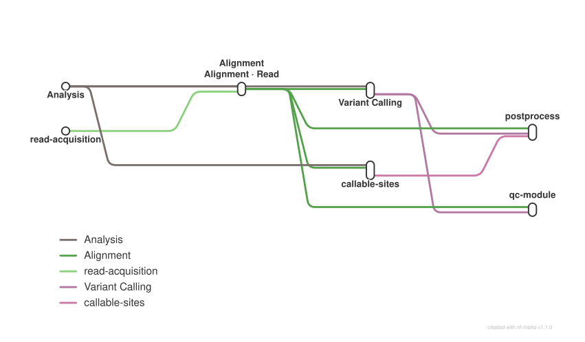

# Variant calling for non-model organisms: trimming, alignment and per-sample gVCFs

<div class="ox-page-badges"><span class="ox-badge ox-badge--live">✔ Live-tested</span> <span class="ox-badge ox-badge--origin">⇄ Official port</span> <span class="ox-badge ox-badge--sn"><span class="dot"></span>snakemake port</span></div>

Variant calling for non-model organisms: paired FASTQ reads are trimmed and filtered with fastp, aligned with BWA-MEM, and called to per-sample gVCFs with GATK HaplotypeCaller (low-coverage defaults: -ploidy 2, --min-pruning 1), alongside a cohort QC metrics report aggregating fastp and samtools stats.

| | |
|---:|---|
| **Rating** | ✔ Live-tested |
| **Origin** | port |
| **Domain** | genomics |
| **Rules** | 58 |
| **Compute** | up to 8 CPUs / 8 GB per rule (bwa_mem) |
| **Tools** | fastp · bwa · samtools · gatk4 · python · sambamba · mosdepth · clam · genmap · glnexus · bcftools · plink · admixture · vcftools · R |
| **Ported** | 2026-08-15 |
| **License** | Apache-2.0 |
| **Source** | [harvardinformatics/snparcher](https://github.com/harvardinformatics/snparcher) |
| **Pinned version** | `v2.2` |

## Run it

```bash
oxo-flow run main.oxoflow reference_source=/path/to/genome.fa.gz
```

Set your reference genome as shown; preview with `oxo-flow dry-run main.oxoflow`.

## Installation

**Engine.** oxo-flow >= 0.12.0

**Toolchain.** conda envs — pinned versions (fastp 1.3.6, bwa 0.7.19, samtools 1.24, gatk4 4.6.2.0; conda-forge + bioconda)

**Requirements.**
- reference genome FASTA (plain or gzip), passed as reference_source at run time — bgzip-compressed and indexed by the workflow itself (no pre-built indices)
- paired-end reads at raw/<sample>_1.fastq.gz and raw/<sample>_2.fastq.gz for each sample in the [[sample_groups]] list
- compute: up to 8 CPUs / 8 GB per rule (bwa_mem 8 threads, fastp 4, gatk_haplotypecaller 7 GB Java heap)
- conda or mamba at runtime to create the pinned envs/*.yaml environments

```bash
# 1. install oxo-flow (release binary, recommended)
curl -fL -o oxo-flow.tar.gz https://github.com/Traitome/oxo-flow/releases/latest/download/oxo-flow-latest-x86_64-unknown-linux-gnu.tar.gz
tar xzf oxo-flow.tar.gz && sudo mv oxo-flow /usr/local/bin/
#    or, via conda (may lag behind releases):
#    conda install -c bioconda oxo-flow-cli
#    NOTE: bioconda currently ships 0.10.2, older than the >= 0.12.0
#    minimum of every catalog entry — prefer the release binary.

# 2. get this workflow (clones the repo, auto-discovers the workflow,
#    sanity-parses it with the engine)
oxo-flow pull gh:oxo-flow-community/oxo-flow-snparcher
#    (alternative: plain git clone)
#    git clone https://github.com/oxo-flow-community/oxo-flow-snparcher
```

## Parameters

| Parameter | Default | Description | Used by |
|---:|---|---|---|
| `expected_coverage` | `low` | — | — |
| `intervals_enabled` | `false` | — | — |
| `mark_duplicates` | `false` | — | — |
| `ploidy` | `2` | — | `gatk_haplotypecaller` |
| `reference_name` | `my_organism` | — | `bwa_mem`, `gatk_haplotypecaller`, `index_reference`, `prepare_reference` |
| `reference_source` | `test/fixtures/ref/genome.fa` | — | `prepare_reference` |

Descriptions are the workflow's own `#` comments from its `[config]` section, surfaced by `oxo-flow info` — no schema file to maintain.

## Workflow graph

<div class="ox-dag-card" markdown="1">



</div>

The graph is derived at catalog-build time from `oxo-flow graph -f dot` and rendered with Graphviz. It shows the workflow at rule level: wildcard `{sample}` instances expand at run time when sample data is discovered (the runtime view is `oxo-flow graph --expanded`).

## Scope

The default-parameters main path of the source pipeline was ported rule-for-rule; alternate paths are documented as excluded.

**In scope**

- prepare_reference
- index_reference
- fastp
- download_sra
- fastp_srr
- bwa_mem
- merge_library_bams
- merge_library_level_bams
- markdup_library
- merge_dedup_libraries
- stage_external_bam
- index_bam_csi
- index_bam_csi_markdup
- index_bam_csi_external
- gatk_haplotypecaller
- gatk_haplotypecaller_markdup
- gatk_haplotypecaller_external
- deepvariant_call
- deepvariant_call_markdup
- deepvariant_call_external
- create_db_mapfile
- joint_genomics_db_import
- joint_genotype_gvcfs
- glnexus_joint
- variant_filtration
- collect_fastp_stats
- bam_stats
- bam_stats_markdup
- bam_stats_external
- parse_bam_stats
- combine_qc_metrics
- mosdepth
- mosdepth_markdup
- mosdepth_external
- clam_collect
- callable_coverage_thresholds
- clam_loci
- coverage_bed
- genmap_index
- genmap_mappability
- mappability_bed
- callable_sites_bed
- postprocess_filter_individuals
- postprocess_basic_filter
- postprocess_update_bed
- postprocess_strict_filter
- postprocess_subset_indels
- postprocess_subset_snps
- postprocess_drop_indel_snps
- qc_contig_map
- qc_vcftools_individuals
- qc_subsample_snps
- qc_prepare_plink_inputs
- qc_copy_qc_report
- qc_plink
- qc_setup_admixture
- qc_admixture
- qc_dashboard

**Excluded**

- interval scatter / bcftools caller — snakemake checkpoints extend the DAG at runtime (intervals.smk:59,89; bcftools.smk:13); oxo-flow DAG is static
- parabricks — every rule is --nv GPU passthrough; oxo-flow docker backend has no --nv
- sentieon — proprietary SENTIEON_LICENSE server gating
- denovo / structural_variants — do not exist in upstream v2.2
- gvcf input type — external paths can't feed expand_inputs (gatk.smk:57)
- generate_coords_file — lat/long sample-sheet metadata not in the group model
- multi-library rows / per-sample markdup override — one unit per sample

## Fidelity

58 rules ported from upstream v2.2 (up from 12), covering every branch that
can be expressed in oxo-flow's static DAG. Commands are ported verbatim
(same flags, same output paths); upstream's snakemake `{{...}}` shell escaping
is unwrapped to literal braces, and snakemake `{params.*}`/`{resources.*}`
references are resolved to their upstream values or to `{config.*}` keys.

| Upstream rule | oxo-flow rule | Tool (version) | Notes |
|---|---|---|---|
| `prepare_reference` (local branch) | `prepare_reference` | samtools 1.24 (bgzip) | identical command; url/accession branches not ported (config `reference_source` is a local path) |
| `index_reference` | `index_reference` | samtools 1.24, bwa 0.7.19 | identical command (faidx + dict + bwa index) |
| `fastp` | `fastp` / `fastp_srr` | fastp 1.3.6 | identical flags; `{sample}/{sample}/u1` fan-out for single-row sheets with empty `library_id`; SRA-downloaded reads via `fastp_srr` |
| `download_sra` | `download_sra` | sra-tools 3.2.1, ffq, curl, pigz | identical prefetch→fasterq-dump→pigz flow with ffq/ENA fallback; fasterq-dump `--tmpdir` dropped (oxo-flow has no per-rule tmpdir) |
| `bwa_mem` | `bwa_mem` | bwa 0.7.19, samtools 1.24 | identical command incl. read group `ID:{sample}.u1 SM:{sample} LB:{sample} PL:ILLUMINA`; raw BAM is temp like upstream |
| `merge_library_bams` | `merge_library_bams` | samtools 1.24 | per-library merge, single input unit in the default path |
| `merge_library_level_bams` | `merge_library_level_bams` | samtools 1.24 | no-markdup path (`results/bams/merged/{sample}.bam`) |
| `markdup_library` / `merge_dedup_libraries` | `markdup_library` / `merge_dedup_libraries` | sambamba 1.0.1, samtools 1.24 | identical commands; gated on `mark_duplicates` (default `false`; upstream default `true` — see deviations below) |
| `index_bam_csi` | `index_bam_csi` / `index_bam_csi_markdup` / `index_bam_csi_external` | samtools 1.24 | identical (`samtools index -c`), one per BAM-producing branch |
| `stage_external_bam` | `stage_external_bam` | — | external BAM inputs symlinked into `results/bams/input/` then run through the standard callers |
| `gatk_haplotypecaller` (standard mode) | `gatk_haplotypecaller` / `_markdup` / `_external` | gatk4 4.6.2.0 | identical flags incl. `-ploidy 2 --emit-ref-confidence GVCF --min-pruning 1 --min-dangling-branch-length 1` (low-coverage defaults); `-Xmx7000m` = upstream default profile `mem_mb_reduced`; threads 1 as upstream |
| `deepvariant_call` | `deepvariant_call` / `_markdup` / `_external` | google/deepvariant:1.10.0 (docker) | identical `/opt/deepvariant/bin/run_deepvariant` invocation; gated on `variant_tool = "deepvariant"` |
| `create_db_mapfile` | `create_db_mapfile` | python (script) | identical logic, ported as `scripts/write_joint_gvcf_mapfile.py` |
| `joint_genomics_db_import` | `joint_genomics_db_import` | gatk4 | identical GenomicsDBImport flow incl. `TILEDB_DISABLE_FILE_LOCKING` and `--merge-input-intervals` from `scripts/interval_list_tools.py` (merge threshold 50 = upstream `GENOMICSDB_MERGE_CONTIG_THRESHOLD`) |
| `joint_genotype_gvcfs` | `joint_genotype_gvcfs` | gatk4 | identical (tar-extract → `gendb://` GenotypeGVCFs → `results/vcfs/raw.vcf.gz`); temp raw VCF like upstream |
| `glnexus_joint` | `glnexus_joint` | glnexus, bcftools 1.23 | identical DeepVariant-config GLnexus join; `mem_gbytes` = `mem_mb_reduced/1024` rounded to 8, computed from the default profile (see deviations) |
| `variant_filtration` | `variant_filtration` | gatk4, bcftools | identical RPRS/FS_SOR/MQ/QUAL hard filters, `--invalidate-previous-filters true`, then `bcftools index -f -t` |
| `collect_fastp_stats` | `collect_fastp_stats` | python (script) | identical logic, ported as `scripts/collect_fastp_stats.py` |
| `bam_stats` | `bam_stats` / `_markdup` / `_external` | samtools 1.24 | identical (coverage + flagstat -O tsv); outputs temp like upstream |
| `parse_bam_stats` | `parse_bam_stats` | python (script) | identical logic, ported as `scripts/parse_bam_stats.py` |
| `combine_qc_metrics` | `combine_qc_metrics` | python (script) | identical report format; gather via `expand_inputs` |
| `mosdepth` | `mosdepth` / `_markdup` / `_external` | mosdepth 0.3.3 | identical (`--d4 -t {threads}`), per BAM branch |
| `clam_collect` | `clam_collect` | clam | identical (`clam collect -o depths.zarr`) |
| `callable_coverage_thresholds` | `callable_coverage_thresholds` | python (script) | identical logic, ported verbatim as `scripts/callable_coverage_thresholds.py` |
| `clam_loci` | `clam_loci` | clam | identical incl. per-sample mode and `-m/-M` from the thresholds TSV |
| `coverage_bed` | `coverage_bed` | python, bedtools | identical logic, ported verbatim as `scripts/callable_zarr_to_bed.py` |
| `genmap_index` | `genmap_index` | genmap | identical index-mode switching on decompressed FASTA size (skew ≥ 5 GB, sampled ≥ 2 GB) |
| `genmap_mappability` | `genmap_mappability` | genmap | identical (`-K 150 -E 2 -bg -T`) |
| `mappability_bed` | `mappability_bed` | awk, bedtools | identical score filter + `-d 100` merge |
| `callable_sites_bed` | `callable_sites_bed` | bedtools | identical sort/merge of coverage + mappability BEDs |
| postprocess module (`filter_individuals`, `basic_filter`, `update_bed`, `strict_filter`, `subset_snps`, `subset_indels`, `drop_indel_SNPs`) | `postprocess_filter_individuals` … `postprocess_drop_indel_snps` | bcftools 1.23, awk, bedtools, tabix | identical commands; `scripts/write_include_samples.py` for the sample list; AF upper bound computed as `1 - maf` (upstream `1-{params.maf}`) Requires callable sites + joint genotyping (upstream-faithful module dependency). |
| qc module (`contig_map`, `vcftools_individuals`, `subsample_snps`, `prepare_plink_inputs`, `copy_qc_report`, `plink`, `setup_admixture`, `admixture`, `qc_dashboard`) | `qc_contig_map` … `qc_dashboard` | vcftools 0.1.16, bcftools 1.23, plink2/plink, admixture, R | identical commands; logic ported to `scripts/contig_map.py`, `vcftools_individuals.py`, `prepare_plink_inputs.py`, `contigs4admixture.py`, `qc_dashboard_render.R` Requires joint genotyping (upstream-faithful module dependency; consumes the joint VCF). |
| `setup` / `download_reads` / `map_samples` / `call_variants` / `qc_report` / `callable_sites` / `gvcfs` (Snakefile aggregation targets) | n/a | — | Snakemake target rules, no commands of their own |

### Remaining exclusions (structurally impossible in oxo-flow)

| Item | Why excluded | Evidence |
|---|---|---|
| `intervals.enabled` interval scatter (`picard_intervals`, `create_gvcf_intervals`, `create_db_intervals`, `gatk_haplotypecaller_interval`, `concat_interval_gvcfs*`, `concat_interval_vcfs*`, `compress_interval_raw_vcf`, `normalize_external_gvcf_for_gatk`, `archive_gatk_gvcf`) | upstream uses snakemake **checkpoints** (`create_gvcf_intervals` at `workflow/rules/intervals.smk:59`, `create_db_intervals` at `:89`) that extend the DAG at runtime from intermediate files; oxo-flow's DAG is static, so per-interval fan-out cannot be planned | `intervals.smk:59,89` (`checkpoint`), `variant_calling/gatk.smk` consumes `intervals.enabled` via checkpoints |
| `bcftools_call` (bcftools caller) | depends on `bcftools_regions` **checkpoint** (`variant_calling/bcftools.smk:13`) which computes regions from the runtime `callable_sites.bed`; same static-DAG limitation, and the checkpoint also writes the per-sample gVCF into the same output paths the GATK/DeepVariant branches produce (runtime producer selection) | `variant_calling/bcftools.smk:13` (`checkpoint bcftools_regions`), `:42,:55` |
| parabricks (all `parabricks_*` rules) | requires `--nv` GPU passthrough (upstream `parabricks.smk` runs `--nv` images with `nvidia-docker`); the oxo-flow docker backend has no `--nv` support and no GPU device declaration; additionally NVIDIA EULA/license enforcement cannot be guaranteed in CI | `variant_calling/parabricks.smk` (every rule is `--nv`) |
| sentieon (all `sentieon_*` rules) | proprietary tool gated on a `SENTIEON_LICENSE` server and a pre-installed license; cannot be distributed or verified in a community port | `config/config.yaml` `sentieon` section; `workflow/rules/sentieon.smk` |
| `denovo` and `structural_variants` pipeline sections | do not exist as rules in upstream v2.2 | grep of `workflow/` at e0e7a94 finds neither rule set |
| `gvcf` input type (`normalize_external_gvcf_for_gatk`) | external per-sample paths (arbitrary filesystem locations) cannot feed `expand_inputs` group expansion, which requires a uniform `{sample}` pattern under the workflow root | `variant_calling/gatk.smk:57` (`rule normalize_external_gvcf_for_gatk`) |
| `generate_coords_file` (qc module) | upstream generates a `coords.tsv` from sample sheet `lat`/`long` columns; the port's sample-group model has no lat/long metadata, and it only feeds the excluded gvcf-input dashboard variant | `modules/qc/Snakefile` `generate_coords_file` |
| per-sample `mark_duplicates` override | upstream reads the value from the sample sheet per row; the port maps it to the global `mark_duplicates` config key | `config/config.yaml` `mark_duplicates` vs `workflow/snakefiles` per-sample handling |
| multi-library / multi-unit rows (library_id, input_unit) | the sample-group model has one unit per sample; consumers of `results/bams/raw/{sample}/{sample}/u1.bam` are hard-coded to the `u1` unit | sample sheet semantics in upstream `README` |

### Documented deviations from upstream

1. **Default config differs from upstream**: upstream defaults `mark_duplicates: true`, `joint_genotyping: true`, `generate_filtered_vcf: true`, `callable_sites.enabled: true`; the port defaults all of these to `false` so its default plan is byte-identical to the previous 12-rule port. Flip the keys to get upstream's full pipeline.
2. **postprocess/qc modules consume `results/vcfs/raw.vcf.gz`**, not upstream's `FINAL_VCF` (which is the hard-filtered VCF when `generate_filtered_vcf: true` and GATK is used). The modules were run on the raw joint VCF. The difference only matters when combining GATK + `generate_filtered_vcf` + a module, and reproduces upstream behavior for the DeepVariant path.
3. **Long-contig CSI mode not ported for postprocess**: upstream conditionally uses CSI indexes when contigs exceed 512 Mb (`regions_to_index`); the port always uses the default TBI short mode. Applicable only to genomes with >512 Mb contigs.
4. **`glnexus_joint` memory**: upstream computes `mem_gbytes` from the default profile's `mem_mb_reduced`; the port inlines the resulting value 8 (with the same `if < 1 then 1` clamp).
5. **`combine_qc_metrics` with mixed input types**: its `expand_inputs` references `results/fastp/{sample}/{sample}/u1.json` for every sample, which only exists for fastq/srr samples — for bam-input cohorts the fastp stats expand fails at plan time. Use fastq/srr groups when combining QC metrics.
6. **`fasterq-dump --tmpdir` dropped** (no per-rule tmpdir in oxo-flow); SRA downloads use the current directory.

Version pinning: upstream envs declare only `>=` ranges with no lockfile;
exact pins (fastp 1.3.6, samtools 1.24, bwa 0.7.19, gatk4 4.6.2.0, bcftools
1.23, sra-tools 3.2.1, mosdepth 0.3.3, vcftools 0.1.16, plink2) were resolved
from bioconda/conda-forge at port time (2026-08-15). Upstream default-profile
thread overrides (fastp 6, bwa_mem 16) are runtime knobs; the port keeps the
rules' own declarations (4 and 8).

## Links

- Repository: [oxo-flow-snparcher](https://github.com/oxo-flow-community/oxo-flow-snparcher)
- Upstream: [harvardinformatics/snparcher](https://github.com/harvardinformatics/snparcher) @ `v2.2`
- License: Apache-2.0 (this workflow) · MIT (upstream)

Created on 2026-08-15 — this port may lag behind upstream releases. See the repository's NOTICE for full attribution.
