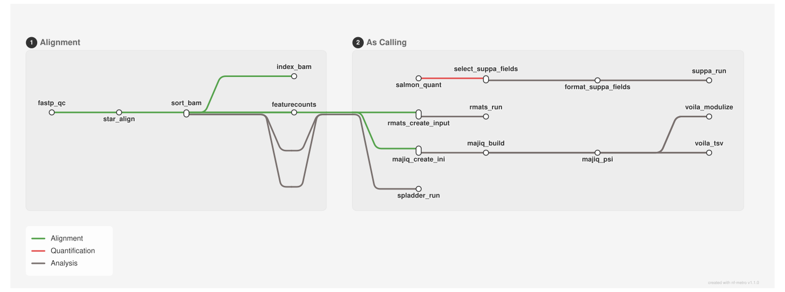

<div class="ox-crumb"><a href="/pipelines/">Pipelines</a> / <span>oxo-flow-tcasia</span></div>
<div class="ox-detail-cols">
<div>
<h1>Paired-end RNA-seq alignment and four-caller alternative-splicing analysis</h1>
<div class="ox-page-badges"><span class="ox-badge ox-badge--live">✔ Live-tested · full-line</span> <span class="ox-badge ox-badge--origin">⇄ Official port</span> <span class="ox-badge ox-badge--sn"><span class="dot"></span>snakemake port</span></div>
<p>Paired-end RNA-seq from FASTQ to per-sample alternative-splicing calls: reads are trimmed with fastp, aligned with two-pass STAR and counted per gene with featureCounts; each sample&#x27;s splicing is then quantified independently with four callers — rMATS, MAJIQ (with Voila export), SUPPA2 (via Salmon transcript quantification) and SplAdder. The alignment and AS-calling stages are one chained DAG (run one stage with -t alignment / -t as_calling).</p>
</div>
<div>
<div class="ox-glance">
<div class="ox-glance-title">At a glance</div>
<div class="ox-kv"><span class="k">Rating</span><span class="v live">✔ Live-tested · full-line</span></div>
<div class="ox-kv"><span class="k">Rules</span><span class="v">17</span></div>
<div class="ox-kv"><span class="k">Compute</span><span class="v">up to 10 threads per rule (STAR / rMATS)</span></div>
<div class="ox-kv"><span class="k">Engine</span><span class="v"><span class="ox-badge ox-badge--sn"><span class="dot"></span>snakemake port</span></span></div>
<div class="ox-kv"><span class="k">Origin</span><span class="v">⇄ Official port</span></div>
<div class="ox-kv"><span class="k">Domain</span><span class="v">transcriptomics</span></div>
<div class="ox-kv"><span class="k">Source</span><span class="v"><a href="https://github.com/OncoHarmony-Network/TCASIA_pipeline">OncoHarmony-Network/TCASIA_pipeline</a></span></div>
<div class="ox-kv"><span class="k">Pinned version</span><span class="v"><code>main@06564ff1</code></span></div>
<div class="ox-kv"><span class="k">Ported</span><span class="v">2026-08-15</span></div>
<div class="ox-kv"><span class="k">License</span><span class="v">Apache-2.0</span></div>
<div class="ox-kv"><span class="k">Cite</span><span class="v"><a href="https://doi.org/10.48546/workflowhub.workflow.2301.1"><code>10.48546/workflowhub.workflow.2301.1</code></a></span></div>
<p class="cmd">$ oxo-flow run main.oxoflow</p>
</div>
</div>
</div>

## Run it

```bash
oxo-flow run main.oxoflow
```

Needs raw FASTQs and reference data — see Requirements.

## Installation

**Engine.** oxo-flow >= 0.14.0

**Toolchain.** conda envs — pinned versions (fastp 0.23.4, STAR 2.7.7a, samtools 1.13/1.15, subread 2.0.1, salmon 1.10.3, suppa 2.3, rMATS 4.3.0, MAJIQ 2.5, SplAdder 3.1.1; conda-forge + bioconda)

**Requirements.**

- reference data (GRCh38 + GENCODE v34): STAR index (STAR 2.7.7a), annotation GTF + GFF3, Salmon transcript index, SUPPA2 events file, MAJIQ academic license
- paired-end reads at reads_dir/<sample>_1.fastq.gz / <sample>_2.fastq.gz for each sample in the [[sample_groups]] list
- compute: up to 10 threads per rule (STAR/rMATS), no memory limits set
- conda or mamba at runtime to create the pinned envs/*.yaml environments

```bash
# 1. install oxo-flow (release binary, recommended)
curl -fL -o oxo-flow.tar.gz https://github.com/Traitome/oxo-flow/releases/latest/download/oxo-flow-latest-x86_64-unknown-linux-gnu.tar.gz
tar xzf oxo-flow.tar.gz && sudo mv oxo-flow /usr/local/bin/
#    or, via conda (may lag behind releases):
#    conda install -c bioconda oxo-flow-cli
#    NOTE: bioconda currently ships 0.10.2, older than the >= 0.12.0
#    minimum of every catalog entry — prefer the release binary.

# 2. get this workflow (clones the repo, auto-discovers the workflow,
#    sanity-parses it with the engine)
oxo-flow pull gh:oxo-flow-community/oxo-flow-tcasia
#    (alternative: plain git clone)
#    git clone https://github.com/oxo-flow-community/oxo-flow-tcasia
```

## Parameters

<p class="ox-param-usage">Parameters are consumed by rules through <code>{config.key}</code> placeholders in inputs, outputs, and shells. Set a value in the workflow's <code>[config]</code> section (edit the file), or override at run time with <code>oxo-flow run -e key=value workflow.oxoflow</code> — repeat <code>-e</code> for multiple keys. The list below names the rules that read each key.</p>
<div class="ox-params">
<div class="ox-param">
<div class="ox-param-head"><code>align_out_dir</code><span class="ox-param-default">results/alignment</span></div>
<p class="ox-param-desc">01_alignment (upstream config.yml)</p>
<details class="ox-param-usedby"><summary>used by 5 rules</summary>
<div class="ox-param-rules"><code>alignment::fastp_qc</code> <code>alignment::featurecounts</code> <code>alignment::index_bam</code> <code>alignment::sort_bam</code> <code>alignment::star_align</code></div>
</details>
</div>
<div class="ox-param">
<div class="ox-param-head"><code>aligned_dir</code><span class="ox-param-default">results/alignment/aligned</span></div>
<p class="ox-param-desc">upstream: 01 output_dir/aligned == 02 bam_dir</p>
<details class="ox-param-usedby"><summary>used by 7 rules</summary>
<div class="ox-param-rules"><code>alignment::featurecounts</code> <code>alignment::index_bam</code> <code>alignment::sort_bam</code> <code>alignment::star_align</code> <code>as_calling::majiq_create_ini</code> <code>as_calling::rmats_create_input</code> <code>as_calling::spladder_run</code></div>
</details>
</div>
<div class="ox-param">
<div class="ox-param-head"><code>as_out_dir</code><span class="ox-param-default">results/as_calling</span></div>
<p class="ox-param-desc">02_as_calling (upstream config.yml)</p>
<details class="ox-param-usedby"><summary>used by 12 rules</summary>
<div class="ox-param-rules"><code>as_calling::format_suppa_fields</code> <code>as_calling::majiq_build</code> <code>as_calling::majiq_create_ini</code> <code>as_calling::majiq_psi</code> <code>as_calling::rmats_create_input</code> <code>as_calling::rmats_run</code> <code>as_calling::salmon_quant</code> <code>as_calling::select_suppa_fields</code> <code>as_calling::spladder_run</code> <code>as_calling::suppa_run</code> <code>as_calling::voila_modulize</code> <code>as_calling::voila_tsv</code></div>
</details>
</div>
<div class="ox-param">
<div class="ox-param-head"><code>fastp_min_length</code><span class="ox-param-default">36</span></div>
<p class="ox-param-desc">fastp (upstream fastp.*)</p>
<details class="ox-param-usedby"><summary>used by 1 rules</summary>
<div class="ox-param-rules"><code>alignment::fastp_qc</code></div>
</details>
</div>
<div class="ox-param">
<div class="ox-param-head"><code>fastp_n_base_limit</code><span class="ox-param-default">5</span></div>
<p class="ox-param-desc">fastp (upstream fastp.*)</p>
<details class="ox-param-usedby"><summary>used by 1 rules</summary>
<div class="ox-param-rules"><code>alignment::fastp_qc</code></div>
</details>
</div>
<div class="ox-param">
<div class="ox-param-head"><code>fastp_qualified_quality_phred</code><span class="ox-param-default">20</span></div>
<p class="ox-param-desc">fastp (upstream fastp.*)</p>
<details class="ox-param-usedby"><summary>used by 1 rules</summary>
<div class="ox-param-rules"><code>alignment::fastp_qc</code></div>
</details>
</div>
<div class="ox-param">
<div class="ox-param-head"><code>fastp_unqualified_percent_limit</code><span class="ox-param-default">40</span></div>
<p class="ox-param-desc">fastp (upstream fastp.*)</p>
<details class="ox-param-usedby"><summary>used by 1 rules</summary>
<div class="ox-param-rules"><code>alignment::fastp_qc</code></div>
</details>
</div>
<div class="ox-param">
<div class="ox-param-head"><code>gff</code><span class="ox-param-default">test/fixtures/reference/genes.gff3</span></div>
<p class="ox-param-desc">upstream: GFF (tiny synthetic)</p>
<details class="ox-param-usedby"><summary>used by 1 rules</summary>
<div class="ox-param-rules"><code>as_calling::majiq_build</code></div>
</details>
</div>
<div class="ox-param">
<div class="ox-param-head"><code>majiq_genome</code><span class="ox-param-default">hg38</span></div>
<p class="ox-param-desc">majiq tool parameter (upstream --majiq_genome) <span class="ox-param-inferred">inferred</span></p>
<details class="ox-param-usedby"><summary>used by 1 rules</summary>
<div class="ox-param-rules"><code>as_calling::majiq_create_ini</code></div>
</details>
</div>
<div class="ox-param">
<div class="ox-param-head"><code>majiq_license</code><span class="ox-param-default">test/fixtures/reference/majiq_license.lic</span></div>
<p class="ox-param-desc">MAJIQ requires the upstream academic license file — place it at<br>test/fixtures/reference/majiq_license.lic (obtain from MAJIQ) and set<br>run_majiq = true. Upstream fails hard without the license; the port<br>gates the whole MAJIQ chain on this flag instead (documented in the<br>README fidelity table).</p>
<details class="ox-param-usedby"><summary>used by 4 rules</summary>
<div class="ox-param-rules"><code>as_calling::majiq_build</code> <code>as_calling::majiq_psi</code> <code>as_calling::voila_modulize</code> <code>as_calling::voila_tsv</code></div>
</details>
</div>
<div class="ox-param">
<div class="ox-param-head"><code>majiq_minreads</code><span class="ox-param-default">10</span></div>
<p class="ox-param-desc">majiq tool parameter (upstream --majiq_minreads) <span class="ox-param-inferred">inferred</span></p>
<details class="ox-param-usedby"><summary>used by 1 rules</summary>
<div class="ox-param-rules"><code>as_calling::majiq_build</code></div>
</details>
</div>
<div class="ox-param">
<div class="ox-param-head"><code>majiq_strandness</code><span class="ox-param-default">reverse</span></div>
<p class="ox-param-desc">fr-firststrand -&gt; reverse | fr-secondstrand -&gt; forward | fr-unstranded -&gt; none</p>
<details class="ox-param-usedby"><summary>used by 1 rules</summary>
<div class="ox-param-rules"><code>as_calling::majiq_create_ini</code></div>
</details>
</div>
<div class="ox-param">
<div class="ox-param-head"><code>read_len</code><span class="ox-param-default">150</span></div>
<p class="ox-param-desc">salmon_index is auto-built below from the shipped transcripts.fa</p>
<details class="ox-param-usedby"><summary>used by 2 rules</summary>
<div class="ox-param-rules"><code>as_calling::majiq_create_ini</code> <code>as_calling::rmats_run</code></div>
</details>
</div>
<div class="ox-param">
<div class="ox-param-head"><code>reads_dir</code><span class="ox-param-default">test/fixtures/raw</span></div>
<p class="ox-param-desc">point at your own fastq directory for real runs</p>
<details class="ox-param-usedby"><summary>used by 2 rules</summary>
<div class="ox-param-rules"><code>alignment::fastp_qc</code> <code>as_calling::salmon_quant</code></div>
</details>
</div>
<div class="ox-param">
<div class="ox-param-head"><code>ref</code><span class="ox-param-default">test/fixtures/reference/genes.gtf</span></div>
<p class="ox-param-desc">featureCounts / rMATS / SplAdder annotation (tiny synthetic; GRCh38 GTF for real runs)</p>
<details class="ox-param-usedby"><summary>used by 3 rules</summary>
<div class="ox-param-rules"><code>alignment::featurecounts</code> <code>as_calling::rmats_run</code> <code>as_calling::spladder_run</code></div>
</details>
</div>
<div class="ox-param">
<div class="ox-param-head"><code>rmats_cstat</code><span class="ox-param-default">0.0001</span></div>
<p class="ox-param-desc">—</p>
<details class="ox-param-usedby"><summary>used by 1 rules</summary>
<div class="ox-param-rules"><code>as_calling::rmats_run</code></div>
</details>
</div>
<div class="ox-param">
<div class="ox-param-head"><code>rmats_extra</code><span class="ox-param-default"></span></div>
<p class="ox-param-desc">—</p>
<details class="ox-param-usedby"><summary>used by 1 rules</summary>
<div class="ox-param-rules"><code>as_calling::rmats_run</code></div>
</details>
</div>
<div class="ox-param">
<div class="ox-param-head"><code>run_majiq</code><span class="ox-param-default">false</span></div>
<p class="ox-param-desc">MAJIQ requires the upstream academic license file — place it at<br>test/fixtures/reference/majiq_license.lic (obtain from MAJIQ) and set<br>run_majiq = true. Upstream fails hard without the license; the port<br>gates the whole MAJIQ chain on this flag instead (documented in the<br>README fidelity table).</p>
<details class="ox-param-usedby"><summary>used by 5 rules</summary>
<div class="ox-param-rules"><code>as_calling::majiq_build</code> <code>as_calling::majiq_create_ini</code> <code>as_calling::majiq_psi</code> <code>as_calling::voila_modulize</code> <code>as_calling::voila_tsv</code></div>
</details>
</div>
<div class="ox-param">
<div class="ox-param-head"><code>salmon_index</code><span class="ox-param-default">test/fixtures/reference/salmon_index</span></div>
<p class="ox-param-desc">salmon_index is auto-built below from the shipped transcripts.fa</p>
<details class="ox-param-usedby"><summary>used by 1 rules</summary>
<div class="ox-param-rules"><code>as_calling::salmon_quant</code></div>
</details>
</div>
<div class="ox-param">
<div class="ox-param-head"><code>salmon_library_type</code><span class="ox-param-default">ISR</span></div>
<p class="ox-param-desc">Derived from <code>strandness</code> by upstream tcasia_config.py; kept explicit here:</p>
<details class="ox-param-usedby"><summary>used by 1 rules</summary>
<div class="ox-param-rules"><code>as_calling::salmon_quant</code></div>
</details>
</div>
<div class="ox-param">
<div class="ox-param-head"><code>spladder_confidence</code><span class="ox-param-default">3</span></div>
<p class="ox-param-desc">spladder tool parameter (upstream --spladder_confidence) <span class="ox-param-inferred">inferred</span></p>
<details class="ox-param-usedby"><summary>used by 1 rules</summary>
<div class="ox-param-rules"><code>as_calling::spladder_run</code></div>
</details>
</div>
<div class="ox-param">
<div class="ox-param-head"><code>spladder_event_types</code><span class="ox-param-default">exon_skip,intron_retention,alt_3prime,alt_5prime,mutex_exons</span></div>
<p class="ox-param-desc">spladder tool parameter (upstream --spladder_event_types) <span class="ox-param-inferred">inferred</span></p>
<details class="ox-param-usedby"><summary>used by 1 rules</summary>
<div class="ox-param-rules"><code>as_calling::spladder_run</code></div>
</details>
</div>
<div class="ox-param">
<div class="ox-param-head"><code>spladder_merge_strategy</code><span class="ox-param-default">single</span></div>
<p class="ox-param-desc">spladder tool parameter (upstream --spladder_merge_strategy) <span class="ox-param-inferred">inferred</span></p>
<details class="ox-param-usedby"><summary>used by 1 rules</summary>
<div class="ox-param-rules"><code>as_calling::spladder_run</code></div>
</details>
</div>
<div class="ox-param">
<div class="ox-param-head"><code>star_index_dir</code><span class="ox-param-default">test/fixtures/reference/STAR_index</span></div>
<p class="ox-param-desc">star_index_dir is auto-built below from test/fixtures/reference (tiny<br>synthetic genome) — point it at a real GRCh38 STAR index for real runs.</p>
<details class="ox-param-usedby"><summary>used by 1 rules</summary>
<div class="ox-param-rules"><code>alignment::star_align</code></div>
</details>
</div>
<div class="ox-param">
<div class="ox-param-head"><code>star_limit_bam_sort_ram</code><span class="ox-param-default">0</span></div>
<p class="ox-param-desc">0 = auto: the machine-effective memory (clamped declared value)</p>
<details class="ox-param-usedby"><summary>used by 1 rules</summary>
<div class="ox-param-rules"><code>alignment::star_align</code></div>
</details>
</div>
<div class="ox-param">
<div class="ox-param-head"><code>star_out_filter_mismatch_nmax</code><span class="ox-param-default">15</span></div>
<p class="ox-param-desc">STAR (upstream star.*)</p>
<details class="ox-param-usedby"><summary>used by 1 rules</summary>
<div class="ox-param-rules"><code>alignment::star_align</code></div>
</details>
</div>
<div class="ox-param">
<div class="ox-param-head"><code>strandness</code><span class="ox-param-default">fr-firststrand</span></div>
<p class="ox-param-desc">shared</p>
<details class="ox-param-usedby"><summary>used by 1 rules</summary>
<div class="ox-param-rules"><code>as_calling::rmats_run</code></div>
</details>
</div>
<div class="ox-param">
<div class="ox-param-head"><code>suppa2_events</code><span class="ox-param-default">test/fixtures/reference/events.ioe</span></div>
<p class="ox-param-desc">suppa2_events is auto-built below from the shipped GTF (SUPPA2 generateEvents)</p>
<details class="ox-param-usedby"><summary>used by 1 rules</summary>
<div class="ox-param-rules"><code>as_calling::suppa_run</code></div>
</details>
</div>
<div class="ox-param">
<div class="ox-param-head"><code>suppa2_min_tpm</code><span class="ox-param-default">1</span></div>
<p class="ox-param-desc">—</p>
<details class="ox-param-usedby"><summary>used by 1 rules</summary>
<div class="ox-param-rules"><code>as_calling::suppa_run</code></div>
</details>
</div>
</div>

Descriptions are the workflow's own `#` comments from its `[config]` section (and the `[config]` sections of its included modules), surfaced by `oxo-flow info` — no schema file to maintain.

## Workflow graph

<div class="ox-dag-card" markdown="1">



<p class="ox-dag-caption">figure · oxo-flow-tcasia — pipeline overview (nf-metro transit map)</p>

</div>

The graph is derived at catalog-build time from `oxo-flow graph -f metro` through the adaptive render ladder (`scripts/metro_tiers.py`): each workflow gets the finest metro tier that nf-metro renders while staying readable at site width — rule-level stations for smaller workflows, module-stage or module overview stations for dense ones. Colored transit lines group stations by analysis stage. Wildcard `{sample}` instances expand at run time when sample data is discovered (the runtime view is `oxo-flow graph --expanded`).

## Scope

The default-parameters main path of the source pipeline was ported rule-for-rule; alternate paths are documented as excluded.

**In scope**

- fastp_qc
- star_align
- sort_bam
- index_bam
- featurecounts
- salmon_quant
- select_suppa_fields
- format_suppa_fields
- suppa_run
- rmats_create_input
- rmats_run
- majiq_create_ini
- majiq_build
- majiq_psi
- voila_modulize
- voila_tsv
- spladder_run

**Excluded**

- none

## Fidelity

Scope: the **default-parameters main execution path** (upstream `rule all` of both Snakefiles). Rows cover every upstream rule; no "not ported" rows — the full default path is ported.

| Upstream rule | oxo-flow rule | Tool (version) | Notes |
|---|---|---|---|
| fastp_qc | `alignment::fastp_qc` | fastp 0.23.4 | identical command; input layout from `[[sample_groups]]` + `reads_dir` instead of samples.tsv |
| star_align | `alignment::star_align` | STAR 2.7.7a | identical command; `params.prefix` inlined; `--limitBAMsortRAM` differs — upstream hardcodes 39050942993 (~36 G), the port defaults `star_limit_bam_sort_ram = 0` → machine-effective memory |
| sort_bam | `alignment::sort_bam` | samtools 1.15 | same sort; `-@ {effective_threads}` + `-m 512M` cap added (upstream `-@ 8` with sort's default 768 MB/thread buffer over-allocated the live box) |
| index_bam | `alignment::index_bam` | samtools 1.15 | identical command |
| featurecounts | `alignment::featurecounts` | subread 2.0.1 | identical command; upstream runs without a strandness flag (oxo-flow preflight warns — upstream behavior kept) |
| salmon_quant | `as_calling::salmon_quant` | salmon 1.10.3 | identical command; `-l` from explicit `salmon_library_type` (upstream derives it from `strandness` in tcasia_config.py) |
| select_suppa_fields | `as_calling::select_suppa_fields` | suppa 2.3 | identical command |
| format_suppa_fields | `as_calling::format_suppa_fields` | suppa 2.3 | equivalent perl one-liner (anchored rewrite of the upstream regex; same output) |
| suppa_run | `as_calling::suppa_run` | suppa 2.3 | identical command; output prefix inlined |
| rmats_create_input | `as_calling::rmats_create_input` | rMATS 4.3.0 | identical command |
| rmats_run | `as_calling::rmats_run` | rMATS 4.3.0 | identical command; `--od` directory declared as the rule output |
| majiq_create_ini | `as_calling::majiq_create_ini` | MAJIQ 2.5 | identical printf; `bam_dir`/`bam_stem` params inlined |
| majiq_build | `as_calling::majiq_build` | MAJIQ 2.5 | identical command |
| majiq_psi | `as_calling::majiq_psi` | MAJIQ 2.5 | identical command |
| voila_modulize | `as_calling::voila_modulize` | MAJIQ 2.5 (Voila) | identical command; `modulized/` directory declared as the rule output |
| voila_tsv | `as_calling::voila_tsv` | MAJIQ 2.5 (Voila) | identical command |
| spladder_run | `as_calling::spladder_run` | SplAdder 3.1.1 | identical command; output directory declared as the rule output |
| rule all | — (DAG targets) | — | every output above is a default target of the single chained DAG |

**Port-level conventions** (config-shape deviations, commands unchanged):
- **Sample sheet**: upstream reads per-sample fastq paths from a TSV (`sample_id/fastq_1/fastq_2`); the port uses `[[sample_groups]]` plus the `reads_dir/{sample}_1.fastq.gz` / `{sample}_2.fastq.gz` layout.
- **One workflow file, one DAG**: the two upstream Snakefiles (+ the four `rules/snakefile_*` fragments) are `modules/alignment.oxoflow` + `modules/as_calling.oxoflow`, included from `main.oxoflow`; the two `config.yml` files merge into one `[config]`. Upstream `01 output_dir/aligned` and `02 bam_dir` are the single key `aligned_dir`, making the alignment → AS-calling chain structural. Run one stage only with `-t alignment` / `-t as_calling`.
- **Strandness-derived values are explicit config keys**: upstream computes `salmon_library_type` (`fr-firststrand→ISR`, `fr-secondstrand→ISF`, `fr-unstranded→IU`) and `majiq_strandness` (`fr-firststrand→reverse`, `fr-secondstrand→forward`, `fr-unstranded→none`) in `tcasia_config.py`; rMATS uses the `strandness` value directly (as upstream). Change `strandness` **and** the two derived keys together.
- **Helper scripts not ported**: `scripts/validate_config.py` and `scripts/read_length.sh` are user-facing helpers; oxo-flow validates config/inputs natively.
- **Threads only, no memory**: upstream declares threads per tool and no memory; the port mirrors that exactly.
- **STAR BAM-sort RAM is machine-sized by default**: upstream hardcodes `--limitBAMsortRAM 39050942993` (~36 GB); the port adds `star_limit_bam_sort_ram` (default `0` = auto) and sizes the limit from `{effective_memory_mb}`, so STAR adapts to small boxes; set it to a byte count to pin an exact value.
- **samtools sort buffer cap**: `sort_bam` runs `samtools sort -@ {effective_threads} -m 512M` instead of upstream's plain `-@ 8` — sort's default 768 MB/thread buffer over-allocated the live box.
- **SUPPA2 field formatting regex**: `format_suppa_fields` applies the same transformation as the upstream one-liner with an anchored regex (`s/^\|.*?\|\t//` instead of upstream's capture-and-delete); output is identical for the quant.sf-derived input shape.
- **MAJIQ is license-gated**: upstream runs the 5-rule MAJIQ chain unconditionally and fails hard without the academic license file. The port gates the chain on `run_majiq` (default `false`): a fresh clone completes with rMATS + SUPPA2 + SplAdder; set `run_majiq = true` after placing the license at `majiq_license` (commands unchanged when enabled).
- **MAJIQ env fixes**: upstream's own `pip majiq==2.5` installs from no index (PyPI/bioconda both lack majiq) — the port installs OncoHarmony-Network/majiq_academic@v2.5 (the TCASIA org's fork), with numpy=1.26 (the fork's Cython extensions break on numpy 2.x ABI) and setuptools=75.8.2 (voila's gunicorn imports pkg_resources, removed in setuptools 81+).

## Links

- Repository: [oxo-flow-tcasia](https://github.com/oxo-flow-community/oxo-flow-tcasia)
- Upstream: [OncoHarmony-Network/TCASIA_pipeline](https://github.com/OncoHarmony-Network/TCASIA_pipeline) @ `main@06564ff1`
- License: Apache-2.0 (this workflow) · MIT (upstream)

Created on 2026-08-15 — this port may lag behind upstream releases. See the repository's NOTICE for full attribution.
