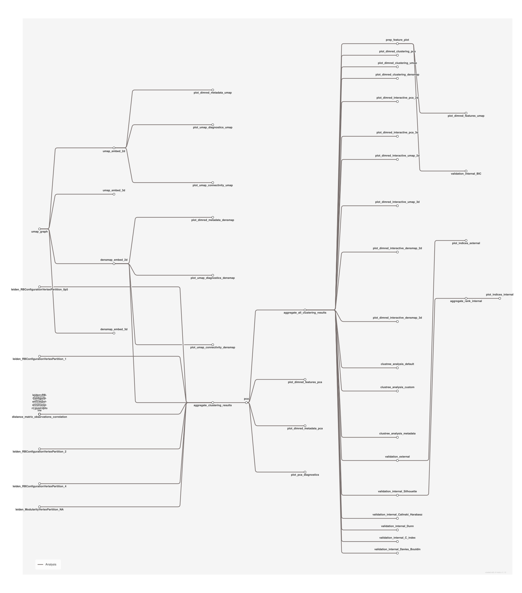

# Unsupervised analysis of omics matrices: PCA, UMAP, clustering and validation

<div class="ox-page-badges"><span class="ox-badge ox-badge--live">✔ Live-tested · default-path</span> <span class="ox-badge ox-badge--origin">⇄ Official port</span> <span class="ox-badge ox-badge--sn"><span class="dot"></span>snakemake port</span></div>

Unsupervised analysis of omics matrices: PCA, UMAP and densMAP embeddings (2D/3D), distance matrices, hierarchical clustering heatmaps, Leiden clustering across partition types and resolutions, clustree analysis, external and internal cluster validation with TOPSIS ranking, and static and interactive visualizations. A verified port of the default-parameter path of epigen/unsupervised_analysis v4.0.2 (Snakemake); all 52 rules and tool versions are pinned to the upstream release.

| | |
|---:|---|
| **Rating** | ✔ Live-tested |
| **Origin** | port |
| **Domain** | other |
| **Rules** | 52 |
| **Compute** | up to 2 CPUs / 32 GB per rule |
| **Tools** | igraph · leidenalg · scikit-learn · python · pandas · scipy · numpy · pynndescent · numba · dask · scikit-image · umap-learn · matplotlib-base · bokeh · datashader · holoviews · colorcet · r-ggplot2 · r-patchwork · r-ggally · r-ggrepel · r-reshape2 · r-stringi · r-data.table · plotly · plotly_express · seaborn-base · bioconductor-complexheatmap · r-rcolorbrewer · r-fastcluster · r-magick · r-clustree · r-clustercrit · pymcdm |
| **Ported** | 2026-08-15 |
| **License** | Apache-2.0 |
| **Source** | [epigen/unsupervised_analysis](https://github.com/epigen/unsupervised_analysis) |
| **Pinned version** | `v4.0.2` |

## Run it

```bash
oxo-flow run main.oxoflow
```

Real sklearn `digits` data is committed under `test/fixtures/` — fully runnable out of the box.

## Installation

**Engine.** oxo-flow >= 0.12.0

**Toolchain.** conda envs — pinned versions (7 environments under envs/, created by conda/mamba)

**Requirements.**
- per-sample omics matrix CSV and optional labels CSV ({config.data_dir}/{sample}_data.csv / _labels.csv), registered in config/annotation.csv; no reference genomes or index files needed (default fixtures: sklearn digits, 1797 samples x 64 features)
- compute: up to 2 CPUs / 32 GB RAM per rule (defaults threads=2, mem_mb=32000; 7 plotting rules use 8 GB)
- conda or mamba installed to build the 7 pinned environments on first run

```bash
# 1. install oxo-flow (release binary, recommended)
curl -fL -o oxo-flow.tar.gz https://github.com/Traitome/oxo-flow/releases/latest/download/oxo-flow-latest-x86_64-unknown-linux-gnu.tar.gz
tar xzf oxo-flow.tar.gz && sudo mv oxo-flow /usr/local/bin/
#    or, via conda (may lag behind releases):
#    conda install -c bioconda oxo-flow-cli
#    NOTE: bioconda currently ships 0.10.2, older than the >= 0.12.0
#    minimum of every catalog entry — prefer the release binary.

# 2. get this workflow (clones the repo, auto-discovers the workflow,
#    sanity-parses it with the engine)
oxo-flow pull gh:oxo-flow-community/oxo-flow-unsupervised
#    (alternative: plain git clone)
#    git clone https://github.com/oxo-flow-community/oxo-flow-unsupervised
```

## Parameters

| Parameter | Default | Description | Used by |
|---:|---|---|---|
| `clustree_categorical_label_option` | `majority` | — | `clustree_analysis_custom`, `clustree_analysis_default`, `clustree_analysis_metadata` |
| `clustree_count_filter` | `0` | CLUSTREE | `clustree_analysis_custom`, `clustree_analysis_default`, `clustree_analysis_metadata` |
| `clustree_layout` | `tree` | — | `clustree_analysis_custom`, `clustree_analysis_default`, `clustree_analysis_metadata` |
| `clustree_numerical_aggregation_option` | `mean` | — | `clustree_analysis_custom`, `clustree_analysis_default`, `clustree_analysis_metadata` |
| `clustree_prop_filter` | `0.1` | — | `clustree_analysis_custom`, `clustree_analysis_default`, `clustree_analysis_metadata` |
| `coord_fixed` | `0` | VISUALIZATION | `plot_dimred_clustering_densmap`, `plot_dimred_clustering_pca`, `plot_dimred_clustering_umap`, `plot_dimred_metadata_densmap`, `plot_dimred_metadata_pca`, `plot_dimred_metadata_umap` |
| `data_dir` | `test/fixtures` | — | `aggregate_clustering_results`, `clustree_analysis_custom`, `clustree_analysis_default`, `clustree_analysis_metadata`, `densmap_embed_2d`, `densmap_embed_3d`, `distance_matrix_features_correlation`, `distance_matrix_features_cosine`, `distance_matrix_observations_correlation`, `distance_matrix_observations_cosine`, `leiden_ModularityVertexPartition_NA`, `leiden_RBConfigurationVertexPartition_0p5`, `leiden_RBConfigurationVertexPartition_1`, `leiden_RBConfigurationVertexPartition_1p5`, `leiden_RBConfigurationVertexPartition_2`, `leiden_RBConfigurationVertexPartition_4`, `pca`, `plot_dimred_interactive_densmap_2d`, `plot_dimred_interactive_densmap_3d`, `plot_dimred_interactive_pca_2d`, `plot_dimred_interactive_pca_3d`, `plot_dimred_interactive_umap_2d`, `plot_dimred_interactive_umap_3d`, `plot_dimred_metadata_densmap`, `plot_dimred_metadata_pca`, `plot_dimred_metadata_umap`, `plot_heatmap_correlation`, `plot_heatmap_cosine`, `plot_pca_diagnostics`, `prep_feature_plot`, `umap_embed_2d`, `umap_embed_3d`, `umap_graph`, `validation_external`, `validation_internal_BIC`, `validation_internal_C_index`, `validation_internal_Calinski_Harabasz`, `validation_internal_Davies_Bouldin`, `validation_internal_Dunn`, `validation_internal_Silhouette` |
| `features_to_plot` | `` | — | `prep_feature_plot` |
| `heatmap_hclust_method` | `complete` | HEATMAP (upstream heatmap: metrics [correlation, cosine] -> 2 rules) | `plot_heatmap_correlation`, `plot_heatmap_cosine` |
| `heatmap_n_features` | `0.5` | — | `distance_matrix_features_correlation`, `distance_matrix_features_cosine`, `distance_matrix_observations_correlation`, `distance_matrix_observations_cosine` |
| `heatmap_n_observations` | `1` | — | `distance_matrix_features_correlation`, `distance_matrix_features_cosine`, `distance_matrix_observations_correlation`, `distance_matrix_observations_cosine` |
| `leiden_metric` | `euclidean` | LEIDEN (upstream leiden: metric euclidean / n_neighbors 15 -> 6 rules) | `leiden_ModularityVertexPartition_NA`, `leiden_RBConfigurationVertexPartition_0p5`, `leiden_RBConfigurationVertexPartition_1`, `leiden_RBConfigurationVertexPartition_1p5`, `leiden_RBConfigurationVertexPartition_2`, `leiden_RBConfigurationVertexPartition_4` |
| `leiden_n_iterations` | `2` | — | `leiden_ModularityVertexPartition_NA`, `leiden_RBConfigurationVertexPartition_0p5`, `leiden_RBConfigurationVertexPartition_1`, `leiden_RBConfigurationVertexPartition_1p5`, `leiden_RBConfigurationVertexPartition_2`, `leiden_RBConfigurationVertexPartition_4` |
| `leiden_n_neighbors` | `15` | — | `leiden_ModularityVertexPartition_NA`, `leiden_RBConfigurationVertexPartition_0p5`, `leiden_RBConfigurationVertexPartition_1`, `leiden_RBConfigurationVertexPartition_1p5`, `leiden_RBConfigurationVertexPartition_2`, `leiden_RBConfigurationVertexPartition_4` |
| `mem_mb` | `32000` | — | — |
| `metadata_of_interest` | `'target'` | METADATA | `clustree_analysis_custom`, `clustree_analysis_default`, `clustree_analysis_metadata`, `plot_heatmap_correlation`, `plot_heatmap_cosine`, `plot_pca_diagnostics`, `validation_internal_BIC`, `validation_internal_C_index`, `validation_internal_Calinski_Harabasz`, `validation_internal_Davies_Bouldin`, `validation_internal_Dunn`, `validation_internal_Silhouette` |
| `pca_n_components` | `0.9` | — | `pca`, `plot_dimred_clustering_pca`, `plot_dimred_interactive_pca_2d`, `plot_dimred_interactive_pca_3d`, `plot_dimred_metadata_pca`, `plot_pca_diagnostics`, `validation_internal_BIC`, `validation_internal_C_index`, `validation_internal_Calinski_Harabasz`, `validation_internal_Davies_Bouldin`, `validation_internal_Dunn`, `validation_internal_Silhouette` |
| `pca_svd_solver` | `auto` | PCA (upstream pca: svd_solver, n_components) | `pca`, `plot_dimred_clustering_pca`, `plot_dimred_interactive_pca_2d`, `plot_dimred_interactive_pca_3d`, `plot_dimred_metadata_pca`, `plot_pca_diagnostics`, `validation_internal_BIC`, `validation_internal_C_index`, `validation_internal_Calinski_Harabasz`, `validation_internal_Davies_Bouldin`, `validation_internal_Dunn`, `validation_internal_Silhouette` |
| `project_name` | `digits` | GENERAL | `annot_export` |
| `result_path` | `results` | — | `aggregate_all_clustering_results`, `aggregate_clustering_results`, `aggregate_rank_internal`, `annot_export`, `clustree_analysis_custom`, `clustree_analysis_default`, `clustree_analysis_metadata`, `densmap_embed_2d`, `densmap_embed_3d`, `distance_matrix_features_correlation`, `distance_matrix_features_cosine`, `distance_matrix_observations_correlation`, `distance_matrix_observations_cosine`, `leiden_ModularityVertexPartition_NA`, `leiden_RBConfigurationVertexPartition_0p5`, `leiden_RBConfigurationVertexPartition_1`, `leiden_RBConfigurationVertexPartition_1p5`, `leiden_RBConfigurationVertexPartition_2`, `leiden_RBConfigurationVertexPartition_4`, `pca`, `plot_dimred_clustering_densmap`, `plot_dimred_clustering_pca`, `plot_dimred_clustering_umap`, `plot_dimred_interactive_densmap_2d`, `plot_dimred_interactive_densmap_3d`, `plot_dimred_interactive_pca_2d`, `plot_dimred_interactive_pca_3d`, `plot_dimred_interactive_umap_2d`, `plot_dimred_interactive_umap_3d`, `plot_dimred_metadata_densmap`, `plot_dimred_metadata_pca`, `plot_dimred_metadata_umap`, `plot_heatmap_correlation`, `plot_heatmap_cosine`, `plot_indices_external`, `plot_indices_internal`, `plot_pca_diagnostics`, `plot_umap_connectivity_densmap`, `plot_umap_connectivity_umap`, `plot_umap_diagnostics_densmap`, `plot_umap_diagnostics_umap`, `prep_feature_plot`, `umap_embed_2d`, `umap_embed_3d`, `umap_graph`, `validation_external`, `validation_internal_BIC`, `validation_internal_C_index`, `validation_internal_Calinski_Harabasz`, `validation_internal_Davies_Bouldin`, `validation_internal_Dunn`, `validation_internal_Silhouette` |
| `sample_proportion` | `1` | CLUSTER VALIDATION | `validation_internal_BIC`, `validation_internal_C_index`, `validation_internal_Calinski_Harabasz`, `validation_internal_Davies_Bouldin`, `validation_internal_Dunn`, `validation_internal_Silhouette` |
| `scatterplot2d_alpha` | `1` | — | `plot_dimred_clustering_densmap`, `plot_dimred_clustering_pca`, `plot_dimred_clustering_umap`, `plot_dimred_interactive_densmap_2d`, `plot_dimred_interactive_densmap_3d`, `plot_dimred_interactive_pca_2d`, `plot_dimred_interactive_pca_3d`, `plot_dimred_interactive_umap_2d`, `plot_dimred_interactive_umap_3d`, `plot_dimred_metadata_densmap`, `plot_dimred_metadata_pca`, `plot_dimred_metadata_umap`, `plot_pca_diagnostics` |
| `scatterplot2d_size` | `1` | — | `plot_dimred_clustering_densmap`, `plot_dimred_clustering_pca`, `plot_dimred_clustering_umap`, `plot_dimred_interactive_densmap_2d`, `plot_dimred_interactive_densmap_3d`, `plot_dimred_interactive_pca_2d`, `plot_dimred_interactive_pca_3d`, `plot_dimred_interactive_umap_2d`, `plot_dimred_interactive_umap_3d`, `plot_dimred_metadata_densmap`, `plot_dimred_metadata_pca`, `plot_dimred_metadata_umap`, `plot_pca_diagnostics` |
| `threads` | `2` | RESOURCES (upstream config: mem/threads) | — |
| `umap_connectivity` | `1` | — | — |
| `umap_densmap` | `1` | — | — |
| `umap_diagnostics` | `1` | — | — |
| `umap_metric` | `euclidean` | UMAP & densMAP (upstream umap: single default metric/neighbors/min_dist) | `densmap_embed_2d`, `densmap_embed_3d`, `plot_dimred_clustering_densmap`, `plot_dimred_clustering_umap`, `plot_dimred_interactive_densmap_2d`, `plot_dimred_interactive_densmap_3d`, `plot_dimred_interactive_umap_2d`, `plot_dimred_interactive_umap_3d`, `plot_dimred_metadata_densmap`, `plot_dimred_metadata_umap`, `plot_umap_connectivity_densmap`, `plot_umap_connectivity_umap`, `plot_umap_diagnostics_densmap`, `plot_umap_diagnostics_umap`, `umap_embed_2d`, `umap_embed_3d`, `umap_graph` |
| `umap_min_dist` | `0.1` | — | `densmap_embed_2d`, `densmap_embed_3d`, `plot_dimred_clustering_densmap`, `plot_dimred_clustering_umap`, `plot_dimred_interactive_densmap_2d`, `plot_dimred_interactive_densmap_3d`, `plot_dimred_interactive_umap_2d`, `plot_dimred_interactive_umap_3d`, `plot_dimred_metadata_densmap`, `plot_dimred_metadata_umap`, `plot_umap_connectivity_densmap`, `plot_umap_connectivity_umap`, `plot_umap_diagnostics_densmap`, `plot_umap_diagnostics_umap`, `umap_embed_2d`, `umap_embed_3d` |
| `umap_n_neighbors` | `15` | — | `densmap_embed_2d`, `densmap_embed_3d`, `plot_dimred_clustering_densmap`, `plot_dimred_clustering_umap`, `plot_dimred_interactive_densmap_2d`, `plot_dimred_interactive_densmap_3d`, `plot_dimred_interactive_umap_2d`, `plot_dimred_interactive_umap_3d`, `plot_dimred_metadata_densmap`, `plot_dimred_metadata_umap`, `plot_umap_connectivity_densmap`, `plot_umap_connectivity_umap`, `plot_umap_diagnostics_densmap`, `plot_umap_diagnostics_umap`, `umap_embed_2d`, `umap_embed_3d`, `umap_graph` |

Descriptions are the workflow's own `#` comments from its `[config]` section, surfaced by `oxo-flow info` — no schema file to maintain.

## Workflow graph

<div class="ox-dag-card" markdown="1">



</div>

The graph is derived at catalog-build time from `oxo-flow graph -f dot` and rendered with Graphviz. It shows the workflow at rule level: wildcard `{sample}` instances expand at run time when sample data is discovered (the runtime view is `oxo-flow graph --expanded`).

## Scope

The default-parameters main path of the source pipeline was ported rule-for-rule; alternate paths are documented as excluded.

**In scope**

- pca
- umap_graph
- umap_embed_2d
- umap_embed_3d
- densmap_embed_2d
- densmap_embed_3d
- distance_matrix_observations_correlation
- distance_matrix_observations_cosine
- distance_matrix_features_correlation
- distance_matrix_features_cosine
- prep_feature_plot
- leiden_RBConfigurationVertexPartition_0p5
- leiden_RBConfigurationVertexPartition_1
- leiden_RBConfigurationVertexPartition_1p5
- leiden_RBConfigurationVertexPartition_2
- leiden_RBConfigurationVertexPartition_4
- leiden_ModularityVertexPartition_NA
- aggregate_clustering_results
- aggregate_all_clustering_results
- plot_dimred_metadata_pca
- plot_dimred_metadata_umap
- plot_dimred_metadata_densmap
- plot_dimred_clustering_pca
- plot_dimred_clustering_umap
- plot_dimred_clustering_densmap
- plot_pca_diagnostics
- plot_umap_diagnostics_umap
- plot_umap_diagnostics_densmap
- plot_umap_connectivity_umap
- plot_umap_connectivity_densmap
- plot_dimred_interactive_pca_2d
- plot_dimred_interactive_pca_3d
- plot_dimred_interactive_umap_2d
- plot_dimred_interactive_umap_3d
- plot_dimred_interactive_densmap_2d
- plot_dimred_interactive_densmap_3d
- plot_heatmap_correlation
- plot_heatmap_cosine
- clustree_analysis_default
- clustree_analysis_custom
- clustree_analysis_metadata
- validation_external
- validation_internal_Silhouette
- validation_internal_Calinski_Harabasz
- validation_internal_Dunn
- validation_internal_C_index
- validation_internal_Davies_Bouldin
- validation_internal_BIC
- aggregate_rank_internal
- plot_indices_external
- plot_indices_internal
- annot_export

**Excluded**

- env_export (7 rules) — runs `conda env export` inside the rule and requires a runtime conda installation; oxo-flow rules execute in one pinned environment, so the exported result would be the host environment, not the analysis environment. The exact pins are committed under envs/ instead.
- config_export — dumps the in-memory Snakemake config object via a run: block; the equivalent oxo-flow [config] is documented in main.oxoflow and this README.
- plot_dimred_features — upstream default config `features_to_plot: []` means the rule has no output on the default path (fan-out over a per-feature wildcard); skipped with the upstream default.
- report/ generation — Snakemake `report(...)` wrapper metadata (captions, categories, labels) has no oxo-flow counterpart; rule outputs are identical, only the report book is not produced.

## Fidelity

Upstream rules and how each is ported (52 ported rules; every analysis step
of the default-parameter path is executed, none are stubbed):

| Upstream rule | Port | Notes |
|---|---|---|
| `pca` | `pca` | same script; snakemake object replaced by CLI args |
| `umap_graph` | `umap_graph` | knn-graph for the default metric/neighbors |
| `umap_embed` | `umap_embed_2d`, `umap_embed_3d` | parameter-list fan-out (n_components 2/3) becomes explicit rules |
| `densmap_embed` | `densmap_embed_2d`, `densmap_embed_3d` | same fan-out |
| `distance_matrix` | `distance_matrix_{observations,features}_{correlation,cosine}` (4) | wildcard fan-out ({type} x {metric}) becomes explicit rules |
| `prep_feature_plot` | `prep_feature_plot` | runs always (upstream always computes it) |
| `leiden_cluster` | `leiden_RBConfigurationVertexPartition_{0.5,1,1.5,2,4}`, `leiden_ModularityVertexPartition_NA` (6) | partition_types x resolutions fan-out becomes explicit rules; graph always taken from the precomputed UMAP knn-graph |
| `aggregate_clustering_results` | `aggregate_clustering_results` | upstream `run:` block ported to `scripts/aggregate_clustering.py` (input[0] metadata unused upstream, mirrored) |
| `aggregate_all_clustering_results` | `aggregate_all_clustering_results` | `run:` block ported to `scripts/aggregate_all_clustering.py` |
| `plot_dimred_metadata` | `plot_dimred_metadata_{pca,umap,densmap}` (3) | method fan-out; 2D only (upstream default n_components 2) |
| `plot_dimred_clustering` | `plot_dimred_clustering_{pca,umap,densmap}` (3) | same |
| `plot_pca_diagnostics` | `plot_pca_diagnostics` | variance/pairs/loadings/lollipop PNGs, mem 8000M |
| `plot_umap_diagnostics` | `plot_umap_diagnostics_{umap,densmap}` (2) | mem 32000M (upstream) |
| `plot_umap_connectivity` | `plot_umap_connectivity_{umap,densmap}` (2) | mem 16000M (upstream) |
| `plot_dimred_interactive` | `plot_dimred_interactive_{pca,umap,densmap}_{2d,3d}` (6) | n_components fan-out; mem 8000M |
| `plot_heatmap` | `plot_heatmap_{correlation,cosine}` (2) | metric fan-out; hclust method from default list |
| `clustree_analysis` | `clustree_analysis_default`, `clustree_analysis_custom` (2) | content fan-out |
| `clustree_analysis_metadata` | `clustree_analysis_metadata` | directory output of per-metadata PNGs |
| `validation_external` | `validation_external` | all 6 indices (AMI, ARI, FMI, Homogeneity, Completeness, V) in one rule, 6 outputs |
| `validation_internal` | `validation_internal_{Silhouette,Calinski_Harabasz,Dunn,C_index,Davies_Bouldin,BIC}` (6) | index fan-out; mem 2x (upstream) |
| `aggregate_rank_internal` | `aggregate_rank_internal` | TOPSIS ranking of the 6 internal indices |
| `plot_indices` | `plot_indices_external`, `plot_indices_internal` (2) | type fan-out; external = 6 heatmaps, internal = 1 ranked heatmap |
| `annot_export` | `annot_export` | `cp {input} {output}` |
| `env_export` (7) | **not ported** | requires runtime `conda env export`; the pinned envs are committed under `envs/` instead (see README) |
| `config_export` | **not ported** | dumps the in-memory Snakemake config; `[config]` in `main.oxoflow` documents the same values |
| `plot_dimred_features` | **not ported** | upstream default `features_to_plot: []` produces no output on the default path |
| `report/` generation | **not ported** | Snakemake report metadata has no oxo-flow counterpart |

### Porting notes and deviations

1. **Annotation mapping**: the upstream annotation CSV's `data`/`metadata`
   columns become `{config.data_dir}/{sample}_data.csv` and
   `{config.data_dir}/{sample}_labels.csv`; `samples_by_features` is a global
   config key (upstream reads it per sample).
2. **Parameter-list fan-out**: upstream wildcards over parameter lists
   (UMAP/densMAP n_components, distance-matrix metric/type, Leiden
   partition_type/resolution, heatmap metric, clustree content, internal
   index) have no oxo-flow engine equivalent, so each default combination is
   an explicit rule whose name and paths embed the combination. Changing a
   listed parameter (e.g. adding a UMAP metric) requires adding rules.
3. **Snakemake runtime object**: all scripts read their inputs/outputs/params
   as CLI arguments instead of the `snakemake` global; the analysis code is
   unchanged. R scripts share `scripts/args.R` for `--flag value` parsing.
4. **Aggregation rules**: upstream `run:` blocks were ported to Python
   scripts with identical logic.
5. **Memory/threads**: upstream `mem: 32000` / `threads: 2` defaults become
   `[defaults]`; per-rule overrides match upstream (pca diagnostics and
   interactive plots 8000M, internal validation 2x).
6. **Environment**: each rule pins the same conda environment as upstream
   (7 environments, copied verbatim from `workflow/envs/`).

## Links

- Repository: [oxo-flow-unsupervised](https://github.com/oxo-flow-community/oxo-flow-unsupervised)
- Upstream: [epigen/unsupervised_analysis](https://github.com/epigen/unsupervised_analysis) @ `v4.0.2`
- License: Apache-2.0 (this workflow) · MIT (upstream)

Created on 2026-08-15 — this port may lag behind upstream releases. See the repository's NOTICE for full attribution.
