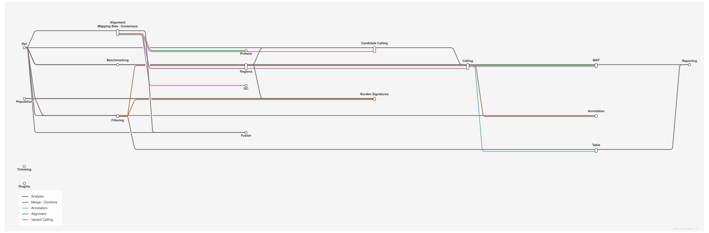

<div class="ox-crumb"><a href="/pipelines/">Pipelines</a> / <span>oxo-flow-varlociraptor</span></div>
<div class="ox-detail-cols">
<div>
<h1>Small and structural variant calling with Varlociraptor</h1>
<div class="ox-page-badges"><span class="ox-badge ox-badge--live">✔ Live-tested</span> <span class="ox-badge ox-badge--origin">⇄ Official port</span> <span class="ox-badge ox-badge--sn"><span class="dot"></span>snakemake port</span></div>
<p>Scenario-driven somatic small and structural variant calling with Varlociraptor: paired-end reads are aligned against the 1000 Genomes human pangenome with vg giraffe, QC&#x27;d with FastQC/MultiQC, covered with mosdepth, and used for freebayes and delly candidate calling; Varlociraptor then estimates alignment properties and calls variants under a tumor scenario (events present + somatic_tumor_high + somatic_tumor_medium, FDR 0.05), FDR is controlled per variant type (SNV/INS/DEL/MNV/BND/INV/DUP/REP) with merge and phred decoding, and the calls are annotated with VEP (LoFtool/REVEL plugins) and dbSNFP/dbSNP, filtered, turned into a 34-column variant table with oncoprint label-sorting, and rendered as interactive datavzrd variant and gene-coverage reports. All reference data (GRCh38 FASTA and GTF, VEP cache/plugins, REVEL scores, known-variants VCFs, HPRC pangenome graph) is downloaded automatically into resources/.</p>
</div>
<div>
<div class="ox-glance">
<div class="ox-glance-title">At a glance</div>
<div class="ox-kv"><span class="k">Rating</span><span class="v live">✔ Live-tested</span></div>
<div class="ox-kv"><span class="k">Rules</span><span class="v">159</span></div>
<div class="ox-kv"><span class="k">Compute</span><span class="v">up to 64 CPUs / 32 GB per rule (freebayes candidates 48 threads; vg giraffe 64 threads)</span></div>
<div class="ox-kv"><span class="k">Engine</span><span class="v"><span class="ox-badge ox-badge--sn"><span class="dot"></span>snakemake port</span></span></div>
<div class="ox-kv"><span class="k">Origin</span><span class="v">⇄ Official port</span></div>
<div class="ox-kv"><span class="k">Domain</span><span class="v">genomics</span></div>
<div class="ox-kv"><span class="k">Source</span><span class="v"><a href="https://github.com/snakemake-workflows/dna-seq-varlociraptor">snakemake-workflows/dna-seq-varlociraptor</a></span></div>
<div class="ox-kv"><span class="k">Pinned version</span><span class="v"><code>v6.10.0</code></span></div>
<div class="ox-kv"><span class="k">Ported</span><span class="v">2026-08-15</span></div>
<div class="ox-kv"><span class="k">License</span><span class="v">Apache-2.0</span></div>
<p class="cmd">$ oxo-flow run main.oxoflow</p>
</div>
</div>
</div>

## Run it

```bash
oxo-flow run main.oxoflow
```

Needs reference data — see Requirements; preview with `oxo-flow dry-run main.oxoflow --samples first:1`.

## Installation

**Engine.** oxo-flow >= 0.12.0

**Toolchain.** conda envs — pinned versions (no containers)

**Requirements.**

- paired-end FASTQ reads at reads_dir/<sample>_1.fastq.gz / _2.fastq.gz; sample cohort declared in [[sample_groups]] (one group = one tumor sample); fixtures bundled for dry-run
- reference data: downloaded automatically into resources/ — GRCh38 primary assembly FASTA (Ensembl release 111) + .fai/.dict, Ensembl release 111 GTF, VEP cache and plugins (release 111), REVEL scores, Ensembl known-variants VCFs, HPRC v1.1 human pangenome graph
- compute: up to 64 CPUs / 32 GB per rule (freebayes candidates 48 threads — upstream 96, scaled; vg giraffe 64 threads; samtools sort 16 threads/32G; Varlociraptor call 8G; consensus/bam-name sorting 16 threads/64G when the gated branches are on)
- tools: conda envs with pinned versions (envs/*.yaml, one env per tool pin set); conda/mamba required at runtime
- disk: multi-GB reference downloads under resources/ (pangenome graph, VEP cache, known-variants VCFs) plus results/ for BAMs, BCFs, tables and reports

```bash
# 1. install oxo-flow (release binary, recommended)
curl -fL -o oxo-flow.tar.gz https://github.com/Traitome/oxo-flow/releases/latest/download/oxo-flow-latest-x86_64-unknown-linux-gnu.tar.gz
tar xzf oxo-flow.tar.gz && sudo mv oxo-flow /usr/local/bin/
#    or, via conda (may lag behind releases):
#    conda install -c bioconda oxo-flow-cli
#    NOTE: bioconda currently ships 0.10.2, older than the >= 0.12.0
#    minimum of every catalog entry — prefer the release binary.

# 2. get this workflow (clones the repo, auto-discovers the workflow,
#    sanity-parses it with the engine)
oxo-flow pull gh:oxo-flow-community/oxo-flow-varlociraptor
#    (alternative: plain git clone)
#    git clone https://github.com/oxo-flow-community/oxo-flow-varlociraptor
```

## Parameters

| Parameter | Default | Description | Used by |
|---:|---|---|---|
| `benchmarking_activate` | `false` | upstream config: benchmarking (Snakefile rule benchmark / benchmarking.smk; the CHM1 sample and chm-eval-kit downloads are excluded, see module header). | `benchmarking::chromosome_map`, `benchmarking::gather_benchmark_calls`, `benchmarking::rename_chromosomes` |
| `bwa_align_activate` | `false` | upstream config: linear-reference (bwa) aligner branch of mapping.smk (map_reads_bwa + ref.smk bwa_index). The default path aligns with vg giraffe to the pangenome (ref/pangenome/activate = true upstream). | `mapping_bwa::bwa_index`, `mapping_bwa::map_reads_bwa` |
| `cadd_build` | `GRCh38` | — | `plugins::download_cadd_scores_for_vep` |
| `cadd_variant_type` | `snv` | — | `plugins::download_cadd_scores_for_vep` |
| `cadd_version` | `v1.7` | — | `plugins::download_cadd_scores_for_vep` |
| `fusion_activate` | `false` | upstream config: fusion calling branch (fusion_calling.smk star_arriba meta wrapper: star_index / star_align / arriba / annotate_exons / convert_fusions / sort_arriba_calls / bcftools_concat_candidates). | `fusion::annotate_exons`, `fusion::arriba`, `fusion::bcf_index_arriba`, `fusion::bcftools_concat_candidates`, `fusion::convert_fusions`, `fusion::sort_arriba_calls`, `fusion::star_align`, `fusion::star_index` |
| `maf_activate` | `false` | upstream config: maf/activate (group_bcf_to_vcf + group_vcf_to_maf). | `maf::group_bcf_to_vcf_fusions`, `maf::group_bcf_to_vcf_variants`, `maf::group_vcf_to_maf_fusions`, `maf::group_vcf_to_maf_variants` |
| `mutational_burden_activate` | `false` | upstream config: mutational_burden/activate + events (calculate_covered_coding_sites + estimate_mutational_burden; events are comma-joined, split to space-separated in the rule shells). | `burden_signatures::calculate_covered_coding_sites`, `burden_signatures::determine_coding_regions`, `burden_signatures::estimate_mutational_burden_curve`, `burden_signatures::estimate_mutational_burden_hist`, `population::annotated_index`, `population::gather_annotated_calls` |
| `mutational_burden_events` | `somatic_tumor_low,somatic_tumor_medium,somatic_tumor_high` | — | `burden_signatures::estimate_mutational_burden_curve`, `burden_signatures::estimate_mutational_burden_hist` |
| `mutational_signatures_activate` | `false` | upstream config: mutational_signatures/activate (create_mutational_context_file ... plot_mutational_signatures; upstream default events = [some_id], samples = [tumor], frozen in the module). | `burden_signatures::annotate_descriptions`, `burden_signatures::annotate_mutational_signatures`, `burden_signatures::bcf_index_final`, `burden_signatures::create_mutational_context_file`, `burden_signatures::determine_coding_regions`, `burden_signatures::download_cosmic_signatures`, `burden_signatures::join_mutational_signatures`, `burden_signatures::plot_mutational_signatures` |
| `plugins_activate` | `false` | upstream config: plugins (download_cadd_scores_for_vep; download_revel and process_revel_scores are already ported in ref.oxoflow). cadd_build / cadd_version / cadd_variant_type are the upstream wildcards of the same rule with their upstream defaults. | `plugins::download_cadd_scores_for_vep` |
| `population_db_activate` | `false` | upstream config: population/db/activate + path/alias/fdr/events (rules clean_population_db / population_filter_variants / population_db_update). | `population::annotated_index`, `population::bcf_index_cleaned_db`, `population::bcf_index_population_filtered`, `population::clean_population_db`, `population::gather_annotated_calls`, `population::population_db_update`, `population::population_filter_variants` |
| `population_db_alias` | `tumor` | — | `population::population_filter_variants` |
| `population_db_events` | `somatic_tumor_high,somatic_tumor_medium` | — | `population::population_filter_variants` |
| `population_db_fdr` | `0.05` | — | `population::population_filter_variants` |
| `population_db_path` | `resources/population_db.variants.bcf` | — | `population::clean_population_db`, `population::population_db_update` |
| `primers_activate` | `false` | upstream config: primers/trimming (rules assign_primers ... build_primer_regions). primers_fa1/primers_fa2 are the upstream primers/trimming/primers_fa{1,2} fasta files (empty upstream default = primers flow off); fa2 empty means single-end primer fasta. | `mapping_bwa::bwa_index`, `primers::assign_primers`, `primers::build_primer_regions`, `primers::filter_primerless_reads`, `primers::filter_unmapped_primers`, `primers::map_primers`, `primers::primer_to_bed`, `primers::trim_primers` |
| `primers_fa1` | `` | — | `primers::map_primers` |
| `primers_fa2` | `` | — | — |
| `reads_dir` | `test/fixtures/raw` | Path to the raw paired-end FASTQs of the single sample (upstream config/units.tsv points at absolute /projects/... paths; the port reads from the repository fixtures instead). | `mapping::merge_trimmed_fastqs_r1`, `mapping::merge_trimmed_fastqs_r2`, `qc::fastqc_r1`, `qc::fastqc_r2`, `trimming::fastp_pe`, `trimming::fastp_pipe`, `trimming::fastp_se` |
| `skip_ref_downloads` | `false` | Skip the ref:: download rules (genome, annotation, VEP cache/plugins, pangenome, REVEL, known variants — ~5 GB of public databases). Set to true when you have pre-placed the files at the resource paths the rules declare (see README "Reference databases"); the downloads are hardcoded upstream URLs and need unimpeded network access. | `ref::download_revel`, `ref::get_annotation`, `ref::get_genome`, `ref::get_known_variants`, `ref::get_pangenome`, `ref::get_vep_cache`, `ref::get_vep_plugins` |
| `trimming_activate` | `false` | upstream config: trimming (get_sra / fastp rules). The default path has no trimming configured — reads pass through mapping::merge_trimmed_fastqs. | `trimming::fastp_pe`, `trimming::fastp_pipe`, `trimming::fastp_se`, `trimming::get_sra` |

{: .ox-params }

Descriptions are the workflow's own `#` comments from its `[config]` section, surfaced by `oxo-flow info` — no schema file to maintain.

## Workflow graph

<div class="ox-dag-card" markdown="1">



</div>

The graph is derived at catalog-build time from `oxo-flow graph -f dot` and rendered with Graphviz. It shows the workflow at rule level: wildcard `{sample}` instances expand at run time when sample data is discovered (the runtime view is `oxo-flow graph --expanded`).

## Scope

The default-parameters main path of the source pipeline was ported rule-for-rule; alternate paths are documented as excluded.

**In scope**

- annotate_candidate_variants_delly
- annotate_candidate_variants_freebayes
- annotate_variants
- annotate_vcfs
- apply_bqsr
- bam_index_dedup
- bcf_index_arriba
- bcf_index_candidate_delly
- bcf_index_candidate_freebayes
- bcf_index_delly
- bcf_index_fdr_BND
- bcf_index_fdr_DEL
- bcf_index_fdr_DUP
- bcf_index_fdr_INS
- bcf_index_fdr_INV
- bcf_index_fdr_MNV
- bcf_index_fdr_REP
- bcf_index_fdr_SNV
- bcf_index_filtered
- bcf_index_freebayes
- bcf_index_vep_annotated
- bcftools_concat
- bcftools_concat_fusions
- bedtools_merge
- build_sample_regions
- control_fdr_BND
- control_fdr_DEL
- control_fdr_DUP
- control_fdr_INS
- control_fdr_INV
- control_fdr_MNV
- control_fdr_REP
- control_fdr_SNV
- convert_phred_scores
- coverage_table
- datavzrd_coverage
- datavzrd_variants_calls
- delly
- download_delly_excluded_regions
- download_revel
- fastqc_r1
- fastqc_r2
- filter_by_annotation
- filter_candidates_by_annotation_delly
- filter_candidates_by_annotation_freebayes
- filter_group_regions_covered
- filter_group_regions_expanded
- filter_offtarget_variants_delly
- filter_offtarget_variants_freebayes
- fix_delly_calls
- freebayes
- gather_calls
- genome_dict
- genome_faidx
- get_annotation
- get_genome
- get_known_variants
- get_pangenome
- get_reference_paths
- get_target_regions
- get_vep_cache
- get_vep_plugins
- map_reads_vg
- mark_duplicates
- merge_calls
- merge_covered_group_regions
- merge_expanded_group_regions
- merge_trimmed_fastqs_r1
- merge_trimmed_fastqs_r2
- multiqc
- pangenome_autoindex
- postprocess_vg_alignments
- prepare_oncoprint
- process_call_tables
- process_revel_scores
- recalibrate_base_qualities
- remove_iupac_codes
- render_scenario
- samtools_idxstats
- samtools_stats
- scatter_candidates_delly
- scatter_candidates_freebayes
- sort_alignments
- sort_calls_arriba
- sort_calls_delly
- sort_calls_freebayes
- tabix_noiupac
- tabix_revel
- tabix_variation
- transform_gene_annotations
- varlociraptor_alignment_properties
- varlociraptor_call_arriba
- varlociraptor_call_delly
- varlociraptor_call_freebayes
- varlociraptor_preprocess_arriba
- varlociraptor_preprocess_delly
- varlociraptor_preprocess_freebayes
- vembrane_table

**Excluded**

- fusions FDR-control chain (filtering.smk) — the ported fusions branch ends at the fusions callset (calls/varlociraptor/{group}/{group}.fusions.0.bcf); the subsequent vartype FDR-control and fusions report steps stay out of scope (requires calling mode fusions + fusion_activate = true)
- multi-file target_regions lists — the port freezes a single BED path (config target_regions); the merge step handles one file

## Fidelity

The port aims for byte-identical commands on the default path. Known,
deliberate deviations:

| upstream | port | reason |
|---|---|---|
| `scatter.calling(16)` (rules run 16x, once per scatter item) | single chunk, `scatteritem=0` | the port freezes `scatteritem=0`; `rbt vcf-split` with one output chunk writes the whole callset, so the chunk content is identical to upstream's 16 chunks gathered with `bcftools concat -a` before `control_fdr` (oxo-flow does have a scatter construct; it is not exercised because the port's single sample makes the split work-identical) |
| rule outputs that are directories (VEP cache/plugins, oncoprint `label_sortings/`/`variant-oncoprints/` dirs) | directory + `.completed` marker file output | oxo-flow targets files, not directories |
| scenario rendered at run time from `config/scenario.yaml` (yte template) | pre-rendered `resources/scenarios/SRR702070_group.yaml` for the default sample group; the template is kept verbatim at `config/scenario.yaml` | one scenario (purity 1.0) in the default path |
| `download_vep_plugins.py` with a hard-coded Ensembl variation FTP list and fallback | the `--release`/`--output`/`--log` argv variant of the same wrapper port | one release (111), one output dir; the FTP fallback list was dropped as dead code in the default path |
| wrapper-utils based rules (calls, tables, report) | plain `python scripts/*.py` argv ports of the same wrappers | wrapper-utils is a Snakemake runtime; the ported scripts keep the wrapper logic verbatim |
| `filter_odds` | not ported | not reachable in the default path (`filter: present` only); the population/burden branches consume `gather_annotated_calls` instead (ported in `population.oxoflow`) |
| template oncoprint views (`gene_oncoprint` / `variant_oncoprints` datasets) | empty (upstream defaults with a single group) | `prepare_oncoprint` itself runs and feeds the label-sorting table, exactly like upstream |
| vembrane filter/table expressions evaluated from Python at run time | precomputed literal expression/header (34 columns) | same semantics, evaluated once |
| upstream `config/units.tsv` absolute `/projects/...` read paths | `config.reads_dir` + sample group fixture paths | portability |
| Snakemake `temp()` outputs | `temporary = true` | engine equivalent |
| per-rule conda environments | one env per tool pin set (`envs/`) | same packages, same pins, consolidated |
| snakemake `before_update`/`update` flags (population db) | no input edge; the db path is read/written as-is | oxo-flow has no such flags; a declared input would create a DAG cycle (`validate` rejects it) |
| snakemake `temp()` outputs of the gated branch modules | plain outputs (`temporary = true` where the default path used it) | see the module headers; `join_mutational_signatures` writes with `>` instead of the upstream `>>` because the engine does not pre-delete outputs |
| snakemake script API (`snakemake.input/output/params`) in the 6 branch scripts | argv ports (`--output`/`--log` flags, comma-joined lists) | same logic verbatim, cf. the default-path script ports |
| chm sample group vertical slice (benchmarking) | not ported | the ported CHM-eval flow (`chm_eval_sample` ... `chm_eval`) re-derives the CHM1 FASTQs, but the chm sample is not in the port's `config/samples.tsv`, so the chm reads do not flow through mapping -> calling -> `control_fdr`; `rename_chromosomes`/`chm_eval` keep orphan inputs (validate warns, like upstream without the chm sample) |
| consensus-read calling (`calc_consensus_reads` flow) | `consensus.oxoflow`, gated on `consensus_activate` | upstream switches the `recalibrate_base_qualities`/`apply_bqsr` input via `get_recalibrate_quality_input`; the port models this as gated duplicate rules with the same outputs and exclusive `when` gates (`!consensus_activate` vs `consensus_activate`) |
| `annotate_dgidb` | `annotation::annotate_dgidb`, gated on `dgidb_activate` + `annotation_selection` | upstream `get_final_selected_annotation` switches the annotated callset consumed by filtering and the final-calls chain; the port exposes the same selection as `config.annotation_selection` |
| `filter_offtarget_variants` (wrapper v2.3.2/bio/bcftools/filter, `params.extra=""`) | pass-through `bcftools filter -o/-O b` on the fixed calls; the `regions`/index inputs are declared (as upstream) so `get_target_regions` and the candidate indexes exist pre-scatter | the pinned wrapper consumes only `input[0]` (verified against its source); the actual target-region restriction is the `filter_group_regions` bedtools intersect below |
| `target_regions` list config | single BED path (`config.target_regions`) | upstream merges one or more files; the port freezes one path |
| `filter_group_regions` `get_filter_targets` (bedtools intersect) | same command inline in the two `filter_group_regions_*` rules | byte-identical output; intersect branch only when `target_regions` is set |
| per-group `calling` column of `config/samples.tsv` | `[sample_groups.metadata] calling` on each group | fusions continuation rules gate on `wildcard.calling == "fusions" || "variants,fusions"` |
| `get_candidate_calls` for caller=arriba (UNFILTERED group concat) + `get_varlociraptor_params` (propagate-info-fields extra) | `calling::varlociraptor_preprocess_arriba`/`varlociraptor_call_arriba` consuming `results/candidate-calls/arriba/{group}/{group}.bcf` | command text identical; the arriba path has no scatter fan-out (no scatteritem) |
| `scatter_candidates`/`filter_group_regions` conditional inputs (Python `if config.get("target_regions", None)`) | `optional = "any"` input pairs + `if [ -n "{config.target_regions}" ]` shell switch | engine equivalent of the upstream input selection |
| upstream `get_target_regions` chr-strip (`awk '{sub("^chr","",$0); print}'`) | verbatim | target BEDs must be chr-less (Ensembl GRCh38 primary assembly); chr-prefixed files fail closed, exactly as upstream |

## Links

- Repository: [oxo-flow-varlociraptor](https://github.com/oxo-flow-community/oxo-flow-varlociraptor)
- Upstream: [snakemake-workflows/dna-seq-varlociraptor](https://github.com/snakemake-workflows/dna-seq-varlociraptor) @ `v6.10.0`
- License: Apache-2.0 (this workflow) · MIT (upstream)

Created on 2026-08-15 — this port may lag behind upstream releases. See the repository's NOTICE for full attribution.
