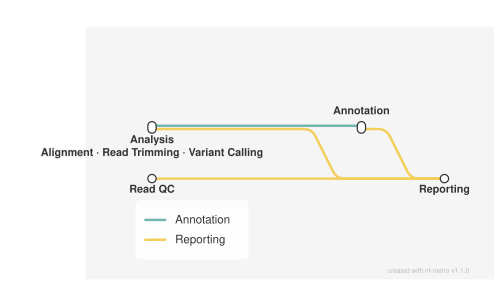

# Viral assembly and intrahost variant calling for Illumina amplicon data

<div class="ox-page-badges"><span class="ox-badge ox-badge--live">✔ Live-tested · default-path</span> <span class="ox-badge ox-badge--origin">⇄ Official port</span> <span class="ox-badge ox-badge--nf"><span class="dot"></span>nf-core port</span></div>

Turns paired-end Illumina amplicon reads into a complete viral genomics report: read QC and trimming (FastQC, fastp), host-sequence removal (Kraken2), alignment to a user-provided reference genome (Bowtie2), primer trimming, intrahost variant calling and annotation (iVar, snpEff/SnpSift), consensus building with low-coverage masking (bcftools), lineage assignment and deconvolution (Pangolin, Nextclade, Freyja), de novo assembly with QC (SPAdes, Bandage, BLAST, QUAST, ABACAS), and a single MultiQC report.

| | |
|---:|---|
| **Rating** | ✔ Live-tested |
| **Origin** | port |
| **Domain** | genomics |
| **Rules** | 51 |
| **Compute** | up to 12 CPUs / 72 GB per rule |
| **Tools** | abacas · bandage · bcftools · bedtools · blast · bowtie2 · cutadapt · fastp · fastqc · freyja · htslib · ivar · kraken2 · mosdepth · multiqc · nextclade · pangolin · picard · pigz · python · quast · r · samtools · snpeff · snpsift · spades |
| **Ported** | 2026-08-15 |
| **License** | Apache-2.0 |
| **Source** | [nf-core/viralrecon](https://github.com/nf-core/viralrecon) |
| **Pinned version** | `3.0.0` |

## Run it

```bash
oxo-flow run main.oxoflow --samples first:1
```

Needs a reference genome bundle — see Requirements; `--samples first:1` runs a single sample.

## Installation

**Engine.** oxo-flow >= 0.12.0

**Toolchain.** conda envs — pinned versions (envs/*.yaml, conda-forge + bioconda channels; no containers)

**Requirements.**
- reference genome FASTA and annotation GFF (config.fasta / config.gff) — uncompressed by default, or set fasta_ends_gz / gff_ends_gz
- primer scheme BED for the amplicon protocol (config.primer_bed)
- Kraken2 host-removal database as a tar.gz (config.kraken2_db)
- Pangolin data directory (config.pango_database) and Freyja barcodes/lineages CSVs (config.freyja_barcodes / config.freyja_lineages)
- Nextclade dataset: downloaded automatically by default; set config.nextclade_dataset to a local dataset directory to skip the download
- paired-end Illumina FASTQs at <raw_dir>/<sample>_R1.fastq.gz and _R2.fastq.gz (config.raw_dir)
- compute: up to 12 CPUs / 72 GB per rule (resource pool queues rather than oversubscribes)
- conda or mamba to build the pinned per-rule environments

```bash
# 1. install oxo-flow (release binary, recommended)
curl -fL -o oxo-flow.tar.gz https://github.com/Traitome/oxo-flow/releases/latest/download/oxo-flow-latest-x86_64-unknown-linux-gnu.tar.gz
tar xzf oxo-flow.tar.gz && sudo mv oxo-flow /usr/local/bin/
#    or, via conda (may lag behind releases):
#    conda install -c bioconda oxo-flow-cli
#    NOTE: bioconda currently ships 0.10.2, older than the >= 0.12.0
#    minimum of every catalog entry — prefer the release binary.

# 2. get this workflow (clones the repo, auto-discovers the workflow,
#    sanity-parses it with the engine)
oxo-flow pull gh:oxo-flow-community/oxo-flow-viralrecon
#    (alternative: plain git clone)
#    git clone https://github.com/oxo-flow-community/oxo-flow-viralrecon
```

## Parameters

| Parameter | Default | Description | Used by |
|---:|---|---|---|
| `assemblers` | `spades` | Assembly (only the upstream default 'spades' assembler is ported) | — |
| `consensus_caller` | `bcftools` | — | `consensus_call`, `consensus_filter` |
| `fasta` | `reference/genome.fa` | The port expects uncompressed files at these paths. Set the *_ends_gz keys to true to run the upstream GUNZIP_* steps first (outputs land at the same fixed reference/ paths). | `gunzip_fasta` |
| `fasta_ends_gz` | `false` | — | `gunzip_fasta` |
| `freyja_barcodes` | `test/fixtures/refs/freyja_barcodes.csv` | --- Freyja (upstream --freyja_barcodes / --freyja_lineages. FREYJA_UPDATE, the network download, is not ported.) --- | `freyja_boot`, `freyja_demix` |
| `freyja_depthcutoff` | `0` | — | `freyja_boot`, `freyja_demix` |
| `freyja_lineages` | `test/fixtures/refs/freyja_lineages.json` | freyja's meta format is the curated_lineages JSON (buildLineageMap json.loads it — live: the CSV default died in freyja boot with JSONDecodeError); the CSV sibling is kept as the barcodes-side table | `freyja_boot`, `freyja_demix` |
| `freyja_repeats` | `100` | — | `freyja_boot` |
| `gff` | `reference/genome.gff` | — | `gunzip_gff` |
| `gff_ends_gz` | `false` | — | `gunzip_gff` |
| `ivar_trim_noprimer` | `false` | — | `ivar_trim` |
| `ivar_trim_offset` | `` | — | `ivar_trim` |
| `kraken2_assembly_host_filter` | `true` | — | `assembly_fastq` |
| `kraken2_db` | `reference/kraken2_db.tar.gz` | Kraken2 host-removal database (upstream --kraken2_db, tar.gz) | `untar_kraken2_db` |
| `kraken2_variants_host_filter` | `false` | — | — |
| `min_contig_length` | `200` | Consensus QC | `blast_assembly` |
| `min_mapped_reads` | `1000` | — | — |
| `min_perc_contig_aligned` | `0.7` | — | `blast_assembly` |
| `multiqc_title` | `` | MultiQC | `multiqc` |
| `nextclade_dataset` | `` | Nextclade dataset (upstream genome config for MN908947.3) | `get_nextclade_dataset` |
| `nextclade_dataset_name` | `sars-cov-2` | — | `get_nextclade_dataset` |
| `nextclade_dataset_tag` | `2024-10-17--16-48-48Z` | — | `get_nextclade_dataset` |
| `out_dir` | `results` | — | `fastqc_primers`, `fastqc_raw`, `fastqc_trim`, `multiqc` |
| `pango_database` | `test/fixtures/refs/pangolin_db` | --- Pangolin (upstream --pango_database; a directory. PANGOLIN_UPDATEDATA, the network download of the data directory, is not ported.) --- | `pangolin` |
| `platform` | `illumina` | Platform / protocol | `multiqc` |
| `primer_bed` | `reference/primers.bed` | — | `gunzip_primer_bed` |
| `primer_bed_ends_gz` | `false` | — | `gunzip_primer_bed` |
| `primer_left_suffix` | `_LEFT` | Primer trimming for assembly | `collapse_primers` |
| `primer_right_suffix` | `_RIGHT` | — | `collapse_primers` |
| `protocol` | `amplicon` | — | `bam_sort_index_trimmed`, `call_variants_ivar`, `collapse_primers`, `consensus_call`, `consensus_filter`, `cutadapt`, `fastqc_primers`, `freyja_boot`, `freyja_demix`, `freyja_variants`, `get_primer_fasta`, `ivar_to_vcf`, `ivar_trim`, `mosdepth_amplicon`, `mosdepth_genome`, `nextclade`, `nextclade_clade_mqc`, `pangolin`, `picard_metrics`, `plot_base_density`, `plot_mosdepth_amplicon`, `plot_mosdepth_genome`, `prepare_primer_fasta`, `quast_consensus`, `snpeff_ann`, `snpsift_extract`, `sort_vcf`, `variants_long_table` |
| `raw_dir` | `test/fixtures/raw` | Directory holding raw/<sample>_R1.fastq.gz + raw/<sample>_R2.fastq.gz. The repo default ships the tiny test fixtures; point this at your data. | `cat_fastq`, `fastqc_raw` |
| `save_mpileup` | `false` | — | — |
| `save_trimmed_fail` | `false` | — | — |
| `save_unaligned` | `false` | — | — |
| `skip_abacas` | `false` | — | `abacas` |
| `skip_assembly` | `false` | — | `abacas`, `assemble_spades`, `bandage`, `blast_assembly`, `cutadapt`, `fastqc_primers`, `get_primer_fasta`, `make_blast_db`, `prepare_primer_fasta`, `quast_assembly` |
| `skip_assembly_quast` | `false` | — | `quast_assembly` |
| `skip_bandage` | `false` | — | `bandage` |
| `skip_blast` | `false` | — | `blast_assembly`, `make_blast_db` |
| `skip_consensus` | `false` | — | `consensus_call`, `consensus_filter`, `get_nextclade_dataset`, `nextclade`, `nextclade_clade_mqc`, `pangolin`, `plot_base_density`, `quast_consensus` |
| `skip_consensus_plots` | `false` | — | `plot_base_density` |
| `skip_cutadapt` | `false` | — | `cutadapt`, `fastqc_primers`, `get_primer_fasta`, `prepare_primer_fasta` |
| `skip_fastp` | `false` | — | `fastp`, `fastqc_trim` |
| `skip_fastqc` | `false` | Skip flags (identical defaults to upstream params) | `fastqc_primers`, `fastqc_raw`, `fastqc_trim` |
| `skip_freyja` | `false` | — | `freyja_boot`, `freyja_demix`, `freyja_variants` |
| `skip_freyja_boot` | `false` | — | `freyja_boot` |
| `skip_ivar_trim` | `false` | — | `bam_sort_index_trimmed`, `ivar_trim` |
| `skip_kraken2` | `false` | — | `assembly_fastq`, `kraken2`, `untar_kraken2_db` |
| `skip_markduplicates` | `true` | — | — |
| `skip_mosdepth` | `false` | — | `collapse_primers`, `mosdepth_amplicon`, `mosdepth_genome`, `plot_mosdepth_amplicon`, `plot_mosdepth_genome` |
| `skip_nextclade` | `false` | — | `get_nextclade_dataset`, `nextclade`, `nextclade_clade_mqc` |
| `skip_noninternal_primers` | `false` | — | `prepare_primer_fasta` |
| `skip_pangolin` | `false` | — | `pangolin` |
| `skip_picard_metrics` | `false` | — | `picard_metrics` |
| `skip_plasmidid` | `true` | — | — |
| `skip_snpeff` | `false` | — | `build_snpeff_db`, `snpeff_ann`, `snpsift_extract`, `variants_long_table` |
| `skip_variants` | `false` | — | `align_bowtie2`, `bam_sort_index`, `bam_sort_index_trimmed`, `build_bowtie2_index`, `build_snpeff_db`, `call_variants_ivar`, `collapse_primers`, `freyja_boot`, `freyja_demix`, `freyja_variants`, `ivar_to_vcf`, `ivar_trim`, `mosdepth_amplicon`, `mosdepth_genome`, `picard_metrics`, `plot_mosdepth_amplicon`, `plot_mosdepth_genome`, `snpeff_ann`, `snpsift_extract`, `sort_vcf`, `variants_long_table` |
| `skip_variants_long_table` | `false` | — | `variants_long_table` |
| `skip_variants_quast` | `false` | — | `quast_consensus` |
| `spades_mode` | `rnaviral` | — | `assemble_spades` |
| `threeprime_adapters` | `false` | — | — |
| `variant_caller` | `ivar` | --- Variant calling (upstream params.variant_caller defaults to 'ivar' for the amplicon protocol; the bcftools variant-caller branch is not ported) --- | `call_variants_ivar`, `ivar_to_vcf`, `sort_vcf` |

Descriptions are the workflow's own `#` comments from its `[config]` section, surfaced by `oxo-flow info` — no schema file to maintain.

## Workflow graph

<div class="ox-dag-card" markdown="1">



</div>

The graph is derived at catalog-build time from `oxo-flow graph -f dot` and rendered with Graphviz. It shows the workflow at rule level: wildcard `{sample}` instances expand at run time when sample data is discovered (the runtime view is `oxo-flow graph --expanded`).

## Scope

The default-parameters main path of the source pipeline was ported rule-for-rule; alternate paths are documented as excluded.

**In scope**

- gunzip_fasta
- gunzip_gff
- gunzip_primer_bed
- prepare_genome
- untar_kraken2_db
- collapse_primers
- get_primer_fasta
- build_bowtie2_index
- get_nextclade_dataset
- make_blast_db
- build_snpeff_db
- cat_fastq
- fastqc_raw
- fastp
- fastqc_trim
- kraken2
- align_bowtie2
- bam_sort_index
- ivar_trim
- bam_sort_index_trimmed
- picard_metrics
- mosdepth_genome
- plot_mosdepth_genome
- mosdepth_amplicon
- plot_mosdepth_amplicon
- freyja_variants
- freyja_demix
- freyja_boot
- call_variants_ivar
- ivar_to_vcf
- sort_vcf
- snpeff_ann
- snpsift_extract
- consensus_filter
- consensus_call
- quast_consensus
- pangolin
- nextclade
- plot_base_density
- nextclade_clade_mqc
- variants_long_table
- assembly_fastq
- prepare_primer_fasta
- cutadapt
- fastqc_primers
- assemble_spades
- bandage
- blast_assembly
- quast_assembly
- abacas
- multiqc

**Excluded**

- nanopore platform branch (ARTIC_GUPPYPLEX, ARTIC_MINION, NANOPLOT, PYCOQC, VCFLIB_VCFUNIQ, PREPARE_GENOME_NANOPORE) — illumina only
- variant_caller='bcftools' branch (VARIANTS_BCFTOOLS subworkflow: BCFTOOLS_MPILEUP, BCFTOOLS_NORM, BCFTOOLS_MPILEUP_FILTER, custom filter scripts) — non-default; only the iVar caller (the amplicon default) is ported
- consensus_caller='ivar' branch (CONSENSUS_IVAR subworkflow: IVAR_CONSENSUS) — non-default; only bcftools consensus (the default) is ported
- wgs (shotgun) protocol variant branch — the port runs the amplicon protocol gates (primer trimming, collapsed-primer mosdepth); non-amplicon variant calling is not ported
- unicycler and minia assemblers (ASSEMBLY_UNICYCLER / ASSEMBLY_MINIA subworkflows) — assemblers is fixed to the upstream default 'spades'
- PICARD_MARKDUPLICATES — skip_markduplicates defaults to true upstream and in this port
- PLASMIDID — skip_plasmidid defaults to true upstream and in this port
- KRAKEN2_BUILD — upstream downloads the human host database over the network; this port takes a local kraken2_db tar.gz (empty-stub fixture provided)
- FREYJA_UPDATE — upstream downloads barcodes/lineages over the network; this port takes config.freyja_barcodes / config.freyja_lineages (fixtures provided)
- PANGOLIN_UPDATEDATA — upstream downloads the pangolin data directory over the network; this port takes config.pango_database (fixture placeholder provided)
- ADDITIONAL_ANNOTATION — off by default upstream (params.additional_annotation is empty)
- channel-level runtime filters — the fastp reads-after-filtering empty check, the min_mapped_reads flagstat gate, the zero-variant-sample filter and optional-file existence gates have no oxo-flow equivalent (documented deviations)
- save_* extra outputs — save_unaligned, save_trimmed_fail, save_mpileup, save_ivar_trimmed_bam and the other save_* flags are off by default upstream and not ported
- MultiQC extras — the multiqc_data/versions.yml software table and *_plots directory are not emitted; the port keeps the report HTML, the data directory and the variants/assembly metrics CSVs

## Fidelity

Every upstream process and subworkflow on the default path, and what happened
to it in this port:

| Upstream process (module) | Port rule | Notes |
| --- | --- | --- |
| CAT_FASTQ | `cat_fastq` | `cat` to `fastp/{sample}_{1,2}.fastq.gz` |
| FASTQC_RAW | `fastqc_raw` | same args; upstream input-rename step kept (reads symlinked to `{sample}_{1,2}.fastq.gz` before FastQC so output names match), then renamed into `results/fastqc/raw/` |
| FASTP | `fastp` | `ext.args` baked in verbatim (cut_front/cut_tail/trim_poly_x/cut_mean_quality 30/...) + `--detect_adapter_for_pe`, `2>| >(tee log >&2)` |
| FASTQC_TRIM | `fastqc_trim` | same args; upstream input-rename step kept (trimmed reads symlinked to `{sample}_{1,2}.fastq.gz` before FastQC), then renamed into `results/fastqc/trim/` |
| KRAKEN2_KRAKEN2 | `kraken2` | `--db` (local), `--report-zero-counts`, pigz of classified/unclassified pairs; gated on `skip_kraken2` |
| (channel wiring) | `assembly_fastq` | passthrough of fastp reads to `kraken2/{sample}.unclassified_*.fastq.gz` when host filtering is off — replaces upstream `ch_assembly_fastq = ch_variants_fastq`; see deviations |
| BOWTIE2_ALIGN | `align_bowtie2` | index found by `find -L` on `*.rev.1.bt2[l]`, `--local --very-sensitive-local --seed 1`, unmapped-filtered `samtools view -F4`, log tee'd |
| IVAR_TRIM | `ivar_trim` | `-m 30 -q 20 -e` (noprimer-gated), optional `-x offset`, log captured; gated amplicon |
| BAM_SORT_STATS_SAMTOOLS | `bam_sort_index_trimmed` | merged: `samtools cat` (single input, dropped) → sort → index → stats/flagstat/idxstats |
| (align branch) | `bam_sort_index` | same merged trio for the untrimmed BAM |
| PICARD_MARKDUPLICATES | — | excluded: `skip_markduplicates=true` by default |
| PICARD_COLLECTMULTIPLEMETRICS | `picard_metrics` | `-Xmx4800M` (= 6 GB task × 0.8), LENIENT, `--TMP_DIR tmp`, all 5 metric files + pdf |
| MOSDEPTH_AMPLICON | `mosdepth_amplicon` | `--fast-mode --use-median --thresholds 0,1,10,50,100,500 --by collapsed.bed` |
| MOSDEPTH_GENOME | `mosdepth_genome` | `--fast-mode --by 200` |
| PLOT_MOSDEPTH_REGIONS (×2) | `plot_mosdepth_genome` / `plot_mosdepth_amplicon` | glob-gather over `*.regions.bed.gz`, `all_samples.mosdepth.*` outputs |
| FREYJA_VARIANTS | `freyja_variants` | `--ref --variants --depths` |
| FREYJA_DEMIX | `freyja_demix` | `--output --barcodes --meta`, `--depthcutoff` when non-zero |
| FREYJA_BOOT | `freyja_boot` | `--nt --nb {freyja_repeats} --boxplot pdf`, boot outputs renamed to `{sample}.lineages.csv` / `{sample}_summarized.csv` |
| IVAR_VARIANTS | `call_variants_ivar` | `samtools mpileup` (`--ignore-overlaps --count-orphans --no-BAQ --max-depth 0 --min-BQ 0`) \| `ivar variants -t 0.25 -q 20 -m 10 -g -r -p` |
| IVAR_VARIANTS_TO_VCF | `ivar_to_vcf` | `--ignore_strand_bias`, variant-counts log + header-cat MQC tsv |
| BCFTOOLS_SORT | `sort_vcf` | `--output --temp-dir .` (default `--output-type z`); process_medium label (6c/36 GB/8 h) |
| VCF_TABIX_STATS | `sort_vcf` | merged: tabix (`--threads -p vcf -f`) + `bcftools stats` |
| SNPEFF_ANN | `snpeff_ann` | `-Xmx36g`, `-config/-dataDir` locals, `-csvStats`, summary html move |
| VCF_BGZIP_TABIX_STATS | `snpeff_ann` | merged: bgzip + tabix + `bcftools stats` |
| SNPSIFT_EXTRACTFIELDS | `snpsift_extract` | same ANN[*]/EFF[*] field list, `-s "," -e "."` |
| BCFTOOLS_FILTER | `consensus_filter` | `--include 'FORMAT/ALT_FREQ >= 0.75'` |
| TABIX_TABIX | `consensus_filter` | merged |
| MAKE_BED_MASK | `consensus_call` | merged: mpileup `-a` + awk low-coverage (<10) positions + `make_bed_mask.py` |
| BEDTOOLS_MERGE | `consensus_call` | merged |
| BEDTOOLS_MASKFASTA | `consensus_call` | merged |
| BCFTOOLS_CONSENSUS | `consensus_call` | `cat fasta \| bcftools consensus` |
| RENAME_FASTA_HEADER | `consensus_call` | `sed "s/>/>{sample} /g"` (byte-identical to upstream) |
| QUAST (consensus) | `quast_consensus` | `-r --features --threads`, report.tsv symlink; batch run over the whole cohort into one `quast.consensus/` dir — upstream runs one QUAST per sample (`ext.prefix` → per-sample dirs), so MultiQC shows one aggregated sample row here instead of per-sample rows (numeric results equivalent) |
| PANGOLIN_RUN | `pangolin` | `XDG_CACHE_HOME=/tmp/.cache`, `--datadir --outfile --threads` |
| NEXTCLADE_RUN | `nextclade` | `--jobs --input-dataset --output-all --output-basename` |
| PLOT_BASE_DENSITY | `plot_base_density` | same script args, `base_qc/` outputs |
| (channel code) | `nextclade_clade_mqc` | upstream builds `nextclade_clade_mqc.tsv` in Nextflow channel code (`getNextcladeFieldMapFromCsv` + `multiqcTsvFromList`); ported as an inline python gather over the per-sample CSVs |
| BCFTOOLS_QUERY | `variants_long_table` | `-H -f '%CHROM\t%POS...'` per sample |
| MAKE_VARIANTS_LONG_TABLE | `variants_long_table` | merged with query; symlink-collect pattern, `--variant_caller ivar` |
| PREPARE_PRIMER_FASTA | `prepare_primer_fasta` | `sed -r '/^[ACTGactg]+$/ s/^/X/g'` |
| CUTADAPT | `cutadapt` | `-Z --cores --overlap 5 --minimum-length 30 --error-rate 0.1 -g file: -G file:` |
| FASTQC (assembly) | `fastqc_primers` | prefix `{sample}.primer_trim` via symlink rename |
| SPADES | `assemble_spades` | `--{config.spades_mode} --memory 72` (upstream `ext.args`; default `rnaviral`), output renames (scaffolds/contigs/gfa gzipped, spades.log) |
| BANDAGE_IMAGE | `bandage` | `--height 1000`, png + svg; upstream GUNZIP_GFA merged in (Bandage 0.9.0 cannot read `.gz` graphs — `gzip -cd` to `{sample}.assembly.gfa` first) |
| BLAST_BLASTN | `blast_assembly` | `-outfmt '6 stitle staxids std slen qlen qcovs'`, DB `find -L *.nin`, header-cat |
| FILTER_BLASTN | `blast_assembly` | merged: awk `$16 > min_contig_length && $18 > min_perc_contig_aligned && $1 !~ /phage/` + header-cat |
| QUAST (assembly) | `quast_assembly` | gunzip of scaffolds in shell, `quast.spades/` dir + tsv symlink; batch run over the whole cohort into one `quast.spades/` dir — upstream runs one QUAST per sample (per-sample `S1.spades/` dirs), so MultiQC shows one aggregated sample row here instead of per-sample rows (numeric results equivalent) |
| ABACAS | `abacas` | `-m -p nucmer`, sorted `.bin`, nucmer delta/filtered/tiling + unused contigs moves |
| GUNZIP_FASTA/GFF/PRIMER_BED | `gunzip_fasta/gff/primer_bed` | gated on `*_ends_gz`; output to fixed `reference/` paths |
| UNTAR_KRAKEN2_DB | `untar_kraken2_db` | upstream single-top-level-dir strip logic kept + upstream `ext.args2 --no-same-owner` on both tar invocations |
| CUSTOM_GETCHROMSIZES | `prepare_genome` | `samtools faidx` + `cut -f 1,2` |
| COLLAPSE_PRIMERS | `collapse_primers` | `--left_primer_suffix/--right_primer_suffix`; process_medium label (6c/36 GB/8 h) |
| BEDTOOLS_GETFASTA | `get_primer_fasta` | `-s -nameOnly` |
| BOWTIE2_BUILD | `build_bowtie2_index` | `--seed 1 --threads`; process_high label (12c/72 GB/16 h) |
| NEXTCLADE_DATASETGET | `get_nextclade_dataset` | `--name sars-cov-2 --tag 2024-10-17--16-48-48Z` (v3pl tag of the MN908947.3 genome config); skips when a local `nextclade_dataset` path is set |
| BLAST_MAKEBLASTDB | `make_blast_db` | `-parse_seqids -dbtype nucl` |
| SNPEFF_BUILD | `build_snpeff_db` | `-Xmx12g`, `-gff3`, genomes/genome symlinks, `snpeff.config` echo |
| MULTIQC | `multiqc` | both passes kept (parse pass + `-e general_stats --ignore *nextclade_clade_mqc.tsv` final pass), `grep -q ">skip_assembly<"` / `>skip_variants<` / `platform=illumina` rm rules, `multiqc_config_illumina.yml`; inputs mirror upstream `ch_multiqc_files` — snpeff `-csvStats` per-sample csv added (SnpEff section), mosdepth fed as genome `global.dist.txt` (distribution plots) + amplicon `all_samples.mosdepth.coverage.tsv` (heatmap), with the genome `summary.txt` additionally kept for the General Stats table (the inert genome coverage.tsv and amplicon per-sample summary.txt are not fed) |
| multiqc_to_custom_csv.py | `multiqc` | merged, `--platform illumina` → `variants_metrics_mqc.csv` / `assembly_metrics_mqc.csv` |

Excluded branches (not on the default path; see metadata.json for the full
list): nanopore platform (ARTIC_GUPPYPLEX/ARTIC_MINION/NANOPLOT/PYCOQC/
VCFLIB_VCFUNIQ), `variant_caller='bcftools'`, `consensus_caller='ivar'`,
unicycler/minia assemblers, PICARD_MARKDUPLICATES, PLASMIDID, and the
network-download processes KRAKEN2_BUILD / FREYJA_UPDATE / PANGOLIN_UPDATEDATA
/ ADDITIONAL_ANNOTATION.

### Documented deviations

Everything below has no oxo-flow equivalent and is the closest faithful
approximation; none silently change results:

1. **Channel-level runtime filters are not ported.** The upstream
   `process_trim_fastq` filter (drop samples with 0 reads after fastp), the
   `min_mapped_reads` flagstat gate before variant calling, the
   zero-variant-sample filter and optional-file existence gates run in
   Nextflow channel code, not in a process. `min_mapped_reads` still exists as
   config for documentation but has no effect. Rule shells run unconditioned
   on their inputs.
2. **Kraken2 host-filter routing.** When Kraken2 runs with
   `kraken2_assembly_host_filter=false`, upstream routes the assembly branch
   to the fastp reads (channel wiring) while Kraken2 still writes its
   unclassified FASTQs. The port models this with the `assembly_fastq`
   passthrough rule, which overwrites the `kraken2/` unclassified paths with
   copies of the fastp reads (it runs after `kraken2` when both are active, so
   the content is deterministic).
3. **`nextclade_clade_mqc.tsv`** is built by inline python instead of Nextflow
   channel code (same input CSVs, same output columns).
4. **`min_contig_length` / `min_perc_contig_aligned`** are used directly in the
   BLAST filter awk expression (upstream interpolates the same params).
5. **Condensed environments.** Rules that merge several upstream processes
   consolidate their conda envs. Exact pins are kept; only conflicts are
   resolved: `sed` 4.8 (cat/fastq, gunzip, untar) vs 4.9 (prepare_primer_fasta,
   filter_blastn, rename_fasta_header) → 4.8 in `coreutils.yaml`, 4.9 in
   `blast.yaml`/`consensus.yaml`; make_bed_mask's samtools 1.14 → 1.22.1 in
   `consensus.yaml`; tabix's htslib 1.21 → 1.22.1 in `bcftools.yaml`;
   r-base 4.2 → 4.2.0 in `r.yaml`; mosdepth's build string
   `=0.3.11=h0ec343a_1` → `=0.3.11` for cross-platform resolution.
6. **MultiQC extras** (`multiqc_data/versions.yml`, `*_plots` directory) are
   not emitted; the report HTML, data directory and the two metrics CSVs are.
7. **QUAST/ABACAS/Bandage inputs** gated by upstream `file(...)` existence
   checks (e.g. empty scaffolds) run unconditionally in the port; on the
   fixture and real data the files always exist.

### Resources

Resource labels map 1:1 to upstream `withLabel` profiles: `process_single`
(1c/6 GB/4 h), `process_low` (2c/12 GB/4 h), `process_medium`
(6c/36 GB/8 h), `process_high` (12c/72 GB/16 h). Fastp/SPAdes memory and
`-Xmx` JVM sizes are derived from the same values as upstream.

## Links

- Repository: [oxo-flow-viralrecon](https://github.com/oxo-flow-community/oxo-flow-viralrecon)
- Upstream: [nf-core/viralrecon](https://github.com/nf-core/viralrecon) @ `3.0.0`
- License: Apache-2.0 (this workflow) · MIT (upstream)

Created on 2026-08-15 — this port may lag behind upstream releases. See the repository's NOTICE for full attribution.
